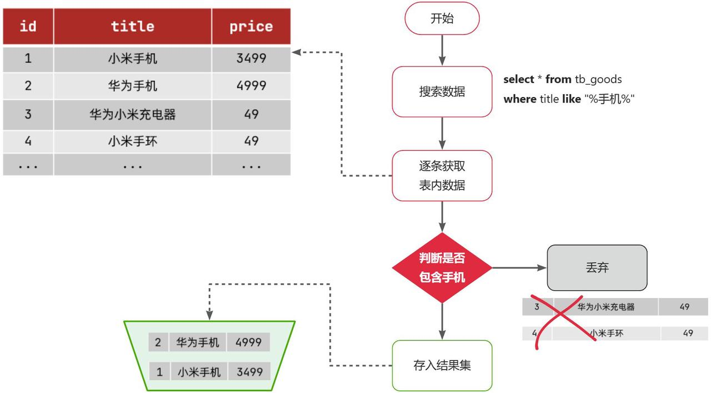
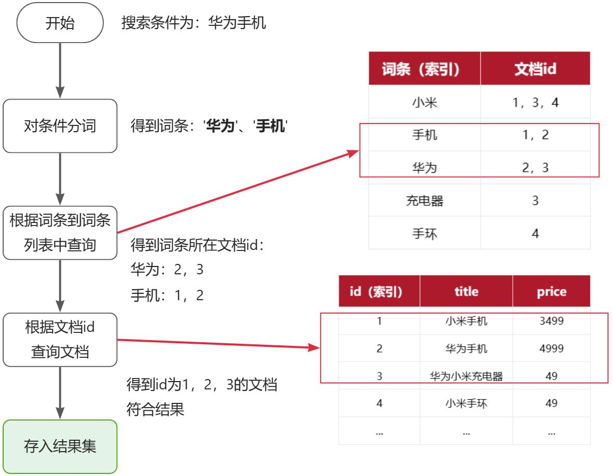
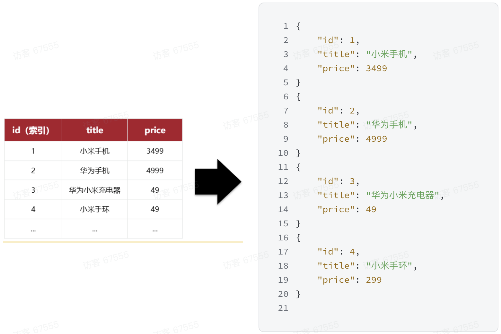
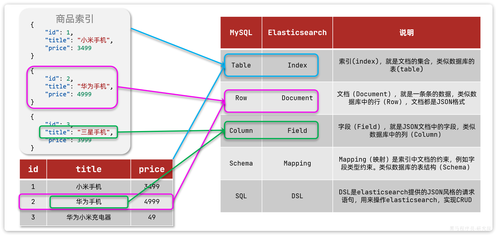
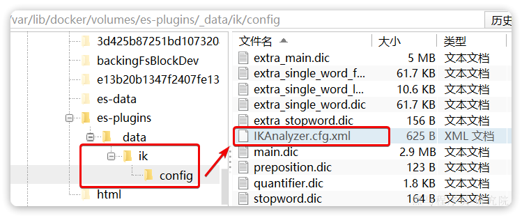

# Elasticsearch

## 1、概念

### 1.1、介绍

Elasticsearch（ES） 是由 elastic 公司开发的一套搜索引擎技术，它是 elastic 技术栈中的一部分。完整的技术栈包括：

- ES：用于数据存储、计算和搜索
- Logstash/Beats：用于数据收集
- Kibana：用于数据可视化

整套技术栈被称为 ELK，经常用来做日志收集、系统监控和状态分析等。技术栈的核心就是用来**存储**、**搜索**、**计算**的 ES。

Kibana 是 elastic 公司提供的用于操作 ES 的可视化控制台。它的功能非常强大，包括：

- 对 ES 数据的搜索、展示
- 对 ES 数据的统计、聚合，并形成图形化报表、图形
- 对 ES 的集群状态监控
- 它还提供了一个开发控制台（DevTools），在其中对 ES 的 Restful 的 API 接口提供了**语法提示**

### 1.2、安装

#### 1.2.1、docker 安装

##### 安装 es8

命令：

```sh
docker run -d --name es8 \
  -e "ES_JAVA_OPTS=-Xms512m -Xmx512m" \
  -e "discovery.type=single-node" \
  -v /data/es8/data:/usr/share/elasticsearch/data \
  -v /data/es8/config:/usr/share/elasticsearch/config \
  -v /data/es8/plugins:/usr/share/elasticsearch/plugins \
  --privileged \
  --network es-net \
  -p 9200:9200 \
  -p 9300:9300 \
elasticsearch:8.12.2
```

说明：

1. `ES_JAVA_OPTS`: 环境变量，设置内置JVM启动参数
2. `discovery.type`: 环境变量，设置为在单节点环境下运行
3. `/data/es8/data`: 映射数据卷
4. `/data/es8/config`: 映射配置卷
5. `/data/es8/plugins`: 映射插件卷
6. `privileged`: 赋予宿主机权限
7. `network`: 指定运行网络
8. `9200`: api 操作 es 端口
9. `9300`: es 节点之间通信及数据传输端口

配置：

es8.0 以上默认开启了 ssl 认证，需要 https 访问或者关闭 SSL 认证。

容器配置文件：`/usr/share/elasticsearch/config/elasticsearch.yml`

- 默认 https 访问，当前版本自带证书，kibana 也需要配置证书
- 关闭 ssl 认证，使用 http 访问
  - `xpack.security.http.ssl: enabled: false`
  - 新增用户：`elasticsearch-users useradd admin`
  - 添加权限：`elasticsearch-users roles -a superuser admin`, `elasticsearch-users roles -a kibana_system admin`

- 关闭鉴权
  - `xpack.security.enabled: false`

##### 安装 kibana

命令：

```sh
docker run -d --name kb8 \
  -e ELASTICSEARCH_HOSTS=http://es8:9200 \
  -v /data/kb8/config:/usr/share/kibana/config \
  --network=es-net \
  -p 5601:5601 \
kibana:8.12.2
```

说明：

1. `ELASTICSEARCH_HOSTS`: 环境变量，设置es访问地址
2. `/data/kb8/config`: 映射配置卷
3. `network`: 指定运行网络
4. `5601`: web 访问端口

配置：

容器配置文件路径：`/usr/share/kibana/config/kibana.yml`

- 默认 csp 模式为 true，会对浏览器进行安全检查
  - 配置文件添加用户名密码 `elasticsearch.username: adminelasticsearch.password: Pass1234`
- 可关闭 csp 模式，配置文件添加 `csp.strict: false`

### 1.3、倒排索引

ES 之所以有如此高性能的搜索表现，正是得益于底层的倒排索引技术。

**倒排**索引的概念是基于 MySQL 这样的**正向**索引而言的。

#### 1.3.1、正向索引

我们先来回顾一下正向索引。

例如有一张名为`tb_goods`的表：

| **id** | **title**      | **price** |
| :----- | :------------- | :-------- |
| 1      | 小米手机       | 3499      |
| 2      | 华为手机       | 4999      |
| 3      | 华为小米充电器 | 49        |
| 4      | 小米手环       | 49        |
| ...    | ...            | ...       |

其中的`id`字段已经创建了索引，由于索引底层采用了B+树结构，因此我们根据id搜索的速度会非常快。但是其他字段例如`title`，只在叶子节点上存在。

因此要根据`title`搜索的时候只能遍历树中的每一个叶子节点，判断title数据是否符合要求。

比如用户的SQL语句为：

```SQL
select * from tb_goods where title like '%手机%';
```

那搜索的大概流程如图：



说明：

1. 检查到搜索条件为`like '%手机%'`，需要找到`title`中包含`手机`的数据
2. 逐条遍历每行数据（每个叶子节点），比如第1次拿到`id`为1的数据
3. 判断数据中的`title`字段值是否符合条件
4. 如果符合则放入结果集，不符合则丢弃
5. 回到步骤1

综上，根据id精确匹配时，可以走索引，查询效率较高。而当搜索条件为模糊匹配时，由于索引无法生效，导致从索引查询退化为全表扫描，效率很差。

因此，正向索引适合于根据索引字段的精确搜索，不适合基于部分词条的模糊匹配。

而倒排索引恰好解决的就是根据部分词条模糊匹配的问题。

#### 1.3.2、倒排索引

倒排索引中有两个非常重要的概念：

- 文档（`Document`）：用来搜索的数据，其中的每一条数据就是一个文档。例如一个网页、一个商品信息
- 词条（`Term`）：对文档数据或用户搜索数据，利用某种算法分词，得到的具备含义的词语就是词条。例如：我是中国人，就可以分为：我、是、中国人、中国、国人这样的几个词条

**创建倒排索引**是对正向索引的一种特殊处理和应用，流程如下：

- 将每一个文档的数据利用**分词算法**根据语义拆分，得到一个个词条
- 创建表，每行数据包括词条、词条所在文档id、位置等信息
- 因为词条唯一性，可以给词条创建**正向**索引

此时形成的这张以词条为索引的表，就是倒排索引表，两者对比如下：

**正向索引**

| **id（索引）** | **title**      | **price** |
| :------------- | :------------- | :-------- |
| 1              | 小米手机       | 3499      |
| 2              | 华为手机       | 4999      |
| 3              | 华为小米充电器 | 49        |
| 4              | 小米手环       | 49        |
| ...            | ...            | ...       |

**倒排索引**

| **词条（索引）** | **文档id** |
| :--------------- | :--------- |
| 小米             | 1，3，4    |
| 手机             | 1，2       |
| 华为             | 2，3       |
| 充电器           | 3          |
| 手环             | 4          |

倒排索引的**搜索流程**如下（以搜索"华为手机"为例），如图：



流程描述：

1. 用户输入条件`"华为手机"`进行搜索。
2. 对用户输入条件**分词**，得到词条：`华为`、`手机`。

3. 拿着词条在倒排索引中查找（**由于词条有索引，查询效率很高**），即可得到包含词条的文档id：`1、2、3`。

4. 拿着文档`id`到正向索引中查找具体文档即可（由于`id`也有索引，查询效率也很高）。

虽然要先查询倒排索引，再查询倒排索引，但是无论是词条、还是文档id都建立了索引，查询速度非常快！无需全表扫描。

#### 1.3.3、正向和倒排

那么为什么一个叫做正向索引，一个叫做倒排索引呢？

- **正向索引**是最传统的，根据id索引的方式。但根据词条查询时，必须先逐条获取每个文档，然后判断文档中是否包含所需要的词条，是**根据文档找词条的过程**。
- 而**倒排索引**则相反，是先找到用户要搜索的词条，根据词条得到保护词条的文档的id，然后根据id获取文档。是**根据词条找文档的过程**。

是不是恰好反过来了？

那么两者方式的优缺点是什么呢？

**正向索引**：

- 优点：
  - 可以给多个字段创建索引
  - 根据索引字段搜索、排序速度非常快
- 缺点：
  - 根据非索引字段，或者索引字段中的部分词条查找时，只能全表扫描。

**倒排索引**：

- 优点：
  - 根据词条搜索、模糊搜索时，速度非常快
- 缺点：
  - 只能给词条创建索引，而不是字段
  - 无法根据字段做排序

### 1.4、文档和字段

ES 是面向**文档（Document）**存储的，可以是数据库中的一条商品数据，一个订单信息。文档数据会被序列化为`json`格式后存储：



因此，原本数据库中的一行数据就是 ES 中的一个 JSON 文档；而数据库中每行数据都包含很多列，这些列就转换为 JSON 文档中的**字段（Field）**。

### 1.5、索引和映射

随着业务发展，需要在es中存储的文档也会越来越多，比如有商品的文档、用户的文档、订单文档等。所有文档都散乱存放显然非常混乱，也不方便管理。因此，我们要将类型相同的文档集中在一起管理，称为**索引（Index）**。

所有用户文档，就可以组织在一起，称为用户的索引；所有商品的文档，可以组织在一起，称为商品的索引；所有订单的文档，可以组织在一起，称为订单的索引；因此，我们可以把索引当做是数据库中的表。

数据库的表会有约束信息，用来定义表的结构、字段的名称、类型等信息。因此，索引库中就有**映射（mapping）**，是索引中文档的字段约束信息，类似表的结构约束。

### 1.6、mysql与ES

我们统一的把 mysql 与 ES 的概念做一下对比：

| **MySQL** | **ES**   | **说明**                                                     |
| :-------- | :------- | :----------------------------------------------------------- |
| Table     | Index    | 索引(index)，就是文档的集合，类似数据库的表(table)           |
| Row       | Document | 文档（Document），就是一条条的数据，类似数据库中的行（Row），文档都是JSON格式 |
| Column    | Field    | 字段（Field），就是JSON文档中的字段，类似数据库中的列（Column） |
| Schema    | Mapping  | Mapping（映射）是索引中文档的约束，例如字段类型约束。类似数据库的表结构（Schema） |
| SQL       | DSL      | DSL是ES提供的JSON风格的请求语句，用来操作ES，实现CRUD        |



优势：

- Mysql：擅长事务类型操作，可以确保数据的安全和一致性
- ES：擅长海量数据的搜索、分析、计算

实际使用方式：

- 对安全性要求较高的写操作，使用 mysql 实现
- 对查询性能要求较高的搜索需求，使用 ES 实现
- 两者再基于某种方式，实现数据的同步，保证一致性

### 1.7、ES8新特性

从 2019 年 4 月 10 日 ES7.0，到 2022 年 2 月 11 日 ES8.0 版本的发布的近 3 年间，基于不断优化的开发设计理念，ES 发布了一系列的小版本。这些小版本在以下方面取得了长足的进步并同时引入一些全新的功能：

- 减少内存堆使用，完全支持 ARM 架构，引入全新的方式以使用更少的存储空间，从而让每个节点托管更多的数据
- 降低查询开销，在大规模部署中成效尤为明显
- 提高日期直方图和搜索聚合的速度，增强了页面缓存的性能，并创建了一个新的“pre-filter”搜索短语
- 在 ES 7.3 和 ES 7.4 版中，引入了对矢量相似函数的支持，在最新发布的 8.0 版本中，也同样增加和完善了很多新的功能
- 增加对自然语言处理 (NLP) 模型的原生支持，让矢量搜索功能更容易实现，让客户和员工能够使用他们自己的文字和语言来搜索并收到高度相关的结果。
- 直接在 ES 中执行命名实体识别、情感分析、文本分类等，而无需使用额外的组件或进行编码。
- ES 8.0 基于 Lucene 9.0 开发的，那些利用现代 NLP 的搜索体验，都可以借助（新增的）对近似最近邻搜索的原生支持，快速且大规模地实现。通过 ANN，可以快速并高效地将基于矢量的查询与基于矢量的文档语料库（无论是小语料库、大语料库还是巨型语料库）进行比较。
- 可以直接在 ES 中使用 PyTorch Machine Learning 模型（如 BERT），并在 ES 中原生使用这些模型执行推理。

### 1.8、IK分词器

ES 的关键就是倒排索引，而倒排索引依赖于对文档内容的分词，而分词则需要高效、精准的分词算法，IK 分词器就是这样一个中文分词算法。

#### 1.8.1、安装

##### **方案一**：在线安装

运行命令：

```Shell
docker exec -it es ./bin/elasticsearch-plugin install https://github.com/infinilabs/analysis-ik/releases/download/v8.12.2/elasticsearch-analysis-ik-8.12.2.zip
```

然后容器：

```Shell
docker restart es
```

##### **方案二**：离线安装

首先，查看之前安装的ES容器的plugins数据卷目录：

```Shell
docker volume inspect es-plugins
```

结果如下：

```JSON
[
    {
        "CreatedAt": "2024-11-06T10:06:34+08:00",
        "Driver": "local",
        "Labels": null,
        "Mountpoint": "/var/lib/docker/volumes/es-plugins/_data",
        "Name": "es-plugins",
        "Options": null,
        "Scope": "local"
    }
]
```

可以看到ES的插件挂载到了`/var/lib/docker/volumes/es-plugins/_data`这个目录。我们需要把IK分词器上传至这个目录。

最后，重启es容器：

```Shell
docker restart es
```

#### 1.8.2、使用

IK 分词器包含两种模式：

- `ik_smart`：智能语义切分
- `ik_max_word`：最细粒度切分

在 Kibana 的 DevTools 上来测试分词器

```JSON
POST /_analyze
{
  "analyzer": "standard",
  "text": "中华人民共和国viva"
}

POST /_analyze
{
  "analyzer": "ik_smart",
  "text": "中华人民共和国viva"
}

POST /_analyze
{
  "analyzer": "ik_max_word",
  "text": "中华人民共和国viva"
}
```

#### 1.8.3、拓展词典

IK 分词器无法对新出现的词汇进行分词，所以提供了扩展词汇的功能。

1. 打开IK分词器config目录：



注意，如果采用在线安装的通过，默认是没有config目录的，需要把课前资料提供的ik下的config上传至对应目录。

2. 在 IKAnalyzer.cfg.xml 配置文件内容添加：

```XML
<?xml version="1.0" encoding="UTF-8"?>
<!DOCTYPE properties SYSTEM "http://java.sun.com/dtd/properties.dtd">
<properties>
        <comment>IK Analyzer 扩展配置</comment>
        <!--用户可以在这里配置自己的扩展字典 *** 添加扩展词典-->
        <entry key="ext_dict">ext.dic</entry>
</properties>
```

3. 在 IK 分词器的 config 目录新建一个 `ext.dic`，可以参考 config 目录下复制一个配置文件进行修改

4. 重启 ES

```Shell
docker restart es
# 查看 日志
docker logs -f es
```

### 1.9、总结

分词器的作用是什么？

- 创建倒排索引时，对文档分词
- 用户搜索时，对输入的内容分词

IK分词器有几种模式？

- `ik_smart`：智能切分，粗粒度
- `ik_max_word`：最细切分，细粒度

IK分词器如何拓展词条？如何停用词条？

- 利用config目录的`IkAnalyzer.cfg.xml`文件添加拓展词典和停用词典
- 在词典中添加拓展词条或者停用词条

## 2、索引库操作

Index 就类似数据库表，Mapping 映射就类似表的结构。我们要向 es 中存储数据，必须先创建 Index 和 Mapping。

### 2.1、Mapping映射属性

Mapping 是对索引库中文档的约束，常见的 Mapping 属性包括：

- `type`：字段数据类型，常见的简单类型有：
  - 字符串：`text`（可分词的文本）、`keyword`（精确值，例如：品牌、国家、ip地址）
  - 数值：`long`、`integer`、`short`、`byte`、`double`、`float`、
  - 布尔：`boolean`
  - 日期：`date`
  - 对象：`object`
- `index`：是否创建索引，默认为`true`
- `analyzer`：使用哪种分词器
- `properties`：该字段的子字段

例如下面的json文档：

```JSON
{
    "age": 21,
    "weight": 52.1,
    "isMarried": false,
    "info": "程序员学习 elasticsearch 奥力给",
    "email": "zy@itcast.cn",
    "score": [99.1, 99.5, 98.9],
    "name": {
        "firstName": "云",
        "lastName": "赵"
    }
}
```

对应的每个字段映射（Mapping）：

| **字段名** | **字段类型** | **类型说明**       | 是否参与搜索 | 是否参与分词 | **分词器** |
| :--------- | :----------- | :----------------- | :----------- | :----------- | :--------- |
| age        | `integer`    | 整数               | √            | ×            | ——         |
| weight     | `float`      | 浮点数             | √            | ×            | ——         |
| isMarried  | `boolean`    | 布尔               | √            | ×            | ——         |
| info       | `text`       | 字符串，但需要分词 | √            | √            | IK         |
| email      | `keyword`    | 字符串，但是不分词 | √            | ×            | ——         |
| score      | `float`      | 只看数组中元素类型 | √            | ×            | ——         |
| firstName  | `keyword`    | 字符串，但是不分词 | √            | ×            | ——         |
| lastName   | `keyword`    | 字符串，但是不分词 | √            | ×            | ——         |

### 2.2、索引库的CRUD

由于 ES 采用的是 Restful 风格的 API，因此其请求方式和路径相对都比较规范，而且请求参数也都采用 JSON 风格。

我们直接基于 Kibana 的 DevTools 来编写请求做测试，由于有语法提示，会非常方便。

#### 2.2.1、创建索引库和映射

**基本语法**：

- 请求方式：`PUT`
- 请求路径：`/索引库名`，可以自定义
- 请求参数：`mapping`映射

**格式**：

```JSON
PUT /索引库名称
{
  "mappings": {
    "properties": {
      "字段名":{
        "type": "text",
        "analyzer": "ik_smart"
      },
      "字段名2":{
        "type": "keyword",
        "index": "false"
      },
      "字段名3":{
        "properties": {
          "子字段": {
            "type": "keyword"
          }
        }
      },
      // ...略
    }
  }
}
```

#### 2.2.2、查询索引库

**基本语法**：

- 请求方式：GET
- 请求路径：/索引库名
- 请求参数：无

**格式**：

```Plain
GET /索引库名
```

#### 2.2.3、修改索引库

倒排索引结构虽然不复杂，但是一旦数据结构改变（比如改变了分词器），就需要重新创建倒排索引，这简直是灾难。因此索引库**一旦创建，无法修改mapping**。

虽然无法修改mapping中已有的字段，但是却允许添加新的字段到mapping中，因为不会对倒排索引产生影响。因此修改索引库能做的就是向索引库中添加新字段，或者更新索引库的基础属性。

**语法说明**：

```JSON
PUT /索引库名/_mapping
{
  "properties": {
    "新字段名":{
      "type": "integer"
    }
  }
}
```

#### 2.2.4、删除索引库

**语法：**

- 请求方式：DELETE
- 请求路径：/索引库名
- 请求参数：无

**格式：**

```Plain
DELETE /索引库名
```

### 2.2.5、总结

索引库操作有哪些？

- 创建索引库：PUT /索引库名
- 查询索引库：GET /索引库名
- 删除索引库：DELETE /索引库名
- 修改索引库，添加字段：PUT /索引库名/_mapping

## 3、文档操作

有了索引库，接下来就可以向索引库中添加数据了。

ES 中的数据其实就是 JSON 风格的文档。操作文档自然保护`增`、`删`、`改`、`查`等几种常见操作，我们分别来学习。

### 3.1、新增文档

**语法：**

```JSON
POST /索引库名/_doc/文档id
{
    "字段1": "值1",
    "字段2": "值2",
    "字段3": {
        "子属性1": "值3",
        "子属性2": "值4"
    },
}
```

### 3.2、查询文档

**语法：**

```JSON
GET /{索引库名称}/_doc/{id}
```

### 3.3、删除文档

**语法：**

```JavaScript
DELETE /{索引库名}/_doc/id值
```

### 3.4、修改文档

修改有两种方式：

- 全量修改：直接覆盖原来的文档
- 局部修改：修改文档中的部分字段

#### 3.4.1、全量修改

全量修改是覆盖原来的文档，其本质是两步操作：

- 根据指定的id删除文档
- 新增一个相同id的文档

**注意**：如果根据id删除时，id不存在，第二步的新增也会执行，也就从修改变成了新增操作了。

**语法：**

```JSON
PUT /{索引库名}/_doc/文档id
{
    "字段1": "值1",
    "字段2": "值2",
    // ... 略
}
```

### 3.4.2、局部修改

局部修改是只修改指定id匹配的文档中的部分字段。

**语法：**

```JSON
POST /{索引库名}/_update/文档id
{
    "doc": {
         "字段名": "新的值",
    }
}
```

### 3.5、批处理

批处理采用POST请求，基本语法如下：

```Java
POST _bulk
{ "index" : { "_index" : "test", "_id" : "1" } }
{ "field1" : "value1" }
{ "delete" : { "_index" : "test", "_id" : "2" } }
{ "create" : { "_index" : "test", "_id" : "3" } }
{ "field1" : "value3" }
{ "update" : {"_id" : "1", "_index" : "test"} }
{ "doc" : {"field2" : "value2"} }
```

其中：

- `index`代表新增操作
  - `_index`：指定索引库名
  - `_id`指定要操作的文档id
  - `{ "field1" : "value1" }`：则是要新增的文档内容
- `delete`代表删除操作
  - `_index`：指定索引库名
  - `_id`指定要操作的文档id
- `update`代表更新操作
  - `_index`：指定索引库名
  - `_id`指定要操作的文档id
  - `{ "doc" : {"field2" : "value2"} }`：要更新的文档字段

示例，批量新增：

```Java
POST /_bulk
{"index": {"_index":"heima", "_id": "3"}}
{"info": "黑马程序员C++讲师", "email": "ww@itcast.cn", "name":{"firstName": "五", "lastName":"王"}}
{"index": {"_index":"heima", "_id": "4"}}
{"info": "黑马程序员前端讲师", "email": "zhangsan@itcast.cn", "name":{"firstName": "三", "lastName":"张"}}
```

批量删除：

```Java
POST /_bulk
{"delete":{"_index":"heima", "_id": "3"}}
{"delete":{"_index":"heima", "_id": "4"}}
```

### 3.6、总结

文档操作有哪些？

- 创建文档：`POST /{索引库名}/_doc/文档id   { json文档 }`
- 查询文档：`GET /{索引库名}/_doc/文档id`
- 删除文档：`DELETE /{索引库名}/_doc/文档id`
- 修改文档：
  - 全量修改：`PUT /{索引库名}/_doc/文档id { json文档 }`
  - 局部修改：`POST /{索引库名}/_update/文档id { "doc": {字段}}`

## 4、RestAPI

ES官方提供了各种不同语言的客户端，用来操作ES。这些客户端的本质就是组装DSL语句，通过http请求发送给ES。

[官方文档](https://www.elastic.co/guide/en/elasticsearch/client/java-api-client/current/searching.html)

### 4.1、初始化

随着 Elasticsearch 8.x 新版本的到来，Type 的概念被废除，为了适应这种数据结构的改

变，Elasticsearch 官方从 7.15 版本开始建议使用新的 Elasticsearch Java Client。

#### 4.1.1、依赖关系

```XML
<dependency>
    <groupId>org.elasticsearch.plugin</groupId>
    <artifactId>x-pack-sql-jdbc</artifactId>
    <version>${elasticsearch.version}</version>
</dependency>
<dependency>
    <groupId>co.elastic.clients</groupId>
    <artifactId>elasticsearch-java</artifactId>
    <version>${elasticsearch.version}</version>
</dependency>
```

#### 4.1.2、获取客户端对象

就像连接 MySQL 数据库一样，Java 通过客户端操作 Elasticsearch 也要获取到连接后才

可以。咱们现在使用的基于 https 安全的 Elasticsearch 服务，所以首先我们需要将之前的证

书进行一个转换。配置证书后，我们就可以采用 https 方式获取连接对象了。

```sh
openssl pkcs12 -in elastic-stack-ca.p12 -clcerts -nokeys -out java-ca.crt
```

```Java
public class EsConfig {

    @Value("${es.host}")
    private String host;

    @Value("${es.port}")
    private int port;

    @Value("${es.scheme}")
    private String scheme;

    @Value("${es.username}")
    private String username;

    @Value("${es.password}")
    private String password;

    private ElasticsearchTransport elasticsearchTransport(boolean hasCert) {
        CredentialsProvider credentialsProvider = new BasicCredentialsProvider();
        credentialsProvider.setCredentials(AuthScope.ANY, new UsernamePasswordCredentials(username, password));
        RestClientBuilder builder = RestClient.builder(new HttpHost(host, port, scheme));
        // ssl证书配置，http模式不需要
        if (hasCert) {
            Path caCertificatePath = Paths.get("ca.crt");
            try (InputStream is = Files.newInputStream(caCertificatePath)) {
                CertificateFactory factory = CertificateFactory.getInstance("X.509");
                Certificate trustedCa = factory.generateCertificate(is);
                KeyStore trustStore = KeyStore.getInstance("pkcs12");
                trustStore.load(null, null);
                trustStore.setCertificateEntry("ca", trustedCa);
                SSLContextBuilder sslContextBuilder = SSLContexts.custom()
                        .loadTrustMaterial(trustStore, null);
                SSLContext sslContext = sslContextBuilder.build();
                builder.setHttpClientConfigCallback(
                        httpClientBuilder -> httpClientBuilder
                                .setSSLContext(sslContext)
                                .setSSLHostnameVerifier(NoopHostnameVerifier.INSTANCE)
                                .setDefaultCredentialsProvider(credentialsProvider)
                );
            } catch (IOException | CertificateException | KeyStoreException | NoSuchAlgorithmException |
                     KeyManagementException exception) {
                log.error("elasticsearch 证书配置错误：{}", exception.getMessage());
            }
        } else {
            builder.setHttpClientConfigCallback(
                    httpClientBuilder -> httpClientBuilder
                            .setDefaultCredentialsProvider(credentialsProvider)
            );
        }
        return new RestClientTransport(builder.build(), new JacksonJsonpMapper());
    }

    @Bean
    public ElasticsearchClient elasticsearchClient() {
        return new ElasticsearchClient(elasticsearchTransport(false));
    }

    @Bean
    public ElasticsearchAsyncClient elasticsearchAsyncClient() {
        return new ElasticsearchAsyncClient(elasticsearchTransport(false));
    }

}
```

### 4.2、创建索引库

由于要实现对商品搜索，所以我们需要将商品添加到ES中，不过需要根据搜索业务的需求来设定索引库结构，而不是一股脑的把MySQL数据写入ES.

#### 4.1.1、Mapping映射

实现搜索功能需要的字段包括三大部分：

- 搜索过滤字段：分类、品牌、价格
- 排序字段：时间（默认）、销量、价格
- 展示字段：商品id（用于点击后跳转）、图片地址、是否是广告推广、名称、价格、评价数量、销量

结合数据库表结构，以上字段对应的mapping映射属性如下：

| 字段名       | 字段类型  | 类型说明               | 是否参与搜索 | 是否参与分词 | 分词器 |
| ------------ | --------- | ---------------------- | ------------ | ------------ | ------ |
| id           | `long`    | 长整数                 | √            |              | ——     |
| name         | `text`    | 字符串，参与分词搜索   | √            | √            | IK     |
| price        | `integer` | 以分为单位，所以是整数 | √            |              | ——     |
| stock        | `integer` | 字符串，但需要分词     | √            |              | ——     |
| image        | `keyword` | 字符串，但是不分词     |              |              | ——     |
| category     | `keyword` | 字符串，但是不分词     | √            |              | ——     |
| brand        | `keyword` | 字符串，但是不分词     | √            |              | ——     |
| sold         | `integer` | 销量，整数             | √            |              | ——     |
| commentCount | `integer` | 评价，整数             |              |              | ——     |
| isAD         | `boolean` | 布尔类型               | √            |              | ——     |
| updateTime   | `Date`    | 更新时间               | √            |              | ——     |

因此，最终我们的索引库文档结构应该是这样：

```JSON
PUT /items
{
  "mappings": {
    "properties": {
      "id": {
        "type": "keyword"
      },
      "name":{
        "type": "text",
        "analyzer": "ik_max_word"
      },
      "price":{
        "type": "integer"
      },
      "stock":{
        "type": "integer"
      },
      "image":{
        "type": "keyword",
        "index": false
      },
      "category":{
        "type": "keyword"
      },
      "brand":{
        "type": "keyword"
      },
      "sold":{
        "type": "integer"
      },
      "commentCount":{
        "type": "integer",
        "index": false
      },
      "isAD":{
        "type": "boolean"
      },
      "updateTime":{
        "type": "date"
      }
    }
  }
}
```

#### 4.1.2、创建索引

```Java
CreateIndexResponse createIndexResponse = esClient
      .indices()
      .create(builder -> builder
              .index("hotel")
      );
```

### 4.3、删除索引库

```Java
DeleteIndexResponse deleteIndexResponse = esClient
      .indices()
      .delete(builder -> builder
              .index("hotel")
      );
```

### 4.4、查询索引库

判断索引库是否存在，本质就是查询，对应的请求语句是：

```JSON
GET /hotel
```

因此与删除的Java代码流程是类似的，流程如下：

- 1）创建Request对象。这次是GetIndexRequest对象
- 2）准备参数。这里是无参，直接省略
- 3）发送请求。改用exists方法

```Java
GetIndexResponse getIndexResponse = esClient
      .indices()
      .get(builder -> builder
              .index("hotel")
      );
```

### 4.5、新增文档

```Java
esClient.index(i -> i
        .index(UserSearchConstant.USER_INDEX)
        .id(userDocDTO.getUserId())
        .document(userDocDTO)
);
```

### 4.6、查询文档

### 4.7、删除文档

### 4.8、修改文档

### 4.9、批量新增
