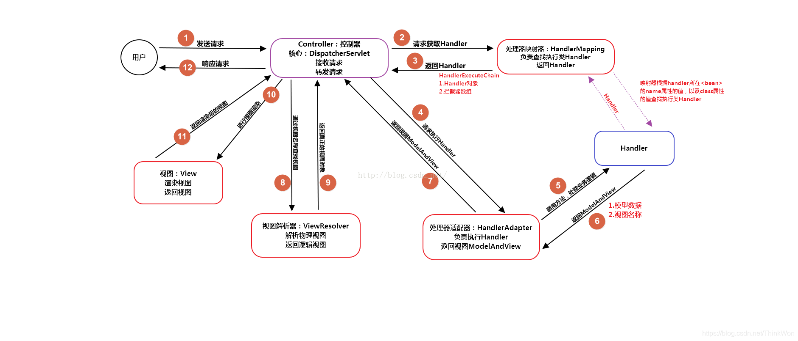

# SpringMVC


## 概念

### 什么是SpringMVC？简单介绍下你对SpringMVC的理解？

SpringMVC 是一个基于 Java 的，实现了 MVC 设计模式的，请求驱动类型的，轻量级 Web 框架。通过把模型-视图-控制器分离，将 web 层进行职责解耦，把复杂的 web 应用分成逻辑清晰的几部分，简化开发。

核心组件

1. 前端控制器 DispatcherServlet
   1. SpringMVC 提供，不需要程序员开发
   2. Springmvc 框架是围绕 DispatcherServlet 来设计的，作用是用来处理所有的 HTTP 请求和响应，相当于转发器，有了 DispatcherServlet 就减少了其它组件之间的耦合度。

2. 处理器映射器 HandlerMapping
   1. SpringMVC 提供，不需要程序员开发，需要进行 IoC 配置使其加入 IoC 容器方可生效
   2. 内部缓存 handler(controller方法) 和 handler 访问路径数据，被 DispatcherServlet 调用，用于查找路径对应的 handler

3. 处理器适配器 HandlerAdapter
   1. SpringMVC 提供，不需要程序员开发，需要进行 IoC 配置使其加入 IoC 容器方可生效
   2. 处理请求参数和处理响应数据数据，每次DispatcherServlet都是通过handlerAdapter间接调用handler，他是handler和DispatcherServlet之间的适配器
   3. 在编写Handler的时候要按照HandlerAdapter要求的规则去编写，这样适配器HandlerAdapter才可以正确的去执行Handler。
4. 处理器 Handler
   1. 是Controller类内部的方法简称，是由我们自己定义
   2. 用来接收参数，向后调用业务，最终返回响应结果

5. 视图解析器 ViewResolver
   1. SpringMVC 提供，不需要程序员开发，需要进行 IoC 配置使其加入 IoC 容器方可生效
   2. 进行视图的解析，根据视图逻辑名解析成真正的视图（view）
   3. 前后端分离项目，后端只返回JSON数据，不返回页面，那就不需要视图解析器

6. 视图 View
   1. View是一个接口，它的实现类支持不同的视图类型（jsp，freemarker，pdf等等），需要开发者自己定义 jsp 等

优点

1. **易于配置和集成**：
   - Spring MVC可以很容易地与Spring框架的其他模块（如事务管理、安全性等）集成。
   - 它可以与其他视图技术（如JSP、Velocity、FreeMarker等）无缝集成。
2. 基于组件化、模块化，使程序结构更加清晰：
   - Spring MVC是基于组件的，这意味着它将Web应用程序的组件（如控制器、视图、模型等）分离出来，使得应用程序的结构更加清晰。
3. **灵活性**：
   - 支持多种视图技术，可以根据需要选择最适合的视图技术。
   - 支持多种数据绑定方式，如表单数据绑定、JSON绑定等。
4. **强大的模板技术支持**：
   - 支持多种模板技术，如JSP、Velocity、FreeMarker等，提供了丰富的模板功能。
5. **强大的数据验证和格式化支持**：
   - 支持强大的数据验证和格式化功能，可以轻松实现复杂的验证逻辑。
7. **易于测试**：
   - 控制器（Controller）可以独立于Web服务器进行测试，这简化了单元测试和集成测试的过程。
8. **易于维护和扩展**：
   - 由于其组件化的设计，Spring MVC使得应用程序的维护和扩展变得更加容易。

### SpringMVC的控制器是不是单例模式,有什么问题

在Spring MVC中，控制器（Controller）通常是单例模式创建的。这意味着Spring容器只创建每个控制器的单个实例，并且这个实例在整个应用的生命周期内会被重用。

优点：

1. 不需要为每个请求都创建一个控制器实例，减少了资源消耗。
2. 单例模式减少了对象的创建和销毁，减少了性能消耗。
3. 单例的特性，可以轻量的管理依赖关系。

缺点：

1. 线程安全问题，如果控制器中某个字段被多个线程同时访问和修改，可能会导致数据不一致问题。
2. 状态管理困难，单例控制器中状态在整个控制器中是共享的，在需要保持特定请求状态时状态管理困难。

解决：

1. 避免共享状态
   1. 尽量不要在控制器中存储状态信息，使用会话、缓存等方式管理状态。
   2. 尽量使用局部变量
2. 使用线程安全类
   1. 如果线程必须使用共享资源，使用线程安全的类和方法。
   2. 在需要的地方使用同步代码块或方法

## 工作原理

### 请描述SpringMVC的工作流程和DispatcherServlet的工作流程？

1. 用户发送请求至前端控制器DispatcherServlet
2. DispatcherServlet收到请求后，调用HandlerMapping处理器映射器，请求获取Handle
3. 处理器映射器根据请求url找到具体的处理器，生成处理器对象及处理器拦截器(如果有则生成)一并返回给DispatcherServlet
4. DispatcherServlet 调用 HandlerAdapter处理器适配器
5. HandlerAdapter 经过适配调用 具体处理器(Handler，也叫后端控制器)
6. Handler执行完成返回ModelAndView
7. HandlerAdapter将Handler执行结果ModelAndView返回给DispatcherServlet
8. DispatcherServlet将ModelAndView传给ViewResolver视图解析器进行解析
9. ViewResolver解析后返回具体View
10. DispatcherServlet对View进行渲染视图（即将模型数据填充至视图中）
11. DispatcherServlet响应用户。



## MVC框架

### MVC是什么？MVC设计模式的好处有哪些

mvc是一种 模型（model）-视图（view）-控制器（controller）三层架构的设计模式。用于实现前端页面的展现与后端业务数据处理的分离。

好处：

1. 分层设计，实现了业务系统各个组件之间的解耦，有利于业务系统的可扩展性，可维护性。

2. 有利于系统的并行开发，提升开发效率。

## 常用注解

### 注解原理是什么

注解本质是一个继承了Annotation的特殊接口，其具体实现类是Java运行时生成的动态代理类。我们通过反射获取注解时，返回的是Java运行时生成的动态代理对象。通过代理对象调用自定义注解的方法，会最终调用AnnotationInvocationHandler的invoke方法。该方法会从memberValues这个Map中索引出对应的值。而memberValues的来源是Java常量池。

### SpringMVC常用的注解有哪些？

@RequestMapping：用于处理请求url映射的注解，可用于类或方法上。用于类上，则表示类中的所有响应请求的方法都是以该地址作为父路径。

@RequestBody：注解实现接收http请求的json数据，将json转换为java对象。

@ResponseBody：注解实现将conreoller方法返回对象转化为json对象响应给客户。

### @Controller注解的作用

在 SpringMVC 中，控制器 Controller 负责处理由 DispatcherServlet 分发的请求，它把用户请求的数据经过业务处理层处理之后封装成一个 Model ，然后再把该 Model 返回给对应的 View 进行展示。在 SpringMVC 中使用 @Controller 标记一个类是 Controller，然后使用 @RequestMapping 和 @RequestParam 等一些注解用以定义URL请求和Controller 方法之间的映射，这样的Controller 就能被外界访问到。此外Controller 不会直接依赖于HttpServletRequest 和HttpServletResponse 等HttpServlet 对象，它们可以通过Controller 的方法参数灵活的获取到。

@Controller 用于标记在一个类上，使用它标记的类就是一个Spring MVC Controller 对象。分发处理器将会扫描使用了该注解的类的方法，并检测该方法是否使用了@RequestMapping 注解。@Controller 只是定义了一个控制器类，而使用@RequestMapping 注解的方法才是真正处理请求的处理器。单单使用@Controller 标记在一个类上还不能真正意义上的说它就是Spring MVC 的一个控制器类，因为这个时候Spring 还不认识它。那么要如何做Spring 才能认识它呢？这个时候就需要我们把这个控制器类交给Spring 来管理。有两种方式：

- 在Spring MVC 的配置文件中定义MyController 的bean 对象。
- 在Spring MVC 的配置文件中告诉Spring 该到哪里去找标记为@Controller 的Controller 控制器。

### @RequestMapping注解的作用

RequestMapping是一个用来处理请求地址映射的注解，可用于类或方法上。用于类上，表示类中的所有响应请求的方法都是以该地址作为父路径。

RequestMapping注解有六个属性，下面我们把她分成三类进行说明（下面有相应示例）。

**value， method**

value： 指定请求的实际地址，指定的地址可以是URI Template 模式（后面将会说明）；

method： 指定请求的method类型， GET、POST、PUT、DELETE等；

**consumes，produces**

consumes： 指定处理请求的提交内容类型（Content-Type），例如application/json, text/html;

produces: 指定返回的内容类型，仅当request请求头中的(Accept)类型中包含该指定类型才返回；

**params，headers**

params： 指定request中必须包含某些参数值是，才让该方法处理。

headers： 指定request中必须包含某些指定的header值，才能让该方法处理请求。

### @ResponseBody注解的作用

作用： 该注解用于将Controller的方法返回的对象，通过适当的HttpMessageConverter转换为指定格式后，写入到Response对象的body数据区。

使用时机：返回的数据不是html标签的页面，而是其他某种格式的数据时（如json、xml等）使用；

### @PathVariable和@RequestParam的区别

请求路径上有个id的变量值，可以通过@PathVariable来获取 @RequestMapping(value = “/page/{id}”, method = RequestMethod.GET)

@RequestParam用来获得静态的URL请求入参 spring注解时action里用到。

## 其他

### Spring MVC与Struts2区别

相同点

都是基于mvc的表现层框架，都用于web项目的开发。

不同点

1.前端控制器不一样。Spring MVC的前端控制器是servlet：DispatcherServlet。struts2的前端控制器是filter：StrutsPreparedAndExcutorFilter。

2.请求参数的接收方式不一样。Spring MVC是使用方法的形参接收请求的参数，基于方法的开发，线程安全，可以设计为单例或者多例的开发，推荐使用单例模式的开发（执行效率更高），默认就是单例开发模式。struts2是通过类的成员变量接收请求的参数，是基于类的开发，线程不安全，只能设计为多例的开发。

3.Struts采用值栈存储请求和响应的数据，通过OGNL存取数据，Spring MVC通过参数解析器是将request请求内容解析，并给方法形参赋值，将数据和视图封装成ModelAndView对象，最后又将ModelAndView中的模型数据通过reques域传输到页面。Jsp视图解析器默认使用jstl。

4.与spring整合不一样。Spring MVC是spring框架的一部分，不需要整合。在企业项目中，Spring MVC使用更多一些。

### Spring MVC怎么样设定重定向和转发的？

（1）转发：在返回值前面加"forward:"，譬如"forward:user.do?name=method4"

（2）重定向：在返回值前面加"redirect:"，譬如"redirect:<http://www.baidu.com>"

### Spring MVC怎么和AJAX相互调用的？

通过Jackson框架就可以把Java里面的对象直接转化成Js可以识别的Json对象。具体步骤如下 ：

（1）加入Jackson.jar

（2）在配置文件中配置json的映射

（3）在接受Ajax方法里面可以直接返回Object,List等,但方法前面要加上@ResponseBody注解。

### 如何解决POST请求中文乱码问题，GET的又如何处理呢？

（1）解决post请求乱码问题：

在web.xml中配置一个CharacterEncodingFilter过滤器，设置成utf-8；

```xml
<filter>
    <filter-name>CharacterEncodingFilter</filter-name>
    <filter-class>org.springframework.web.filter.CharacterEncodingFilter</filter-class>

    <init-param>
        <param-name>encoding</param-name>
        <param-value>utf-8</param-value>
    </init-param>
</filter>

<filter-mapping>
    <filter-name>CharacterEncodingFilter</filter-name>
    <url-pattern>/*</url-pattern>
</filter-mapping>
```

（2）get请求中文参数出现乱码解决方法有两个：

①修改tomcat配置文件添加编码与工程编码一致，如下：

```xml
<ConnectorURIEncoding="utf-8" connectionTimeout="20000" port="8080" protocol="HTTP/1.1" redirectPort="8443"/>
```

②另外一种方法对参数进行重新编码：

String userName = new String(request.getParamter(“userName”).getBytes(“ISO8859-1”),“utf-8”)

ISO8859-1是tomcat默认编码，需要将tomcat编码后的内容按utf-8编码。

### Spring MVC的异常处理？

答：可以将异常抛给Spring框架，由Spring框架来处理；我们只需要配置简单的异常处理器，在异常处理器中添视图页面即可。

### 如果在拦截请求中，我想拦截get方式提交的方法,怎么配置

答：可以在@RequestMapping注解里面加上method=RequestMethod.GET。

### 怎样在方法里面得到Request,或者Session？

答：直接在方法的形参中声明request,Spring MVC就自动把request对象传入。

### 如果想在拦截的方法里面得到从前台传入的参数,怎么得到？

答：直接在形参里面声明这个参数就可以,但必须名字和传过来的参数一样。

### 如果前台有很多个参数传入,并且这些参数都是一个对象的,那么怎么样快速得到这个对象？

答：直接在方法中声明这个对象,Spring MVC就自动会把属性赋值到这个对象里面。

### Spring MVC中函数的返回值是什么？

答：返回值可以有很多类型,有String, ModelAndView。ModelAndView类把视图和数据都合并的一起的，但一般用String比较好。

### Spring MVC用什么对象从后台向前台传递数据的？

答：通过ModelMap对象,可以在这个对象里面调用put方法,把对象加到里面,前台就可以通过el表达式拿到。

### 怎么样把ModelMap里面的数据放入Session里面？

答：可以在类上面加上@SessionAttributes注解,里面包含的字符串就是要放入session里面的key。

### Spring MVC里面拦截器是怎么写的

有两种写法,一种是实现HandlerInterceptor接口，另外一种是继承适配器类，接着在接口方法当中，实现处理逻辑；然后在Spring MVC的配置文件中配置拦截器即可：

```xml
<!-- 配置Spring MVC的拦截器 -->
<mvc:interceptors>
    <!-- 配置一个拦截器的Bean就可以了 默认是对所有请求都拦截 -->
    <bean id="myInterceptor" class="com.zwp.action.MyHandlerInterceptor"></bean>
    <!-- 只针对部分请求拦截 -->
    <mvc:interceptor>
       <mvc:mapping path="/modelMap.do" />
       <bean class="com.zwp.action.MyHandlerInterceptorAdapter" />
    </mvc:interceptor>
</mvc:interceptors>
```

### 介绍一下 WebApplicationContext

WebApplicationContext 继承了ApplicationContext 并增加了一些WEB应用必备的特有功能，它不同于一般的ApplicationContext ，因为它能处理主题，并找到被关联的servlet。
