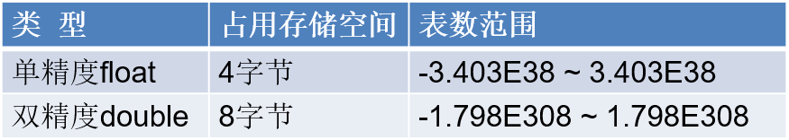
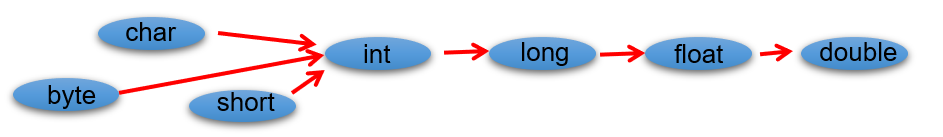
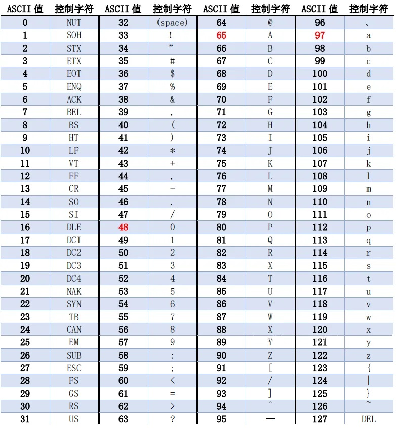
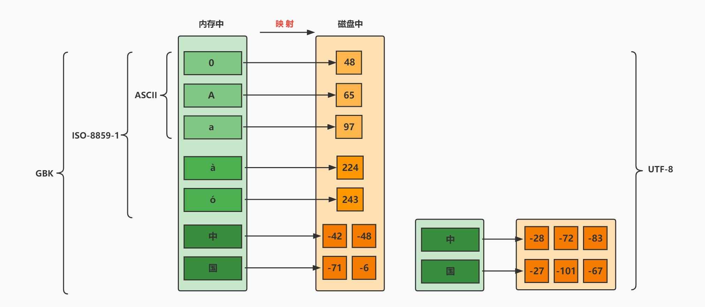

# java 变量

## 1 关键字

- 定义：**被Java语言赋予了特殊含义，用做专门用途的字符串（或单词）**
  - HelloWorld案例中，出现的关键字有 `class`、`public`、`static`、`void` 等，这些单词已经被 Java 定义好了。
- 特点：全部关键字都是 `小写字母`。
- 官方地址： <https://docs.oracle.com/javase/tutorial/java/nutsandbolts/_keywords.html>


> 说明：
>
>  1. 关键字一共 `50个`，其中 `const` 和 `goto` 是 `保留字` (reserved word)。
>  2. `true`，`false`，`null` 不在其中，它们看起来像关键字，其实是字面量，表示特殊的布尔值和空值。


## 2 标识符

Java 中变量、方法、类等要素命名时使用的字符序列，称为标识符。

技巧：凡是自己可以起名字的地方都叫标识符。

**标识符的命名规则**（必须遵守的 `硬性规定`）：

- 由26个英文字母大小写，0-9 ，_或 $ 组成
- 数字不可以开头
- 不可以使用关键字和保留字，但能包含关键字和保留字
- Java中严格区分大小写，长度无限制
- 标识符不能包含空格

**标识符的命名规范**（建议遵守的 `软性要求`，否则工作时容易被鄙视）:

- 包名：多单词组成时所有字母都小写：xxxyyyzzz。
  例如：java.lang、com.atguigu.bean

- 类名、接口名：多单词组成时，所有单词的首字母大写：XxxYyyZzz
  例如：HelloWorld，String，System等

- 变量名、方法名：多单词组成时，第一个单词首字母小写，第二个单词开始每个单词首字母大写：xxxYyyZzz
  例如：age,name,bookName,main,binarySearch,getName

- 常量名：所有字母都大写。多单词时每个单词用下划线连接：XXX_YYY_ZZZ
  例如：MAX_VALUE,PI,DEFAULT_CAPACITY

注意：在起名字时，为了提高阅读性，要尽量有意义，“见名知意”。

## 3 变量

- 内存中的一个存储区域，该区域的数据可以在同一类型范围内不断变化

- 变量的构成包含三个要素：`数据类型`、`变量名`、`存储的值`

- Java中 变量声明的格式：`数据类型 变量名 = 变量值

- 变量的作用：用于在内存中保存数据。

- 使用变量注意：

  - Java中每个变量必须先声明，后使用。
  - 使用变量名来访问这块区域的数据。
  - 变量的作用域：其定义所在的一对{ }内。
  - 变量只有在其`作用域`内才有效。出了作用域，变量不可以再被调用。
  - 同一个作用域内，不能定义重名的变量。

## 4 数据类型

Java 中变量的数据类型分为两大类：

- **基本数据类型**：包括 `整数类型`、`浮点数类型`、`字符类型`、`布尔类型`。

- **引用数据类型**：包括 `数组`、 `类`、`接口`、`枚举`、`注解`、`记录`。

  

### 4.1 整数类型

byte、short、int、long

- Java 各整数类型有固定的表数范围和字段长度，不受具体操作系统的影响，以保证 Java 程序的可移植性。


- 定义 long 类型的变量，赋值时需要以"`l`"或"`L`"作为后缀。

- Java 程序中变量通常声明为 int 型，除非不足以表示较大的数，才使用 long。

- Java 的整型常量默认为 int 型。

### 4.2 浮点类型

float、double

- 与整数类型类似，Java 浮点类型也有固定的表数范围和字段长度，不受具体操作系统的影响。



- 浮点型常量有两种表示形式：
  - 十进制数形式。如：5.12       512.0f        .512   (必须有小数点）
  - 科学计数法形式。如：5.12e2      512E2     100E-2
- float：`单精度`，尾数可以精确到 7 位有效数字。很多情况下，精度很难满足需求。
- double：`双精度`，精度是 float 的两倍。通常采用此类型。
- 定义 float 类型的变量，赋值时需要以"`f`"或"`F`"作为后缀。
- Java 的浮点型常量默认为 double 型。

**关于浮点型精度的说明：**

- 并不是所有的小数都能可以精确的用二进制浮点数表示。二进制浮点数不能精确的表示0.1、0.01、0.001这样10的负次幂。
- 浮点类型 float、double 的数据不适合在 `不容许舍入误差` 的金融计算领域。如果需要`精确`数字计算或保留指定位数的精度，需要使用`BigDecimal类`。

### 4.3 字符类型

char

- char 型数据用来表示通常意义上“`字符`”（占2字节）

- Java 中的所有字符都使用 Unicode 编码，故一个字符可以存储一个字母，一个汉字，或其他书面语的一个字符。

- 字符型变量的三种表现形式：

  - **形式1：**使用单引号(' ')括起来的`单个字符`。

    例如：char c1 = 'a';   char c2 = '中'; char c3 =  '9';

  - **形式2：**直接使用 `Unicode值`来表示字符型常量：‘`\uXXXX`’。其中，XXXX代表一个十六进制整数。

    例如：\u0023 表示 '#'。

  - **形式3：**Java中还允许使用`转义字符‘\’`来将其后的字符转变为特殊字符型常量。

    例如：char c3 = '\n';  // '\n'表示换行符

  | 转义字符 |  说明  | Unicode表示方式 |
  | :------: | :----: | :-------------: |
  |   `\n`   | 换行符 |     \u000a      |
  |   `\t`   | 制表符 |     \u0009      |
  |   `\"`   | 双引号 |     \u0022      |
  |   `\'`   | 单引号 |     \u0027      |
  |   `\\`   | 反斜线 |     \u005c      |
  |   `\b`   | 退格符 |     \u0008      |
  |   `\r`   | 回车符 |     \u000d      |

- char 类型是可以进行运算的。因为它都对应有 Unicode 码，可以看做是一个数值。

### 4.4 布尔类型

boolean

- boolean 类型用来判断逻辑条件，一般用于流程控制语句中：
  - if 条件控制语句；
  - while 循环控制语句；
  - for 循环控制语句；
  - do-while 循环控制语句；
- **boolean 类型数据只有两个值：true、false，无其它。**
  - 不可以使用 0 或非 0 的整数替代 false 和 true，这点和 C 语言不同。
  - 拓展：Java 虚拟机中没有任何供 boolean 值专用的字节码指令，Java 语言表达所操作的 boolean 值，在编译之后都使用 java 虚拟机中的 int 数据类型来代替：true 用 1 表示，false 用 0 表示。——《java虚拟机规范 8版》

## 5 基本数据类型变量间运算规则

在 Java 程序中，不同的基本数据类型（只有7种，不包含 boolean 类型）变量的值经常需要进行相互转换。

转换的方式有两种：`自动类型提升`和 `强制类型转换`。

### 5.1 自动类型提升

**规则：将取值范围小（或容量小）的类型自动提升为取值范围大（或容量大）的类型 。**



1. 当把存储范围小的值（常量值、变量的值、表达式计算的结果值）赋值给了存储范围大的变量时

```java
int i = 'A'; // char 自动升级为 int，其实就是把字符的编码值赋值给i变量了
double d = 10; // int 自动升级为 double
long num = 1234567; // 右边的整数常量值如果在 int 范围呢，编译和运行都可以通过，这里涉及到数据类型转换

// byte bigB = 130; // 错误，右边的整数常量值超过 byte 范围
long bigNum = 12345678912L; // 右边的整数常量值如果超过 int 范围，必须加 L，显式表示 long 类型。否则编译不通过
```

2. 当存储范围小的数据类型与存储范围大的数据类型变量一起混合运算时，会按照其中最大的类型运算。

```java
int i = 1;
byte b = 1;
double d = 1.0;

double sum = i + b + d; // 混合运算，升级为double
```

3. 当 byte, short, char 数据类型的变量进行算术运算时，按照int类型处理。

```java
byte b1 = 1;
byte b2 = 2;
byte b3 = b1 + b2; // 编译报错，b1 + b2 自动升级为 int

char c1 = '0';
char c2 = 'A';
int i = c1 + c2; // 至少需要使用int类型来接收
System.out.println(c1 + c2); // 113 
```

### 5.2 强制类型转换

将 `3.14` 赋值到 `int` 类型变量会发生什么？产生编译失败，肯定无法赋值。

```java
int i = 3.14; // 编译报错
```

想要赋值成功，只有通过`强制类型转换`，将`double` 类型强制转换成`int` 类型才能赋值。

**规则：将取值范围大（或容量大）的类型强制转换成取值范围小（或容量小）的类型。**

> 自动类型提升是 Java 自动执行的，而强制类型转换是自动类型提升的逆运算，需要我们自己手动执行。

**转换格式：**

```java
数据类型1 变量名 = (数据类型1)被强转数据值;  // ()中的数据类型必须 <= 变量值的数据类型
```

1. 当把存储范围大的值（常量值、变量的值、表达式计算的结果值）强制转换为存储范围小的变量时，可能会 `损失精度` 或 `溢出`。

```java
int i = (int)3.14; //损失精度

double d = 1.2;
int num = (int)d; //损失精度

int i = 200;
byte b = (byte)i; //溢出
```

2. 当某个值想要提升数据类型时，也可以使用强制类型转换。这种情况的强制类型转换是 `没有风险` 的，通常省略。

```java
int i = 1;
int j = 2;
double bigger = (double)(i/j);
```

（3）声明 long 类型变量时，可以出现省略后缀的情况。float 则不同。

```java
long l1 = 123L;
long l2 = 123; // 此时可以看做是 int 类型的 123 自动类型提升为 long 类型

//long l3 = 123123123123; // 报错，因为 123123123123 超出了 int 的范围。
long l4 = 123123123123L;

//float f1 = 12.3; // 报错，因为 12.3 看做是 double，不能自动转换为 float 类型
float f2 = 12.3F;
float f3 = (float)12.3;
```

### 5.3 基本数据类型与 String 的运算

**String 类型：**

- String 不是基本数据类型，属于引用数据类型
- 使用一对`""`来表示一个字符串，内部可以包含0个、1个或多个字符。
- 声明方式与基本数据类型类似。例如：String str = “尚硅谷”;

**运算规则：**

1. 任意八种基本数据类型的数据与 String 类型只能进行连接“+”运算，且结果一定也是 String 类型

```java
System.out.println("" + 1 + 2); // 12

int num = 10;
boolean b1 = true;
String s1 = "abc";

String s2 = s1 + num + b1;
System.out.println(s2); // abc10true

//String s3 = num + b1 + s1; // 编译不通过，因为int类型不能与boolean运算
String s4 = num + (b1 + s1); // 编译通过
```

2. String 类型不能通过强制类型()转换，转为其他的类型

```java
String str = "123";
int num = (int)str; // 错误的
int num = Integer.parseInt(str); // 正确的，借助包装类的方法才能转
```

**练习：**

```java
//String str1 = 4; // 错误
String str2 = 3.5f + "";
System.out.println(str2);
System.out.println(3 + 4 + "Hello!");
System.out.println("Hello!" + 3 + 4);
System.out.println('a' + 1 + "Hello!");
System.out.println("Hello" + 'a' + 1);
// 3.5
// 7Hello!
// Hello!34
// 98Hello!
// Helloa1
```

## 6 计算机底层的存储数据

计算机世界中只有二进制，所以计算机中存储和运算的`所有数据`都要转为`二进制`。包括数字、字符、图片、声音、视频等。

**世界上有10种人 ，认识和不认识二进制的。**

### 6.1 进制的分类

- **十进制（decimal）**
  - 数字组成：0-9
  - 进位规则：满十进一

- **二进制（binary）**
  - 数字组成：0-1
  - 进位规则：满二进一，以 `0b` 或 `0B` 开头

- **八进制（octal）：很少使用**
  - 数字组成：0-7
  - 进位规则：满八进一，以数字 `0` 开头表示

- **十六进制**
  - 数字组成：0-9，a-f
  - 进位规则：满十六进一，以 `0x` 或 `0X` 开头表示。此处的 a-f 不区分大小写

```java
class BinaryTest {
 public static void main(String[] args) {
  
  int num1 = 123;  //十进制
  int num2 = 0b101; //二进制
  int num3 = 0127; //八进制
  int num4 = 0x12aF; //十六进制

  System.out.println(num1);
  System.out.println(num2);
  System.out.println(num3);
  System.out.println(num4);
 }
}
```

### 6.2 进制的换算举例

| 十进制 | 二进制 | 八进制 | 十六进制 |
| ------ | ------ | ------ | -------- |
| 0      | 0      | 0      | 0        |
| 1      | 1      | 1      | 1        |
| 2      | 10     | 2      | 2        |
| 3      | 11     | 3      | 3        |
| 4      | 100    | 4      | 4        |
| 5      | 101    | 5      | 5        |
| 6      | 110    | 6      | 6        |
| 7      | 111    | 7      | 7        |
| 8      | 1000   | 10     | 8        |
| 9      | 1001   | 11     | 9        |
| 10     | 1010   | 12     | a或A     |
| 11     | 1011   | 13     | b或B     |
| 12     | 1100   | 14     | c或C     |
| 13     | 1101   | 15     | d或D     |
| 14     | 1110   | 16     | e或E     |
| 15     | 1111   | 17     | f或F     |
| 16     | 10000  | 20     | 10       |

### 6.3 二进制的由来

二进制，是计算技术中广泛采用的一种数制，由德国数理哲学大师 `莱布尼茨` 于1679年发明。

二进制数据是用0和1两个数码来表示的数。它的基数为 2，进位规则是 `逢二进一`。

二进制广泛应用于我们生活的方方面面。比如，广泛使用的摩尔斯电码（Morse Code），它由两种基本信号组成：短促的点信号 “`·`”，读“`滴`”；保持一定时间的长信号 “`—`”，读 “`嗒`”。然后，组成了26个字母，从而拼写出相应的单词。


记忆技巧：


我们偶尔会看到的：SOS，即为：


### 6.4 二进制转十进制

**二进制如何表示整数？**

- 计算机数据的存储使用二进制 `补码` 形式存储，并且 `最高位是符号位`。
  - 正数：`最高位是0`
  - 负数：`最高位是1`

- 规定
  - 正数的补码与反码、原码一样，称为 `三码合一`
  - 负数的补码与反码、原码不一样：
    - 负数的 `原码`：把十进制转为二进制，然后最高位设置为1
    - 负数的 `反码`：在原码的基础上，最高位不变，其余位取反（0变1,1变0）
    - 负数的 `补码`：反码+1

**二进制转十进制：权相加法**

针对于 byte 数据举例来说：


- 例如：byte 类型（1个字节，8位）

  25 ==> 原码  0001 1001 ==> 反码  0001 1001 -->补码  0001 1001

  -25 ==>原码  1001 1001 ==> 反码1110 0110 ==>补码 1110 0111

```java
整数：
正数：25   00000000 00000000 000000000 00011001（原码）
正数：25   00000000 00000000 000000000 00011001（反码）
正数：25   00000000 00000000 000000000 00011001（补码）

负数：-25  10000000 00000000 000000000 00011001（原码）
负数：-25  11111111 11111111 111111111 11100110（反码）
负数：-25  11111111 11111111 111111111 11100111（补码）
```

**一个字节可以存储的整数范围是多少？**

```java
// 1个字节：8位

0000 0001  ~  0111 111 ==> 1~127

1000 0001 ~ 1111 1111 ==> -127 ~ -1

0000 0000 ==>0

1000 0000 ==> -128（特殊规定）=-127-1
```

### 6.5 十进制转二进制

十进制转二进制：`除2取余的逆`


### 6.6 二进制与八进制、十六进制间的转换

**二进制转八进制**


**二进制转十六进制**


**八进制、十六进制转二进制**


## 7 字符集

### 7.1 字符集

- **编码与解码**

​ 计算机中储存的信息都是用`二进制数`表示的，而我们在屏幕上看到的数字、英文、标点符号、汉字等字符是二进制数转换之后的结果。按照某种规则，将字符存储到计算机中，称为`编码` 。反之，将存储在计算机中的二进制数按照某种规则解析显示出来，称为`解码` 。

- **字符编码（Character Encoding）** : 就是一套自然语言的字符与二进制数之间的对应规则。

- **字符集**：也叫编码表。是一个系统支持的所有字符的集合，包括各国家文字、标点符号、图形符号、数字等。

### 7.2 ASCII 码

- ASCII 码（American Standard Code for Information Interchange，美国信息交换标准代码）：上个世纪60年代，美国制定了一套字符编码，对`英语字符`与二进制位之间的关系，做了统一规定。这被称为 ASCII 码。
- ASCII 码用于显示现代英语，主要包括控制字符（回车键、退格、换行键等）和可显示字符（英文大小写字符、阿拉伯数字和西文符号）。
- 基本的 ASCII 字符集，使用7位（bits）表示一个字符（最前面的1位统一规定为0），共`128个`字符。比如：空格“SPACE”是32（二进制00100000），大写的字母A是65（二进制01000001）。
- 缺点：不能表示所有字符。



### 7.3 ISO-8859-1 字符集

- 拉丁码表，别名 Latin-1，用于显示欧洲使用的语言，包括荷兰语、德语、意大利语、葡萄牙语等
- ISO-8859-1 使用单字节编码，兼容 ASCII 编码。

### 7.4 GBxxx 字符集

- GB 就是国标的意思，是为了`显示中文`而设计的一套字符集。
- **GB2312**：简体中文码表。一个小于127的字符的意义与原来相同，即向下兼容ASCII码。但两个大于127的字符连在一起时，就表示一个汉字，这样大约可以组合了包含`7000多个简体汉字`，此外数学符号、罗马希腊的字母、日文的假名们都编进去了，这就是常说的"全角"字符，而原来在127号以下的那些符号就叫"半角"字符了。
- **GBK**：最常用的中文码表。是在GB2312标准基础上的扩展规范，使用了`双字节`编码方案，共收录了`21003个`汉字，完全兼容GB2312标准，同时支持`繁体汉字`以及日韩汉字等。
- **GB18030**：最新的中文码表。收录汉字`70244个`，采用`多字节`编码，每个字可以由1个、2个或4个字节组成。支持中国国内少数民族的文字，同时支持繁体汉字以及日韩汉字等。

### 7.5 Unicode 码

- Unicode 编码为表达`任意语言的任意字符`而设计，也称为统一码、标准万国码。Unicode 将世界上所有的文字用`2个字节`统一进行编码，为每个字符设定唯一的二进制编码，以满足跨语言、跨平台进行文本处理的要求。

- Unicode 的缺点：这里有三个问题：
  - 第一，英文字母只用一个字节表示就够了，如果用更多的字节存储是`极大的浪费`。
  - 第二，如何才能`区别Unicode和ASCII`？计算机怎么知道两个字节表示一个符号，而不是分别表示两个符号呢？
  - 第三，如果和GBK等双字节编码方式一样，用最高位是1或0表示两个字节和一个字节，就少了很多值无法用于表示字符，`不够表示所有字符`。
- Unicode 在很长一段时间内无法推广，直到互联网的出现，为解决Unicode如何在网络上传输的问题，于是面向传输的众多 UTF（UCS Transfer Format）标准出现。具体来说，有三种编码方案，UTF-8、UTF-16和UTF-32。

### 7.6 UTF-8

- Unicode 是字符集，UTF-8、UTF-16、UTF-32是三种`将数字转换到程序数据`的编码方案。顾名思义，UTF-8 就是每次8个位传输数据，而UTF-16就是每次16个位。其中，UTF-8 是在互联网上`使用最广`的一种 Unicode 的实现方式。
- 互联网工程工作小组（IETF）要求所有互联网协议都必须支持UTF-8编码。所以，我们开发Web应用，也要使用UTF-8编码。UTF-8 是一种`变长的编码方式`。它可以使用 1-4 个字节表示一个符号它使用一至四个字节为每个字符编码，编码规则：
  1. 128个US-ASCII字符，只需一个字节编码。
  2. 拉丁文等字符，需要二个字节编码。
  3. 大部分常用字（含中文），使用三个字节编码。
  4. 其他极少使用的Unicode辅助字符，使用四字节编码。

- 举例

​ Unicode符号范围  | UTF-8编码方式

> (十六进制)           | （二进制）
>
> ————————————————————|—–—–—–—–—–—–—–—–—–—–—–—–—–—–
>
> 0000 0000-0000 007F | 0xxxxxxx（兼容原来的ASCII）
>
> 0000 0080-0000 07FF | 110xxxxx 10xxxxxx
>
> 0000 0800-0000 FFFF | 1110xxxx 10xxxxxx 10xxxxxx
>
> 0001 0000-0010 FFFF | 11110xxx 10xxxxxx 10xxxxxx 10xxxxxx


### 7.7 小结



> 注意：在中文操作系统上，ANSI（美国国家标准学会、AMERICAN NATIONAL STANDARDS INSTITUTE: ANSI）编码即为GBK；在英文操作系统上，ANSI编码即为ISO-8859-1。
