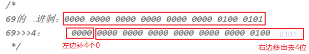

# java 运算符

## 1 概念

运算符是一种特殊的符号，用以表示数据的运算、赋值和比较等。

运算符的分类：

- 按照`功能`分为：算术运算符、赋值运算符、比较(或关系)运算符、逻辑运算符、位运算符、条件运算符、Lambda 运算符

|           分类            |                        运算符                        |
| :-----------------------: | :--------------------------------------------------: |
|     算术运算符（7个）     |                +、-、*、/、%、++、--                 |
|    赋值运算符（12个）     | =、+=、-=、*=、/=、%=、>>=、<<=、>>>=、&=、\|=、^=等 |
| 比较(或关系)运算符（6个） |                 >、>=、<、<=、==、!=                 |
|     逻辑运算符（6个）     |                &、\|、^、!、&&、\|\|                 |
|      位运算符（7个）      |               &、\|、^、~、<<、>>、>>>               |
|     条件运算符（1个）     |               (条件表达式)?结果1:结果2               |
|    Lambda运算符（1个）    |                  ->（第18章时讲解）                  |

- 按照`操作数个数`分为：一元运算符（单目运算符）、二元运算符（双目运算符）、三元运算符 （三目运算符）

|           分类            |                  运算符                  |
| :-----------------------: | :--------------------------------------: |
| 一元运算符（单目运算符）  |    正号（+）、负号（-）、++、--、!、~    |
| 二元运算符（双目运算符）  | 除了一元和三元运算符剩下的都是二元运算符 |
| 三元运算符 （三目运算符） |         (条件表达式)?结果1:结果2         |

## 2 算术运算符

**基本语法：**


**加减乘除模**

```java
public class ArithmeticTest1 {
 public static void main(String[] args) {
  int a = 3;
  int b = 4;
  
  System.out.println(a + b); // 7
  System.out.println(a - b); // -1
  System.out.println(a * b); // 12
  System.out.println(a / b); // 0
  System.out.println(a % b); // 3
        
    // 带有符号的，结果与被模数符号相同
    System.out.println(5%2); //1
  System.out.println(5%-2); //1
  System.out.println(-5%2); //-1
  System.out.println(-5%-2); //-1  
  // 商*除数 + 余数 = 被除数
  // 5%-2 ==> 商是-2，余数时1    (-2)*(-2)+1 = 5
  // -5%2 ==> 商是-2，余数是-1   (-2)*2+(-1) = -4-1=-5
 }
}
```

**“+”号的两种用法**

- 第一种：对于`+`两边都是数值的话，`+`就是加法的意思
- 第二种：对于`+`两边至少有一边是字符串的话，`+`就是拼接的意思

```java
public class ArithmeticTest2 {
 public static void main(String[] args) {
  // 字符串类型的变量基本使用
  // 数据类型 变量名称 = 数据值;
  String str1 = "Hello";
  System.out.println(str1); // Hello
  System.out.println("Hello" + "World"); // HelloWorld
  
  String str2 = "Java";
  // String + int --> String
  System.out.println(str2 + 520); // Java520
  System.out.println(str2 + 5 + 20); // Java520
    System.out.println(5 + 20 + str2); // 25Java
 }
}
```

**自加自减**

理解：`++`  运算，表示 `自增1`。同理，`--` 运算，表示 `自减1`，用法与 ++ 一致。

1. 单独使用

   变量在单独运算的时候，变量 `前++` 和变量 `后++`，是没有区别的。

   - 变量 `前++`：例如 `++a` 。

   - 变量 `后++`：例如 `a++` 。

```java
public class ArithmeticTest3 {
 public static void main(String[] args) {
  // 定义一个int类型的变量a
  int a = 3;
  //++a;
  a++;
    // 无论是变量前++还是变量后++，结果都是4
  System.out.println(a);
 }
}
```

2. 复合使用
   - 和 `其他变量放在一起使用` 或者和 `输出语句放在一起使用` ，`前++` 和 `后++` 就产生了不同。

- 变量 `前++`：变量先自增1，然后再运算。
- 变量 `后++`：变量先运算，然后再自增1。

```java
public class ArithmeticTest4 {
 public static void main(String[] args) {
  // 其他变量放在一起使用
  int x = 3;
  //int y = ++x; // y的值是4，x的值是4，
  int y = x++; // y的值是3，x的值是4
  
  System.out.println(x);
  System.out.println(y);
        
  // 和输出语句一起
  int z = 5;
  //System.out.println(++z);// 输出结果是6，z的值也是6
  System.out.println(z++);// 输出结果是5，z的值是6
  System.out.println(z);
 } 
}
```

## 3 赋值运算符

**基本语法：**

- 符号：=

  - 当“=”两侧数据类型不一致时，可以使用自动类型转换或使用强制类型转换原则进行处理。
  - 支持 `连续赋值`。

- 扩展赋值运算符： +=、 -=、*=、 /=、%=

  | 赋值运算符 |                           符号解释                           |
  | :--------: | :----------------------------------------------------------: |
  |    `+=`    | 将符号`左边的值`和`右边的值`进行`相加`操作，最后将结果`赋值给左边的变量` |
  |    `-=`    | 将符号`左边的值`和`右边的值`进行`相减`操作，最后将结果`赋值给左边的变量` |
  |    `*=`    | 将符号`左边的值`和`右边的值`进行`相乘`操作，最后将结果`赋值给左边的变量` |
  |    `/=`    | 将符号`左边的值`和`右边的值`进行`相除`操作，最后将结果`赋值给左边的变量` |
  |    `%=`    | 将符号`左边的值`和`右边的值`进行`取余`操作，最后将结果`赋值给左边的变量` |

**基本用法：**

```java
public class SetValueTest1 {
 public static void main(String[] args) {
    
    // 转换
  int i1 = 10;
  long l1 = i1; // 自动类型转换
  byte bb1 = (byte)i1; // 强制类型转换
  int i2 = i1;

  
  // 连续赋值的写法
  int a2,b2;
  a2 = b2 = 10;
  int a3 = 10,b3 = 20;

  // 举例说明 +=  -=  *=  /=   %=  
  int m1 = 10;
  m1 += 5; // 类似于 m1 = m1 + 5的操作，但不等同于。
  System.out.println(m1); // 15
  
  // 练习1：开发中，如何实现一个变量+2的操作呢？
  // += 的操作不会改变变量本身的数据类型。其他拓展的运算符也如此。
  // 写法1：推荐
  short s1 = 10;
  s1 += 2; // 编译通过，因为在得到int类型的结果后，JVM自动完成一步强制类型转换，将int类型强转成short
  System.out.println(s1);//12
  // 写法2：
  short s2 = 10;
  // s2 = s2 + 2; // 编译报错，因为将int类型的结果赋值给short类型的变量s时，可能损失精度
  s2 = (short)(s2 + 2);
  System.out.println(s2);

  // 练习2：开发中，如何实现一个变量+1的操作呢？
  // 写法1：推荐
  int num1 = 10;
  num1++;
  System.out.println(num1);

  // 写法2：
  int num2 = 10;
  num2 += 1;
  System.out.println(num2);

  // 写法3：
  int num3 = 10;
  num3 = num3 + 1;
  System.out.println(num3);
 }
}
```

## 4 比较(关系)运算符

**基本语法：**


- 比较运算符的结果都是 boolean 型，也就是要么是 true，要么是 false。
- \>   <   >=  <= ：只适用于基本数据类型（除 boolean 类型之外）
- ==   != ：适用于基本数据类型和引用数据类型

**基本用法：**

```java
class CompareTest {
 public static void main(String[] args) {
  int i1 = 10;
  int i2 = 20;
  
  System.out.println(i1 == i2);//false
  System.out.println(i1 != i2);//true
  System.out.println(i1 >= i2);//false


  int m = 10;
  int n = 20;
  System.out.println(m == n);//false
  System.out.println(m = n);//20

  boolean b1 = false;
  boolean b2 = true;
  System.out.println(b1 == b2);//false
  System.out.println(b1 = b2);//true
 }
}
```

## 5 逻辑运算符

**基本语法：**


- 逻辑运算符，操作的都是 boolean 类型的变量或常量，而且运算得结果也是 boolean 类型的值。
- 运算符说明：
  - & 和 && ：表示"且"关系，当符号左右两边布尔值都是 true 时，结果才能为 true。否则，为 false。
  - | 和 || ：表示"或"关系，当符号两边布尔值有一边为 true 时，结果为 true。当两边都为 false 时，结果为 false。
  - ! ：表示"非"关系，当变量布尔值为 true 时，结果为 false。当变量布尔值为 false 时，结果为 true。
  - ^ ：当符号左右两边布尔值不同时，结果为 true。当两边布尔值相同时，结果为 false。
- 逻辑运算符用于连接布尔型表达式，在 Java 中不可以写成 3 < x < 6，应该写成x > 3 & x < 6 。

- **区分“&”和“&&”：**

  - 相同点：如果符号左边是 true，则二者都执行符号右边的操作

  - 不同点：& ： 如果符号左边是 false，则继续执行符号右边的操作

  ​          && ：如果符号左边是 false，则不再继续执行符号右边的操作

  - 建议：开发中，推荐使用 &&

- **区分“|”和“||”：**

  - 相同点：如果符号左边是 false，则二者都执行符号右边的操作

  - 不同点：| ： 如果符号左边是 true，则继续执行符号右边的操作

    ​      || ：如果符号左边是 true，则不再继续执行符号右边的操作

  - 建议：开发中，推荐使用 ||

**基本用法：**

```java
public class LoginTest {
 public static void main(String[] args) {
  int a = 3;
  int b = 4;
  int c = 5;

  // & 与，且；有false则false
  System.out.println((a > b) & (a > c)); 
  System.out.println((a > b) & (a < c)); 
  System.out.println((a < b) & (a > c)); 
  System.out.println((a < b) & (a < c)); 
  System.out.println("===============");
  // | 或；有true则true
  System.out.println((a > b) | (a > c)); 
  System.out.println((a > b) | (a < c)); 
  System.out.println((a < b) | (a > c));
  System.out.println((a < b) | (a < c));
  System.out.println("===============");
  // ^ 异或；相同为false，不同为true
  System.out.println((a > b) ^ (a > c));
  System.out.println((a > b) ^ (a < c)); 
  System.out.println((a < b) ^ (a > c)); 
  System.out.println((a < b) ^ (a < c)); 
  System.out.println("===============");
  // ! 非；非false则true，非true则false
  System.out.println(!false);
  System.out.println(!true);
        
    // &和&&的区别
    System.out.println((a > b) & (a++ > c)); 
    System.out.println("a = " + a);
    System.out.println((a > b) && (a++ > c)); 
    System.out.println("a = " + a);
    System.out.println((a == b) && (a++ > c)); 
    System.out.println("a = " + a);

    // |和||的区别
    System.out.println((a > b) | (a++ > c)); 
    System.out.println("a = " + a);
    System.out.println((a > b) || (a++ > c)); 
    System.out.println("a = " + a);
    System.out.println((a == b) || (a++ > c)); 
    System.out.println("a = " + a);
 }
}
```

## 6 位运算符

**基本语法：**


位运算符的运算过程都是基于**二进制的补码**运算。

1. 左移：<<

​ 运算规则：在一定范围内，数据每向左移动一位，相当于原数据*2。（正数、负数都适用）

​ 注意：当左移的位数 n 超过该数据类型的总位数时，相当于左移（n-总位数）位。

```java
3<<4  类似于  3*2的4次幂 => 3*16 => 48
```


```java
-3<<4  类似于  -3*2的4次幂 => -3*16 => -48
```


2. 右移：>>

​ 运算规则：在一定范围内，数据每向右移动一位，相当于原数据/2。（正数、负数都适用）

​ 注意：如果不能整除，`向下取整`。

```java
69>>4  类似于  69/2的4次 = 69/16 =4
```


```java
-69>>4  类似于  -69/2的4次 = -69/16 = -5
```


3. 无符号右移：>>>

​ 运算规则：往右移动后，左边空出来的位直接补0。（正数、负数都适用）

```java
69>>>4  类似于  69/2的4次 = 69/16 =4
```



```java
-69>>>4   结果：268435451
```


4. 按位与：&

​ 运算规则：对应位都是1才为1，否则为0。

```java
9 & 7 = 1
```


```java
-9 & 7 = 7
```


5. 按位或：|

运算规则：对应位只要有1即为1，否则为0。

```java
9 | 7  //结果： 15
```


```java
-9 | 7 //结果： -9
```


6. 按位异或：^

运算规则：对应位一个为1一个为0，才为1，否则为0。

```java
9 ^ 7  //结果为14
```


```java
-9 ^ 7 //结果为-16
```


7. 按位取反：~

运算规则：对应位为1，则结果为0；对应位为0，则结果为1。

```java
~9  //结果：-10
```


```java
~-9  //结果：8
```


**基本用法：**

- 高效的方式计算2 * 8的值（经典面试题）

```java
2 << 3 
8 << 1
```

- 如何交换两个int型变量的值？String呢？

```java
//（推荐）实现方式1：优点：容易理解，适用于不同数据类型    缺点：需要额外定义变量
int temp = m;
m = n;
n = temp;

// 实现方式2：优点：没有额外定义变量    缺点：可能超出int的范围；只能适用于数值类型
m = m + n; //15 = 10 + 5
n = m - n; //10 = 15 - 5
m = m - n; //5 = 15 - 10
 
// 实现方式3：优点：没有额外定义变量    缺点：不易理解；只能适用于数值类型
m = m ^ n; 
n = m ^ n; //(m ^ n) ^ n
m = m ^ n;
```

## 7 条件运算符

**基本语法:**

- 条件运算符格式：

```java
(条件表达式)? 表达式1:表达式2
```

- 说明：条件表达式是 boolean 类型的结果，根据 boolean 的值选择表达式1或表达式2。

- 如果运算后的结果赋给新的变量，要求表达式1和表达式2为同种或兼容的类型。
- 开发中，如果既可以使用条件运算符，又可以使用if-else，推荐使用条件运算符。因为执行效率稍高。

**基本用法：**

- 获取两个数中的较大值

```java
//获取两个数的较大值
int m1 = 10;
int m2 = 20;

int max1 = m1 > m2 ? m1 : m2;
System.out.println("m1和m2中的较大值为" + max1);
```

## 8 运算符优先级

运算符有不同的优先级，所谓优先级就是在表达式运算中的运算符顺序。

上一行中的运算符总是优先于下一行的。

| 优先级 |    运算符说明    |             Java运算符             |
| ------ | :--------------: | :--------------------------------: |
| 1      |       括号       |          `()`、`[]`、`{}`          |
| 2      |      正负号      |              `+`、`-`              |
| 3      |    单元运算符    |       `++`、`--`、`~`、`！`        |
| 4      | 乘法、除法、求余 |           `*`、`/`、`%`            |
| 5      |    加法、减法    |              `+`、`-`              |
| 6      |    移位运算符    |         `<<`、`>>`、`>>>`          |
| 7      |    关系运算符    | `<`、`<=`、`>=`、`>`、`instanceof` |
| 8      |    等价运算符    |             `==`、`!=`             |
| 9      |      按位与      |                `&`                 |
| 10     |     按位异或     |                `^`                 |
| 11     |      按位或      |                `|`                 |
| 12     |      条件与      |                `&&`                |
| 13     |      条件或      |                `||`                |
| 14     |    三元运算符    |               `? :`                |
| 15     |    赋值运算符    | `=`、`+=`、`-=`、`*=`、`/=`、`%=`  |
| 16     |   位赋值运算符   |  `&=`、`|=`、`<<=`、`>>=`、`>>>=`  |

> 开发建议：
>
> 1. 不要过多的依赖运算的优先级来控制表达式的执行顺序，这样可读性太差，尽量`使用()来控制`表达式的执行顺序。
> 2. 不要把一个表达式写得过于复杂，如果一个表达式过于复杂，则把它`分成几步`来完成。例如：
>    ​ (num1 + num2) * 2 > num3 && num2 > num3 ? num3 : num1 + num2;
