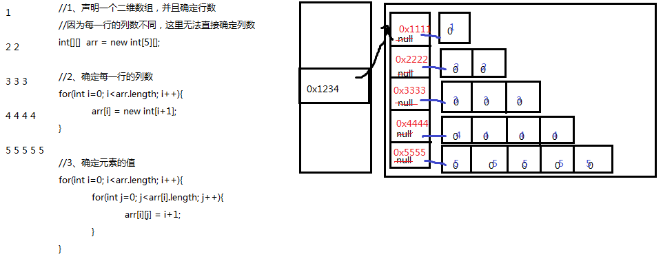
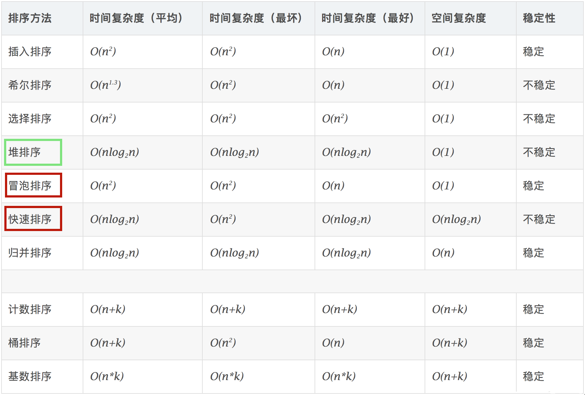
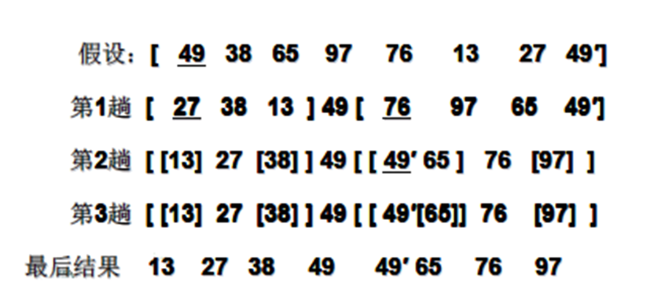

# java 数组

## 1 概述

### 1.1 概念

- 数组(Array)，是多个相同类型数据按一定顺序排列的集合，并使用一个名字命名，并通过编号的方式对这些数据进行统一管理。

- 数组中的概念
  - 数组名
  - 下标（或索引）
  - 元素
  - 数组的长度


**数组的特点：**

- 数组本身是`引用数据类型`，而数组中的元素可以是`任何数据类型`，包括基本数据类型和引用数据类型。
- 创建数组对象会在内存中开辟一整块`连续的空间`。占据的空间的大小，取决于数组的长度和数组中元素的类型。
- 数组中的元素在内存中是依次紧密排列的，有序的。
- 数组，一旦初始化完成，其长度就是确定的。数组的`长度一旦确定，就不能修改`。
- 我们可以直接通过下标(或索引)的方式调用指定位置的元素，速度很快。
- 数组名中引用的是这块连续空间的首地址。

### 1.2 分类

**按照元素类型分：**

- 基本数据类型元素的数组：每个元素位置存储基本数据类型的值
- 引用数据类型元素的数组：每个元素位置存储对象（本质是存储对象的首地址）

**按照维度分：**

- 一维数组：存储一组数据
- 二维数组：存储多组数据，相当于二维表，一行代表一组数据，只是这里的二维表每一行长度不要求一样。

## 2 一维数组

### 2.1 声明

**格式：**

```java
//推荐
元素的数据类型[] 一维数组的名称;
//不推荐
元素的数据类型  一维数组名[];
```

**举例：**

```java
int[] arr;
int arr1[];
double[] arr2;
String[] arr3;
```

**数组的声明，需要明确：**

（1）数组的维度：在Java中数组的符号是[]，[]表示一维，\[]\[]表示二维。

（2）数组的元素类型：即创建的数组容器可以存储什么数据类型的数据。元素的类型可以是任意的Java的数据类型。例如：int、String、Student等。

（3）数组名：就是代表某个数组的标识符，数组名其实也是变量名，按照变量的命名规范来命名。数组名是个引用数据类型的变量，因为它代表一组数据。

注意：Java语言中声明数组时不能指定其长度(数组中元素的个数)。 例如： int a[5]; //非法

### 2.2 初始化

#### 2.2.1 静态初始化

- 如果数组变量的初始化和数组元素的赋值操作同时进行，那就称为静态初始化。

- 静态初始化，本质是用静态数据（编译时已知）为数组初始化。此时数组的长度由静态数据的个数决定。

- **一维数组声明和静态初始化格式1：**

  ```java
  数据类型[] 数组名 = new 数据类型[]{元素1,元素2,元素3,...};
  
  或
      
  数据类型[] 数组名;
  数组名 = new 数据类型[]{元素1,元素2,元素3,...};
  ```

  - new：关键字，创建数组使用的关键字。因为数组本身是引用数据类型，所以要用new创建数组实体。

    例如，定义存储1，2，3，4，5整数的数组容器。

    ```java
    int[] arr = new int[]{1,2,3,4,5}; //正确
    //或
    int[] arr;
    arr = new int[]{1,2,3,4,5}; //正确
    ```

- **一维数组声明和静态初始化格式2：**

  ```java
  数据类型[] 数组名 = {元素1,元素2,元素3...};//必须在一个语句中完成，不能分成两个语句写
  ```

  例如，定义存储1，2，3，4，5整数的数组容器

  ```java
  int[] arr = {1,2,3,4,5};//正确
  
  int[] arr;
  arr = {1,2,3,4,5};//错误
  ```

#### 2.2.2 动态初始化

数组变量的初始化和数组元素的赋值操作分开进行，即为动态初始化。

动态初始化中，只确定了元素的个数（即数组的长度），而元素值此时只是默认值，还并未真正赋自己期望的值。真正期望的数据需要后续单独一个一个赋值。

**格式：**

```java
数组存储的元素的数据类型[] 数组名字 = new 数组存储的元素的数据类型[长度];

或

数组存储的数据类型[] 数组名字;
数组名字 = new 数组存储的数据类型[长度];
```

- [长度]：数组的长度，表示数组容器中可以最多存储多少个元素。

- **注意：数组有定长特性，长度一旦指定，不可更改。**和水杯道理相同，买了一个2升的水杯，总容量就是2升是固定的。

**举例1：正确写法**

```java
int[] arr = new int[5];

int[] arr;
arr = new int[5];

```

**举例2：错误写法**

```java
int[] arr = new int[5]{1,2,3,4,5};//错误的，后面有{}指定元素列表，就不需要在[]中指定元素个数了。
```

### 2.3 使用

#### 2.3.1  数组的长度

- 数组的元素总个数，即数组的长度
- 每个数组都有一个属性length指明它的长度，例如：arr.length 指明数组arr的长度(即元素个数)
- 每个数组都具有长度，而且一旦初始化，其长度就是确定，且是不可变的。

#### 2.3.2 数组元素的引用

**如何表示数组中的一个元素？**

每一个存储到数组的元素，都会自动的拥有一个编号，从0开始，这个自动编号称为数组索引(index)或下标，可以通过数组的索引/下标访问到数组中的元素。

```java
数组名[索引/下标]
```

**数组的下标范围？**

Java中数组的下标从[0]开始，下标范围是[0, 数组的长度-1]，即[0, 数组名.length-1]

数组元素下标可以是整型常量或整型表达式。如a[3] , b[i] , c[6*i];

#### 2.3.3 数组元素默认值

数组是引用类型，当我们使用动态初始化方式创建数组时，元素值只是默认值。例如：

```java
int a[]= new int[5]; 
System.out.println(a[3]); //a[3]的默认值为0
```

对于基本数据类型而言，默认初始化值各有不同。

对于引用数据类型而言，默认初始化值为null（注意与0不同！)


### 2.4 遍历

遍历是将数组中的每个元素分别获取出来。

**举例**

```java
int[] arr = new int[]{1,2,3,4,5};
//打印数组的属性，输出结果是5
System.out.println("数组的长度：" + arr.length);

//遍历输出数组中的元素
System.out.println("数组的元素有：");
for(int i=0; i<arr.length; i++){
  System.out.println(arr[i]);
}
```

### 2.5 内存分析

#### 2.5.1 Java虚拟机的内存划分

为了提高运算效率，就对空间进行了不同区域的划分，因为每一片区域都有特定的处理数据方式和内存管理方式。


| 区域名称   | 作用                                                      |
| ----------| ---------------------------------------------------------|
| `虚拟机栈` | 用于存储正在执行的每个Java方法的局部变量表等。局部变量表存放了编译期可知长度<br/>的各种基本数据类型、对象引用，方法执行完，自动释放。 |
| `堆内存` | 存储对象（包括数组对象），new来创建的，都存储在堆内存。 |
| `方法区` | 存储已被虚拟机加载的类信息、常量、（静态变量）、即时编译器编译后的代码等数据。 |
| 本地方法栈 | 当程序中调用了native的本地方法时，本地方法执行期间的内存区域 |
| 程序计数器 | 程序计数器是CPU中的寄存器，它包含每一个线程下一条要执行的指令的地址 |

#### 2.5.2 一维数组在内存中的存储

**一维数组内存图：**

```java
public static void main(String[] args) {
   int[] arr = new int[3];
   System.out.println(arr);//[I@5f150435
}

```


**数组下标为什么是0开始：**

因为第一个元素距离数组首地址间隔0个单元格。

**两个一维数组内存图：**

```java
public static void main(String[] args) {
    int[] arr = new int[3];
    int[] arr2 = new int[2];
    System.out.println(arr);
    System.out.println(arr2);
}
```


**两个变量指向一个一维数组：**

两个数组变量本质上代表同一个数组。

```java
public static void main(String[] args) {
    // 定义数组，存储3个元素
    int[] arr = new int[3];
    //数组索引进行赋值
    arr[0] = 5;
    arr[1] = 6;
    arr[2] = 7;
    //输出3个索引上的元素值
    System.out.println(arr[0]);
    System.out.println(arr[1]);
    System.out.println(arr[2]);
    //定义数组变量arr2，将arr的地址赋值给arr2
    int[] arr2 = arr;
    arr2[1] = 9;
    System.out.println(arr[1]);
}
```

 

## 3 多维数组

### 3.1 概述

- Java 语言里提供了支持多维数组的语法。

- 如果说可以把一维数组当成几何中的`线性图形`，那么二维数组就相当于是`一个表格`，像Excel中的表格、围棋棋盘一样。

> - 对于二维数组的理解，可以看成是一维数组array1又作为另一个一维数组array2的元素而存在。
> - 其实，从数组底层的运行机制来看，其实没有多维数组。

### 3.2 声明与初始化

#### 3.2.1 声明

二维数组声明的语法格式：

```java
//推荐
元素的数据类型[][] 二维数组的名称;
//不推荐
元素的数据类型  二维数组名[][];
//不推荐
元素的数据类型[]  二维数组名[];

//存储多组成绩
int[][] grades;
//存储多组姓名
String[][] names;
```

#### 3.2.2 静态初始化

**格式：**

```java
int[][] arr = new int[][]{ {3,8,2},{2,7},{9,0,1,6} };
```

定义一个名称为arr的二维数组，二维数组中有三个一维数组

- 每一个一维数组中具体元素也都已初始化
  - 第一个一维数组 arr[0] = {3,8,2};
  - 第二个一维数组 arr[1] = {2,7};
  - 第三个一维数组 arr[2] = {9,0,1,6};
- 第三个一维数组的长度表示方式：arr[2].length;

> 注意特殊写法情况：int[] x,y[]; x是一维数组，y是二维数组。

**举例：**

```java
int[][] arr = { {1,2,3},{4,5,6},{7,8,9,10} }; //声明与初始化必须在一句完成
int[][] arr = new int[][]{ {1,2,3},{4,5,6},{7,8,9,10} };
int[][] arr;
arr = new int[][]{ {1,2,3},{4,5,6},{7,8,9,10} };
arr = new int[3][3]{ {1,2,3},{4,5,6},{7,8,9,10} }; //错误，静态初始化右边new 数据类型[][]中不能写数字
```

#### 3.2.3 动态初始化

如果二维数组的每一个数据，甚至是每一行的列数，需要后期单独确定，那么就只能使用动态初始化方式了。动态初始化方式分为两种格式：

**格式1：规则二维表：每一行的列数是相同的**

```java
//（1）确定行数和列数
元素的数据类型[][] 二维数组名 = new 元素的数据类型[m][n];
//（2）再为元素赋新值
二维数组名[行下标][列下标] = 值;
```

举例：

```java
int[][] arr = new int[3][2];
```

- 定义了名称为arr的二维数组

- 二维数组中有3个一维数组

- 每一个一维数组中有2个元素

- 一维数组的名称分别为arr[0], arr[1], arr[2]

- 给第一个一维数组1脚标位赋值为78写法是：`arr[0][1] = 78;`

**格式2：不规则：每一行的列数不一样**

```java
//（1）先确定总行数
元素的数据类型[][] 二维数组名 = new 元素的数据类型[总行数][];

//此时只是确定了总行数，每一行里面现在是null

//（2）再确定每一行的列数，创建每一行的一维数组
二维数组名[行下标] = new 元素的数据类型[该行的总列数];

//此时已经new完的行的元素就有默认值了，没有new的行还是null

//(3)再为元素赋值
二维数组名[行下标][列下标] = 值;
```

举例：

```java
int[][] arr = new int[3][];
```

- 二维数组中有3个一维数组。
- 每个一维数组都是默认初始化值null (注意：区别于格式1）
- 可以对这个三个一维数组分别进行初始化：arr[0] = new int[3];    arr[1] = new int[1];   arr[2] = new int[2];
- 注：`int[][]arr = new int[][3];` //非法

### 3.3 数组的长度和角标

- 二维数组的长度/行数：二维数组名.length
- 二维数组的某一行：二维数组名[行下标]，此时相当于获取其中一组数据。它本质上是一个一维数组。行下标的范围：[0, 二维数组名.length-1]。此时把二维数组看成一维数组的话，元素是行对象。
- 某一行的列数：二维数组名[行下标].length，因为二维数组的每一行是一个一维数组。
- 某一个元素：二维数组名\[行下标\]\[列下标\]，即先确定行/组，再确定列。

### 3.4 二维数组的遍历

- 格式：

```java
for(int i=0; i<二维数组名.length; i++){ //二维数组对象.length
    for(int j=0; j<二维数组名[i].length; j++){//二维数组行对象.length
        System.out.print(二维数组名[i][j]);
    }
    System.out.println();
}
```

- 举例：

```java
public void test1() {
  //存储3个小组的学员的成绩，分开存储，使用二维数组。
  int[][] scores = {
    {85,96,85,75},
    {99,96,74,72,75},
    {52,42,56,75}
  };

  System.out.println("一共有" + scores.length +"组成绩.");
  for (int i = 0; i < scores.length; i++) {
    System.out.print("第" + (i+1) +"组有" + scores[i].length + "个学员，成绩如下：");
    for (int j = 0; j < scores[i].length; j++) {
      System.out.print(scores[i][j]+"\t");
    }
    System.out.println();
  }
}
```

### 3.5 内存解析

二维数组本质上是元素类型是一维数组的一维数组。

```java
int[][] arr = {
    {1},
    {2,2},
    {3,3,3},
    {4,4,4,4},
    {5,5,5,5,5}
};
```


```java
//1、声明二维数组，并确定行数和列数
int[][] arr = new int[4][5];

//2、确定元素的值
for (int i = 0; i < arr.length; i++) {
    for (int j = 0; j < arr.length; j++) {
        arr[i][j] = i + 1;
    }
}
```


```java
//1、声明一个二维数组，并且确定行数
//因为每一行的列数不同，这里无法直接确定列数
int[][]  arr = new int[5][];

//2、确定每一行的列数
for(int i=0; i<arr.length; i++){
    /*
   arr[0] 的列数是1
   arr[1] 的列数是2
   arr[2] 的列数是3
   arr[3] 的列数是4
   arr[4] 的列数是5
   */
    arr[i] = new int[i+1];
}

//3、确定元素的值
for(int i=0; i<arr.length; i++){
    for(int j=0; j<arr[i].length; j++){
        arr[i][j] = i+1;
    }
}
```



## 4. 数组的常见算法

### 4.1 数值型数组特征值统计

平均值、最大值、最小值、总和等

```java
@Test
public void test1() {
  int[] arr = new int[10];
  for (int i = 0; i < arr.length; i++) {
    arr[i] = new Random().nextInt(10);
  }
  System.out.println(Arrays.toString(arr));

  int max = arr[0];
  int min = arr[0];
  int sum = arr[0];
  for (int i = 1; i < arr.length; i++) {
    if (max < arr[i]) {
      max = arr[i];
    }
    if (min > arr[i]) {
      min = arr[i];
    }
    sum += arr[i];
  }
  System.out.println("max=" + max);
  System.out.println("min=" + min);
  System.out.println("sum=" + sum);
  System.out.println("avg=" + sum/arr.length);
}
```

int数组中和最大的子数组

```java
@Test
public void test2() {
  int[] arr = new int[]{1, -2, 3, -10, 4, 7, -2, 5};
  int temp = 0;
  int greatestSum = 0;
  for (int i = 0; i < arr.length; i++) {

    temp += arr[i];
    if (temp < 0) {
      temp = 0;
    }
    if (temp > greatestSum) {
      greatestSum = temp;
    }
  }
  if (greatestSum == 0) {
    greatestSum = arr[0];
    for (int i = 1; i < arr.length; i++) {
      if (greatestSum < arr[i]) {
        greatestSum = arr[i];
      }
    }
  }
  System.out.println(greatestSum);
}
```

### 4.2 数组元素的赋值与数组复制

int数组随机赋值，要求元素的值各不相同

```java
@Test
public void test1() {
  int[] arr = new int[6];
  for (int i = 0; i < arr.length; i++) {
    arr[i] = new Random().nextInt(10) + 1;
    for (int j = 0; j < i; j++) {
      if (arr[i] == arr[j]) {
        i--;
        break;
      }
    }
  }
  System.out.println(Arrays.toString(arr));
}
```

扑克牌排序

```java
@Test
public void test2() {
  String[] hua = {"黑桃", "红桃", "梅花", "方片"};
  String[] dian = {"A", "2", "3", "4", "5", "6", "7", "8", "9", "10", "J", "Q", "K"};
  String[] pai = new String[hua.length * dian.length];
  int k = 0;
  for (int i = 0; i < hua.length; i++) {
    for (int j = 0; j < dian.length; j++) {
      pai[k++] = hua[i] + dian[j];
    }
  }
  for (int i = 0; i < pai.length; i++) {
    System.out.print(pai[i] + "  ");
    if (i % 13 == 12) {
      System.out.println();
    }
  }
}
```

杨辉三角

```java
@Test
public void test3() {
  int[][] yangHui = new int[10][];
  for (int i = 0; i < yangHui.length; i++) {
    yangHui[i] = new int[i + 1];
    // 给数组每行的首末元素赋值为1
    yangHui[i][0] = yangHui[i][i] = 1;
    // 给数组每行的非首末元素赋值，j从每行的第2个元素开始，到倒数第2个元素结束
    for (int j = 1; j < yangHui[i].length - 1; j++) {
      yangHui[i][j] = yangHui[i - 1][j] + yangHui[i - 1][j - 1];
    }
  }

  for (int[] ints : yangHui) {
    for (int anInt : ints) {
      System.out.print(anInt + "\t");
    }
    System.out.println();
  }
}
```

回形数

```java
@Test
public void test4() {
  Scanner scanner = new Scanner(System.in);
  System.out.println("输入一个数字");
  int len = scanner.nextInt();
  int[][] arr = new int[len][len];

  int s = len * len;
  /*
         * k = 1:向右
         * k = 2:向下
         * k = 3:向左
         * k = 4:向上
         */
  int k = 1;
  int i = 0, j = 0;
  for (int m = 1; m <= s; m++) {
    if (k == 1) {
      if (j < len && arr[i][j] == 0) {
        arr[i][j++] = m;
      } else {
        k = 2;
        i++;
        j--;
        m--;
      }
    } else if (k == 2) {
      if (i < len && arr[i][j] == 0) {
        arr[i++][j] = m;
      } else {
        k = 3;
        i--;
        j--;
        m--;
      }
    } else if (k == 3) {
      if (j >= 0 && arr[i][j] == 0) {
        arr[i][j--] = m;
      } else {
        k = 4;
        i--;
        j++;
        m--;
      }
    } else if (k == 4) {
      if (i >= 0 && arr[i][j] == 0) {
        arr[i--][j] = m;
      } else {
        k = 1;
        i++;
        j++;
        m--;
      }
    }
  }

  //遍历
  for (int m = 0; m < arr.length; m++) {
    for (int n = 0; n < arr[m].length; n++) {
      System.out.print(arr[m][n] + "\t");
    }
    System.out.println();
  }
}
```

```java
@Test
public void test5() {
  Scanner scanner = new Scanner(System.in);
  System.out.println("输入一个数字");
  int len = scanner.nextInt();
  int[][] arr = new int[len][len];

  int count = 0; //要显示的数据
  int maxX = len - 1; //x轴的最大下标
  int maxY = len - 1; //Y轴的最大下标
  int minX = 0; //x轴的最小下标
  int minY = 0; //Y轴的最小下标
  while (minX <= maxX) {
    for (int x = minX; x <= maxX; x++) {
      arr[minY][x] = ++count;
    }
    minY++;
    for (int y = minY; y <= maxY; y++) {
      arr[y][maxX] = ++count;
    }
    maxX--;
    for (int x = maxX; x >= minX; x--) {
      arr[maxY][x] = ++count;
    }
    maxY--;
    for (int y = maxY; y >= minY; y--) {
      arr[y][minX] = ++count;
    }
    minX++;
  }

  for (int i = 0; i < arr.length; i++) {
    for (int j = 0; j < arr.length; j++) {
      System.out.print(String.format("%02d\t", arr[i][j]));
    }
    System.out.println();
  }
}
```

### 6.3 数组元素的反转

数组对称位置的元素互换

```java
@Test
public void test1() {
  int[] arr = {1, 2, 3, 4, 5};
  System.out.println("反转之前：" + Arrays.toString(arr));
  for (int i = 0; i < arr.length / 2; i++) {
    int temp = arr[i];
    arr[i] = arr[arr.length - 1 - i];
    arr[arr.length - 1 - i] = temp;
  }
  System.out.println("反转之后：" + Arrays.toString(arr));
}
```

```java
@Test
public void test2() {
  int[] arr = {1, 2, 3, 4, 5};
  System.out.println("反转之前：" + Arrays.toString(arr));

  for (int left = 0, right = arr.length - 1; left < right; left++, right--) {
    int temp = arr[left];
    arr[left] = arr[right];
    arr[right] = temp;
  }

  System.out.println("反转之后：" + Arrays.toString(arr));
}
```

### 6.4 数组的扩容与缩容

数组扩容一倍

```java
@Test
public void test1() {
  int[] arr = new int[]{1, 2, 3, 4, 5};
  int[] newArr = new int[arr.length << 1];

  for (int i = 0; i < newArr.length; i++) {
    if (i < arr.length) {
      newArr[i] = arr[i];
    } else {
      newArr[i] = newArr[i - 1] + 1;
    }
  }

  System.out.println(Arrays.toString(newArr));
}
```

数组删除一个元素

```java
@Test
public void test2() {
  int[] arr = new int[]{1, 2, 3, 4, 5};
  int delIndex = 2;

  // 方案1：
  int[] newArr = new int[arr.length - 1];
  for (int i = 0; i < delIndex; i++) {
    newArr[i] = arr[i];
  }
  for (int i = delIndex + 1; i < arr.length; i++) {
    newArr[i - 1] = arr[i];
  }
  System.out.println(Arrays.toString(newArr));

  // 方案2：
  for (int i = delIndex; i < arr.length - 1; i++) {
    arr[i] = arr[i + 1];
  }
  arr[arr.length - 1] = 0;

  System.out.println(Arrays.toString(arr));
}
```

### 6.5 数组的元素查找

顺序查找

```java
@Test
public void test1() {
  int[] arr = {4, 5, 6, 1, 9};
  int value = 1;
  int index = -1;

  for (int i = 0; i < arr.length; i++) {
    if (arr[i] == value) {
      index = i;
      break;
    }
  }

  if (index == -1) {
    System.out.println(value + "不存在");
  } else {
    System.out.println(value + "的下标是" + index);
  }
}
```

二分查找

要求此数组必须是有序的

```java
@Test
public void test2() {
  int[] arr = new int[]{-99, -54, -2, 0, 2, 33, 43, 256, 999};
  boolean isFlag = true;
  int value = 256;
  // 首索引位置
  int head = 0;
  // 尾索引位置
  int end = arr.length - 1;
  while (head <= end) {
    int middle = (head + end) / 2;
    if (arr[middle] > value) {
      end = middle - 1;
    } else if (arr[middle] < value){
      head = middle + 1;
    } else {
      System.out.println(value + "的下标是" + middle);
      isFlag = false;
      break;
    }
  }
  if (isFlag) {
    System.out.println(value + "不存在");
  }
}
```

### 6.6 数组元素排序

#### 6.6.1 算法概述

**定义**

- 排序：假设含有n个记录的序列为{R1，R2，...,Rn},其相应的关键字序列为{K1，K2，...,Kn}。将这些记录重新排序为{Ri1,Ri2,...,Rin},使得相应的关键字值满足条Ki1<=Ki2<=...<=Kin,这样的一种操作称为排序。
- 通常来说，排序的目的是快速查找。

**衡量排序算法的优劣：**

- **时间复杂度**：分析关键字的比较次数和记录的移动次数
  
  - 常见的算法时间复杂度由小到大依次为：Ο(1)＜Ο(log2n)＜Ο(n)＜Ο(nlog2n)＜Ο(n<sup>2</sup>)＜Ο(n<sup>3</sup>)＜…＜Ο(2<sup>n</sup>)＜Ο(n!)<O(n<sup>n</sup>)
  
- **空间复杂度**：分析排序算法中需要多少辅助内存

  - 一个算法的空间复杂度S(n)定义为该算法所耗费的存储空间，它也是问题规模n的函数。

- **稳定性**：若两个记录A和B的关键字值相等，但排序后A、B的先后次序保持不变，则称这种排序算法是稳定的。

  

#### 6.6.2 排序算法概述

- **排序算法分类：内部排序和外部排序**
  - **内部排序**：整个排序过程不需要借助于外部存储器（如磁盘等），所有排序操作都在内存中完成。
  - **外部排序**：参与排序的数据非常多，数据量非常大，计算机无法把整个排序过程放在内存中完成，必须借助于外部存储器（如磁盘）。外部排序最常见的是多路归并排序。可以认为外部排序是由多次内部排序组成。

- **十大内部排序算法**

  数组的排序算法很多，实现方式各不相同，时间复杂度、空间复杂度、稳定性也各不相同：



常见时间复杂度所消耗的时间从小到大排序：

**O(1) < O(logn) < O(n) < O(nlogn) < O(n^2) < O(n^3) < O(2^n) < O(n!) < O(n^n)**

注意，经常将以2为底n的对数简写成logn。


#### 6.6.3 冒泡排序（Bubble Sort）

**排序思想：**

1. 比较相邻的元素。如果第一个比第二个大（升序），就交换他们两个。

2. 对每一对相邻元素作同样的工作，从开始第一对到结尾的最后一对。这步做完后，最后的元素会是最大的数。

3. 针对所有的元素重复以上的步骤，除了最后一个。

4. 持续每次对越来越少的元素重复上面的步骤，直到没有任何一对数字需要比较为止。


**动态演示：**<https://visualgo.net/zh/sorting>

```java
@Test
public void test1() {
  int[] arr = new int[]{3, 6, 4, 2, 11, 10, 5};
  for (int i = 1; i < arr.length; i++) {
    for (int j = 0; j < arr.length - i; j++) {
      if (arr[j] > arr[j + 1]) {
        int tmp = arr[j];
        arr[j] = arr[j + 1];
        arr[j + 1] = tmp;
      }
    }
    System.out.println(Arrays.toString(arr));
  }
}
```

**冒泡排序优化**

```java
@Test
public void test2() {
  int[] arr = new int[]{3, 6, 4, 2, 11, 10, 5};
  for (int i = 1; i < arr.length; i++) {
    // 假设数组已经是有序的
    boolean flag = true;
    for (int j = 0; j < arr.length - i; j++) {
      if (arr[j] > arr[j + 1]) {
        int temp = arr[j];
        arr[j] = arr[j + 1];
        arr[j + 1] = temp;
        // 如果元素发生了交换，那么说明数组还没有排好序
        flag = false;
      }
    }
    if (flag) {
      break;
    }
    System.out.println(Arrays.toString(arr));
  }
}
```

#### 6.6.4 快速排序

快速排序（Quick Sort）由`图灵奖`获得者`Tony Hoare`发明，被列为`20世纪十大算法之一`，是迄今为止所有内排序算法中速度最快的一种，快速排序的时间复杂度为O(nlog(n))。

快速排序通常明显比同为O(nlogn)的其他算法更快，因此常被采用，而且快排采用了分治法的思想，所以在很多笔试面试中能经常看到快排的影子。

排序思想：

1. 从数列中挑出一个元素，称为"基准"（pivot），

2. 重新排序数列，所有元素比基准值小的摆放在基准前面，所有元素比基准值大的摆在基准的后面（相同的数可以到任一边）。在这个分区结束之后，该基准就处于数列的中间位置。这个称为分区（partition）操作。

3. 递归地（recursive）把小于基准值元素的子数列和大于基准值元素的子数列排序。

4. 递归的最底部情形，是数列的大小是零或一，也就是永远都已经被排序好了。虽然一直递归下去，但是这个算法总会结束，因为在每次的迭代（iteration）中，它至少会把一个元素摆到它最后的位置去。

**动态演示：**<https://visualgo.net/zh/sorting>

图示1：



图示2：

第一轮操作：


第二轮操作：


#### 6.6.5 内部排序性能比较与选择

- 性能比较
  - **从平均时间而言**：快速排序最佳。但在最坏情况下时间性能不如堆排序和归并排序。
  - **从算法简单性看**：由于直接选择排序、直接插入排序和冒泡排序的算法比较简单，将其认为是简单算法。对于Shell排序、堆排序、快速排序和归并排序算法，其算法比较复杂，认为是复杂排序。
  - **从稳定性看**：直接插入排序、冒泡排序和归并排序时稳定的；而直接选择排序、快速排序、 Shell排序和堆排序是不稳定排序
  - **从待排序的记录数n的大小看**，n较小时，宜采用简单排序；而n较大时宜采用改进排序。

- 选择
  - 若n较小(如n≤50)，可采用直接插入或直接选择排序。
    当记录规模较小时，直接插入排序较好；否则因为直接选择移动的记录数少于直接插入，应选直接选择排序为宜。
  - 若文件初始状态基本有序(指正序)，则应选用直接插入、冒泡或随机的快速排序为宜；
  - 若n较大，则应采用时间复杂度为O(nlgn)的排序方法：快速排序、堆排序或归并排序。

## 7 Arrays工具类的使用

`java.util.Arrays`类即为操作数组的工具类，包含了用来操作数组（比如排序和搜索）的各种方法。 比如：

- 数组元素拼接
  - `static String toString(int[] a)` ：字符串表示形式由数组的元素列表组成，括在方括号（"[]"）中。相邻元素用字符 ", "（逗号加空格）分隔。形式为：[元素1，元素2，元素3。。。]
  - `static String toString(Object[] a)`：字符串表示形式由数组的元素列表组成，括在方括号（"[]"）中。相邻元素用字符 ", "（逗号加空格）分隔。元素将自动调用自己从Object继承的toString方法将对象转为字符串进行拼接，如果没有重写，则返回类型@hash值，如果重写则按重写返回的字符串进行拼接。
- 数组排序
  - `static void sort(int[] a)` ：将a数组按照从小到大进行排序
  - `static void sort(int[] a, int fromIndex, int toIndex)` ：将a数组的[fromIndex, toIndex)部分按照升序排列
  - `static void sort(Object[] a)` ：根据元素的自然顺序对指定对象数组按升序进行排序。
  - `static <T> void sort(T[] a, Comparator<? super T> c)` ：根据指定比较器产生的顺序对指定对象数组进行排序。
- 数组元素的二分查找
  - `static int binarySearch(int[] a, int key)`  、`static int binarySearch(Object[] a, Object key)` ：要求数组有序，在数组中查找key是否存在，如果存在返回第一次找到的下标，不存在返回负数。
- 数组的复制
  - `static int[] copyOf(int[] original, int newLength)`  ：根据original原数组复制一个长度为newLength的新数组，并返回新数组
  - `static <T> T[] copyOf(T[] original,int newLength)` ：根据original原数组复制一个长度为newLength的新数组，并返回新数组
  - `static int[] copyOfRange(int[] original, int from, int to)` ：复制original原数组的[from,to)构成新数组，并返回新数组
  - `static <T> T[] copyOfRange(T[] original,int from,int to)` ：复制original原数组的[from,to)构成新数组，并返回新数组
- 比较两个数组是否相等
  - `static boolean equals(int[] a, int[] a2)` ：比较两个数组的长度、元素是否完全相同
  - `static boolean equals(Object[] a,Object[] a2)` ：比较两个数组的长度、元素是否完全相同
- 填充数组
  - `static void fill(int[] a, int val)` ：用val值填充整个a数组
  - `static void fill(Object[] a,Object val)` ：用val对象填充整个a数组
  - `static void fill(int[] a, int fromIndex, int toIndex, int val)` ：将a数组[fromIndex,toIndex)部分填充为val值
  - `static void fill(Object[] a, int fromIndex, int toIndex, Object val)` ：将a数组[fromIndex,toIndex)部分填充为val对象

举例：java.util.Arrays类的sort()方法提供了数组元素排序功能：

```java
import java.util.Arrays;
public class SortTest {
 public static void main(String[] args) {
  int[] arr = {3, 2, 5, 1, 6};
        System.out.println("排序前" + Arrays.toString(arr));
        Arrays.sort(arr);
        System.out.println("排序后" + Arrays.toString(arr));
 }
}

```

## 8 数组中的常见异常

### 8.1 数组角标越界异常

当访问数组元素时，下标指定超出[0, 数组名.length-1]的范围时，就会报数组下标越界异常：ArrayIndexOutOfBoundsException。

```java
public class TestArrayIndexOutOfBoundsException {
    public static void main(String[] args) {
        int[] arr = {1,2,3};
        // System.out.println("最后一个元素：" + arr[3]);//错误，下标越界
        // System.out.println("最后一个元素：" + arr[arr.length]);//错误，下标越界
        System.out.println("最后一个元素：" + arr[arr.length-1]);//对
    }
}
```

创建数组，赋值3个元素，数组的索引就是0，1，2，没有3索引，因此我们不能访问数组中不存在的索引，程序运行后，将会抛出 `ArrayIndexOutOfBoundsException`  数组越界异常。在开发中，数组的越界异常是**不能出现**的，一旦出现了，就必须要修改我们编写的代码。


### 8.2 空指针异常

观察一下代码，运行后会出现什么结果。

```java
public class TestNullPointerException {
    public static void main(String[] args) {
        //定义数组
        int[][] arr = new int[3][];
        System.out.println(arr[0][0]);//NullPointerException
    }
}
```

因为此时数组的每一行还未分配具体存储元素的空间，此时arr\[0\]是null，此时访问arr\[0\]\[0\]会抛出`NullPointerException` 空指针异常。


**空指针异常在内存图中的表现**


