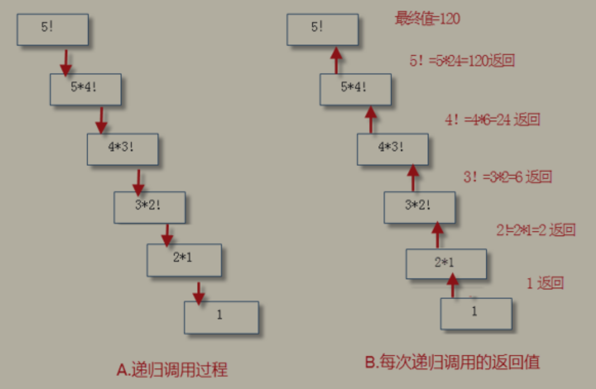
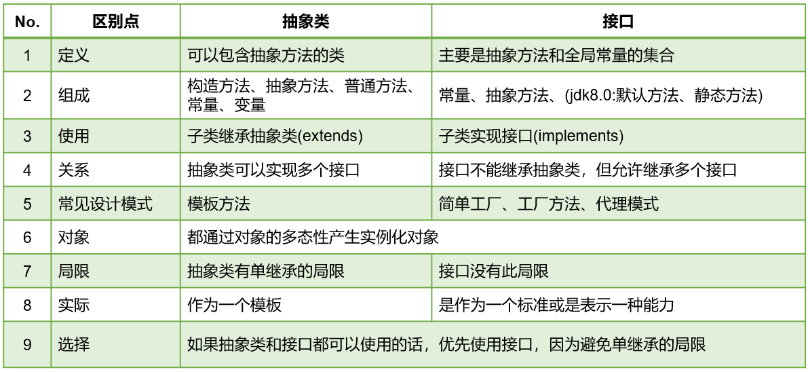
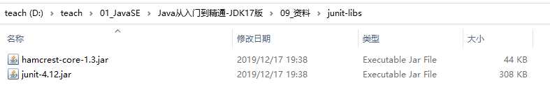
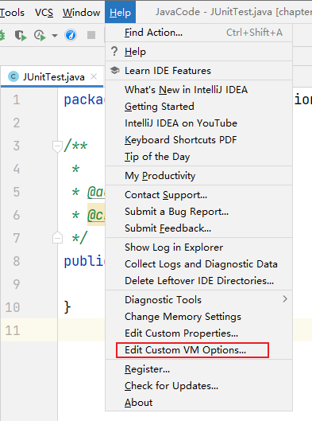
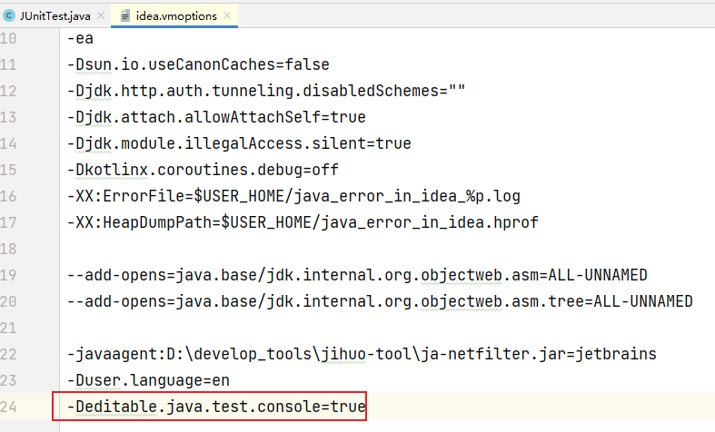
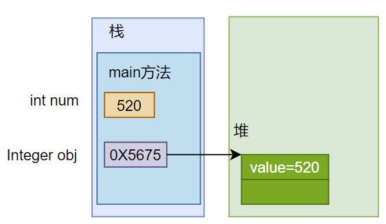
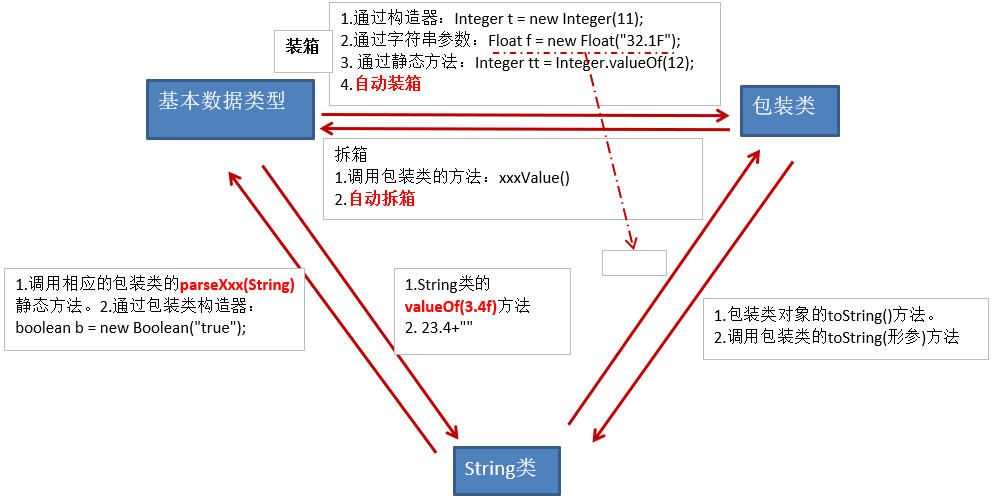

# Java 面向对象

学习面向对象内容的三条主线：

- Java 类及类的成员：（重点）属性、方法、构造器；（熟悉）代码块、内部类。

- 面向对象的特征：封装、继承、多态、（抽象）。

- 关键字的意义和使用：`this`、`super`、`package`、`import`、`static`、`final`、`interface`、`abstract` 等。

## 1 面向对象编程概述

### **1.1** 程序设计的思路

面向对象，是软件开发中的一类编程风格、开发范式。除了『面向对象』 ，还有『面向过程』、『指令式编程』和『函数式编程』。在所有的编程范式中，我们接触最多的还是 **面向过程** 和 **面向对象** 两种。

早期先有面向过程思想，随着软件规模的扩大，问题复杂性的提高，面向过程的弊端越来越明显，出现了面向对象思想并成为目前主流的方式。

1. 面向过程的程序设计思想（Process-Oriented Programming），简称 POP
   1. 关注的焦点是 **过程**：过程就是操作数据的步骤。如果某个过程的实现代码重复出现，那么就可以把这个过程抽取为一个 **函数**。这样就可以大大简化冗余代码，便于维护。
   2. 典型的语言：C语言。
   3. 代码结构：以 **函数** 为组织单位。
   4. 是一种『执行者思维』，适合解决简单问题。扩展能力差、后期维护难度较大。

2. 面向对象的程序设计思想（Object Oriented Programming），简称 OOP
3. 关注的焦点是 **类**：在计算机程序设计过程中，参照现实中事物，将事物的属性特征、行为特征抽象出来，用类来表示。
4. 典型的语言：Java、C#、C++、Python、Ruby、PHP 等。
5. 代码结构：以 **类** 为组织单位。每种事物都具备自己的 **属性** 和 **行为/功能**。
6. 是一种『设计者思维』，适合解决复杂问题。代码扩展性强、可维护性高。

### **1.2** 由实际问题考虑如何设计程序

**思考1：如何开车？**

面向过程思想思考问题时，我们首先思考『怎么按步骤实现』，并将步骤对应成方法，一步一步，最终完成。这个适合简单任务，不需要过多协作的情况。针对如何开车，可以列出步骤：


面向过程适合简单、不需要协作的事务，重点关注如何执行。

**思考2：如何造车？**

造车太复杂，需要很多协作才能完成。此时我们思考的是『车怎么设计』，而不是『怎么按特定步骤造车的问题』。这就是思维方式的转变，前者就是面向对象思想。所以，面向对象(Oriented-Object)思想更契合人的思维模式。

用面向对象思想思考『如何设计车』，自然地我们就会从『车由什么组成』开始思考。发现，车由如下结构组成：


我们找轮胎厂完成制造轮胎的步骤，发动机厂完成制造发动机的步骤，...；这样，大家可以同时进行车的制造，最终进行组装，大大提高了效率。但是，具体到轮胎厂的一个流水线操作，仍然是有步骤的，还是离不开面向过程思维！

因此，**面向对象可以帮助我们从宏观上把握、从整体上分析整个系统。** 但是，具体到实现部分的微观操作（就是一个个方法），仍然需要面向过程的思路去处理。

我们千万不要把面向过程和面向对象对立起来。他们是相辅相成的。面向对象离不开面向过程！

当需求单一，或者简单时，我们一步步去操作没问题，并且效率也挺高。可随着需求的更改，功能的增多，发现需要面对每一个步骤很麻烦了，这时就开始思索，能不能把这些步骤和功能进行封装，封装时根据不同的功能，进行不同的封装，功能类似的封装在一起。这样结构就清晰了很多。用的时候，找到对应的类就可以了。这就是面向对象的思想。

## 2 基本元素：类和对象

### 2.1 类和对象概述

类 (Class) 和 对象 (Object) 是面向对象的核心概念。

**类**：具有相同特征的事物的抽象描述，是 **抽象的**、**概念上的** 定义。

**对象**：实际存在的该类事物的 **每个个体**，是 **具体的**，因而也称为 **实例 (instance)** 。

可以理解为： 类 => 抽象概念的人 ； 对象 => 实实在在的某个人

### 2.2 类的成员概述

面向对象程序设计的重点是 **类的设计**。类的设计，其实就是 **类的成员的设计**。

现实世界的生物体，大到鲸鱼，小到蚂蚁，都是由最基本的『细胞』构成的。同理，Java 代码世界是由诸多个不同功能的『类』构成的。

现实生物世界中的细胞又是由什么构成的呢？细胞核、细胞质、…

Java 中用类 class 来描述事物也是如此。类，是一组相关『属性』和『行为』的集合，这也是类最基本的两个成员。

- 属性：该类事物的状态信息，对应类中的『成员变量』。

- 行为：该类事物要做什么操作，或者基于事物的状态能做什么，对应类中的『成员方法』。

### 2.3 面向对象完成功能的三步骤

**步骤1：类的定义**

类的定义使用关键字：`class`，格式如下：

```java
[修饰符] class 类名{
  属性声明;
  方法声明;
}
```

```java
public class Person{ 
  int age ; 
  public void eat() { 
    System.out.println("人吃饭"); 
  } 
}
```

**步骤2：对象的创建**

类对象的创建即类的实例化。

创建对象，使用关键字：`new`，格式如下：

```java
//方式1：给创建的对象命名 
//把创建的对象用一个引用数据类型的变量保存起来，这样就可以反复使用这个对象了 
类名 对象名 = new 类名(); 
//方式2：匿名对象
new 类名()
```

```java
class PersonTest{ 
  public static void main(String[] args){ 
    //创建Person类的对象 
    Person person = new Person(); 
  } 
}
```

**步骤3：对象调用属性或方法**

对象是类的一个实例，必然具备该类事物的属性和行为（即方法）。

使用『对象名.属性』或『对象名.方法』的方式访问对象成员（包括属性和方法）。

```java
class PersonTest{ 
  public static void main(String[] args){ 
    //创建Person类的对象 
    Person person = new Person();
    ing a = person.age;
    person.eat();
  } 
}
```

### 2.4 匿名对象 (anonymous object)

我们也可以不定义对象的句柄，而直接调用这个对象的方法。这样的对象叫做匿名对象。如：`new Person().eat();`。

使用情况：

如果一个对象只需要进行一次方法调用，那么就可以使用匿名对象。

我们经常将匿名对象作为实参传递给一个方法调用。

## 3 对象的内存解析

### 3.1 JVM内存结构划分

HotSpot Java 虚拟机的架构图如下。其中我们主要关心的是运行时数据区部分（Runtime Data Area）。


其中：

**堆 (Heap)**：此内存区域的唯一目的就是存放对象实例，几乎所有的对象实例都在这里分配内存。这一点在 Java 虚拟机规范中的描述是：**所有的对象实例以及数组都要在堆上分配**。

**栈 (Stack)**：是指虚拟机栈。虚拟机栈用于存储局部变量等。局部变量表存放了编译期可知长度的各种**基本数据类型** (boolean、byte、char、short、int、float、long、double)、对象引用（reference类型，它不等同于对象本身，是对象在堆内存的首地址）。方法执行完，自动释放。

**方法区 (Method Area)**：用于存储已被虚拟机加载的**类信息、常量、静态变量、即时编译器编译后的代码**等数据。

### 3.2 对象内存解析

```java
class Person { 
  String name; 
  int age; 
  boolean isMale; 
}
public class PersonTest { 
  public static void main(String[] args) { 
    Person p1 = new Person(); 
    p1.name = "赵同学"; 
    p1.age = 20; 
    p1.isMale = true;
    Person p2 = new Person(); 
    p2.age = 10; 
    Person p3 = p1; 
    p3.name = "郭同学"; 
  } 
}
```


**说明：**

- 堆：凡是 new 出来的结构（对象、数组）都放在堆空间中。

- 对象的属性存放在堆空间中。

- 创建一个类的多个对象（比如p1、p2），则每个对象都拥有当前类的一套"副本"（即属性）。当通过一个对象修改其属性时，不会影响其它对象此属性的值。

- 当声明一个新的变量使用现有的对象进行赋值时（比如p3 = p1），此时并没有在堆空间中创建新的对象。而是两个变量共同指向了堆空间中同一个对象。当通过一个对象修改属性时，会影响另外一个对象对此属性的调用。

```java
public class StudentTest{ 
  public static void main(String[] args){ 
    System.out.println(new Student()); //Student@7852e922 
    Student stu = new Student(); 
    System.out.println(stu); //Student@4e25154f 
    int[] arr = new int[5]; 
    System.out.println(arr); //[I@70dea4e 
  } 
}
```

直接打印对象名和数组名都是显示『类型@对象的hashCode值』，所以说 **类、数组都是引用数据类型，引用数据类型的变量中存储的是对象的地址，或者说指向堆中对象的首地址。**

## 4 类的成员之一：成员变量

成员变量 field

### **4.1** 如何声明成员变量

**语法格式：**

```java
[修饰符1] class 类名{ 
  [修饰符2] 数据类型 成员变量名 [= 初始化值]; 
}
```

**说明：**

- 位置要求：必须在类中，方法外

- 修饰符

  - 常用的权限修饰符有：private、缺省、protected、public

  - 其他修饰符：static、final

- 数据类型

  任何基本数据类型 或 任何引用数据类型。

- 成员变量名

 属于标识符，符合命名规则和规范即可。

- 初始化值

 根据情况，可以显式赋值；也可以不赋值，使用默认值。

```java
public class Person{ 
  private int age; //声明private变量 age 
  public String name = “Lila”; //声明public变量 name 
}
```

### 4.2 成员变量 vs 局部变量

#### 4.2.1 分类

在方法体外，类体内声明的变量称为成员变量。

在方法体内部等位置声明的变量称为局部变量。


其中，static 可以将成员变量分为两大类，静态变量和非静态变量。其中静态变量又称为类变量，非静态变量又称为实例变量或者属性。

#### 4.2.2 对比

相同点

- 变量声明的格式相同：数据类型 变量名 = 初始化值。

- 变量必须先声明、后初始化、再使用。

- 变量都有其对应的作用域。只在其作用域内是有效的。

不同点

- 声明位置和方式

  - 实例变量：在类中方法外

  - 局部变量：在方法体{}中或方法的形参列表、代码块中

- 在内存中存储的位置不同

  - 实例变量：堆

  - 局部变量：栈

- 生命周期

  - 实例变量：和对象的生命周期一样，随着对象的创建而存在，随着对象被GC回收而消亡，而且每一个对象的实例变量是独立的。

  - 局部变量：和方法调用的生命周期一样，每一次方法被调用而存在，随着方法执行的结束而消亡，而且每一次方法调用都是独立的。

- 作用域

  - 实例变量：通过对象就可以使用，本类中直接调用，其他类中『对象.实例变量』

  - 局部变量：出了作用域就不能使用

- 修饰符
  - 实例变量：public, protected, private, final, volatile, transient等
  - 局部变量：final

- 默认值

  - 实例变量：有默认值

  - 局部变量：没有，必须手动初始化。其中的形参比较特殊，靠实参给它初始化。

#### 4.2.3 初始化赋值

当一个对象被创建时，会对其中各种类型的成员变量自动进行初始化赋值。


```java
class Person {
 String name;
 int age = 1;
 boolean isMale;

 public void show(String nation) { 
  // nation:局部变量 
  String color; //color:局部变量 
  color = "yellow"; 
 } 
}
class PersonTest { 
 public static void main(String[] args) { 
  Person p = new Person(); 
  p.show("CHN"); 
 } 
}
```


## 5 类的成员之二：方法

方法 method

### 5.1 方法的理解

方法是类或对象行为特征的抽象，用来完成某个功能操作。在某些语言中也称为 **函数** 或 **过程** 。

将功能封装为方法的目的是，可以 **实现代码重用，减少冗余，简化代码**

Java里的方法 **不能独立存在** ，所有的方法必须定义在类里。

### 5.2 如何声明方法

**语法格式：**

```java
[修饰符] 返回值类型 方法名([形参列表])[throws 异常列表]{ 
  方法体的功能代码 
}
```

**说明：**

- 一个完整的方法 = 方法头 + 方法体
  - 方法头就是 `[修饰符] 返回值类型 方法名([形参列表])[throws 异常列表]` ，也称为 **方法签名** 。通常调用方法时只需要关注方法头就可以，从方法头可以看出这个方法的功能和调用格式。
  - 方法体就是方法被调用后要执行的代码。对于调用者来说，不了解方法体如何实现的，并不影响方法的使用。

- 方法头可能包含5个部分
  - **修饰符**：可选，方法的修饰符也有很多，例如：public、protected、private、static、abstract、native、final、synchronized 等。
  - **返回值类型**：表示方法运行的结果的数据类型，方法执行后将结果返回到调用者。
  - **方法名**：属于标识符，命名时遵循标识符命名规则和规范，见名知意。
  - **形参列表**：表示完成方法体功能时需要外部提供的数据列表。可以包含零个，一个或多个参数。
  - **异常列表**：可选，方法中抛出的异常类型。

- 方法体：方法体必须有{}括起来，在{}中编写完成方法功能的代码
- return 语句
  - return 语句的作用是结束方法的执行，并将方法的结果返回去。
  - 如果返回值类型不是 void，方法体中必须保证一定有 return 返回值; 语句，并且要求该返回值结果的类型与声明的返回值类型一致或兼容。
  - 如果返回值类型为 void 时，方法体中可以没有 return 语句，如果要用 return 语句提前结束方法的执行，那么 return 后面不能跟返回值，直接写 `return;` 就可以。
  - return 语句后面就不能再写其他代码了，否则会报错：`Unreachable code`。

### 5.3 调用实例方法

方法通过方法名被调用，且只有被调用才会执行。

**语法格式：**

```java
对象.方法名([实参列表])
```

**说明：**

- 必须先声明后使用，且方法必须定义在类的内部。
- 调用一次就执行一次，不调用不执行。
- 方法中可以调用类中的方法或属性，不可以在方法内部定义方法。

### 5.4 方法调用内存分析

```java
public class Person { 
  public static void main(String[] args) { 
    Person p1 = new Person(); 
    p1.eat(); 
  }
  public static void eat() { 
    sleep(); 
    System.out.println("人：吃饭"); 
  }
  public static void sleep(){ 
    System.out.println("人：睡觉"); 
    doSport(); 
  }
  public static void doSport(){
    System.out.println("人：运动"); 
  } 
}
```


## 6 类的成员之三：构造器

构造器 Constactor

### 6.1 构造器的作用

new 对象，并在 new 对象的时候做一些操作，比如为实例变量赋值。

### 6.2 构造器的语法格式

```java
[修饰符] class 类名{ 
  [修饰符] 构造器名(){ 
    // 实例初始化代码 
  }
  [修饰符] 构造器名(参数列表){ 
    // 实例初始化代码 
  } 
}
```

**说明：**

1. 构造器名必须与它所在的类名必须相同。
2. 它没有返回值，所以不需要返回值类型，也不需要 void。
3. 构造器的修饰符只能是权限修饰符，不能被其他任何修饰。比如，不能被 static、final、synchronized、abstract、native 修饰，不能有 return 语句返回值。

### 6.3 使用说明

1. 当我们没有显式的声明类中的构造器时，系统会默认提供一个无参的构造器并且该构造器的修饰符默认与类的修饰符相同.
2. 当我们显式的定义类的构造器以后，系统就不再提供默认的无参的构造器了。
3. 在类中，至少会存在一个构造器。
4. 构造器是可以重载的。

## 7 类的成员之四：代码块

如果成员变量想要初始化的值不是一个硬编码的常量值，而是需要通过复杂的计算或读取文件、或读取运行环境信息等方式才能获取的一些值，该怎么办呢？此时，可以考虑代码块（或初始化块）。

- 代码块(或初始化块)的作用：对 Java 类或对象进行初始化
- 代码块(或初始化块)的分类：

  - 一个类中代码块若有修饰符，则只能被 static 修饰，称为静态代码块 (static block)
  - 没有使用 static 修饰的，为非静态代码块。

### 7.1 静态代码块

如果想要为静态变量初始化，可以直接在静态变量的声明后面直接赋值，也可以使用静态代码块。

#### 7.1.1 语法格式

在代码块的前面加 static，就是静态代码块。

```java
【修饰符】 class 类 {
 static {
        静态代码块
    }
}
```

#### 7.1.2 静态代码块的特点

1. 可以有输出语句。
2. 可以对类的属性、类的声明进行初始化操作。
3. 不可以对非静态的属性初始化。即：不可以调用非静态的属性和方法。
4. 若有多个静态的代码块，那么按照从上到下的顺序依次执行。
5. 静态代码块的执行要先于非静态代码块。
6. **静态代码块随着类的加载而加载**，且只执行一次。

### 7.2 非静态代码块

#### 7.2.1 语法格式

```java
【修饰符】 class 类{
    {
        非静态代码块
    }
    【修饰符】 构造器名(){
     // 实例初始化代码
    }
    【修饰符】 构造器名(参数列表){
        // 实例初始化代码
    }
}
```

#### 7.2.2 非静态代码块的作用

和构造器一样，也是用于实例变量的初始化等操作。

#### 7.2.3 非静态代码块的意义

如果多个重载的构造器有公共代码，并且这些代码都是先于构造器其他代码执行的，那么可以将这部分代码抽取到非静态代码块中，减少冗余代码。

#### 7.2.4 非静态代码块的执行特点

1. 可以有输出语句。
2. 可以对 、类的声明进行初始化操作。
3. 除了调用非静态的结构外，还可以调用静态的变量或方法。
4. 若有多个非静态的代码块，那么按照从上到下的顺序依次执行。
5. 每次创建对象的时候，都会执行一次。且先于构造器执行。

## 8 面向对象特征一：封装性

封装 (encapsulation)

### 8.1 封装

所谓封装，就是把客观事物封装成抽象概念的类，并且类可以把自己的数据和方法只向可信的类或者对象开放，向没必要开放的类或者对象隐藏信息。

随着系统越来越复杂，类会越来越多，那么类之间的访问边界必须把握好，面向对象的开发原则要遵循 **高内聚**、**低耦合**。

- 高内聚 ：类的内部数据操作细节自己完成，不允许外部干涉。

- 低耦合 ：仅暴露少量的方法给外部使用，尽量方便外部调用。

> 高内聚、低耦合是软件工程中的概念，也是 UNIX 操作系统设计的经典原则。
>
> 内聚，指一个模块内各个元素彼此结合的紧密程度；耦合指一个软件结构内不同模块之间互连程度的度量。
>
> 内聚意味着重用和独立，耦合意味着多米诺效应牵一发动全身。

### 8.2 如何实现数据封装

实现封装就是控制类或成员的可见性范围。这就需要依赖访问控制修饰符，也称为权限修饰符来控制。

权限修饰符： public 、 protected 、 缺省 、 private 。具体访问范围如下：

| 修饰符    | 本类内部 | 本包内 | 其他包子类 | 其他包非子类 |
| --------- | -------- | ------ | ---------- | ------------ |
| private   | √        | ×      | ×          | ×            |
| 缺省      | √        | √      | ×          | ×            |
| protected | √        | √      | √          | ×            |
| public    | √        | √      | √          | √            |

**注意：**

1. 外部类要跨包使用必须是 public，否则仅限于本包使用
2. 跨包使用时，如果类的权限修饰符缺省，成员权限修饰符>类的权限修饰符也没有意义

### 8.3 封装性的体现

#### 8.3.1 成员变量/属性私有化

**概述：**

   私有化类的成员变量，提供公共的 get 和 set 方法，对外暴露获取和修改属性的功能。

**实现步骤：**

1. 使用 private 修饰成员变量
2. 提供 getXxx 方法 / setXxx 方法，可以访问成员变量

**成员变量封装的好处：**

- 让使用者只能通过事先预定的方法来访问数据，从而可以在该方法里面加入控制逻辑，限制对成员变量的不合理访问。还可以进行数据检查，从而有利于保证对象信息的完整性。

- 便于修改 ，提高代码的可维护性。主要说的是隐藏的部分，在内部修改了，如果其对外可以的访问方式不变的话，外部根本感觉不到它的修改。例如：JDK8 到 9 中，String 从 char[] 转为 byte[] 内部实现，而对外的方法不变，我们使用者根本感觉不到它内部的修改。

#### 8.3.2 私有化方法

**概述：**

   私有化成员方法，避免外部暴露，只能内部调用。

**实现步骤：**

   使用 private 修饰成员方法。

## 9 面向对象特征二：继承

继承 (Inheritance)

### 9.1 继承

**概念：**

​    多个类中存在相同属性和行为时，将这些内容抽取到单独一个类中，那么多个类中无需再定义这些属性和行为，只需要和抽取出来的类构成继承关系。

**语法：**

```java
[修饰符] class 类A {
 ...
}

[修饰符] class 类B extends 类A {
 ...
}
```

   类A，称为父类、超类、基类(base class)、SuperClass

   类B，称为子类、派生类(derived class)、SubClass

**好处：**

- 继承的出现减少了代码冗余，提高了代码的复用性。
- 继承的出现，更有利于功能的扩展。
- 继承的出现让类与类之间产生了`is-a`的关系，为多态的使用提供了前提。

**注意：不要仅为了获取其他类中某个功能而去继承**！

### 9.2 细节说明

1. 子类会继承父类所有的实例变量和实例方法。
2. 子类不能直接访问父类中私有成员变量和方法。
3. 子类不是父类的子集，而是对父类的扩展。
4. 支持多层继承。
5. 顶层父类是 Object 类。所有的类默认继承 Object，作为父类。
6. 一个父类可以同时拥有多个子类。
7. Java 只支持单继承，不支持多重继承。

## 10 面向对象特征三：多态性

多态 (Polymorphism)

### 10.1 多态的形式和体现

多态性，是面向对象中最重要的概念，在 Java 中对象的多态性是指：**父类的引用指向子类的对象**。

格式：（父类类型：指子类继承的父类类型，或者实现的接口类型）

```java
父类类型 变量名 = 子类对象；
```

举例：

```java
Person p = new Student();
Object o = new Person(); //Object类型的变量o，指向Person类型的对象
o = new Student(); //Object类型的变量o，指向Student类型的对象
```

对象的多态：在Java中，**子类的对象可以替代父类的对象使用**。所以，一个引用类型变量可能指向(引用)多种不同类型的对象

### 10.2 多态的理解

Java 引用变量有两个类型：**编译时类型** 和 **运行时类型**。编译时类型由**声明**该变量时使用的类型决定，运行时类型由**实际赋给该变量**的对象决定。简称：**编译时，看左边；运行时，看右边。**

- 若编译时类型和运行时类型不一致，就出现了对象的多态性
- 多态情况下，“看左边”：看的是父类的引用（父类中不具备子类特有的方法）；“看右边”：看的是子类的对象（实际运行的是子类重写父类的方法）

多态的使用前提：① 类的继承关系  ② 方法的重写

### 10.3 使用场景

开发中，有时我们在设计一个数组、或一个成员变量、或一个方法的形参、返回值类型时，无法确定它具体的类型，只能确定它是某个系列的类型。

**好处**：变量引用的子类对象不同，执行的方法就不同，实现动态绑定。代码编写更灵活、功能更强大，可维护性和扩展性更好了。

**弊端**：一个引用类型变量如果声明为父类的类型，但实际引用的是子类对象，那么该变量就不能再访问子类中添加的属性和方法。

```java
Student m = new Student();
m.school = "pku";  //合法,Student类有school成员变量
Person e = new Student(); 
e.school = "pku"; //非法,Person类没有school成员变量
// 属性是在编译时确定的，编译时e为Person类型，没有school成员变量，因而编译错误。
```

开发中：

使用父类做方法的形参，是多态使用最多的场合。即使增加了新的子类，方法也无需改变，提高了扩展性，符合开闭原则。

【开闭原则OCP】

- 对扩展开放，对修改关闭
- 通俗解释：软件系统中的各种组件，如模块（Modules）、类（Classes）以及功能（Functions）等，应该在不修改现有代码的基础上，引入新功能

### 10.4 虚方法调用

虚方法调用 (Virtual Method Invocation)

在 Java 中虚方法是指在编译阶段不能确定方法的调用入口地址，在运行阶段才能确定的方法，即可能被重写的方法。

```java
Person e = new Student();
e.getInfo(); //调用Student类的getInfo()方法
```

子类中定义了与父类同名同参数的方法，在多态情况下，将此时父类的方法称为虚方法，父类根据赋给它的不同子类对象，动态调用属于子类的该方法。这样的方法调用在编译期是无法确定的。

> 拓展：
>
> `静态链接（或早起绑定）`：当一个字节码文件被装载进JVM内部时，如果被调用的目标方法在编译期可知，且运行期保持不变时。这种情况下将调用方法的符号引用转换为直接引用的过程称之为静态链接。那么调用这样的方法，就称为非虚方法调用。比如调用静态方法、私有方法、final方法、父类构造器、本类重载构造器等。
>
> `动态链接（或晚期绑定）`：如果被调用的方法在编译期无法被确定下来，也就是说，只能够在程序运行期将调用方法的符号引用转换为直接引用，由于这种引用转换过程具备动态性，因此也就被称之为动态链接。调用这样的方法，就称为虚方法调用。比如调用重写的方法（针对父类）、实现的方法（针对接口）。

### 10.5 成员变量没有多态性

- 若子类重写了父类方法，就意味着子类里定义的方法彻底覆盖了父类里的同名方法，系统将不可能把父类里的方法转移到子类中。

- 对于实例变量则不存在这样的现象，即使子类里定义了与父类完全相同的实例变量，这个实例变量依然不可能覆盖父类中定义的实例变量

```java
package com.test.polymorphism.grammar;

public class TestVariable {
    public static void main(String[] args) {
        Base b = new Sub();
        System.out.println(b.a);
        System.out.println(((Sub)b).a);

        Sub s = new Sub();
        System.out.println(s.a);
        System.out.println(((Base)s).a);
    }
}
class Base{
    int a = 1;
}
class Sub extends Base{
    int a = 2;
}
```

### 10.6 向上转型与向下转型

首先，一个对象在 new 的时候创建是哪个类型的对象，它从头至尾都不会变。即这个对象的运行时类型，本质的类型用于不会变。但是，把这个对象赋值给不同类型的变量时，这些变量的编译时类型却不同。

因为多态，就一定会有把子类对象赋值给父类变量的时候，这个时候，在`编译期间`，就会出现类型转换的现象。

但是，使用父类变量接收了子类对象之后，我们就`不能调用`子类拥有，而父类没有的方法了。这也是多态给我们带来的一点"小麻烦"。所以，想要调用子类特有的方法，必须做类型转换，使得`编译通过`。

- **向上转型**：当左边的变量的类型（父类） > 右边对象/变量的类型（子类），我们就称为向上转型
  - 此时，编译时按照左边变量的类型处理，就只能调用父类中有的变量和方法，不能调用子类特有的变量和方法了
  - 但是，**运行时，仍然是对象本身的类型**，所以执行的方法是子类重写的方法体。
  - 此时，一定是安全的，而且也是自动完成的

- **向下转型**：当左边的变量的类型（子类）<右边对象/变量的编译时类型（父类），我们就称为向下转型
  - 此时，编译时按照左边变量的类型处理，就可以调用子类特有的变量和方法了
  - 但是，**运行时，仍然是对象本身的类型**
  - 不是所有通过编译的向下转型都是正确的，可能会发生 ClassCastException，为了安全，可以通过 isInstanceof 关键字进行判断

为了避免 ClassCastException 的发生，Java 提供了 `instanceof` 关键字，给引用变量做类型的校验。如下代码格式：

```java
// 检验对象a是否是数据类型A的对象，返回值为boolean型
对象a instanceof 数据类型A 
```

- 说明：
  - 只要用 instanceof 判断返回 true 的，那么强转为该类型就一定是安全的，不会报 ClassCastException 异常。
  - 如果 对象a 属于 类A的子类B，a instanceof A 值也为 true。
  - 要求 对象a 所属的类与类A必须是子类和父类的关系，否则编译错误。

## 11 方法扩展

### 11.1 方法重载

**概念:**

- 方法重载：在同一个类中，允许存在一个以上的同名方法，只要它们的参数列表不同即可。参数列表不同，意味着参数个数或参数类型的不同。

- 重载的特点：与修饰符、返回值类型无关，只看参数列表，且参数列表必须不同。(参数个数或参数类型)。调用时，根据方法参数列表的不同来区别。

- 重载方法调用：JVM 通过方法的参数列表，调用匹配的方法。先找个数、类型最匹配的，再找个数和类型可以兼容的，如果同时多个方法可以兼容将会报错。

**示例:**

`System.out.println()` 方法就是典型的重载方法，其内部的声明形式如下：

```java
public class PrintStream { 
   public void println(byte x) 
    public void println(short x) 
    public void println(int x) 
    public void println(long x) 
    public void println(float x) 
    public void println(double x) 
    public void println(char x) 
    public void println(double x) 
    public void println() 
}
```

自定义重载方法

```java
// 返回两个整数的和 
public int add(int x,int y) { 
  return x+y; 
}
// 返回三个整数的和 
public int add(int x,int y,int z) { 
  return x+y+z; 
}
// 返回两个小数的和 
public double add(double x,double y) { 
  return x+y; 
}
```

方法的重载和返回值类型无关，以下方法不是重载

```java
public int getOneToHundred() { 
  return (int)(Math.random()*100); 
}
public double getOneToHundred() { 
  return Math.random()*100; 
}
```

### 11.2 可变个数的形参

在 JDK 5.0 中提供了 **Varargs**(variable number of arguments) 机制。即当定义一个方法时，形参的类型可以确定，但是形参的个数不确定，那么可以考虑使用可变个数的形参。

**格式：**

```java
方法名(参数的类型名 ...参数名)
```

**举例：**

```java
// JDK 5.0以前：采用数组形参来定义方法，传入多个同一类型变量 
public static void test(int a ,String[] books); 
// JDK5.0：采用可变个数形参来定义方法，传入多个同一类型变量 
public static void test(int a ,String...books);
```

**特点：**

1. 可变参数：方法参数部分指定类型的参数个数是可变多个：0个，1个或多个

2. 可变个数形参的方法与同名的方法之间，彼此构成重载

3. 可变参数方法的使用与方法参数部分使用数组是一致的，二者不能同时声明，否则报错。

4. 方法的参数部分有可变形参，需要放在形参声明的最后

5. 在一个方法的形参中，最多只能声明一个可变个数的形参

**示例：**

```java
public class StringTools { 
  String concat(char seperator, String... args) { 
    String str = "";
    for (int i = 0; i < args.length; i++) { 
      if(i**0) {
        str += args[i]; 
      }else{
        str += seperator + args[i]; 
      } 
    }
    return str; 
  } 
}
```

### 11.3 方法的参数传递机制

#### 11.3.1 形参和实参

- 形参（formal parameter）：在定义方法时，方法名后面括号()中声明的变量称为形式参数，简称形参。

- 实参（actual parameter）：在调用方法时，方法名后面括号()中的使用的值/变量/表达式称为实际参数，简称实参。

#### 11.3.2 参数传递机制：值传递

Java 里方法的参数传递方式只有一种：值传递。即将实际参数值的副本（复制品）传入方法内，而参数本身不受影响。

- 形参是基本数据类型：将实参基本数据类型变量的“数据值”传递给形参
- 形参是引用数据类型：将实参引用数据类型变量的“地址值”传递给形参

### 11.4 递归(recursion)

**调用：**

   方法自己调用自己的现象就称为递归。

**分类：**

- 直接递归：方法自身调用自己。

- 间接递归：可以理解为A()方法调用B()方法，B()方法调用C()方法，C()方法调用A()方法。

**说明**：

- 递归方法包含了一种隐式的循环。

- 递归方法会重复执行某段代码，但这种重复执行无须循环控制。

- 递归一定要向已知方向递归，否则这种递归就变成了无穷递归，停不下来，类似于死循环。最终发生栈内存溢出。

**举例：**

- 1-n 的和

  ```java
  public class RecursionDemo { 
   public static void main(String[] args) { 
    RecursionDemo demo = new RecursionDemo(); 
    // 计算1~num的和，使用递归完成 
    int num = 5; 
    // 调用求和的方法
    int sum = demo.getSum(num); 
    System.out.println(sum); 
   }
   /**
    * 通过递归算法实现. 参数列表:int 返回值类型: int 
    */
   public int getSum(int num) { 
    // num为1时,方法返回1, 相当于是方法的出口,num总有是1的情况
    if (num == 1) { 
     return 1; 
    }
    // num不为1时,方法返回 num +(num-1)的累和 递归调用getSum方法
    return num + getSum(num-1); 
   } 
  }
  ```

  

- n 的阶乘 n!

  ```java
  public int multiply(int num) { 
    if (num == 1) { 
      return 1; 
    } else {
      return num * multiply(num - 1);
    }
  }
  ```

  

- 计算斐波那契数列（Fibonacci）的第n个值

  1,1,2,3,5,8,13,21,34,55,....

  斐波那契数列满足如下规律，即从第三个数开始，一个数等于前两个数之和。假设f(n)代表斐波那契数列的第n个值，那么f(n)满足：

  f(n) = f(n-2) + f(n-1);

  ```java
  int f(int n) {
    if (n < 1) {
      return 1;
    }
    if (n == 1 || n == 2) {
      return 1;
    }
    return f(n - 2) + f(n - 1);
  }
  ```

**注意：**

1. 递归调用会占用大量的系统堆栈，内存耗用多，在递归调用层次多时速度要比循环慢的多，所以在使用递归时要慎重。

2. 在要求高性能的情况下尽量避免使用递归，递归调用既花时间又耗内存。考虑使用循环迭代。

### 11.5 方法重写

**概念：**

父类的所有方法子类都会继承，但是当某个方法被继承到子类之后，子类觉得父类原来的实现不适合于自己当前的类，该怎么办呢？子类可以对从父类中继承来的方法进行改造，我们称为方法的重写 (override、overwrite)。

在程序执行时，子类的方法将覆盖父类的方法。

`@Override` 使用说明：

写在方法上面，用来检测是不是满足重写方法的要求。这个注解就算不写，只要满足要求，也是正确的方法覆盖重写。建议保留，这样编译器可以帮助我们检查格式，另外也可以让阅读源代码的程序员清晰的知道这是一个重写的方法。

**要求：**

1. 子类重写的方法必须和父类被重写的方法具有**相同的方法名称、参数列表**。

2. 子类重写的方法的返回值类型**不能大于**父类被重写的方法的返回值类型。（例如：Student < Person）。如果返回值类型是基本数据类型和void，那么必须是相同。

3. 子类重写的方法使用的访问权限**不能小于**父类被重写的方法的访问权限。（public > protected > 缺省 > private）
   1. 父类私有方法不能重写
   2. 跨包的父类缺省的方法也不能重写

4. 子类方法抛出的异常不能大于父类被重写方法的异常

此外，子类与父类中同名同参数的方法必须同时声明为非static的(即为重写)，或者同时声明为static的（不是重写）。因为static方法是属于类的，子类无法覆盖父类的方法。

## 12 关键字

### 12.1 package

package，称为包，用于指明该文件中定义的类、接口等结构所在的包。

**格式：**

```java
package 顶层包名.子包名;
```

**说明：**

- 一个源文件只能有一个声明包的 package 语句

- package 语句作为 Java 源文件的第一条语句出现。若缺省该语句，则指定为无名包。

- 包名，属于标识符，满足标识符命名的规则和规范（全部小写）、见名知意

  - 包通常使用所在公司域名的倒置：com.alibaba.xxx。

  - 取包名时不要使用「java.xx」包

- 包对应于文件系统的目录，package 语句中用 “.” 来指明包(目录)的层次，每.一次就表示一层文件目录。

- 同一个包下可以声明多个结构（类、接口），但是不能定义同名的结构（类、接口）。不同的包下可以定义同名的结构（类、接口）。

**作用：**

- 包可以包含类和子包，划分项目层次，便于管理

- 帮助管理大型软件系统：将功能相近的类划分到同一个包中。比如：MVC的设计模式

- 解决类命名冲突的问题

- 控制访问权限

**JDK 中主要的包介绍：**

- `java.lang` ：包含一些 Java 语言的核心类，如 String、Math、Integer、System 和 Thread，提供常用功能

- `java.net` ：包含执行与网络相关的操作的类和接口。
- `java.io` ：包含能提供多种输入/输出功能的类。
- `java.util` ：包含一些实用工具类，如定义系统特性、接口的集合框架类、使用与日期日历相关的函数。
- `java.text` ：包含了一些 java 格式化相关的类。
- `java.sql` ：包含了 java 进行 JDBC 数据库编程的相关类/接口。
- `java.awt` ：包含了构成抽象窗口工具集（abstract window toolkits）的多个类，这些类被用来构建和管理应用程序的图形用户界面(GUI)。

### 12.2 import

为了使用定义在其它包中的 Java 类，需用 import 语句来显式引入指定包下所需要的类。相当于 import 语句告诉编译器到哪里去寻找这个类。

**格式：**

```java
import 包名.类名;
```

**注意：**

- import 语句，声明在包的声明和类的声明之间。

- 如果需要导入多个类或接口，那么就并列显式多个 import 语句即可。

- 如果使用 a.*导入结构，表示可以导入a包下的所有的结构。比如：可以使用 java.util.* 的方式，一次性导入 util 包下所有的类或接口。

- 如果导入的类或接口是 java.lang 包下的，或者是当前包下的，则可以省略此 import 语句。

- 如果已经导入 java.a 包下的类，那么如果需要使用 a 包的子包下的类的话，仍然需要导入。

- 如果在代码中使用不同包下的同名的类，那么就需要使用类的全类名的方式指明调用的是哪个类。

- （了解）import static 组合的使用：调用指定类或接口下的静态的属性或方法。

### 12.3 this

**概念：**

- 在方法（准确的说是实例方法或非static的方法）内部使用，表示调用该方法的对象。

- 在构造器内部使用，表示该构造器正在初始化的对象。

**使用：**

- this 可以调用的结构：成员变量、方法和构造器。
- this 可以省略，但是当形参与成员变量同名时，如果在方法内或构造器内需要使用成员变量，必须添加this来表明该变量是类的成员变量。用来区分成员变量和局部变量。
- 使用 this 访问属性和方法时，如果在本类中未找到，会从父类中查找。
- 同一个类中构造器互相调用，使用 this() 或 this(实参列表)，只能声明在构造器首行

### 12.4 super

**概念：**

在 Java 类中使用 super 来调用父类中的指定操作：

- super 可用于访问父类中定义的属性
- super 可用于调用父类中定义的成员方法
- super 可用于在子类构造器中调用父类的构造器

**注意：**

- 尤其当子父类出现同名成员时，可以用 super 表明调用的是父类中的成员
- super 的追溯**不仅限于直接父类**
- super 和 this 的用法相像，this 代表本类对象的引用，super 代表父类的内存空间的标识

**使用场景：**

- 子类中调用父类被重写的方法
- 子类中调用父类中同名的成员变量
- 子类构造器中调用父类构造器

**总结：**

- **方法前面没有super.和this.**

  先从子类找匹配方法，如果没有，再从直接父类找，再没有，继续往上追溯

- **方法前面有this.**

  先从子类找匹配方法，如果没有，再从直接父类找，再没有，继续往上追溯

- **方法前面有super.**

  从当前子类的直接父类找，如果没有，继续往上追溯

应该避免子类声明和父类重名的成员变量！

### 12.5 static

**回顾类中的实例变量（即非 static 的成员变量）**

```java
class Circle {
 private double radius;
 public Circle(double radius) {
        this.radius = radius;
 }
 public double findArea() {
        return Math.PI * radius * radius;
    }
}
```

创建两个Circle对象：

```java
Circle c1 = new Circle(2.0); //c1.radius=2.0
Circle c2 = new Circle(3.0); //c2.radius=3.0
```

Circle 类中的变量 radius 是一个实例变量 (instance variable)，它属于类的每一个对象，c1 中的 radius 变化不会影响 c2  的radius，反之亦然。

**如果想让一个成员变量被类的所有实例所共享，就用 static 修饰即可，称为类变量（或类属性）！**

#### 12.5.1 类属性、类方法的设计思想

当我们编写一个类时，其实就是在描述其对象的属性和行为，而并没有产生实质上的对象，只有通过 new 关键字才会产出对象，这时系统才会分配内存空间给对象，其方法才可以供外部调用。我们有时候希望无论是否产生了对象或无论产生了多少对象的情况下，某些特定的数据在内存空间里只有一份。

此外，在类中声明的实例方法，在类的外面必须要先创建对象，才能调用。但是有些方法的调用者和当前类的对象无关，这样的方法通常被声明为`类方法`，由于不需要创建对象就可以调用类方法，从而简化了方法的调用。

这里的类变量、类方法，只需要使用`static`修饰即可。所以也称为静态变量、静态方法。

#### 12.5.2 static 关键字

使用范围：在 Java 类中，可用 static 修饰属性、方法、代码块、内部类

被修饰后的成员具备以下特点：

- 随着类的加载而加载
- 优先于对象存在
- 修饰的成员，被所有对象所共享
- 访问权限允许时，可不创建对象，直接被类调用

#### 12.5.3 静态变量

使用 static 修饰的成员变量就是静态变量（或类变量、类属性）

**特点：**

- 静态变量的默认值规则和实例变量一样。
- 静态变量值是所有对象共享。
- 静态变量在本类中，可以在任意方法、代码块、构造器中直接使用。
- 如果权限修饰符允许，在其他类中可以通过“**类名.静态变量**”直接访问，也可以通过“**对象.静态变量**”的方式访问（但是更推荐使用类名.静态变量的方式）。
- 静态变量的get/set方法也静态的，当局部变量与静态变量重名时，使用“**类名.静态变量**”进行区分。

#### 12.5.4 静态方法

用 static 修饰的成员方法就是静态方法。

**特点：**

- 静态方法在本类的任意方法、代码块、构造器中都可以直接被调用。
- 只要权限修饰符允许，静态方法在其他类中可以通过“**类名.静态方法**“的方式调用。也可以通过”**对象.静态方法**“的方式调用（但是更推荐使用类名.静态方法的方式）。
- 在 static 方法内部只能访问类的 static 修饰的属性或方法，不能访问类的非 static 的结构。
- 静态方法可以被子类继承，但不能被子类重写。
- 静态方法的调用都只看编译时类型。
- 因为不需要实例就可以访问 static 方法，因此 static 方法内部不能有 this，也不能有 super。如果有重名问题，使用“**类名.**”进行区别。

### 12.6 final

final：最终的，不可更改的

**final 修饰类：**

表示这个类不能被继承，没有子类。提高安全性，提高程序的可读性。

例如：String 类、System 类、StringBuffer 类

**final 修饰方法：**

表示这个方法不能被子类重写。

例如：Object 类中的 getClass()

**final 修饰变量：**

final 修饰某个变量（成员变量或局部变量），一旦赋值，它的值就不能被修改，即常量，常量名建议使用大写字母。

例如：final double MY_PI = 3.14;

如果某个成员变量用 final 修饰后，没有set方法，并且必须初始化。

## 13 Object 类的使用

### 13.1 如何理解根父类

- 类 `java.lang.Object` 是类层次结构的根类，即所有其它类的父类。每个类都使用 `Object` 作为超类。

- Object 类型的变量与除 Object 以外的任意引用数据类型的对象都存在多态引用

- 所有对象（包括数组）都实现这个类的方法。

- 如果一个类没有特别指定父类，那么默认则继承自 Object 类。

### 13.2 Object 类的方法

根据 JDK 源代码及 Object 类的 API 文档，Object类当中包含的方法有11个。这里我们主要关注其中的6个：

#### 13.2.1 equals()

`==`

- 基本类型比较值:只要两个变量的值相等，即为true。

  ```java
  int a=5; 
  if(a==6){…}
  ```

- 引用类型比较引用(是否指向同一个对象)：只有指向同一个对象时，`==`才返回true。

  ```java
  Person p1=new Person();       
  Person p2=new Person();
  if (p1**p2){…}
  ```

  - 用`==`进行比较时，符号两边的**数据类型必须兼容**(可自动转换的基本数据类型除外)，否则编译出错

**equals()：**所有类都继承了 Object，也就获得了 `equals()` 方法。还可以重写。

- 只能比较引用类型，Object 类源码中 `equals()` 的作用与“`==`”相同：比较是否指向同一个对象。

- 格式:obj1.equals(obj2)

- 特例：当用 equals() 方法进行比较时，对类 File、String、Date 及包装类（Wrapper Class）来说，是比较类型及内容而不考虑引用的是否是同一个对象，原因是在这些类中重写了 Object 类的 equals() 方法。

- 当自定义使用  equals() 时，可以重写。用于比较两个对象的“内容”是否都相等

- 重写 equals() 方法的原则

  - **对称性**：如果 x.equals(y) 返回是 “true”，那么 y.equals(x) 也应该返回是 “true”。

  - **自反性**：x.equals(x) 必须返回是 “true”。

  - **传递性**：如果 x.equals(y) 返回是 “true”，而且 y.equals(z) 返回是 “true”，那么 z.equals(x) 也应该返回是 “true”。

  - **一致性**：如果 x.equals(y) 返回是 “true”，只要x和y内容一直不变，不管你重复 x.equals(y) 多少次，返回都是 “true”。

  - 任何情况下，x.equals(null)，永远返回是 “false”；x.equals (和x不同类型的对象)永远返回是 “false”。

    ```java
    class User{
     private String host;
     private String username;
     private String password;
     public User(String host, String username, String password) {
      super();
      this.host = host;
      this.username = username;
      this.password = password;
     }
     public User() {
      super();
     }
     public String getHost() {
      return host;
     }
     public void setHost(String host) {
      this.host = host;
     }
     public String getUsername() {
      return username;
     }
     public void setUsername(String username) {
      this.username = username;
     }
     public String getPassword() {
      return password;
     }
     public void setPassword(String password) {
      this.password = password;
     }
     @Override
     public String toString() {
      return "User [host=" + host + ", username=" + username + ", password=" + password + "]";
     }
     @Override
     public boolean equals(Object obj) {
      if (this == obj)
       return true;
      if (obj == null)
       return false;
      if (getClass() != obj.getClass())
       return false;
      User other = (User) obj;
      if (host == null) {
       if (other.host != null)
        return false;
      } else if (!host.equals(other.host))
       return false;
      if (password == null) {
       if (other.password != null)
        return false;
      } else if (!password.equals(other.password))
       return false;
      if (username == null) {
       if (other.username != null)
        return false;
      } else if (!username.equals(other.username))
       return false;
      return true;
     }
     
    }
    ```

**`==` 和 equals 的区别:**

- `==` 既可以比较基本类型也可以比较引用类型。对于基本类型就是比较值，对于引用类型就是比较内存地址。
- equals 是属于 java.lang.Object 类里面的方法，如果该方法没有被重写过默认也是 `==`; 我们可以看到 String 等类的 equals 方法是被重写过。
- 具体要看自定义类里有没有重写 Object 的 equals 方法来判断。
- 通常情况下，重写 equals 方法，会比较类中的相应属性是否都相等。

#### 8.2.2 toString()

方法签名：`public String toString()`

① 默认情况下，toString() 返回的是“对象的运行时类型 @ 对象的 hashCode 值的十六进制形式"

② 在进行 String 与其它类型数据的连接操作时，自动调用 toString() 方法

③ 如果我们直接 System.out.println(对象)，默认会自动调用这个对象的 toString()

④ 可以根据需要在用户自定义类型中重写 toString() 方法。如 String 类重写了 toString() 方法，返回字符串的值。

例如自定义的 Person 类：

```java
public class Person {  
    private String name;
    private int age;

    @Override
    public String toString() {
        return "Person{" + "name='" + name + '\'' + ", age=" + age + '}';
    }
}
```

#### 8.2.3 clone()

```java
 // Object类的clone()的使用
  public class CloneTest {
    public static void main(String[] args) {
      Animal a1 = new Animal("花花");
      try {
        Animal a2 = (Animal) a1.clone();
        System.out.println("原始对象：" + a1);
        a2.setName("毛毛");
        System.out.println("clone之后的对象：" + a2);
      } catch (CloneNotSupportedException e) {
        e.printStackTrace();
      }
    }
  }

  class Animal implements Cloneable{
    private String name;

    public Animal() {
      super();
    }

    public Animal(String name) {
      super();
      this.name = name;
    }

    public String getName() {
      return name;
    }

    public void setName(String name) {
      this.name = name;
    }

    @Override
    public String toString() {
      return "Animal [name=" + name + "]";
    }

    @Override
    protected Object clone() throws CloneNotSupportedException {
      // TODO Auto-generated method stub
      return super.clone();
    }

  }
```

#### 8.2.4 finalize()

- 当对象被回收时，系统自动调用该对象的 finalize() 方法。（不是垃圾回收器调用的，是本类对象调用的）
  - 永远不要主动调用某个对象的 finalize 方法，应该交给垃圾回收机制调用。
- 什么时候被回收：当某个对象没有任何引用时，JVM 就认为这个对象是垃圾对象，就会在之后不确定的时间使用垃圾回收机制来销毁该对象，在销毁该对象前，会先调用 finalize() 方法。
- 子类可以重写该方法，目的是在对象被清理之前执行必要的清理操作。比如，在方法内断开相关连接资源。
  - 如果重写该方法，让一个新的引用变量重新引用该对象，则会重新激活对象。
- 在 JDK9 中此方法已经被**标记为过时**的。

```java
public class FinalizeTest {
 public static void main(String[] args) {
  Person p = new Person("Peter", 12);
  System.out.println(p);
  p = null;//此时对象实体就是垃圾对象，等待被回收。但时间不确定。
  System.gc();//强制性释放空间
 }
}

class Person{
 private String name;
 private int age;

 public Person(String name, int age) {
  super();
  this.name = name;
  this.age = age;
 }
 public String getName() {
  return name;
 }
 public void setName(String name) {
  this.name = name;
 }
 public int getAge() {
  return age;
 }
 public void setAge(int age) {
  this.age = age;
 }
 //子类重写此方法，可在释放对象前进行某些操作
 @Override
 protected void finalize() throws Throwable {
  System.out.println("对象被释放--->" + this);
 }
 @Override
 public String toString() {
  return "Person [name=" + name + ", age=" + age + "]";
 }
 
}
```

#### 8.2.5 getClass()

`public final Class<?> getClass()`：获取对象的运行时类型

> 因为 Java 有多态现象，所以一个引用数据类型的变量的编译时类型与运行时类型可能不一致，因此如果需要查看这个变量实际指向的对象的类型，需要用 getClass() 方法

```java
public static void main(String[] args) {
 Object obj = new Person();
 System.out.println(obj.getClass());//运行时类型
}
```

结果：

```java
class com.test.java.Person
```

#### 8.2.6 hashCode()

public int hashCode()：返回每个对象的hash值。

```java
public static void main(String[] args) {
 System.out.println("AA".hashCode());//2080
    System.out.println("BB".hashCode());//2112
}
```

### 13.3 native 关键字的理解

使用 native 关键字说明这个方法是原生函数，也就是这个方法是用`C/C++`等非Java语言实现的，并且**被编译成了DLL**，由Java去调用。

- 本地方法是有方法体的，用 c 语言编写。由于本地方法的方法体源码没有对我们开源，所以我们看不到方法体。

- 在 Java 中定义一个 native 方法时，并不提供实现体。

**为什么 要用 native 方法**

Java使用起来非常方便，然而有些层次的任务用java实现起来不容易，或者我们对程序的效率很在意时，例如：Java需要与一些底层操作系统或某些硬件交换信息时的情况。native 方法正是这样一种交流机制：它为我们提供了一个非常简洁的接口，而且我们无需去了解 Java 应用之外的繁琐的细节。

**native 声明的方法，对于调用者，可以当做和其他 Java 方法一样使用**

native method  的存在并不会对其他类调用这些本地方法产生任何影响，实际上调用这些方法的其他类甚至不知道它所调用的是一个本地方法。JVM 将控制调用本地方法的所有细节。

## 14 阶段性知识补充

### 14.1 类中属性赋值过程

1、在类的属性中，可以有哪些位置给属性赋值？

① 默认初始化

② 显式初始化

③ 构造器中初始化

④ 通过"对象.属性"或"对象.方法"的方式，给属性赋值

2、这些位置执行的先后顺序是怎样？

顺序：① - ② - ③ - ④

3、说明：

上述中的 ①、②、③ 在对象创建过程中，只执行一次。

④ 是在对象创建后执行的，可以根据需求多次执行。

### 10.2 子类对象实例化过程


### 14.2 JavaBean

JavaBean 是一种 Java 语言写成的可重用组件。是指符合如下标准的 Java 类：

- 类是公共的
- 有一个无参的公共的构造器
- 有属性，且有对应的 get、set 方法

用户可以使用 JavaBean 将功能、处理、值、数据库访问和其他任何可以用 Java 代码创造的对象进行打包，并且其他的开发者可以通过内部的JSP 页面、Servlet、其他 JavaBean、applet 程序或者应用来使用这些对象。用户可以认为 JavaBean 提供了一种随时随地的复制和粘贴的功能，而不用关心任何改变。

《Think in Java》中提到，JavaBean 最初是为 Java GUI 的可视化编程实现的。你拖动 IDE 构建工具创建一个 GUI 组件（如多选框），其实是工具给你创建 Java 类，并提供将类的属性暴露出来给你修改调整，将事件监听器暴露出来。

### 14.3 UML 类图

UML（Unified Modeling Language，统一建模语言），用来描述 **软件模型** 和 **架构** 的图形化语言。

常用的 UML 工具软件有 PowerDesinger 、 Rose 和 Enterprise Architect。

UML 工具软件不仅可以绘制软件开发中所需的各种图表，还可以生成对应的源代码。

在软件开发中，使用 UML 类图 可以更加直观地描述类内部结构（类的属性和操作）以及类之间的关系（如关联、依赖、聚合等）。

- +表示 public 类型， - 表示 private 类型，#表示protected类型
- 方法的写法: 方法的类型(+、-) 方法名(参数名：参数类型)：返回值类型
- 斜体表示抽象方法或类。


### 14.4 理解 main 方法的语法

由于 JVM 需要调用类的 main() 方法，所以该方法的访问权限必须是 public，又因为 JVM 在执行 main() 方法时不必创建对象，所以该方法必须是 static 的，该方法接收一个 String 类型的数组参数，该数组中保存执行 Java 命令时传递给所运行的类的参数。

又因为 main() 方法是静态的，我们不能直接访问该类中的非静态成员，必须创建该类的一个实例对象后，才能通过这个对象去访问类中的非静态成员，这种情况，我们在之前的例子中多次碰到。

**命令行参数用法举例**

```java
public class CommandPara {
    public static void main(String[] args) {
        for (int i = 0; i < args.length; i++) {
            System.out.println("args[" + i + "] = " + args[i]);
        }
    }
}
```

```java
//运行程序CommandPara.java
java CommandPara "Tom" "Jerry" "Shkstart"
```

```java
//输出结果
args[0] = Tom
args[1] = Jerry
args[2] = Shkstart

```

## 15 单例(Singleton)设计模式

### 15.1 设计模式概述

设计模式是在**大量的实践中总结和理论化之后优选的代码结构、编程风格、以及解决问题的思考方式**。设计模式免去我们自己再思考和摸索。就像是经典的棋谱，不同的棋局，我们用不同的棋谱。

经典的设计模式共有23种。每个设计模式均是特定环境下特定问题的处理方法。


简单工厂模式并不是23中经典模式的一种，是其中工厂方法模式的简化版.

> 对软件设计模式的研究造就了一本可能是面向对象设计方面最有影响的书籍：《设计模式》：《Design Patterns: Elements of Reusable Object-Oriented Software》（即后述《设计模式》一书），由 Erich Gamma、Richard Helm、Ralph Johnson 和 John Vlissides 合著（Addison-Wesley，1995）。这几位作者常被称为"四人组（Gang of Four）"，而这本书也就被称为"四人组（或 GoF）"书。

### 15.2 何为单例模式

所谓类的单例设计模式，就是采取一定的方法保证在整个的软件系统中，对某个类**只能存在一个对象实例**，并且该类只提供一个取得其对象实例的方法。

### 15.3 实现思路

如果我们要让类在一个虚拟机中只能产生一个对象，我们首先必须将 **类的构造器的访问权限设置为private**，这样，就不能用 new 操作符在类的外部产生类的对象了，但在类内部仍可以产生该类的对象。因为在类的外部开始还无法得到类的对象，**只能调用该类的某个静态方法** 以返回类内部创建的对象，静态方法只能访问类中的静态成员变量，所以，指向类内部产生的 **该类对象的变量也必须定义成静态的**。

### 15.4 单例模式的两种实现方式

#### 15.4.1 饿汉式

```java
class Singleton {
    // 1.私有化构造器
    private Singleton() {
    }

    // 2.内部提供一个当前类的实例
    // 4.此实例也必须静态化
    private static Singleton single = new Singleton();

    // 3.提供公共的静态的方法，返回当前类的对象
    public static Singleton getInstance() {
        return single;
    }
}

```

#### 15.4.2 懒汉式

```java
class Singleton {
    // 1.私有化构造器
    private Singleton() {
    }
    // 2.内部提供一个当前类的实例
    // 4.此实例也必须静态化
    private static Singleton single;
    // 3.提供公共的静态的方法，返回当前类的对象
    public static Singleton getInstance() {
        if(single ** null) {
            single = new Singleton();
        }
        return single;
    }
}

```

#### 15.4.3 饿汉式 vs 懒汉式

饿汉式：

- 特点：**立即加载**，即在使用类的时候已经将对象创建完毕。
- 优点：实现起来**简单**；没有多线程安全问题。
- 缺点：当类被加载的时候，会初始化static的实例，静态变量被创建并分配内存空间，从这以后，这个static的实例便一直占着这块内存，直到类被卸载时，静态变量被摧毁，并释放所占有的内存。因此在某些特定条件下会**耗费内存**。

懒汉式：

- 特点：**延迟加载**，即在调用静态方法时实例才被创建。
- 优点：实现起来比较简单；当类被加载的时候，static的实例未被创建并分配内存空间，当静态方法第一次被调用时，初始化实例变量，并分配内存，因此在某些特定条件下会**节约内存**。
- 缺点：在多线程环境中，这种实现方法是完全错误的，**线程不安全**，根本不能保证单例的唯一性。

### 15.5 单例模式的优点及应用场景

由于单例模式只生成一个实例，减少了**系统性能开销**，当一个对象的产生需要比较多的资源时，如读取配置、产生其他依赖对象时，则可以通过在应用启动时直接产生一个单例对象，然后永久驻留内存的方式来解决。

举例：


**应用场景**

- Windows 的 Task Manager (任务管理器)就是很典型的单例模式

- Windows 的 Recycle Bin (回收站)也是典型的单例应用。在整个系统运行过程中，回收站一直维护着仅有的一个实例。

- Application 也是单例的典型应用

- 应用程序的日志应用，一般都使用单例模式实现，这一般是由于共享的日志文件一直处于打开状态，因为只能有一个实例去操作，否则内容不好追加。

- 数据库连接池的设计一般也是采用单例模式，因为数据库连接是一种数据库资源。

## 16 抽象类与抽象方法

### 16.1 由来

举例1：

随着继承层次中一个个新子类的定义，类变得越来越具体，而父类则更一般，更通用。类的设计应该保证父类和子类能够共享特征。有时将一个父类设计得非常抽象，以至于它没有具体的实例，这样的类叫做抽象类。

举例2：

我们声明一些几何图形类：圆、矩形、三角形类等，发现这些类都有共同特征：求面积、求周长。那么这些共同特征应该抽取到一个共同父类：几何图形类中。但是这些方法在父类中又**无法给出具体的实现**，而是应该交给子类各自具体实现。那么父类在声明这些方法时，**就只有方法签名，没有方法体**，我们把没有方法体的方法称为**抽象方法**。Java 语法规定，包含抽象方法的类必须是**抽象类**。

### 16.2 语法格式

- **抽象类**：被 abstract 修饰的类。

  ```java
  [权限修饰符] abstract class 类名{
      
  }
  ```

- **抽象方法**：被 abstract 修饰没有方法体的方法。

  ```java
  [其他修饰符] abstract 返回值类型 方法名([形参列表]);
  ```

### 16.3 使用说明

1. 抽象类**不能创建对象**，如果创建，编译无法通过而报错。只能创建其非抽象子类的对象。

   > 理解：假设创建了抽象类的对象，调用抽象的方法，而抽象方法没有具体的方法体，没有意义。
   >
   > 抽象类是用来被继承的，抽象类的子类必须重写父类的抽象方法，并提供方法体。若没有重写全部的抽象方法，仍为抽象类。

2. 抽象类中，也有构造方法，是供子类创建对象时，初始化父类成员变量使用的。

   > 理解：子类的构造方法中，有默认的super()或手动的super(实参列表)，需要访问父类构造方法。

3. 抽象类中，不一定包含抽象方法，但是有抽象方法的类必定是抽象类。

   > 理解：未包含抽象方法的抽象类，目的就是不想让调用者创建该类对象，通常用于某些特殊的类结构设计。

4. 抽象类的子类，必须重写抽象父类中**所有的**抽象方法，否则，编译无法通过而报错。除非该子类也是抽象类。

   > 理解：假设不重写所有抽象方法，则类中可能包含抽象方法。那么创建对象后，调用抽象的方法，没有意义。

### 16.4 注意事项

- 不能用 abstract 修饰变量、代码块、构造器；

- 不能用 abstract 修饰私有方法、静态方法、final 的方法、final 的类。

## 17 接口(interface)

### 17.2 概述

接口就是规范，定义的是一组规则，体现了现实世界中“如果你是/要...则必须能...”的思想。继承是一个"是不是"的`is-a`关系，而接口实现则是 "能不能"的`has-a`关系。

- 例如：电脑都预留了可以插入 USB 设备的 USB 接口，USB 接口具备基本的数据传输的开启功能和关闭功能。你能不能用 USB 进行连接，或是否具备 USB 通信功能，就看你能否遵循 USB 接口规范。
- 例如：Java 程序是否能够连接使用某种数据库产品，那么要看该数据库产品能否实现 Java 设计的 JDBC 规范。

接口的本质是契约、标准、规范，就像我们的法律一样。制定好后大家都要遵守。

### 17.3 定义格式

接口的定义，它与定义类方式相似，但是使用 `interface` 关键字。它也会被编译成 `.class` 文件，但一定要明确它并不是类，而是另外一种引用数据类型。

> 引用数据类型：数组，类，枚举，接口，注解。

#### 17.3.1 接口的声明格式

```java
[修饰符] interface 接口名{
    // 接口的成员列表：
    // 公共的静态常量
    // 公共的抽象方法
    
    // 公共的默认方法（JDK1.8以上）
    // 公共的静态方法（JDK1.8以上）
    // 私有方法（JDK1.9以上）
}
```

示例代码：

```java
package com.test.interfacetype;

public interface USB3{
    //静态常量
    long MAX_SPEED = 500*1024*1024;//500MB/s

    //抽象方法
    void in();
    void out();

    //默认方法
    default void start(){
        System.out.println("开始");
    }
    default void stop(){
        System.out.println("结束");
    }

    //静态方法
    static void show(){
        System.out.println("USB 3.0可以同步全速地进行读写操作");
    }
}
```

#### 17.3.2 接口的成员说明

**在 JDK8 之前**，接口中只允许出现：

（1）公共的静态的常量：其中`public static final`可以省略

（2）公共的抽象的方法：其中`public abstract`可以省略

> 理解：接口是从多个相似类中抽象出来的规范，不需要提供具体实现

**在JDK8.0 时**，接口中允许声明**默认方法**和**静态方法**：

（3）公共的默认的方法：其中 public 可以省略，建议保留，但是 default 不能省略

（4）公共的静态的方法：其中 public 可以省略，建议保留，但是 static 不能省略

**在 JDK9 时**，接口又增加了：

（5）私有方法

除此之外，接口中没有构造器，没有初始化块，因为接口中没有成员变量需要动态初始化。

### 17.4 接口的使用规则

**1、类实现接口（implements）**

接口**不能创建对象**，但是可以被类实现（`implements` ，类似于被继承）。

类与接口的关系为实现关系，即**类实现接口**，该类可以称为接口的实现类。实现的动作类似继承，格式相仿，只是关键字不同，实现使用 `implements`关键字。

```java
【修饰符】 class 实现类 implements 接口{
 // 重写接口中抽象方法【必须】，当然如果实现类是抽象类，那么可以不重写
   // 重写接口中默认方法【可选】
}

【修饰符】 class 实现类 extends 父类 implements 接口{
    // 重写接口中抽象方法【必须】，当然如果实现类是抽象类，那么可以不重写
   // 重写接口中默认方法【可选】
}
```

注意：

1. 如果接口的实现类是非抽象类，那么必须**重写接口中所有抽象方法**。

2. 默认方法可以选择保留，也可以重写。

   > 重写时，default 单词就不要再写了，它只用于在接口中表示默认方法，到类中就没有默认方法的概念了

3. 接口中的静态方法不能被继承也不能被重写

**2、接口的多实现（implements）**

之前学过，在继承体系中，一个类只能继承一个父类。而对于接口而言，一个类是可以实现多个接口的，这叫做接口的**多实现**。并且，一个类能继承一个父类，同时实现多个接口。

实现格式：

```java
【修饰符】 class 实现类  implements 接口1，接口2，接口3。。。{
 // 重写接口中所有抽象方法【必须】，当然如果实现类是抽象类，那么可以不重写
   // 重写接口中默认方法【可选】
}

【修饰符】 class 实现类 extends 父类 implements 接口1，接口2，接口3。。。{
    // 重写接口中所有抽象方法【必须】，当然如果实现类是抽象类，那么可以不重写
   // 重写接口中默认方法【可选】
}
```

> 接口中，有多个抽象方法时，实现类必须重写所有抽象方法。**如果抽象方法有重名的，只需要重写一次**。

**3、接口的多继承(extends)**

一个接口能继承另一个或者多个接口，接口的继承也使用 `extends` 关键字，子接口继承父接口的方法。

定义父接口：

```java
package com.test.interfacetype;

public interface Chargeable {
    void charge();
    void in();
    void out();
}
```

定义子接口：

```java
package com.test.interfacetype;

public interface UsbC extends Chargeable,USB3 {
    void reverse();
}
```

定义子接口的实现类：

```java
package com.test.interfacetype;

public class TypeCConverter implements UsbC {
    @Override
    public void reverse() {
        System.out.println("正反面都支持");
    }

    @Override
    public void charge() {
        System.out.println("可充电");
    }

    @Override
    public void in() {
        System.out.println("接收数据");
    }

    @Override
    public void out() {
        System.out.println("输出数据");
    }
}
```

>所有父接口的抽象方法都有重写。
>
>方法签名相同的抽象方法只需要实现一次。

**4、接口与实现类对象构成多态引用**

实现类实现接口，类似于子类继承父类，因此，接口类型的变量与实现类的对象之间，也可以构成多态引用。通过接口类型的变量调用方法，最终执行的是你 new 的实现类对象实现的方法体。

接口的不同实现类：

```java
package com.test.interfacetype;

public class Mouse implements USB3 {
    @Override
    public void out() {
        System.out.println("发送脉冲信号");
    }

    @Override
    public void in() {
        System.out.println("不接收信号");
    }
}
```

```java
package com.test.interfacetype;

public class KeyBoard implements USB3{
    @Override
    public void in() {
        System.out.println("不接收信号");
    }

    @Override
    public void out() {
        System.out.println("发送按键信号");
    }
}

```

测试类

```java
package com.test.interfacetype;

public class TestComputer {
    public static void main(String[] args) {
        Computer computer = new Computer();
        USB3 usb = new Mouse();
        computer.setUsb(usb);
        usb.start();
        usb.out();
        usb.in();
        usb.stop();
        System.out.println("--------------------------");

        usb = new KeyBoard();
        computer.setUsb(usb);
        usb.start();
        usb.out();
        usb.in();
        usb.stop();
        System.out.println("--------------------------");

        usb = new MobileHDD();
        computer.setUsb(usb);
        usb.start();
        usb.out();
        usb.in();
        usb.stop();
    }
}
```

**5、使用接口的静态成员**

接口不能直接创建对象，但是可以通过接口名直接调用接口的静态方法和静态常量。

**6、使用接口的非静态方法**

- 对于接口的静态方法，直接使用“`接口名.`”进行调用即可
  - 也只能使用“接口名."进行调用，不能通过实现类的对象进行调用
- 对于接口的抽象方法、默认方法，只能通过实现类对象才可以调用
  - 接口不能直接创建对象，只能创建实现类的对象

### 17.5 JDK8 中相关冲突问题

#### 17.5.1 默认方法冲突问题

**（1）类优先原则**

当一个类，既继承一个父类，又实现若干个接口时，父类中的成员方法与接口中的抽象方法重名，子类就近选择执行父类的成员方法。

**（2）接口冲突（左右为难）**

- 当一个类同时实现了多个父接口，而多个父接口中包含方法签名相同的默认方法时,通过“`接口名.super.方法名`"的方法选择保留哪个接口的默认方法。
- 当一个子接口同时继承了多个接口，而多个父接口中包含方法签名相同的默认方法时,通过“`接口名.super.方法名`"的方法选择保留哪个接口的默认方法。

#### 17.5.2 常量冲突问题

- 当子类继承父类又实现父接口，而父类中存在与父接口常量同名的成员变量，并且该成员变量名在子类中仍然可见。
- 当子类同时实现多个接口，而多个接口存在相同同名常量。

此时在子类中想要引用父类或父接口的同名的常量或成员变量时，就会有冲突问题。

### 7.6 接口的总结与常见问题

总结：

- 接口本身不能创建对象，只能创建接口的实现类对象，接口类型的变量可以与实现类对象构成多态引用。
- 声明接口用interface，接口的成员声明有限制：
  - （1）公共的静态常量
  - （2）公共的抽象方法
  - （3）公共的默认方法（JDK8.0 及以上）
  - （4）公共的静态方法（JDK8.0 及以上）
  - （5）私有方法（JDK9.0 及以上）

- 类可以实现接口，关键字是 implements，而且支持多实现。如果实现类不是抽象类，就必须实现接口中所有的抽象方法。如果实现类既要继承父类又要实现父接口，那么继承（extends）在前，实现（implements）在后。
- 接口可以继承接口，关键字是 extends，而且支持多继承。

- 接口的默认方法可以选择重写或不重写。如果有冲突问题，另行处理。子类重写父接口的默认方法，要去掉 default，子接口重写父接口的默认方法，不要去掉 default。
- 接口的静态方法不能被继承，也不能被重写。接口的静态方法只能通过“接口名.静态方法名”进行调用。

问题：

1. 为什么 JDK8 之后允许接口定义静态方法和默认方法

   静态方法：因为之前的标准类库设计中，有很多 Collection/Colletions 或者 Path/Paths 这样成对的接口和类，后面的类中都是静态方法，而这些静态方法都是为前面的接口服务的，那么这样设计一对 API，不如把静态方法直接定义到接口中使用和维护更方便。

   默认方法：

   （1）我们要在已有的老版接口中提供新方法时，如果添加抽象方法，就会涉及到原来使用这些接口的类就会有问题，那么为了保持与旧版本代码的兼容性，只能允许在接口中定义默认方法实现。比如：JDK8 中对 Collection、List、Comparator 等接口提供了丰富的默认方法。

   （2）当我们接口的某个抽象方法，在很多实现类中的实现代码是一样的，此时将这个抽象方法设计为默认方法更为合适，那么实现类就可以选择重写，也可以选择不重写。

2. 为什么 JDK9 要允许接口定义私有方法

   私有方法：因为有了默认方法和静态方法这样具有具体实现的方法，那么就可能出现多个方法由共同的代码可以抽取，而这些共同的代码抽取出来的方法又只希望在接口内部使用，所以就增加了私有方法。

### 17.7 接口与抽象类之间的对比



## 18 内部类（InnerClass)

### 18.1 概述

#### 18.1.1 什么是内部类

将一个类A定义在另一个类B里面，里面的那个类A就称为**内部类（InnerClass）**，类B则称为**外部类（OuterClass）**。

#### 18.1.2 为什么要声明内部类呢

具体来说，当一个事物A的内部，还有一个部分需要一个完整的结构B进行描述，而这个内部的完整的结构B又只为外部事物A提供服务，不在其他地方单独使用，那么整个内部的完整结构B最好使用内部类。

总的来说，遵循**高内聚、低耦合**的面向对象开发原则。

#### 8.1.3 内部类的分类

根据内部类声明的位置（如同变量的分类），我们可以分为：成员内部类、局部内部类。

### 8.2 成员内部类

#### 8.2.1 概述

如果成员内部类中不使用外部类的非静态成员，那么通常将内部类声明为静态内部类，否则声明为非静态内部类。

**语法格式：**

```java
[修饰符] class 外部类{
    [其他修饰符] [static] class 内部类{
    }
}
```

**成员内部类的使用特征，概括来讲有如下两种角色：**

- 成员内部类作为**类的成员的角色**：
  - 和外部类不同，Inner class 还可以声明为 private 或 protected；
  - 可以调用外部类的结构。（注意：在静态内部类中不能使用外部类的非静态成员）
  - Inner class 可以声明为 static 的，但此时就不能再使用外层类的非 static 的成员变量；
- 成员内部类作为**类的角色**：
  - 可以在内部定义属性、方法、构造器等结构
  - 可以继承自己的想要继承的父类，实现自己想要实现的父接口们，和外部类的父类和父接口无关
  - 可以声明为 abstract 类 ，因此可以被其它的内部类继承
  - 可以声明为 final 的，表示不能被继承
  - 编译以后生成 OuterClass$InnerClass.class 字节码文件（也适用于局部内部类）

注意点：

1. 外部类访问成员内部类的成员，需要“**内部类.成员**”或“**内部类对象.成员**”的方式
2. 成员内部类可以直接使用外部类的所有成员，包括私有的数据

3. 当想要在外部类的静态成员部分使用内部类时，可以考虑内部类声明为静态的

#### 8.2.2 创建成员内部类对象

- 实例化静态内部类

```
外部类名.静态内部类名 变量 = 外部类名.静态内部类名();
变量.非静态方法();
```

- 实例化非静态内部类

```
外部类名 变量1 = new 外部类();
外部类名.非静态内部类名 变量2 = 变量1.new 非静态内部类名();
变量2.非静态方法();
```

#### 8.2.3 举例

```java
public class TestMemberInnerClass {
    public static void main(String[] args) {
        //创建静态内部类实例，并调用方法
        Outer.StaticInner inner = new Outer.StaticInner();
        inner.inFun();
        //调用静态内部类静态方法
        Outer.StaticInner.inMethod();

        System.out.println("*****************************");
        
        //创建非静态内部类实例（方式1），并调用方法
        Outer outer = new Outer();
        Outer.NoStaticInner inner1 = outer.new NoStaticInner();
        inner1.inFun();

        //创建非静态内部类实例（方式2）
        Outer.NoStaticInner inner2 = outer.getNoStaticInner();
        inner1.inFun();
    }
}
class Outer{
    private static String a = "外部类的静态a";
    private static String b  = "外部类的静态b";
    private String c = "外部类对象的非静态c";
    private String d = "外部类对象的非静态d";

    static class StaticInner{
        private static String a ="静态内部类的静态a";
        private String c = "静态内部类对象的非静态c";
        public static void inMethod(){
            System.out.println("Inner.a = " + a);
            System.out.println("Outer.a = " + Outer.a);
            System.out.println("b = " + b);
        }
        public void inFun(){
            System.out.println("Inner.inFun");
            System.out.println("Outer.a = " + Outer.a);
            System.out.println("Inner.a = " + a);
            System.out.println("b = " + b);
            System.out.println("c = " + c);
//            System.out.println("d = " + d);//不能访问外部类的非静态成员
        }
    }

    class NoStaticInner{
        private String a = "非静态内部类对象的非静态a";
        private String c = "非静态内部类对象的非静态c";

        public void inFun(){
            System.out.println("NoStaticInner.inFun");
            System.out.println("Outer.a = " + Outer.a);
            System.out.println("a = " + a);
            System.out.println("b = " + b);
            System.out.println("Outer.c = " + Outer.this.c);
            System.out.println("c = " + c);
            System.out.println("d = " + d);
        }
    }


    public NoStaticInner getNoStaticInner(){
        return new NoStaticInner();
    }
}
```

### 8.3 局部内部类

#### 8.3.1 非匿名局部内部类

语法格式：

```java
[修饰符] class 外部类{
    [修饰符] 返回值类型  方法名(形参列表){
            [final/abstract] class 内部类{
     }
    }    
}
```

- 编译后有自己的独立的字节码文件，只不过在内部类名前面冠以外部类名、$符号、编号。
  - 这里有编号是因为同一个外部类中，不同的方法中存在相同名称的局部内部类

- 和成员内部类不同的是，它前面不能有权限修饰符等
- 局部内部类如同局部变量一样，有作用域
- 局部内部类中是否能访问外部类的非静态的成员，取决于所在的方法

举例：

```java
/**
 * ClassName: TestLocalInner
 * @Author 尚硅谷-宋红康
 * @Create 17:19
 * @Version 1.0
 */
public class TestLocalInner {
    public static void main(String[] args) {
        Outer.outMethod();
        System.out.println("-------------------");

        Outer out = new Outer();
        out.outTest();
        System.out.println("-------------------");

        Runner runner = Outer.getRunner();
        runner.run();

    }
}
class Outer{

    public static void outMethod(){
        System.out.println("Outer.outMethod");
        final String c = "局部变量c";
        class Inner{
            public void inMethod(){
                System.out.println("Inner.inMethod");
                System.out.println(c);
            }
        }

        Inner in = new Inner();
        in.inMethod();
    }

    public void outTest(){
        class Inner{
            public void inMethod1(){
                System.out.println("Inner.inMethod1");
            }
        }

        Inner in = new Inner();
        in.inMethod1();
    }

    public static Runner getRunner(){
        class LocalRunner implements Runner{
            @Override
            public void run() {
                System.out.println("LocalRunner.run");
            }
        }
        return new LocalRunner();
    }

}
interface Runner{
    void run();
}
```

#### 8.3.2 匿名内部类

因为考虑到这个子类或实现类是一次性的，那么我们“费尽心机”的给它取名字，就显得多余。那么我们完全可以使用匿名内部类的方式来实现，避免给类命名的问题。

```java
new 父类([实参列表]){
    重写方法...
}
```

```java
new 父接口(){
    重写方法...
}
```

举例1：使用匿名内部类的对象直接调用方法：

```java
interface A{
 void a();
}
public class Test{
    public static void main(String[] args){
     new A(){
   @Override
   public void a() {
    System.out.println("aaaa");
   }
     }.a();
    }
}
```

举例2：通过父类或父接口的变量多态引用匿名内部类的对象

```java
interface A{
 void a();
}
public class Test{
    public static void main(String[] args){
     A obj = new A(){
   @Override
   public void a() {
    System.out.println("aaaa");
   }
     };
     obj.a();
    }
}
```

举例3：匿名内部类的对象作为实参

```java
interface A{
 void method();
}
public class Test{
    public static void test(A a){
     a.method();
    }
    
    public static void main(String[] args){
     test(new A(){

   @Override
   public void method() {
    System.out.println("aaaa");
   }
     });
    }   
}
```

## 19 枚举类

### 19.1 概述

- 枚举类型本质上也是一种类，只不过是这个类的对象是有限的、固定的几个，不能让用户随意创建。

- 枚举类的例子举不胜举：
  - 星期：Monday(星期一)......Sunday(星期天)
  - 性别：Man(男)、Woman(女)
  - 月份：January(1月)......December(12月)
  - 季节：Spring(春节)......Winter(冬天)
  - 三原色：red(红色)、green(绿色)、blue(蓝色)
  - 支付方式：Cash（现金）、WeChatPay（微信）、Alipay(支付宝)、BankCard(银行卡)、CreditCard(信用卡)
  - 就职状态：Busy(忙碌)、Free(空闲)、Vocation(休假)、Dimission(离职)
  - 订单状态：Nonpayment（未付款）、Paid（已付款）、Fulfilled（已配货）、Delivered（已发货）、Checked（已确认收货）、Return（退货）、Exchange（换货）、Cancel（取消）
  - 线程状态：创建、就绪、运行、阻塞、死亡
- **若枚举只有一个对象, 则可以作为一种单例模式的实现方式。**
- 枚举类的实现：
  - 在JDK5 之前，需要程序员自定义枚举类型。
  - 在JDK5 之后，Java 支持 `enum` 关键字来快速定义枚举类型。

### 19.2 定义枚举类（JDK5 之前）

在JDK5 之前如何声明枚举类呢？

- **私有化**类的构造器，保证不能在类的外部创建其对象
- 在类的内部创建枚举类的实例。声明为：**public static final** ，对外暴露这些常量对象
- 对象如果有**实例变量**，应该声明为**private final**（建议，不是必须），并在构造器中初始化

示例代码：

```java
class Season{
    private final String SEASONNAME;//季节的名称
    private final String SEASONDESC;//季节的描述
    private Season(String seasonName,String seasonDesc){
        this.SEASONNAME = seasonName;
        this.SEASONDESC = seasonDesc;
    }
    public static final Season SPRING = new Season("春天", "春暖花开");
    public static final Season SUMMER = new Season("夏天", "夏日炎炎");
    public static final Season AUTUMN = new Season("秋天", "秋高气爽");
    public static final Season WINTER = new Season("冬天", "白雪皑皑");

    @Override
    public String toString() {
        return "Season{" +
                "SEASONNAME='" + SEASONNAME + '\'' +
                ", SEASONDESC='" + SEASONDESC + '\'' +
                '}';
    }
}
class SeasonTest{
    public static void main(String[] args) {
        System.out.println(Season.AUTUMN);
    }
}
```

### 19.3 定义枚举类（JDK5  之后）

#### 19.3.1 enum 关键字声明枚举

```java
【修饰符】 enum 枚举类名 {
    常量对象列表 
}

【修饰符】 enum 枚举类名 {
    常量对象列表;
    
    对象的实例变量列表;
}
```

举例1：

```java
package com.test.enumeration;

public enum Week {
    MONDAY,TUESDAY,WEDNESDAY,THURSDAY,FRIDAY,SATURDAY,SUNDAY;
}
```

```java
public class TestEnum {
 public static void main(String[] args) {
  Season spring = Season.SPRING;
  System.out.println(spring);
 }
}
```

#### 19.3.2 enum 方式定义的要求和特点

- 枚举类的常量对象列表必须在枚举类的首行，因为是常量，所以建议大写。
- 列出的实例系统会自动添加 public static final 修饰。
- 如果常量对象列表后面没有其他代码，那么“；”可以省略，否则不可以省略“；”。
- 编译器给枚举类默认提供的是 private 的无参构造，如果枚举类需要的是无参构造，就不需要声明，写常量对象列表时也不用加参数
- 如果枚举类需要的是有参构造，需要手动定义，有参构造的 private 可以省略，调用有参构造的方法就是在常量对象名后面加(实参列表)就可以。
- 枚举类默认继承的是 java.lang.Enum 类，因此不能再继承其他的类型。
- JDK5 之后 switch，提供支持枚举类型，case 后面可以写枚举常量名，无需添加枚举类作为限定。

举例2：

```java
public enum SeasonEnum {
    SPRING("春天","春风又绿江南岸"),
    SUMMER("夏天","映日荷花别样红"),
    AUTUMN("秋天","秋水共长天一色"),
    WINTER("冬天","窗含西岭千秋雪");

    private final String seasonName;
    private final String seasonDesc;
    
    private SeasonEnum(String seasonName, String seasonDesc) {
        this.seasonName = seasonName;
        this.seasonDesc = seasonDesc;
    }
    public String getSeasonName() {
        return seasonName;
    }
    public String getSeasonDesc() {
        return seasonDesc;
    }
}

```

举例3：

```java
package com.test.enumeration;

public enum Week {
    MONDAY("星期一"),
    TUESDAY("星期二"),
    WEDNESDAY("星期三"),
    THURSDAY("星期四"),
    FRIDAY("星期五"),
    SATURDAY("星期六"),
    SUNDAY("星期日");

    private final String description;

    private Week(String description){
        this.description = description;
    }

    @Override
    public String toString() {
        return super.toString() +":"+ description;
    }
}
```

```java
package com.test.enumeration;

public class TestWeek {
    public static void main(String[] args) {
        Week week = Week.MONDAY;
        System.out.println(week);

        switch (week){
            case MONDAY:
                System.out.println("怀念周末，困意很浓");break;
            case TUESDAY:
                System.out.println("进入学习状态");break;
            case WEDNESDAY:
                System.out.println("死撑");break;
            case THURSDAY:
                System.out.println("小放松");break;
            case FRIDAY:
                System.out.println("又信心满满");break;
            case SATURDAY:
                System.out.println("开始盼周末，无心学习");break;
            case SUNDAY:
                System.out.println("一觉到下午");break;
        }
    }
}
```

> 经验之谈：
>
> 开发中，当需要定义一组常量时，强烈建议使用枚举类。

### 19.4 enum 中常用方法

`String toString()`: 默认返回的是常量名（对象名），可以继续手动重写该方法！

`static 枚举类型[] values()`:返回枚举类型的对象数组。该方法可以很方便地遍历所有的枚举值，是一个静态方法

`static 枚举类型 valueOf(String name)`：可以把一个字符串转为对应的枚举类对象。要求字符串必须是枚举类对象的“名字”。如不是，会有运行时异常：IllegalArgumentException。

`String name()`:得到当前枚举常量的名称。建议优先使用 toString()。

`int ordinal()`:返回当前枚举常量的次序号，默认从0开始

举例：

```java
package com.test.enumeration;

import java.util.Scanner;

public class TestEnumMethod {
    public static void main(String[] args) {
        //values()
        Week[] values = Week.values();
        for (int i = 0; i < values.length; i++) {
            //ordinal()、name()
            System.out.println((values[i].ordinal()+1) + "->" + values[i].name());
        }
        System.out.println("------------------------");

        Scanner input = new Scanner(System.in);
        System.out.print("请输入星期值：");
        int weekValue = input.nextInt();
        Week week = values[weekValue-1];
        //toString()
        System.out.println(week);

        System.out.print("请输入星期名：");
        String weekName = input.next();
        //valueOf()
        week = Week.valueOf(weekName);
        System.out.println(week);

        input.close();
    }
}
```

### 19.5 实现接口的枚举类

- 和普通 Java 类一样，枚举类可以实现一个或多个接口
- 若每个枚举值在调用实现的接口方法呈现相同的行为方式，则只要统一实现该方法即可。
- 若需要每个枚举值在调用实现的接口方法呈现出不同的行为方式，则可以让每个枚举值分别来实现该方法

语法：

```java
//1、枚举类可以像普通的类一样，实现接口，并且可以多个，但要求必须实现里面所有的抽象方法！
enum A implements 接口1，接口2{
 //抽象方法的实现
}

//2、如果枚举类的常量可以继续重写抽象方法!
enum A implements 接口1，接口2{
    常量名1(参数){
        //抽象方法的实现或重写
    },
    常量名2(参数){
        //抽象方法的实现或重写
    },
    //...
}
```

举例：

```java
interface Info{
 void show();
}

//使用enum关键字定义枚举类
enum Season1 implements Info{
 //1. 创建枚举类中的对象,声明在enum枚举类的首位
 SPRING("春天","春暖花开"){
  public void show(){
   System.out.println("春天在哪里？");
  }
 },
 SUMMER("夏天","夏日炎炎"){
  public void show(){
   System.out.println("宁静的夏天");
  }
 },
 AUTUMN("秋天","秋高气爽"){
  public void show(){
   System.out.println("秋天是用来分手的季节");
  }
 },
 WINTER("冬天","白雪皑皑"){
  public void show(){
   System.out.println("2002年的第一场雪");
  }
 };
 
 //2. 声明每个对象拥有的属性:private final修饰
 private final String SEASON_NAME;
 private final String SEASON_DESC;
 
 //3. 私有化类的构造器
 private Season1(String seasonName,String seasonDesc){
  this.SEASON_NAME = seasonName;
  this.SEASON_DESC = seasonDesc;
 }
 
 public String getSEASON_NAME() {
  return SEASON_NAME;
 }

 public String getSEASON_DESC() {
  return SEASON_DESC;
 }
}
```

## 20 注解(Annotation)

### 20.1 注解概述

#### 20.1.1 什么是注解

注解（Annotation）是从`JDK5`开始引入，以“`@注解名`”在代码中存在。例如：

```java
@Override
```

```java
@Deprecated
```

```java
@SuppressWarnings(value=”unchecked”)
```

Annotation 可以像修饰符一样被使用，可用于修饰包、类、构造器、方法、成员变量、参数、局部变量的声明。还可以添加一些参数值，这些信息被保存在 Annotation 的 “name=value” 对中。

注解可以在类编译、运行时进行加载，体现不同的功能。

#### 10.1.2 注解与注释

注解也可以看做是一种注释，通过使用 Annotation，程序员可以在不改变原有逻辑的情况下，在源文件中嵌入一些补充信息。但是，注解，不同于单行注释和多行注释。

- 对于单行注释和多行注释是给程序员看的。
- 而注解是可以被编译器或其他程序读取的。程序还可以根据注解的不同，做出相应的处理。

#### 10.1.3 注解的重要性

在 JavaSE 中，注解的使用目的比较简单，例如标记过时的功能，忽略警告等。在**JavaEE/Android中注解占据了更重要的角色**，例如用来配置应用程序的任何切面，代替 JavaEE 旧版中所遗留的**繁冗代码**和**XML配置**等。

未来的开发模式都是基于注解的，JPA 是基于注解的，Spring2.5 以上都是基于注解的，Hibernate3.x 以后也是基于注解的，Struts2有一部分也是基于注解的了。**注解是一种趋势**，一定程度上可以说：**框架 = 注解 + 反射 + 设计模式**。

### 20.2 常见的Annotation作用

**示例1：生成文档相关的注解**

```java
@author 标明开发该类模块的作者，多个作者之间使用,分割
@version 标明该类模块的版本
@see 参考转向，也就是相关主题
@since 从哪个版本开始增加的
@param 对方法中某参数的说明，如果没有参数就不能写
@return 对方法返回值的说明，如果方法的返回值类型是void就不能写
@exception 对方法可能抛出的异常进行说明 ，如果方法没有用throws显式抛出的异常就不能写
```

```java
package com.annotation.javadoc;
/**
 * @author 尚硅谷-宋红康
 * @version 1.0
 * @see Math.java
 */
public class JavadocTest {
 /**
  * 程序的主方法，程序的入口
  * @param args String[] 命令行参数
  */
 public static void main(String[] args) {
 }
 
 /**
  * 求圆面积的方法
  * @param radius double 半径值
  * @return double 圆的面积
  */
 public static double getArea(double radius){
  return Math.PI * radius * radius;
 }
}

```

**示例2：在编译时进行格式检查(JDK内置的三个基本注解)**

`@Override`: 限定重写父类方法，该注解只能用于方法

`@Deprecated`: 用于表示所修饰的元素(类，方法等)已过时。通常是因为所修饰的结构危险或存在更好的选择

`@SuppressWarnings`: 抑制编译器警告

```java
package com.annotation.javadoc;
 
public class AnnotationTest{
 
 public static void main(String[] args) {
  @SuppressWarnings("unused")
  int a = 10;
 }
 @Deprecated
 public void print(){
  System.out.println("过时的方法");
 }
 
 @Override
 public String toString() {
  return "重写的toString方法()";
 }
}

```

**示例3：跟踪代码依赖性，实现替代配置文件功能**

- Servlet3.0 提供了注解(annotation)，使得不再需要在 web.xml 文件中进行 Servlet 的部署。

```java
@WebServlet("/login")
public class LoginServlet extends HttpServlet {
    private static final long serialVersionUID = 1L;
    
    protected void doGet(HttpServletRequest request, HttpServletResponse response) { }
    
    protected void doPost(HttpServletRequest request, HttpServletResponse response) {
        doGet(request, response);
 }  
}

```

```xml
 <servlet>
    <servlet-name>LoginServlet</servlet-name>
    <servlet-class>com.servlet.LoginServlet</servlet-class>
  </servlet>
  <servlet-mapping>
    <servlet-name>LoginServlet</servlet-name>
    <url-pattern>/login</url-pattern>
  </servlet-mapping>

```

- Spring 框架中关于“事务”的管理

```java
@Transactional(propagation=Propagation.REQUIRES_NEW,isolation=Isolation.READ_COMMITTED,readOnly=false,timeout=3)
public void buyBook(String username, String isbn) {
    //1.查询书的单价
    int price = bookShopDao.findBookPriceByIsbn(isbn);
    //2. 更新库存
    bookShopDao.updateBookStock(isbn); 
    //3. 更新用户的余额
    bookShopDao.updateUserAccount(username, price);
}

```

```xml
<!-- 配置事务属性 -->
<tx:advice transaction-manager="dataSourceTransactionManager" id="txAdvice">
       <tx:attributes>
       <!-- 配置每个方法使用的事务属性 -->
       <tx:method name="buyBook" propagation="REQUIRES_NEW" 
  isolation="READ_COMMITTED"  read-only="false"  timeout="3" />
       </tx:attributes>
</tx:advice>

```

### 20.3 三个最基本的注解

#### 20.3.1 @Override

- 用于检测被标记的方法为有效的重写方法，如果不是，则报编译错误！

- 只能标记在方法上。

- 它会被编译器程序读取。

#### 20.3.2 @Deprecated

- 用于表示被标记的数据已经过时，不推荐使用。

- 可以用于修饰 属性、方法、构造、类、包、局部变量、参数。

- 它会被编译器程序读取。

#### 20.3.3 @SuppressWarnings

- 抑制编译警告。当我们不希望看到警告信息的时候，可以使用 SuppressWarnings 注解来抑制警告信息

- 可以用于修饰类、属性、方法、构造、局部变量、参数

- 它会被编译器程序读取。

- 可以指定的警告类型有（了解）
  - all，抑制所有警告
  - unchecked，抑制与未检查的作业相关的警告
  - unused，抑制与未用的程式码及停用的程式码相关的警告
  - deprecation，抑制与淘汰的相关警告
  - nls，抑制与非 nls 字串文字相关的警告
  - null，抑制与空值分析相关的警告
  - rawtypes，抑制与使用 raw 类型相关的警告
  - static-access，抑制与静态存取不正确相关的警告
  - static-method，抑制与可能宣告为 static 的方法相关的警告
  - super，抑制与置换方法相关但不含 super 呼叫的警告
  - ...

示例代码：

```java
package com.test.annotation;

import java.util.ArrayList;

public class TestAnnotation {
    @SuppressWarnings("all")
    public static void main(String[] args) {
        int i;

        ArrayList list = new ArrayList();
        list.add("hello");
        list.add(123);
        list.add("world");

        Father f = new Son();
        f.show();
        f.methodOl();
    }
}

class Father{
    @Deprecated
    void show() {
        System.out.println("Father.show");
    }
    void methodOl() {
        System.out.println("Father Method");
    }
}

class Son extends Father{
/* @Override
 void method01() {
  System.out.println("Son Method");
 }*/
}
```

### 20.4 元注解

JDK5 在 `java.lang.annotation` 包定义了4个标准的 `meta-annotation` 类型，它们被用来提供对其它 annotation 类型作说明。

（1）**@Target：**用于描述注解的使用范围

- 可以通过枚举类型 ElementType 的10个常量对象来指定
- `TYPE`，`METHOD`，`CONSTRUCTOR`，`PACKAGE`.....

（2）**@Retention：**用于描述注解的生命周期

- 可以通过枚举类型 RetentionPolicy 的3个常量对象来指定
- `SOURCE`（源代码）、`CLASS`（字节码）、`RUNTIME`（运行时）
- **唯有RUNTIME阶段才能被反射读取到**。

（3）**@Documented**：表明这个注解应该被 javadoc 工具记录。

（4）**@Inherited：**允许子类继承父类中的注解

示例代码：

```java
package java.lang;

import java.lang.annotation.*;

@Target(ElementType.METHOD)
@Retention(RetentionPolicy.SOURCE)
public @interface Override {
}
```

```java
package java.lang;

import java.lang.annotation.*;
import static java.lang.annotation.ElementType.*;

@Target({TYPE, FIELD, METHOD, PARAMETER, CONSTRUCTOR, LOCAL_VARIABLE})
@Retention(RetentionPolicy.SOURCE)
public @interface SuppressWarnings {
    String[] value();
}
```

```java
package java.lang;

import java.lang.annotation.*;
import static java.lang.annotation.ElementType.*;

@Documented
@Retention(RetentionPolicy.RUNTIME)
@Target(value={CONSTRUCTOR, FIELD, LOCAL_VARIABLE, METHOD, PACKAGE, PARAMETER, TYPE})
public @interface Deprecated {
}
```

> 拓展：元数据
>
> String name = "Tom";

### 20.5 自定义注解的使用

一个完整的注解应该包含三个部分：
（1）声明
（2）使用
（3）读取

#### 20.5.1 声明自定义注解

```java
【元注解】
【修饰符】 @interface 注解名{
    【成员列表】
}
```

- 自定义注解可以通过四个元注解 `@Retention, @Target，@Inherited, @Documented`，分别说明它的声明周期，使用位置，是否被继承，是否被生成到API文档中。
- Annotation 的成员在 Annotation 定义中**以无参数有返回值的抽象方法的形式**来声明，我们又称为配置参数。返回值类型只能是八种基本数据类型、String类型、Class类型、enum类型、Annotation类型、以上所有类型的数组
- 可以使用 default 关键字为抽象方法指定默认返回值
- 如果定义的注解含有抽象方法，那么使用时必须指定返回值，除非它有默认值。格式是“方法名 = 返回值”，如果只有一个抽象方法需要赋值，且方法名为value，可以省略“value=”，所以如果注解只有一个抽象方法成员，建议使用方法名value。

```java
package com.test.annotation;

import java.lang.annotation.*;

@Inherited
@Target(ElementType.TYPE)
@Retention(RetentionPolicy.RUNTIME)
public @interface Table {
    String value();
}
```

```java
package com.test.annotation;

import java.lang.annotation.*;

@Inherited
@Target(ElementType.FIELD)
@Retention(RetentionPolicy.RUNTIME)
public @interface Column {
    String columnName();
    String columnType();
}
```

#### 20.5.2 使用自定义注解

```java
package com.test.annotation;

@Table("t_stu")
public class Student {
    @Column(columnName = "sid",columnType = "int")
    private int id;
    @Column(columnName = "sname",columnType = "varchar(20)")
    private String name;

    public int getId() {
        return id;
    }

    public void setId(int id) {
        this.id = id;
    }

    public String getName() {
        return name;
    }

    public void setName(String name) {
        this.name = name;
    }

    @Override
    public String toString() {
        return "Student{" +
                "id=" + id +
                ", name='" + name + '\'' +
                '}';
    }
}

```

#### 20.5.3 读取和处理自定义注解

自定义注解必须配上注解的信息处理流程才有意义。

我们自己定义的注解，只能使用反射的代码读取。所以自定义注解的声明周期必须是 `RetentionPolicy.RUNTIME`。

### 20.6 JUnit 单元测试

#### 20.6.1 测试分类

**黑盒测试：**不需要写代码，给输入值，看程序是否能够输出期望的值。

**白盒测试：**需要写代码的。关注程序具体的执行流程。

#### 20.6.2 JUnit 单元测试介绍

JUnit 是由 Erich Gamma 和 Kent Beck 编写的一个测试框架（regression testing framework），供 Java 开发人员编写单元测试之用。

**JUnit 测试是程序员测试，即所谓白盒测试，因为程序员知道被测试的软件如何（How）完成功能和完成什么样（What）的功能。**

要使用 JUnit，必须在项目的编译路径中**引入JUnit的库**，即相关的 .class 文件组成的 jar 包。jar就是一个压缩包，压缩包都是开发好的第三方（Oracle公司第一方，我们自己第二方，其他都是第三方）工具类，都是以 class 文件形式存在的。

#### 20.6.3 引入本地 JUnit.jar

第1步：在项目中 File-Project Structure 中操作：添加 Libraries 库


其中，junit-libs包内容如下：



第2步：选择要在哪些module中应用JUnit库


第3步：检查是否应用成功


**注意Scope：选择Compile，否则编译时，无法使用JUnit。**

第4步：下次如果有新的模块要使用该libs库，这样操作即可


#### 20.6.4 编写和运行 @Test  单元测试方法

JUnit4版本，要求 @Test 标记的方法必须满足如下要求：

- 所在的类必须是 public 的，非抽象的，包含唯一的无参构造器。
- @Test 标记的方法本身必须是 public，非抽象的，非静态的，void无返回值，()无参数的。

```java
package com.test.junit;

import org.junit.Test;

public class TestJUnit {
    @Test
    public void test01(){
        System.out.println("TestJUnit.test01");
    }

    @Test
    public void test02(){
        System.out.println("TestJUnit.test02");
    }

    @Test
    public void test03(){
        System.out.println("TestJUnit.test03");
    }
}
```


#### 20.6.5 设置执行JUnit用例时支持控制台输入

**1. 设置数据：**

默认情况下，在单元测试方法中使用 Scanner 时，并不能实现控制台数据的输入。需要做如下设置：

在 idea vmoptions 配置文件中加入下面一行设置，重启idea后生效。

```properties
-Deditable.java.test.console=true
```

**2. 配置文件位置：**





添加完成之后，重启IDEA即可。

**3. 如果上述位置设置不成功，需要继续修改如下位置**

修改位置1：IDEA安装目录的bin目录（例如：`D:\develop_tools\IDEA\IntelliJ IDEA 2022.1.2\bin`）下的idea64.exe.vmoptions文件。

修改位置2：C盘的用户目录`C:\Users\用户名\AppData\Roaming\JetBrains\IntelliJIdea2022.1` 下的idea64.exe.vmoptions`件。

#### 20.6.6 定义test测试方法模板

选中自定义的模板组，点击”+”（1.Live Template）来定义模板。


## 21 包装类

### 21.1 为什么需要包装类

Java 提供了两个类型系统，`基本数据类型`与`引用数据类型`。使用基本数据类型在于效率，然而当要使用只针对对象设计的API或新特性（例如泛型），怎么办呢？例如：

```java
//情况1：方法形参
Object类的equals(Object obj)

//情况2：方法形参
ArrayList类的add(Object obj)
//没有如下的方法：
add(int number)
add(double d)
add(boolean b)

//情况3：泛型
Set<T>
List<T>
Cllection<T>
Map<K,V>
```

### 21.2 有哪些包装类

Java针对八种基本数据类型定义了相应的引用类型：包装类（封装类）。有了类的特点，就可以调用类中的方法，Java 才是真正的面向对象。


封装以后的，内存结构对比：

```java
public static void main(String[] args){
 int num = 520;
 Integer obj = new Integer(520);
}
```



### 21.3 自定义包装类

```java
public class MyInteger {
    int value;

    public MyInteger() {
    }

    public MyInteger(int value) {
        this.value = value;
    }

    @Override
    public String toString() {
        return String.valueOf(value);
    }
}

```

### 21.4 包装类与基本数据类型间的转换

#### 21.4.1 装箱

 **装箱：把基本数据类型转为包装类对象**

> 转为包装类的对象，是为了使用专门为对象设计的API和特性

基本数值---->包装对象

```java
Integer obj1 = new Integer(4);//使用构造函数函数
Float f = new Float(“4.56”);
Long l = new Long(“asdf”);  //NumberFormatException

Integer obj2 = Integer.valueOf(4);//使用包装类中的valueOf方法
```

#### 21.4.2 拆箱

**拆箱：把包装类对象拆为基本数据类型**

> 转为基本数据类型，一般是因为需要运算，Java中的大多数运算符是为基本数据类型设计的。比较、算术等

包装对象---->基本数值

```java
Integer obj = new Integer(4);
int num1 = obj.intValue();
```

**自动装箱与拆箱：**

由于我们经常要做基本类型与包装类之间的转换，从`JDK5开始，基本类型与包装类的装箱、拆箱动作可以自动完成。例如：

```java
Integer i = 4;//自动装箱。相当于Integer i = Integer.valueOf(4);
i = i + 5;//等号右边：将i对象转成基本数值(自动拆箱) i.intValue() + 5;
//加法运算完成后，再次装箱，把基本数值转成对象。
```

> 注意：只能与自己对应的类型之间才能实现自动装箱与拆箱。

```java
Integer i = 1;
Double d = 1;//错误的，1是int类型
```

### 21.5 基本数据类型、包装类与字符串间的转换

**（1）基本数据类型转为字符串**

**方式1：**调用字符串重载的valueOf()方法

```java
int a = 10;
//String str = a;//错误的

String str = String.valueOf(a);
```

**方式2：**更直接的方式

```java
int a = 10;

String str = a + "";
```

**（2）字符串转为基本数据类型**

**方式1：**除了 Character 类之外，其他所有包装类都具有 parseXxx 静态方法可以将字符串参数转换为对应的基本类型，例如：

- `public static int parseInt(String s)`：将字符串参数转换为对应的 int 基本类型。
- `public static long parseLong(String s)`：将字符串参数转换为对应的 long 基本类型。
- `public static double parseDouble(String s)`：将字符串参数转换为对应的 double 基本类型。

**方式2：**字符串转为包装类，然后可以自动拆箱为基本数据类型

- ```public static Integer valueOf(String s)```：将字符串参数转换为对应的 Integer 包装类，然后可以自动拆箱为int基本类型
- ```public static Long valueOf(String s)```：将字符串参数转换为对应的 Long 包装类，然后可以自动拆箱为long基本类型
- ```public static Double valueOf(String s)```：将字符串参数转换为对应的 Double 包装类，然后可以自动拆箱为double基本类型

注意:如果字符串参数的内容无法正确转换为对应的基本类型，则会抛出`java.lang.NumberFormatException`异常。

**方式3：**通过包装类的构造器实现

```java
int a = Integer.parseInt("整数的字符串");
double d = Double.parseDouble("小数的字符串");
boolean b = Boolean.parseBoolean("true或false");

int a = Integer.valueOf("整数的字符串");
double d = Double.valueOf("小数的字符串");
boolean b = Boolean.valueOf("true或false");

int i = new Integer(“12”);

```

其他方式小结：



### 21.6 包装类的其它API

#### 21.6.1 数据类型的最大最小值

```java
Integer.MAX_VALUE和Integer.MIN_VALUE
    
Long.MAX_VALUE和Long.MIN_VALUE
    
Double.MAX_VALUE和Double.MIN_VALUE
```

#### 21.6.2 字符转大小写

```java
Character.toUpperCase('x');

Character.toLowerCase('X');
```

#### 21.6.3 整数转进制

```java
Integer.toBinaryString(int i) 
    
Integer.toHexString(int i)
    
Integer.toOctalString(int i)
```

#### 21.6.4 比较的方法

```java
Double.compare(double d1, double d2)
    
Integer.compare(int x, int y) 
```

### 21.7 包装类对象的特点

#### 21.7.1 包装类缓存对象

| 包装类    | 缓存对象    |
| --------- | ----------- |
| Byte      | -128~127    |
| Short     | -128~127    |
| Integer   | -128~127    |
| Long      | -128~127    |
| Float     | 没有        |
| Double    | 没有        |
| Character | 0~127       |
| Boolean   | true和false |

```java
Integer a = 1;
Integer b = 1;
System.out.println(a == b);//true

Integer i = 128;
Integer j = 128;
System.out.println(i == j);//false

Integer m = new Integer(1);//新new的在堆中
Integer n = 1;//这个用的是缓冲的常量对象，在方法区
System.out.println(m == n);//false

Integer x = new Integer(1);//新new的在堆中
Integer y = new Integer(1);//另一个新new的在堆中
System.out.println(x == y);//false
```

```java
Double d1 = 1.0;
Double d2 = 1.0;
System.out.println(d1==d2);//false 比较地址，没有缓存对象，每一个都是新new的
```

#### 21.7.2 类型转换问题

```java
Integer i = 1000;
double j = 1000;
System.out.println(i==j);//true  会先将i自动拆箱为int，然后根据基本数据类型“自动类型转换”规则，转为double比较
```

```java
Integer i = 1000;
int j = 1000;
System.out.println(i==j);//true 会自动拆箱，按照基本数据类型进行比较
```

```java
Integer i = 1;
Double d = 1.0
System.out.println(i==d);//编译报错
```

#### 21.7.3 包装类对象不可变

```java
public class TestExam {
 public static void main(String[] args) {
  int i = 1;
  Integer j = new Integer(2);
  Circle c = new Circle();
  change(i,j,c);
  System.out.println("i = " + i);//1
  System.out.println("j = " + j);//2
  System.out.println("c.radius = " + c.radius);//10.0
 }
 
 /*
  * 方法的参数传递机制：
  * （1）基本数据类型：形参的修改完全不影响实参
  * （2）引用数据类型：通过形参修改对象的属性值，会影响实参的属性值
  * 这类Integer等包装类对象是“不可变”对象，即一旦修改，就是新对象，和实参就无关了
  */
 public static void change(int a ,Integer b,Circle c ){
  a += 10;
//  b += 10;//等价于  b = new Integer(b+10);
  c.radius += 10;
  /*c = new Circle();
  c.radius+=10;*/
 }
}
class Circle{
 double radius;
}
```

### 21.8 练习

笔试题：如下两个题目输出结果相同吗？各是什么。

```java
Object o1 = true ? new Integer(1) : new Double(2.0);
System.out.println(o1);//1.0

```

```java
Object o2;
if (true)
    o2 = new Integer(1);
else
    o2 = new Double(2.0);
System.out.println(o2);//1

```

面试题：

```java
public void method1() {
    Integer i = new Integer(1);
    Integer j = new Integer(1);
    System.out.println(i == j);

    Integer m = 1;
    Integer n = 1;
    System.out.println(m == n);//

    Integer x = 128;
    Integer y = 128;
    System.out.println(x == y);//
}

```

练习：

利用Vector代替数组处理：从键盘读入学生成绩（以负数代表输入结束），找出最高分，并输出学生成绩等级。

- 提示：数组一旦创建，长度就固定不变，所以在创建数组前就需要知道它的长度。而向量类java.util.Vector可以根据需要动态伸缩。

- 创建Vector对象：Vector v=new Vector();

- 给向量添加元素：v.addElement(Object obj);  //obj必须是对象

- 取出向量中的元素：Object obj=v.elementAt(0);
  - 注意第一个元素的下标是0，返回值是Object类型的。

- 计算向量的长度：v.size();

- 若与最高分相差10分内：A等；20分内：B等；30分内：C等；其它：D等
