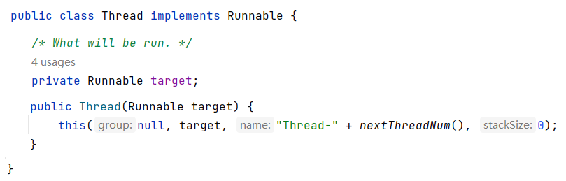
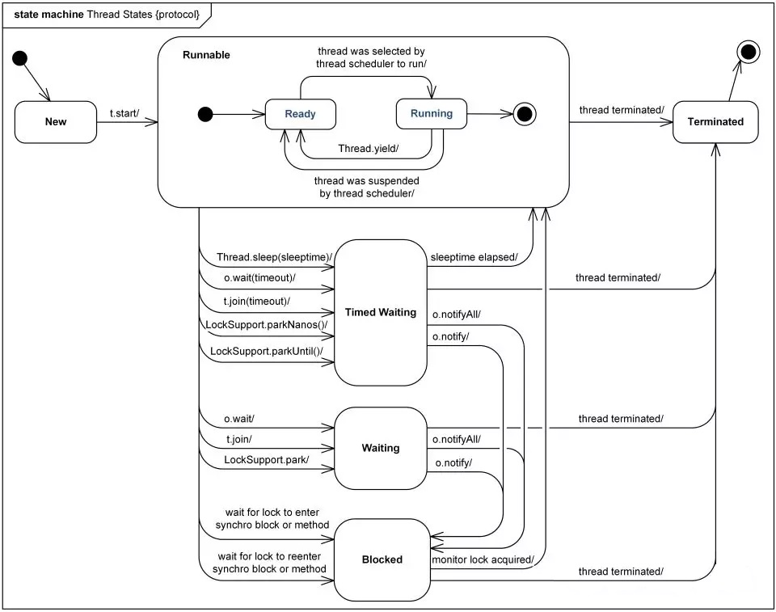
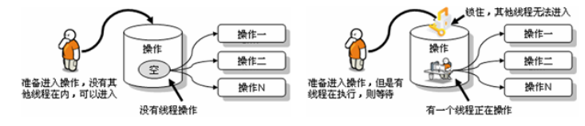

# java 线程

## 1 相关概念

### 1.1 程序、进程与线程

* **程序（program）**：为完成特定任务，用某种语言编写的**一组指令的集合**。即指**一段静态的代码**，静态对象。

* **进程（process）**：程序的一次执行过程，或是正在内存中运行的应用程序。如：运行中的QQ，运行中的网易音乐播放器。

  * 每个进程都有一个独立的内存空间，系统运行一个程序即是一个进程从创建、运行到消亡的过程。（生命周期）
  * 程序是静态的，进程是动态的
  * 进程作为**操作系统调度和分配资源的最小单位**（亦是系统运行程序的基本单位），系统在运行时会为每个进程分配不同的内存区域。
  * 现代的操作系统，大都是支持多进程的，支持同时运行多个程序。比如：现在我们上课一边使用编辑器，一边使用录屏软件，同时还开着画图板，dos窗口等软件。

* **线程（thread）**：进程可进一步细化为线程，是程序内部的**一条执行路径**。一个进程中至少有一个线程。

  * 一个进程同一时间若**并行**执行多个线程，就是支持多线程的。

  * 线程作为**CPU调度和执行的最小单位**。

  * 一个进程中的多个线程共享相同的内存单元，它们从同一个堆中分配对象，可以访问相同的变量和对象。这就使得线程间通信更简便、高效。但多个线程操作共享的系统资源可能就会带来**安全的隐患**。
  * 下图中，红框的蓝色区域为线程独享，黄色区域为线程共享。

  

  > 注意：
  >
  > 不同的进程之间是不共享内存的。
  >
  > 进程之间的数据交换和通信的成本很高。

### 1.2 查看进程和线程

我们可以在电脑底部任务栏，右键----->打开任务管理器，可以查看当前任务的进程：

1. 每个应用程序的运行都是一个进程

2. 一个应用程序的多次运行，就是多个进程

3. 一个进程中包含多个线程

### 1.3 线程调度

* **分时调度**

  所有线程**轮流使用** CPU 的使用权，并且平均分配每个线程占用 CPU 的时间。

* **抢占式调度**

  让**优先级高**的线程以**较大的概率**优先使用 CPU。如果线程的优先级相同，那么会随机选择一个(线程随机性)，**Java 使用的为抢占式调度**。

### 1.4 多线程程序的优点

**背景：**以单核CPU为例，只使用单个线程先后完成多个任务（调用多个方法），肯定比用多个线程来完成用的时间更短，为何仍需多线程呢？

**多线程程序的优点：**

1. 提高应用程序的响应。对图形化界面更有意义，可增强用户体验。

2. 提高计算机系统CPU的利用率

3. 改善程序结构。将既长又复杂的进程分为多个线程，独立运行，利于理解和修改

### 1.5 补充概念

#### 1.5.1 单核CPU和多核CPU

单核CPU，在一个时间单元内，只能执行一个线程的任务。例如，可以把CPU看成是医院的医生诊室，在一定时间内只能给一个病人诊断治疗。所以单核CPU就是，代码经过前面一系列的前导操作（类似于医院挂号，比如有10个窗口挂号），然后到cpu处执行时发现，就只有一个CPU（对应一个医生），大家排队执行。

这时候想要提升系统性能，只有两个办法，要么提升CPU性能（让医生看病快点），要么多加几个CPU（多整几个医生），即为多核的CPU。

**问题：多核的效率是单核的倍数吗？**譬如4核A53的cpu，性能是单核A53的4倍吗？理论上是，但是实际不可能，至少有两方面的损耗。

* **一个是多个核心的其他共用资源限制**。譬如，4核CPU对应的内存、cache、寄存器并没有同步扩充4倍。这就好像医院一样，1个医生换4个医生，但是做B超检查的还是一台机器，性能瓶颈就从医生转到B超检查了。
* **另一个是多核CPU之间的协调管理损耗**。譬如多个核心同时运行两个相关的任务，需要考虑任务同步，这也需要消耗额外性能。好比公司工作，一个人的时候至少不用开会浪费时间，自己跟自己商量就行了。两个人就要开会同步工作，协调分配，所以工作效率绝对不可能达到2倍。

#### 1.5.2 并行与并发

* **并行（parallel）**

  指两个或多个事件在**同一时刻**发生（同时发生）。指在同一时刻，有**多条指令**在**多个CPU**上**同时**执行。

  当系统有一个以上 CPU 时，当一个 CPU 执行一个进程时，另一个 CPU 可以执行另一个进程，两个进程互不抢占 CPU 资源，可以同时进行，我们称之为并行（Parallel）。

  其实决定并行的因素不是 CPU 的数量，而是 CPU 的核心数量，比如一个 CPU 多个核也可以并行。

  适合科学计算，后台处理等弱交互场景。

  

* **并发（concurrency）**

  指两个或多个事件在**同一个时间段内**发生。即在一段时间内，有**多条指令**在**单个CPU**上**快速轮换、交替**执行，使得在宏观上具有多个进程同时执行的效果。

  


在操作系统中，启动了多个程序，**并发**指的是在一段时间内宏观上有多个程序同时运行，这在单核 CPU 系统中，每一时刻只能有一个程序执行，即微观上这些程序是分时的交替运行，只不过是给人的感觉是同时运行，那是因为分时交替运行的时间是非常短的。

而在多核 CPU 系统中，则这些可以**并发**执行的程序便可以分配到多个CPU上，实现多任务并行执行，即利用每个处理器来处理一个可以并发执行的程序，这样多个程序便可以同时执行。目前电脑市场上说的多核 CPU，便是多核处理器，核越多，**并行**处理的程序越多，能大大的提高电脑运行的效率。

## 2 创建和启动线程

### 2.1 概述

* Java 语言的 JVM 允许程序运行多个线程，使用`java.lang.Thread`类代表**线程**，所有的线程对象都必须是 Thread 类或其子类的实例。 

* Thread 类的特性
  * 每个线程都是通过某个特定 Thread 对象的 run() 方法来完成操作的，因此把 run() 方法体称为**线程执行体**。
  * 通过该 Thread 对象的 start() 方法来启动这个线程，而非直接调用 run()
  * 要想实现多线程，必须在主线程中创建新的线程对象。

### 2.2 方式1：继承Thread类

Java 通过继承 Thread 类来**创建**并**启动多线程**的步骤如下：

1. 定义 Thread 类的子类，并重写该类的 run() 方法，该 run() 方法的方法体就代表了线程需要完成的任务
2. 创建 Thread 子类的实例，即创建了线程对象
3. 调用线程对象的 start() 方法来启动该线程

```java
class MyThread extends Thread {
  @Override
  public void run() {
    for (int i = 0; i < 100; i++) {
      System.out.println("exThread--" + Thread.currentThread().getName() + "---" + i);
    }
  }
}

/**
 * 继承 Thread 类
 */
@Test
public void test1() {
  MyThread myThread = new MyThread();
  myThread.start();

  for (int i = 0; i < 100; i++) {
    System.out.println(Thread.currentThread().getName() + "---" + i);
  }
}
```

注意：

1. 如果自己手动调用 run() 方法，那么就只是普通方法，没有启动多线程模式。

2. run() 方法由 JVM 调用，什么时候调用，执行的过程控制都有操作系统的CPU调度决定。

3. 想要启动多线程，必须调用 start() 方法。

4. 一个线程对象只能调用一次 start() 方法启动，如果重复调用了，则将抛出以上的异常“`IllegalThreadStateException`”。

### 2.3 方式2：实现Runnable接口

Java 有单继承的限制，当我们无法继承 Thread 类时，那么该如何做呢？在核心类库中提供了 Runnable 接口，我们可以实现 Runnable 接口，重写 run() 方法，然后再通过 Thread 类的对象代理启动和执行我们的线程体 run() 方法

步骤如下：

1. 定义 Runnable 接口的实现类，并重写该接口的 run() 方法，该 run() 方法的方法体同样是该线程的线程执行体。
2. 创建 Runnable 实现类的实例，并以此实例作为 Thread 的 target 参数来创建 Thread 对象，该 Thread 对象才是真正
   的线程对象。
3. 调用线程对象的 start() 方法，启动线程。调用 Runnable 接口实现类的 run 方法。

```java
class MyThreadRunnable implements Runnable {
  @Override
  public void run() {
    for (int i = 0; i < 100; i++) {
      System.out.println("runnable--" + Thread.currentThread().getName() + "---" + i);
    }
  }
}

/**
 * Runnable 接口实现
 */
@Test
public void test3() {
  MyThreadRunnable myThreadRunnable = new MyThreadRunnable();
  Thread myThread = new Thread(myThreadRunnable);
  myThread.start();

  for (int i = 0; i < 100; i++) {
    System.out.println(Thread.currentThread().getName() + "---" + i);
  }
}
```

通过实现 Runnable 接口，使得该类有了多线程类的特征。所有的分线程要执行的代码都在 run 方法里面。

在启动的多线程的时候，需要先通过 Thread 类的构造方法 `Thread(Runnable target)` 构造出对象，然后调用 Thread 对象的 start() 方法来运行多线程代码。

实际上，所有的多线程代码都是通过运行 Thread 的 start() 方法来运行的。因此，不管是继承 Thread 类还是实现 Runnable 接口来实现多线程，最终还是通过 Thread 的对象的 API 来控制线程的，熟悉 Thread 类的 API 是进行多线程编程的基础。

说明：Runnable 对象仅仅作为 Thread 对象的 target，Runnable 实现类里包含的 run() 方法仅作为线程执行体。
而实际的线程对象依然是 Thread 实例，只是该 Thread 线程负责执行其 target 的 run() 方法。



### 2.4 变形写法

**使用匿名内部类对象来实现线程的创建和启动**

```java
new Thread("新的线程！"){
 @Override
 public void run() {
  for (int i = 0; i < 10; i++) {
   System.out.println(getName()+"：正在执行！"+i);
  }
 }
}.start();
```

```java
new Thread(new Runnable(){
 @Override
 public void run() {
  for (int i = 0; i < 10; i++) {
   System.out.println(Thread.currentThread().getName()+"：" + i);
  }
 }
}).start();
```

### 2.5 对比两种方式

**联系**

Thread 类实际上也是实现了  Runnable接口的类。即：

```java
public class Thread extends Object implements Runnable
```

**区别**

* 继承 Thread：线程代码存放 Thread 子类  run 方法中。

* 实现 Runnable：线程代码存在接口的子类的 run 方法。

**实现 Runnable 接口比继承 Thread 类所具有的优势**

* 避免了单继承的局限性
* 多个线程可以共享同一个接口实现类的对象，非常适合多个相同线程来处理同一份资源。
* 增加程序的健壮性，实现解耦操作，代码可以被多个线程共享，代码和线程独立。

## 3 Thread 类的常用结构

### 3.1 构造器

* `public Thread()` : 分配一个新的线程对象。
* `public Thread(String name)` : 分配一个指定名字的新的线程对象。
* `public Thread(Runnable target)` : 指定创建线程的目标对象，它实现了 Runnable 接口中的 run 方法
* `public Thread(Runnable target, String name)` : 分配一个带有指定目标新的线程对象并指定名字。

### 3.2 常用方法系列1

* `public void run()` : 此线程要执行的任务在此处定义代码。
* `public void start()` : 导致此线程开始执行; Java 虚拟机调用此线程的 run 方法。
* `public String getName()` : 获取当前线程名称。
* `public void setName(String name)` : 设置该线程名称。
* `public static Thread currentThread()` : 返回对当前正在执行的线程对象的引用。在 Thread 子类中就是 this，通常用于主线程和 Runnable 实现类
* `public static void sleep(long millis)` : 使当前正在执行的线程以指定的毫秒数暂停（暂时停止执行）。
* `public static void yield()` : yield 只是让当前线程暂停一下，让系统的线程调度器重新调度一次，希望优先级与当前线程相同或更高的其他线程能够获得执行机会，但是这个不能保证，完全有可能的情况是，当某个线程调用了 yield 方法暂停之后，线程调度器又将其调度出来重新执行。

### 3.3 常用方法系列2

* `public final boolean isAlive() `: 测试线程是否处于活动状态。如果线程已经启动且尚未终止，则为活动状态。

* `void join()` : 等待该线程终止。

  `void join(long millis)` : 等待该线程终止的时间最长为 millis 毫秒。如果 millis 时间到，将不再等待。

  `void join(long millis, int nanos)` : 等待该线程终止的时间最长为 millis 毫秒 + nanos 纳秒。

* `public final void stop() `: **已过时**，不建议使用。强行结束一个线程的执行，直接进入死亡状态。run() 即刻停止，可能会导致一些清理性的工作得不到完成，如文件，数据库等的关闭。同时，会立即释放该线程所持有的所有的锁，导致数据得不到同步的处理，出现数据不一致的问题。

* `void suspend() / void resume()` : **已过时**，不建议使用。这两个操作就好比播放器的暂停和恢复。二者必须成对出现，否则非常容易发生死锁。suspend() 调用会导致线程暂停，但不会释放任何锁资源，导致其它线程都无法访问被它占用的锁，直到调用 resume()。

### 3.4 常用方法系列3

每个线程都有一定的优先级，同优先级线程组成先进先出队列（先到先服务），使用分时调度策略。优先级高的线程采用抢占式策略，获得较多的执行机会。每个线程默认的优先级都与创建它的父线程具有相同的优先级。

* Thread 类的三个优先级常量：
  * `MAX_PRIORITY(10)`：最高优先级
  * `MIN _PRIORITY(1)`：最低优先级
  * `NORM_PRIORITY(5)`：普通优先级，默认情况下 main 线程具有普通优先级。

* `public final int getPriority()` ：返回线程优先级
* `public final void setPriority(int newPriority)` ：改变线程的优先级，范围在[1,10]之间。

### 3.5 守护线程（了解）

有一种线程，它是在后台运行的，它的任务是为其他线程提供服务的，这种线程被称为“守护线程”。JVM 的垃圾回收线程就是典型的守护线程。

守护线程有个特点，就是如果所有非守护线程都死亡，那么守护线程自动死亡。

调用 setDaemon(true) 方法可将指定线程设置为守护线程。必须在线程启动之前设置，否则会报 IllegalThreadStateException 异常。

调用isDaemon() 可以判断线程是否是守护线程。

## 4 多线程的生命周期

Java 语言使用 Thread 类及其子类的对象来表示线程，在它的一个完整的生命周期中通常要经历如下一些状态：

### 4.1 JDK5 之前：5种状态

线程的生命周期有五种状态：新建（New）、就绪（Runnable）、运行（Running）、阻塞（Blocked）、死亡（Dead）。CPU需要在多条线程之间切换，于是线程状态会多次在运行、阻塞、就绪之间切换。


1. 新建

   当一个 Thread 类或其子类的对象被声明并创建时，新生的线程对象处于新建状态。此时它和其他 Java 对象一样，仅仅由 JVM 为其分配了内存，并初始化了实例变量的值。此时的线程对象并没有任何线程的动态特征，程序也不会执行它的线程体 run()。

2. 就绪

   但是当线程对象调用了 start() 方法之后，就不一样了，线程就从新建状态转为就绪状态。JVM 会为其创建方法调用栈和程序计数器，当然，处于这个状态中的线程并没有开始运行，只是表示已具备了运行的条件，随时可以被调度。至于什么时候被调度，取决于 JVM 里线程调度器的调度。

   > 注意：
   >
   > 程序只能对新建状态的线程调用 start()，并且只能调用一次，如果对非新建状态的线程，如已启动的线程或已死亡的线程调用 start() 都会报错 IllegalThreadStateException 异常。

3. 运行

   如果处于就绪状态的线程获得了 CPU 资源时，开始执行 run() 方法的线程体代码，则该线程处于运行状态。如果计算机只有一个 CPU 核心，在任何时刻只有一个线程处于运行状态，如果计算机有多个核心，将会有多个线程并行 (Parallel) 执行。

   当然，美好的时光总是短暂的，而且 CPU 讲究雨露均沾。对于抢占式策略的系统而言，系统会给每个可执行的线程一个小时间段来处理任务，当该时间用完，系统会剥夺该线程所占用的资源，让其回到就绪状态等待下一次被调度。此时其他线程将获得执行机会，而在选择下一个线程时，系统会适当考虑线程的优先级。

4. 阻塞

   当在运行过程中的线程遇到如下情况时，会让出 CPU 并临时中止自己的执行，进入阻塞状态：

   * 线程调用了 sleep() 方法，主动放弃所占用的CPU资源；

   * 线程试图获取一个同步监视器，但该同步监视器正被其他线程持有；

   * 线程执行过程中，同步监视器调用了 wait()，让它等待某个通知（notify）；

   * 线程执行过程中，同步监视器调用了 wait(time)

   * 线程执行过程中，遇到了其他线程对象的加塞（join）；

   * 线程被调用 suspend 方法被挂起（已过时，因为容易发生死锁）；

   当前正在执行的线程被阻塞后，其他线程就有机会执行了。针对如上情况，当发生如下情况时会解除阻塞，让该线程重新进入就绪状态，等待线程调度器再次调度它：

   * 线程的 sleep() 时间到；

   * 线程成功获得了同步监视器；

   * 线程等到了通知 (notify)；

   * 线程 wait 的时间到了

   * 加塞的线程结束了；

   * 被挂起的线程又被调用了 resume 恢复方法（已过时，因为容易发生死锁）；

5. 死亡

   线程会以以下三种方式之一结束，结束后的线程就处于死亡状态：

   * run() 方法执行完成，线程正常结束

   * 线程执行过程中抛出了一个未捕获的异常（Exception）或错误（Error）

   * 直接调用该线程的 stop() 来结束该线程（已过时）

### 4.2 JDK5 及之后：6种状态

在 java.lang.Thread.State 的枚举类中这样定义：

```java
public enum State {
 NEW,
 RUNNABLE,
 BLOCKED,
 WAITING,
 TIMED_WAITING,
 TERMINATED;
}
```

* `NEW（新建）`：线程刚被创建，但是并未启动。还没调用start方法。

* `RUNNABLE（可运行）`：这里没有区分就绪和运行状态。因为对于 Java 对象来说，只能标记为可运行，至于什么时候运行，不是 JVM 来控制的了，是OS来进行调度的，而且时间非常短暂，因此对于 Java 对象的状态来说，无法区分。

* `TERMINATED（被终止）`：表明此线程已经结束生命周期，终止运行。

* 重点说明，根据Thread.State的定义，**阻塞状态分为三种**：`BLOCKED`、`WAITING`、`TIMED_WAITING`。
  * `BLOCKED（锁阻塞）`：在 API 中的介绍为：一个正在阻塞、等待一个监视器锁（锁对象）的线程处于这一状态。只有获得锁对象的线程才能有执行机会。
    * 比如，线程A与线程B代码中使用同一锁，如果线程A获取到锁，线程A进入到 Runnable 状态，那么线程B就进入到 Blocked 锁阻塞状态。
  * `TIMED_WAITING（计时等待）`：在 API 中的介绍为：一个正在限时等待另一个线程执行一个（唤醒）动作的线程处于这一状态。
    * 当前线程执行过程中遇到 Thread 类的`sleep`或`join`，Object 类的`wait`，LockSupport 类的`park`方法，并且在调用这些方法时，`设置了时间`，那么当前线程会进入 TIMED_WAITING，直到时间到，或被中断。
  * `WAITING（无限等待）`：在 API 中介绍为：一个正在无限期等待另一个线程执行一个特别的（唤醒）动作的线程处于这一状态。
    * 当前线程执行过程中遇到遇到 Object 类的`wait`，Thread 类的`join`，LockSupport 类的`park`方法，并且在调用这些方法时，`没有指定时间`，那么当前线程会进入 WAITING 状态，直到被唤醒。
      * 通过 Object 类的 wait 进入 WAITING 状态的要有 Object 的 notify/notifyAll 唤醒；
      * 通过 Condition 的 await 进入 WAITING 状态的要有 Condition 的 signal 方法唤醒；
      * 通过 LockSupport 类的 park 方法进入 WAITING 状态的要有 LockSupport 类的 unpark 方法唤醒
      * 通过 Thread 类的 join 进入 WAITING 状态，只有调用 join 方法的线程对象结束才能让当前线程恢复；

说明：当从 WAITING 或 TIMED_WAITING 恢复到 Runnable 状态时，如果发现当前线程没有得到监视器锁，那么会立刻转入 BLOCKED 状态。


或



> 我们在翻阅 API 的时候会发现 Timed Waiting（计时等待） 与 Waiting（无限等待） 状态联系还是很紧密的，
> 比如 Waiting（无限等待） 状态中 wait 方法是空参的，而 timed waiting（计时等待） 中 wait 方法是带参的。
> 这种带参的方法，其实是一种倒计时操作，相当于我们生活中的小闹钟，我们设定好时间，到时通知，可是如果提前得到（唤醒）通知，那么设定好时间在通知也就显得多此一举了，那么这种设计方案其实是一举两得。如果没有得到（唤醒）通知，那么线程就处于 Timed Waiting 状态，直到倒计时完毕自动醒来；如果在倒计时期间得到（唤醒）通知，那么线程从 Timed Waiting 状态立刻唤醒。

## 5 线程安全问题及解决

当我们使用多个线程访问**同一资源**（可以是同一个变量、同一个文件、同一条记录等）的时候，若多个线程**只有读操作**，那么不会发生线程安全问题。但是如果多个线程中对资源有**读和写**的操作，就容易出现线程安全问题。

### 5.1 同一个资源问题和线程安全问题

案例：

火车站要卖票，我们模拟火车站的卖票过程。本次列车的座位共100个（即，只能出售100张火车票）。我们来模拟车站的售票窗口，实现多个窗口同时售票的过程。注意：不能出现错票、重票。

#### 5.1.1 局部变量不能共享

示例代码：

```java
class TicketWindow1 extends Thread {
  @Override
  public void run() {
    int ticket = 100;
    while (ticket > 0) {
      System.out.println(getName() + "卖出一张票，票号:" + ticket);
      try {
        Thread.sleep(10);
      } catch (InterruptedException e) {
        e.printStackTrace();
      }
      ticket--;
    }
  }
}

@Test
public void test1() {

  TicketWindow1 t1 = new TicketWindow1();
  TicketWindow1 t2 = new TicketWindow1();
  TicketWindow1 t3 = new TicketWindow1();

  t1.setName("窗口1");
  t2.setName("窗口2");
  t3.setName("窗口3");

  t1.start();
  t2.start();
  t3.start();

  try {
    t1.join();
    t2.join();
    t3.join();
  } catch (InterruptedException e) {
    throw new RuntimeException(e);
  }
}
```

结果：发现卖出300张票。

问题：局部变量是每次调用方法都是独立的，那么每个线程的run()的ticket是独立的，不是共享数据。

#### 5.1.2 不同对象的实例变量不共享

```java
class TicketWindow2 extends Thread {
  private int ticket = 100;

  public void run() {
    while (ticket > 0) {
      System.out.println(getName() + "卖出一张票，票号:" + ticket);
      try {
        Thread.sleep(10);
      } catch (InterruptedException e) {
        e.printStackTrace();
      }
      ticket--;
    }
  }
}

@Test
public void test2() {

  TicketWindow2 t1 = new TicketWindow2();
  TicketWindow2 t2 = new TicketWindow2();
  TicketWindow2 t3 = new TicketWindow2();

  t1.setName("窗口1");
  t2.setName("窗口2");
  t3.setName("窗口3");

  t1.start();
  t2.start();
  t3.start();

  try {
    t1.join();
    t2.join();
    t3.join();
  } catch (InterruptedException e) {
    throw new RuntimeException(e);
  }
}
```

结果：发现卖出300张票。

问题：不同的实例对象的实例变量是独立的。

#### 5.1.3 静态变量是共享的

示例代码：

```java
class TicketWindow3 extends Thread {
  private static int ticket = 100;

  public void run() {
    while (ticket > 0) {
      System.out.println(getName() + "卖出一张票，票号:" + ticket);
      try {
        Thread.sleep(10);
      } catch (InterruptedException e) {
        e.printStackTrace();
      }
      ticket--;
    }
  }
}

@Test
public void test3() {

  TicketWindow3 t1 = new TicketWindow3();
  TicketWindow3 t2 = new TicketWindow3();
  TicketWindow3 t3 = new TicketWindow3();

  t1.setName("窗口1");
  t2.setName("窗口2");
  t3.setName("窗口3");

  t1.start();
  t2.start();
  t3.start();

  try {
    t1.join();
    t2.join();
    t3.join();
  } catch (InterruptedException e) {
    throw new RuntimeException(e);
  }
}
```

结果：发现卖出近100张票。

问题1：但是有重复票或负数票问题。

原因：线程安全问题

问题2：如果要考虑有两场电影，各卖100张票等

原因：TicketThread 类的静态变量，是所有 TicketThread 类的对象共享

#### 5.1.4 同一个对象的实例变量共享

示例代码：多个 Thread 线程使用同一个 Runnable 对象

```java
class TicketWindow4 implements Runnable {
  private int ticket = 100;

  @Override
  public void run() {
    while (ticket > 0) {
      System.out.println(Thread.currentThread().getName() + "卖出一张票，票号:" + ticket);
      try {
        Thread.sleep(10);
      } catch (InterruptedException e) {
        e.printStackTrace();
      }
      ticket--;
    }
  }
}

@Test
public void test4() {

  TicketWindow4 w = new TicketWindow4();
  Thread t1 = new Thread(w);
  Thread t2 = new Thread(w);
  Thread t3 = new Thread(w);

  t1.setName("窗口1");
  t2.setName("窗口2");
  t3.setName("窗口3");

  t1.start();
  t2.start();
  t3.start();

  try {
    t1.join();
    t2.join();
    t3.join();
  } catch (InterruptedException e) {
    throw new RuntimeException(e);
  }
}
```

结果：发现卖出近100张票。

问题：但是有重复票或负数票问题。

原因：线程安全问题

#### 5.1.5 抽取资源类，共享同一个资源对象

示例代码：

```java
class Ticket {
  private int ticket = 100;

  public void sale() {
    if (ticket > 0) {
      System.out.println(Thread.currentThread().getName() + "卖出一张票，票号:" + ticket);
      try {
        Thread.sleep(10);
      } catch (InterruptedException e) {
        e.printStackTrace();
      }
      ticket--;
    } else {
      throw new RuntimeException("没有票了");
    }
  }

  public int getTicket() {
    return ticket;
  }
}

@Test
public void test5() {

  Ticket ticket = new Ticket();
  // 启动多个线程操作资源类的对象
  Thread t1 = new Thread("窗口一") {
    public void run() {
      while (ticket.getTicket() > 0) {
        ticket.sale();
      }
    }
  };
  Thread t2 = new Thread("窗口二") {
    public void run() {
      while (ticket.getTicket() > 0) {
        ticket.sale();
      }
    }
  };
  Thread t3 = new Thread(new Runnable() {
    public void run() {
      while (ticket.getTicket() > 0) {
        ticket.sale();
      }
    }
  }, "窗口三");

  t1.start();
  t2.start();
  t3.start();

  try {
    t1.join();
    t2.join();
    t3.join();
  } catch (InterruptedException e) {
    throw new RuntimeException(e);
  }
}
```

结果：发现卖出近100张票。

问题：但是有重复票或负数票问题。

原因：线程安全问题

### 5.2 同步机制解决线程安全问题

要解决上述多线程并发访问一个资源的安全性问题:也就是解决重复票与不存在票问题，Java 中提供了同步机制 (synchronized) 来解决。



根据案例简述：

窗口1线程进入操作的时候，窗口2和窗口3线程只能在外等着，窗口1操作结束，窗口1和窗口2和窗口3才有机会进入代码去执行。也就是说在某个线程修改共享资源的时候，其他线程不能修改该资源，等待修改完毕同步之后，才能去抢夺CPU资源，完成对应的操作，保证了数据的同步性，解决了线程不安全的现象。

为了保证每个线程都能正常执行原子操作，Java 引入了线程同步机制。注意:在任何时候,最多允许一个线程拥有同步锁，谁拿到锁就进入代码块，其他的线程只能在外等着 (BLOCKED)。

#### 5.2.1 同步机制解决线程安全问题的原理

同步机制的原理，其实就相当于给某段代码加“锁”，任何线程想要执行这段代码，都要先获得“锁”，我们称它为同步锁。因为 Java 对象在堆中的数据分为分为对象头、实例变量、空白的填充。而对象头中包含：

* Mark Word：记录了和当前对象有关的GC、锁标记等信息。
* 指向类的指针：每一个对象需要记录它是由哪个类创建出来的。
* 数组长度（只有数组对象才有）

哪个线程获得了“同步锁”对象之后，”同步锁“对象就会记录这个线程的ID，这样其他线程就只能等待了，除非这个线程”释放“了锁对象，其他线程才能重新获得/占用”同步锁“对象。

#### 5.2.2 同步代码块和同步方法

**同步代码块**：synchronized 关键字可以用于某个区块前面，表示只对这个区块的资源实行互斥访问。
格式:

```java
synchronized(同步锁){
     需要同步操作的代码
}
```

**同步方法：**synchronized 关键字直接修饰方法，表示同一时刻只有一个线程能进入这个方法，其他线程在外面等着。

```java
public synchronized void method(){
    可能会产生线程安全问题的代码
}
```

#### 5.2.3 同步锁机制

在《Thinking in Java》中，是这么说的：对于并发工作，你需要某种方式来防止两个任务访问相同的资源（其实就是共享资源竞争）。 防止这种冲突的方法就是当资源被一个任务使用时，在其上加锁。第一个访问某项资源的任务必须锁定这项资源，使其他任务在其被解锁之前，就无法访问它了，而在其被解锁之时，另一个任务就可以锁定并使用它了。

#### 5.2.4 synchronized的锁是什么

同步锁对象可以是任意类型，但是必须保证竞争“同一个共享资源”的多个线程必须使用同一个“同步锁对象”。

对于同步代码块来说，同步锁对象是由程序员手动指定的（很多时候也是指定为 this 或类名.class），但是对于同步方法来说，同步锁对象只能是默认的：

* 静态方法：当前类的Class对象（类名.class）

* 非静态方法：this

#### 5.2.5 同步操作的思考顺序

1、如何找问题，即代码是否存在线程安全？（非常重要）
（1）明确哪些代码是多线程运行的代码
（2）明确多个线程是否有共享数据
（3）明确多线程运行代码中是否有多条语句操作共享数据

2、如何解决呢？（非常重要）
对多条操作共享数据的语句，只能让一个线程都执行完，在执行过程中，其他线程不可以参与执行。
即所有操作共享数据的这些语句都要放在同步范围中

3、切记：

范围太小：不能解决安全问题

范围太大：因为一旦某个线程抢到锁，其他线程就只能等待，所以范围太大，效率会降低，不能合理利用CPU资源。

#### 5.2.6 代码演示

##### 示例一：静态方法加锁

```java
class TicketSaleThread extends Thread {
  private static int ticket = 100;

  public void run() {
    while (ticket > 0) {
      saleOneTicket();
    }
  }

  /**
   * 锁对象是TicketSaleThread类的Class对象，而一个类的Class对象在内存中肯定只有一个
   */
  public synchronized static void saleOneTicket() {
    if (ticket > 0) {
      System.out.println(Thread.currentThread().getName() + "卖出一张票，票号:" + ticket);
      try {
        Thread.sleep(10);
      } catch (InterruptedException e) {
        e.printStackTrace();
      }
      ticket--;
    }
  }
}

@Test
public void test1() {
  /**
   * 静态方法加锁，锁对象是TicketSaleThread类的Class对象，而一个类的Class对象在内存中肯定只有一个
   */
  TicketSaleThread t1 = new TicketSaleThread();
  TicketSaleThread t2 = new TicketSaleThread();
  TicketSaleThread t3 = new TicketSaleThread();

  t1.setName("窗口1");
  t2.setName("窗口2");
  t3.setName("窗口3");

  t1.start();
  t2.start();
  t3.start();

  try {
    t1.join();
    t2.join();
    t3.join();
  } catch (InterruptedException e) {
    throw new RuntimeException(e);
  }
}
```

##### 示例二：非静态方法加锁

```java
class TicketSaleThread2 implements Runnable {
  private int ticket = 100;

  @Override
  public void run() {
    while (ticket > 0) {
      saleOneTicket();
    }
  }

  /**
   * 锁对象是this，3个线程必须使用同一个TicketSaleRunnable对象
   */
  public synchronized void saleOneTicket() {
    if (ticket > 0) {
      System.out.println(Thread.currentThread().getName() + "卖出一张票，票号:" + ticket);
      try {
        Thread.sleep(10);
      } catch (InterruptedException e) {
        e.printStackTrace();
      }
      ticket--;
    }
  }
}

@Test
public void test2() {
  /**
   * 非静态方法加锁，锁对象是this，3个线程必须使用同一个TicketSaleRunnable对象
   */
  TicketSaleThread2 t = new TicketSaleThread2();
  Thread t1 = new Thread(t, "窗口1");
  Thread t2 = new Thread(t, "窗口2");
  Thread t3 = new Thread(t, "窗口3");

  t1.start();
  t2.start();
  t3.start();

  try {
    t1.join();
    t2.join();
    t3.join();
  } catch (InterruptedException e) {
    throw new RuntimeException(e);
  }
}
```

##### 示例三：同步代码块

```java
class TicketSaleThread3 implements Runnable {
  private int ticket = 100;

  @Override
  public void run() {
    while (ticket > 0) {
      saleOneTicket();
    }
  }

  /**
   * 锁对象是this，3个线程必须使用同一个TicketSaleRunnable对象
   */
  public void saleOneTicket() {
    // 其他逻辑

    synchronized (this) {
      if (ticket > 0) {
        System.out.println(Thread.currentThread().getName() + "卖出一张票，票号:" + ticket);
        try {
          Thread.sleep(10);
        } catch (InterruptedException e) {
          e.printStackTrace();
        }
        ticket--;
      }
    }

    // 其他逻辑
  }
}

@Test
public void test3() {
  /**
   * 使用同步代码块，锁对象是this，3个线程必须使用同一个TicketSaleRunnable对象
   */
  TicketSaleThread3 t = new TicketSaleThread3();
  Thread t1 = new Thread(t, "窗口1");
  Thread t2 = new Thread(t, "窗口2");
  Thread t3 = new Thread(t, "窗口3");

  t1.start();
  t2.start();
  t3.start();

  try {
    t1.join();
    t2.join();
    t3.join();
  } catch (InterruptedException e) {
    throw new RuntimeException(e);
  }
}
```

## 6 同步

### 6.1 单例设计模式的线程安全问题

#### 6.1.1 饿汉式没有线程安全问题

饿汉式：在类初始化时就直接创建单例对象，而类初始化过程是没有线程安全问题的

```java
public class HungrySingle {
    private static final HungrySingle INSTANCE = new HungrySingle();
    private HungrySingle() {}
    public static HungrySingle getInstance() {
        return INSTANCE;
    }
}
```

```java
public class HungrySingleTest {
    HungrySingle hs1 = null;
    HungrySingle hs2 = null;
    @Test
    public void test1() {
        Thread t1 = new Thread() {
            @Override
            public void run() {
                hs1 = HungrySingle.getInstance();
            }
        };
        Thread t2 = new Thread() {
            @Override
            public void run() {
                hs2 = HungrySingle.getInstance();
            }
        };
        t1.start();
        t2.start();

        try {
            t1.join();
            t2.join();
        } catch (InterruptedException e) {
            e.printStackTrace();
        }
        System.out.println(hs1);
        System.out.println(hs2);
        System.out.println(hs1 == hs2); //true
    }
}
```

#### 6.1.2 懒汉式线程安全问题

懒汉式：延迟创建对象，第一次调用getInstance方法再创建对象

不安全：

```java
private static LazySingle instance = null;

private LazySingle() {
}

// 线程不安全
public static LazySingle getInstance() {
  if (instance == null) {
    try {
      // 睡眠等待更明显暴露问题
      Thread.sleep(10);
    } catch (InterruptedException e) {
      e.printStackTrace();
    }
    instance = new LazySingle();
  }
  return instance;
}
```

安全方式一：同步机制

```java
private static LazySingle instance = null;

private LazySingle() {
}

// 线程安全
public static LazySingle getInstanceSafe1() {
  synchronized (LazySingle.class) {
    if (instance == null) {
      try {
        // 睡眠一会也没问题
        Thread.sleep(10);
      } catch (InterruptedException e) {
        e.printStackTrace();
      }
      instance = new LazySingle();
    }
    return instance;
  }
}

// 线程安全，有指令重拍问题
public static LazySingle getInstanceSafe2() {
  // 如果不是null就不用等了
  if (instance == null) {
    synchronized (LazySingle.class) {
      if (instance == null) {
        try {
          // 睡眠一会也没问题
          Thread.sleep(10);
        } catch (InterruptedException e) {
          e.printStackTrace();
        }
        instance = new LazySingle();
      }
    }
  }
  return instance;
}
```

安全方式二：使用内部类

```java
private static LazySingle instance = null;

private LazySingle() {
}

public static LazySingle getInstanceSafe3() {
  return Inner.INSTANCE;
}

private static class Inner {
  static final LazySingle INSTANCE = new LazySingle();
}
```

> 内部类只有在外部类被调用才加载，产生INSTANCE实例；又不用加锁。
>
> 此模式具有之前两个模式的优点，同时屏蔽了它们的缺点，是最好的单例模式。
>
> 此时的内部类，使用enum进行定义，也是可以的。

### 6.2 死锁

不同的线程分别占用对方需要的同步资源不放弃，都在等待对方放弃自己需要的同步资源，就形成了线程的死锁。


> 【小故事】
>
> 面试官：你能解释清楚什么是死锁，我就录取你！
> 面试者：你录取我，我就告诉你什么是死锁！
> ….
> 恭喜你，面试通过了

一旦出现死锁，整个程序既不会发生异常，也不会给出任何提示，只是所有线程处于阻塞状态，无法继续。

**诱发死锁的原因：**

* 互斥条件
* 占用且等待
* 不可抢夺（或不可抢占）
* 循环等待

以上4个条件，同时出现就会触发死锁。

**解决死锁：**

死锁一旦出现，基本很难人为干预，只能尽量规避。可以考虑打破上面的诱发条件。

* 针对条件1：互斥条件基本上无法被破坏。因为线程需要通过互斥解决安全问题。

* 针对条件2：可以考虑一次性申请所有所需的资源，这样就不存在等待的问题。

* 针对条件3：占用部分资源的线程在进一步申请其他资源时，如果申请不到，就主动释放掉已经占用的资源。

* 针对条件4：可以将资源改为线性顺序。申请资源时，先申请序号较小的，这样避免循环等待问题。

### 6.3 JDK5 新特性：Lock(锁)

* JDK5 的新增功能，保证线程的安全。与采用 synchronized 相比，**Lock 可提供多种锁方案，更灵活、更强大**。Lock 通过显式定义同步锁对象来实现同步。同步锁使用 Lock 对象充当。
* `java.util.concurrent.locks.Lock` 接口是控制多个线程对共享资源进行访问的工具。锁提供了对共享资源的独占访问，每次只能有一个线程对 Lock 对象加锁，线程开始访问共享资源之前应先获得 Lock 对象。
* 在实现线程安全的控制中，比较常用的是 `ReentrantLock`，可以显式加锁、释放锁。
  * ReentrantLock 类实现了 Lock 接口，它拥有与 synchronized 相同的并发性和内存语义，但是**添加了类似锁投票、定时锁等候和可中断锁**等候的一些特性。此外，它还提供了在激烈争用情况下**更佳的性能**。
* Lock锁也称同步锁，加锁与释放锁方法，如下：

  * `public void lock()` : 加同步锁。
  * `public void unlock()` : 释放同步锁。
* 代码结构

```java
class A {
  // 1. 创建Lock的实例，必须确保多个线程共享同一个Lock实例
 private final ReentrantLock lock = new ReenTrantLock();
 public void m() {
    // 2. 调动lock()，实现需共享的代码的锁定
  lock.lock();
  try{
   // 保证线程安全的代码;
  }
  finally{
      // 3. 调用unlock()，释放共享代码的锁定
   lock.unlock();  
  }
 }
}
```

> 注意：如果同步代码有异常，要将 unlock() 写入 finally 语句块。

举例：

```java
// 1. 创建Lock的实例，必须确保多个线程共享同一个Lock实例
private static final ReentrantLock lock = new ReentrantLock();
private int ticket = 100;

class TicketSale implements Runnable {

  @Override
  public void run() {
    while (true) {
      try {
        // 2. 执行lock()方法，锁定对共享资源的调用
        lock.lock();
        if (ticket > 0) {
          System.out.println(Thread.currentThread().getName() + "售票，票号为：" + ticket);
          try {
            Thread.sleep(10);
          } catch (InterruptedException e) {
            e.printStackTrace();
          }
          ticket--;
        } else {
          break;
        }
      } finally {
        // 3. unlock()的调用，释放对共享数据的锁定
        lock.unlock();
      }
    }
  }
}

@Test
public void test1() {
  // TicketSale 类中的锁是 final static，这里可以new不同实例
  Thread t1 = new Thread(new TicketSale());
  Thread t2 = new Thread(new TicketSale());
  t1.start();
  t2.start();
  try {
    t1.join();
    t2.join();
  } catch (InterruptedException e) {
    throw new RuntimeException(e);
  }
}
```

**synchronized 与 Lock 的对比**

1. Lock 是**显式锁**（手动开启和关闭锁，别忘记关闭锁），synchronized 是**隐式锁**，出了作用域、遇到异常等自动解锁
2. Lock 只有代码块锁，synchronized 有代码块锁和**方法锁**
3. 使用 Lock 锁，JVM 将花费较少的时间来调度线程，性能更好。并且具有更好的扩展性（提供更多的子类），更体现面向对象。
4. Lock 锁可以**对读不加锁，对写加锁**，synchronized不 可以
5. Lock 锁可以有多种获取锁的方式，可以**从 sleep 的线程中抢到锁**，synchronized 不可以

> 说明：开发建议中处理线程安全问题优先使用顺序为：Lock ----> 同步代码块 ----> 同步方法
>

## 7 线程的通信

### 7.1 线程间通信

**为什么要处理线程间通信：**

当我们需要 **多个线程** 来共同完成一件任务，并且我们希望他们 **有规律的执行**，那么多线程之间需要一些通信机制，可以协调它们的工作，以此实现多线程共同操作一份数据。

比如：线程A用来生产包子的，线程B用来吃包子的，包子可以理解为同一资源，线程A与线程B处理的动作，一个是生产，一个是消费，此时B线程必须等到A线程完成后才能执行，那么线程A与线程B之间就需要线程通信，即——**等待唤醒机制**。

### 7.2 等待唤醒机制

这是多个线程间的一种 **协作机制**。谈到线程我们经常想到的是线程间的 **竞争（race）**，比如去争夺锁，但这并不是故事的全部，线程间也会有协作机制。

在一个线程满足某个条件时，就进入等待状态（`wait()` / `wait(time)`）， 等待其他线程执行完他们的指定代码过后再将其唤醒（`notify()`）;或可以指定wait的时间，等时间到了自动唤醒；在有多个线程进行等待时，如果需要，可以使用 `notifyAll()`来唤醒所有的等待线程。**wait/notify** 就是线程间的一种协作机制。

1. wait：线程不再活动，不再参与调度，进入 `wait set` 中，因此不会浪费 CPU 资源，也不会去竞争锁了，这时的线程状态是 WAITING 或 TIMED_WAITING。它还要等着别的线程执行一个 特别的动作，也即『通知（notify）』或者等待时间到，在这个对象上等待的线程从 wait set 中释放出来，重新进入到调度队列（`ready queue`）中
2. notify：则选取所通知对象的 wait set 中的一个线程释放；
3. notifyAll：则释放所通知对象的 wait set 上的全部线程。

> 注意：
>
> 被通知的线程被唤醒后也不一定能立即恢复执行，因为它当初中断的地方是在同步块内，而此刻它已经不持有锁，所以它需要再次尝试去获取锁（很可能面临其它线程的竞争），成功后才能在当初调用 wait 方法之后的地方恢复执行。
>
> 总结如下：
>
> * 如果能获取锁，线程就从 WAITING 状态变成 RUNNABLE（可运行） 状态；
> * 否则，线程就从 WAITING 状态又变成 BLOCKED（等待锁） 状态

### 7.3 举例

例题：使用两个线程打印 1-100。线程1, 线程2 交替打印

```java
class Communication implements Runnable {
    int i = 1;
    public void run() {
        while (true) {
            synchronized (this) {
                notify();
                if (i <= 100) {
                    System.out.println(Thread.currentThread().getName() + ":" + i++);
                } else
                    break;
                try {
                    wait();
                } catch (InterruptedException e) {
                    e.printStackTrace();
                }
            }
        }
    }
}
```

### 7.4 调用wait和notify需注意的细节

1. wait方法与notify方法必须要由 **同一个锁对象调用**。因为：**对应的锁对象可以通过 notify 唤醒使用同一个锁对象调用的 wait 方法后的线程**。
2. wait 方法与 notify 方法是属于 Object 类的方法的。因为：锁对象可以是任意对象，而任意对象的所属类都是继承了 Object 类的。
3. wait 方法与 notify 方法必须要 **同步代码块**或者是 **同步函数** 中使用。因为：必须要 **通过锁对象** 调用这2个方法。否则会报java.lang.IllegalMonitorStateException 异常。

### 7.5 生产者与消费者问题

等待唤醒机制可以解决经典的“生产者与消费者”的问题。生产者与消费者问题（英语：Producer-consumer problem），也称有限缓冲问题（英语：Bounded-buffer problem），是一个多线程同步问题的经典案例。该问题描述了两个（多个） **共享固定大小缓冲区的线程** ——即所谓的“生产者”和“消费者”——在实际运行时会发生的问题。

生产者的主要作用是生成一定量的数据放到缓冲区中，然后重复此过程。与此同时，消费者也在缓冲区消耗这些数据。**该问题的关键就是要保证生产者不会在缓冲区满时加入数据，消费者也不会在缓冲区中空时消耗数据。**

**举例：**

生产者(Productor)将产品交给店员(Clerk)，而消费者(Customer)从店员处取走产品，店员一次只能持有固定数量的产品(比如:20），如果生产者试图生产更多的产品，店员会叫生产者停一下，如果店中有空位放产品了再通知生产者继续生产；如果店中没有产品了，店员会告诉消费者等一下，如果店中有产品了再通知消费者来取走产品。

类似的场景，比如厨师和服务员等。

**生产者与消费者问题中其实隐含了两个问题：**

* 线程安全问题：因为生产者与消费者共享数据缓冲区，产生安全问题。不过这个问题可以使用同步解决。
* 线程的协调工作问题：
  * 要解决该问题，就必须让生产者线程在缓冲区满时等待(wait)，暂停进入阻塞状态，等到下次消费者消耗了缓冲区中的数据的时候，通知(notify)正在等待的线程恢复到就绪状态，重新开始往缓冲区添加数据。同样，也可以让消费者线程在缓冲区空时进入等待(wait)，暂停进入阻塞状态，等到生产者往缓冲区添加数据之后，再通知(notify)正在等待的线程恢复到就绪状态。通过这样的通信机制来解决此类问题。

**代码实现：**

```java
public class ConsumerProducerTest {
 public static void main(String[] args) {
  Clerk clerk = new Clerk();
  Producer p1 = new Producer(clerk);
  
  Consumer c1 = new Consumer(clerk);
  Consumer c2 = new Consumer(clerk);
  
  p1.setName("生产者1");
  c1.setName("消费者1");
  c2.setName("消费者2");
  
  p1.start();
  c1.start();
  c2.start();
 }
}

//生产者
class Producer extends Thread{
 private Clerk clerk;
 
 public Producer(Clerk clerk){
  this.clerk = clerk;
 }
 
 @Override
 public void run() {
  
  System.out.println("=========生产者开始生产产品========");
  while(true){
   
   try {
    Thread.sleep(40);
   } catch (InterruptedException e) {
    e.printStackTrace();
   }
   
   //要求clerk去增加产品
   clerk.addProduct();
  }
 }
}

//消费者
class Consumer extends Thread{
 private Clerk clerk;
 
 public Consumer(Clerk clerk){
  this.clerk = clerk;
 }
 @Override
 public void run() {
  System.out.println("=========消费者开始消费产品========");
  while(true){
   
   try {
    Thread.sleep(90);
   } catch (InterruptedException e) {
    e.printStackTrace();
   }
   
   //要求clerk去减少产品
   clerk.minusProduct();
  }
 }
}

//资源类
class Clerk {
 private int productNum = 0;//产品数量
 private static final int MAX_PRODUCT = 20;
 private static final int MIN_PRODUCT = 1;
 
 //增加产品
 public synchronized void addProduct() {
  if(productNum < MAX_PRODUCT){
   productNum++;
   System.out.println(Thread.currentThread().getName() + 
     "生产了第" + productNum + "个产品");
   //唤醒消费者
   this.notifyAll();
  }else{
   
   try {
    this.wait();
   } catch (InterruptedException e) {
    e.printStackTrace();
   }
  }
 }

 //减少产品
 public synchronized void minusProduct() {
  if(productNum >= MIN_PRODUCT){
   System.out.println(Thread.currentThread().getName() + 
     "消费了第" + productNum + "个产品");
   productNum--;
   
   //唤醒生产者
   this.notifyAll();
  }else{
   
   try {
    this.wait();
   } catch (InterruptedException e) {
    e.printStackTrace();
   }
  }
 }
 
}
```

### 7.6 区分sleep()和wait()

相同点：一旦执行，都会使得当前线程结束执行状态，进入阻塞状态。

不同点：

1. 定义方法所属的类：sleep(): Thread 中定义。wait(): Object 中定义。
2. 使用范围的不同：sleep() 可以在任何需要使用的位置被调用； wait() 必须**使用在同步代码块或同步方法中**被调用。
3. 都在同步结构中使用的时候，是否释放同步监视器的操作不同：sleep() 不会释放同步监视器; wait() 会释放同步监视器。

4. 结束等待的方式不同：sleep() 指定时间一到就结束阻塞；wait() 可以指定时间也可以无限等待直到 notify 或 notifyAll。

### 7.7 是否释放锁的操作

任何线程进入同步代码块、同步方法之前，必须先获得对同步监视器的锁定，那么何时会释放对同步监视器的锁定呢？

#### 7.7.1 释放锁的操作

当前线程的同步方法、同步代码块执行结束。

当前线程在同步代码块、同步方法中遇到 break、return 终止了该代码块、该方法的继续执行。

当前线程在同步代码块、同步方法中出现了未处理的 Error、Exception，导致当前线程异常结束。

当前线程在同步代码块、同步方法中执行了锁对象的 wait() 方法，当前线程被挂起，并释放锁。

#### 7.7.2 不会释放锁的操作

线程执行同步代码块或同步方法时，程序调用 Thread.sleep()、Thread.yield() 方法暂停当前线程的执行。

线程执行同步代码块时，其他线程调用了该线程的 suspend() 方法将该该线程挂起，该线程不会释放锁（同步监视器）。

* 应尽量避免使用 suspend() 和 resume() 这样的过时来控制线程。

## 8 JDK5 新增线程创建方式

### 8.1 新增方式一：实现Callable接口

* 与使用 Runnable 相比， Callable 功能更强大些
  * 相比 run() 方法，可以有返回值
  * 方法可以抛出异常
  * 支持泛型的返回值（需要借助 FutureTask 类，获取返回结果）
* Future 接口
  * 可以对具体 Runnable、Callable 任务的执行结果进行取消、查询是否完成、获取结果等。
  * FutureTask 是 Futrue 接口的唯一的实现类
  * FutureTask 同时实现了 Runnable, Future 接口。它既可以作为 Runnable 被线程执行，又可以作为 Future 得到 Callable 的返回值
* 缺点：在获取分线程执行结果的时候，当前线程（或是主线程）受阻塞，效率较低。
* 代码举例

```java
/*
 * 创建多线程的方式三：实现Callable （jdk5.0新增的）
 */
//1.创建一个实现Callable的实现类
class NumThread implements Callable {
    //2.实现call方法，将此线程需要执行的操作声明在call()中
    @Override
    public Object call() throws Exception {
        int sum = 0;
        for (int i = 1; i <= 100; i++) {
            if (i % 2 == 0) {
                System.out.println(i);
                sum += i;
            }
        }
        return sum;
    }
}


public class CallableTest {
    public static void main(String[] args) {
        //3.创建Callable接口实现类的对象
        NumThread numThread = new NumThread();

        //4.将此Callable接口实现类的对象作为传递到FutureTask构造器中，创建FutureTask的对象
        FutureTask futureTask = new FutureTask(numThread);
        //5.将FutureTask的对象作为参数传递到Thread类的构造器中，创建Thread对象，并调用start()
        new Thread(futureTask).start();


//      接收返回值
        try {
            //6.获取Callable中call方法的返回值
            //get()返回值即为FutureTask构造器参数Callable实现类重写的call()的返回值。
            Object sum = futureTask.get();
            System.out.println("总和为：" + sum);
        } catch (InterruptedException e) {
            e.printStackTrace();
        } catch (ExecutionException e) {
            e.printStackTrace();
        }
    }
}
```

### 8.2 新增方式二：使用线程池

**现有问题：**

如果并发的线程数量很多，并且每个线程都是执行一个时间很短的任务就结束了，这样频繁创建线程就会大大降低系统的效率，因为频繁创建线程和销毁线程需要时间。

**思路：**提前创建好多个线程，放入线程池中，使用时直接获取，使用完放回池中。可以避免频繁创建销毁、实现重复利用。

**好处：**

* 提高响应速度（减少了创建新线程的时间）

* 降低资源消耗（重复利用线程池中线程，不需要每次都创建）

* 便于线程管理
  * corePoolSize：核心池的大小
  * maximumPoolSize：最大线程数
  * keepAliveTime：线程没有任务时最多保持多长时间后会终止
  * …

**线程池相关API**

* JDK5 之前，我们必须手动自定义线程池。从JDK5 开始，Java 内置线程池相关的 API。在 `java.util.concurrent` 包下提供了线程池相关API：`ExecutorService` 和 `Executors`。
* `ExecutorService`：真正的线程池接口。常见子类 ThreadPoolExecutor
  * `void execute(Runnable command)` ：执行任务/命令，没有返回值，一般用来执行 Runnable
  * `<T> Future<T> submit(Callable<T> task)`：执行任务，有返回值，一般用来执行 Callable
  * `void shutdown()` ：关闭连接池
* `Executors`：一个线程池的工厂类，通过此类的静态工厂方法可以创建多种类型的线程池对象。
  * `Executors.newCachedThreadPool()`：创建一个可根据需要创建新线程的线程池
  * `Executors.newFixedThreadPool(int nThreads)`; 创建一个可重用固定线程数的线程池
  * `Executors.newSingleThreadExecutor()` ：创建一个只有一个线程的线程池
  * `Executors.newScheduledThreadPool(int corePoolSize)`：创建一个线程池，它可安排在给定延迟后运行命令或者定期地执行。

**举例：**

```java
@Test
public void test6() {
  // 1. 提供指定线程数量的线程池
  ExecutorService executorService = Executors.newFixedThreadPool(10);
  // ThreadPoolExecutor
  System.out.println(executorService.getClass());
  ThreadPoolExecutor service = (ThreadPoolExecutor) executorService;
  // 设置线程池的属性，设置线程池中线程数的上限
  service.setMaximumPoolSize(50);

  // 2.执行指定的线程的操作。需要提供实现Runnable接口或Callable接口实现类的对象
  service.execute(new MyThreadRunnable()); // 适合适用于Runnable

  try {
    Future future = service.submit(new MyThreadCallable()); // 适合使用于Callable
    System.out.println("总和为：" + future.get());
  } catch (Exception e) {
    e.printStackTrace();
  }
  // 3. 关闭连接池
  service.shutdown();
}
```
