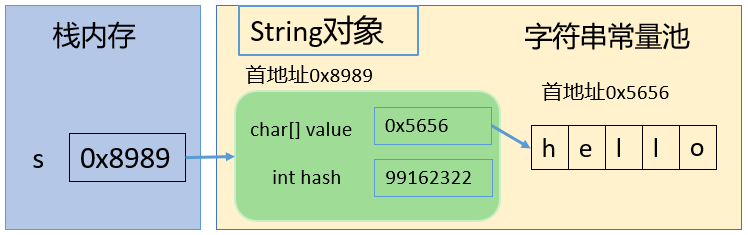
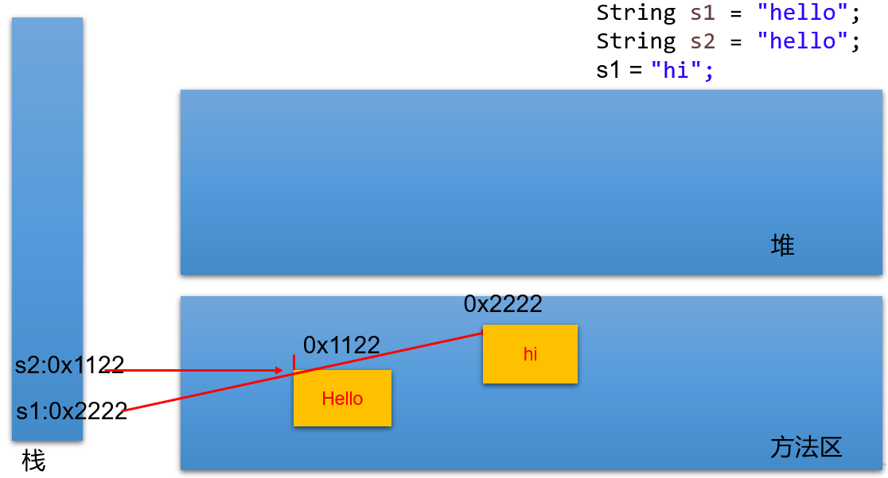
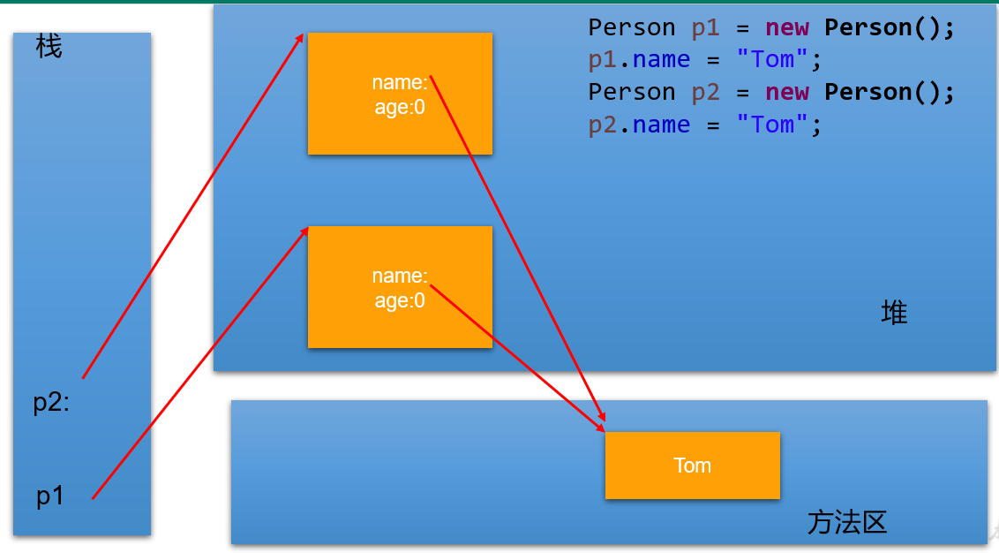
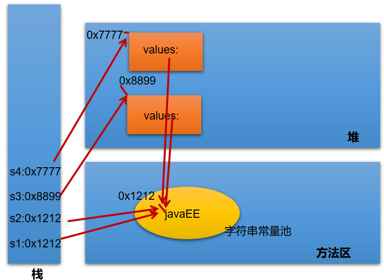
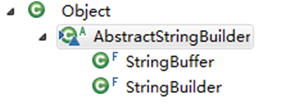

# Java API

## 1 字符串相关类之不可变字符序列：String

### 1.1 String 的特性

- `java.lang.String` 类代表字符串。Java 程序中所有的字符串文字（例如`"hello"` ）都可以看作是实现此类的实例。

- 字符串是常量，用双引号引起来表示。它们的值 **在创建之后不能更改**。

- 字符串 String 类型本身是 final 声明的，意味着我们不能继承 String。

- String 对象的字符内容是存储在一个字符数组 value[] 中的。`"abc"` 等效于 `char[] data={'h','e','l','l','o'}`。

  

  ```java
  // jdk8中的String源码：
  public final class String
      implements java.io.Serializable, Comparable<String>, CharSequence {
      /** The value is used for character storage. */
      private final char value[]; // String对象的字符内容是存储在此数组中
   
      /** Cache the hash code for the string */
      private int hash; // Default to 0
  ```

  - private 意味着外面无法直接获取字符数组，而且 String 没有提供 value 的 get 和 set 方法。

  - final 意味着字符数组的引用不可改变，而且 String 也没有提供方法来修改 value 数组某个元素值

  - 因此字符串的字符数组内容也不可变的，即 String 代表着不可变的字符序列。即，一旦对字符串进行修改，就会产生新对象。

  - JDK9 底层使用 byte[] 数组。

    ```java
    public final class String implements java.io.Serializable, Comparable<String>, CharSequence { 
        @Stable
        private final byte[] value;
    }
    
    //官方说明：... that most String objects contain only Latin-1 characters. Such characters require only one byte of storage, hence half of the space in the internal char arrays of such String objects is going unused.
    
    //细节：... The new String class will store characters encoded either as ISO-8859-1/Latin-1 (one byte per character), or as UTF-16 (two bytes per character), based upon the contents of the string. The encoding flag will indicate which encoding is used.
    ```

- Java 语言提供对字符串串联符号（"+"）以及将其他对象转换为字符串的特殊支持（toString()方法）。

### 1.2 String 的内存结构

#### 1.2.1 概述

因为字符串对象设计为不可变，所以字符串有常量池来保存很多常量对象。

JDK6 中，字符串常量池在方法区。JDK7 开始，就移到堆空间，直到目前 JDK17 版本。

举例内存结构分配：


#### 1.2.2 地址值

```java
@Test
public void test1() {
  String s1 = "hello";
  String s2 = "hello";
  System.out.println(s1 == s2);
}
// 内存中只有一个"hello"对象被创建，同时被s1和s2共享。
```

对应内存结构为：（以下内存结构以`JDK6为例`绘制）：




```java
@Test
public void test2() {
  Person p1 = new Person();
  p1.name = "Tom";

  Person p2 = new Person();
  p2.name = "Tom";

  System.out.println(p1.name.equals( p2.name));
  System.out.println(p1.name == p2.name);
  System.out.println(p1.name == "Tom");
}
```



#### 1.2.3 new

`String str1 = “abc”;` 与 `String str2 = new String(“abc”);` 的区别？


str2 首先指向堆中的一个字符串对象，然后堆中字符串的 value 数组指向常量池中常量对象的 value 数组。

> - 字符串常量存储在字符串常量池，目的是共享。
> - 字符串非常量对象存储在堆中。

练习：

```java
@Test
public void test3() {
  String s1 = "javaEE";
  String s2 = "javaEE";
  String s3 = new String("javaEE");
  String s4 = new String("javaEE");

  System.out.println(s1 == s2); // true
  System.out.println(s1 == s3); // false
  System.out.println(s3 == s4); // false
}
```



String str = new String("hello"); 在内存中创建了两个对象

#### 1.2.4 intern

- `String s1 = "a";`

说明：在字符串常量池中创建了一个字面量为"a"的字符串。

- `s1 = s1 + "b";`

说明：实际上原来的“a”字符串对象已经丢弃了，现在在堆空间中产生了一个字符串 `s1+"b"`（也就是"ab")。如果多次执行这些改变串内容的操作，会导致大量副本字符串对象存留在内存中，降低效率。如果这样的操作放到循环中，会极大影响程序的性能。

- `String s2 = "ab";`

说明：直接在字符串常量池中创建一个字面量为"ab"的字符串。

- `String s3 = "a" + "b";`

说明：s3指向字符串常量池中已经创建的"ab"的字符串。

- `String s4 = s1.intern();`

说明：堆空间的s1对象在调用 intern() 之后，会将常量池中已经存在的"ab"字符串赋值给s4。

练习：

```java
String s1 = "hello";
String s2 = "world";
String s3 = "hello" + "world";
String s4 = s1 + "world";
String s5 = s1 + s2;
String s6 = (s1 + s2).intern();

System.out.println(s3 == s4); //false
System.out.println(s3 == s5); //false
System.out.println(s4 == s5); //false
System.out.println(s3 == s6); //true
```

> **结论：**
>
> （1）常量+常量：结果是常量池。且常量池中不会存在相同内容的常量。
>
> （2）常量与变量 或 变量与变量：结果在堆中
>
> （3）拼接后调用intern方法：返回值在常量池中

练习：

```java
@Test
public void test01(){
 String s1 = "hello";
 String s2 = "world";
 String s3 = "helloworld";
  
 String s4 = s1 + "world";//s4字符串内容也helloworld，s1是变量，"world"常量，变量 + 常量的结果在堆中
 String s5 = s1 + s2;//s5字符串内容也helloworld，s1和s2都是变量，变量 + 变量的结果在堆中
 String s6 = "hello" + "world";//常量+ 常量 结果在常量池中，因为编译期间就可以确定结果
  
 System.out.println(s3 == s4);//false
 System.out.println(s3 == s5);//false
 System.out.println(s3 == s6);//true
}

@Test
public void test02(){
 final String s1 = "hello";
 final String s2 = "world";
 String s3 = "helloworld";
 
 String s4 = s1 + "world";//s4字符串内容也helloworld，s1是常量，"world"常量，常量+常量结果在常量池中
 String s5 = s1 + s2;//s5字符串内容也helloworld，s1和s2都是常量，常量+ 常量 结果在常量池中
 String s6 = "hello" + "world";//常量+ 常量 结果在常量池中，因为编译期间就可以确定结果
  
 System.out.println(s3 == s4);//true
 System.out.println(s3 == s5);//true
 System.out.println(s3 == s6);//true
}

@Test
public void test01(){
 String s1 = "hello";
 String s2 = "world";
 String s3 = "helloworld";
  
 String s4 = (s1 + "world").intern();//把拼接的结果放到常量池中
 String s5 = (s1 + s2).intern();
  
 System.out.println(s3 == s4);//true
 System.out.println(s3 == s5);//true
}
```

练习：

```java
/**
 * concat方法拼接，结果在堆中
 */
@Test
public void test6() {
  String s1 ="helloworld";
  String s2 = "hello".concat("world");

  System.out.println(s1 == s2); //false
}
```

练习：

```java
@Test
public void test7() {
  String str = "test";
  char[] ch = { 't', 'e', 's', 't' };
  change(str, ch);
  System.out.println(str);
  System.out.println(ch);
}
public void change(String str, char ch[]) {
  str = "best";
  ch[0] = 'b';
}
```

### 1.3 String 的常用 API

#### 1.3.1 构造器

- `public String()` ：初始化新创建的 String对象，以使其表示空字符序列。
- `String(String original)`： 初始化一个新创建的 `String` 对象，使其表示一个与参数相同的字符序列；换句话说，新创建的字符串是该参数字符串的副本。
- `public String(char[] value)` ：通过当前参数中的字符数组来构造新的String。
- `public String(char[] value,int offset, int count)` ：通过字符数组的一部分来构造新的String。
- `public String(byte[] bytes)` ：通过使用平台的**默认字符集**解码当前参数中的字节数组来构造新的String。
- `public String(byte[] bytes,String charsetName)` ：通过使用指定的字符集解码当前参数中的字节数组来构造新的String。

举例：

```java
@Test
public void test1() throws UnsupportedEncodingException {

  // 字面量定义方式：字符串常量对象
  String str1 = "hello";
  System.out.println(str1);

  // 构造器定义方式：无参构造
  String str2 = new String();
  System.out.println(str2);

  // 构造器定义方式：创建"hello"字符串常量的副本
  String str3 = new String("hello");
  System.out.println(str3);
  System.out.println(str1 == str3);

  // 构造器定义方式：通过字符数组构造
  char[] chars = {'h', 'e', 'l', 'l', 'o'};
  String str4 = new String(chars);
  String str5 = new String(chars, 0, 3);
  System.out.println(str4);
  System.out.println(str5);
  System.out.println(str1 == str4);
  System.out.println(str3 == str4);

  // 构造器定义方式：通过字节数组构造
  byte[] bytes = {97, 98, 99};
  String str6 = new String(bytes);
  String str7 = new String(bytes, "GBK");
  System.out.println(str6);
  System.out.println(str7);
}

@Test
public void test2() {
  char[] data = {'h', 'e', 'l', 'l', 'o', 'j', 'a', 'v', 'a'};
  String s1 = String.copyValueOf(data);
  String s2 = String.copyValueOf(data, 0, 5);
  int num = 123456;
  String s3 = String.valueOf(num);

  System.out.println(s1);
  System.out.println(s2);
  System.out.println(s3);
}
```

#### 1.3.2 转换

**字符串 --> 基本数据类型、包装类：**

- `Integer` 包装类的 `public static int parseInt(String s);` 可以将由“数字”字符组成的字符串转换为整型。
- 类似地，使用 `java.lang` 包中的 `Byte、Short、Long、Float、Double` 类调相应的类方法可以将由“数字”字符组成的字符串，转化为相应的基本数据类型。
- 非数字字符串转换，或者超出要转换的类型范围，会抛出异常 `java.lang.NumberFormatException`

**基本数据类型、包装类 --> 字符串：**

- 调用 `String` 类的 `public String valueOf(int n);` 可将 int 型转换为字符串。
- 相应的 `valueOf(byte b)、valueOf(long l)、valueOf(float f)、valueOf(double d)、valueOf(boolean b)` 可由参数的相应类型到字符串的转换。

 **字符数组 -->  字符串：**

- `String` 类的构造器：`String(char[])` 和 `String(char[]，int offset，int length)` 分别用字符数组中的全部字符和部分字符创建字符串对象。
- `String` 类的 `copyValueOf()` 方法。

 **字符串 -->  字符数组：**

- `public char[] toCharArray();` 将字符串中的全部字符存放在一个字符数组中的方法。
- `public void getChars(int srcBegin, int srcEnd, char[] dst, int dstBegin);` 提供了将指定索引范围内的字符串存放到数组中的方法。

**字符串 --> 字节数组：（编码）**

- `public byte[] getBytes();`  使用平台的默认字符集将此 String 编码为 byte 序列，并将结果存储到一个新的 byte 数组中。
- `public byte[] getBytes(String charsetName);` 使用指定的字符集将此 String 编码到 byte 序列，并将结果存储到新的 byte 数组。

 **字节数组 --> 字符串：（解码）**

- `String(byte[])` 通过使用平台的默认字符集解码指定的 byte 数组，构造一个新的 String。
- `String(byte[]，int offset，int length)`  用指定的字节数组的一部分，即从数组起始位置offset开始取length个字节构造一个字符串对象。
- `String(byte[], String charsetName)` 或 `new String(byte[], int, int, String charsetName)` 解码，按照指定的编码方式进行解码。

`String` 类包括的方法可用于检查序列的单个字符、比较字符串、搜索字符串、提取子字符串、创建字符串副本并将所有字符全部转换为大写或小写。

#### 1.3.3 常用方法

1. `boolean isEmpty()`：字符串是否为空
2. `int length()`：返回字符串的长度
3. `String concat(String str)`：拼接
4. `boolean equals(Object obj)`：比较字符串是否相等，区分大小写
5. `boolean equalsIgnoreCase(Object obj)`：比较字符串是否相等，不区分大小写
6. `int compareTo(String other)`：比较字符串大小，区分大小写，按照Unicode编码值比较大小
7. `int compareToIgnoreCase(String other)`：比较字符串大小，不区分大小写
8. `String toLowerCase()`：将字符串中大写字母转为小写
9. `String toUpperCase()`：将字符串中小写字母转为大写
10. `String trim()`：去掉字符串前后空白符
11. `public String intern()`：结果在常量池中共享

#### 1.3.4 查找

1. `boolean contains(String str)`：是否包含str
2. `int indexOf(String str)`：从前往后找当前字符串中str，即如果有返回第一次出现的下标，要是没有返回-1
3. `int indexOf(String str, int fromIndex)`：返回指定子字符串在此字符串中第一次出现处的索引，从指定的索引开始
4. `int lastIndexOf(String str)`：从后往前找当前字符串中str，即如果有返回最后一次出现的下标，要是没有返回-1
5. `int lastIndexOf(String str, int fromIndex)`：返回指定子字符串在此字符串中最后一次出现处的索引，从指定的索引开始反向搜索。

#### 1.3.5 字符串截取

1. `String substring(int beginIndex)`：返回一个新的字符串，它是此字符串的从 beginIndex 开始截取到最后的一个子字符串
2. `String substring(int beginIndex, int endIndex)`：返回一个新字符串，它是此字符串从 beginIndex 开始截取到 endIndex (不包含)的一个子字符串。

#### 1.3.6 字符/字符数组

1. `char charAt(int index)`：返回 index 位置的字符
2. `char[] toCharArray()`：将此字符串转换为一个新的字符数组返回
3. `static String valueOf(char[] data)`：返回指定数组中表示该字符序列的 String
4. `static String valueOf(char[] data, int offset, int count)`：返回指定数组中表示该字符序列的 String
5. `static String copyValueOf(char[] data)`：返回指定数组中表示该字符序列的 String
6. `static String copyValueOf(char[] data, int offset, int count)`：返回指定数组中表示该字符序列的 String

#### 1.3.7 开头与结尾

1. `boolean startsWith(String str)`：测试此字符串是否以指定的前缀开始
2. `boolean startsWith(String prefix, int toffset)`：测试此字符串从指定索引开始的子字符串是否以指定前缀开始
3. `boolean endsWith(String str)`：测试此字符串是否以指定的后缀结束

#### 1.3.8 替换

1. `String replace(char oldChar, char newChar)`：返回一个新的字符串，它是通过用 newChar 替换此字符串中出现的所有 oldChar 得到的。 不支持正则。
2. `String replace(CharSequence target, CharSequence replacement)`：使用指定的字面值替换序列替换此字符串所有匹配字面值目标序列的子字符串。
3. `String replaceAll(String regex, String replacement)`：使用给定的 replacement 替换此字符串所有匹配给定的正则表达式的子字符串。
4. `String replaceFirst(String regex, String replacement)`：使用给定的 replacement 替换此字符串匹配给定的正则表达式的第一个子字符串。

## 2 字符串相关类之可变字符序列：StringBuffer、StringBuilder

因为 String 对象是不可变对象，虽然可以共享常量对象，但是对于频繁字符串的修改和拼接操作，效率极低，空间消耗也比较高。因此，JDK 又在 java.lang 包提供了`可变字符序列` StringBuffer 和 StringBuilder 类型。

### 2.1 StringBuffer与StringBuilder的理解

- java.lang.StringBuffer 代表可变的字符序列，JDK1.0 中声明，可以对字符串内容进行增删，此时不会产生新的对象。比如：

  ```java
  /**
   * 对比可变和不可变字符序列的哈希值
   */
  @Test
  public void test1() {
    // String 类重写了 hashCode 方法，使用 System 类的 identityHashCode() 获取原始的 hashCode
    // 以下 s1 s2 hashCode 值相等，identityHashCode 值不相等
    String s1 = "hello";
    System.out.println(s1.hashCode());
    System.out.println(System.identityHashCode(s1));
    String s2 = new String("hello");
    System.out.println(s2.hashCode());
    System.out.println(System.identityHashCode(s2));
    System.out.println();
  
    // 以下 s1 s2 重新赋值后，和之前的 identityHashCode 不一样了
    s1 = "helloworld";
    s2 = "helloworld";
    System.out.println(System.identityHashCode(s1));
    System.out.println(System.identityHashCode(s2));
    System.out.println();
  
    // 可变字符序列的 identityHashCode 在修改后还是一样的
    StringBuffer sb = new StringBuffer("hello");
    System.out.println(System.identityHashCode(sb));
    sb.append("world");
    System.out.println(System.identityHashCode(sb));
  }
  ```

- 继承结构：

 

 

- StringBuilder 和 StringBuffer 非常类似，均代表可变的字符序列，而且提供相关功能的方法也一样。
- 区分 String、StringBuffer、StringBuilder
  - String:不可变的字符序列； 底层使用 char[] (JDK8.0中) / byte[] (JDK9.0中) 数组存储
  - StringBuffer:可变的字符序列；线程安全（方法有synchronized修饰），效率低；底层使用 char[] (JDK8.0中) / byte[] (JDK9.0中) 数组存储
  - StringBuilder:可变的字符序列；jdk1.5 引入，线程不安全的，效率高；底层使用 char[] (JDK8.0中) / byte[] (JDK9.0中) 数组存储

### 2.2 StringBuilder、StringBuffer的API

StringBuilder、StringBuffer的API是完全一致的，并且很多方法与String相同。

1. 常用API
   - `StringBuffer append(xx)`：提供了很多的append()方法，用于进行字符串追加的方式拼接
   - `StringBuffer delete(int start, int end)`：删除[start,end)之间字符
   - `StringBuffer deleteCharAt(int index)`：删除[index]位置字符
   - `StringBuffer replace(int start, int end, String str)`：替换[start,end)范围的字符序列为str
   - `void setCharAt(int index, char c)`：替换[index]位置字符
   - `char charAt(int index)`：查找指定index位置上的字符
   - `StringBuffer insert(int index, xx)`：在[index]位置插入xx
   - `int length()`：返回存储的字符数据的长度
   - `StringBuffer reverse()`：反转

2. 其它API
   - `int indexOf(String str)`：在当前字符序列中查询str的第一次出现下标
   - `int indexOf(String str, int fromIndex)`：在当前字符序列[fromIndex,最后]中查询str的第一次出现下标
   - `int lastIndexOf(String str)`：在当前字符序列中查询str的最后一次出现下标
   - `int lastIndexOf(String str, int fromIndex)`：在当前字符序列[fromIndex,最后]中查询str的最后一次出现下标
   - `String substring(int start)`：截取当前字符序列[start,最后]
   - `String substring(int start, int end)`：截取当前字符序列[start,end)
   - `String toString()`：返回此序列中数据的字符串表示形式
   - `void setLength(int newLength)`：设置当前字符序列长度为newLength

### 2.3 效率测试

```java
@Test
public void test3() {
  long startTime;
  long endTime;
  String text = "";
  StringBuffer buffer = new StringBuffer();
  StringBuilder builder = new StringBuilder();

  // String
  startTime = System.currentTimeMillis();
  for (int i = 0; i < 20000; i++) {
    text = text + i;
  }
  endTime = System.currentTimeMillis();
  System.out.println("String的执行时间：" + (endTime - startTime)); //424
  // StringBuffer
  startTime = System.currentTimeMillis();
  for (int i = 0; i < 20000; i++) {
    buffer.append(i);
  }
  endTime = System.currentTimeMillis();
  System.out.println("StringBuffer的执行时间：" + (endTime - startTime)); //16
 // StringBuilderw
  startTime = System.currentTimeMillis();
  for (int i = 0; i < 20000; i++) {
    builder.append(i);
  }
  endTime = System.currentTimeMillis();
  System.out.println("StringBuilder的执行时间：" + (endTime - startTime)); //4
}
```

## 3 JDK8之前：日期时间API

### 3.1 java.lang.System类的方法

- System 类提供的 public static long currentTimeMillis()：用来返回当前时间与1970年1月1日0时0分0秒之间以毫秒为单位的时间差。

  - 此方法适于计算时间差。

- 计算世界时间的主要标准有：

  - UTC(Coordinated Universal Time)
  - GMT(Greenwich Mean Time)
  - CST(Central Standard Time)

  > 在国际无线电通信场合，为了统一起见，使用一个统一的时间，称为通用协调时(UTC, Universal Time Coordinated)。UTC与格林尼治平均时(GMT, Greenwich Mean Time)一样，都与英国伦敦的本地时相同。这里，UTC与GMT含义完全相同。

### 3.2 java.util.Date

表示特定的瞬间，精确到毫秒。

- 构造器：
  - Date()：使用无参构造器创建的对象可以获取本地当前时间。
  - Date(long 毫秒数)：把该毫秒值换算成日期时间对象
- 常用方法
  - getTime(): 返回自 1970 年 1 月 1 日 00:00:00 GMT 以来此 Date 对象表示的毫秒数。
  - toString(): 把此 Date 对象转换为以下形式的 String： dow mon dd hh:mm:ss zzz yyyy 其中： dow 是一周中的某一天 (Sun, Mon, Tue, Wed, Thu, Fri, Sat)，zzz是时间标准。
  - 其它很多方法都过时了。

### 3.3 java.text.SimpleDateFormat

- java.text.SimpleDateFormat 类是一个不与语言环境有关的方式来格式化和解析日期的具体类。
- 可以进行格式化：日期 --> 文本
- 可以进行解析：文本 --> 日期
- **构造器：**
  - SimpleDateFormat() ：默认的模式和语言环境创建对象
  - public SimpleDateFormat(String pattern)：该构造方法可以用参数pattern指定的格式创建一个对象
- **格式化：**
  - public String format(Date date)：方法格式化时间对象date
- **解析：**
  - public Date parse(String source)：从给定字符串的开始解析文本，以生成一个日期。


### 3.4 java.util.Calendar(日历)


- Date 类的 API 大部分被废弃了，替换为 Calendar。

- Calendar 类是一个抽象类，主用用于完成日期字段之间相互操作的功能。

- 获取 Calendar 实例的方法

  - 使用`Calendar.getInstance()`方法

    

  - 调用它的子类 GregorianCalendar（公历）的构造器。

    

- 一个 Calendar 的实例是系统时间的抽象表示，可以修改或获取 YEAR、MONTH、DAY_OF_WEEK、HOUR_OF_DAY 、MINUTE、SECOND 等 日历字段对应的时间值。

  - public int get(int field)：返回给定日历字段的值
  - public void set(int field,int value) ：将给定的日历字段设置为指定的值
  - public void add(int field,int amount)：根据日历的规则，为给定的日历字段添加或者减去指定的时间量
  - public final Date getTime()：将Calendar转成Date对象
  - public final void setTime(Date date)：使用指定的Date对象重置Calendar的时间

- 常用字段

  

- 注意：

  - 获取月份时：一月是0，二月是1，以此类推，12月是11
  - 获取星期时：周日是1，周二是2 ， 。。。。周六是7

## 4 JDK8：新的日期时间API

如果我们可以跟别人说：“我们在1502643933071见面，别晚了！”那么就再简单不过了。但是我们希望时间与昼夜和四季有关，于是事情就变复杂了。JDK 1.0中包含了一个java.util.Date类，但是它的大多数方法已经在JDK 1.1引入Calendar类之后被弃用了。而Calendar并不比Date好多少。它们面临的问题是：

- 可变性：像日期和时间这样的类应该是不可变的。

- 偏移性：Date中的年份是从1900开始的，而月份都从0开始。

- 格式化：格式化只对Date有用，Calendar则不行。

- 此外，它们也不是线程安全的；不能处理闰秒等。

  > 闰秒，是指为保持协调世界时接近于世界时时刻，由国际计量局统一规定在年底或年中（也可能在季末）对协调世界时增加或减少1秒的调整。由于地球自转的不均匀性和长期变慢性（主要由潮汐摩擦引起的），会使世界时（民用时）和原子时之间相差超过到±0.9秒时，就把协调世界时向前拨1秒（负闰秒，最后一分钟为59秒）或向后拨1秒（正闰秒，最后一分钟为61秒）； 闰秒一般加在公历年末或公历六月末。
  >
  > 目前，全球已经进行了27次闰秒，均为正闰秒。

总结：对日期和时间的操作一直是Java程序员最痛苦的地方之一。

第三次引入的API是成功的，并且 Java 8 中引入的 java.time API 已经纠正了过去的缺陷，将来很长一段时间内它都会为我们服务。

Java 8 以一个新的开始为 Java 创建优秀的 API。新的日期时间API包含：

- `java.time` – 包含值对象的基础包
- `java.time.chrono` – 提供对不同的日历系统的访问。
- `java.time.format` – 格式化和解析时间和日期
- `java.time.temporal` – 包括底层框架和扩展特性
- `java.time.zone` – 包含时区支持的类

说明：新的 java.time 中包含了所有关于时钟（Clock），本地日期（LocalDate）、本地时间（LocalTime）、本地日期时间（LocalDateTime）、时区（ZonedDateTime）和持续时间（Duration）的类。

尽管有68个新的公开类型，但是大多数开发者只会用到基础包和format包，大概占总数的三分之一。

### 4.1 本地日期时间：LocalDate、LocalTime、LocalDateTime

| 方法                                                         | **描述**                                                     |
| ------------------------------------------------------------ | ------------------------------------------------------------ |
| now()/now(ZoneId zone)                                       | 静态方法，根据当前时间创建对象/指定时区的对象                |
| of(xx,xx,xx,xx,xx,xxx)                                       | 静态方法，根据指定日期/时间创建对象                          |
| getDayOfMonth()/getDayOfYear()                               | 获得月份天数(1-31) /获得年份天数(1-366)                      |
| getDayOfWeek()                                               | 获得星期几(返回一个 DayOfWeek 枚举值)                        |
| getMonth()                                                   | 获得月份, 返回一个 Month 枚举值                              |
| getMonthValue()/getYear()                                    | 获得月份(1-12) /获得年份                                     |
| getHours()/getMinute()/getSecond()                           | 获得当前对象对应的小时、分钟、秒                             |
| withDayOfMonth()/withDayOfYear()/withMonth()/withYear()      | 将月份天数、年份天数、月份、年份修改为指定的值并返回新的对象 |
| with(TemporalAdjuster  t)                                    | 将当前日期时间设置为校对器指定的日期时间                     |
| plusDays(),plusWeeks(),plusMonths(),plusYears(),plusHours()  | 向当前对象添加几天、几周、几个月、几年、几小时               |
| minusMonths(),minusWeeks(),minusDays(),minusYears(),minusHours() | 从当前对象减去几月、几周、几天、几年、几小时                 |
| plus(TemporalAmount t)/minus(TemporalAmount t)               | 添加或减少一个 Duration 或 Period                            |
| isBefore()/isAfter()                                         | 比较两个 LocalDate                                           |
| isLeapYear()                                                 | 判断是否是闰年（在LocalDate类中声明）                        |
| format(DateTimeFormatter  t)                                 | 格式化本地日期、时间，返回一个字符串                         |
| parse(Charsequence text)                                     | 将指定格式的字符串解析为日期、时间                           |

### 4.2 瞬时：Instant

- Instant：时间线上的一个瞬时点。 这可能被用来记录应用程序中的事件时间戳。
  - 时间戳是指格林威治时间1970年01月01日00时00分00秒(北京时间1970年01月01日08时00分00秒)起至现在的总秒数。
- `java.time.Instant`表示时间线上的一点，而不需要任何上下文信息，例如，时区。概念上讲，`它只是简单的表示自1970年1月1日0时0分0秒（UTC）开始的秒数。`

| **方法**                      | **描述**                                                     |
| ----------------------------- | ------------------------------------------------------------ |
| now()                         | 静态方法，返回默认UTC时区的Instant类的对象                   |
| ofEpochMilli(long epochMilli) | 静态方法，返回在1970-01-01 00:00:00基础上加上指定毫秒数之后的Instant类的对象 |
| atOffset(ZoneOffset offset)   | 结合即时的偏移来创建一个 OffsetDateTime                      |
| toEpochMilli()                | 返回1970-01-01 00:00:00到当前时间的毫秒数，即为时间戳        |

> 中国大陆、中国香港、中国澳门、中国台湾、蒙古国、新加坡、马来西亚、菲律宾、西澳大利亚州的时间与UTC的时差均为+8，也就是UTC+8。
>
> instant.atOffset(ZoneOffset.ofHours(8));


> 整个地球分为二十四时区，每个时区都有自己的本地时间。北京时区是东八区，领先UTC八个小时，在电子邮件信头的Date域记为+0800。如果在电子邮件的信头中有这么一行：
>
> Date: Fri, 08 Nov 2002 09:42:22 +0800
>
> 说明信件的发送地的地方时间是二○○二年十一月八号，星期五，早上九点四十二分（二十二秒），这个地方的本地时领先UTC八个小时(+0800， 就是东八区时间)。电子邮件信头的Date域使用二十四小时的时钟，而不使用AM和PM来标记上下午。

### 4.3 日期时间格式化：DateTimeFormatter

该类提供了三种格式化方法：

- (了解)预定义的标准格式。如：ISO_LOCAL_DATE_TIME、ISO_LOCAL_DATE、ISO_LOCAL_TIME

- (了解)本地化相关的格式。如：ofLocalizedDate(FormatStyle.LONG
- 自定义的格式。如：ofPattern(“yyyy-MM-dd hh:mm:ss”)

| **方**   **法**                    | **描**   **述**                                     |
| ---------------------------------- | --------------------------------------------------- |
| **ofPattern(String**  **pattern)** | 静态方法，返回一个指定字符串格式的DateTimeFormatter |
| **format(TemporalAccessor** **t)** | 格式化一个日期、时间，返回字符串                    |
| **parse(CharSequence**  **text)**  | 将指定格式的字符序列解析为一个日期、时间            |

### 4.4 其它API

**1、指定时区日期时间：ZondId和ZonedDateTime**

- ZoneId：该类中包含了所有的时区信息，一个时区的ID，如 Europe/Paris
- ZonedDateTime：一个在ISO-8601日历系统时区的日期时间，如 2007-12-03T10:15:30+01:00 Europe/Paris。
  - 其中每个时区都对应着ID，地区ID都为“{区域}/{城市}”的格式，例如：Asia/Shanghai等
- 常见时区ID：Asia/Shanghai、UTC、America/New_York

- 可以通过ZondId获取所有可用的时区ID：

**2、持续日期/时间：Period和Duration**

- 持续时间：Duration，用于计算两个“时间”间隔
- 日期间隔：Period，用于计算两个“日期”间隔

3、Clock：使用时区提供对当前即时、日期和时间的访问的时钟。

4、TemporalAdjuster : 时间校正器。有时我们可能需要获取例如：将日期调整到“下一个工作日”等操作。 TemporalAdjusters : 该类通过静态方法(firstDayOfXxx()/lastDayOfXxx()/nextXxx())提供了大量的常用 TemporalAdjuster 的实现。

### 4.5 与传统日期处理的转换

| **类**                                                       | **To** **遗留类**                     | **From** **遗留类**         |
| ------------------------------------------------------------ | ------------------------------------- | --------------------------- |
| **java.time.Instant与java.util.Date**                        | Date.from(instant)                    | date.toInstant()            |
| **java.time.Instant与java.sql.Timestamp**                    | Timestamp.from(instant)               | timestamp.toInstant()       |
| **java.time.ZonedDateTime与java.util.GregorianCalendar**     | GregorianCalendar.from(zonedDateTime) | cal.toZonedDateTime()       |
| **java.time.LocalDate与java.sql.Time**                       | Date.valueOf(localDate)               | date.toLocalDate()          |
| **java.time.LocalTime与java.sql.Time**                       | Date.valueOf(localDate)               | date.toLocalTime()          |
| **java.time.LocalDateTime与java.sql.Timestamp**              | Timestamp.valueOf(localDateTime)      | timestamp.toLocalDateTime() |
| **java.time.ZoneId与java.util.TimeZone**                     | Timezone.getTimeZone(id)              | timeZone.toZoneId()         |
| **java.time.format.DateTimeFormatter与java.text.DateFormat** | formatter.toFormat()                  | 无                          |

## 5 Java比较器

我们知道基本数据类型的数据（除boolean类型外）需要比较大小的话，之间使用比较运算符即可，但是引用数据类型是不能直接使用比较运算符来比较大小的。那么，如何解决这个问题呢？

- 在 Java 中经常会涉及到对象数组的排序问题，那么就涉及到对象之间的比较问题。

- Java 实现对象排序的方式有两种：
  - 自然排序：`java.lang.Comparable`
  - 定制排序：`java.util.Comparator`

### 5.1 自然排序：java.lang.Comparable

- Comparable 接口强行对实现它的每个类的对象进行整体排序。这种排序被称为类的自然排序。
- 实现 Comparable 的类必须实现 `compareTo(Object obj)`方法，两个对象即通过 compareTo(Object obj) 方法的返回值来比较大小。如果当前对象this大于形参对象obj，则返回正整数，如果当前对象this小于形参对象obj，则返回负整数，如果当前对象this等于形参对象obj，则返回零。

```java
package java.lang;

public interface Comparable{
    int compareTo(Object obj);
}
```

- 实现 Comparable 接口的对象列表（和数组）可以通过 Collections.sort 或 Arrays.sort进行自动排序。实现此接口的对象可以用作有序映射中的键或有序集合中的元素，无需指定比较器。
- 对于类 C 的每一个 e1 和 e2 来说，当且仅当 e1.compareTo(e2) == 0 与 e1.equals(e2) 具有相同的 boolean 值时，类 C 的自然排序才叫做与 equals 一致。建议（虽然不是必需的）`最好使自然排序与 equals 一致`。
- Comparable 的典型实现：(`默认都是从小到大排列的`)
  - String：按照字符串中字符的Unicode值进行比较
  - Character：按照字符的Unicode值来进行比较
  - 数值类型对应的包装类以及 BigInteger、BigDecimal：按照它们对应的数值大小进行比较
  - Boolean：true 对应的包装类实例大于 false 对应的包装类实例
  - Date、Time等：后面的日期时间比前面的日期时间大

### 5.2 定制排序：java.util.Comparator

- 思考
  - 当元素的类型没有实现 java.lang.Comparable 接口而又不方便修改代码（例如：一些第三方的类，你只有.class文件，没有源文件）
  - 如果一个类，实现了Comparable接口，也指定了两个对象的比较大小的规则，但是此时此刻我不想按照它预定义的方法比较大小，但是我又不能随意修改，因为会影响其他地方的使用，怎么办？
- JDK在设计类库之初，也考虑到这种情况，所以又增加了一个 `java.util.Comparator` 接口。强行对多个对象进行整体排序的比较。
  - 重写 compare(Object o1,Object o2) 方法，比较o1和o2的大小：如果方法返回正整数，则表示o1大于o2；如果返回0，表示相等；返回负整数，表示o1小于o2。
  - 可以将 Comparator 传递给 sort 方法（如 Collections.sort 或 Arrays.sort），从而允许在排序顺序上实现精确控制。

```java
package java.util;

public interface Comparator{
    int compare(Object o1,Object o2);
}
```

## 6 系统相关类

### 6.1 java.lang.System类

- System 类代表系统，系统级的很多属性和控制方法都放置在该类的内部。该类位于 `java.lang` 包。

- 由于该类的构造器是 private 的，所以无法创建该类的对象。其内部的成员变量和成员方法都是 `static` 的，所以也可以很方便的进行调用。

- 成员变量 Scanner scan = new Scanner(System.in);

  - System 类内部包含 `in`、`out`、`err` 三个成员变量，分别代表标准输入流(键盘输入)，标准输出流(显示器)和标准错误输出流(显示器)。

- 成员方法

  - `native long currentTimeMillis()`： 该方法的作用是返回当前的计算机时间，时间的表达格式为当前计算机时间和GMT时间(格林威治时间)1970年1月1号0时0分0秒所差的毫秒数。

  - `void exit(int status)`： 该方法的作用是退出程序。其中status的值为0代表正常退出，非零代表异常退出。使用该方法可以在图形界面编程中实现程序的退出功能等。

  - `void gc()`： 该方法的作用是请求系统进行垃圾回收。至于系统是否立刻回收，则取决于系统中垃圾回收算法的实现以及系统执行时的情况。

  - `String getProperty(String key)`： 该方法的作用是获得系统中属性名为key的属性对应的值。系统中常见的属性名以及属性的作用如下表所示：

    

  - `static void arraycopy(Object src, int srcPos, Object dest, int destPos, int length)`：

    从指定源数组中复制一个数组，复制从指定的位置开始，到目标数组的指定位置结束。常用于数组的插入和删除

### 6.2 java.lang.Runtime类

每个 Java 应用程序都有一个 `Runtime` 类实例，使应用程序能够与其运行的环境相连接。

`public static Runtime getRuntime()`： 返回与当前 Java 应用程序相关的运行时对象。应用程序不能创建自己的 Runtime 类实例。

`public long totalMemory()`：返回 Java 虚拟机中初始化时的内存总量。此方法返回的值可能随时间的推移而变化，这取决于主机环境。默认为物理电脑内存的1/64。

`public long maxMemory()`：返回 Java 虚拟机中最大程度能使用的内存总量。默认为物理电脑内存的1/4。

`public long freeMemory()`：回 Java 虚拟机中的空闲内存量。调用 gc 方法可能导致 freeMemory 返回值的增加。

## 7 和数学相关的类

### 7.1 java.lang.Math

`java.lang.Math` 类包含用于执行基本数学运算的方法，如初等指数、对数、平方根和三角函数。类似这样的工具类，其所有方法均为静态方法，并且不会创建对象，调用起来非常简单。

- `public static double abs(double a)` ：返回 double 值的绝对值。

- `public static double ceil(double a)` ：返回大于等于参数的最小的整数。

- `public static double floor(double a)` ：返回小于等于参数最大的整数。

- `public static long round(double a)` ：返回最接近参数的 long。(相当于四舍五入方法)

- `public static double pow(double a,double b)`：返回a的b幂次方法
- `public static double sqrt(double a)`：返回a的平方根
- `public static double random()`：返回[0,1)的随机值
- `public static final double PI`：返回圆周率
- `public static double max(double x, double y)`：返回x,y中的最大值
- `public static double min(double x, double y)`：返回x,y中的最小值
- 其它：`acos,asin,atan,cos,sin,tan` 三角函数

### 7.2 java.math包

#### 7.2.1 BigInteger

- Integer 类作为 int 的包装类，能存储的最大整型值为 231-1，Long 类也是有限的，最大为 263-1。如果要表示再大的整数，不管是基本数据类型还是他们的包装类都无能为力，更不用说进行运算了。

- java.math 包的 BigInteger 可以表示 `不可变的任意精度的整数`。BigInteger 提供所有 Java 的基本整数操作符的对应物，并提供 java.lang.Math 的所有相关方法。另外，BigInteger 还提供以下运算：模算术、GCD 计算、质数测试、素数生成、位操作以及一些其他操作。

- 构造器
  - `BigInteger(String val)`：根据字符串构建BigInteger对象
- 方法
  - `public BigInteger abs()` ：返回此 BigInteger 的绝对值的 BigInteger。
  - `BigInteger add(BigInteger val)` ：返回其值为 (this + val) 的 BigInteger
  - `BigInteger subtract(BigInteger val)` ：返回其值为 (this - val) 的 BigInteger
  - `BigInteger multiply(BigInteger val)` ：返回其值为 (this * val) 的 BigInteger
  - `BigInteger divide(BigInteger val)` ：返回其值为 (this / val) 的 BigInteger。整数相除只保留整数部分。
  - `BigInteger remainder(BigInteger val)` ：返回其值为 (this % val) 的 BigInteger。
  - `BigInteger[] divideAndRemainder(BigInteger val)`：返回包含 (this / val) 后跟 (this % val) 的两个 BigInteger 的数组。
  - `BigInteger pow(int exponent)` ：返回其值为 (this^exponent) 的 BigInteger。

#### 7.2.2 BigDecimal

- 一般的 Float 类和 Double 类可以用来做科学计算或工程计算，但在**商业计算中，要求数字精度比较高，故用到java.math.BigDecimal 类。**
- BigDecimal 类支持不可变的、任意精度的有符号十进制定点数。
- 构造器
  - `public BigDecimal(double val)`
  - `public BigDecimal(String val)` --> 推荐
- 常用方法
  - `public BigDecimal add(BigDecimal augend)`
  - `public BigDecimal subtract(BigDecimal subtrahend)`
  - `public BigDecimal multiply(BigDecimal multiplicand)`
  - `public BigDecimal divide(BigDecimal divisor, int scale, int roundingMode)`：divisor是除数，scale指明保留几位小数，roundingMode指明舍入模式（ROUND_UP :向上加1、ROUND_DOWN :直接舍去、ROUND_HALF_UP:四舍五入）

### 7.3 java.util.Random

用于产生随机数

- `boolean nextBoolean()`:返回下一个伪随机数，它是取自此随机数生成器序列的均匀分布的 boolean 值。
- `void nextBytes(byte[] bytes)`:生成随机字节并将其置于用户提供的 byte 数组中。
- `double nextDouble()`:返回下一个伪随机数，它是取自此随机数生成器序列的、在 0.0 和 1.0 之间均匀分布的 double 值。
- `float nextFloat()`:返回下一个伪随机数，它是取自此随机数生成器序列的、在 0.0 和 1.0 之间均匀分布的 float 值。
- `double nextGaussian()`:返回下一个伪随机数，它是取自此随机数生成器序列的、呈高斯（“正态”）分布的 double 值，其平均值是 0.0，标准差是 1.0。
- `int nextInt()`:返回下一个伪随机数，它是此随机数生成器的序列中均匀分布的 int 值。
- `int nextInt(int n)`:返回一个伪随机数，它是取自此随机数生成器序列的、在 0（包括）和指定值（不包括）之间均匀分布的 int 值。
- `long nextLong()`:返回下一个伪随机数，它是取自此随机数生成器序列的均匀分布的 long 值。
