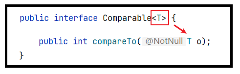

# Java 泛型

## 1 泛型概述

### 1.1 泛型的引入

在 Java 中，我们在声明方法时，当在完成方法功能时如果**有未知的数据**需要参与，这些未知的数据需要再调用方法是才能确定，那么我们把这样的数据通过**形参**表示。在具体方法中，用这个形参名来代表那个未知的数据，而调用者在调用时，对应的传入实参就可以了。

受以上启发，JDK5.0 设计了泛型的概念。泛型即为 ==类型参数==，这个类型参数在生命它的类、接口或方法中，代表位置的某种通用类型。

**举例1：**

集合类在设计阶段/声明阶段不能确定这个容器到底实际存的是什么类型的对象，所以在 JDK5.0 之前只能把元素类型设计为 Object，JDK5.0 时 Java 引入了“参数化类型（Parameterized type）”的概念，允许我们在创建集合时指定集合元素的类型。比如：`List<String>`，这表明该List只能保存字符串类型的对象。

使用集合存储数据时，除了元素的类型不确定，其他部分是确定的（例如关于这个元素如何保存，如何管理等）。

**举例2：**

`java.lang.Comparable` 接口和 `java.util.Comparator` 接口，是用于比较对象大小的接口。这两个接口只是限定了当一个对象大于另一个对象时返回正整数，小于返回负整数，等于返回0，但是并不确定是什么类型的对象比较大小。JDK5.0 之前只能用 Object 类型表示，使用时既麻烦又不安全，因此 JDK5.0 给它们增加了泛型。




其中 `<T>` 就是类型参数，即泛型。

> 所谓泛型，就是允许在定义类、接口时通过一个 ==标识== 表示类中某个 ==属性的类型== 或者是某个方法的 ==返回值或参数的类型==。这个类型参数将在使用时（例如，继承或实现这个接口、创建对象或调用方法时）确定（即传入实际的类型参数，也称为类型实参）。

## 2 泛型的使用

自从 JDK5.0 引入泛型的概念之后，对之前核心类库中的API做了很大的修改，例如：JDK5.0 改写了集合框架中的全部接口和类、java.lang.Comparable 接口、java.util.Comparator 接口、Class 类等。为这些接口、类增加了泛型支持，从而可以在声明变量、创建对象时传入类型实参。

### 2.1 集合中使用泛型

集合中没有使用泛型时：


集合中使用泛型时：


Java 泛型可以保证如果程序在编译时没有发出警告，运行时就不会产生 ClassCastException 异常。即，把不安全的因素在编译期间就排除了，而不是运行期；既然通过了编译，那么类型一定是符合要求的，就避免了类型转换。

同时，代码更加简洁、健壮。

把一个集合中的内容限制为一个特定的数据类型，这就是generic背后的核心思想。

## 2.2 比较器中使用泛型

```java
public class Circle{
    private double radius;

    public Circle(double radius) {
        super();
        this.radius = radius;
    }

    public double getRadius() {
        return radius;
    }

    public void setRadius(double radius) {
        this.radius = radius;
    }

    @Override
    public String toString() {
        return "Circle [radius=" + radius + "]";
    }

}
```

使用泛型前：

```java
class CircleComparator implements Comparator{
    @Override
    public int compare(Object o1, Object o2) {
      
        // 需要强制类型转换
        Circle c1 = (Circle) o1;
        Circle c2 = (Circle) o2;
        return Double.compare(c1.getRadius(), c2.getRadius());
    }
}
//测试：
public class TestNoGeneric {
    public static void main(String[] args) {
        CircleComparator com = new CircleComparator();
        System.out.println(com.compare(new Circle(1), new Circle(2)));

        System.out.println(com.compare("圆1", "圆2"));//运行时异常：ClassCastException
    }
}
```

使用泛型后：

```java
class CircleComparator1 implements Comparator<Circle> {

    @Override
    public int compare(Circle o1, Circle o2) {
        //不再需要强制类型转换，代码更简洁
        return Double.compare(o1.getRadius(), o2.getRadius());
    }
}

//测试类
public class TestHasGeneric {
    public static void main(String[] args) {
        CircleComparator1 com = new CircleComparator1();
        System.out.println(com.compare(new Circle(1), new Circle(2)));

        //System.out.println(com.compare("圆1", "圆2"));
        //编译错误，因为"圆1", "圆2"不是Circle类型，是String类型，编译器提前报错，
        //而不是冒着风险在运行时再报错。
    }
}
```

### 2.3 相关使用说明

- 在创建集合对象的时候，可以指明泛型的类型。

  具体格式为：`List<Integer> list = new ArrayList<Integer>();`。

- JDK7.0 时，有新特性，可以简写为：

  `List<Integer> list = new ArrayList<>();` ，内部类型推断。

- 泛型，也称为泛型参数，即参数的类型，只能使用引用数据类型进行赋值。（不能使用基本数据类型，可以使用包装类替换）。

- 集合声明时，声明泛型参数。在使用集合时，可以具体指明泛型的类型。一旦指明，类或接口内部，凡是使用泛型参数的位置，都指定为具体的参数类型。如果没有指明的话，看做是 Object 类型。

## 3 自定义泛型结构

### 3.1 泛型的基础说明

**1、<类型> 这种语法形式就叫泛型。**

- <类型> 的形式我们称为类型参数，这里的"类型"习惯上使用T表示，是 Type 的缩写。即：`<T>`。
- `<T>`：代表未知的数据类型，我们可以指定为 `<String>`，`<Integer>`，`<Circle>` 等。
- 这里的 T，可以替换成 K，V 等任意字母。

**2、在哪里可以声明类型变量 `<T>`**

- 声明类或接口时，在类名或接口名后面声明泛型类型，我们把这样的类或接口称为 **泛型类**或 **泛型接口**。

  ```java
  public class ArrayList<E>
  public interface Map<K,V>
  ```

- 声明方法时，在【修饰符】与返回值类型之间声明类型变量，我们把声明了类型变量的方法，称为泛型方法。

  ```java
  public static <T> List<T> asList(T... a) {
    // ...
  }
  ```

### 3.2 自定义泛型类或泛型接口

当我们在类或接口中定义某个成员时，该成员的相关类型是不确定的，而这个类型需要在使用这个类或接口时才可以确定，那么我们可以使用泛型类、泛型接口。

**说明：**

1. 我们在声明完自定义泛型类以后，可以在类的内部（比如：属性、方法、构造器中）使用类的泛型。
2. 我们在创建自定义泛型类的对象时，可以指明泛型参数类型。一旦指明，内部凡是使用类的泛型参数的位置，都具体化为指定的类的泛型类型。
3. 如果在创建自定义泛型类的对象时，没有指明泛型参数类型，那么泛型将被擦除，泛型对应的类型均按照 Object 处理，但不等价于 Object。
4. 泛型的指定中必须使用引用数据类型。不能使用基本数据类型，此时只能使用包装类替换。
5. 除创建泛型类对象外，子类继承泛型类时、实现类实现泛型接口时，也可以确定泛型结构中的泛型参数。还可以在现有的父类的泛型参数的基础上，新增泛型参数。

**注意：**

1. 泛型类可能有多个参数，此时应将多个参数一起放在尖括号内。比如：<E1,E2,E3>。
2. JDK7.0 开始，泛型的简化操作：`ArrayList<Fruit> flist = new ArrayList<>();`。
3. 如果泛型结构是一个接口或抽象类，则不可创建泛型类的对象。
4. 不能使用 `new E[]`。但是可以：`E[] elements = (E[])new Object[capacity];`。
5. 在类/接口上声明的泛型，在本类或本接口中即代表某种类型，但不可以在 **静态方法** 中使用类的泛型。
6. **异常类**不能是带泛型的。

### 3.3 自定义泛型方法

如果我们定义类、接口时没有使用 <泛型参数>，但是某个方法形参类型不确定时，这个方法可以单独定义 <泛型参数>。

**说明：**

- 泛型方法的格式

  ```java
  [访问权限]  <泛型>  返回值类型  方法名([泛型标识 参数名称]) [抛出的异常] {
      
  }
  ```

- 方法，也可以被泛型化，与其所在的类是否是泛型类没有关系。
- 泛型方法中的泛型参数在方法被调用时确定。
- 泛型方法可以根据需要，声明为 static 的。

## 4 泛型在继承上的体现

如果 B 是 A 的一个子类型（子类或者子接口），而 G 是具有泛型声明的类或接口，`G<B>` 并不是 `G<A>` 的子类型！

比如：String 是 Object 的子类，但是 `List<String>` 并不是 `List<Object>` 的子类。

## 5 通配符的使用

当我们声明一个变量/形参时，这个变量/形参的类型是一个泛型类或泛型接口，例如： `Comparator<T>` 类型，但是我们仍然无法确定这个泛型类或泛型接口的类型变量 `<T>` 的具体类型，此时我们考虑使用类型通配符 ? 。

### 5.1 通配符的理解

使用类型通配符：?

比如：`List<?>`，`Map<?,?>`

 `List<?>` 是 `List<String>`、`List<Object>` 等各种泛型List的父类。

### 5.2 通配符的读与写

**写操作：**

将任意元素加入到其中不是类型安全的：

```java
Collection<?> c = new ArrayList<String>();
c.add(new Object()); // 编译时错误
```

因为我们不知道 c 的元素类型，我们不能向其中添加对象。add 方法有类型参数 E 作为集合的元素类型。我们传给 add 的任何参数都必须是一个未知类型的子类。因为我们不知道那是什么类型，所以我们无法传任何东西进去。

唯一可以插入的元素是 null，因为它是所有引用类型的默认值。

**读操作：**

```java
public static void test(Collection<?> coll){
  for (Object o : coll) {
    System.out.println(o);
  }
}
```

另一方面，读取 List<?> 的对象 list 中的元素时，永远是安全的，因为不管 list  的真实类型是什么，它包含的都是 Object。

### 5.3 使用注意点

1. 编译错误：不能用在泛型方法声明上，返回值类型前面 <> 不能使用 ?

   ```java
   public static <?> void test(ArrayList<?> list) {
   }
   ```

2. 编译错误：不能用在泛型类的声明上

   ```java
   class GenericTypeClass<?> {
   }
   ```

3. 编译错误：不能用在创建对象上，右边属于创建集合对象

   ```java
   ArrayList<?> list2 = new ArrayList<?>();
   ```

### 5.4 有限制的通配符

1. 允许所有泛型的引用调用 `<?>`
2. 通配符指定上限：`<? extends 类/接口 >`
3. 通配符指定下限：`<? super 类/接口 >`

**说明：**

```java
// 只允许泛型为 Number 及 Number 子类的引用调用，(无穷小 , Number]
<? extends Number>

// 只允许泛型为 Number 及 Number 父类的引用调用，[Number , 无穷大)
<? super Number>

// 只允许泛型为实现 Comparable 接口的实现类的引用调用
<? extends Comparable>
```
