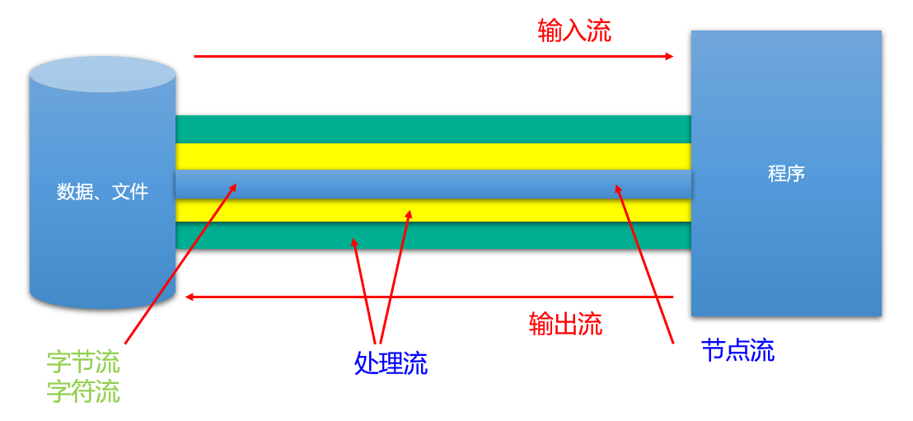

# Java IO

## 1 File 类的使用

### 1.1 概述

- File 类及本章下的各种流，都定义在 `java.io` 包下。
- 一个 File 对象代表硬盘或网络中**可能存在的一个文件或者文件目录**，与平台无关。
- File 能新建、删除、重命名文件和目录，但 File 不能访问文件内容本身。如果需要访问文件内容本身，则需要使用输入/输出流。File 对象可以作为参数传递给流的构造器。
- 想要在 Java 程序中表示一个真实存在的文件或目录，那么必须有一个 File 对象，但是 Java 程序中的一个 File 对象，可能没有一个真实存在的文件或目录。

### 1.2 构造器

- `public File(String pathname)`

  以 pathname 为路径创建 File 对象，可以是绝对路径或者相对路径，如果 pathname 是相对路径，则默认的当前模块所在目录。

- `public File(String parent, String child)`

  以 parent 为父路径，child 为子路径创建 File 对象。

- `public File(File parent, String child)`

  根据一个父 File 对象和子文件路径创建 File 对象。

关于路径：

- **绝对路径：**从盘符开始的路径，这是一个完整的路径。
- **相对路径：**相对于 **项目目录** 的路径，这是一个便捷的路径，开发中经常使用。
  - IDEA中，main 中的文件的相对路径，是相对于 **当前工程**。
  - IDEA中，单元测试方法中的文件的相对路径，是相对于 **当前 module**。

```java
public class FileTest {

  /**
   * File 构造器测试
   */
  @Test
  public void test1() {

    // 1 通过路径，单元测试方法中的文件的相对路径，是相对于当前 module
    File file1 = new File("file.test");
    System.out.println(file1.getAbsolutePath());

    // 2 通过父路径和子路径
    File file2 = new File("common", "file.test");
    System.out.println(file2.getAbsolutePath());

    // 3 通过父对象和子路径
    File file3 = new File(new File("common"), "file.test");
    System.out.println(file3.getAbsolutePath());
  }
}
```

**注意：**

1. 无论该路径下是否存在文件或者目录，都不影响 File 对象的创建。

2. Java 程序支持将 `/` 当成平台无关的路径分隔符，或者直接使用 `File.separator` 常量值表示。

3. 当构造路径是绝对路径时，那么 getPath 和 getAbsolutePath 结果一样

   当构造路径是相对路径时，那么 getAbsolutePath 的路径 = user.dir 的路径 + 构造路径。

### 1.3 常用方法

#### 1.3.1 获取文件和目录基本信息

- `public String getName()`：获取名称
- `public String getPath()`：获取路径
- `public String getAbsolutePath()`：获取绝对路径
- `public File getAbsoluteFile()`：获取绝对路径表示的文件
- `public String getParent()`：获取上层文件目录路径。若无，返回null
- `public long length()`：获取文件长度（即：字节数）。不能获取目录的长度。
- `public long lastModified()`：获取最后一次的修改时间，毫秒值

如果 File 对象代表的文件或目录存在，则 File 对象实例初始化时，就会用硬盘中对应文件或目录的属性信息（例如，时间、类型等）为 File 对象的属性赋值，否则除了路径和名称，File 对象的其他属性将会保留默认值。


```java
public class FileTest {

  /**
   * 获取目录或文件的信息
   */
  @Test
  public void test2() {

    // 目录
    File dir1 = new File("src/common");
    System.out.println("目录路径:" + dir1.getPath());
    System.out.println("目录绝对路径:" + dir1.getAbsolutePath());
    System.out.println("目录名称:" + dir1.getName());
    System.out.println("上层目录名称:" + dir1.getParent());
    System.out.println("目录长度:" + dir1.length() + "字节");
    System.out.println("目录最后修改时间：" + LocalDateTime.ofInstant(Instant.ofEpochMilli(dir1.lastModified()), ZoneId.of("Asia/Shanghai")));
    System.out.println();

    // 文件
    File file1 = new File("src/common/file.test");
    System.out.println("文件路径:" + file1.getPath());
    System.out.println("文件绝对路径:" + file1.getAbsolutePath());
    System.out.println("文件名称:" + file1.getName());
    System.out.println("上层文件名称:" + file1.getParent());
    System.out.println("文件长度:" + file1.length() + "字节");
    System.out.println("文件最后修改时间：" + LocalDateTime.ofInstant(Instant.ofEpochMilli(file1.lastModified()), ZoneId.of("Asia/Shanghai")));
    System.out.println();

    // 文件或目录不存在时，File 对象属性保留默认值
    File file2 = new File("src/common/file.test.no");
    System.out.println("文件路径:" + file2.getPath());
    System.out.println("文件绝对路径:" + file2.getAbsolutePath());
    System.out.println("文件名称:" + file2.getName());
    System.out.println("文件长度:" + file2.length() + "字节");
    System.out.println("文件最后修改时间：" + LocalDateTime.ofInstant(Instant.ofEpochMilli(file2.lastModified()), ZoneId.of("Asia/Shanghai")));
  }
}
```

#### 1.3.2 列出目录的下一级

- `public String[] list()`：返回一个 String 数组，表示该 File 目录中的所有子文件或目录。
- `public File[] listFiles()`：返回一个 File 数组，表示该File目录中的所有的子文件或目录。

```java
public class FileTest {

  /**
     * 目录中的子文件或目录
     */
  @Test
  public void test3() {

    File dir1 = new File("src/common/dir");
    String[] subs1 = dir1.list();
    for (String sub : subs1) {
      System.out.println(sub);
    }

    File dir2 = new File("src/common");
    File[] subs2 = dir2.listFiles();
    for (File sub : subs2) {
      System.out.println(sub.getAbsolutePath());
    }
  }
}
```

#### 1.3.3 File 类中的创建、修改、删除功能

- `public boolean createNewFile()`：创建文件。若文件存在，则不创建，返回false。
- `public boolean mkdir()`：创建文件目录。如果此文件目录存在，就不创建了。如果此文件目录的上层目录不存在，也不创建。
- `public boolean mkdirs()`：创建文件目录。如果上层文件目录不存在，一并创建。

- `public boolean renameTo(File dest)`: 把文件重命名为指定的文件路径。
- `public boolean delete()`：删除文件或者文件夹
  删除注意事项：① Java中的删除不走回收站。② 要删除一个文件目录，请注意该文件目录内不能包含文件或者文件目录。

```java
public class FileTest {

  /**
   * 创建、修改、删除功能
   */
  @Test
  public void test4() throws IOException {

    // 文件的创建
    File file1 = new File("src/common/aaa.test");
    System.out.println("aaa.test 是否存在:" + file1.exists());
    System.out.println("aaa.test 是否创建:" + file1.createNewFile());
    System.out.println("aaa.test 是否存在:" + file1.exists());

    // 目录的创建
    File dir1 = new File("src/common/dir");
    System.out.println("dir1 是否存在:" + dir1.exists());
    System.out.println("dir1 是否创建:" + dir1.mkdir());
    System.out.println("dir1 是否存在:" + dir1.exists());

    // 创建多级目录
    File dir2 = new File("src/common/dir2/dir2_1");
    System.out.println("src/common/dir2/dir2_1 创建：" + dir2.mkdirs());

    // 重命名
    File dir3 = new File("src/common/dir2/dir2_1");
    System.out.println("src/common/dir2/dir2_1 重命名：" + dir3.renameTo(new File("src/common/dir2/dir2-1")));

    // 文件的删除
    System.out.println("aaa.test 删除：" + file1.delete());

    // 目录的删除
    File dir4 = new File("src/common/dir2/dir2-1");
    System.out.println("src/common/dir2/ 删除：" + dir4.delete());
  }
```

#### 1.3.4 File 类中的判断功能

- `public boolean exists()`：此File表示的文件或目录是否实际存在。
- `public boolean isDirectory()`：此File表示的是否为目录。
- `public boolean isFile()`：此File表示的是否为文件。
- `public boolean canRead()`：判断是否可读
- `public boolean canWrite()`：判断是否可写
- `public boolean isHidden()`：判断是否隐藏

## 2 IO 流原理及流的分类

### 2.1 Java IO 原理

Java 程序中，对于数据的输入/输出操作以流 (io) 的方式进行，可以看做是一种数据的流动。

I/O 流中的 I/O 是`Input/Output`的缩写， I/O 技术是非常实用的技术，用于处理设备之间的数据传输。如读/写文件，网络通讯等。

- **输入input**：读取外部数据（磁盘、光盘等存储设备的数据）到程序（内存）中。
- **输出output**：将程序（内存）数据输出到磁盘、光盘等存储设备中。

### 2.2 流的分类

`java.io`包下提供了各种“流”类和接口，用以获取不同种类的数据，并通过标准的方法输入或输出数据。

- 按数据的流向不同分为：**输入流**和**输出流**。
  - **输入流** ：把数据 **从其他设备上读取到内存中** 的流。
    - 以 InputStream、Reader 结尾
  - **输出流** ：把数据 **从内存中写出到其他设备上** 的流。
    - 以 OutputStream、Writer 结尾
- 按操作数据单位的不同分为：**字节流（8bit）**和**字符流（16bit）**。
  - **字节流** ：以字节为单位，读写数据的流。
    - 以 InputStream、OutputStrea m结尾
  - **字符流** ：以字符为单位，读写数据的流。
    - 以 Reader、Writer 结尾
- 根据 IO 流的角色不同分为：**节点流**和**处理流**。
  - **节点流**：直接从数据源或目的地读写数据。
  - **处理流**：不直接连接到数据源或目的地，而是“连接”在已存在的流（节点流或处理流）之上，通过对数据的处理为程序提供更为强大的读写功能。



### 2.3 流的 API

Java 的 IO 流共涉及40多个类，实际上非常规则，都是从如下4个抽象基类派生的。

| （抽象基类） |   输入流    |    输出流    |
| :----------: | :---------: | :----------: |
|    字节流    | InputStream | OutputStream |
|    字符流    |   Reader    |    Writer    |

由这四个类派生出来的子类名称都是以其父类名作为子类名后缀。


**常用的节点流：** 　

- 文件流： `FileInputStream`、`FileOutputStrean`、`FileReader`、`FileWriter`

- 字节/字符数组流： `ByteArrayInputStream`、`ByteArrayOutputStream`、`CharArrayReader`、`CharArrayWriter`

  对数组进行处理的节点流（对应的不再是文件，而是内存中的一个数组）。

**常用处理流：**

- 缓冲流：`BufferedInputStream`、`BufferedOutputStream`、`BufferedReader`、`BufferedWriter`

  作用：增加缓冲功能，避免频繁读写硬盘，进而提升读写效率。

- 转换流：`InputStreamReader`、`OutputStreamReader`

  作用：实现字节流和字符流之间的转换。

- 对象流：`ObjectInputStream`、`ObjectOutputStream`

  作用：提供直接读写Java对象功能

## 3 节点流之一：FileReader\FileWriter

### 3.1 Reader与Writer

Java 提供一些字符流类，以**字符**为单位读写数据，专门用于处理文本文件。不能操作图片，视频等**非文本文件**。

> 常见的文本文件有如下的格式：.txt、.java、.c、.cpp、.py等
>
> 注意：.doc、.xls、.ppt这些都不是文本文件。

#### 3.1.1 字符输入流：Reader

`java.io.Reader` 抽象类是表示用于**读取字符流**的所有类的父类，可以读取字符信息到内存中。它定义了字符输入流的基本共性功能方法。

- `public int read()`：从输入流读取一个字符。虽然读取了一个字符，但是会自动提升为int类型。返回该字符的Unicode编码值。如果已经到达流末尾了，则返回-1。
- `public int read(char[] cbuf)`： 从输入流中读取一些字符，并将它们存储到字符数组 cbuf中 。每次最多读取cbuf.length个字符。返回实际读取的字符个数。如果已经到达流末尾，没有数据可读，则返回-1。
- `public int read(char[] cbuf,int off,int len)`：从输入流中读取一些字符，并将它们存储到字符数组 cbuf中，从cbuf[off]开始的位置存储。每次最多读取len个字符。返回实际读取的字符个数。如果已经到达流末尾，没有数据可读，则返回-1。
- `public void close()` ：关闭此流并释放与此流相关联的任何系统资源。

**注意：**

当完成流的操作时，必须调用 close() 方法，释放系统资源，否则会造成内存泄漏。

#### 3.1.2 字符输出流：Writer

`java.io.Writer`抽象类是表示用于写出字符流的所有类的超类，将指定的字符信息写出到目的地。它定义了字节输出流的基本共性功能方法。

- `public void write(int c)` ：写出单个字符。
- `public void write(char[] cbuf)`：写出字符数组。
- `public void write(char[] cbuf, int off, int len)`：写出字符数组的某一部分。off：数组的开始索引；len：写出的字符个数。
- `public void write(String str)`：写出字符串。
- `public void write(String str, int off, int len)` ：写出字符串的某一部分。off：字符串的开始索引；len：写出的字符个数。
- `public void flush()`：刷新该流的缓冲。  
- `public void close()` ：关闭此流。

**注意：**

当完成流的操作时，必须调用 close() 方法，释放系统资源，否则会造成内存泄漏。

### 3.2 FileReader 与 FileWriter

#### 3.2.1 FileReader

`java.io.FileReader` 类用于读取字符文件，构造时使用系统默认的字符编码和默认字节缓冲区。

- `FileReader(File file)`：创建一个新的 FileReader，给定要读取的 File 对象。
- `FileReader(String fileName)`：创建一个新的 FileReader，给定要读取的文件的名称。

#### 3.2.2 FileWriter

`java.io.FileWriter` 类用于写出字符到文件，构造时使用系统默认的字符编码和默认字节缓冲区。

- `FileWriter(File file)`：创建一个新的 FileWriter，给定要读取的File对象。
- `FileWriter(String fileName)`：创建一个新的 FileWriter，给定要读取的文件的名称。  
- `FileWriter(File file, boolean append)`：创建一个新的 FileWriter，指明是否在现有文件末尾追加内容。

因为内置缓冲区的原因，如果 FileWriter 不关闭输出流，无法写出字符到文件中。但是关闭的流对象，是无法继续写出数据的。如果我们既想写出数据，又想继续使用流，就需要 `flush()` 方法了。

- `flush()` ：刷新缓冲区，流对象可以继续使用。
- `close()`：先刷新缓冲区，然后通知系统释放资源。流对象不可以再被使用了。

注意：即便是 flush() 方法写出了数据，操作的最后还是要调用 close() 方法，释放系统资源。

## 节点流之二：FileInputStream\FileOutputStream

如果我们读取或写出的数据是非文本文件，则 Reader、Writer 就无能为力了，必须使用字节流。

### 4.1 InputStream和OutputStream

#### 4.1.1 字节输入流：InputStream

`java.io.InputStream` 抽象类是表示字节输入流的所有类的超类，可以读取字节信息到内存中。它定义了字节输入流的基本共性功能方法。

- `public int read()`：从输入流读取一个字节。返回读取的字节值。虽然读取了一个字节，但是会自动提升为int类型。如果已经到达流末尾，没有数据可读，则返回 -1。
- `public int read(byte[] b)`： 从输入流中读取一些字节数，并将它们存储到字节数组 b 中 。每次最多读取 b.length 个字节。返回实际读取的字节个数。如果已经到达流末尾，没有数据可读，则返回 -1。
- `public int read(byte[] b,int off,int len)`：从输入流中读取一些字节数，并将它们存储到字节数组 b 中，从 b[off] 开始存储，每次最多读取 len 个字节 。返回实际读取的字节个数。如果已经到达流末尾，没有数据可读，则返回-1。
- `public void close()` ：关闭此输入流并释放与此流相关联的任何系统资源。

#### 4.1.2 字节输出流：OutputStream

`java.io.OutputStream` 抽象类是表示字节输出流的所有类的超类，将指定的字节信息写出到目的地。它定义了字节输出流的基本共性功能方法。

- `public void write(int b)` ：将指定的字节输出流。虽然参数为int类型四个字节，但是只会保留一个字节的信息写出。
- `public void write(byte[] b)`：将 b.length 字节从指定的字节数组写入此输出流。  
- `public void write(byte[] b, int off, int len)` ：从指定的字节数组写入 len 字节，从偏移量 off 开始输出到此输出流。  
- `public void flush()` ：刷新此输出流并强制任何缓冲的输出字节被写出。  
- `public void close()` ：关闭此输出流并释放与此流相关联的任何系统资源。

### 4.2 FileInputStream 与 FileOutputStream

#### 4.2.1 FileInputStream

`java.io.FileInputStream`类是文件输入流，从文件中读取字节。

- `FileInputStream(File file)`： 通过打开与实际文件的连接来创建一个 FileInputStream ，该文件由文件系统中的 File 对象命名。
- `FileInputStream(String name)`： 通过打开与实际文件的连接来创建一个 FileInputStream ，该文件由文件系统中的路径名命名。

#### 4.2.2 FileOutputStream

`java.io.FileOutputStream`类是文件输出流，用于将数据写出到文件。

- `public FileOutputStream(File file)`：创建文件输出流，写出由指定的 File 对象表示的文件。
- `public FileOutputStream(String name)`：创建文件输出流，指定的名称为写出文件。
- `public FileOutputStream(File file, boolean append)`：创建文件输出流，指明是否在现有文件末尾追加内容。

## 5 处理流之一：缓冲流

**为了提高数据读写的速度**，Java API 提供了带缓冲功能的流类：缓冲流。

缓冲流要“套接”在相应的节点流之上，根据数据操作单位可以把缓冲流分为：

- **字节缓冲流**：`BufferedInputStream`，`BufferedOutputStream`
- **字符缓冲流**：`BufferedReader`，`BufferedWriter`

缓冲流的基本原理：在创建流对象时，内部会创建一个缓冲区数组（缺省使用8192个字节(8Kb)的缓冲区），通过缓冲区读写，减少系统 IO 次数，从而提高读写的效率。

### 5.1 构造器

- `public BufferedInputStream(InputStream in)` ：创建字节缓冲输入流。
- `public BufferedOutputStream(OutputStream out)`： 创建字节缓冲输出流。

- `public BufferedReader(Reader in)` ：创建字符缓冲输入流。
- `public BufferedWriter(Writer out)`： 创建字符缓冲输出流。

### 5.2 效率测试

### 5.3 字符缓冲流特有方法

- BufferedReader：`public String readLine()`: 读一行。
- BufferedWriter：`public void newLine()`: 写入换行符。

> 说明：
>
> 1. 涉及到嵌套的多个流时，如果都显式关闭的话，需要先关闭外层的流，再关闭内层的流
>
> 2. 其实在开发中，只需要关闭最外层的流即可，因为在关闭外层流时，内层的流也会被关闭。

## 6. 处理流之二：转换流

### 6.1 问题引入

**情况1：**

使用 `FileReader` 读取项目中的文本文件。由于IDEA设置中针对项目设置了UTF-8编码，当读取Windows系统中创建的文本文件时，如果Windows系统默认的是GBK编码，则读入内存中会出现乱码。

```java
public class Problem {
  public static void main(String[] args) throws IOException {
    FileReader fileReader = new FileReader("E:\\File_GBK.txt");
    int data;
    while ((data = fileReader.read()) != -1) {
      System.out.print((char)data);
    }
    fileReader.close();
  }
}

// 输出结果：
// ���
```

**情况2：**

针对文本文件，现在使用一个字节流进行数据的读入，希望将数据显示在控制台上。此时针对包含中文的文本数据，可能会出现乱码。

### 6.2 转换流的理解

**作用：转换流是字节与字符间的桥梁！**


### 6.3 InputStreamReader 与 OutputStreamWriter

**InputStreamReader**

- 转换流`java.io.InputStreamReader`，是Reader的子类，是从字节流到字符流的桥梁。它读取字节，并使用指定的字符集将其解码为字符。它的字符集可以由名称指定，也可以接受平台的默认字符集。

- 构造器

  - `InputStreamReader(InputStream in)`: 创建一个使用默认字符集的字符流。
  - `InputStreamReader(InputStream in, String charsetName)`: 创建一个指定字符集的字符流。

**OutputStreamWriter**

- 转换流`java.io.OutputStreamWriter` ，是Writer的子类，是从字符流到字节流的桥梁。使用指定的字符集将字符编码为字节。它的字符集可以由名称指定，也可以接受平台的默认字符集。

- 构造器

  - `OutputStreamWriter(OutputStream in)`: 创建一个使用默认字符集的字符流。
  - `OutputStreamWriter(OutputStream in,String charsetName)`: 创建一个指定字符集的字符流。

```java
public class ConvStream {

  @Test
  public void test() {

    try (
      FileInputStream fileInputStream = new FileInputStream("src/common/file.test");
      InputStreamReader inputStreamReader = new InputStreamReader(fileInputStream, StandardCharsets.UTF_8);

      FileOutputStream fileOutputStream = new FileOutputStream("src/common/file.test.1");
      OutputStreamWriter outputStreamWriter = new OutputStreamWriter(fileOutputStream, "gbk");
    ) {
      char[] chars = new char[10];
      int len;
      while ((len = inputStreamReader.read(chars)) != -1) {
        outputStreamWriter.write(chars, 0, len);
      }
      System.out.println("转换完毕");
    } catch (IOException e) {
      e.printStackTrace();
    }
  }
}
```

## 7 处理流之三/四：数据流、对象流

### 7.1 数据流与对象流说明

如果需要将内存中定义的变量（包括基本数据类型或引用数据类型）保存在文件中，那怎么办呢？

Java 提供了数据流和对象流来处理这些类型的数据：

**数据流**

- `DataOutputStream`：允许应用程序将基本数据类型、String类型的变量写入输出流中。

- `DataInputStream`：允许应用程序以与机器无关的方式从底层输入流中读取基本数据类型、String类型的变量。

**对象流**

- `ObjectOutputStream`：将 Java 基本数据类型和对象写入字节输出流中。通过在流中使用文件可以实现 Java 各种基本数据类型的数据以及对象的持久存储。
- `ObjectInputStream`：对以前使用 ObjectOutputStream 写出的基本数据类型的数据和对象进行读入操作，保存在内存中。

数据流的弊端：只支持 Java 基本数据类型和字符串的读写，而不支持其它 Java 对象的类型。对象既支持 Java 基本数据类型的数据读写，又支持 Java 对象的读写，所以重点介绍对象流 ObjectOutputStream 和 ObjectInputStream。

> 说明：对象流的强大之处就是可以把 Java 中的对象写入到数据源中，也能把对象从数据源中还原回来。

### 7.2 对象流 API

**ObjectOutputStream**

构造器

- `public ObjectOutputStream(OutputStream out)`：创建一个指定的 ObjectOutputStream。

方法

- `public void writeBoolean(boolean val)`：写出一个 boolean 值。
- `public void writeByte(int val)`：写出一个8位字节
- `public void writeShort(int val)`：写出一个16位的 short 值
- `public void writeChar(int val)`：写出一个16位的 char 值
- `public void writeInt(int val)`：写出一个32位的 int 值
- `public void writeLong(long val)`：写出一个64位的 long 值
- `public void writeFloat(float val)`：写出一个32位的 float 值。
- `public void writeDouble(double val)`：写出一个64位的 double 值
- `public void writeUTF(String str)`：将表示长度信息的两个字节写入输出流，后跟字符串 s 中每个字符的 UTF-8 修改版表示形式。根据字符的值，将字符串 s 中每个字符转换成一个字节、两个字节或三个字节的字节组。注意，将 String 作为基本数据写入流中与将它作为 Object 写入流中明显不同。 如果 s 为 null，则抛出 NullPointerException。
- `public void writeObject(Object obj)`：写出一个obj对象
- `public void close()`：关闭此输出流并释放与此流相关联的任何系统资源

**ObjectInputStream**

构造器

- `public ObjectInputStream(InputStream in)`： 创建一个指定的 ObjectInputStream。

方法

- `public boolean readBoolean()`：读取一个 boolean 值
- `public byte readByte()`：读取一个 8 位的字节
- `public short readShort()`：读取一个 16 位的 short 值
- `public char readChar()`：读取一个 16 位的 char 值
- `public int readInt()`：读取一个 32 位的 int 值
- `public long readLong()`：读取一个 64 位的 long 值
- `public float readFloat()`：读取一个 32 位的 float 值
- `public double readDouble()`：读取一个 64 位的 double 值
- `public String readUTF()`：读取 UTF-8 修改版格式的 String
- `public void readObject(Object obj)`：读入一个obj对象
- `public void close()`：关闭此输入流并释放与此流相关联的任何系统资源

### 7.3 对象序列化机制

#### 7.3.1 概念

对象序列化机制允许把内存中的 Java 对象转换成平台无关的二进制流，从而允许把这种二进制流持久地保存在磁盘上，或通过网络将这种二进制流传输到另一个网络节点。当其它程序获取了这种二进制流，就可以恢复成原来的Java对象。

- 序列化过程：用一个字节序列可以表示一个对象，该字节序列包含该`对象的类型`和`对象中存储的属性`等信息。字节序列写出到文件之后，相当于文件中`持久保存`了一个对象的信息。

- 反序列化过程：该字节序列还可以从文件中读取回来，重构对象，对它进行`反序列化`。`对象的数据`、`对象的类型`和`对象中存储的数据`信息，都可以用来在内存中创建对象。

#### 7.3.2 重要性

序列化是 RMI（Remote Method Invoke、远程方法调用）过程的参数和返回值都必须实现的机制，而 RMI 是 JavaEE 的基础。因此序列化机制是 JavaEE 平台的基础。

序列化的好处，在于可将任何实现了 Serializable 接口的对象转化为 **字节数据**，使其在保存和传输时可被还原。

#### 7.3.3 实现原理

- 序列化：用 ObjectOutputStream 类保存基本类型数据或对象的机制。方法为：
  - `public final void writeObject(Object obj)` : 将指定的对象写出。

- 反序列化：用 ObjectInputStream 类读取基本类型数据或对象的机制。方法为：
  - `public final Object readObject()` : 读取一个对象。

#### 7.3.4 实现机制

如果需要让某个对象支持序列化机制，则必须让对象所属的类及其属性是可序列化的，为了让某个类是可序列化的，该类必须实现`java.io.Serializable` 接口。`Serializable` 是一个`标记接口`，不实现此接口的类将不会使任何状态序列化或反序列化，会抛出`NotSerializableException` 。

- 如果对象的某个属性也是引用数据类型，那么如果该属性也要序列化的话，也要实现 `Serializable` 接口。
- 该类的所有属性必须是可序列化的。如果有一个属性不需要可序列化的，则该**属性必须注明是瞬态**的，使用 `transient` 关键字修饰。
- **静态变量的值不会序列化**。因为静态变量的值不属于某个对象。

#### 反序列化失败问题

问题1：

对于 JVM 可以反序列化对象，它必须是能够找到 class 文件的类。如果找不到该类的 class 文件，则抛出一个  `ClassNotFoundException` 异常。  

问题2：

当 JVM 反序列化对象时，能找到 class 文件，但是 class 文件在序列化对象之后发生了修改，那么反序列化操作也会失败，抛出一个 `InvalidClassException` 异常。发生这个异常的原因如下：

- 该类的序列版本号与从流中读取的类描述符的版本号不匹配
- 该类包含未知数据类型  

解决办法：

`Serializable` 接口给需要序列化的类，提供了一个序列版本号：`serialVersionUID` 。凡是实现 Serializable 接口的类都应该有一个表示序列化版本标识符的静态变量：

- `serialVersionUID` 用来表明类的不同版本间的兼容性。简单来说，Java 的序列化机制是通过在运行时判断类的 serialVersionUID 来验证版本一致性的。在进行反序列化时，JVM 会把传来的字节流中的 serialVersionUID 与本地相应实体类的 serialVersionUID 进行比较，如果相同就认为是一致的，可以进行反序列化，否则就会出现序列化版本不一致的异常 (InvalidCastException)。
- 如果类没有显示定义这个静态常量，它的值是 Java 运行时环境根据类的内部细节 **自动生成** 的。若类的实例变量做了修改，serialVersionUID **可能发生变化**。因此，建议显式声明。
- 如果声明了 serialVersionUID，即使在序列化完成之后修改了类导致类重新编译，则原来的数据也能正常反序列化，只是新增的字段值是默认值而已。

## 8. 其他流的使用

### 8.1 标准输入、输出流

- System.in 和 System.out 分别代表了系统标准的输入和输出设备
- 默认输入设备是：键盘，输出设备是：显示器
- System.in 的类型是 InputStream
- System.out 的类型是 PrintStream，其是 OutputStream 的子类 FilterOutputStream 的子类
- 重定向：通过 System 类的 setIn，setOut 方法对默认设备进行改变。
  - public static void setIn(InputStream in)
  - public static void setOut(PrintStream out)

**拓展：**

System 类中有三个常量对象：System.out、System.in、System.err

查看System类中这三个常量对象的声明：

```java
public final static InputStream in = null;
public final static PrintStream out = null;
public final static PrintStream err = null;
```

奇怪的是，

- 这三个常量对象有 final 声明，但是却初始化为 null。final 声明的常量一旦赋值就不能修改，那么 null 不会空指针异常吗？
- 这三个常量对象为什么要小写？final 声明的常量按照命名规范不是应该大写吗？
- 这三个常量的对象有set方法？final 声明的常量不是不能修改值吗？set 方法是如何修改它们的值的？

> final 声明的常量，表示在 Java 的语法体系中它们的值是不能修改的，而这三个常量对象的值是由 C/C++ 等系统函数进行初始化和修改值的，所以它们故意没有用大写，也有 set 方法。

```java
public static void setOut(PrintStream out) {
  checkIO();
  setOut0(out);
}
public static void setErr(PrintStream err) {
  checkIO();
  setErr0(err);
}
public static void setIn(InputStream in) {
  checkIO();
  setIn0(in);
}
private static void checkIO() {
  SecurityManager sm = getSecurityManager();
  if (sm != null) {
    sm.checkPermission(new RuntimePermission("setIO"));
  }
}
private static native void setIn0(InputStream in);
private static native void setOut0(PrintStream out);
private static native void setErr0(PrintStream err);
```

### 8.2 打印流

实现将基本数据类型的数据格式转化为字符串输出。

打印流：`PrintStream` 和 `PrintWriter`

- 提供了一系列重载的 print() 和 println() 方法，用于多种数据类型的输出

  

  

- PrintStream 和 PrintWriter 的输出不会抛出 IOException 异常

- PrintStream 和 PrintWriter 有自动 flush 功能

- PrintStream 打印的所有字符都使用平台的默认字符编码转换为字节。在需要写入字符而不是写入字节的情况下，应该使用 PrintWriter 类。

- System.out 返回的是 PrintStream 的实例

构造器

- PrintStream(File file) ：创建具有指定文件且不带自动行刷新的新打印流。
- PrintStream(File file, String csn)：创建具有指定文件名称和字符集且不带自动行刷新的新打印流。
- PrintStream(OutputStream out) ：创建新的打印流。
- PrintStream(OutputStream out, boolean autoFlush)：创建新的打印流。 autoFlush 如果为 true，则每当写入 byte 数组、调用其中一个 println 方法或写入换行符或字节 ('\n') 时都会刷新输出缓冲区。
- PrintStream(OutputStream out, boolean autoFlush, String encoding) ：创建新的打印流。
- PrintStream(String fileName)：创建具有指定文件名称且不带自动行刷新的新打印流。
- PrintStream(String fileName, String csn) ：创建具有指定文件名称和字符集且不带自动行刷新的新打印流。

### 8.3 Scanner类

构造方法

- Scanner(File source) ：构造一个新的 Scanner，它生成的值是从指定文件扫描的。
- Scanner(File source, String charsetName) ：构造一个新的 Scanner，它生成的值是从指定文件扫描的。
- Scanner(InputStream source) ：构造一个新的 Scanner，它生成的值是从指定的输入流扫描的。
- Scanner(InputStream source, String charsetName) ：构造一个新的 Scanner，它生成的值是从指定的输入流扫描的。

常用方法：

- boolean hasNextXxx()： 如果通过使用nextXxx()方法，此扫描器输入信息中的下一个标记可以解释为默认基数中的一个 Xxx 值，则返回 true。
- Xxx nextXxx()： 将输入信息的下一个标记扫描为一个Xxx

## 9 apache-common包的使用

### 9.1 介绍

IO技术开发中，代码量很大，而且代码的重复率较高，为此Apache软件基金会，开发了IO技术的工具类 `commonsIO`，大大简化了IO开发。

Apahce软件基金会属于第三方，（Oracle公司第一方，我们自己第二方，其他都是第三方）我们要使用第三方开发好的工具，需要添加jar包。

### 9.2 导包及举例

在导入`commons-io-2.5.jar` 包之后，内部的API都可以使用。

- IOUtils 类的使用
  - 静态方法：`IOUtils.copy(InputStream in,OutputStream out)` 传递字节流，实现文件复制。
  - 静态方法：`IOUtils.closeQuietly` (任意流对象)悄悄的释放资源，自动处理 close() 方法抛出的异常。

- FileUtils 类的使用
  - 静态方法：`void copyDirectoryToDirectory(File src,File dest)` 整个目录的复制，自动进行递归遍历
  - 静态方法：`void writeStringToFile(File file,String content)` 将内容 content 写入到 file 中
  - 静态方法：`String readFileToString(File file)` 读取文件内容，并返回一个 String
  - 静态方法：`void copyFile(File srcFile,File destFile)` 文件复制
