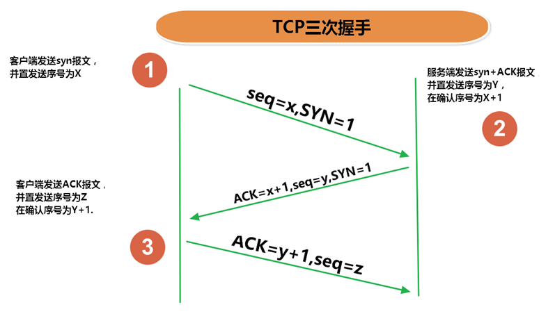

# java 网络编程

## 1 传输层协议

通信的协议还是比较复杂的，`java.net` 包中包含的类和接口，它们提供低层次的通信细节。我们可以直接使用这些类和接口，来专注于网络程序开发，而不用考虑通信的细节。

`java.net` 包中提供了两种常见的网络协议的支持：

- **UDP**：用户数据报协议(User Datagram Protocol)。
- **TCP**：传输控制协议 (Transmission Control Protocol)。

### 1.1 TCP 协议与 UDP 协议

**TCP协议：**

- TCP协议进行通信的两个应用进程：客户端、服务端。
- 使用TCP协议前，须先`建立TCP连接`，形成基于字节流的传输数据通道
- 传输前，采用“三次握手”方式，点对点通信，是`可靠的`
  - TCP协议使用`重发机制`，当一个通信实体发送一个消息给另一个通信实体后，需要收到另一个通信实体确认信息，如果没有收到另一个通信实体确认信息，则会再次重复刚才发送的消息。
- 在连接中可进行`大数据量的传输`
- 传输完毕，需`释放已建立的连接，效率低`

**UDP协议：**

- UDP协议进行通信的两个应用进程：发送端、接收端。
- 将数据、源、目的封装成数据包（传输的基本单位），`不需要建立连接`
- 发送不管对方是否准备好，接收方收到也不确认，不能保证数据的完整性，故是`不可靠的`
- 每个数据报的大小限制在`64K`内
- 发送数据结束时`无需释放资源，开销小，通信效率高`
- 适用场景：音频、视频和普通数据的传输。例如视频会议

### 1.2 三次握手

TCP协议中，在发送数据的准备阶段，客户端与服务器之间进行三次交互，以保证连接的可靠。

- 第一次握手，客户端向服务器端发起TCP连接的请求
- 第二次握手，服务器端发送针对客户端TCP连接请求的确认
- 第三次握手，客户端发送确认的确认

> 1、客户端会随机一个初始序列号seq=x，设置SYN=1 ，表示这是SYN握手报文。然后就可以把这个 SYN 报文发送给服务端了，表示向服务端发起连接，之后客户端处于`同步已发送`状态。
>
> 2、服务端收到客户端的 SYN 报文后，也随机一个初始序列号(seq=y)，设置ack=x+1，表示收到了客户端的x之前的数据，希望客户端下次发送的数据从x+1开始。
> 设置 SYN=1 和 ACK=1。表示这是一个SYN握手和ACK确认应答报文。最后把该报文发给客户端，该报文也不包含应用层数据，之后服务端处于`同步已接收`状态。
>
> 3、客户端收到服务端报文后，还要向服务端回应最后一个应答报文，将ACK置为 1 ，表示这是一个应答报文
> ack=y+1 ，表示收到了服务器的y之前的数据，希望服务器下次发送的数据从y+1开始。
> 最后把报文发送给服务端，这次报文可以携带数据，之后客户端处于 连接已建立 状态。服务器收到客户端的应答报文后，也进入`连接已建立`状态。

完成三次握手，连接建立后，客户端和服务器就可以开始进行数据传输了。由于这种面向连接的特性，TCP协议可以保证传输数据的安全，所以应用十分广泛，例如下载文件、浏览网页等。

### 1.3 四次挥手

- 第一次挥手：客户端向服务器端提出结束连接，`让服务器做最后的准备工作`。此时，客户端处于半关闭状态，即表示不再向服务器发送数据了，但是还可以接受数据。
- 第二次挥手：服务器接收到客户端释放连接的请求后，`会将最后的数据发给客户端`。并告知上层的应用进程不再接收数据。
- 第三次挥手：服务器发送完数据后，会给客户端`发送一个释放连接的报文`。那么客户端接收后就知道可以正式释放连接了。
- 第四次挥手：客户端接收到服务器最后的释放连接报文后，要`回复一个彻底断开的报文`。这样服务器收到后才会彻底释放连接。这里客户端，发送完最后的报文后，会等待2MSL，因为有可能服务器没有收到最后的报文，那么服务器迟迟没收到，就会再次给客户端发送释放连接的报文，此时客户端在等待时间范围内接收到，会重新发送最后的报文，并重新计时。如果等待2MSL后，没有收到，那么彻底断开。

> 1、客户端打算断开连接，向服务器发送FIN报文(FIN标记位被设置为1，1表示为FIN，0表示不是)，FIN报文中会指定一个序列号，之后客户端进入FIN_WAIT_1状态。也就是客户端发出连接释放报文段(FIN报文)，指定序列号seq = u，主动关闭TCP连接，等待服务器的确认。
>
> 2、服务器收到连接释放报文段(FIN报文)后，就向客户端发送ACK应答报文，以客户端的FIN报文的序列号 seq+1 作为ACK应答报文段的确认序列号ack = seq+1 = u + 1。接着服务器进入CLOSE_WAIT(等待关闭)状态，此时的TCP处于半关闭状态(下面会说什么是半关闭状态)，客户端到服务器的连接释放。客户端收到来自服务器的ACK应答报文段后，进入FIN_WAIT_2状态。
>
> 3、服务器也打算断开连接，向客户端发送连接释放(FIN)报文段，之后服务器进入LASK_ACK(最后确认)状态，等待客户端的确认。服务器的连接释放(FIN)报文段的FIN=1，ACK=1，序列号seq=m，确认序列号ack=u+1。
>
> 4、客户端收到来自服务器的连接释放(FIN)报文段后，会向服务器发送一个ACK应答报文段，以连接释放(FIN)报文段的确认序号 ack 作为ACK应答报文段的序列号 seq，以连接释放(FIN)报文段的序列号 seq+1作为确认序号ack。
>
> 之后客户端进入TIME_WAIT(时间等待)状态，服务器收到ACK应答报文段后，服务器就进入CLOSE(关闭)状态，到此服务器的连接已经完成关闭。客户端处于TIME_WAIT状态时，此时的TCP还未释放掉，需要等待2MSL后，客户端才进入CLOSE状态。

## 2 网络编程 API

### 2.1 InetAddress 类

InetAddress 类主要表示IP地址，两个子类：Inet4Address、Inet6Address。

InetAddress 类没有提供公共的构造器，而是提供了如下几个静态方法来获取InetAddress 实例。

- public static InetAddress getLocalHost()
- public static InetAddress getByName(String host)
- public static InetAddress getByAddress(byte[] addr)

InetAddress 提供了如下几个常用的方法

- public String getHostAddress() ：返回 IP 地址字符串（以文本表现形式）
- public String getHostName() ：获取此 IP 地址的主机名
- public boolean isReachable(int timeout)：测试是否可以达到该地址

### 2.2 Socket 类

网络上具有唯一标识的IP地址和端口号组合在一起，构成唯一能标识的标识符套接字 (Socket)。

利用套接字(Socket)开发网络应用程序早已被广泛的采用，以至于成为事实上的标准。网络通信其实就是Socket间的通信。

通信的两端都要有Socket，是两台机器间通信的端点。

Socket允许程序把网络连接当成一个流，数据在两个Socket间通过IO传输。

一般主动发起通信的应用程序属客户端，等待通信请求的为服务端。

Socket分类：

- 流套接字（io socket）：使用TCP提供可依赖的字节流服务
  - ServerSocket：此类实现 TCP 服务器套接字。服务器套接字等待请求通过网络传入。
  - Socket：此类实现客户端套接字（也可以就叫“套接字”）。套接字是两台机器间通信的端点。
- 数据报套接字（datagram socket）：使用 UDP 提供“尽力而为”的数据报服务
  - DatagramSocket：此类表示用来发送和接收 UDP 数据报包的套接字。

### 2.3 Socket 相关类 API

#### 2.3.1 ServerSocket 类

**ServerSocket类的构造方法：**

- ServerSocket(int port)

  创建绑定到特定端口的服务器套接字。

**ServerSocket类的常用方法：**

- Socket accept()

  侦听并接受到此套接字的连接。

#### 2.3.2 Socket类

**Socket类的常用构造方法**：

- public Socket(InetAddress address,int port)

  创建一个流套接字并将其连接到指定 IP 地址的指定端口号。

- public Socket(String host,int port)

  创建一个流套接字并将其连接到指定主机上的指定端口号。

**Socket类的常用方法**：

- public InputStream getInputStream()

  返回此套接字的输入流，可以用于接收消息

- public OutputStream getOutputStream()

  返回此套接字的输出流，可以用于发送消息

- public InetAddress getInetAddress()

  此套接字连接到的远程 IP 地址；如果套接字是未连接的，则返回 null。

- public InetAddress getLocalAddress()

  获取套接字绑定的本地地址。

- public int getPort()

  此套接字连接到的远程端口号；如果尚未连接套接字，则返回 0。

- public int getLocalPort()

- 返回此套接字绑定到的本地端口。如果尚未绑定套接字，则返回 -1。

- public void close()

  关闭此套接字。套接字被关闭后，便不可在以后的网络连接中使用（即无法重新连接或重新绑定）。需要创建新的套接字对象。 关闭此套接字也将会关闭该套接字的 InputStream 和 OutputStream。

- public void shutdownInput()

  如果在套接字上调用 shutdownInput() 后从套接字输入流读取内容，则流将返回 EOF（文件结束符）。 即不能在从此套接字的输入流中接收任何数据。

- public void shutdownOutput()

  禁用此套接字的输出流。对于 TCP 套接字，任何以前写入的数据都将被发送，并且后跟 TCP 的正常连接终止序列。 如果在套接字上调用 shutdownOutput() 后写入套接字输出流，则该流将抛出 IOException。 即不能通过此套接字的输出流发送任何数据。

**注意：**

先后调用Socket的shutdownInput()和shutdownOutput()方法，仅仅关闭了输入流和输出流，并不等于调用Socket的close()方法。在通信结束后，仍然要调用Scoket的close()方法，因为只有该方法才会释放Socket占用的资源，比如占用的本地端口号等。

#### 2.3.3 DatagramSocket 类

**DatagramSocket 类的常用方法：**

- public DatagramSocket(int port):

  创建数据报套接字并将其绑定到本地主机上的指定端口。套接字将被绑定到通配符地址，IP 地址由内核来选择。

- public DatagramSocket(int port, InetAddress laddr)

  创建数据报套接字，将其绑定到指定的本地地址。本地端口必须在 0 到 65535 之间（包括两者）。如果 IP 地址为 0.0.0.0，套接字将被绑定到通配符地址，IP 地址由内核选择。

- public void close()

  关闭此数据报套接字。

- public void send(DatagramPacket p)

  从此套接字发送数据报包。DatagramPacket 包含的信息指示：将要发送的数据、其长度、远程主机的 IP 地址和远程主机的端口号。

- public void receive(DatagramPacket p)

  从此套接字接收数据报包。当此方法返回时，DatagramPacket 的缓冲区填充了接收的数据。数据报包也包含发送方的 IP 地址和发送方机器上的端口号。 此方法在接收到数据报前一直阻塞。数据报包对象的 length 字段包含所接收信息的长度。如果信息比包的长度长，该信息将被截短。

- public InetAddress getLocalAddress()

  获取套接字绑定的本地地址。

- public int getLocalPort()

  返回此套接字绑定的本地主机上的端口号。

- public InetAddress getInetAddress()

  返回此套接字连接的地址。如果套接字未连接，则返回 null。

- public int getPort()

  返回此套接字的端口。如果套接字未连接，则返回 -1。

#### 2.3.4 DatagramPacket 类

**DatagramPacket 类的常用方法：**

- public DatagramPacket(byte[] buf, int length)

  构造 DatagramPacket，用来接收长度为 length 的数据包。length 参数必须小于等于 buf.length。

- public DatagramPacket(byte[] buf,int length, InetAddress address, int port)

  构造数据报包，用来将长度为 length 的包发送到指定主机上的指定端口号。length 参数必须小于等于 buf.length。

- public InetAddress getAddress()

  返回某台机器的 IP 地址，此数据报将要发往该机器或者是从该机器接收到的。

- public int getPort()

  返回某台远程主机的端口号，此数据报将要发往该主机或者是从该主机接收到的。

- public byte[] getData()

  返回数据缓冲区。接收到的或将要发送的数据从缓冲区中的偏移量 offset 处开始，持续 length 长度。

- public int getLength()

  返回将要发送或接收到的数据的长度。

## 3 TCP网络编程

### 3.1 通信模型

Java语言的基于套接字TCP编程分为服务端编程和客户端编程，其通信模型如图所示：

### 3.2 开发步骤

**客户端程序包含以下四个基本的步骤**

- 创建 Socket：根据指定服务端的 IP 地址或端口号构造 Socket 类对象。若服务器端响应，则建立客户端到服务器的通信线路。若连接失败，会出现异常。
- 打开连接到 Socket 的输入/出流： 使用 getInputStream() 方法获得输入流，使用 getOutputStream() 方法获得输出流，进行数据传输。
- 按照一定的协议对 Socket 进行读/写操作：通过输入流读取服务器放入线路的信息（但不能读取自己放入线路的信息），通过输出流将信息写入线路。
- 关闭 Socket：断开客户端到服务器的连接，释放线路。

**服务器端程序包含以下四个基本的步骤**

- 调用 ServerSocket(int port)：创建一个服务器端套接字，并绑定到指定端口上。用于监听客户端的请求。
- 调用 accept()：监听连接请求，如果客户端请求连接，则接受连接，返回通信套接字对象。
- 调用该 Socket 类对象的 getOutputStream() 和 getInputStream() 获取输出流和输入流，开始网络数据的发送和接收。
- 关闭 Socket 对象：客户端访问结束，关闭通信套接字。

**多个客户端与服务器之间的多次通信：**

通常情况下，服务器不应该只接受一个客户端请求，而应该不断地接受来自客户端的所有请求，所以Java程序通常会通过循环，不断地调用 ServerSocket 的 accept() 方法。

如果服务器端要“同时”处理多个客户端的请求，因此服务器端需要为**每一个客户端单独分配一个线程**来处理，否则无法实现“同时”。

咱们之前学习IO流的时候，提到过装饰者设计模式，该设计使得不管底层IO流是怎样的节点流：文件流也好，网络Socket产生的流也好，程序都可以将其包装成处理流，甚至可以多层包装，从而提供更多方便的处理。

## 4 UDP网络编程

UDP(User Datagram Protocol，用户数据报协议)：是一个无连接的传输层协议、提供面向事务的简单不可靠的信息传送服务，类似于短信。

### 4.1 通信模型

UDP协议是一种**面向非连接**的协议，面向非连接指的是在正式通信前不必与对方先建立连接，不管对方状态就直接发送，至于对方是否可以接收到这些数据内容，UDP协议无法控制，因此说，UDP协议是一种**不可靠的**协议。无连接的好处就是快，省内存空间和流量，因为维护连接需要创建大量的数据结构。UDP会尽最大努力交付数据，但不保证可靠交付，没有TCP的确认机制、重传机制，如果因为网络原因没有传送到对端，UDP也不会给应用层返回错误信息。

UDP协议是面向数据报文的信息传送服务。UDP在发送端没有缓冲区，对于应用层交付下来的报文在添加了首部之后就直接交付于ip层，不会进行合并，也不会进行拆分，而是一次交付一个完整的报文。比如我们要发送100个字节的报文，我们调用一次send()方法就会发送100字节，接收方也需要用receive()方法一次性接收100字节，不能使用循环每次获取10个字节，获取十次这样的做法。

UDP协议没有拥塞控制，所以当网络出现的拥塞不会导致主机发送数据的速率降低。虽然UDP的接收端有缓冲区，但是这个缓冲区只负责接收，并不会保证UDP报文的到达顺序是否和发送的顺序一致。因为网络传输的时候，由于网络拥塞的存在是很大的可能导致先发的报文比后发的报文晚到达。如果此时缓冲区满了，后面到达的报文将直接被丢弃。这个对实时应用来说很重要，比如：视频通话、直播等应用。

因此UDP适用于一次只传送少量数据、对可靠性要求不高的应用环境，数据报大小限制在64K以下。

DatagramSocket 类和 DatagramPacket 类实现了基于 UDP 协议网络程序。

UDP数据报通过数据报套接字 DatagramSocket 发送和接收，系统不保证UDP数据报一定能够安全送到目的地，也不能确定什么时候可以抵达。

DatagramPacket 对象封装了UDP数据报，在数据报中包含了发送端的IP地址和端口号以及接收端的IP地址和端口号。

UDP协议中每个数据报都给出了完整的地址信息，因此无须建立发送方和接收方的连接。如同发快递包裹一样。

### 4.2 开发步骤

**发送端程序包含以下四个基本的步骤：**

- 创建 DatagramSocket：默认使用系统随机分配端口号。
- 创建 DatagramPacket：将要发送的数据用字节数组表示，并指定要发送的数据长度，接收方的IP地址和端口号。
- 调用该 DatagramSocket 类对象的 send 方法：发送数据报 DatagramPacket 对象。
- 关闭 DatagramSocket 对象：发送端程序结束，关闭通信套接字。

**接收端程序包含以下四个基本的步骤 ：**

- 创建 DatagramSocket：指定监听的端口号。
- 创建 DatagramPacket：指定接收数据用的字节数组，起到临时数据缓冲区的效果，并指定最大可以接收的数据长度。
- 调用该 DatagramSocket 类对象的 receive 方法：接收数据报 DatagramPacket 对象。
- 关闭 DatagramSocket：接收端程序结束，关闭通信套接字。

### 4.3 演示发送和接收消息

基于UDP协议的网络编程仍然需要在通信实例的两端各建立一个Socket，但这两个Socket之间并没有虚拟链路，这两个Socket只是发送、接收数据报的对象，Java提供了DatagramSocket对象作为基于UDP协议的Socket，使用DatagramPacket代表DatagramSocket发送、接收的数据报。

## 5 URL编程

### 5.1 URL类

`URL(Uniform Resource Locator)`：统一资源定位符，它表示 Internet 上某一资源的地址。

通过 URL 我们可以访问 `Internet` 上的各种网络资源，比如最常见的 www，ftp 站点。浏览器通过解析给定的 URL 可以在网络上查找相应的文件或其他资源。

URL的基本结构由5部分组成：

> <传输协议>://<主机名>:<端口号>/<文件名>#片段名?参数列表

为了表示URL，`java.net` 中实现了类 URL。我们可以通过下面的构造器来初始化一个 URL 对象：

- `public URL (String spec)`：通过一个表示URL地址的字符串可以构造一个URL对象。例如：
- `public URL(URL context, String spec)`：通过基 URL 和相对 URL 构造一个 URL 对象。例如：
- `public URL(String protocol, String host, String file)`
- `public URL(String protocol, String host, int port, String file)`

### 5.2 URL类常用方法

一个URL对象生成后，其属性是不能被改变的，但可以通过它给定的方法来获取这些属性：

一个URL对象生成后，其属性是不能被改变的，但可以通过它给定的方法来获取这些属性：

- public String getProtocol()   获取该URL的协议名

- public String getHost()      获取该URL的主机名

- public String getPort()      获取该URL的端口号

- public String getPath()      获取该URL的文件路径

- public String getFile()       获取该URL的文件名

- public String getQuery()    获取该URL的查询名

### 5.3 针对 HTTP 协议的 URLConnection 类

- URL的方法 openStream()：能从网络上读取数据
- 若希望输出数据，例如向服务器端的 CGI（公共网关接口-Common Gateway Interface-的简称，是用户浏览器和服务器端的应用程序进行连接的接口）程序发送一些数据，则必须先与URL建立连接，然后才能对其进行读写，此时需要使用 URLConnection 。
- URLConnection：表示到URL所引用的远程对象的连接。当与一个URL建立连接时，首先要在一个 URL 对象上通过方法 openConnection() 生成对应的 URLConnection 对象。如果连接过程失败，将产生IOException.
  - URL netchinaren = new URL ("<http://www.atguigu.com/index.shtml>");
  - URLConnectonn u = netchinaren.openConnection( );

- 通过URLConnection对象获取的输入流和输出流，即可以与现有的CGI程序进行交互。
  - public Object getContent( ) throws IOException

  - public int getContentLength( )
  - public String getContentType( )
  - public long getDate( )
  - public long getLastModified( )
  - **public InputStream getInputStream ( ) throws IOException**
  - public OutputSteram getOutputStream( )throws IOException

### 5.4 小结

- 位于网络中的计算机具有唯一的IP地址，这样不同的主机可以互相区分。

- 客户端－服务器是一种最常见的网络应用程序模型。服务器是一个为其客户端提供某种特定服务的硬件或软件。客户机是一个用户应用程序，用于访问某台服务器提供的服务。端口号是对一个服务的访问场所，它用于区分同一物理计算机上的多个服务。套接字用于连接客户端和服务器，客户端和服务器之间的每个通信会话使用一个不同的套接字。TCP协议用于实现面向连接的会话。

- Java 中有关网络方面的功能都定义在 java.net 程序包中。Java 用 InetAddress 对象表示 IP 地址，该对象里有两个字段：主机名(String) 和 IP 地址(int)。

- 类 Socket 和 ServerSocket 实现了基于TCP协议的客户端－服务器程序。Socket是客户端和服务器之间的一个连接，连接创建的细节被隐藏了。这个连接提供了一个安全的数据传输通道，这是因为 TCP 协议可以解决数据在传送过程中的丢失、损坏、重复、乱序以及网络拥挤等问题，它保证数据可靠的传送。

- 类 URL 和 URLConnection 提供了最高级网络应用。URL 的网络资源的位置来同一表示 Internet 上各种网络资源。通过URL对象可以创建当前应用程序和 URL 表示的网络资源之间的连接，这样当前程序就可以读取网络资源数据，或者把自己的数据传送到网络上去。

# 相关问题

## TCP

### TCP协议和UDP协议的区别

### TCP三次握手和四次挥手
