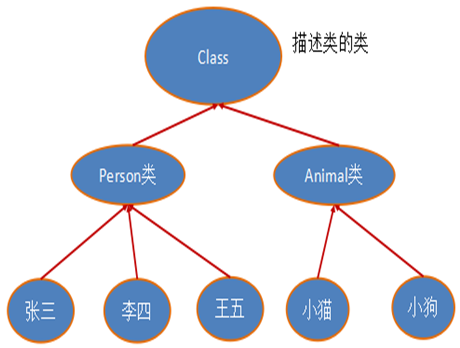
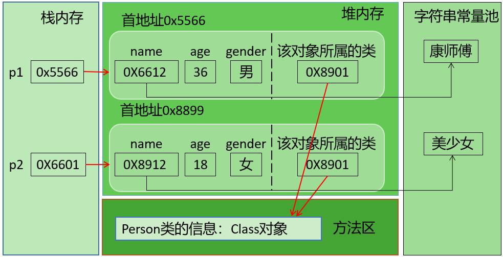
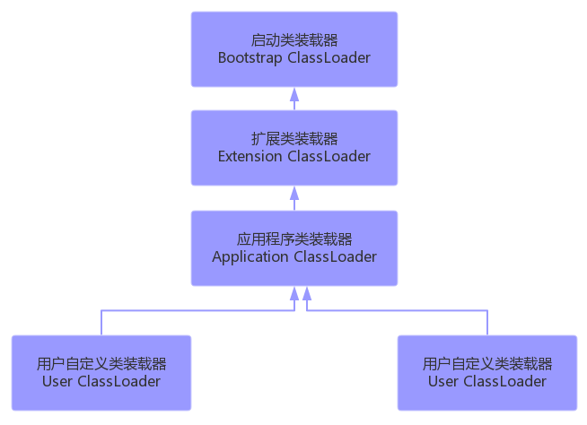

# java 反射

## 1 反射(Reflection)的概念

### 1.1 反射的出现背景

Java程序中，所有的对象都有两种类型：`编译时类型`和`运行时类型`，而很多时候对象的编译时类型和运行时类型`不一致`。

例如：某些变量或形参的声明类型是Object类型，但是程序却需要调用该对象运行时类型的方法，该方法不是Object中的方法，那么如何解决呢？

> Object obj = new String("hello");
>
> obj.getClass()

解决这个问题，有两种方案：

方案1：在编译和运行时都完全知道类型的具体信息，在这种情况下，我们可以直接先使用`instanceof`运算符进行判断，再利用强制类型转换符将其转换成运行时类型的变量即可。

方案2：编译时根本无法预知该对象和类的真实信息，程序只能依靠`运行时信息`来发现该对象和类的真实信息，这就必须使用反射。

### 1.2 反射概述

Reflection（反射）是被视为`动态语言`的关键，反射机制允许程序在`运行期间`借助于 Reflection API 取得任何类的内部信息，并能直接操作任意对象的内部属性及方法。

加载完类之后，在堆内存的方法区中就产生了一个Class类型的对象（一个类只有一个Class对象），这个对象就包含了完整的类的结构信息。我们可以通过这个对象看到类的结构。`这个对象就像一面镜子，透过这个镜子看到类的结构，所以，我们形象的称之为：反射。`


**从内存加载上看反射：**


### 1.3  Java反射机制研究及应用

Java反射机制提供的功能：

- 在运行时判断任意一个对象所属的类
- 在运行时构造任意类的对象
- 在运行时判断任意一个类所具有的成员变量和方法
- 在运行时获取泛型信息
- 在运行时调用任意一个对象的成员变量和方法
- 在运行时处理注解
- 生成动态代理

### 1.4 反射相关的主要API

java.lang.Class：代表一个类
java.lang.reflect.Method：代表类的方法
java.lang.reflect.Field：代表类的成员变量
java.lang.reflect.Constructor：代表类的构造器

### 1.5 反射的优缺点

**优点：**

- 提高了Java程序的灵活性和扩展性，`降低了耦合性`，提高`自适应`能力
- 允许程序创建和控制任何类的对象，无需提前`硬编码`目标类

**缺点：**

- 反射的`性能较低`。
  - 反射机制主要应用在对灵活性和扩展性要求很高的系统框架上
- 反射会`模糊`程序内部逻辑，`可读性较差`

## 2 理解 Class 类并获取实例

想要解剖一个类，必须先要获取到该类的`class对象`。而剖析一个类或用反射解决具体的问题就是使用相关API:

- java.lang.Class
- java.lang.reflect.*

所以，Class对象是反射的根源。

### 2.1 Class 类

**从理论上理解**

在 Object 类中定义了以下的方法，此方法将被所有子类继承

```java
public final Class getClass()
```

该方法返回值的类型是一个 Class 类，此类是 Java 反射的源头，实际上所谓反射从程序的运行结果来看也很好理解，即：可以通过对象反射求出类的名称。



对象照镜子后可以得到的信息：某个类的属性、方法和构造器、某个类到底实现了哪些接口。

对于每个类而言，JRE 都为其保留一个不变的 Class 类型的对象。一个 Class 对象包含了特定某个结构(class/interface/enum/annotation/primitive type/void/[])的有关信息。

- Class 本身也是一个类
- Class 对象只能由系统建立对象
- 一个加载的类在 JVM 中只会有一个 Class 实例
- 一个 Class 对象对应的是一个加载到 JVM 中的一个 .class 文件
- 每个类的实例都会记得自己是由哪个 Class 实例所生成
- 通过 Class 可以完整地得到一个类中的所有被加载的结构
- Class 类是 Reflection 的根源，针对任何想动态加载、运行的类，唯有先获得相应的 Class 对象

**从内存结构上理解**



说明：上图中字符串常量池在JDK6中存储在方法区；JDK7及以后，存储在堆空间。

### 2.2 获取 Class 实例

**方式一：要求编译期间已知类型**

前提：

若已知具体的类，通过类的 class 属性获取，该方法最为安全可靠，程序性能最高

获取实例：

```java
Class clazz = String.class;
```

**方式二：获取对象的运行时类型**

前提：

已知某个类的实例，调用该实例的 getClass() 方式获取 Class 对象

获取实例：

```java
Class clazz = "Reflection".getClass();
```

**方式三：可以获取编译期间未知的类型**

前提：

已知一个类的全类名，且该类在类路径下，可通过 Class 类的静态方法 forName() 获取，可能抛出 ClassNotFoundException

获取实例：

```java
Class clazz = Class.forName("com.test.relection.Persion");
```

**方式四：其他**

前提：

可以用系统类加载对象或自定义加载器对象加载指定路径下的类型

获取实例：

```java
ClassLoader cl = this.getClass().getClassLoader();
Class clazz4 = cl.loadClass("类的全类名");
```

**注意：**

针对于核心源码的 api，内部的私有的结构在 jdk17 中就不可以通过反射调用了。

```java
Class clazz = Class.forName("java.lang.String");
```

### 2.3 哪些类型可以有Class对象

简言之，所有Java类型！

1. class：外部类，成员(成员内部类，静态内部类)，局部内部类，匿名内部类
2. interface：接口
3. []：数组
4. enum：枚举
5. annotation：注解@interface
6. primitive type：基本数据类型
7. void

### 2.4 Class类的常用方法

| **方法名**                                         | **功能说明**                                                 |
| -------------------------------------------------- | ------------------------------------------------------------ |
| static  Class forName(String  name)                | 返回指定类名  name  的  Class  对象                          |
| Object  newInstance()                              | 调用缺省构造函数，返回该Class对象的一个实例                  |
| getName()                                          | 返回此Class对象所表示的实体（类、接口、数组类、基本类型或void）名称 |
| Class  getSuperClass()                             | 返回当前Class对象的父类的Class对象                           |
| Class  [] getInterfaces()                          | 获取当前Class对象的接口                                      |
| ClassLoader  getClassLoader()                      | 返回该类的类加载器                                           |
| Class  getSuperclass()                             | 返回表示此Class所表示的实体的超类的Class                     |
| Constructor[]  getConstructors()                   | 返回一个包含某些Constructor对象的数组                        |
| Field[]  getDeclaredFields()                       | 返回Field对象的一个数组                                      |
| Method  getMethod(String  name,Class … paramTypes) | 返回一个Method对象，此对象的形参类型为paramType              |

## 3. 类的加载与加载器的理解

### 3.1 类的生命周期

类在内存中完整的生命周期：加载-->使用-->卸载。其中加载过程又分为：装载、链接、初始化三个阶段。


### 3.2 类的加载过程

当程序主动使用某个类时，如果该类还未被加载到内存中，系统会通过加载、链接、初始化三个步骤来对该类进行初始化。如果没有意外，JVM将会连续完成这三个步骤，所以有时也把这三个步骤统称为类加载。


类的加载又分为三个阶段：

1. 装载（Loading）

   将类的class文件读入内存，并为之创建一个java.lang.Class对象。此过程由类加载器完成。

2. 链接（Linking）
   1. 验证 (Verify)：确保加载的类信息符合JVM规范，例如：以cafebabe开头，没有安全方面的问题。
   2. 准备 (Prepare)：正式为类变量 (static) 分配内存并`设置类变量默认初始值`的阶段，这些内存都将在方法区中进行分配。
   3. 解析 (Resolve)：虚拟机常量池内的符号引用（常量名）替换为直接引用（地址）的过程。
3. 初始化（Initialization）
   1. 执行`类构造器 <clinit>() 方法`的过程。`类构造器 <clinit>() 方法`是由编译期自动收集类中所有类变量的赋值动作和静态代码块中的语句合并产生的。（类构造器是构造类信息的，不是构造该类对象的构造器）。
   2. 当初始化一个类的时候，如果发现其父类还没有进行初始化，则需要先触发其父类的初始化。
   3. 虚拟机会保证一个`类的<clinit>()方法`在多线程环境中被正确加锁和同步。

### 3.3 类加载器（classloader)


#### 3.3.1 类加载器的作用

将class文件字节码内容加载到内存中，并将这些静态数据转换成方法区的运行时数据结构，然后在堆中生成一个代表这个类的java.lang.Class对象，作为方法区中类数据的访问入口。

类缓存：标准的 JavaSE 类加载器可以按要求查找类，但一旦某个类被加载到类加载器中，它将维持加载（缓存）一段时间。不过 JVM 垃圾回收机制可以回收这些 Class 对象。

#### 3.3.2 类加载器的分类(JDK8为例)

JVM支持两种类型的类加载器，分别为`引导类加载器（Bootstrap ClassLoader）`和`自定义类加载器（User-Defined ClassLoader）`。

从概念上来讲，自定义类加载器一般指的是程序中由开发人员自定义的一类类加载器，但是Java虚拟机规范却没有这么定义，而是将所有派生于抽象类ClassLoader的类加载器都划分为自定义类加载器。无论类加载器的类型如何划分，在程序中我们最常见的类加载器结构主要是如下情况：



1. 启动类加载器（引导类加载器，Bootstrap ClassLoader）
   - 这个类加载使用`C/C++语言`实现的，嵌套在 JVM 内部。获取它的对象时往往返回 null
   - 它用来加载 Java 的核心库（JAVA_HOME/jre/lib/rt.jar 或sun.boot.class.path 路径下的内容），用于提供 JVM 自身需要的类
   - 并不继承自 java.lang.ClassLoader，没有父加载器
   - 出于安全考虑，Bootstrap 启动类加载器只加载包名为 java、javax、sun等开头的类
   - 加载扩展类和应用程序类加载器，并指定为他们的父类加载器
2. 扩展类加载器（Extension ClassLoader）
   - Java 语言编写，由 sun.misc.Launcher$ExtClassLoader 实现
   - 继承于 ClassLoader 类
   - 父类加载器为启动类加载器
   - 从 java.ext.dirs 系统属性所指定的目录中加载类库，或从 JDK 的安装目录的 jre/lib/ext 子目录下加载类库。如果用户创建的 JAR 放在此目录下，也会自动由扩展类加载器加载
3. 应用程序类加载器（系统类加载器，AppClassLoader）
   - Java 语言编写，由 sun.misc.Launcher$AppClassLoader 实现
   - 继承于 ClassLoader 类
   - 父类加载器为扩展类加载器
   - 它负责加载环境变量 classpath 或系统属性 java.class.path 指定路径下的类库
   - 应用程序中的类加载器默认是系统类加载器
   - 它是用户自定义类加载器的默认父加载器
   - 通过 ClassLoader 的 getSystemClassLoader() 方法可以获取到该类加载器
4. 用户自定义类加载器（了解）
   - 在 Java 的日常应用程序开发中，类的加载几乎是由上述3种类加载器相互配合执行的。在必要时，我们还可以自定义类加载器，来定制类的加载方式。
   - 体现 Java 语言强大生命力和巨大魅力的关键因素之一便是，Java 开发者可以自定义类加载器来实现类库的动态加载，加载源可以是本地的 JAR 包，也可以是网络上的远程资源。
   - 同时，自定义加载器能够实现`应用隔离`，例如 Tomcat，Spring 等中间件和组件框架都在内部实现了自定义的加载器，并通过自定义加载器隔离不同的组件模块。这种机制比 C/C++ 程序要好太多，想不修改 C/C++ 程序就能为其新增功能，几乎是不可能的，仅仅一个兼容性便能阻挡住所有美好的设想。
   - 自定义类加载器通常需要继承于ClassLoader。

#### 3.3.3 查看某个类的类加载器对象

1. 获取默认的系统类加载器

   ```java
   ClassLoader classloader = ClassLoader.getSystemClassLoader();
   ```

2. 查看某个类是哪个类加载器加载的

   ```java
   ClassLoader classloader = Class.forName("common.Employee").getClassLoader();
   
   // 如果是根加载器加载的类，则会得到null
   ClassLoader classloader1 = Class.forName("java.lang.Object").getClassLoader();
   ```

3. 获取某个类加载器的父加载器

   ```java
   ClassLoader parentClassloader = classloader.getParent();
   ```

#### 3.3.4 使用 ClassLoader 获取流

关于类加载器的一个主要方法：getResourceAsStream(String str): 获取类路径下的指定文件的输入流

```java
InputStream in = null;
in = this.getClass().getClassLoader().getResourceAsStream("exer2\\test.properties");
System.out.println(in);
```

## 4 反射的基本应用

### 4.1 创建运行时类的对象

这是反射机制应用最多的地方。

创建运行时类的对象有两种方式：

1. 直接调用 Class 对象的 newInstance() 方法

   1. 获取该类型的 Class 对象
   2. 调用 Class 对象的 newInstance() 方法创建对象

   要求：类必须有一个无参数的构造器；类的构造器的访问权限需要足够。

2. 通过获取构造器对象来进行实例化

   1. 获取该类型的 Class 对象
   2. 通过 Class 类的 getDeclaredConstructor(Class … parameterTypes) 取得本类的指定形参类型的构造器
   3. 向构造器的形参中传递一个对象数组进去，里面包含了构造器中所需的各个参数
   4. 通过 Constructor 实例化对象

```java
public class ApiApplyTest {
   /**
     * 调用 Class 对象的 newInstance() 方法
     */
    @Test
    public void test2() throws InstantiationException, IllegalAccessException, NoSuchFieldException, NoSuchMethodException, InvocationTargetException {

        Class<Employee> employeeClass = Employee.class;
        Employee employeeDeprecated  = employeeClass.newInstance();
        System.out.println(employeeDeprecated);
    }
  
   /**
     * 通过获取构造器对象来进行实例化
     */
    @Test
    public void test3() throws NoSuchMethodException, InvocationTargetException, InstantiationException, IllegalAccessException, NoSuchFieldException {

        Class<Employee> employeeClass = Employee.class;
        Constructor<Employee> declaredConstructor = employeeClass.getDeclaredConstructor(int.class, String.class);
        declaredConstructor.setAccessible(true);
        Employee employee = declaredConstructor.newInstance(1, "ref");
        System.out.println(employee);
    }
}
```

### 4.2 获取运行时类的完整结构

可以获取：包、修饰符、类型名、父类（包括泛型父类）、父接口（包括泛型父接口）、成员（属性、构造器、方法）、注解（类上的、方法上的、属性上的）。

**相关 API**

```java
// class 类
// 实现的全部接口, 确定此对象所表示的类或接口实现的接口
public Class<?>[] getInterfaces()   
// 所继承的父类，返回表示此 Class 所表示的实体（类、接口、基本类型）的父类的 Class
public Class<? Super T> getSuperclass()
// 返回此 Class 对象所表示的类的所有 public 构造方法
public Constructor<T>[] getConstructors()
// 返回此 Class 对象表示的类声明的所有构造方法
public Constructor<T>[] getDeclaredConstructors()
// 返回此 Class 对象所表示的类或接口的 public 的方法
public Method[] getMethods()  
// 返回此 Class 对象所表示的类或接口的全部方法
public Method[] getDeclaredMethods()
// 返回此 Class 对象所表示的类或接口的 public 的 Field
public Field[] getFields() 
// 返回此 Class 对象所表示的类或接口的全部 Field
public Field[] getDeclaredFields() 
// Annotation
public getAnnotation(Class<T> annotationClass)
public getDeclaredAnnotations(Class<T> annotationClass)
// 获取父类泛型类型：
public Type getGenericSuperclass()
// 获取类所在的包
public Package getPackage() 

// Constructor 类
// 取得修饰符
public int getModifiers();
// 取得方法名称:
public String getName();
// 取得参数的类型
public Class<?>[] getParameterTypes();

// Field 类
// 以整数形式返回此 Field 的修饰符
public int getModifiers()
// 返回 Field 的属性类型
public Class<?> getType()  
// 返回 Field 的名称
public String getName()  

// Method 类
// 取得全部的返回值
public Class<?> getReturnType()
// 取得全部的参数
public Class<?>[] getParameterTypes()
// 以整数形式返回此 Method 的修饰符
public int getModifiers()
// 取得异常信息
public Class<?>[] getExceptionTypes()

// ParameterizedType 类，泛型类型
// 获取实际的泛型类型参数数组
Type[] getActualTypeArguments();
```

> 权限修饰符
> PUBLIC      = 0x00000001;  1     1
> PRIVATE     = 0x00000002;  2  10
> PROTECTED   = 0x00000004;  4  100
> STATIC   = 0x00000008;  8  1000
> FINAL    = 0x00000010;  16    10000

### 4.3 调用运行时类的指定结构

在反射机制中，可以直接通过 Field 类操作类中的属性，通过 Field 类提供的 set() 和 get() 方法就可以完成设置和取得属性内容的操作。

在反射机制中，可以直接通过 Method 类操作类中的方法，通过 Method 类提供的 invoke() 方法就可以完成对类中方法的条用。

setAccessible 参数值为 true 则指示反射的对象在使用时应该取消 Java 语言访问检查

```java
public class ApiApplyTest {
   @Test
    public void test3() throws NoSuchMethodException, InvocationTargetException, InstantiationException, IllegalAccessException, NoSuchFieldException {

        // 1. 获取实例，调用私有构造器
        Class<Employee> employeeClass = Employee.class;
        Constructor<Employee> declaredConstructor = employeeClass.getDeclaredConstructor(int.class, String.class);
        declaredConstructor.setAccessible(true);
        Employee employee = declaredConstructor.newInstance(1, "ref");
        System.out.println(employee);

        // 2. 调用私有属性
        Field nameField = employeeClass.getDeclaredField("name");
        nameField.setAccessible(true);
        nameField.set(employee, "reflect");
        System.out.println(nameField.get(employee));

        // 3. 调用私有方法
        Method priMethod = employeeClass.getDeclaredMethod("priMethod", String.class);
        priMethod.setAccessible(true);
        priMethod.invoke(employee, "reflection");
        System.out.println(employee);

        // 3.1. 静态方法
        Method staMethod = employeeClass.getDeclaredMethod("staMethod", String.class);
        staMethod.setAccessible(true);
        staMethod.invoke(null, "reflection");
        System.out.println(employee);
    }
}
```

### 4.4 读取注解信息

一个完整的注解包含三个部分：声明，使用，读取。

自定义注解

- 自定义注解可以通过四个元注解@Retention,@Target，@Inherited,@Documented，分别说明它的声明周期，使用位置，是否被继承，是否被生成到API文档中。
- Annotation 的成员在 Annotation 定义中以无参数有返回值的抽象方法的形式来声明，我们又称为配置参数。返回值类型只能是八种基本数据类型、String类型、Class类型、enum类型、Annotation类型、以上所有类型的数组。
- 可以使用 default 关键字为抽象方法指定默认返回值。
- 如果定义的注解含有抽象方法，那么使用时必须指定返回值，除非它有默认值。格式是“方法名 = 返回值”，如果只有一个抽象方法需要赋值，且方法名为value，可以省略“value=”，所以如果注解只有一个抽象方法成员，建议使用方法名value。
- 自定义注解必须配上注解的信息处理流程才有意义。
- 自定义注解只能使用反射的代码读取，所以自定义注解的声明周期必须是RetentionPolicy.RUNTIME。

```java
public class ApiApplyTest {
   /**
     * 获取注解信息及应用
     */
    @Test
    public void test5() {

        // 获取类注解信息
        Class<Employee> employeeClass = Employee.class;
        TableTest annotation = employeeClass.getAnnotation(TableTest.class);
        String tableName = "";
        if (annotation != null) {
            tableName = annotation.value();
        }
        System.out.println(tableName);

        Field[] declaredFields = employeeClass.getDeclaredFields();
        String[] columns = new String[declaredFields.length];
        int index = 0;
        for (Field declaredField : declaredFields) {
            ColumnTest columnTest = declaredField.getAnnotation(ColumnTest.class);
            if (columnTest != null) {
                columns[index++] = columnTest.columnName();
            }
        }

        String sql = "select ";
        for (int i = 0; i < index; i++) {
            sql += columns[i];
            if (i < index - 1) {
                sql += ",";
            }
        }
        sql += " from " + tableName;
        System.out.println("sql = " + sql);
    }
}
```

## 5 体会反射的动态性

```java
public class DynamicApplyTest {

    /**
     * 动态获取实例
     */
    @Test
    public void test1() throws ClassNotFoundException, InvocationTargetException, NoSuchMethodException, InstantiationException, IllegalAccessException {
        Employee employee = getInstanceTest("common.Employee");
        System.out.println(employee);
    }

    public <T> T getInstanceTest(String className) throws ClassNotFoundException, NoSuchMethodException, InvocationTargetException, InstantiationException, IllegalAccessException {
        Class<?> clazz = Class.forName(className);
        Constructor<?> declaredConstructor = clazz.getDeclaredConstructor();
        declaredConstructor.setAccessible(true);
        return (T) declaredConstructor.newInstance();
    }

    /**
     * 动态调用方法
     */
    @Test
    public void test2() throws ClassNotFoundException, InvocationTargetException, NoSuchMethodException, InstantiationException, IllegalAccessException {
        String info = (String) invoke("common.Employee", "showSomething");
        System.out.println("返回值为：" + info);
    }

    public Object invoke(String className, String methodName) throws ClassNotFoundException, NoSuchMethodException, InvocationTargetException, InstantiationException, IllegalAccessException {
        Class<?> clazz = Class.forName(className);
        Constructor<?> constructor = clazz.getDeclaredConstructor();
        constructor.setAccessible(true);
        Object obj = constructor.newInstance();

        Method method = clazz.getDeclaredMethod(methodName);
        method.setAccessible(true);
        return method.invoke(obj);
    }

    /**
     * 通过配置文件，实现不同功能
     */
    @Test
    public void test3() throws IOException, ClassNotFoundException, InvocationTargetException, InstantiationException, IllegalAccessException, NoSuchMethodException {

        // 1 通过配置文件获取配置信息
        Properties properties = new Properties();
        InputStream resourceAsStream = ClassLoader.getSystemClassLoader().getResourceAsStream("config.properties");
        properties.load(resourceAsStream);
        String fruitName = properties.getProperty("fruitName");

        // 2 通过配置信息加载对应的类
        Class<?> clazz = Class.forName(fruitName);
        Constructor<?> constructor = clazz.getDeclaredConstructor();
        Fruit fruit = (Fruit) constructor.newInstance();

        // 3 调用类中的目标方法
        Juicer juicer = new Juicer();
        juicer.run(fruit);
    }
}
```
