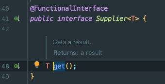

# java 新版本特性

## 1 Java8 新特征

Java 8 (又称为 JDK 8或JDK1.8) 是 Java 语言开发的一个主要版本。 Java 8 是oracle公司于2014年3月发布，可以看成是自Java 5 以来最具革命性的版本。Java 8为Java语言、编译器、类库、开发工具与JVM带来了大量新特性。

- 速度更快
- 代码更少(增加了新的语法：**Lambda** **表达式**)
- 强大的 **Stream API**
- 便于并行
  - **并行流**就是把一个内容分成多个数据块，并用不同的线程分别处理每个数据块的流。相比较串行的流，并行的流可以很大程度上提高程序的执行效率。
  - Java 8 中将并行进行了优化，我们可以很容易的对数据进行并行操作。Stream API 可以声明性地通过 parallel() 与 sequential() 在并行流与顺序流之间进行切换。
- 最大化减少空指针异常：Optional
- Nashorn引擎，允许在JVM上运行JS应用
  - javascript运行在jvm已经不是新鲜事了，Rhino早在jdk6的时候已经存在。现在替代Rhino，官方的解释是Rhino相比其他JavaScript引擎（比如google的V8）实在太慢了，改造Rhino还不如重写。所以Nashorn的性能也是其一个亮点。
  - Nashorn 项目在 JDK 9 中得到改进；在JDK11 中`Deprecated`，后续JDK15版本中`remove`。在JDK11中取以代之的是GraalVM。（GraalVM是一个运行时平台，它支持Java和其他基于Java字节码的语言，但也支持其他语言，如JavaScript，Ruby，Python或LLVM。性能是Nashorn的2倍以上。）

### 1.1 Lambda 表达式

#### 1.1.1 冗余的匿名内部类

当需要启动一个线程去完成任务时，通常会通过`java.lang.Runnable`接口来定义任务内容，并使用`java.lang.Thread`类来启动该线程。代码如下：

```java
public class LambdaTest {
    public static void main(String[] args) {
        new Thread(new Runnable() {
            @Override
            public void run() {
                System.out.println("多线程任务执行！");
            }
        }).start();
    }
}
```

对于`Runnable`的匿名内部类用法，可以分析出几点内容：

- `Thread`类需要`Runnable`接口作为参数，其中的抽象`run`方法是用来指定线程任务内容的核心；
- 为了指定`run`的方法体，**不得不**需要`Runnable`接口的实现类；
- 为了省去定义一个`RunnableImpl`实现类的麻烦，**不得不**使用匿名内部类；
- 必须覆盖重写抽象`run`方法，所以方法名称、方法参数、方法返回值**不得不**再写一遍，且不能写错；
- 而实际上，**似乎只有方法体才是关键所在**。

#### 1.1.2 Lambda 及其使用举例

Lambda 是一个**匿名函数**，我们可以把 Lambda 表达式理解为是**一段可以传递的代码**（将代码像数据一样进行传递）。使用它可以写出更简洁、更灵活的代码。作为一种更紧凑的代码风格，使Java的语言表达能力得到了提升。

- 将上面代码转换为 Lambda 表达式

```java
public class LambdaTest {
    public static void main(String[] args) {
        new Thread(() -> System.out.println("多线程任务执行！")).start();
    }
}
```

#### 1.1.3 语法

Lambda 表达式：在Java 8 语言中引入的一种新的语法元素和操作符。这个操作符为 “`->`” ， 该操作符被称为 `Lambda 操作符`或`箭头操作符`。它将 Lambda 分为两个部分：

- 左侧：指定了 Lambda 表达式需要的参数列表
- 右侧：指定了 Lambda 体，是抽象方法的实现逻辑，也即 Lambda 表达式要执行的功能。

**语法格式**

```java
public class LambdaTest {
    @Test
    public void test1() {

        // 未使用Lambda表达式
        Consumer<String> con = new Consumer<String>() {
            @Override
            public void accept(String s) {
                System.out.println(s);
            }
        };
        con.accept("未使用Lambda表达式");

        // 使用Lambda表达式
        Consumer<String> con1 = (String s) -> {
            System.out.println(s);
        };
        con1.accept("使用Lambda表达式");

        // 当 Lambda 体只有一条语句时，return 与大括号若有，都可以省略
        Consumer<String> con2 = (String s) -> System.out.println(s);
        con2.accept("使用Lambda表达式，省略括号");

        // 数据类型可以省略，因为可由编译器推断得出，称为“类型推断”
        Consumer<String> con3 = (s) -> System.out.println(s);
        con3.accept("使用Lambda表达式，省略类型");

        // Lambda 若只需要一个参数时，参数的小括号可以省略
        Consumer<String> con4 = s -> System.out.println(s);
        con4.accept("使用Lambda表达式，省略参数括号");

        // Lambda 若只需要一个参数时，方法引用
        Consumer<String> con5 = System.out::println;
        con5.accept("使用Lambda表达式，方法引用");
    }

    @Test
    public void test2(){

        // 未使用Lambda表达式
        Comparator<Integer> com1 = new Comparator<Integer>() {
            @Override
            public int compare(Integer o1, Integer o2) {
                return Integer.compare(o1,o2);
            }
        };
        System.out.println(com1.compare(12,21));

        // 使用Lambda表达式
        Comparator<Integer> com2 = (o1, o2) -> Integer.compare(o1, o2);
        System.out.println(com2.compare(23,21));

        // 使用Lambda表达式，方法引用
        Comparator<Integer> com3 = Integer::compare;
        System.out.println(com3.compare(23,21));
    }
}
```

#### 1.1.4 方法引用

Lambda表达式是可以简化函数式接口的变量或形参赋值的语法。而方法引用和构造器引用是为了简化Lambda表达式的，可以看做是基于lambda表达式的进一步刻画。

- 当需要提供一个函数式接口的实例时，我们可以使用lambda表达式提供此实例。
- 当满足一定的条件的情况下，我们还可以使用方法引用或构造器引用替换lambda表达式。

**语法格式**

- 对象::实例方法

  要求：函数式接口中的抽象方法a，与其内部实现时调用的对象的某个方法b 的形参列表和返回值类型相同或一致，此时可以考虑使用方法b实现对方法a的替换、覆盖。

  抽象方法a：

  抽象方法b：

    ```java
    public class LambdaTest {
    
        /**
         * 方法引用测试，对象::实例方法
         */
        @Test
        public void test3() {
    
            Employee emp = new Employee(1001, "范德彪", 34, 6000.38);
            Supplier<String> sup1 = new Supplier<String>() {
                @Override
                public String get() {
                    return emp.getName();
                }
            };
            System.out.println(sup1.get());
    
            // 使用Lambda表达式
            Supplier<String> sup2 = () -> emp.getName();
            System.out.println(sup2.get());
    
            // 使用方法引用
            Supplier<String> sup3 = emp::getName;
            System.out.println(sup3.get());
        }
    }
    ```

- 类::静态方法

  要求：函数式接口中的抽象方法a，与其内部实现时调用的类的某个方法b 的形参列表和返回值类型相同或一致，此时可以考虑使用方法b实现对方法a的替换、覆盖。

  抽象方法a: 

  实现方法b：

    ```java
    public class LambdaTest {
    
        /**
         * 方法引用测试，类::静态方法
         */
        @Test
        public void test4() {
    
            Comparator<Integer> com1 = new Comparator<Integer>() {
                @Override
                public int compare(Integer o1, Integer o2) {
                    return Integer.compare(o1, o2);
                }
            };
            System.out.println(com1.compare(23, 21));
    
            // 使用Lambda表达式
            Comparator<Integer> com2 = (o1, o2) -> Integer.compare(o1, o2);
            System.out.println(com2.compare(23, 21));
    
            // 使用Lambda表达式，方法引用
            Comparator<Integer> com3 = Integer::compare;
            System.out.println(com3.compare(23, 21));
        }
    }
    ```

- 类::实例方法

  要求：函数式接口中的抽象方法a，与其内部实现时调用的对象的某个方法b 的返回值类型相同，
  同时，抽象方法a中有n个参数，方法b中有n-1个参数，且抽象方法a的第1个参数作为方法b的调用者，且抽象方法a的后n-1个参数与方法b的n-1个参数的类型相同或一致，
  此时可以考虑使用方法b实现对方法a的替换、覆盖。

  抽象方法a：

  实现方法b：

    ```java
    public class LambdaTest {
    
        /**
         * 方法引用测试，类::实例方法
         */
        @Test
        public void test4() {
    
            Comparator<String> com1 = new Comparator<String>() {
            @Override
            public int compare(String o1, String o2) {
                return o1.compareTo(o2);
            }
        };
        System.out.println(com1.compare("abc", "abb"));
  
        // 使用Lambda表达式
        Comparator<String> com2 = (s1,s2) -> s1.compareTo(s2);
        System.out.println(com2.compare("abc", "abb"));
  
        // 使用方法引用
        Comparator<String> com3 = String::compareTo;
        System.out.println(com3.compare("abc", "abb"));
        }
    }
    ```

#### 1.1.5 构造器引用

当 Lambda 表达式是创建一个对象，并且满足 Lambda 表达式形参，正好是给创建这个对象的构造器的实参列表，就可以使用构造器引用。

调用了类名对应的类中的某一个确定的构造器，具体调用的是类中的哪一个构造器，取决于函数式接口的抽象方法的形参列表。

格式：类名::new

```java
public class LambdaTest {

    /**
     * 构造器引用测试
     */
    @Test
    public void test6() {

        Supplier<Employee> sup1 = new Supplier<Employee>() {
            @Override
            public Employee get() {
                return new Employee();
            }
        };
        System.out.println(sup1.get());

        // 使用Lambda表达式
        Supplier<Employee> sup2 = () -> new Employee();
        System.out.println(sup2.get());

        // 使用构造器引用
        Supplier<Employee> sup3 = Employee::new;
        System.out.println(sup3.get());


        Function<Integer,Employee> func1 = new Function<Integer, Employee>() {
            @Override
            public Employee apply(Integer id) {
                return new Employee(id);
            }
        };
        System.out.println(func1.apply(12));

        // 使用Lambda表达式
        Function<Integer,Employee> func2 = (id) -> new Employee(12);
        System.out.println(func2.apply(12));

        // 使用构造器引用
        Function<Integer,Employee> func3 = Employee::new;
        System.out.println(func3.apply(12));
    }
}
```

#### 1.1.6 数组引用

当Lambda表达式是创建一个数组对象，并且满足Lambda表达式形参，正好是给创建这个数组对象的长度，就可以数组构造引用。

格式：数组名[]::new

```java
public class LambdaTest {

    /**
     * 数组引用测试
     */
    @Test
    public void test7() {

        Function<Integer, Employee[]> func1 = new Function<Integer, Employee[]>() {
            @Override
            public Employee[] apply(Integer length) {
                return new Employee[length];
            }
        };
        System.out.println(func1.apply(10).length);

        // 使用Lambda表达式
        Function<Integer, Employee[]> func2 = (Integer length) -> new Employee[length];
        System.out.println(func2.apply(10).length);

        // 使用数组引用
        Function<Integer, Employee[]> func3 = Employee[]::new;
        System.out.println(func3.apply(10).length);
    }
}
```

### 1.2 函数式 (Functional) 接口

#### 1.2.1 什么是函数式接口

- 只包含`一个抽象方法` (Single Abstract Method) 的接口，成为函数式接口。该接口可以有其他非抽象方法。
- 可以通过 Lambda 表达式来创建该接口的对象。（若 Lambda 表达式抛出一个受检异常(即：非运行时异常)，那么该异常需要在目标接口的抽象方法上进行声明）。
- 可以在一个接口上使用 `@FunctionalInterface` 注解，这样做可以检查它是否是一个函数式接口。同时 javadoc 也会包含一条声明，说明这个接口是一个函数式接口。
- 在`java.util.function`包下定义了 Java8 的丰富的函数式接口。

#### 1.2.2 如何理解函数式接口

- Java从诞生日起就是一直倡导“一切皆对象”，在Java里面面向对象(OOP)编程是一切。但是随着python、scala等语言的兴起和新技术的挑战，Java不得不做出调整以便支持更加广泛的技术要求，即Java不但可以支持OOP还可以支持OOF（面向函数编程）
  - Java8引入了Lambda表达式之后，Java也开始支持函数式编程。
  - Lambda表达式不是Java最早使用的。目前C++，C#，Python，Scala等均支持Lambda表达式。
- 面向对象的思想：
  - 做一件事情，找一个能解决这个事情的对象，调用对象的方法，完成事情。
- 函数式编程思想：
  - 只要能获取到结果，谁去做的，怎么做的都不重要，重视的是结果，不重视过程。
- 在函数式编程语言当中，函数被当做一等公民对待。在将函数作为一等公民的编程语言中，Lambda表达式的类型是函数。但是在Java8中，有所不同。在Java8中，Lambda表达式是对象，而不是函数，它们必须依附于一类特别的对象类型——函数式接口。
- 简单的说，在Java8中，Lambda表达式就是一个函数式接口的实例。这就是Lambda表达式和函数式接口的关系。也就是说，只要一个对象是函数式接口的实例，那么该对象就可以用Lambda表达式来表示。

#### 1.2.3 一些内置的函数式接口

- `java.lang.Runnable`
  - `public void run()`
- `java.lang.Iterable<T>`
  - `public Iterator<T> iterate()`
- `java.lang.Comparable<T>`
  - `public int compareTo(T t)`
- `java.util.Comparator<T>`
  - `public int compare(T t1, T t2)`

#### 1.2.4 四大核心函数式接口

| 函数式接口              | 称谓    | 参数类型 | 用途                                                        |
|--------------------|-------|------|-----------------------------------------------------------|
| `Consumer<T>`    | 消费型接口 | T    | 对类型为T的对象应用操作，包含方法：  `void accept(T t)`                  |
| `Supplier<T>`    | 供给型接口 | 无    | 返回类型为T的对象，包含方法：`T get()`                                |
| `Function<T, R>` | 函数型接口 | T    | 对类型为T的对象应用操作，并返回结果。结果是R类型的对象。包含方法：`R apply(T t)`        |
| `Predicate<T>`   | 判断型接口 | T    | 确定类型为T的对象是否满足某约束，并返回 boolean 值。包含方法：`boolean test(T t)` |

#### 1.2.5 消费型接口

消费型接口的抽象方法特点：有形参，但是返回值类型是void

| 接口名                  | 抽象方法                           | 描述               |
|----------------------|--------------------------------|------------------|
| BiConsumer<T,U>      | void accept(T t, U u)          | 接收两个对象用于完成功能     |
| DoubleConsumer       | void accept(double value)      | 接收一个double值      |
| IntConsumer          | void accept(int value)         | 接收一个int值         |
| LongConsumer         | void accept(long value)        | 接收一个long值        |
| `ObjDoubleConsumer<T>` | void accept(T t, double value) | 接收一个对象和一个double值 |
| `ObjIntConsumer<T>`    | void accept(T t, int value)    | 接收一个对象和一个int值    |
| `ObjLongConsumer<T>`   | void accept(T t, long value)   | 接收一个对象和一个long值   |

代码示例：`Consumer<T>` 接口， `BiConsumer<K, V>`接口

在 JDK1.8 中 Collection 集合接口的父接口 Iterable 接口中添加了一个默认方法：
`public default void forEach(Consumer<? super T> action)`
遍历Collection集合的每个元素，执行“xxx消费型”操作。

在 JDK1.8 中 Map 集合接口中增加了一个默认方法：
`public default void forEach(BiConsumer<? super K,? super V> action)`
遍历Map集合的每对映射关系，执行“xxx消费型”操作。

```java
public class FunctionTest() {

    /**
     * 消费型接口
     */
    @Test
    public void testConsumer() {

        List<String> list = Arrays.asList("java", "go", "rust", "python");
        list.forEach(new Consumer<String>() {
            @Override
            public void accept(String s) {
                System.out.println(s);
            }
        });
        list.forEach(s -> System.out.println(s));
        list.forEach(System.out::println);

        HashMap<Integer,String> map = new HashMap<>();
        map.put(1, "java");
        map.put(2, "go");
        map.put(3, "rust");
        map.put(4, "python");
        map.forEach(new BiConsumer<Integer, String>() {
            @Override
            public void accept(Integer k, String v) {
                System.out.println(k + "-" + v);
            }
        });
        map.forEach((k, v) -> System.out.println(k + "-" + v));
        // 下面的调用错误，函数式接口中的抽象方法accept，与其内部实现时调用的对象的方法println的形参列表不一致
        // map.forEach(System.out::println(k + "-" + v));
    }
}
```

#### 1.2.6 供给型接口

这类接口的抽象方法特点：无参，但是有返回值

| 接口名             | 抽象方法                   | 描述           |
|-----------------|------------------------|--------------|
| BooleanSupplier | boolean getAsBoolean() | 返回一个boolean值 |
| DoubleSupplier  | double getAsDouble()   | 返回一个double值  |
| IntSupplier     | int getAsInt()         | 返回一个int值     |
| LongSupplier    | long getAsLong()       | 返回一个long值    |

代码示例：`Supplier<T>` 接口

在 JDK1.8 中增加了 StreamAPI，`java.util.io.Stream<T>`是一个数据流，这个类型有一个静态方法：
`public static <T> Stream<T> generate(Supplier<T> s)`可以创建 Stream 对象，
又包含一个 forEach 方法可以遍历流中的元素：`public void forEach(Consumer<? super T> action)`。

```java
public class FunctionTest() {

    /**
     * 供给型接口
     */
    @Test
    public void testSupplier() {

        Stream<Double> generate = Stream.generate(new Supplier<Double>() {
            @Override
            public Double get() {
                return Math.random();
            }
        });
        generate.forEach(new Consumer<Double>() {
            @Override
            public void accept(Double aDouble) {
                System.out.println(aDouble);
            }
        });

        Stream.generate(Math::random).forEach(System.out::println);
    }
}
```

#### 1.2.7 函数型（功能型）接口

这类接口的抽象方法特点：既有参数又有返回值

| 接口名                     | 抽象方法                                            | 描述                          |
|-------------------------|-------------------------------------------------|-----------------------------|
| `UnaryOperator<T>`        | T apply(T t)                                    | 接收一个T类型对象，返回一个T类型对象结果       |
| `DoubleFunction<R>`       | R apply(double value)                           | 接收一个double值，返回一个R类型对象       |
| `IntFunction<R>`         | R apply(int value)                              | 接收一个int值，返回一个R类型对象          |
| `LongFunction<R>`         | R apply(long value)                             | 接收一个long值，返回一个R类型对象         |
| `ToDoubleFunction<T>`     | double applyAsDouble(T value)                   | 接收一个T类型对象，返回一个double        |
| `ToIntFunction<T>`       | int applyAsInt(T value)                         | 接收一个T类型对象，返回一个int           |
| `ToLongFunction<T>`      | long applyAsLong(T value)                       | 接收一个T类型对象，返回一个long          |
| DoubleToIntFunction     | int applyAsInt(double value)                    | 接收一个double值，返回一个int结果       |
| DoubleToLongFunction    | long applyAsLong(double value)                  | 接收一个double值，返回一个long结果      |
| IntToDoubleFunction     | double applyAsDouble(int value)                 | 接收一个int值，返回一个double结果       |
| IntToLongFunction       | long applyAsLong(int value)                     | 接收一个int值，返回一个long结果         |
| LongToDoubleFunction    | double applyAsDouble(long value)                | 接收一个long值，返回一个double结果      |
| LongToIntFunction       | int applyAsInt(long value)                      | 接收一个long值，返回一个int结果         |
| DoubleUnaryOperator     | double applyAsDouble(double operand)            | 接收一个double值，返回一个double      |
| IntUnaryOperator        | int applyAsInt(int operand)                     | 接收一个int值，返回一个int结果          |
| LongUnaryOperator       | long applyAsLong(long operand)                  | 接收一个long值，返回一个long结果        |
| `BiFunction<T,U,R>`      | R apply(T t, U u)                               | 接收一个T类型和一个U类型对象，返回一个R类型对象结果 |
| `BinaryOperator<T>`      | T apply(T t, T u)                               | 接收两个T类型对象，返回一个T类型对象结果       |
| `ToDoubleBiFunction<T,U>` | double applyAsDouble(T t, U u)                  | 接收一个T类型和一个U类型对象，返回一个double  |
| `ToIntBiFunction<T,U>`    | int applyAsInt(T t, U u)                        | 接收一个T类型和一个U类型对象，返回一个int     |
| `ToLongBiFunction<T,U>`   | long applyAsLong(T t, U u)                      | 接收一个T类型和一个U类型对象，返回一个long    |
| DoubleBinaryOperator    | double applyAsDouble(double left, double right) | 接收两个double值，返回一个double结果    |
| IntBinaryOperator       | int applyAsInt(int left, int right)             | 接收两个int值，返回一个int结果          |
| LongBinaryOperator      | long applyAsLong(long left, long right)         | 接收两个long值，返回一个long结果        |

代码示例：`Function<T, R>` 接口

在 JDK1.8 中 Map 接口增加了很多方法，例如：
`public default void replaceAll(BiFunction<? super K,? super V,? extends V> function)`按照function指定的操作替换map中的value。
`public default void forEach(BiConsumer<? super K,? super V> action)`遍历Map集合的每对映射关系，执行“xxx消费型”操作。

```java
public class FunctionTest() {

    /**
     * 函数型接口
     */
    @Test
    public void testFunction() {

        HashMap<Integer, Employee> map = new HashMap<>();
        Employee e1 = new Employee(1, "老大", 44, 20000);
        Employee e2 = new Employee(2, "老二", 35, 18764);
        Employee e3 = new Employee(3, "老三", 32, 15674);
        Employee e4 = new Employee(4, "老四", 28, 12985);
        Employee e5 = new Employee(5, "老五", 24, 9875);
        Employee e6 = new Employee(6, "老六", 21, 7456);

        map.put(e1.getId(), e1);
        map.put(e2.getId(), e2);
        map.put(e3.getId(), e3);
        map.put(e4.getId(), e4);
        map.put(e5.getId(), e5);

        map.replaceAll(new BiFunction<Integer, Employee, Employee>() {
            @Override
            public Employee apply(Integer k, Employee v) {
                if (v.getSalary() < 10000) {
                    v.setSalary(10000);
                }
                return v;
            }
        });

        map.replaceAll((k, v) -> {
            if (v.getSalary() < 10000) {
                v.setSalary(10000);
            }
            return v;
        });

        map.forEach((k, v) -> System.out.println(k + "=" + v));
    }
}
```

#### 1.2.8 判断型接口

这类接口的抽象方法特点：有参，但是返回值类型是boolean结果。

| 接口名              | 抽象方法                       | 描述          |
|------------------|----------------------------|-------------|
| BiPredicate<T,U> | boolean test(T t, U u)     | 接收两个对象      |
| DoublePredicate  | boolean test(double value) | 接收一个double值 |
| IntPredicate     | boolean test(int value)    | 接收一个int值    |
| LongPredicate    | boolean test(long value)   | 接收一个long值   |

代码示例：`Predicate<T>` 接口

JDK1.8时，`Collecton<E>` 接口增加了一下方法，其中一个如下：
`public default boolean removeIf(Predicate<? super E> filter)` 用于删除集合中满足filter指定的条件判断的。
`public default void forEach(Consumer<? super T> action)`遍历Collection集合的每个元素，执行“xxx消费型”操作。

```java
public class FunctionTest() {

    /**
     * 判断型接口
     */
    @Test
    public void testPredicate() {

        List<String> list = new ArrayList<>(Arrays.asList("java", "go", "rust", "python"));

        list.removeIf(new Predicate<String>() {
            @Override
            public boolean test(String s) {
                return s.length() < 5;
            }
        });

        list.removeIf(s -> s.length() < 5);

        list.forEach(System.out::println);
    }
}
```

### 1.3 Stream API

#### 1.3.1 说明

- Java8中有两大最为重要的改变。第一个是 Lambda 表达式；另外一个则是 Stream API。
- Stream API ( java.util.io) 把真正的函数式编程风格引入到Java中。这是目前为止对Java类库`最好的补充`，因为Stream API可以极大提供Java程序员的生产力，让程序员写出高效率、干净、简洁的代码。
- Stream 是 Java8 中处理集合的关键抽象概念，它可以指定你希望对集合进行的操作，可以执行非常复杂的查找、过滤和映射数据等操作。 **使用Stream API 对集合数据进行操作，就类似于使用 SQL 执行的数据库查询。**也可以使用 Stream API 来并行执行操作。简言之，Stream API 提供了一种高效且易于使用的处理数据的方式。
- 实际开发中，项目中多数数据源都来自于MySQL、Oracle等。但现在数据源可以更多了，有MongDB，Radis等，而这些NoSQL的数据就需要Java层面去处理。

#### 1.3.2 什么是 Stream

Stream 是数据渠道，用于操作数据源（集合、数组等）所生成的元素序列。

Stream 和 Collection 集合的区别：Collection 是一种静态的内存数据结构，讲的是数据，而 Stream 是有关计算的，讲的是计算。
Collection 主要面向内存，储存在内存中，Stream 主要是面向 CPU，通过 CPU 实现计算。

注意：

① Stream 自己不会存储元素。

② Stream 不会改变源对象。相反，他们会返回一个持有结果的新Stream。

③ Stream 操作是延迟执行的。这意味着他们会等到需要结果的时候才执行。即一旦执行终止操作，就执行中间操作链，并产生结果。

④ Stream一旦执行了终止操作，就不能再调用其它中间操作或终止操作了。

#### 1.3.3 Stream 的操作步骤

1. 创建 Stream
    一个数据源（如：集合、数组），获取一个流。
2. 中间操作
   每次处理都会返回一个持有结果的新 Stream，即中间操作的方法返回值仍然是 Stream 类型的对象。因此中间操作可以是个**操作链**，可对数据源的数据进行N次处理，但是在终结操作前，并不会真正执行。
3. 终止操作
    终止操作的方法返回值类型就不再是 Stream 了，因此一旦执行终止操作，就结束整个 Stream 操作了。一旦执行终止操作，就执行中间操作链，最终产生的结果并结束 Stream。

#### 1.3.4 创建 Stream 实例

**方式一：通过集合**

Java8 中的 Collection 集合被扩展，提供了两个获取流的方法：

- `default Stream<E> io()` 返回一个顺序流
- `default Stream<E> parallelStream()` 返回一个并行流

```java
public class StreamTest() {

  @Test
  public void test1() {
    List<Integer> list = Arrays.asList(1, 2, 3, 4, 5);
    Stream<Integer> io = list.io();
  }
}
```

_方式二：通过数组_

Java8 中的 Arrays 的静态方法 io() 可以获取数组流：

- `static <T> Stream<T> io(T[] array)`  返回一个流
- `public static IntStream io(int[] array)`
- `public static LongStream io(long[] array)`
- `public static DoubleStream io(double[] array)`

```java
public class StreamTest() {

  @Test
  public void test1() {
    String[] arr = {"hello", "world"};
    Stream<String> io = Arrays.io(arr);
  }

  @Test
  public void test1() {
    int[] arr = {1, 2, 3, 4, 5};
    IntStream io = Arrays.io(arr);
  }
}
```

**方式三：通过 Stream 的 of()**

可以调用Stream类静态方法 of(), 通过显示值创建一个流。它可以接收任意数量的参数。

`public static<T> Stream<T> of(T... values)`  返回一个流

```java
public class StreamTest() {

  @Test
  public void test1() {
    Stream<Integer> io = Stream.of(1, 2, 3, 4, 5);
    io.forEach(System.out::println);
  }
}
```

**方式四：创建无限流(了解)**

可以使用静态方法 Stream.iterate() 和 Stream.generate(), 创建无限流。

- 迭代
  `public static<T> Stream<T> iterate(final T seed, final UnaryOperator<T> f)`

- 生成
  `public static<T> Stream<T> generate(Supplier<T> s)`

```java
public class StreamTest() {

  @Test
  public void test1() {
    // 迭代
    // public static<T> Stream<T> iterate(final T seed, final
    // UnaryOperator<T> f)
    Stream<Integer> io = Stream.iterate(0, x -> x + 2);
    io.limit(10).forEach(System.out::println);

    // 生成
    // public static<T> Stream<T> generate(Supplier<T> s)
    Stream<Double> stream1 = Stream.generate(Math::random);
    stream1.limit(10).forEach(System.out::println);
  }
}
```

#### 1.3.5 中间操作

多个中间操作可以连接起来形成一个流水线，除非流水线上触发终止操作，否则中间操作不会执行任何的处理！而在终止操作时一次性全部处理，称为“惰性求值”。

1. 筛选与切片

| **方   法**             | **描   述**                                                  |
| ----------------------- | ------------------------------------------------------------ |
| **filter(Predicatep)**  | 接收  Lambda ， 从流中排除某些元素                           |
| **distinct()**          | 筛选，通过流所生成元素的  hashCode() 和 equals() 去除重复元素 |
| **limit(long maxSize)** | 截断流，使其元素不超过给定数量                               |
| **skip(long n)**        | 跳过元素，返回一个扔掉了前  n 个元素的流。若流中元素不足 n 个，则返回一个空流。与 limit(n) 互补 |

```java
public class StreamTest() {
  /**
     * 中间操作测试
     * 筛选与切片
     */
   @Test
    public void test2() {

        // filter 条件过滤 判断型函数式接口
        list.io().filter(new Predicate<Employee>() {
            @Override
            public boolean test(Employee employee) {
                return employee.getAge() > 30;
            }
        }).forEach(System.out::println);

        // limit 元素不超过N
        list.io().filter(employee -> employee.getAge() > 30).limit(1).forEach(System.out::println);

        // skip 跳过N个元素
        list.io().skip(4).forEach(System.out::println);

        // distinct 通过 hashCode() 和 equals() 去重
        list.add(new Employee(7, "老六", 21, 7456));
        list.io().distinct().forEach(System.out::println);
    }
}
```

2. 映射

| **方法**                              | **描述**                                        |
|-------------------------------------|-----------------------------------------------|
| **map(Function f)**                 | 接收一个函数作为参数，该函数会被应用到每个元素上，并将其映射成一个新的元素。        |
| **mapToDouble(ToDoubleFunction f)** | 接收一个函数作为参数，该函数会被应用到每个元素上，产生一个新的 DoubleStream。 |
| **mapToInt(ToIntFunction  f)**      | 接收一个函数作为参数，该函数会被应用到每个元素上，产生一个新的  IntStream。   |
| **mapToLong(ToLongFunction  f)**    | 接收一个函数作为参数，该函数会被应用到每个元素上，产生一个新的  LongStream。  |
| **flatMap(Function  f)**            | 接收一个函数作为参数，将流中的每个值都换成另一个流，然后把所有流连接成一个流        |

```java
public class StreamTest() {
  /**
     * 中间操作测试
     * 映射
     */
    @Test
    public void test3() {

        // map
        list.io().map(new Function<Employee, Double>() {
            @Override
            public Double apply(Employee employee) {
                return employee.getSalary() + 10000;
            }
        }).forEach(System.out::println);

        // peek
        list.io().peek(new Consumer<Employee>() {
            @Override
            public void accept(Employee employee) {
                employee.setSalary(employee.getSalary() + 10000);
            }
        }).forEach(System.out::println);

        // mapToDouble
        list.io().mapToDouble(new ToDoubleFunction<Employee>() {
            @Override
            public double applyAsDouble(Employee employee) {
                return employee.getSalary();
            }
        }).forEach(System.out::println);

        // mapToInt
        list.io().mapToInt(new ToIntFunction<Employee>() {
            @Override
            public int applyAsInt(Employee employee) {
                return employee.getAge();
            }
        }).forEach(System.out::println);
    }
}
```

3. 排序

| **方法**                         | **描述**            |
|--------------------------------|-------------------|
| **sorted()**                   | 产生一个新流，其中按自然顺序排序  |
| **sorted(Comparator** **com)** | 产生一个新流，其中按比较器顺序排序 |

```java
public class StreamTest() {
  /**
     * 中间操作测试
     * 排序
     */
    @Test
    public void test4() {

        // sorted 默认比较器
        list.io().sorted().forEach(System.out::println);

        // sorted(Comparator com) 自定义比较器
        list.io().sorted(new Comparator<Employee>() {
            @Override
            public int compare(Employee o1, Employee o2) {
                return o2.getAge() - o1.getAge();
            }
        }).forEach(System.out::println);
    }
}
```

#### 1.3.6 终止操作

终端操作会从流的流水线生成结果。其结果可以是任何不是流的值，例如：List、Integer，甚至是 void 。

流进行了终止操作后，不能再次使用。

1. 匹配与查找

| **方法**                        | **描述**                                                     |
| ------------------------------- | ------------------------------------------------------------ |
| **allMatch(Predicate  p)**      | 检查是否匹配所有元素                                         |
| **anyMatch(Predicate  p)**    | 检查是否至少匹配一个元素                                     |
| **noneMatch(Predicate**  **p)** | 检查是否没有匹配所有元素                                     |
| **findFirst()**                 | 返回第一个元素                                               |
| **findAny()**                   | 返回当前流中的任意元素                                       |
| **count()**                     | 返回流中元素总数                                             |
| **max(Comparator c)**           | 返回流中最大值                                               |
| **min(Comparator c)**           | 返回流中最小值                                               |
| **forEach(Consumer c)**         | 内部迭代(使用  Collection  接口需要用户去做迭代，称为外部迭代。相反，Stream  API 使用内部迭代——它帮你把迭代做了) |

```java
public class StreamTest() {
  /**
     * 终止操作
     * 匹配与查找
     */
    @Test
    public void test5() {

        // allMatch 检查是否匹配所有元素
        System.out.println(list.io().allMatch(new Predicate<Employee>() {
            @Override
            public boolean test(Employee employee) {
                return employee.getAge() > 30;
            }
        }));

        // anyMatch 检查是否有匹配的任意元素
        System.out.println(list.io().anyMatch(new Predicate<Employee>() {
            @Override
            public boolean test(Employee employee) {
                return employee.getAge() > 30;
            }
        }));

        // noneMatch 检查是否有匹配的任意元素
        System.out.println(list.io().noneMatch(new Predicate<Employee>() {
            @Override
            public boolean test(Employee employee) {
                return employee.getAge() > 50;
            }
        }));

        // findFirst 返回第一个元素
        System.out.println(list.io().findFirst());

        // findAny 返回任意一个元素
        System.out.println(list.io().findAny());

        // count 返回元素总数
        System.out.println(list.io().filter(employee -> employee.getAge() > 30).count());

        // max 返回流中的最大值
        System.out.println(list.io().max(new Comparator<Employee>() {
            @Override
            public int compare(Employee o1, Employee o2) {
                return o1.getAge() - o2.getAge();
            }
        }));

        // min 返回流中的最小值
        System.out.println(list.io().min(new Comparator<Employee>() {
            @Override
            public int compare(Employee o1, Employee o2) {
                return o1.getAge() - o2.getAge();
            }
        }));
    }
}
```

2. 规约

| **方法**                                    | **描述**                             |
|-------------------------------------------|------------------------------------|
| **reduce(T  identity, BinaryOperator b)** | 可以将流中元素反复结合起来，得到一个值。返回  T          |
| **reduce(BinaryOperator  b)**             | 可以将流中元素反复结合起来，得到一个值。返回 `Optional<T>` |

备注：map 和 reduce 的连接通常称为 map-reduce 模式，因 Google 用它来进行网络搜索而出名。

```java
public class StreamTest() {
  /**
     * 终止操作
     * 规约
     */
    @Test
    public void test6() {

        // reduce 将流中元素反复结合起来，得到一个值
        List<Integer> intList = Arrays.asList(1, 2, 3, 4, 5, 6, 7, 8, 9, 10);
        System.out.println(intList.io().reduce(0, new BinaryOperator<Integer>() {
            @Override
            public Integer apply(Integer integer, Integer integer2) {
                return integer + integer2;
            }
        }));

        System.out.println(list.io().map(Employee::getSalary).reduce(0.0, new BinaryOperator<Double>() {

            @Override
            public Double apply(Double aDouble, Double aDouble2) {
                return aDouble + aDouble2;
            }
        }));

        System.out.println(list.io().map(Employee::getSalary).reduce(new BinaryOperator<Double>() {

            @Override
            public Double apply(Double aDouble, Double aDouble2) {
                return aDouble + aDouble2;
            }
        }).get());
    }
}
```

3. 收集

| **方   法**               | **描   述**                                                  |
| ------------------------- | ------------------------------------------------------------ |
| **collect(Collector  c)** | 将流转换为其他形式。接收一个  Collector接口的实现，用于给Stream中元素做汇总的方法 |

Collector 接口中方法的实现决定了如何对流执行收集的操作(如收集到 List、Set、Map)。

另外， Collectors 实用类提供了很多静态方法，可以方便地创建常见收集器实例，具体方法与实例如下表：

| **方法**                | **返回类型**                               | **作用**                                            |
|-----------------------|----------------------------------------|---------------------------------------------------|
| **toList**            | `Collector<T, ?, List<T>>`              | 把流中元素收集到List                                      |
| **toSet**             | `Collector<T, ?, Set<T>>`               | 把流中元素收集到Set                                       |
| **toCollection**      | `Collector<T, ?, C>`                     | 把流中元素收集到创建的集合                                     |
| **counting**          | `Collector<T, ?, Long>`                  | 计算流中元素的个数                                         |
| **summingInt**        | `Collector<T, ?, Integer>`             | 对流中元素的整数属性求和                                      |
| **averagingInt**      | `Collector<T, ?, Double>`                | 计算流中元素Integer属性的平均值                               |
| **summarizingInt**    | `Collector<T, ?, IntSummaryStatistics>`  | 收集流中Integer属性的统计值。如：平均值                           |
| **joining**           | `Collector<CharSequence, ?, String>`     | 连接流中每个字符串                                         |
| **maxBy**             | `Collector<T, ?, Optional<T>>`           | 根据比较器选择最大值                                        |
| **minBy**             | `Collector<T, ?, Optional<T>>`           | 根据比较器选择最小值                                        |
| **reducing**          | `Collector<T, ?, Optional<T>>`           | 从一个作为累加器的初始值开始，利用BinaryOperator与流中元素逐个结合，从而归约成单个值 |
| **collectingAndThen** | `Collector<T,A,RR>`                      | 包裹另一个收集器，对其结果转换函数                                 |
| **groupingBy**        | `Collector<T, ?, Map<K, List<T>>>`       | 根据某属性值对流分组，属性为K，结果为V                              |
| **partitioningBy**    | `Collector<T, ?, Map<Boolean, List<T>>>` | 根据true或false进行分区                                  |

```java
public class StreamTest() {
  /**
     * 终止操作
     * 收集
     */
    @Test
    public void test7() {

        // collect 将流转换为其他形式，Collectors 实用类提供了静态方法
        // toList 把流中元素收集到List
        List<Employee> list1 = list.io().filter(emp -> emp.getSalary() > 10000).collect(Collectors.toList());
        list1.forEach(System.out::println);
        System.out.println();

        // toSet 把流中元素收集到Set
        Set<Employee> list2 = list.io().filter(emp -> emp.getSalary() > 10000).collect(Collectors.toSet());
        list2.forEach(System.out::println);
        System.out.println();

        // toCollection 把流中元素收集到创建的集合
        Collection<Employee> list3 = list.io().filter(emp -> emp.getSalary() > 10000).collect(Collectors.toCollection(ArrayList::new));
        list3.forEach(System.out::println);
        System.out.println();

        // counting 计算流中元素的个数
        long count = list.io().filter(emp -> emp.getSalary() > 10000).collect(Collectors.counting());
        System.out.println(count);
        System.out.println();

        // 对流中元素的整数属性求和
        int total = list.io().filter(emp -> emp.getSalary() > 10000).collect(Collectors.summingInt(Employee::getAge));
        System.out.println(total);
        System.out.println();

        // averagingInt 计算流中元素Integer属性的平均值
        double avg = list.io().filter(emp -> emp.getSalary() > 10000).collect(Collectors.averagingInt(Employee::getAge));
        System.out.println(avg);
        System.out.println();

        // summarizingInt 收集流中Integer属性的统计值。如：平均值
        double SummaryStat = list.io().filter(emp -> emp.getSalary() > 10000).collect(Collectors.summarizingInt(Employee::getAge)).getAverage();
        System.out.println(SummaryStat);
        System.out.println();

        // joining 连接流中每个字符串
        String str = list.io().map(Employee::getName).collect(Collectors.joining());
        System.out.println(str);
        System.out.println();

        // maxBy, minBy 根据比较器选择最大值、最小值
        Optional<Employee> max = list.io().collect(Collectors.maxBy(Comparator.comparingDouble(Employee::getSalary)));
        System.out.println(max.get());
        Optional<Employee> min = list.io().collect(Collectors.minBy(Comparator.comparingInt(Employee::getAge)));
        System.out.println(min.get());
        System.out.println();

        // reducing 从一个作为累加器的初始值开始，利用BinaryOperator与流中元素逐个结合，从而归约成单个值
        int total1 = list.io().collect(Collectors.reducing(10000, Employee::getAge, Integer::sum));
        System.out.println(total1);
        System.out.println();

        // collectingAndThen 包裹另一个收集器，对其结果转换函数
        int how = list.io().collect(Collectors.collectingAndThen(Collectors.toList(), List::size));
        System.out.println(how);
        System.out.println();

        // 根据某属性值对流分组，属性为K，结果为V
        Map<Boolean, List<Employee>> map1 = list.io().collect(Collectors.groupingBy(Employee::getMarried));
        System.out.println(map1);
        System.out.println();

        // partitioningBy 根据true或false进行分区
        Map<Boolean, List<Employee>> map2 = list.io().collect(Collectors.partitioningBy(employee -> employee.getSalary() > 10000));
        System.out.println(map2);
    }
}
```

#### 1.3.7 Java9 中新增

ofNullable()的使用：

Java 8 中 Stream 不能完全为null，否则会报空指针异常。而 Java 9 中的 ofNullable 方法允许我们创建一个单元素 Stream，可以包含一个非空元素，也可以创建一个空 Stream。

```java
public class StreamTest() {
    @Test
    public void test8() {

        // ofNullable()
        // 报NullPointerException
//         System.out.println(Stream.of(null).count());

        // 不报异常，允许通过
        System.out.println(Stream.of("AA", "BB", null).count());

        // 不报异常，允许通过
        System.out.println(Arrays.asList("AA", null).io().count());

        // ofNullable()：允许值为null
        System.out.println(Stream.ofNullable(null).count());
        System.out.println(Stream.ofNullable("hello world").count());
    }
}
```

iterator()重载的使用：

```java
public class StreamTest() {
    @Test
    public void test8() {

        // iterator()
        // 原来的控制终止方式：
        Stream.iterate(1,i -> i + 1).limit(10).forEach(System.out::println);

        // 现在的终止方式：
        Stream.iterate(1,i -> i <= 10,i -> i + 1).forEach(System.out::println);
    }
}
```

### 1.4 Optional 类

到目前为止，臭名昭著的空指针异常是导致Java应用程序失败的最常见原因。以前，为了解决空指针异常，Google在著名的Guava项目引入了Optional类，通过检查空值的方式避免空指针异常。受到Google的启发，Optional类已经成为Java 8类库的一部分。

`Optional<T>` 类(java.util.Optional) 是一个容器类，它可以保存类型T的值，代表这个值存在。或者仅仅保存null，表示这个值不存在。如果值存在，则isPresent()方法会返回true，调用get()方法会返回该对象。

Optional提供很多有用的方法，这样我们就不用显式进行空值检测。

- 创建Optional类对象的方法
  - `static <T> Optional<T> empty()` ：用来创建一个空的Optional实例
  - `static <T> Optional<T> of(T value)` ：用来创建一个Optional实例，value必须非空
  - `static <T> Optional<T> ofNullable(T value)` ：用来创建一个Optional实例，value可能是空，也可能非空

- 判断Optional容器中是否包含对象

  - `boolean isPresent()` : 判断Optional容器中的值是否存在
  - `void ifPresent(Consumer<? super T> consumer)` ：判断Optional容器中的值是否存在，如果存在，就对它进行Consumer指定的操作，如果不存在就不做

- 获取Optional容器的对象
  - `T get()`: 如果调用对象包含值，返回该值。否则抛异常。T get()与of(T value)配合使用

  - `T orElse(T other) 与 ofNullable(T value)` 配合使用，如果Optional容器中非空，就返回所包装值，如果为空，就用orElse(T other)other指定的默认值（备胎）代替

  - `T orElseGet(Supplier<? extends T> other)` ：如果Optional容器中非空，就返回所包装值，如果为空，就用Supplier接口的Lambda表达式提供的值代替

  - `T orElseThrow(Supplier<? extends X> exceptionSupplier)` ：如果Optional容器中非空，就返回所包装值，如果为空，就抛出你指定的异常类型代替原来的NoSuchElementException

举例：

```java
public class TestOptional {
 @Test
    public void test1(){
        String str = "hello";
        Optional<String> opt = Optional.of(str);
        System.out.println(opt);
    }
    @Test
    public void test2(){
        Optional<String> opt = Optional.empty();
        System.out.println(opt);
    }
    @Test
    public void test3(){
        String str = null;
        Optional<String> opt = Optional.ofNullable(str);
        System.out.println(opt);
    }
    @Test
    public void test4(){
        String str = "hello";
        Optional<String> opt = Optional.of(str);

        String string = opt.get();
        System.out.println(string);
    }
    @Test
    public void test5(){
        String str = null;
        Optional<String> opt = Optional.ofNullable(str);
//  System.out.println(opt.get());//java.util.NoSuchElementException: No value present
    }
    @Test
    public void test6(){
        String str = "hello";
        Optional<String> opt = Optional.ofNullable(str);
        String string = opt.orElse("atguigu");
        System.out.println(string);
    }
    @Test
    public void test7(){
        String str = null;
        Optional<String> opt = Optional.ofNullable(str);
        String string = opt.orElseGet(String::new);
        System.out.println(string);
    }
    @Test
    public void test8(){
        String str = null;
        Optional<String> opt = Optional.ofNullable(str);
        String string = opt.orElseThrow(()->new RuntimeException("值不存在"));
        System.out.println(string);
    }
    @Test
    public void test9(){
        String str = "Hello1";
        Optional<String> opt = Optional.ofNullable(str);
        //判断是否是纯字母单词，如果是，转为大写，否则保持不变
        String result = opt.filter(s->s.matches("[a-zA-Z]+"))
                .map(s -> s.toUpperCase()).orElse(str);
        System.out.println(result);
    }
}

```

**之后版本的功能新增**

| **新增方法**                                                 | **描述**                                                     | **新增的版本** |
| ------------------------------------------------------------ | ------------------------------------------------------------ | -------------- |
| `boolean isEmpty()`                                           | 判断value是否为空                                            | JDK  11        |
| `ifPresentOrElse(Consumer<? super T> action, Runnable emptyAction)` | value非空，执行参数1功能；如果value为空，执行参数2功能       | JDK  9         |
| `Optional<T> or(Supplier<? extends Optional<? extends T>> supplier)` | value非空，返回对应的Optional；value为空，返回形参封装的Optional | JDK  9         |
| `Stream<T> io()`                                           | value非空，返回仅包含此value的Stream；否则，返回一个空的Stream | JDK  9         |
| `T orElseThrow()`                                             | value非空，返回value；否则抛异常NoSuchElementException       | JDK  10        |

## 2 Java9 新特征

### 2.1 交互式编程环境 jshell

利用jShell在没有创建类的情况下，在命令行里直接声明变量，计算表达式，执行语句。

- 调出jshell

  

- 获取帮助

  


- 基本使用


- 默认引入的包

  

- 当前session中的代码片段，方法和变量

  

- 使用外部代码编辑器

  

- 调用方法 /open
- 退出 /exit

### 2.2 try-catch资源关闭

在 Java7 中，try-catch 结构在 try 的后面可以增加一个()，在括号中可以声明流对象并初始化。try中的代码执行完毕，会自动把流对象释放，就不用写 finally 了。

```java
@Test
public void test0() {
    try (
      InputStreamReader reader = new InputStreamReader(System.in);
      OutputStreamWriter writer = new OutputStreamWriter(System.out);
    ) {
        //reader是final的，不可再被赋值
        //   reader = null;

    } catch (IOException e) {
        e.printStackTrace();
    }
}
```

> 说明：
>
> 1、在try()中声明的资源，无论是否发生异常，无论是否处理异常，都会自动关闭资源对象，不用手动关闭了。
>
> 2、这些资源实现类必须实现 AutoCloseable 或 Closeable 接口，实现其中的 close() 方法。Closeable 是 AutoCloseable 的子接口。Java7 几乎把所有的“资源类”（包括文件IO的各种类、JDBC编程的Connection、Statement等接口…）都进行了改写，改写后资源类都实现了 AutoCloseable 或 Closeable 接口，并实现了 close() 方法。
>
> 3、写到try()中的资源类的变量默认是final声明的，不能修改。

在 Java9 中，try 的前面可以定义流对象，try 后面的()中可以直接引用流对象的名称。在 try 代码执行完毕后，流对象也可以释放掉，也不用写 finally 了。

```java
@Test
public void test0() {
    InputStreamReader reader = new InputStreamReader(System.in);
    OutputStreamWriter writer = new OutputStreamWriter(System.out);
    try (reader; writer) {
        //reader是final的，不可再被赋值
        //   reader = null;

    } catch (IOException e) {
        e.printStackTrace();
    }
}
```

### 2.3 String存储结构变更

产生背景：

> Motivation
> The current implementation of the String class stores characters in a char array, using two bytes (sixteen bits) for each character. Data gathered from many different applications indicates that strings are a major component of heap usage and, moreover, that most String objects contain only Latin-1 characters. Such characters require only one byte of storage, hence half of the space in the internal char arrays of such String objects is going unused.

使用说明：

> ## Description
>
> We propose to change the internal representation of the String class from a UTF-16 char array to a byte array plus an encoding-flag field. The new String class will store characters encoded either as ISO-8859-1/Latin-1 (one byte per character), or as UTF-16 (two bytes per character), based upon the contents of the string. The encoding flag will indicate which encoding is used.

结论：String 再也不用 char[] 来存储啦，改成了 byte[] 加上编码标记，节约了一些空间。

```java
public final class String
    implements java.io.Serializable, Comparable<String>, CharSequence {
    @Stable
    private final byte[] value;
 ...
}
```

拓展：StringBuffer 与 StringBuilder

那StringBuffer 和 StringBuilder 是否仍无动于衷呢？

> String-related classes such as AbstractStringBuilder, StringBuilder, and StringBuffer will be updated to use the same representation, as will the HotSpot VM's intrinsic string operations.

### 2.4 下划线(__)的使用限制

在 java8 中，标识符可以独立使用“_”来命名：

```java
String _ = "hello";
System.out.println(_);
```

但是，在java9 中规定“_”不再可以单独命名标识符了，如果使用，会报错。

### 2.5 GC

Java9 以后默认的垃圾回收器是 `G1GC`。

G1最大的亮点就是可以尽量的避免full gc。但毕竟是“尽量”，在有些情况下，G1就要进行full gc了，比如如果它无法足够快的回收内存的时候，它就会强制停止所有的应用线程然后清理。

## 3. Java10 新特征

### 3.1 局部变量的类型推断

局部变量的显示类型声明，常常被认为是不必须的，给一个好听的名字反而可以很清楚的表达出下面应该怎样继续。本新特性允许开发人员省略通常不必要的局部变量类型声明，以增强Java语言的体验性、可读性。

**适用：**

```java
//1.局部变量的实例化
var list = new ArrayList<String>();

var set = new LinkedHashSet<Integer>();

//2.增强for循环中的索引
for (var v : list) {
    System.out.println(v);
}

//3.传统for循环中
for (var i = 0; i < 100; i++) {
    System.out.println(i);
}

//4. 返回值类型含复杂泛型结构
var iterator = set.iterator();
//Iterator<Map.Entry<Integer, Student>> iterator = set.iterator();
```

**不适用：**

- 声明一个成员变量
- 声明一个数组变量，并为数组静态初始化（省略new的情况下）
- 方法的返回值类型
- 方法的参数类型
- 没有初始化的方法内的局部变量声明
- 作为catch块中异常类型
- Lambda表达式中函数式接口的类型
- 方法引用中函数式接口的类型

**注意：**

- var不是一个关键字，而是一个类型名，将它作为变量的类型。不能使用var作为类名。
- 这不是JavaScript。var并不会改变 Java是一门静态类型语言的事实。编译器负责推断出类型，并把结果写入字节码文件，就好像是开发人员自己敲入类型一样。

### 3.2 GC

为垃圾回收器 `G1GC` 提供并行的 `Full GC`。

在Java10之前，一个单线程版的标记-清除-压缩算法被用于full gc。为了尽量减少full gc带来的影响，在Java10中，就把之前的那个单线程版的标记-清除-压缩的full gc算法改成了支持多个线程同时full gc。这样也算是减少了full gc所带来的停顿，从而提高性能。

可以通过`-XX:ParallelGCThreads`参数来指定用于并行GC的线程数。

## 4 Java11 新特征

### 4.1 String API 变更

新增了一系列字符串处理方法

| **描述**             | **举例**                                        |
| -------------------- | ----------------------------------------------- |
| 判断字符串是否为空白 | "  ".isBlank(); // true                         |
| 去除首尾空白         | "  Javastack ".strip(); // "Javastack"          |
| 去除尾部空格         | "  Javastack ".stripTrailing(); // " Javastack" |
| 去除首部空格         | "  Javastack ".stripLeading(); // "Javastack "  |
| 复制字符串           | "Java".repeat(3);//  "JavaJavaJava"             |
| 行数统计             | "A\nB\nC".lines().count();  // 3                |

### 4.2 更简化的编译运行程序

在此之前要运行一个 Java 源代码必须先编译，再运行。

```java
// 编译
javac JavaStack.java
// 运行
java JavaStack
```

在 Java 11 版本中，通过一个 java 命令就直接搞定了，如下所示：

```java
java JavaStack.java
```

注意：

- 执行源文件中的第一个类，第一个类必须包含主方法。

### 4.3 GC

**JDK11：引入革命性的 ZGC**

ZGC，这应该是JDK11最为瞩目的特性，没有之一。

ZGC是一个并发、基于region、压缩型的垃圾收集器。

ZGC的设计目标是：支持TB级内存容量，暂停时间低（<10ms），对整个程序吞吐量的影响小于15%。 将来还可以扩展实现机制，以支持不少令人兴奋的功能，例如多层堆（即热对象置于DRAM和冷对象置于NVMe闪存），或压缩堆。

**JDK13：ZGC:将未使用的堆内存归还给操作系统**

**JDK14：ZGC on macOS和windows**

- JDK14之前，ZGC仅Linux才支持。现在mac或Windows上也能使用ZGC了，示例如下：

  ```
  -XX:+UnlockExperimentalVMOptions -XX:+UseZGC
  ```

- ZGC与Shenandoah目标高度相似，在尽可能对吞吐量影响不大的前提下，实现在任意堆内存大小下都可以把垃圾收集的停顿时间限制在`十毫秒以内`的低延迟。


**JDK15：ZGC 功能转正**

ZGC是Java 11引入的新的垃圾收集器，经过了多个实验阶段，自此终于成为正式特性。

但是这并不是替换默认的GC，默认的GC仍然还是G1；之前需要通过`-XX:+UnlockExperimentalVMOptions`、`-XX:+UseZGC`来启用ZGC，现在只需要`-XX:+UseZGC`就可以。相信不久的将来它必将成为默认的垃圾回收器。

> ZGC的性能已经相当亮眼，用“令人震惊、革命性”来形容，不为过。未来将成为服务端、大内存、低延迟应用的首选垃圾收集器。

怎么形容Shenandoah和ZGC的关系呢？异同点大概如下：

- 相同点：性能几乎可认为是相同的
- 不同点：ZGC是Oracle JDK的，根正苗红。而Shenandoah只存在于OpenJDK中，因此使用时需注意你的JDK版本

## 5 Java12 新特征

### 5.1 switch表达式

传统switch声明语句的弊端：

- 匹配是自上而下的，如果忘记写break，后面的case语句不论匹配与否都会执行； --->case穿透
- 所有的case语句共用一个块范围，在不同的case语句定义的变量名不能重复；
- 不能在一个case里写多个执行结果一致的条件；
- 整个switch不能作为表达式返回值；

Java12中预览特性：

- Java12将会对switch声明语句进行扩展，使用`case L ->`来替代以前的`break;`，省去了 break 语句，避免了因少写 break 而出错。
- 同时将多个 case 合并到一行，显得简洁、清晰，也更加优雅的表达逻辑分支。
- 为了保持兼容性，case 条件语句中依然可以使用字符`:` ，但是同一个 switch 结构里不能混用`->` 和`:` ，否则编译错误。

```java
public class SwitchTest1 {
    public static void main(String[] args) {
        Fruit fruit = Fruit.GRAPE;
        switch(fruit){
            case PEAR -> System.out.println(4);
            case APPLE,MANGO,GRAPE -> System.out.println(5);
            case ORANGE,PAPAYA -> System.out.println(6);
            default -> throw new IllegalStateException("No Such Fruit:" + fruit);
        };
    }
}

public class SwitchTest2 {
    public static void main(String[] args) {
        Fruit fruit = Fruit.GRAPE;
        int numberOfLetters = switch(fruit){
            case PEAR -> 4;
            case APPLE,MANGO,GRAPE -> 5;
            case ORANGE,PAPAYA -> 6;
            default -> throw new IllegalStateException("No Such Fruit:" + fruit);
        };
        System.out.println(numberOfLetters);
    }
}
```

Java14中转为正式特性

### 5.2 String API 变更

**String 实现了 Constable 接口**

String源码：

```java
public final class String implements java.io.Serializable, Comparable<String>, CharSequence,Constable, ConstantDesc {
```

java.lang.constant.Constable接口定义了抽象方法：

```java
public interface Constable {
 Optional<? extends ConstantDesc> describeConstable();
}
```

Java 12 String 的实现源码：

```java
/**
 * Returns an {@link Optional} containing the nominal descriptor for this
 * instance, which is the instance itself.
 *
 * @return an {@link Optional} describing the {@linkplain String} instance
 * @since 12
 */
@Override
public Optional<String> describeConstable() {
 return Optional.of(this);
}
```

很简单，其实就是调用 Optional.of 方法返回一个 Optional 类型。

举例：

```java
private static void testDescribeConstable() {
 String name = "Java";
 Optional<String> optional = name.describeConstable();
 System.out.println(optional.get());
}
```

结果输出：

```
Java
```

**String 新增方法 transform(Function)**

```java
var result = "foo".transform(input -> input + " bar");
System.out.println(result); //foo bar
```

或者

```java
var result = "foo".transform(input -> input + " bar").transform(String::toUpperCase)
System.out.println(result); //FOO BAR
```

对应的源码：

```java
/**
* This method allows the application of a function to {@code this}
* string. The function should expect a single String argument
* and produce an {@code R} result.
* @since 12
*/
public <R> R transform(Function<? super String, ? extends R> f) {
 return f.apply(this);
}
```

在某种情况下，该方法应该被称为map()。

举例：

```java
private static void testTransform() {
 System.out.println("======test java 12 transform======");
 List<String> list1 = List.of("Java", " Python", " C++ ");
 List<String> list2 = new ArrayList<>();
 list1.forEach(element -> list2.add(element.transform(String::strip)
          .transform(String::toUpperCase)
          .transform((e) -> "Hi," + e))
     );
 list2.forEach(System.out::println);
}
```

结果输出：

```java
======test java 12 transform======
Hi,JAVA
Hi,PYTHON
Hi,C++
```

如果使用Java 8的Stream特性，可以如下实现：

```java
private static void testTransform1() {
        System.out.println("======test before java 12 ======");
        List<String> list1 = List.of("Java  ", " Python", " C++ ");

        Stream<String> stringStream = list1.io().map(element -> element.strip()).map(String::toUpperCase).map(element -> "Hello," + element);
        List<String> list2 = stringStream.collect(Collectors.toList());
        list2.forEach(System.out::println);
    }
```

### 5.3 GC

Java12 提供可中断的 `G1 Mixed GC`，Shenandoah GC（低停顿时间的GC）。

增强G1，自动返回未用堆内存给操作系统。

Shenandoah 垃圾回收器是 Red Hat 在 2014 年宣布进行的一项垃圾收集器研究项目 Pauseless GC 的实现，旨在**针对 JVM 上的内存收回实现低停顿的需求**。

据 Red Hat 研发 Shenandoah 团队对外宣称，Shenandoah 垃圾回收器的暂停时间与堆大小无关，这意味着无论将堆设置为 200 MB 还是 200 GB，都将拥有一致的系统暂停时间，不过实际使用性能将取决于实际工作堆的大小和工作负载。

Shenandoah GC 主要目标是 99.9% 的暂停小于 10ms，暂停与堆大小无关等。

这是一个实验性功能，不包含在默认（Oracle）的OpenJDK版本中。

Shenandoah开发团队在实际应用中的测试数据：


**JDK15：Shenandoah垃圾回收算法转正**

## 6 Java13 新特征

### 6.1 switch表达式

JDK13中引入了yield语句，用于返回值。这意味着，switch表达式(返回值)应该使用yield，switch语句(不返回值)应该使用break。

yield和return的区别在于：return会直接跳出当前循环或者方法，而yield只会跳出当前switch块。

在以前：

```java
@Test
public void testSwitch1(){
    String x = "3";
    int i;
    switch (x) {
        case "1":
            i=1;
            break;
        case "2":
            i=2;
            break;
        default:
            i = x.length();
            break;
    }
    System.out.println(i);
}
```

在Java13中：

```java
@Test
public void testSwitch2(){
    String x = "3";
    int i = switch (x) {
        case "1" -> 1;
        case "2" -> 2;
        default -> {
            yield 3;
        }
    };
    System.out.println(i);
}
```

或者

```java
@Test
public void testSwitch3() {
    String x = "3";
    int i = switch (x) {
        case "1":
            yield 1;
        case "2":
            yield 2;
        default:
            yield 3;
    };
    System.out.println(i);
}
```

Java14中转为正式特性

### 6.2 文本块

**现实问题：**

在Java中，通常需要使用String类型表达HTML，XML，SQL或JSON等格式的字符串，在进行字符串赋值时需要进行转义和连接操作，然后才能编译该代码，这种表达方式难以阅读并且难以维护。

**新特性：**

使用"""作为文本块的开始符和结束符，在其中就可以放置多行的字符串，不需要进行任何转义。因此，文本块将提高Java程序的可读性和可写性。

```java
// 基本使用，以下相当于 "line1\nline2\nline3\n"
"""
line1
line2
line3
"""
  
// 如果字符串末尾不需要行终止符，则结束分隔符可以放在最后一行内容上，以下相当于 "line1\nline2\nline3"
"""
line1
line2
line3"""
```

## 7 Java14 新特征

### 7.1 instanceof的模式匹配

instanceof 模式匹配通过提供更为简便的语法，来提高生产力。有了该功能，可以减少Java程序中显式强制转换的数量，实现更精确、简洁的类型安全的代码。

以前写法：

```java
if(obj instanceof String){
    String str = (String)obj; //需要强转
    .. str.contains(..)..
}else{
    ...
}
```

新特性写法：

```java
if(obj instanceof String str){
    .. str.contains(..)..
}else{
    ...
}
```

Java14、15 预览，Java16 正式发布

### 7.2 文本块

Java14的版本主要增加了两个escape sequences，分别是`\ <line-terminator>`与`\s  escape sequence`。

举例：

```java
public class Feature05 {
    @Test
    public void test5(){
        String sql1 = """
                SELECT id,NAME,email
                FROM customers
                WHERE id > 4
                ORDER BY email DESC
                """;
        System.out.println(sql1);

        // \:取消换行操作
        // \s:表示一个空格
        String sql2 = """
                SELECT id,NAME,email \
                FROM customers\s\
                WHERE id > 4 \
                ORDER BY email DESC
                """;
        System.out.println(sql2);
    }
}
```

Java 15中功能转正

### 7.3 Record

早在2019年2月份，Java 语言架构师 Brian Goetz，曾写文抱怨“Java太啰嗦”或有太多的“繁文缛节”。他提到：开发人员想要创建纯数据载体类（plain data carriers）通常都必须编写大量低价值、重复的、容易出错的代码。如：构造函数、getter/setter、equals()、hashCode()以及toString()等。

以至于很多人选择使用IDE的功能来自动生成这些代码。还有一些开发会选择使用一些第三方类库，如Lombok等来生成这些方法。

**JDK14中预览特性：**实现一个简单的数据载体类，为了避免编写：构造函数，访问器，equals()，hashCode () ，toString ()等，Java 14推出record。

`record` 是一种全新的类型，它本质上是一个 `final` 类，同时所有的属性都是 `final` 修饰，它会自动编译出 `public get` 、`hashcode` 、`equals`、`toString`、构造器等结构，减少了代码编写量。

具体来说：当你用 `record` 声明一个类时，该类将自动拥有以下功能：

- 获取成员变量的简单方法，比如例题中的 name() 和 partner() 。注意区别于我们平常getter()的写法。
- 一个 equals 方法的实现，执行比较时会比较该类的所有成员属性。
- 重写 hashCode() 方法。
- 一个可以打印该类所有成员属性的 toString() 方法。
- 只有一个构造方法。

此外：

- 还可以在record声明的类中定义静态字段、静态方法、构造器或实例方法。

- 不能在record声明的类中定义实例字段；类不能声明为abstract；不能声明显式的父类等。

举例1（旧写法）：

```java
class Point {
    private final int x;
    private final int y;

    Point(int x, int y) {
        this.x = x;
        this.y = y;
    }

    int x() {
        return x;
    }

    int y() {
        return y;
    }

    public boolean equals(Object o) {
        if (!(o instanceof Point)) return false;
        Point other = (Point) o;
        return other.x == x && other.y == y;
    }

    public int hashCode() {
        return Objects.hash(x, y);
    }

    @Override
    public String toString() {
        return "Point{" +
                "x=" + x +
                ", y=" + y +
                '}';
    }
}
```

举例1（新写法）：

```java
record Point(int x, int y) { }
```

举例2：

```java
public record Dog(String name, Integer age) {
}
```

```java
public class Java14Record {

    public static void main(String[] args) {
        Dog dog1 = new Dog("牧羊犬", 1);
        Dog dog2 = new Dog("田园犬", 2);
        Dog dog3 = new Dog("哈士奇", 3);
        System.out.println(dog1);
        System.out.println(dog2);
        System.out.println(dog3);
    }
}
```

举例3：

```java
public class Feature07 {
    @Test
    public void test1(){
        //测试构造器
        Person p1 = new Person("罗密欧",new Person("zhuliye",null));
        //测试toString()
        System.out.println(p1);
        //测试equals():
        Person p2 = new Person("罗密欧",new Person("zhuliye",null));
        System.out.println(p1.equals(p2));

        //测试hashCode()和equals()
        HashSet<Person> set = new HashSet<>();
        set.add(p1);
        set.add(p2);

        for (Person person : set) {
            System.out.println(person);
        }

        //测试name()和partner():类似于getName()和getPartner()
        System.out.println(p1.name());
        System.out.println(p1.partner());

    }

    @Test
    public void test2(){
        Person p1 = new Person("zhuyingtai");

        System.out.println(p1.getNameInUpperCase());

        Person.nation = "CHN";
        System.out.println(Person.showNation());

    }
}
```

```java
public record Person(String name,Person partner) {

    //还可以声明静态的属性、静态的方法、构造器、实例方法
    public static String nation;

    public static String showNation(){
        return nation;
    }

    public Person(String name){
        this(name,null);
    }

    public String getNameInUpperCase(){
        return name.toUpperCase();
    }
    //不可以声明非静态的属性
//    private int id;//报错
}

//不可以将record定义的类声明为abstract的
//abstract record Order(){
//
//}

//不可以给record定义的类声明显式的父类（非Record类）
//record Order() extends Thread{
//
//}
```

Java15 中第二次预览，Java16 转正。

**不适合场景**

record的设计目标是提供一种将数据建模为数据的好方法。它也不是 JavaBeans 的直接替代品，因为record的方法不符合 JavaBeans 的 get 标准。另外 JavaBeans 通常是可变的，而记录是不可变的。尽管它们的用途有点像，但记录并不会以某种方式取代 JavaBean。

## 8 Java15 新特征

### 8.1 密封类

背景：

在 Java 中如果想让一个类不能被继承和修改，这时我们应该使用 `final` 关键字对类进行修饰。不过这种要么可以继承，要么不能继承的机制不够灵活，有些时候我们可能想让某个类可以被某些类型继承，但是又不能随意继承，是做不到的。Java 15 尝试解决这个问题，引入了 `sealed` 类，被 `sealed` 修饰的类可以指定子类。这样这个类就只能被指定的类继承。

**JDK15的预览特性：**

通过密封的类和接口来限制超类的使用，密封的类和接口限制其它可能继承或实现它们的其它类或接口。

具体使用：

- 使用修饰符`sealed`，可以将一个类声明为密封类。密封的类使用保留关键字`permits`列出可以直接扩展（即extends）它的类。

- `sealed` 修饰的类的机制具有传递性，它的子类必须使用指定的关键字进行修饰，且只能是 `final`、`sealed`、`non-sealed` 三者之一。

举例：

```java
public abstract sealed class Shape permits Circle, Rectangle, Square {...}

public final class Circle extends Shape {...} //final表示Circle不能再被继承了

public sealed class Rectangle extends Shape permits TransparentRectangle, FilledRectangle {...}

public final class TransparentRectangle extends Rectangle {...}

public final class FilledRectangle extends Rectangle {...}

public non-sealed class Square extends Shape {...} //non-sealed表示可以允许任何类继承
```

**JDK16二次预览特性**

**JDK17中转正特性**

## 9 Java16 新特征

### 9.1 GC

**ZGC 并发线程处理**

在线程的堆栈处理过程中，总有一个制约因素就是safepoints。在safepoints这个点，Java的线程是要暂停执行的，从而限制了GC的效率。

> 回顾：
>
> 我们都知道，在之前，需要 GC 的时候，为了进行垃圾回收，需要所有的线程都暂停下来，这个暂停的时间我们称为 **Stop The World**。
>
> 而为了实现 STW 这个操作， JVM 需要为每个线程选择一个点停止运行，这个点就叫做**安全点（Safepoints）**。

而ZGC的并发线程堆栈处理可以保证Java线程可以在GC safepoints的同时可以并发执行。它有助于提高所开发的Java软件应用程序的性能和效率。

## 10 Java17 新特征

### 10.1 标记删除 Applet API

Applet API 提供了一种将 Java AWT/Swing 控件嵌入到浏览器网页中的方法。不过，目前 Applet 已经被淘汰。大部分人可能压根就没有用过 Applet。

Applet API 实际上是无用的，因为所有 Web 浏览器供应商都已删除或透露计划放弃对 Java 浏览器插件的支持。Java 9 的时候，Applet API 已经被标记为过时，Java 17 的时候终于标记为删除了。

具体如下：

```java
java.applet.Applet
java.applet.AppletStub
java.applet.AppletContext
java.applet.AudioClip
javax.swing.JApplet
java.beans.AppletInitializer
```
