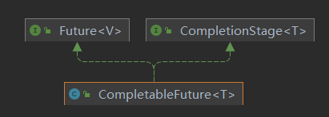
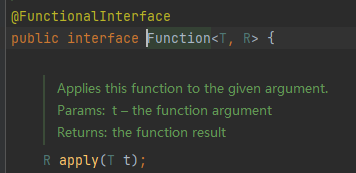
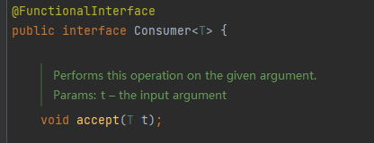

# CompletableFuture

## Future 接口概述

`Future` 接口是 `JDK5` 新加的一个接口，它提供一种异步并行计算的功能，如果主线程需要执行一个很耗时的计算任务，我们会就可以通过`Future` 把这个任务放进异步线程中执行，主线程继续处理其他任务或者先行结束，再通过 Future 获取计算结果。

接口中定义了操作异步任务执行一些方法，如**获取异步任务的执行结果**、**取消异步任务的执行**、**判断任务是否被取消**、**判断任务执行是否完毕**等。

特点：多线程、又返回、异步任务

## FutureTask 实现类

`Future` 接口常用实现类 `FutureTask`

### 架构设计

`FutureTask` 实现类 通过 `RunnableFuture` 接口，实现了 `Runnable`, `Future` 接口。通过构造器注入 `Callable` 接口实现类。


### 优缺点分析

优点：`Future + 线程池` 的异步多线程任务配合，能显著提高程序的运行效率。

缺点：

- `get()` : 阻塞，会等待结果返回。
- `isDone()` : 轮询，如果想要异步获取结果，通常会以轮询的方式去获取结果，尽量不要阻塞，但是会耗费cpu资源。

结论：Future 对于结果的获取不是很友好，只能通过 **阻塞或轮询** 的方式得到任务的结果。

```java
/**
 * 测试 get() 方法, 有返回值, 但是会阻塞
 */
@Test
public void test1() throws ExecutionException, InterruptedException {
  FutureTask<String> futureTask = new FutureTask<>(new Callable<String>() {
    @Override
    public String call() throws Exception {
      int i = 10;
      while (i > 0) {
        System.out.println("支线任务执行中");
        i--;
        Thread.sleep(1000);
      }
      return "I'am 42";
    }
  });

  Thread thread = new Thread(futureTask);
  thread.start();

  System.out.println("主线程工作1...");
  String result = futureTask.get();
  System.out.println(result);
  System.out.println("主线程工作2...");
}
```

```java
@Test
public void test2() throws ExecutionException, InterruptedException {
  FutureTask<String> futureTask = new FutureTask<>(() -> {
    int i = 10;
    while (i > 0) {
      //                    System.out.println("支线任务执行中");
      i--;
      Thread.sleep(1000);
    }
    return "I'm 42";
  });

  Thread thread = new Thread(futureTask);
  thread.start();

  System.out.println("主线程工作1...");

  while (true) {
    if (futureTask.isDone()) {
      String result = futureTask.get();
      System.out.println("支线任务结果 result = " + result);
      break;
    } else {
      System.out.println("支线任务未完成, 正在等待结果...");
      TimeUnit.MILLISECONDS.sleep(500);
    }
  }
  System.out.println("主线程工作2...");
}

```

### 复杂任务

对于简单的业务场景使用 `Future` 完全胜任

对于一些复杂任务的思考

- 回调通知：当 `Future` 中的任务完成时，可以进行通知回调。不使用轮训这种耗费 CPU 的方式。

- 多个任务前后依处理：想将多个异步任务的结果组合起来，后一个异步任务的计算结果需要钱一个异步任务的值。

- 对计算速度选最快的：当 `Future` 集合中某个任务最快结束时，返回结果，返回第一名处理结果。

使用 `Future` 接口提供的 API 不足够直接处理以上任务，这时候就需要 `CompletableFuture` 以声明式的方式优雅的处理这些需求。

## CompletableFuture

### 诞生背景

- `get()` 方法在 `Future` 计算完成之前会一直处在阻塞状态下，阻塞的方式和异步编程的设计理念相违背。
- `isDene()` 方法容易耗费 cpu 资源。
- 对于真正的异步处理我们希望是可以通过传入回调函数，在 Future 结束时自动调用该回调函数，这样，我们就不用等待结果。

JDK8 设计出 `CompletableFuture`，提供了一种观察者模式类似的机制，可以让任务执行完成后通知监听的一方。

### CompletionStage 接口

**架构设计**：



**`CompletionStage` 接口**：

- 代表异步计算过程中的某一个阶段，一个阶段完成以后可能会触发另外一个阶段。
- 一个阶段的执行可能是被单个阶段的完成触发，也可能是由多个阶段一起触发。

**`CompletableFuture` 实现类**：

- 提供了非常强大的 `Future` 的扩展功能，可以帮助我们简化异步编程的复杂性，并且提供了函数式编程的能力，可以通过回调的方式处理计算结果，也提供了转换和组合 `CompletableFuture` 的方法。
- 可能代表一个明确完成的 `Future`，也可能代表一个完成阶段（`CompletionStage`），它支持在计算完成以后触发一些函数或执行某些动作。

### 创建异步任务

**四个核心静态构造方法**：


对于上述 `Executor` 参数说明：若没有指定，则使用默认的 `ForkJoinPool.commonPool()` 作为它的线程池执行异步代码。

```java
/**
 * runAsync 无返回值
 */
@Test
public void test1() {
  ExecutorService executorService = Executors.newFixedThreadPool(3);
  CompletableFuture<Void> completableFuture = CompletableFuture.runAsync(() -> {
    // 默认使用 ForkJoinPool.commonPool(), 传入线程池参数用于指定执行线程池
    String threadName = Thread.currentThread().getName();
    System.out.println("支线线程名称: " + threadName);

    int i = 10;
    while (i > 0) {
      System.out.println("支线任务执行中...");
      i--;
      try {
        TimeUnit.SECONDS.sleep(1);
      } catch (InterruptedException e) {
        e.printStackTrace();
      }
    }
  }, executorService);

  System.out.println("主线程工作1...");

  try {
    System.out.println(completableFuture.get());
  } catch (InterruptedException | ExecutionException e) {
    e.printStackTrace();
  }

  System.out.println("主线程工作2...");
  executorService.shutdown();
}

/**
 * supplyAsync 有返回值
 */
@Test
public void test2() {
  ExecutorService executorService = Executors.newFixedThreadPool(3);
  CompletableFuture<String> completableFuture = CompletableFuture.supplyAsync(() -> {
    // 默认使用 ForkJoinPool.commonPool(), 传入线程池参数用于指定执行线程池
    String threadName = Thread.currentThread().getName();
    System.out.println("支线线程名称: " + threadName);

    int i = 10;
    while (i > 0) {
      System.out.println("支线任务执行中...");
      i--;
      try {
        TimeUnit.SECONDS.sleep(1);
      } catch (InterruptedException e) {
        e.printStackTrace();
      }
    }
    return "I'm 42";
  }, executorService);

  System.out.println("主线程工作1...");

  try {
    System.out.println(completableFuture.get());
  } catch (InterruptedException | ExecutionException e) {
    e.printStackTrace();
  }

  System.out.println("主线程工作2...");
  executorService.shutdown();
}
```

`CompletableFuture` 减少阻塞和轮询，可以传入回调对象，当异步任务完成或者发生异常时，自动调用回调对象的回调方法。

```java
/**
 * 异步方法
 */
@Test
public void test3() {
  System.out.println("主线程工作1...");
  ExecutorService executorService = Executors.newFixedThreadPool(3);
  CompletableFuture.supplyAsync(() -> {
    String threadName = Thread.currentThread().getName();
    System.out.println("支线线程名称: " + threadName);

    int i = 10;
    while (i > 0) {
      i--;
      try {
        System.out.println("支线任务执行中...");
        TimeUnit.SECONDS.sleep(1);
      } catch (InterruptedException e) {
        e.printStackTrace();
      }
      // 模拟异常
      // int m = 10 / i;
    }
    System.out.println("支线任务返回");
    return "42";
  }, executorService).whenComplete(new BiConsumer<String, Throwable>() {
    @Override
    public void accept(String s, Throwable throwable) {
      System.out.println("throwable = " + throwable);
      System.out.println("支线任务完成, 任务结果: " + s);
    }
  }).exceptionally(new Function<Throwable, String>() {
    @Override
    public String apply(Throwable throwable) {
      System.out.println("出现异常: ");
      throwable.printStackTrace();
      return null;
    }
  });
  System.out.println("主线程工作2...");
  for (int i = 0; i < 20; i++) {
    try {
      TimeUnit.SECONDS.sleep(1);
    } catch (InterruptedException e) {
      break;
    }
  }
  executorService.shutdown();
}
```

`CompletableFuture` 优点：

- 异步任务**结束**时，会自动回调某个对象的方法
- 主线程设置好回调后，不用关心异步任务的执行，异步任务之间可以顺序执行
- 异步任务**出错**时，会自动回调某个对象的方法

### 函数式编程

Lambda 表达式 + Stream 流式调用 + Chain 链式调用 + JDK8 函数式编程

#### 函数式接口

- `Runnable`：无参数、无返回值


- `Function`：接受一个参数，并且有返回值



- `Consumer`：接受一个参数，没有返回值



- `BiConsumer`：接受两个参数，没有返回值


- `Supplier`：供给型函数式接口，没有参数，有返回值


| 函数式接口名称 | 方法名称 | 参数 | 返回值 |
| -------------- | -------- | ---- | ------ |
| Runnable       | run      | 无   | 无     |
| Function       | apply    | 1 个 | 有     |
| Consume        | accept   | 1 个 | 无     |
| BiConsumer     | accept   | 2 个 | 无     |
| Supplier       | get      | 无   | 有     |

#### chain 链式调用

```java
public class ChainTest {
  public static void main(String[] args) {
    Student student = new Student();
    // 需要类中开启链式调用, 使用 lombok.experimental.Accessors 注解, 设置 (chain = true)
    student.setId(1).setName("z3").setMajor("english");
  }
}

@Data
@Accessors(chain = true)
public class Student {
  private Integer id;
  private String name;
  private String major;
}
```

### 案例

电商网站比价需求分析：

需求说明：同一款产品，同时搜索出同款产品在各大电商平台的售价

输出返回：出来结果希望是同款产品的在不同地方的价格清单列表

解决方案：多线程异步任务同时查询各大电商平台的售价

代码实现：

```java
public class PriceComparisonCase {

    public final List<NetMall> netMallList = Arrays.asList(
            new NetMall("jd"),
            new NetMall("dd"),
            new NetMall("tb")
    );

    public List<String> getPrice(List<NetMall> netMallList, String productName) {
        return netMallList.stream()
                .map(netMall -> String.format(
                                STR."《\{productName}》in \{netMall.getNetMallName()} price is %.2f",
                                netMall.calcPrice(productName)
                        )
                )
                .toList();
    }

    public List<String> getPriceCompletableFuture(List<NetMall> netMallList, String productName) {
        return netMallList.stream()
                .map(netMall -> CompletableFuture.supplyAsync(
                                () -> String.format(
                                        STR."《\{productName}》in \{netMall.getNetMallName()} price is %.2f",
                                        netMall.calcPrice(productName)
                                )
                        )
                )
                .toList()
                .stream()
                .map(CompletableFuture::join)
                .toList();
    }

    @Test
    public void test() {
        long startTime = System.currentTimeMillis();
        System.out.println(getPrice(netMallList, "MySQL"));
        long endTime = System.currentTimeMillis();
        System.out.println(STR."Cost Time: \{endTime - startTime} 毫秒");

        startTime = System.currentTimeMillis();
        System.out.println(getPriceCompletableFuture(netMallList, "MySQL"));
        endTime = System.currentTimeMillis();
        System.out.println(STR."Cost Time: \{endTime - startTime} 毫秒");
    }
}
```

### 常用方法

#### 获得结果和触发计算

- 获取结果
  - `public T get()`

  - `public T get(long timeout, TimeUnit unit)`

  - `public T join()` : 和get一样的作用，只是不需要抛出异常

  - `public T getNow(T valuelfAbsent)` : 计算完成就返回正常值，否则返回备胎值（传入的参数），立即获取结果不阻塞

- 主动触发计算
  - `public boolean complete(T value)` : 是否打断 get 方法立即返回括号值


```java
@Test
public void test1() throws InterruptedException, ExecutionException {
  ExecutorService executorService = Executors.newFixedThreadPool(3);
  CompletableFuture<String> completableFuture = CompletableFuture.supplyAsync(() -> {
    System.out.println("current thread name = " + Thread.currentThread().getName());
    for (int i = 0; i < 5; i++) {
      System.out.println("支线任务进行中");
      try {
        TimeUnit.SECONDS.sleep(1);
      } catch (InterruptedException e) {
        throw new RuntimeException(e);
      }
    }
    return "42";
  }, executorService);

  TimeUnit.SECONDS.sleep(1);

  // 当前异步任务未完成时, getNow() 会返回参数的默认值
  //        String result = completableFuture.getNow("00");
  //        System.out.println("result = " + result);

  // 当前异步任务未完成时, 会打断任务, 返回 complete 中的参数值
  boolean complete = completableFuture.complete("00");
  System.out.println(STR."complete = \{complete}");
  String result = completableFuture.get();
  System.out.println("result = " + result);
  
  executorService.shutdown();
}
```

#### 对计算结果进行处理

- `thenApply` : 计算结果存在依赖关系，这两个线程串行化，当前步骤**有异常的话就叫停**

- `handle` : 计算结果存在依赖关系，这两个线程串行化，**有异常也可以往下走**

```java
@Test
public void test2() {
  ExecutorService executorService = Executors.newFixedThreadPool(3);
  CompletableFuture<String> completableFuture = CompletableFuture.supplyAsync(() -> {
    System.out.println("current thread name = " + Thread.currentThread().getName());
    for (int i = 0; i < 5; i++) {
      System.out.println("支线任务进行中");
      try {
        TimeUnit.SECONDS.sleep(1);
      } catch (InterruptedException e) {
        e.printStackTrace();
      }
    }
    return "42";
  }, executorService).thenApply(f -> {
    System.out.println("thenApply");
    //            int i = 10 / 0;
    return f + "-thenApply";
  }).handle((f, e) -> {
    System.out.println("handle");
    //            int i = 10 / 0;
    return f + "-handle";
  }).whenComplete((v, e) -> {
    System.out.println("result = " + v);
    System.out.println("exception = " + e);
  }).exceptionally(e -> {
    e.printStackTrace();
    System.out.println(e.getCause());
    return null;
  });

  System.out.println("主线程工作...");
  for (int i = 0; i < 20; i++) {
    try {
      TimeUnit.SECONDS.sleep(1);
    } catch (InterruptedException e) {
      break;
    }
  }
  executorService.shutdown();
}
```

#### 对计算结果进行消费

- `thenRun(Runnable runnable)` :任务A执行完执行B，并且不需要A的结果
- `thenAccept(Consumer action)` : 任务A执行完执行B，B需要A的结果，但是任务B没有返回值
- `thenApply(Function fn)` : 任务A执行完执行B，B需要A的结果，同时任务B有返回值

CompletableFuture 和线程池说明

- 如果没有传入自定义线程池，都用默认线程池 ForkJoinPool
- 传入一个线程池，如果你执行第一个任务时，传入了一个自定义线程池
  - 调用 thenRun 方法执行第二个任务时，则第二个任务和第一个任务时共用同一个线程池
  - 调用 thenRunAsync 执行第二个任务时，则第一个任务使用的是你自定义的线程池，第二个任务使用的是ForkJoin线程池
  - 备注：可能是线程处理太快，系统优化切换原则，直接使用 main 线程处理，thenAccept 和 thenAcceptAsync，thenApply 和 thenApplyAsync 等，之间的区别同理。

#### 对计算速度进行选用

`applyToEither` : 谁快用谁

```java
@Test
public void test3() {
  ExecutorService threadPool = Executors.newFixedThreadPool(3);
  CompletableFuture<String> playA = CompletableFuture.supplyAsync(() -> {
    try {
      System.out.println("A come in");
      TimeUnit.SECONDS.sleep(2);
    } catch (InterruptedException e) {
      e.printStackTrace();
    }
    return "playA";
  }, threadPool);


  CompletableFuture<String> playB = CompletableFuture.supplyAsync(() -> {
    try {
      System.out.println("B come in");
      TimeUnit.SECONDS.sleep(3);
    } catch (InterruptedException e) {
      e.printStackTrace();
    }
    return "playB";
  }, threadPool);

  CompletableFuture<String> result = playA.applyToEither(playB, f -> f + " is faster");

  System.out.println("result: " + result.join());
}
```

#### 对计算结果进行合并

`thenCombine`

- 两个 `CompletableStage` 任务都完成后，最终能把两个任务的结果一起交给 `thenCombine` 来处理

- 先完成的先等着，等待其他分支任务

```java
@Test
public void test4() {
  CompletableFuture<Integer> completableFuture1 = CompletableFuture.supplyAsync(() -> {
    System.out.println(Thread.currentThread().getName() + " 启动");
    try {
      TimeUnit.SECONDS.sleep(1);
    } catch (InterruptedException e) {
      e.printStackTrace();
    }
    return 10;
  });

  CompletableFuture<Integer> completableFuture2 = CompletableFuture.supplyAsync(() -> {
    System.out.println(Thread.currentThread().getName() + " 启动");
    try {
      TimeUnit.SECONDS.sleep(2);
    } catch (InterruptedException e) {
      e.printStackTrace();
    }
    return 20;
  });

  CompletableFuture<Integer> finalResult = completableFuture1.thenCombine(completableFuture2, (x, y) -> {
    System.out.println("对开始两个结果合并");
    return x + y;
  });
  System.out.println(finalResult.join());
}
```