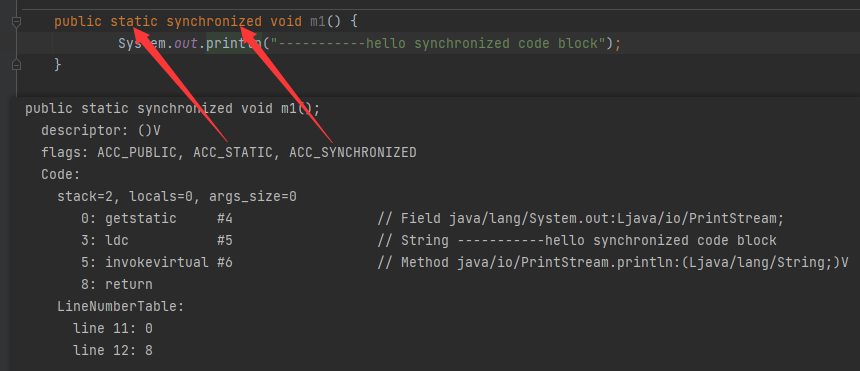
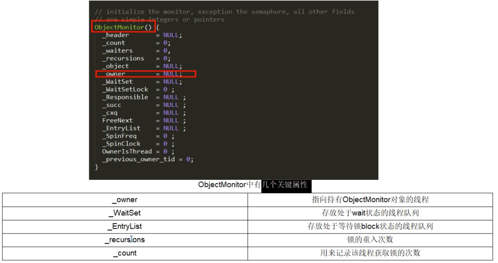
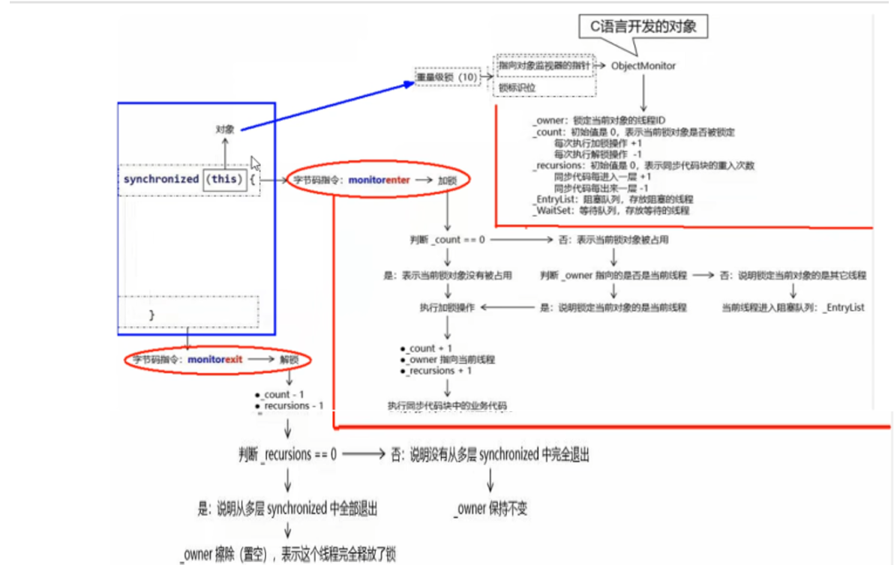
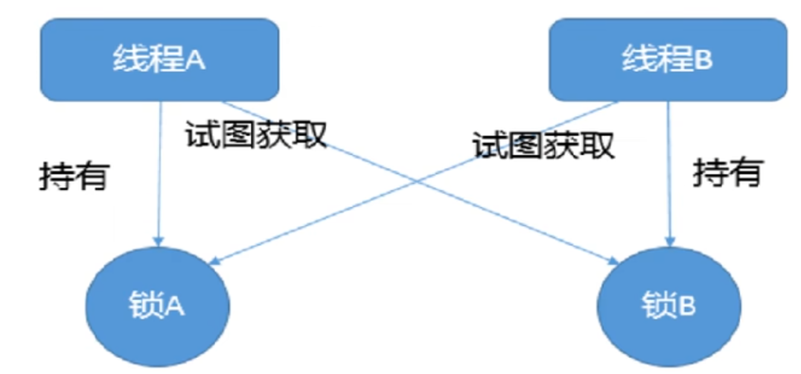
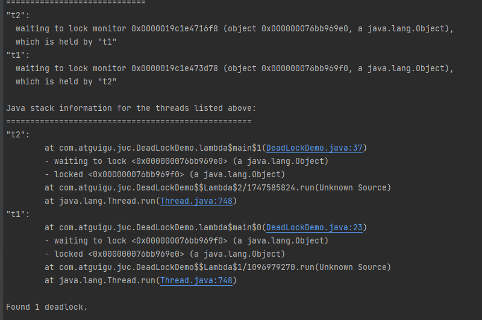
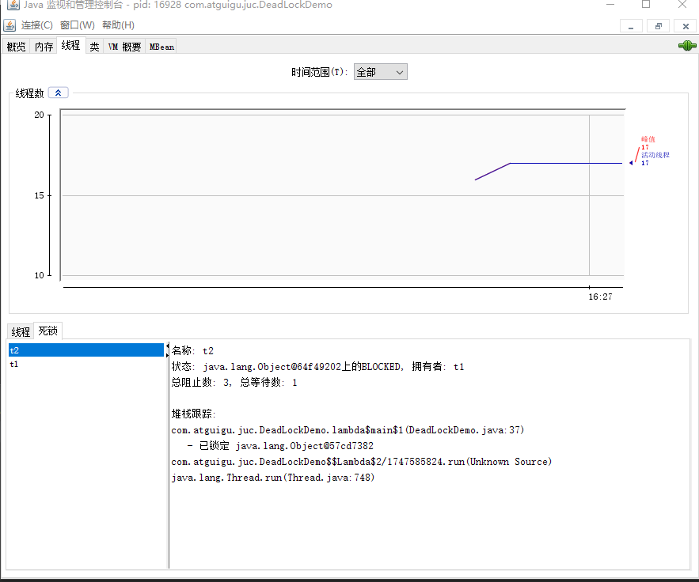

# Lock

## 乐观锁和悲观锁

悲观锁：

- 认为自己在使用数据的时候一定有别的线程来修改数据，因此在获取数据的时候会先加锁，确保数据不会被别的线程修改。
- synchronized 和 Lock 的实现类都是悲观锁，适合写操作多的场景，先加锁可以保证写操作时数据正确，显示的锁定之后再操作同步资源。

乐观锁：

- 认为自己在使用数据的时候不会有别的线程修改数据或资源，不会添加锁，Java 中使用无锁编程来实现，只是在更新的时候去判断，之前有没有别的线程更新了这个数据，如果这个数据没有被更新，当前线程将自己修改的数据成功写入，如果已经被其他线程更新，则根据不同的实现方式执行不同的操作，比如：放弃修改、重试抢锁等等。
- 判断规则有：版本号机制 Version，最常采用的是 CAS 算法，Java 原子类中的递增操作就通过 CAS 自旋实现的。适合读操作多的场景，不加锁的特性能够使其读操作的性能大幅提升，乐观锁则直接去操作同步资源，是一种无锁算法。

## synchronized

### 应用方式

- 作用于代码块，对括号里配置的对象加锁
- 作用于实例方法，当前实例加锁，进入同步代码块前要获得当前实例的锁
- 作用于静态方法，当前类加锁，进去同步代码前要获得当前类对象的锁

```java
public synchronized void s1() throws InterruptedException {
  System.out.println("s1: 1");
  TimeUnit.MILLISECONDS.sleep(800);
  System.out.println("s1: 2");
  TimeUnit.MILLISECONDS.sleep(500);
  System.out.println("s1: 3");
}

public void s2() throws InterruptedException {
  synchronized (this) {
    System.out.println("s2: 1");
    TimeUnit.MILLISECONDS.sleep(700);
    System.out.println("s2: 2");
    TimeUnit.MILLISECONDS.sleep(300);
    System.out.println("s2: 3");
  }
}

public static synchronized void s3() throws InterruptedException {
  System.out.println("s3: 1");
  TimeUnit.MILLISECONDS.sleep(600);
  System.out.println("s3: 2");
  TimeUnit.MILLISECONDS.sleep(400);
  System.out.println("s3: 3");
}
```

### 锁的什么

- 对于同步方法块，锁的是 synchronized 括号内的对象
- 对于普通同步方法，锁的是当前实例对象，通常指 this，所有的同步方法用的都是同一把锁, 实例对象本身
- 对于静态同步方法，锁的是当前类的 Class 对象

### 字节码分析

javap -c(v附加信息) .class 文件反编译

- synchronized 同步代码块

  实现使用的是 monitorenter 和 monitorexit 指令

  

- synchronized 普通同步方法

  调用指令将会检查方法的 ACC_SYNCHRONIZED 访问标志是否被设置，如果设置了，执行线程会将现持有 monitor 锁，然后再执行该方法，最后在方法完成（无论是否正常结束）时释放 monitor

  

- synchronized 静态同步方法

  ACC_STATIC、ACC_SYNCHRONIZED 访问标志区分该方法是否是静态同步方法

  


每个对象都存在着一个监视器 (Monitor)，当一个 monitor 被某个线程持有后，它便处于锁定状态。在 HotSpot 中，monitor 是由 ObjectMonitor 实现的，其主要的数据结构如下（位于 HotSpot 虚拟机源码 ObjectMonitor.hpp 文件，C++ 实现）：





## 公平锁和非公平锁

公平锁：是指多个线程按照申请锁的顺序来获取锁，这里类似于排队买票，先来的人先买，后来的人再队尾排着，这是公平的。

`Lock lock = new ReentrantLock(true)` : 表示公平锁，先来先得。

非公平锁：是指多个线程获取锁的顺序并不是按照申请的顺序，有可能后申请的线程比先申请的线程优先获取锁，synchronized 属于非公平锁。

`Lock lock = new ReentrantLock(false)` : 表示非公平锁，后来的也可能先获得锁，**默认为非公平锁**。

### 非公平锁

恢复挂起的线程到真正锁的获取还是有时间差的，从开发人员来看这个时间微乎其微，但是从CPU的角度来看，这个时间差存在的还是很明显的。所以非公平锁能更充分地利用CPU的时间片，尽量减少CPU空间状态时间。

使用多线程很重要的考量点是线程切换的开销，当采用非公平锁时，当一个线程请求锁获取同步状态，然后释放同步状态，所以刚释放锁的线程在此刻再次获取同步状态的概率就变得很大，所以就减少了线程的开销。

### 使用场景

如果为了更高的吞吐量，很显然非公平锁是比较合适的，因为节省了很多线程切换的时间，吞吐量自然就上去了；否则就用公平锁，大家公平使用。

## 可重入锁

可重入锁（递归锁）是指在同一线程在外层方法获取到锁的时侯，在进入该线程的内层方法会自动获取锁（前提，锁对象的是同一个对象），不会因为之前已经获取过还没释放而阻塞，可一定程度避免死锁。

### 隐式锁

隐式锁：即 synchronized 关键字使用的锁，默认是可重入锁，在一个 synchronized 修饰的方法或者代码块的内部调用本类的其他 synchronized 修饰的方法或者代码块时，是永远可以得到锁。

```java
/**
 * synchronized 为 隐式可重入锁
 * 在一个 synchronized 修饰的方法或者代码块的内部调用本类的其他 synchronized 修饰的方法或者代码块时，是永远可以得到锁。
 */
@Test
public void test1() {
  System.out.println("main");
  Thread t1 = new Thread(() -> {
    try {
      Thread.sleep(2000);
    } catch (InterruptedException e) {
      throw new RuntimeException(e);
    }
    m1();
  }, "t1");
  t1.start();

  try {
    Thread.sleep(2000);
  } catch (InterruptedException e) {
    throw new RuntimeException(e);
  }

  System.out.println("main continue");
  // 对象锁和类锁不是一个, 对象锁和类锁之间没有可重入
  // Thread t2 = new Thread(this::m2, "t2");
  Thread t2 = new Thread(ReentrantLockTest::m3, "t2");
  t2.start();

  try {
    t1.join();
    t2.join();
  } catch (InterruptedException e) {
    throw new RuntimeException(e);
  }
  System.out.println("main end");
}

public synchronized void m1() {
  System.out.println(STR."\{Thread.currentThread().getName()}\tm1 start");
  m2();
  System.out.println(STR."\{Thread.currentThread().getName()}\tm1 end");
}

public void m2() {
  synchronized (this) {
    System.out.println(STR."\{Thread.currentThread().getName()}\tm2 start");
    m3();
    System.out.println(STR."\{Thread.currentThread().getName()}\tm2 end");
  }
}

public static synchronized void m3() {
  System.out.println(STR."\{Thread.currentThread().getName()}\tm3 start");
  try {
    Thread.sleep(5000);
  } catch (InterruptedException e) {
    e.printStackTrace();
  }
  System.out.println(STR."\{Thread.currentThread().getName()}\tm3 end");
}
```

### 显式锁

显式锁：即 Lock，也有 ReentrantLock 这样的可重入锁。加锁几次就要解锁几次，加锁次数和释放次数不一样，会导致死锁。

```java
@Test
public void test2() throws InterruptedException {
  Lock lock = new ReentrantLock();
  Thread threadLock = new Thread(() -> {
    try {
      lock.lock();
      System.out.println("外层调用");
      try {
        lock.lock();
        System.out.println("中层调用");
        try {
          lock.lock();
          System.out.println("内层调用");
        } finally {
          lock.unlock();
        }
      } finally {
        lock.unlock();
      }
    } finally {
      lock.unlock();
    }

  }, "lockTest");
  threadLock.start();
  threadLock.join();
}
```

### Synchronized 的重入的实现机理

每个锁对象拥有一个**锁计数器**和一个**指向持有该锁的线程的指针**。

当执行 `monitorenter` 时，如果目标锁对象的计数器为零，那么说明它没有被其他线程所持有，Java虚拟机会将该锁对象的持有线程设置为当前线程，并且将其计数器加1。

在目标锁对象的计数器不为零的情况下，如果锁对象的持有线程是当前线程，那么Java虚拟机可以将其计数器加1，否则需要等待，直至持有线程释放该锁。

当执行 `monitorexit` 时，Java虚拟机则需将锁对象的计数器减1。计数器为零代表锁已被释放。

## 死锁及排查

### 死锁概念

死锁是指两个或两个以上的线程在执行过程中，因抢夺资源而造成的一种互相等待的现象，若无外力干涉，则它们无法再继续推进下去。

产生原因：

- 系统资源不足
- 进程运行推进顺序不合适
- 系统资源分配不当



示例：

```java
public class DeadLockTest {
  final Object o1 = new Object();
  final Object o2 = new Object();

  @Test
  public void test() {
    Thread t1 = new Thread(() -> {
      synchronized (o1) {
        System.out.println("t1: o1 run");

        try {
          TimeUnit.SECONDS.sleep(1);
        } catch (InterruptedException e) {
          throw new RuntimeException(e);
        }

        synchronized (o2) {
          System.out.println("t1: o2 run");
        }
      }
    }, "t1");
    t1.start();

    Thread t2 = new Thread(() -> {
      synchronized (o2) {
        System.out.println("t2: o2 run");

        try {
          TimeUnit.SECONDS.sleep(1);
        } catch (InterruptedException e) {
          throw new RuntimeException(e);
        }

        synchronized (o1) {
          System.out.println("t2: o1 run");
        }
      }
    }, "t2");
    t2.start();

    try {
      t1.join();
      t2.join();
    } catch (InterruptedException e) {
      throw new RuntimeException(e);
    }
  }
}
```

### 死锁排查

纯命令

- jps -l

- jstack 进程编号

图形化

- jconsole





