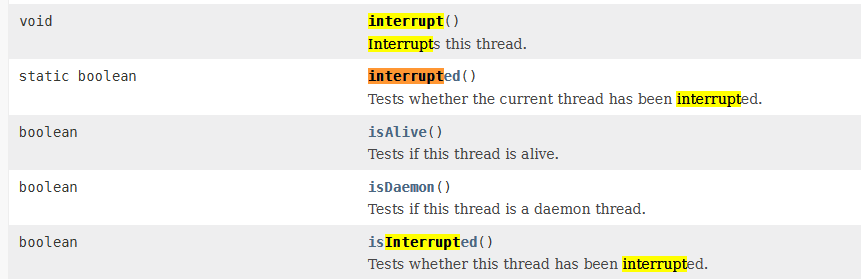

# LockSupport

## 线程中断机制



### 概述

首先，一个线程不应该由其他线程来强制中断或停止，而是应该由线程自己自行停止，自己来决定自己的命运，所以 `Thread.stop`, `Thread.suspend`, `Thread.resume` 都已经被废弃了。

其次，在 Java 中没有办法立即停止一条线程，然而停止线程却显得尤为重要，如取消一个耗时操作。因此，Java提供了一种用于停止线程的协商机制，也即中断标识协商机制。

中断只是一种协作协商机制，Java 没有给中断增加任何语法，中断的过程完全需要程序员自行实现。若要中断一个线程，你需要手动调用该线程`interrupt`方法，该方法也仅仅是将该线程对象的中断标识设置为 true，接着你需要自己写代码不断检测当前线程的标识位，如果为 true，表示别的线程请求这条线程中断，此时究竟应该做什么需要你自己写代码实现。

每个线程对象都有一个中断标识位，用于表示线程是否被中断；该标识位为 true 表示中断，为 false 表示未中断；通过调用线程对象的`interrupt`方法将该线程的标识位设置为 true；可以在别的线程中调用，也可以在自己的线程中调用。

### Thread 类相关 API 

`public void interrupt()` : 实例方法，仅仅是设置线程的中断状态为 true，发起一个协商而不会立刻停止线程。

- 线程中使用 `sleep()` / `join()` 等方法时，打断线程会触发 `InterruptedException`

`public static boolean interrupted()` : 静态方法，判断线程是否被中断**并清除当前中断状态**（做了两件事情）

- 返回当前线程的中断状态，测试当前线程是否已被中断
- 将当前线程的中断状态清零并重新设置为 false，清除线程的中断状态
- 这个方法有点不好理解在于如果连续两次调用此方法，则第二次返回 false，因为连续调用两次的结果可能不一样

`public boolean isInterrupted()` : 实例方法，判断当前线程是否被中断（通过检查中断标志位）

### 中断运行中的线程 

#### interrupt()

```java
/**
 * 调用 interrupt() 方法会修改线程的中断标识位, 不会主动打断线程
 * 可在线程中通过判断标识位, 主动停止
 */
@Test
public void test1() {
  Thread t1 = new Thread(() -> {
    for (int i = 0; i < 500; i++) {
      if (Thread.currentThread().isInterrupted()) {
        System.out.println("t1 线程被打断, 中断标志位：" + Thread.currentThread().isInterrupted());
        break;
      } else {
        System.out.println("t1: " + i + ", 中断标志位：" + Thread.currentThread().isInterrupted());
      }
    }
  }, "t1");
  t1.start();

  try {
    Thread.sleep(10);
  } catch (InterruptedException e) {
    e.printStackTrace();
  }

  t1.interrupt();
  System.out.println("t1 线程调用 interrupt() 后 t1 的中断标志位：" + t1.isInterrupted());

  try {
    t1.join();
  } catch (InterruptedException e) {
    e.printStackTrace();
  }

  System.out.println("t1 线程结束后的中断标志位：" + t1.isInterrupted());
}

/**
 * 当线程中使用 sleep() join() 等方法时, 打断该线程会触发 InterruptedException
 */
@Test
public void test2() {
  Thread t1 = new Thread(() -> {
    for (int i = 0; i < 500; i++) {
      if (Thread.currentThread().isInterrupted()) {
        System.out.println("t1 线程被打断, 中断标志位：" + Thread.currentThread().isInterrupted());
        break;
      } else {
        System.out.println("t1: " + i + ", 中断标志位：" + Thread.currentThread().isInterrupted());
      }
      try {
        Thread.sleep(1000);
      } catch (InterruptedException e) {
        System.out.println("该线程被打断, 触发InterruptedException 异常");
        e.printStackTrace();
      }
    }
  }, "t1");
  t1.start();

  try {
    Thread.sleep(10);
  } catch (InterruptedException e) {
    e.printStackTrace();
  }

  t1.interrupt();
  System.out.println("t1 线程调用 interrupt() 后 t1 的中断标志位：" + t1.isInterrupted());

  try {
    t1.join();
  } catch (InterruptedException e) {
    e.printStackTrace();
  }

  System.out.println("t1 线程结束后的中断标志位：" + t1.isInterrupted());
}
```

#### volatile

`volatile` 是 Java 中的一个关键字，主要用于声明变量。当一个变量被声明为 `volatile` 时，它会保证该变量的修改对所有线程都是立即可见的。换句话说，当一个线程修改了一个 `volatile` 变量的值，其他线程能够立即看到这个修改。

1. **保证可见性**：当一个线程修改了一个 `volatile` 变量的值，其他线程能够立即看到这个修改。这是通过禁止指令重排序来保证的。
2. **禁止指令重排序**：由于 `volatile` 关键字禁止了对包含该变量的内存操作的指令重排序，因此能够保证在多线程环境中的正确性。
3. **禁止双重检查锁定（Double-checked Locking）**：在 Java 中，双重检查锁定是一种优化技术，用于减少锁定的频率。但由于 JVM 的实现可能对 `volatile` 变量的读取和写入进行优化，因此在某些情况下需要显式地使用 `volatile` 关键字来禁止双重检查锁定。

请注意，虽然 `volatile` 可以保证可见性和禁止指令重排序，但它不能保证原子性。例如，对于自增操作 `count++`，它实际上是由三个步骤组成的：读取 `count` 的当前值、增加该值、写入新的值。在多线程环境中，这可能导致数据不一致。如果需要保证原子性，应该使用 `synchronized` 或者 `java.util.concurrent.atomic` 包中的原子类。

```java
public volatile boolean isStop = false;

@Test
public void test3() {
  Thread t1 = new Thread(() -> {
    for (int i = 0; i < 500; i++) {
      if (isStop) {
        System.out.println("volatile 值改变, t1 线程停止");
        break;
      }
      System.out.println("t1 线程进行中 - " + i);
    }
  }, "t1");
  t1.start();

  try {
    Thread.sleep(2);
  } catch (InterruptedException e) {
    e.printStackTrace();
  }

  Thread t2 = new Thread(() -> {
    isStop = true;
  }, "t2");
  t2.start();

  try {
    t1.join();
  } catch (InterruptedException e) {
    e.printStackTrace();
  }
}
```

#### AutomicBoolean

Java 中的`AtomicBoolean`是一个线程安全的布尔类型，用于在多线程环境中安全地更新和读取布尔值。与普通的`boolean`变量相比，`AtomicBoolean`提供了原子操作，能够在多线程环境下避免数据竞争和不一致的问题。

1. **线程安全的状态标记**：`AtomicBoolean`可以用于实现线程安全的状态标记。例如，你可以使用`AtomicBoolean`来标记一个对象是否正在被另一个线程修改或访问。通过原子操作，你可以安全地设置和清除标记，而不需要额外的锁或同步机制。
2. **并发控制**：在多线程环境下，`AtomicBoolean`可以用于实现并发控制。例如，你可以使用`AtomicBoolean`来控制多个线程对共享资源的访问。通过原子操作，你可以确保在任何时刻只有一个线程能够访问共享资源，从而避免数据竞争和资源冲突的问题。
3. **无锁算法**：`AtomicBoolean`可以用于实现无锁算法。无锁算法是一种不需要显式锁定的并发算法，通过原子操作来保证数据的一致性和正确性。`AtomicBoolean`提供了一种简单而有效的机制来实现无锁算法。
4. **并行计算**：在并行计算中，`AtomicBoolean`可以用于控制并行任务的执行和同步。例如，你可以使用`AtomicBoolean`来标识某个并行任务是否已经完成，或者用于等待某个条件满足后再执行后续操作。

总之，`AtomicBoolean`在Java中主要用于实现线程安全的布尔值操作，适用于多线程环境下的状态标记、并发控制、无锁算法和并行计算等场景。

```java
public AtomicBoolean atomicBoolean = new AtomicBoolean(false);

@Test
public void test4() {
  Thread t1 = new Thread(() -> {
    for (int i = 0; i < 500; i++) {
      if (atomicBoolean.get()) {
        System.out.println("atomicBoolean 值改变, t1 线程停止");
        break;
      }
      System.out.println("t1 线程进行中 - " + i);
    }
  }, "t1");
  t1.start();

  try {
    Thread.sleep(1);
  } catch (InterruptedException e) {
    e.printStackTrace();
  }

  Thread t2 = new Thread(() -> {
    atomicBoolean.set(true);
  }, "t2");
  t2.start();

  try {
    t1.join();
  } catch (InterruptedException e) {
    e.printStackTrace();
  }
}
```

## 线程等待唤醒机制

### 三种让线程等待和唤醒的方法

方式一：使用 `Object` 中的 `wait()` 方法让线程等待，使用 `Object` 中的 `notify()` 方法唤醒线程

- `wait()` 和 `notify()` 方法必须要在同步代码块或者方法里面，且成对出现使用
- 必须先 `wait` 再 `notify`

```java
final Object lockObj = new Object();

@Test
public void test1() {
  Thread t1 = new Thread(() -> {
    synchronized (lockObj) {
      System.out.println("t1: start");
      try {
        lockObj.wait();
      } catch (InterruptedException e) {
        e.printStackTrace();
      }
      System.out.println("t1: continue");

    }
  }, "t1");
  t1.start();

  try {
    Thread.sleep(1000);
  } catch (InterruptedException e) {
    e.printStackTrace();
  }

  new Thread(() -> {
    synchronized (lockObj) {
      lockObj.notify();
      System.out.println("t2: notify");
    }
  }, "t2").start();

  try {
    t1.join();
  } catch (InterruptedException e) {
    e.printStackTrace();
  }
}
```

方式二：使用 `java.util.concurrent` 包中的 `Condition` 的 `await()` 方法让线程等待，使用 `signal()` 方法唤醒线程

- `Condition` 中的线程等待和唤醒方法，需要先获取锁
- 必须先 `await` 后 `signal`

```java
final Lock lock = new ReentrantLock();
final Condition condition = lock.newCondition();

@Test
public void test2() {
  Thread t1 = new Thread(() -> {
    try {
      lock.lock();
      System.out.println("t1: start");
      condition.await();
      System.out.println("t1: continue");
    } catch (InterruptedException e) {
      e.printStackTrace();
    } finally {
      lock.unlock();
    }
  }, "t1");
  t1.start();

  try {
    Thread.sleep(1000);
  } catch (InterruptedException e) {
    e.printStackTrace();
  }

  new Thread(() -> {
    lock.lock();
    condition.signal();
    System.out.println("t2: notify");
    lock.unlock();
  }, "t2").start();

  try {
    t1.join();
  } catch (InterruptedException e) {
    e.printStackTrace();
  }
}
```

> 上述两个对象Object和Condition使用的限制条件：
>
> - 线程需要先获得并持有锁，必须在锁块（synchronized或lock）中
> - 必须要先等待后唤醒，线程才能够被唤醒  

方式三：`LockSupport` 类可以阻塞当前线程以及唤醒指定被阻塞的线程 

- `LockSupport` 是用于创建锁和其他同步类的基本线程阻塞原语，其中`park()`和`unpack()`而作用分别是阻塞线程和解除阻塞线程。
- `LockSupport` 类使用了一种名为 `Permit`（许可）的概念来做到阻塞和唤醒线程的功能，每个线程都有一个许可，许可证只能有一个，累加上限是
- `Peimit`许可证默认没有不能放行，所以一开始调用`park()`方法当前线程会阻塞，直到别的线程给当前线程发放`peimit`，`park` 方法才会被唤醒

方法：

`park()` / `park(Object blocker)` : 阻塞当前线程/阻塞传入的具体线程

`unpark(Thread thread)` ： 唤醒处于阻塞状态的指定线程 

```java
@Test
public void test3() {
  Thread t1 = new Thread(() -> {
    System.out.println("t1: start");
    LockSupport.park();
    System.out.println("t1: continue");
  }, "t1");
  t1.start();

  try {
    Thread.sleep(1000);
  } catch (InterruptedException e) {
    e.printStackTrace();
  }

  new Thread(() -> {
    LockSupport.unpark(t1);
    System.out.println("t2: notify");
  }, "t2").start();

  try {
    t1.join();
  } catch (InterruptedException e) {
    e.printStackTrace();
  }
}
```

### 重点说明

`LockSupport` 是用来创建锁和其他同步类的基本线程阻塞原语，所有的方法都是**静态方法**，可以让线程再任意位置阻塞，阻塞后也有对应的唤醒方法。归根结底，`LockSupport`时调用`Unsafe`中的`native`代码。

`LockSupport`提供`park()`和`unpark()`方法实现阻塞线程和解除线程阻塞的过程，`LockSupport`和每个使用它的线程都有一个许可（`Peimit`）关联，每个线程都有一个相关的`permit`，`peimit`最多只有一个，重复调用`unpark`也不会积累凭证。

- 当调用`park`时，如果有凭证，则会直接消耗掉这个凭证然后正常退出。如果没有凭证，则必须阻塞等待凭证可用
- 当调用`unpark`时，它会增加一个凭证，但凭证最多只能有1个，累加无效。

