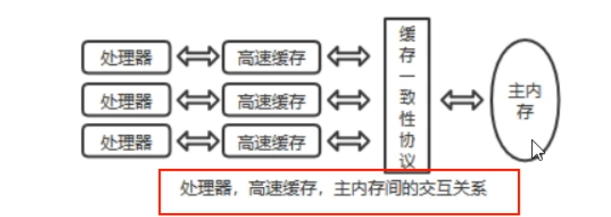

# JMM

## 硬件存储体系

CPU 的运行并不是直接操作内存而是先把内存里面的数据读到缓存，而内存的读和写操作的时候会造成不一致的问题。JVM 规范中试图定义一种 Java 内存模型来屏蔽掉各种硬件和操作系统的内存访问差异，以实现让 Java 程序再各种平台下都能达到一致性的内存访问效果。



## JMM 概述

JMM（Java 内存模型 Java Memory Model）本身是一种抽象的概念，描述了一组约定或规范，通过这组规范定义了程序中（尤其是多线程）各个变量的读写访问方式并决定一个线程对共享变量的写入以及如何变成对另一个线程可见，关键技术点都是围绕多线程的**原子性、可见性和有序性**展开的。

- 通过JMM来实现线程和主内存之间的抽象关系
- 屏蔽各个硬件平台和操作系统的内存访问差异以实现让 Java 程序再各种平台下都能达到一致性的内存访问效果。

## JMM 三大特性

### 可见性

可见性是指**当一个线程修改了某一个共享变量的值，其他线程是否能够立即知道该变更**，JMM 规定了所有的变量都存储在**主内存**中。


系统中主内存**共享变量**数据修改被写入的时机是不确定的，**多线程并发下很可能出现“脏读”**，所以每个线程都有自己的工作内存，线程自己的工作内存中保存了该线程**使用到的变量的主内存副本拷贝**，线程对变量的所有操作（读取、赋值等）都必须**在线程自己的工作内存中进行**，而不能够直接写入主内存中的变量，不同线程之间也**无法直接访问对方工作内存中的变量**，**线程间变量值的传递均需要通过主内存来完成**。

### 原子性

指一个操作是不可被打断的，即多线程环境下，操作不能被其他线程干扰

### 有序性

对于一个线程的执行代码而言，我们习惯性地认为代码的执行总是从上到下有序执行的。但为了提升性能，编译器和处理器通常会**对指令序列进行重新排序**。

Java 规范规定 JVM 线程内部维持顺序化语义，即只要程序的最终结果与它顺序话执行的结果相等，那么指令的执行顺序可以与代码顺序不一致，此过程叫**指令的重排序**。

- JVM 能根据处理器特性（CPU多级缓存系统、多核处理器等）适当的对机器指令进行重排序，使机器指令更符合CPU的执行特性，最大限度的发挥机器性能。
- 指令重排可以**保证串行语义一致**，但**没有保证多线程的语义也一致**（即可能产生“脏读”）。
- 处理器在进行重排序时必须考虑到**指令之间的数据依赖性**。


## 多线程下的变量读写

JVM 运行程序的实体是线程，每个线程创建时 JVM 都会为其创建一个工作内存（栈空间），工作内存是每个线程的私有数据区域。

JMM 中规定所有变量都存储在主内存，主内存是共享内存区域，所有线程都可以访问。

线程对变量的操作（读写赋值等）必须在工作内存中进行，首先要将变量从主内存拷贝到线程自己的工作内存空间，然后对变量进行操作，操作完成后再将变量写回主内存，不能直接操作主内存中的变量，各个线程中的工作内存存储着主内存中的变量副本拷贝。

不同的线程无法访问对方的工作内存，线程间的通信（传值）必须通过主内存来完成。


JMM 定义了线程和主内存之间的抽象关系：

- 线程之间的共享变量存储在主内存中（从硬件角度讲就是内存条）
- 每个线程都有一个自己的本地工作内存，本地工作内存中存储了该线程用来读写共享变量的副本（从硬件角度来说就是CPU的缓存）

总结：

- 我们定义的所有共享变量都储存在物理主内存中
- 每个线程都有自己独立的工作内存，里面保证该线程使用到的共享变量的副本（主内存中该变量的一份拷贝）
- 线程对共享变量所有的操作都必须先在线程自己的工作内存中进行后写回主内存，不能直接从主内存在读写（不能越级）
- 不同线程之间也无法直接访问其他线程的工作内存中的变量，线程间变量值的传递需要通过主内存来进行（同级不能互相访问）。

## 多线程先行发生原则

如果 JMM 中所有的有序性都仅靠 volatile 和 synchronized 来完成，那么有很多操作都将变得非常罗嗦，但是我们在编写 Java 并发代码的时候并没有察觉到这一点。

我们没有时时、处处、次次，添加 volatile 和 synchronized 来完成程序，这是因为 Java 语言中 JMM 原则下，有一个“先行发生”（happens-before）的原则。

从 JDK5 开始，Java 使用新的 JSR-133 内存模型，提供 happens-before 原则来辅助保证程序执行的原子性、可见性以及有序性的问题，它是判断数据是否存在竞争、线程是否安全的依据

这个原则非常重要：它是判断数据是否存在竞争，线程是否安全的非常有用的手段。依赖这个原则，我们可以通过几条简单规则一揽子解决并发环境下两个操作之间是否可能存在冲突的所有问题，而不需要陷入 JMM 晦涩难懂的底层编译原理之中。

在 JVM 中，如果一个操作执行的结果需要对另一个操作可见或者代码重排序，那么这两个操作之间必须存在 happens-before（先行发生）原则，逻辑上的先后关系。

### 代码分析

代码先写后读：

1. 线程 A 执行：x = 5
2. 线程 B 执行：y = x

问题：

- y 是否等于 5 ？

分析：

- 如果线程 A 的操作 happens-before（先行发生）线程 B 的操作，那么可以确定 y=5 一定成立
- 如果不存在 happens-before 原则，那么 y=5 不一定成立

### 原则

#### 总原则

- 如果一个操作 happens-before 另一个操作，那么第一个操作的执行结果将对第二个操作可见，而且第一个操作的执行顺序排在第二个操作之前。
- 如果两个操作之间存在 happens-before 关系，并不意味着一定要按照 happens-before 原则制定的顺序来执行。如果重排之后的执行结果与按照 happens-before 关系来执行的结果一致，那么这种重排序并不非法。

#### 8 条规则

1. 次序规则：**一个线程内**，按照代码的顺序，写在前面的操作先行发生于写在后面的操作，也就是说前一个操作的结果可以被后续的操作获取（保证语义串行性，按照代码顺序执行）。

   比如前一个操作把变量x赋值为1，那后面一个操作肯定能知道x已经变成了1

2. 锁定规则：一个 unLock 操作先行发生于后面对同一个锁的 lock 操作（时间上的先后）。

3. volatile 变量规则：对一个 volatile 变量的写操作先行发生于后面对这个变量的读操作，前面的写对后面的读是可见的（时间上的先后）。

4. 传递规则：如果操作 A 先行发生于操作 B，而操作 B 又先行发生于操作 C，则可以得出操作 A 先行发生于操作 C。

5. 线程启动规则（Thread start Rule）：Thread 对象的 start() 方法先行发生于此线程的每一个动作。

6. 线程中断规则（Thread Interruption Rule）：

   1. 对线程 interrupt() 方法的调用先行发生于被中断线程的代码检测到中断事件的发生

   2. 可以通过 Thread.interrupted() 检测到是否发生中断
   
   3. 也就是说要先调用 interrupt() 方法设置过中断标志位，才能检测到中断发生

7. 线程终止规则（Thread Termination Rule）：线程中的所有操作都优先发生于对此线程的终止检测，可以通过 isAlive() 等手段检测线程是否已经终止执行。

8. 对象终结规则（Finalizer Rule）：一个对象的初始化完成（构造函数执行结束）先行发生于它的 finalize()方法的开始，对象没有完成初始化之前，是不能调用 finalized() 方法的。

#### happens-before 总结

- 在 Java 语言里面，Happens-before 的语义本质上是一种可见性

- A happens-before B ,意味着 A 发生过的事情对 B 而言是可见的，无论 A 事件和 B 事件是否发生在同一线程里

- JVM 的设计分为两部分：

  - 一部分是面向程序员提供的，也就是 happens-before 规则，它阐述了一个强内存模型，只要理解 happens-before 规则，就可以编写并发安全的程序。
  
  - 另一部分是针对 JVM 实现的，为了尽可能少的对编译器和处理器做约束从而提升性能，JMM 在不影响程序执行结果的前提下对其不做要求，即允许优化重排序。

### 案例说明

#### 代码

```java
private int value =0;
public int getValue(){
    return value;
}
public int setValue(){
    return ++value;
}
```

#### 问题描述

假设存在线程 A 和 B，线程 A 先（时间上的先后）调用了 setValue() 方法，然后线程 B 调用了同一个对象的 getValue() 方法，那么线程 B 收到的返回值是什么？

#### 结果及分析

答案：不一定

分析：

1. 由于两个方法由不同线程调用，不满足程序次序规则
2. 两个方法都没有用锁，不满足锁定规则
3. 变量没有使用 volatile 修饰，所以不满足 volatile 变量规则
4. 不涉及传递规则

综上分析，无法通过 happens-before 原则推导出线程 A happens-before 线程 B，虽然可以确定时间上线程 A 优于线程 B，但就是无法确定线程 B 获得的结果是什么，所以这段代码不是线程安全的。

> 注意：如果两个操作的执行次序无法从 happens-before 原则推导出来，那么就不能保证他们的有序性，虚拟机可以随意对他们进行重排序。

#### 改进

- 把 getter/setter 方法都定义为 synchronized 方法（不好，重量锁，并发性下降）

  ```java
  private int value =0;
  public synchronized int getValue(){
      return value;
  }
  public synchronized int setValue(){
      return ++value;
  }
  ```

- 把 value 定义为 volatile 变量，由于 setter 方法对 value 的修改不依赖 value 的原值，满足 volatile 关键字使用场景

  ```java
  /**
  * 利用 volatile 保证读取操作的可见性，
  * 利用 synchronized 保证符合操作的原子性结合使用锁和 volatile 变量来减少同步的开销
  */
  private volatile int value =0;
  public int getValue(){
      return value;
  }
  public synchronized int setValue(){
      return ++value;
  }
  ```

  

