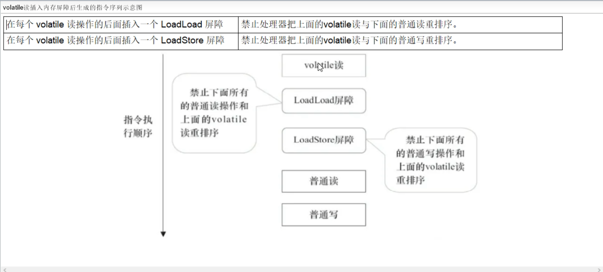
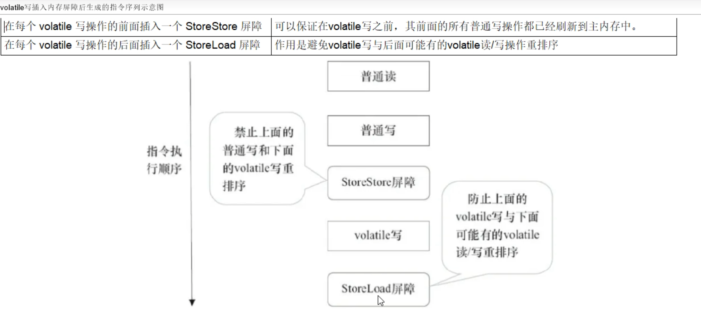
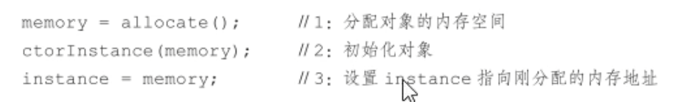

# volatile

## volatile 修饰的变量

### 特点

- 可见性：写完后立即刷新回主内存并及时发出通知
- 有序性：有排序要求，有时需要**禁排序**

### 内存语义

- 当写一个 volatile 变量时，JMM 会把该线程对应的本地内存中的共享变量值**立即刷新回主内存中**
- 当读一个 volatile 变量时，JMM 会把该线程对应的**本地变量设置为无效**，**重新回到主内存中读取**最新共享变量的值

volatile 的写内存语义是直接刷新到主内存中，读的内存语义是直接从主内存中读取

## 内存屏障

volatile 使用内存屏障（Memory Barrier）来保证可见性和有序性

### 概述

内存屏障（也称内存栅栏，屏障指令等）是一类同步屏障指令，是CPU或编译器在对内存随机访问的操作中的一个同步点，使得此点之前的所有读写操作都执行后才可以开始执行此点之后的操作，避免代码重排序。

内存屏障其实就是一种 JVM 指令，JMM 的重排规则会要求 Java 编译器**在生成 JVM 指令时插入特定的内存屏障指令**，通过这些内存屏障指令，volatile 实现了 JMM 中的可见性和有序性（禁重排），但 **volatile 无法保证原子性**。

- **内存屏障之前**的所有**写操作**都要**回写到主内存**
- **内存屏障之后**的所有**读操作**都能获得内存屏障之前的所有写操作的**最新结果**（实现了可见性）

### 分类

- 读屏障（Load Barrier）：在**读指令之前插入读屏障**，让**工作内存或CPU高速缓存**中的缓存数据失效，重新回到**主内存中获取最新数据**。
- 写屏障（Store Barrier）：在**写指令之后插入写屏障**，强制把缓冲区的**数据刷回到主内存中**。

| **屏障类型** | **指令示例**             | **说明**                                                     |
| ------------ | ------------------------ | ------------------------------------------------------------ |
| LoadLoad     | Load1;LoadLoad;Load2     | 保证 Load1 的读取操作在 Load2 及后续读取操作之前执行         |
| StoreStore   | Store1;StoreStore;Store2 | 在 store2 及其后的写操作执行前，保证 Store1 的写操作已经刷新到主内存 |
| LoadStore    | Load1;LoadStore;Store2   | 在 Store2 及其后的写操作执行前，保证 Load1 的读操作已经结束  |
| StoreLoad    | Store1;StoreLoad;Load2   | 保证 Store1 的写操作已经刷新到主内存后，Load2 及其后的读操作才能执行 |

### 指令重排

通过内存屏障禁止指令重排

- 对于编译器的重排序，JMM 会根据重排序的规则，禁止特定类型的编译器重排序
- 对于处理器的重排序，Java 编译器在生成指令序列的适当位置，插入内存屏障指令，来禁止特定类型的处理器排序。

volatile 变量规则

- 当第一个操作为 volatile 读时，不论第二个操作是什么，都不能重排序，这个操作保证了 volatile 读之后的操作不会被重排到 volatile 读之前。
- 当第二个操作为 volatile 写时，不论第一个操作是什么，都不能重排序，这个操作保证了 volatile 写之前的操作不会被重排到 volatile 写之后。
- 当第一个操作为 volatile 写时，第二个操作为 volatile 读时，不能重排。

| 第一个操作 | 第二个操作：普通读写 | 第二个操作：volatile 读 | 第二个操作：volatile 写 |
| ---------- | -------------------- | ----------------------- | ----------------------- |
| 普通读写   | 可以重排             | 可以重排                | 不可以重排              |
| volatile读 | 不可以重排           | 不可以重排              | 不可以重排              |
| volatile写 | 可以重排             | 不可以重排              | 不可以重排              |

### 屏障插入规则

JMM 就将内存屏障插入策略分为4种规则

- 读屏障：在每个 volatile 读操作的**后面**插入一个 LoadLoad 屏障或者 LoadStore 屏障



- 写屏障：在每个 volatile 写操作的**前面**插入 StoreStore 屏障；在每个 volatile 写操作的**后面**插入 StoreLoad 屏障；



## volatile 特性

保证不同线程对某个变量完成操作后结果及时可见，即该共享变量一旦改变所有线程立即可见

### 可见性

#### 示例

```java
/**
 * enable 变量不加 volatile 会导致 enable 变量在 t1 线程的变化不能通知到主线程
 * System.out.println 语句会触发 MESI 缓存一致性协议
 */
volatile boolean enable = true;

@Test
public void test() {
  Thread t1 = new Thread(() -> {
    try {
      Thread.sleep(1000);
    } catch (InterruptedException e) {
      throw new RuntimeException(e);
    }
    enable = false;
  }, "t1");
  t1.start();

  long i = 0;
  while (enable) {
    i++;
  }
  System.out.println(STR."i = \{i}");
}
```

- 不加 volatile，没有可见性，程序无法停止
- 加了 volatile，保证可见性，程序可以停止

#### 读写过程


### 没有原子性

volatile 变量的符合操作不具有原子性

对于 voaltile 变量具备可见性，JVM 只是保证从主内存加载到线程工作内存的值是最新的，也仅仅是数据加载时是最新的。但是多线程环境下，“数据计算”和“数据赋值”操作可能多次出现，若数据在加载之后，若主内存 volatile 修饰变量发生修改之后，线程工作内存的操作将会作废去读主内存最新值，**操作出现写丢失问题**。即各线程私有内存和主内存公共内存中变量不同步，进而导致数据不一致。由此可见 volatile 解决的是变量读时的可见性问题，但无法保证原子性，对于多线程修改主内存共享变量的场景必须加锁同步。

至于怎么去理解这个写丢失的问题，就是再将数据读取到本地内存到写回主内存中有三个步骤：数据加载---->数据计算---->数据赋值，如果第二个线程在第一个线程读取旧值与写回新值期间读取共享变量的值，那么第二个线程将会与第一个线程一起看到同一个值，并执行自己的操作，一旦其中一个线程对 volatile 修饰的变量先行完成操作刷回主内存后，另一个线程会作废自己的操作，然后重新去读取最新的值再进行操作，这样的话，它自身的那一次操作就丢失了，这就造成了 线程安全失败，因此，这个问题需要使用 synchronized 修饰以保证线程安全性。

结论：volatile 变量不适合参与到依赖当前值的运算，如 i++，i=i+1 之类的，通常用来保存某个状态的 boolean 值或者 int 值，也正是由于 volatile 变量只能保证可见性，在不符合以下规则的运算场景中，我们仍然要通过加锁来保证原子性：

- 运算结果并不依赖变量的当前值，或者能够确保只有单一的线程修改变量的值

- 变量不需要与其他的状态变量共同参与不变约束


> 面试回答为什么不具备原子性：举例 i++ 的例子，在字节码文件中，i++ 分为三部，间隙期间不同步非原子操作
>
>对于volatile变量，JVM只是保证从主内存加载到线程工作内存的值是最新的，也就是数据加载时是最新的，如果第二个线程在第一个线程读取旧值和写回新值期间读取i的域值，也就造成了线程安全问题。

### 指令禁重排

- 在每一个 volatile 写操作前面插入一个 StoreStore 屏障 -> StoreStore 屏障可以保证在 volatile 写之前，其前面所有的普通写操作都已经刷新到主内存中。
- 在每一个 volatile 写操作后面插入一个 StoreLoad 屏障 -> StoreLoad 屏障的作用是避免 volatile 写与后面可能有的 volatile 读/写操作重排序
- 在每一个 volatile 读操作后面插入一个 LoadLoad 屏障 -> LoadLoad 屏障用来禁止处理器把上面的 volatile 读与下面的普通读重排序
- 在每一个 volatile 读操作后面插入一个 LoadStore 屏障 -> LoadTore 屏障用来禁止处理器把上面的 volatile 读与下面的普通写重排序

案例说明（volatile 读写前或后加了屏障保证有序性）：


## 正确使用 volatile

单一赋值可以，但是含复合运算赋值不可以（i++之类的）

- volatile int a = 10;
- volatile boolean flag = true;

状态标志，判断业务是否结束

- 作为一个布尔状态标志，用于指示发生了一个重要的一次性事件，例如完成初始化或任务结束

  

开销较低的读，写锁策略

- 当读远多于写，结合使用内部锁和 volatile 变量来减少同步的开销

- 原理是：利用 volatile 保证读操作的可见性，利用 synchronized 保证符合操作的原子性

  

DCL双端锁的发布

- 问题描述：首先设定一个加锁的单例模式场景

  

- 在单线程环境下（或者说正常情况下），在“问题代码处”，会执行以下操作，保证能获取到已完成初始化的实例：

  

- 隐患：在多线程环境下，在“问题代码处”，会执行以下操作，由于重排序导致2，3乱序，后果就是其他线程得到的是null而不是完成初始化的对象，其中第3步中实例化分多步执行（分配内存空间、初始化对象、将对象指向分配的内存空间），某些编译器为了性能原因，会将第二步和第三步重排序，这样某个线程肯能会获得一个未完全初始化的实例：

  

- 多线程下的解决方案：加 volatile 修饰

  

