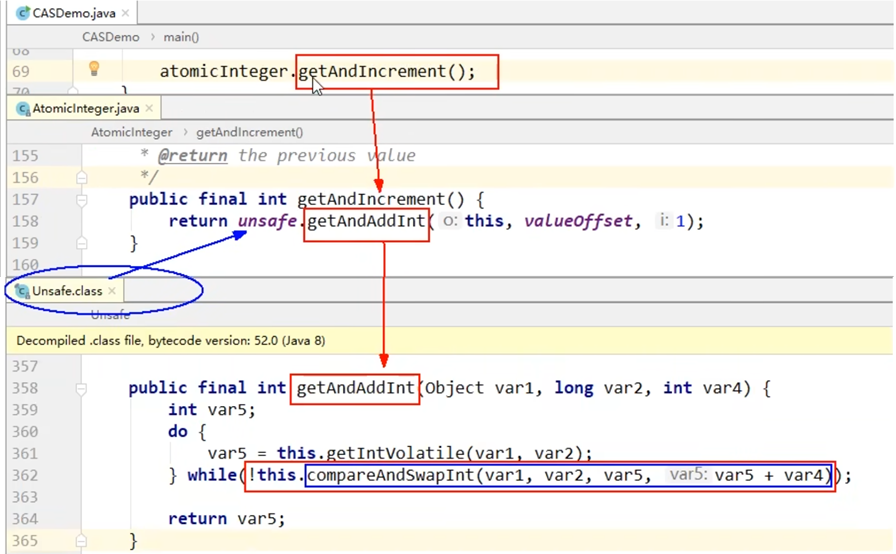
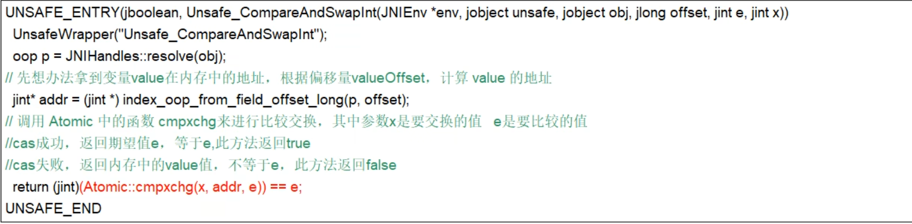
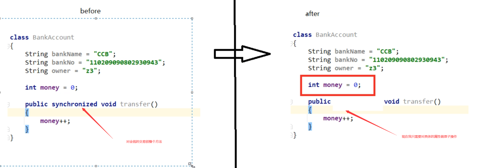
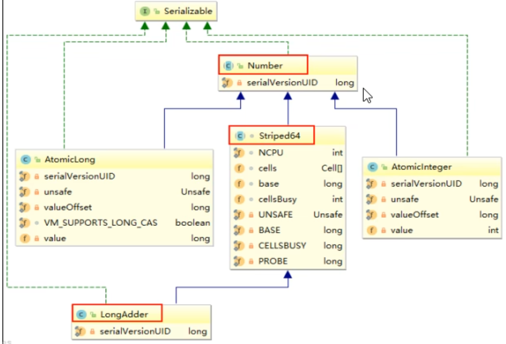
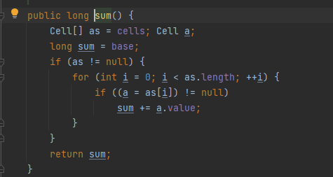
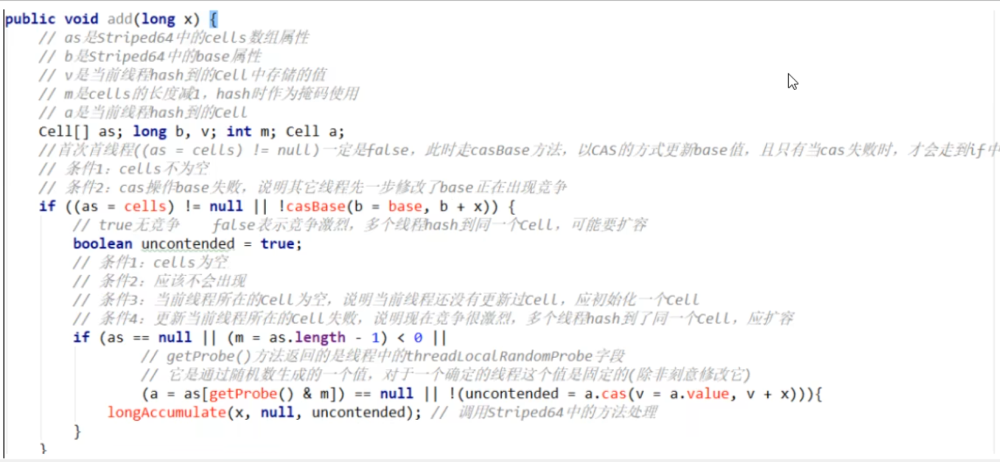
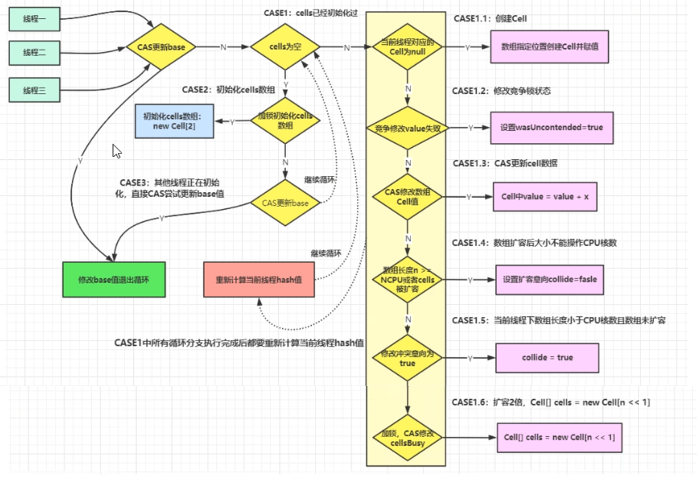

# CAS

## CAS 概述

CAS(compare and swap)，中文翻译为**比较并交换**，实现并发算法时常用到的一种技术，用于保证共享变量的原子性更新，它包含三个操作数：**内存位置、预期原值与更新值**。

执行 CAS 操作的时候，将内存位置的值与预期原值进行比较：

- 如果相匹配，那么处理器会自动将该位置更新为新值。
- 如果不匹配，处理器不做任何操作，多个线程同时执行 CAS 操作只有一个会成功。

```java
/**
 * 原子整型
 */
@Test
public void test1() {
  AtomicInteger atomicInteger = new AtomicInteger(5);
  boolean b1 = atomicInteger.compareAndSet(5, 2024);
  System.out.println(STR."b1 result:  = \{b1}");
  boolean b2 = atomicInteger.compareAndSet(5, 2024);
  System.out.println(STR."b2 result:  = \{b2}");
}

/**
 * 原子引用
 */
@Test
public void test2() {
  AtomicReference<Student> atomicReference = new AtomicReference<>();
  Student lucy = new Student(1, "lucy", "c1");
  Student lily = new Student(2, "lily", "c4");
  atomicReference.set(lucy);
  boolean b1 = atomicReference.compareAndSet(lucy, lily);
  System.out.println(STR."b1 result:  = \{b1}");
  boolean b2 = atomicReference.compareAndSet(lucy, lily);
  System.out.println(STR."b2 result:  = \{b2}");
}
```

多线程环境中的线程安全用法：

- 使用 `synchronized`

  ```java
  /**
   * 多线程环境安全用法一: 使用 synchronized 和 volatile
   */
  private volatile int count = 0;
  
  public synchronized void countInc() {
    count++;
  }
  
  public int getCount() {
    return count;
  }
  ```

- 使用原子类

  ```java
  /**
   * 多线程环境安全用法二: 使用 原子类
   */
  private AtomicInteger atomicCount = new AtomicInteger(0);
  
  public void atomicCountInc() {
    atomicCount.incrementAndGet();
  }
  
  public int getAtomicCount() {
    return atomicCount.get();
  }
  ```

## CAS 原理

### Unsafe 类

`Unsafe` 类是 CAS 的核心类，由于 Java 方法无法直接访问底层系统，需要通过本地（`native`）方法来访问，`Unsafe` 相当于一个后门，基于该类可以直接操作特定内存的数据。

`Unsafe` 类存在于 `sun.misc` 包中，其内部方法操作可以像 C 的指针一样直接操作内存，因此 Java 中 CAS 操作的执行依赖于 `Unsafe` 类的方法。

> 注意：`Unsafe` 类中的所有方法都是 `native` 修饰的，也就是说 `Unsafe` 类中的所有方法都直接调用操作系统底层资源执行相应任务。

CAS 并发原语体现在 Java 语言中就是 `sun.misc.Unsafe` 类中的各个方法。调用 `Unsafe` 类中的 CAS 方法，JVM 会帮我们实现出 CAS 汇编指令。这是一种完全依赖于硬件的功能，通过它实现了原子操作。再次强调，由于 CAS 是一种系统原语，原语属于操作系统用语范畴，是由若干条指令组成的，用于完成某个功能的一个过程，并且原语的执行必须是连续的，在执行过程中不允许被中断，也就是说 CAS 是一条 CPU 的原子指令，不会造成所谓的数据不一致问题。

`AtomicInteger` 类主要利用 CAS + `volatile` 和 `native` 方法来保证原子操作，从而**避免 `synchronized` 的高开销**，执行效率大为提升。

### 分析

**问题**：我们知道 `i++` 是线程不安全的，那 `AtomicInteger.getAndIncrement()` 如何保证原子性？

**分析**：



假设线程 A 和线程 B 两个线程同时执行 `getAndAddInt` 操作（分别跑在不同CPU上）：

1. `Atomiclnteger` 里面的 value 原始值为 3，即主内存中 `Atomiclnteger` 的 value 为 3，根据 JMM 模型，线程 A 和线程 B 各自持有
   份值为 3 的 value 的副本分别到各自的工作内存。
2. 线程 A 通过 `getIntVolatile(var1, var2)` 拿到 value 值 3，这时线程 A 被挂起。
3. 线程 B 也通过 `getIntVolatile(var1, var2)` 方法获取到 value 值3，此时刚好线程 B 没有被挂起并执行 `compareAndSwapInt` 方法
   比较内存值也为 3，成功修改内存值为 4，线程 B 结束，一切正常。
4. 这时线程 A 恢复，执行 `compareAndSwapInt` 方法比较，发现自己手里的值数字 3 和主内存的值数宇 4 不一致，说明该值己经被其它线程抢先一步修改过了，那 A 线程本次修改失败，只能重新读取重新来一遍了。
5. 线程 A 重新获取 value 值，因为变量 value 被 volatile 修饰，所以其它线程对它的修改，线程 A 总是能够看到，线程 A 继续执行 `compareAndSwapInt` 进行比较替换，直到成功。

### 底层汇编



JDK 提供的 CAS 机制，在汇编层级会禁止变量两侧的指令优化，然后使用 `compxchg` 指令比较并更新变量值（原子性）

总结：

- CAS 是靠硬件实现的效率提升，由硬件来保证原子性和可见性
- 实现方式是基于硬件平台的汇编指令，在 intel 的 CPU 中，使用的是汇编指令 `compxchg` 指令
- 核心思想就是比较要更新变量的值和预期值，相等才会更新，不相等就自旋重来

## CAS 与自旋锁

CAS 是实现自旋锁的基础，CAS **利用 CPU 指令保证了操作的原子性**，以达到锁的效果。

自旋锁是指尝试获取锁的线程不会立即阻塞，而是**采用循环的方式去尝试获取锁**，当线程发现锁被占用时，会不断循环判断锁的状态，直到获取。这样的好处是减少线程上下文切换的消耗，缺点是循环会消耗 CPU。

### 原子类实现自旋锁

```java
public class SpinLockTest {

  AtomicReference<Thread> atomicReference = new AtomicReference<>();

  public void lock() {
    Thread thread = Thread.currentThread();
    System.out.println(STR."\{Thread.currentThread().getName()}\t come in");
    while (!atomicReference.compareAndSet(null, thread)) {

    }
  }

  public void unLock() {
    Thread thread = Thread.currentThread();
    atomicReference.compareAndSet(thread, null);
    System.out.println(STR."\{Thread.currentThread().getName()}\t task over,unLock.........");
  }

  @Test
  public void test1() {
    Thread t1 = new Thread(() -> {
      lock();
      try {
        Thread.sleep(5000);
      } catch (InterruptedException e) {
        e.printStackTrace();
      } finally {
        unLock();
      }
    }, "t1");
    t1.start();

    try {
      Thread.sleep(500);
    } catch (InterruptedException e) {
      e.printStackTrace();
    }

    Thread t2 = new Thread(() -> {
      lock();
      unLock();
    }, "t2");
    t2.start();

    try {
      t1.join();
      t2.join();
    } catch (InterruptedException e) {
      throw new RuntimeException(e);
    }
  }
}
```

### CAS 自旋锁缺点

1. `getAndAddInt` 方法有一个 `do while`，如果失败，会一直进行尝试，如果 CAS 长时间一直不成功，可能会给 CPU 带来很大开销
2. ABA 问题：
   1. CAS 算法实现前提需要提取出内存中某时刻的数据并在当下时刻比较并替换，那么在这个时间差类会导致数据的变化。
   2. 比如一个线程1从内存位置V中取出A，这时候另一个线程2也从内存中取出A，并且线程2进行了一些操作将值变成了B，然后线程2又将V位置的数据变成A，这时候线程1进行CAS操作发现内存中仍然是A，符合预期，然后线程1操作成功。尽管线程1的CAS操作成功，但是不代表这个过程就是没有问题的。
   3. 使用版本号邮戳原子引用 `AtomicStampedReference<V>` 来解决。

使用 AtomicStampedReference 解决 ABA 问题：

```java
/**
 * 测试 ABA 问题的发生
 */
@Test
public void test1() {
  AtomicInteger atomicInteger = new AtomicInteger(100);

  Thread t1 = new Thread(() -> {
    atomicInteger.compareAndSet(100, 101);
    try {
      Thread.sleep(10);
    } catch (InterruptedException e) {
      e.printStackTrace();
    }
    atomicInteger.compareAndSet(101, 100);
  }, "t1");
  t1.start();

  Thread t2 = new Thread(() -> {
    try {
      Thread.sleep(20);
    } catch (InterruptedException e) {
      e.printStackTrace();
    }
    boolean b = atomicInteger.compareAndSet(100, 2023);
    System.out.println(STR."t2 result: \{b}; value: \{atomicInteger.get()}");
  }, "t2");
  t2.start();

  try {
    t1.join();
    t2.join();
  } catch (InterruptedException e) {
    e.printStackTrace();
  }
}


/**
 * 使用 AtomicStampedReference 解决 ABA 问题
 * 单线程测试
 */
@Test
public void test2() {
  Student lucy = new Student(1, "lucy", "c1");
  Student lily = new Student(2, "lily", "c4");
  AtomicStampedReference<Student> atomicStampedReference = new AtomicStampedReference<>(lucy, 1);
  boolean b = atomicStampedReference.compareAndSet(lucy, lily, atomicStampedReference.getStamp(), atomicStampedReference.getStamp() + 1);
  System.out.println(STR."\{atomicStampedReference.getReference()} = \{atomicStampedReference.getStamp()} = \{b}");
  b = atomicStampedReference.compareAndSet(lily, lucy, atomicStampedReference.getStamp(), atomicStampedReference.getStamp() + 1);
  System.out.println(STR."\{atomicStampedReference.getReference()} = \{atomicStampedReference.getStamp()} = \{b}");
}

/**
 * 使用 AtomicStampedReference 解决 ABA 问题
 * 多线程测试
 */
@Test
public void test3() {
  Student lucy = new Student(1, "lucy", "c1");
  Student lily = new Student(2, "lily", "c4");
  Student tom = new Student(3, "tom", "c6");
  AtomicStampedReference<Student> atomicStampedReference = new AtomicStampedReference<>(lucy, 1);

  Thread t1 = new Thread(() -> {
    int stamp = atomicStampedReference.getStamp();
    System.out.println(STR."t1 first stamp: \{stamp}");
    try {
      Thread.sleep(500);
    } catch (InterruptedException e) {
      e.printStackTrace();
    }
    boolean b = atomicStampedReference.compareAndSet(lucy, lily, stamp, stamp + 1);
    stamp = atomicStampedReference.getStamp();
    System.out.println(STR."t1 modify 1 result: \{b}; ref: \{atomicStampedReference.getReference()}; stamp: \{stamp}");

    b = atomicStampedReference.compareAndSet(lily, lucy, stamp, stamp + 1);
    stamp = atomicStampedReference.getStamp();
    System.out.println(STR."t1 modify 2 result: \{b}; ref: \{atomicStampedReference.getReference()}; stamp: \{stamp}");
  }, "t1");
  t1.start();

  Thread t2 = new Thread(() -> {
    int stamp = atomicStampedReference.getStamp();
    System.out.println(STR."t2 first stamp: \{stamp}");
    try {
      Thread.sleep(1000);
    } catch (InterruptedException e) {
      e.printStackTrace();
    }
    boolean b = atomicStampedReference.compareAndSet(lucy, tom, stamp, stamp + 1);
    stamp = atomicStampedReference.getStamp();
    System.out.println(STR."t2 modify result: \{b}; ref: \{atomicStampedReference.getReference()}; stamp: \{stamp}");
  }, "t2");
  t2.start();

  try {
    t1.join();
    t2.join();
  } catch (InterruptedException e) {
    e.printStackTrace();
  }
}
```

## 原子操作类

Atomic 是指一个操作是不可中断的。即使是在多个线程一起执行的时候，一个操作一旦开始，就不会被其他线程干扰。

### 基本类型原子类

- `AtomicInteger`：整型原子类
- `AtomicBoolean`：布尔型原子类
- `AtomicLong`：长整型原子类

#### 常用 API

```java
public final int get() // 获取当前的值
public final int getAndSet(int newValue) // 获取当前的值，并设置新的值
public final int getAndIncrement() // 获取当前的值，并自增
public final int getAndDecrement() // 获取当前的值，并自减
public final int getAndAdd(int delta) // 获取当前的值，并加上预期的值
boolean compareAndSet(int expect, int update) // 如果输入的数值等于预期值，则以原子方式将该值设置为输入值（update）
public final void lazySet(int newValue) // 最终设置为 newValue, 使用 lazySet 设置之后可能导致其他线程在之后的一小段时间内还是可以读到旧的值。
```

#### 示例

```java
@Test
public void test() {
  final int size = 50;
  AtomicInteger atomicInteger = new AtomicInteger();
  CountDownLatch countDownLatch = new CountDownLatch(size);
  for (int i = 0; i < size; i++) {
    new Thread(() -> {
      try {
        for (int j = 0; j < 10; j++) {
          atomicInteger.getAndIncrement();
        }
      } finally {
        countDownLatch.countDown();
      }
    }, STR."t\{i}").start();
  }

  try {
    countDownLatch.await();
  } catch (InterruptedException e) {
    throw new RuntimeException(e);
  }

  System.out.println(STR."atomicInteger = \{atomicInteger.get()}");
}
```

### 数组类型原子类

- `AtomicIntegerArray`：整型数组原子类
- `AtomicLongrArray`：长整型数组原子类
- `AtomicReferenceArray`：引用类型数组原子类

#### 常用 API

```java
public final int get(int i) //获 取 index=i 位置元素的值
public final int getAndSet(int i, int newValue) // 返回 index=i 位置的当前的值，并将其设置为新值：newValue
public final int getAndIncrement(int i) // 获取 index=i 位置元素的值，并让该位置的元素自增
public final int getAndDecrement(int i) // 获取 index=i 位置元素的值，并让该位置的元素自减
public final int getAndAdd(int i, int delta) // 获取 index=i 位置元素的值，并加上预期的值
boolean compareAndSet(int i, int expect, int update) // 如果输入的数值等于预期值，则以原子方式将 index=i 位置的元素值设置为输入值（update）
public final void lazySet(int i, int newValue) // 最终将 index=i 位置的元素设置为 newValue,使用 lazySet 设置之后可能导致其他线程在之后的一小段时间内还是可以读到旧的值。
```

#### 示例

```java
@Test
public void test2() {
  AtomicIntegerArray atomicIntegerArray = new AtomicIntegerArray(new int[5]);
  int tempInt;
  tempInt = atomicIntegerArray.getAndSet(0, 2023);
  System.out.println(STR."index[0].src: \{tempInt}; index[0].dst: \{atomicIntegerArray.get(0)}");
  tempInt = atomicIntegerArray.getAndIncrement(0);
  System.out.println(STR."index[0].src: \{tempInt}; index[0].dst: \{atomicIntegerArray.get(0)}");
}
```

### 引用类型原子类

- `AtomicReference` :引用类型原子类
- `AtomicStampedReference`：原子更新带有版本号的引用类型。该类将整数值与引用关联起来，可用于解决原子的更新数据和数据的版本号，可以解决使用 CAS 进行原子更新时可能出现的 ABA 问题。记录修改次数。

- `AtomicMarkableReference`：原子更新带有标记的引用类型。该类将 boolean 标记与引用关联起来。将标记戳简化为 true/false，用于记录是否修改过。

#### 常用 API

```java
public final int getReference() // 获取当前引用值
public final int getStamp() // 获取当前邮戳号
public final int isMarked() // 获取当前标记
boolean compareAndSet // 如果输入的数值等于预期值，则以原子方式将该值设置为输入值
```

#### 示例

```java
@Test
public void test3() {
  Student lucy = new Student(1, "lucy", "c1");
  Student lily = new Student(2, "lily", "c4");
  Student tom = new Student(3, "tom", "c6");
  AtomicMarkableReference<Student> atomicMarkableReference = new AtomicMarkableReference<>(lucy, false);
  CountDownLatch latch = new CountDownLatch(2);

  Thread t1 = new Thread(() -> {
    boolean marked = atomicMarkableReference.isMarked();
    System.out.println(STR."t1 first expect mark: \{marked}");
    try {
      Thread.sleep(500);
    } catch (InterruptedException e) {
      e.printStackTrace();
    }
    boolean b = atomicMarkableReference.compareAndSet(lucy, lily, marked, !marked);
    System.out.println(STR."t1 modify 1 result: \{b}; ref: \{atomicMarkableReference.getReference()};");

//    marked = atomicMarkableReference.isMarked();
//    System.out.println(STR."t1 second expect mark: \{marked}");
//
//    b = atomicMarkableReference.compareAndSet(lily, lucy, marked, !marked);
//    System.out.println(STR."t1 modify 2 result: \{b}; ref: \{atomicMarkableReference.getReference()};");
//    latch.countDown();
  }, "t1");
  t1.start();

  Thread t2 = new Thread(() -> {
    boolean marked = atomicMarkableReference.isMarked();
    System.out.println(STR."t2 first expect mark: \{marked}");
    try {
      Thread.sleep(1000);
    } catch (InterruptedException e) {
      e.printStackTrace();
    }
    boolean b = atomicMarkableReference.compareAndSet(lucy, tom, marked, !marked);
    System.out.println(STR."t2 modify result: \{b}; ref: \{atomicMarkableReference.getReference()};");
    latch.countDown();
  }, "t2");
  t2.start();

  try {
    latch.await();
  } catch (InterruptedException e) {
    throw new RuntimeException(e);
  }
```

### 字段修改原子类

- `AtomicIntegerFieldUpdater`：原子更新对象中int类型字段的值
- `AtomicLongFieldUpdater`：原子更新对象中Long类型字段的值
- `AtomicReferenceFieldUpdater`：原子更新对象中引用类型字段的值

#### 使用目的

以一种线程安全的方式操作非线程安全对象内的某些字段



#### 使用要求

- 更新的对象属性必须使用 `public volatile` 修饰符
- 因为对象的属性修改类型原子类都是抽象类，所以每次使用都必须使用静态方法 `newUpdater()` 创建一个更新器，并且需要设置想要更新的类和属性

#### 示例

AtomicIntegerFieldUpdater 使用案例：

```java
class BankAccount {
  public volatile int money = 0;
  AtomicIntegerFieldUpdater<BankAccount> atomicIntegerFieldUpdater = AtomicIntegerFieldUpdater.newUpdater(BankAccount.class, "money");

  public void transferMoney(BankAccount bankAccount) {
    atomicIntegerFieldUpdater.getAndIncrement(bankAccount);
  }
}

// 10个线程各自转赠 1000
@Test
public void test4() {
  BankAccount bankAccount = new BankAccount();
  CountDownLatch countDownLatch = new CountDownLatch(10);
  for (int i = 1; i <= 10; i++) {
    new Thread(() -> {
      try {
        for (int j = 1; j <= 1000; j++) {
          bankAccount.transferMoney(bankAccount);
        }
      } finally {
        countDownLatch.countDown();
      }
    }, STR."t\{i}").start();

  }
  try {
    countDownLatch.await();
  } catch (InterruptedException e) {
    throw new RuntimeException(e);
  }
  System.out.println(STR."result: \{bankAccount.money}");
}
```

AtomicReferenceFieldUpdater 使用案例：

```java
class MyStudent {
  public volatile String student = "lucy";
  AtomicReferenceFieldUpdater<MyStudent, String> updater = AtomicReferenceFieldUpdater.newUpdater(MyStudent.class, String.class, "student");

  public void modify(MyStudent myStudent) {
    if (updater.compareAndSet(myStudent, "lucy", "lily")) {
      System.out.println(STR."\{Thread.currentThread().getName()} thread start modify, need 2 secondes");
      try {
        Thread.sleep(2000);
      } catch (InterruptedException e) {
        e.printStackTrace();
      }
      System.out.println(STR."\{Thread.currentThread().getName()} thread over, modify sucess");
    } else {
      System.out.println(STR."\{Thread.currentThread().getName()} thread over, modify failed");
    }
  }
}

@Test
public void test5() {
  MyStudent myStudent = new MyStudent();
  System.out.println(STR."my student is = \{myStudent.student}");
  CountDownLatch countDownLatch = new CountDownLatch(5);
  for (int i = 1; i <= 5; i++) {
    new Thread(() -> {
      try {
        myStudent.modify(myStudent);
      } finally {
        countDownLatch.countDown();
      }
    }, STR."t\{i}").start();
  }
  try {
    countDownLatch.await();
  } catch (InterruptedException e) {
    throw new RuntimeException(e);
  }
  System.out.println(STR."modify finish, my student is = \{myStudent.student}");
}
```

### 原子操作增强类

- `DoubleAccumulator`：一个或多个变量，它们一起保持运行double使用所提供的功能更新值
- `DoubleAdder`：一个或多个变量一起保持初始为零double总和
- `LongAccumulator`：一个或多个变量，一起保持使用提供的功能更新运行的值long ，提供了自定义的函数操作
- `LongAdder`：一个或多个变量一起维持初始为零long总和（重点），只能用来计算加法，且从0开始计算

#### 常用 API

```java
void add(long x) // 将当前的 value 加 x
void increment() // 将当前的 value 加 1
void decrement() // 将当前的 value 减 1
long sum() // 返回当前值。特别注意，在没有并发更新 value 的情况下，返回精确值，存在并发更新时，sum 不能保证返回精确值
void reset() // 将 value 重置为 0，可用于替代重新 new 一个 LongAdder，但此方法只用于没有并发更新的情况
long sumThenReset() // 获取当前的 value，并将 value 重置为 0
```

#### 示例

热点商品点赞计算器，点赞数加加统计，不要求实时精确

```java
public class LikeCounterTestCase {

  int counter = 0;

  public synchronized void clickBySynchronized() {
    counter++;
  }

  AtomicLong atomicLong = new AtomicLong(0);

  public void clickByAtomicLong() {
    atomicLong.getAndIncrement();
  }

  LongAdder longAdder = new LongAdder();

  public void clickByLongAdder() {
    longAdder.increment();
  }

  LongAccumulator longAccumulator = new LongAccumulator(Long::sum, 0);

  public void clickByLongAccumulator() {
    longAccumulator.accumulate(1);
  }

  public static final int CYCLE_NUM = 100000;
  public static final int THREAD_NUM = 50;
  CountDownLatch countDownLatch;
  long startTime;
  long endTime;

  @Test
  public void test1() throws InterruptedException {
    startTime = System.currentTimeMillis();
    countDownLatch = new CountDownLatch(THREAD_NUM);
    for (int i = 0; i < THREAD_NUM; i++) {
      new Thread(() -> {
        try {
          for (int j = 0; j < CYCLE_NUM; j++) {
            clickBySynchronized();
          }
        } finally {
          countDownLatch.countDown();
        }
      }, "t").start();
    }
    countDownLatch.await();
    endTime = System.currentTimeMillis();
    System.out.println(STR."点赞次数为: \{counter}; 使用 synchronized 花费时间: \{endTime - startTime}ms");

    startTime = System.currentTimeMillis();
    countDownLatch = new CountDownLatch(THREAD_NUM);
    for (int i = 0; i < THREAD_NUM; i++) {
      new Thread(() -> {
        try {
          for (int j = 0; j < CYCLE_NUM; j++) {
            clickByAtomicLong();
          }
        } finally {
          countDownLatch.countDown();
        }
      }, "t").start();
    }
    countDownLatch.await();
    endTime = System.currentTimeMillis();
    System.out.println(STR."点赞次数为: \{counter}; 使用 AtomicLong 花费时间: \{endTime - startTime}ms");

    startTime = System.currentTimeMillis();
    countDownLatch = new CountDownLatch(THREAD_NUM);
    for (int i = 0; i < THREAD_NUM; i++) {
      new Thread(() -> {
        try {
          for (int j = 0; j < CYCLE_NUM; j++) {
            clickByLongAdder();
          }
        } finally {
          countDownLatch.countDown();
        }
      }, "t").start();
    }
    countDownLatch.await();
    endTime = System.currentTimeMillis();
    System.out.println(STR."点赞次数为: \{counter}; 使用 LongAdder 花费时间: \{endTime - startTime}ms");

    startTime = System.currentTimeMillis();
    countDownLatch = new CountDownLatch(THREAD_NUM);
    for (int i = 0; i < THREAD_NUM; i++) {
      new Thread(() -> {
        try {
          for (int j = 0; j < CYCLE_NUM; j++) {
            clickByLongAccumulator();
          }
        } finally {
          countDownLatch.countDown();
        }
      }, "t").start();
    }
    countDownLatch.await();
    endTime = System.currentTimeMillis();
    System.out.println(STR."点赞次数为: \{counter}; 使用 LongAccumulator 花费时间: \{endTime - startTime}ms");
  }
}
```

#### 分析

架构：



如果是 JDK8，推荐使用 `LongAdder` 对象，比 `AtomicLong` 性能更好（减少乐观锁的重试次数）

`LongAdder` 是 `Striped64` 的子类，`Striped64` 的基本结构


`Striped64` 中一些变量或者方法的定义：

- `base`：类似于 `AtomicLong` 中全局的 value 值。在没有竟争情况下数据直接累加到 base 上，或者 cells 扩容时，也需要将数据写入到 base 上。
- `collide`：表示扩容意向，false 一定不会扩容，true 可能会扩容。
- `cellsBusy`：初始化 cells 或者扩容 cells 需要获取锁，0:表示无锁状态 1:表示其他线程已经持有了锁。
- `casCellsBusy()`：通过 CAS 操作修改 cellsBusy 的值，CAS 成功代表获取锁，返回 true。
- `NCPU`：当前计算机 CPU 数量，Cell 数组扩容时会使用到。
- `getProbe()`：获取当前线程的 hash 值。
- `advanceProbe()`：重置当前线程的 hash 值。

> `cell`：是 `java.util.concurrent.atomic` 下 `Striped64` 的一个内部类

`LongAdder` 为什么这么快？

- 内部有一个 base 变量，一个 Cell[] 数组

  - `base` 变量：低并发，直接累加到该变量上
  - `Cell[]` 数组：高并发，累加进各个线程自己的槽 `Cell[i]` 中

- 在无竞争的情况下，跟 AtomicLong 一样，对同一个 base 进行操作

- 当出现竞争关系时，采用**化整为零分散热点**的做法，用空间换时间，将 value 值分散到一个 Cell 数组中。多个线程同时对value进行操作时，通过线程 id 得到 hash 值，各个线程只对自己槽中的那个值进行 CAS 操作。当所有线程操作完毕，将数组 cells 的所有值和 base 都加起来作为最终结果。

- `sum()` 会将所有的 Cell 数组中的 value 和 base 累加作为返回值。sum 执行时，并没有限制对 base 和 cells 的更新，所以 **LongAdder 不是强一致性的，它是最终一致性的**，对 cell 的读取无法保证是最后一次写入的值，所以在没有并发的场景下，可以获得正确的结果。

  

- `add()`

  - 如果 Cells 表为空，尝试用 CAS 更新 base 字段，成功则退出

  - 如果 Cells 表为空，CAS 更新 bas e字段失败，出现竞争，uncontended 为 true，调用 longAccumulate（新建数组）

  - 如果 Cells 表非空，但当前线程映射的槽为空，uncontended 为 true，调用 longAccumulate（初始化）

  - 如果 Cells 表非空，且当前线程映射的槽非空，CAS 更新 Cell 的值，成功则返回，否则，uncontended 设为 false，调用 longAccumulate（扩容）

    

- `longAccumulate`

  

#### 总结

- `AtomicLong`

- - 原理：CAS + 自旋
  - 场景：低并发下的全局计算，`AtomicLong` 能保证并发情况下计数的准确性，其内部通过 CAS 来解决并发安全性问题
  - 缺陷：高并发后性能急剧下降，`AtomicLong` 的自旋会成为瓶颈（N 个线程 CAS 操作修改线程的值，每次只有一个成功过，其他 N-1 失败，失败的不停自旋直至成功，这样大量失败自旋的情况下会耗 CPU）

- `LongAdder`

- - 原理：CAS + Base + Cell 数组分散，空间换时间并分散了热点数据
  - 场景：高并发下的全局计算
  - 缺陷：sum 求和后还有计算线程修改结果的话，最后结果不够准确