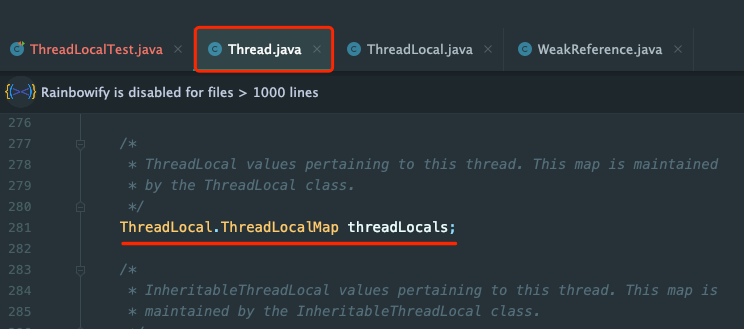
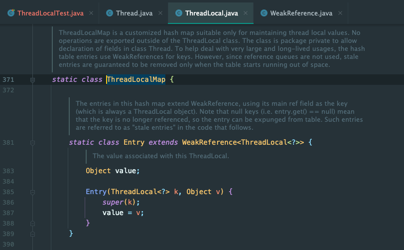
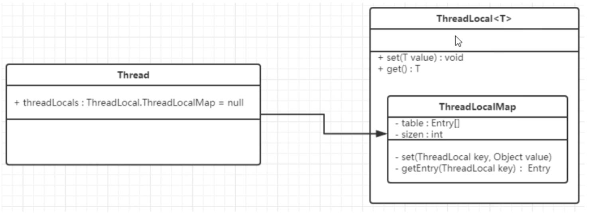
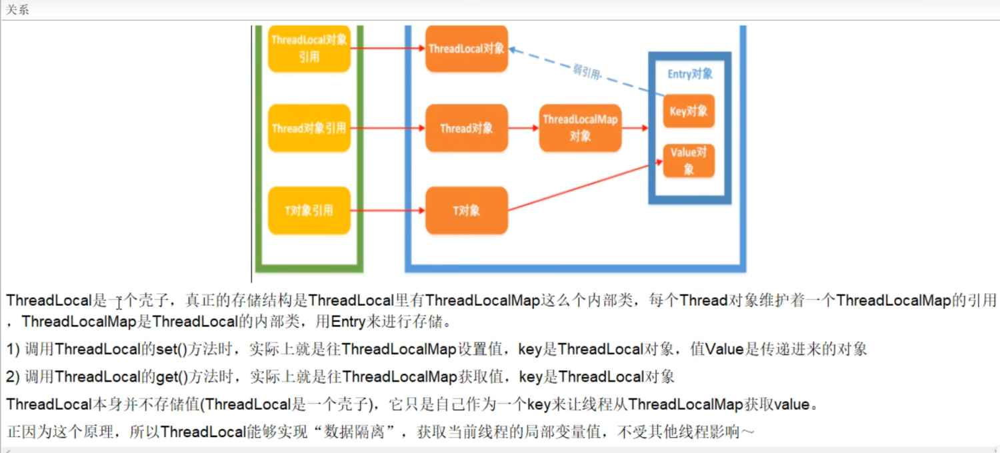
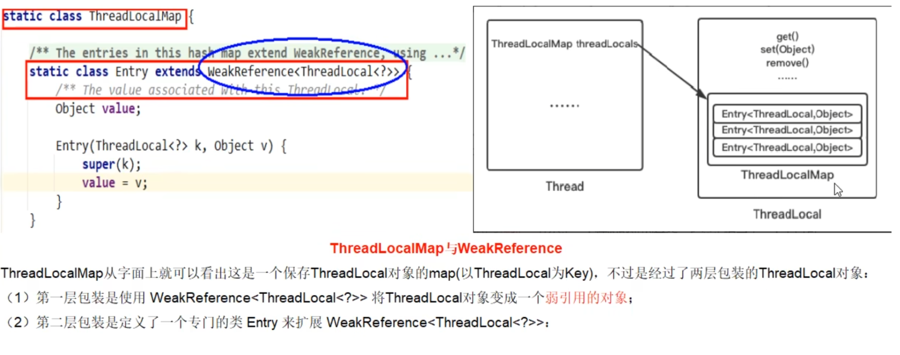
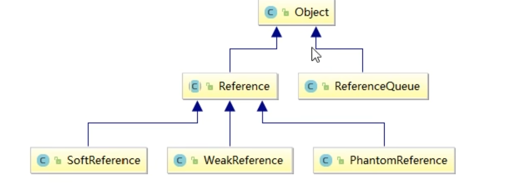
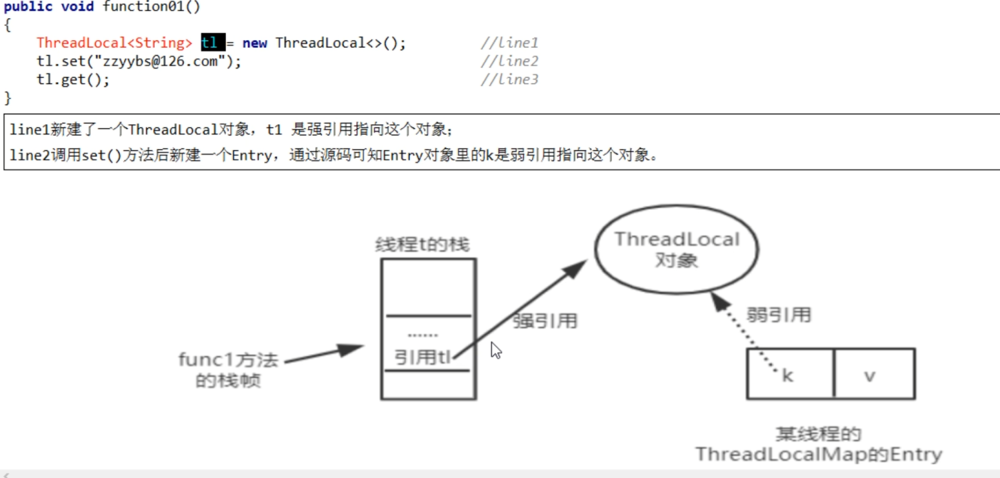
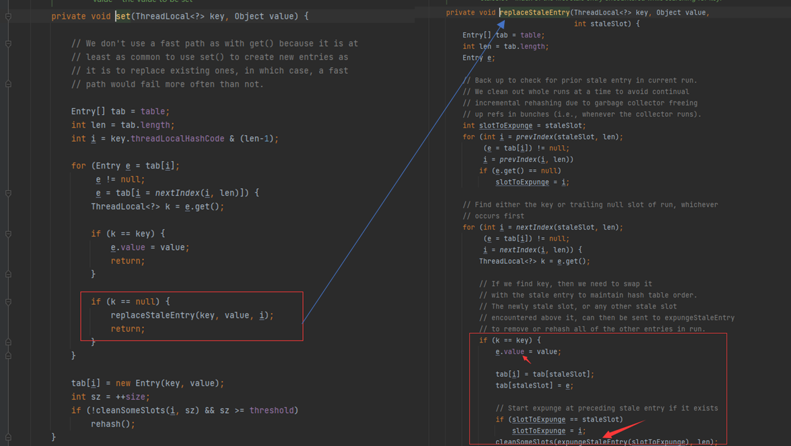
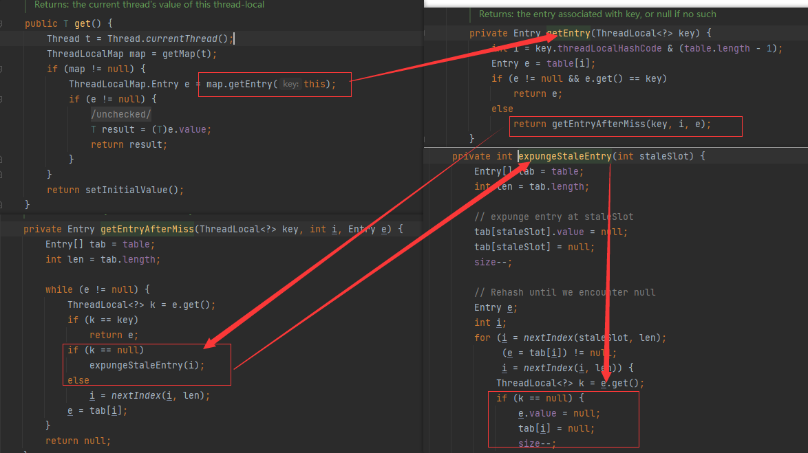

# ThreadLocal

## ThreadLocal 简介

### 概念

ThreadLocal 提供线程局部变量。这些局部变量与正常变量不同，每一个线程在访问 ThreadLocal 实例的时候（通过其 get 或 set 方法）都有自己的、独立初始化的变量副本，避免了线程安全问题。

ThreadLocal 实例通常是类中的私有静态字段，使用它的目的是希望将状态（例如用户 ID 或事务 ID）与线程关联起来。

### API

- `T get()` : 返回当前线程的线程局部变量的副本中的值。
- `protected T initialValue()` : 返回此线程局部变量的当前线程的初始值。
- `void remove()` : 删除此线程局部变量的当前线程的值。
- `void set(T value)` : 将当前线程的线程局部变量的副本设置为指定的值。
- `static <S> ThreadLocal<S> withInitial(Supplier <? extends S> supplier)` : 创建线程局部变量。

### 示例

需求一：5个销售卖房子，按照总销售额进行统计。

```java
/**
 * 5个销售卖房子，按照总销售额进行统计
 */
class House1 {
  LongAdder saleCount = new LongAdder();

  public void saleHouse() {
    saleCount.increment();
  }
}

@Test
public void test1() {
  House1 house = new House1();
  for (int i = 1; i <= 5; i++) {
    new Thread(() -> {
      int size = new Random().nextInt(5) + 1;
      System.out.println(size);
      for (int j = 1; j <= size; j++) {
        house.saleHouse();
      }
    }, String.valueOf(i)).start();
  }

  try {
    Thread.sleep(300);
  } catch (InterruptedException e) {
    e.printStackTrace();
  }

  System.out.println(STR."共计卖出 \{house.saleCount} 套");
}
```

需求二：5个销售卖房子，按照各个销售的销售额进行统计。

```java
/**
 * 5个销售卖房子，按照各个销售的销售额进行统计
 */
class House2 {
  LongAdder saleCount = new LongAdder();

  public void saleHouse() {
    saleCount.increment();
  }

  ThreadLocal<Integer> saleVolume = ThreadLocal.withInitial(() -> 0);

  public void saleVolumeByThreadLocal() {
    saleVolume.set(saleVolume.get() + 1);
  }
}

@Test
public void test2() {
  House2 house = new House2();
  for (int i = 1; i <= 5; i++) {
    new Thread(() -> {
      int size = new Random().nextInt(5) + 1;
      try {
        for (int j = 0; j < size; j++) {
          house.saleHouse(); // 用于比较总数
          house.saleVolumeByThreadLocal();
        }
        System.out.println(STR."\{Thread.currentThread().getName()}号销售卖出：\{house.saleVolume.get()}");
      } finally {
        house.saleVolume.remove();
      }
    }, String.valueOf(i)).start();
  }

  try {
    Thread.sleep(300);
  } catch (InterruptedException e) {
    e.printStackTrace();
  }

  System.out.println(STR."共计卖出 \{house.saleCount} 套");
}
```

### 总结

- 因为每个 `Thread` 内有**自己的实例副本**且该副本**只有当前线程自己使用**。
- 既然其他 `ThreadLocal` 不可访问，那就不存在多线程间共享问题。
- 统一设置初始值，但是每个线程对这个值得修改都是各自线程互相独立的。
- 如何才能不争抢

- - 加入 `synchronized` 或者 `Lock` 控制资源的访问顺序。
  - 使用 `ThreadLocal` 设置线程局部变量，各个线程人手一份。

## ThreadLocal 源码分析

- `Thread` 类中有一个 `ThreadLocal.ThreadLocalMap` 变量



- `ThreadLocalMap` 是 `ThreadLocal` 中的一个静态内部类

  

- `Thread、ThreadLocal、ThreadLocalMap` 三者关系

  - `ThreadLocalMap` 实际上就是一个以 `ThreadLocal` 实例为 Key，任意对象为 value 的 Entry 对象
  - 为 `ThreadLocal` 变量赋值，实际上就是以当前 `ThreadLocal` 实例为 Key，值为 value 的 Entry 往这个 `ThreadLocalMap` 中存放

  



## ThreadLocal 内存泄露问题

内存泄露，就是不再使用的内存被占用不能回收。

### 问题点

ThreadLocalMap：



### 强软弱虚引用



- 强引用

  对于强引用的对象，处于可达状态，，就算是出现了 OOM 也**不会对该对象进行回收**，因此强引用是造成Java内存泄露的主要原因之一。

- 软引用

  软引用是一种相对强引用弱化了一些的引用，对于只有软引用的对象而言，当系统内存充足时，不会被回收，**当系统内存不足时，会被回收**，软引用通常用在对内存敏感的程序中，比如高速缓存，内存够用就保留，不够用就回收。

- 弱引用

  比软引用的生命周期更短，对于只有弱引用的对象而言，不管JVM的内存空间是否足够，**只要垃圾回收机制一运行，都会回收该对象占用的内存**。

- 虚引用

  **虚引用必须和引用队列联合使用**，如果一个对象仅持有虚引用，那么它就和没有任何引用一样，在任何时候都有可能被垃圾回收器回收，它不能单独使用也**不能通过它访问对象**。

  虚引用的主要作用是**跟踪对象被垃圾回收的状态**。仅仅是提供了一种确保对象被 `finalize` 后，做某些事情的通知机制。换句话说就是在对象被 GC 的时候会收到一个系统通知或者后续添加进一步的处理，用来实现比 `finalize` 机制更灵活的回收操作。

- 软引用和弱引用的使用场景

  假如有一个应用需要读取大量的本地图片：如果每次读取图片都从硬盘读取则会严重影响性能，如果一次性全部加载到内存中又可能会造成内存溢出。此时使用软应用来解决，设计思路时：用一个 `HashMap` 来保存图片的路径和与相应图片对象关联的软引用之间的映射关系，在内存不足时，JVM会自动回收这些缓存图片对象所占用的空间，有效避免了 OOM 的问题

```java
public class ReferenceTest {

  public class ObjDemo {
    public int field = 123;

    @Override
    protected void finalize() throws Throwable {
      super.finalize();
      System.out.println("ObjDemo 对象被回收");
    }
  }

  /**
     * 强引用, 执行需要配置 jvm 参数 -Xms10m -Xmx10m
     * 结果即使出现 OOM 也不会回收对象
     */
  @Test
  public void test1() {
    ObjDemo demo = new ObjDemo();
    byte[] bytes = new byte[10 * 1024 * 1024];
    System.out.println(STR."bytes.length = \{bytes.length}");
  }

  /**
     * 软引用, 执行需要配置 jvm 参数 -Xms10m -Xmx10m
     * GC 时 如果空间够用不回收, 不够用再回收
     */
  @Test
  public void test2() {
    SoftReference<ObjDemo> objDemoSoftReference = new SoftReference<>(new ObjDemo());
    List<byte[]> bytes = new ArrayList<>();
    for (int i = 1; i <= 10; i++) {
      bytes.add(new byte[i * 1024 * 1024]);
      System.gc();
      System.out.println("第" + i + "次 gc");
      try {
        Thread.sleep(2000);
      } catch (InterruptedException e) {
        e.printStackTrace();
      }
    }
    System.out.println(STR."bytes.length = \{bytes.size()}");
  }

  /**
     * 弱引用
     * GC 时一定会回收
     */
  @Test
  public void test3() {
    WeakReference<ObjDemo> objDemoWeakReference = new WeakReference<>(new ObjDemo());
    System.out.println(Objects.requireNonNull(objDemoWeakReference.get()).field);
    byte[] bytes = new byte[10 * 1024 * 1024];
    System.gc();
    try {
      Thread.sleep(2000);
    } catch (InterruptedException e) {
      e.printStackTrace();
    }
    System.out.println(STR."bytes.length = \{bytes.length}");
  }

  /**
     * 虚引用, 执行需要注释掉目标对象类的 finalize 方法
     * 必须和引用队列 ReferenceQueue 一起使用
     * 虚引用不指向对象, get 不到对象的内容
     * 在任何时候都会被垃圾回收器回收
     * 当被 GC 回收时, 会加入到引用队列中, 实现比 finalize 机制更灵活的回收操作
     */
  @Test
  public void test4() {
    ReferenceQueue<ObjDemo> objectReferenceQueue = new ReferenceQueue<>();
    PhantomReference<ObjDemo> objectPhantomReference = new PhantomReference<>(new ObjDemo(), objectReferenceQueue);
    // 虚引用不指向对象
    // System.out.println(Objects.requireNonNull(objectPhantomReference.get()).field);

    System.gc();
    while (true) {
      if (objectReferenceQueue.poll() != null) {
        System.out.println("虚引用回收到了引用队列");
        break;
      }
    }
  }
}
```

### ThreadLocalMap 内存泄露隐患



- 当方法执行完毕后，栈帧销毁，强引用t1也就没有了，此时线程的 `ThreadLocalMap` 里某个 entry`的`Key 引用还指向这个对象

- 使用弱引用就可以使 `ThreadLocal` 对象在方法执行完毕后顺利被回收且 `entry` 的 `key` 引用指向为 `null`

- 如果当前线程迟迟不结束的话（好比正在使用线程池），这些 `key` 为 `null` 的 `Entry` 的 `value` 就会一直存在一条强引用链

- 虽然弱引用，保证了 `Key` 指向的 ThreadLocal 对象能够被及时回收，但是 v 指向的 `value` 对象是需要 **`ThreadLocalMap` 调用 `get、set` 时发现 `key` 为 `null` 时才会去回收整个 `entry、value`**，因此弱引用不能100%保证内存不泄露，我们**要在不使用某个 `ThreadLocal` 对象后，手动调用 `remove` 方法来删除它**

  

  

  

### 最佳实践

- `ThreadLocal` 一定要初始化，避免空指针异常。
- 建议把 `ThreadLocal` 修饰为 `static`
- 用完记得手动 `remove`

## 总结

- `ThreadLocal` 并不解决线程间共享数据的问题

- `ThreadLocal` 适用于变量在线程间隔离且在方法间共享的场景

- `ThreadLocal` 通过隐式的在不同线程内创建独立实例副本避免了实例线程安全的问题

- 每个线程持有一个只属于它自己的专属 Map 并维护了 `ThreadLocal` 对象与具体实例的映射，该 Map 由于只被持有他的线程访问，故不存在线程安全以及锁的问题

- `ThreadLocalMap` 的 `Entry` 对 `ThreadLocal` 的引用为弱引用。避免了 `ThreadLocal` 对象无法被回收的问题

- 都会通过 `expungeStaleEntry`，`cleanSomeSlots`，`replaceStaleEntry` 这三个方法回收键为 null 的 `Entry` 对象的值（即为具体实例）以及 `Entry` 对象本身从而防止内存泄漏，属于安全加固的方法

  