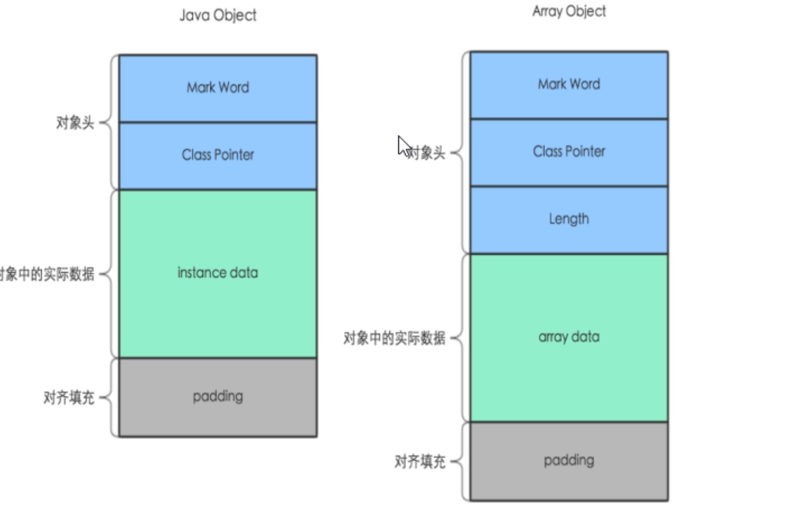
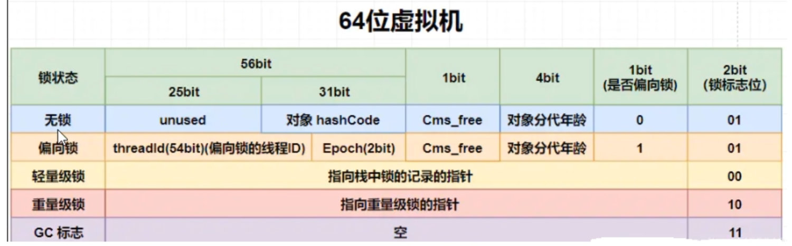

# 对象内存布局

## 内存布局

在 HotSpot 虚拟机里，对象在堆内存的存储布局可以划分为三个部分：对象头（Header）、实例数据（Instance Data） 和对齐填充（Padding）。

- 对象头，包含对象标记（Mark Word）和类型指针（Class Pointer），对象标记占了 8 个字节，类型指针占了 8 个字节，一共是 16 个字节。

- 实例数据：存放类的属性（Field）数据信息，包括父类的属性信息

- 对齐填充：虚拟机要求对象起始地址必须是 **8 字节的整数倍**，填充数据不是必须存在的，仅仅是为了字节对齐，这部分内存按 8 字节补充对齐。



## 对象标记

### 存储内容

- 默认存储对象的 HashCode、GC分代年龄、锁状态标志、线程持有的锁、偏向线程ID、偏向时间戳等。
- 这些信息都是与对象自身定义无关的数据，所以 Mark Word 被设计成一个非固定的数据结构以便在极小的空间内存存储尽量多的数据。
- 它会根据对象的状态复用自己的存储空间，也就是说在运行期间 MarkWord 里存储的数据会随着锁标志位的变化而变化。



### 分析

- 依赖

```java
<dependency>
    <groupId>org.openjdk.jol</groupId>
    <artifactId>jol-core</artifactId>
    <version>0.9</version>
</dependency>
```

- 代码

```java
/**
 * 查看对象头字节占用
 */
@Test
public void test1() {
  Object object = new Object();
  System.out.println(ClassLayout.parseInstance(object).toPrintable());
  Object[] objectArray = new Object[]{};
  System.out.println(ClassLayout.parseInstance(objectArray).toPrintable());
}
```

- 信息


非数组对象，对象头占 8 个字节，类型指针占 4 个字节，填充了 4 个字节，总共 16 字节（不开启压缩类型指针占 8 字节，无填充）

数组对象，对象头占 8 个字节，类型指针占 4 个字节，数组长度 4 个字节，总共 16 字节

### 验证对象指针压缩

#### 基本数据类型字节占用

布尔类型：boolean（1 字节）

整数类型：byte、short、int、long（1、2、4、8 字节）

浮点类型 ：float、double（4、8 字节）

字符类型：char（2 字节）

引用类型：String（4 字节）不开压缩占 8 个字节

```java
/**
 * 查看类中不同类型的字段在对象示例数据中的占用
 * 不开启压缩的虚拟机参数: -XX:-UseCompressedClassPointers -XX:-UseCompressedOops
 */
class DataType {
  boolean b;
  byte bt;
  short st;
  int i;
  long j;
  float f;
  double d;
  char c;
  String s = "123";
}

@Test
public void test2() {
  DataType dataType = new DataType();
  System.out.println(ClassLayout.parseInstance(dataType).toPrintable());
}
```


#### JVM 启动默认压缩参数

`java -XX:+PrintCommandLineFlags -version` ： 查看默认参数


`-XX:+UseCompressedOops` : 默认打开普通对象指针压缩，Oops（ordinary object pointers）

> JVM（HotSpot）参数选项提供了三大类
> 第一类：“-” 开头，标准参数，JVM（HotSpot）都支持。最稳定，在后续版本中也不太会发生变化。
> 第二类：“-X” 开头，非标准参数，各版本的JVM（HotSpot）支持各自命令。相对稳定，可能会在后续版本中发生变化。
> 第三类：“-XX” 开头，不稳定参数，主要是给JVM开发者用于开发和调试JVM用的，在后续版本中发生变化可能最大。

### 验证 GC 分代年龄


分代年龄 bit 位为 4 个，最大表示 1111 就是15次。

mark word 里面默认存储对象的 hashcode, 分代年龄和锁标记位。

设置分代年龄的参数：`-XX:MaxTenuringThreshold=15`

### 验证 HashCode

```java
/**
 * 验证 HashCode
 */
@Test
public void test3() {
  DataType dataType = new DataType();
  System.out.println(ClassLayout.parseInstance(dataType).toPrintable());
  System.out.println(Integer.toHexString(dataType.hashCode()));
  System.out.println(Integer.toBinaryString(dataType.hashCode()));
  System.out.println(ClassLayout.parseInstance(dataType).toPrintable());
}
```


### 验证锁标记

```java
/**
  * 验证 锁标记
  */
@Test
public void test4() {
  Object object = new Object();
  System.out.println(ClassLayout.parseInstance(object).toPrintable());
  synchronized (object) {
    System.out.println(ClassLayout.parseInstance(object).toPrintable());
  }
}
```


从无锁变为轻量级锁

## 对象的创建方式

对象的创建方式和对象的访问定位，请访问 《JVM 对象内存布局篇》。
