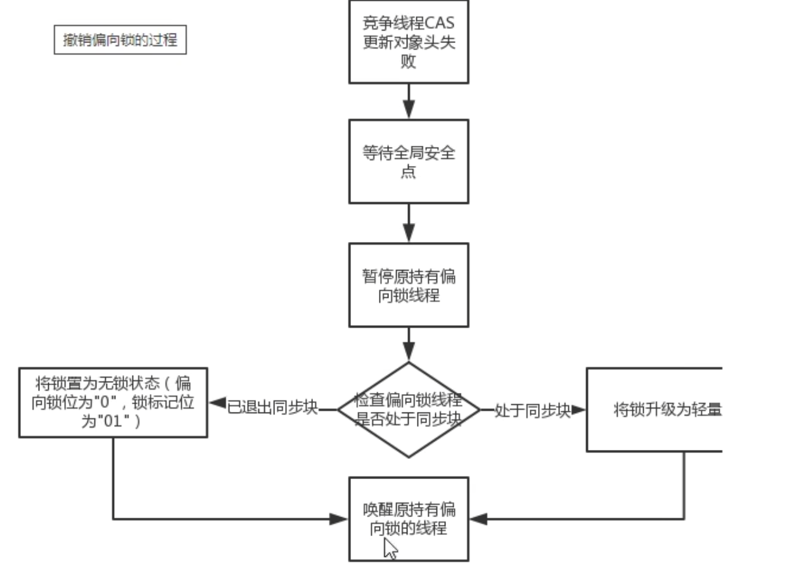

# Synchronized 与锁升级

## 锁使用与分析

### 使用方法

关键字 synchronized 可用来保证原子性、可见性、有序性。synchronized 是非公平锁，公平锁可以使用 Lock 接口实现。


```java
public class SynchronizedTest {
  public synchronized static void test1() {
  }
  public synchronized void test2() {
  }
  public void test3() {
    synchronized(SynchronizedTest.class) {
    }
  }
  public void test4() {
    synchronized(this) {
    }
  }
  public void test5() {
    Object o = new Object();
    synchronized(o) {
    }
  }
}
// test1 和 test3 持有的是同一把锁，即 SynchronizedTest 的Class对象
// test2 和 test4 持有的是同一把锁，即 SynchronizedTest 的实例对象
```

### 字节码分析

#### 同步方法

在同步方法中，使用了 flags 标记 ACC_SYNCHRONIZED, 当调用方法时，调用指令会检查方法的 ACC_SYNCHRONIZED 访问标志是否设置。如果设置了，执行线程先持有同步锁，然后执行方法，最后在方法执行完毕释放锁。

> 用 javap 将 class 文件转换成字节码指令，-v 用于输出附加信息，-c 用于对代码进行反汇编。
>
> `javap -c -v SynchronizedTest.class`


#### 同步代码块

同步代码块是使用 monitorenter 和 monitorexit 指令进行同步的。monitorenter 指令是在编译后插入到同步代码块的开始位置，而 monitorexit 是插入到方法结束处和异常处，JVM 要保证每个 monitorenter 必须有对应的 monitorexit 与之配对。

任何对象都有一个 monitor 与之关联，并且一个 monitor 被持有后，它将处于锁定状态。线程执行到 monitorenter 指令时，将会尝试获取对象的 monitor 所有权，即尝试获取对象的锁。


#### 为什么每个对象都可以成为一个锁

Monitor 是一种同步机制，Java 对象从创建内部就携带了 Monitor，并和对象一起销毁，Monitor 是由 ObjectMonitor 实现，ObjectMonitor 是由 c++ 的 ObjectMonitor.hpp 文件实现。

Monitor 的本质是依赖于底层操作系统的 Mutex Lock 实现，操作系统实现线程间的切换需要从用户态到内核态的转换，成本非常高。所以 Synchronized 是 Java 语言中一个重量级操作。

Monitor 与 Java 对象以及线程是如何关联的？

- 如果 Java 对象被某个线程锁住，则改 Java 对象的对象头 Mark Word 中，LockWord 中指向 Monitor 的起始地址。
- Monitor 的 Owner 字段会存放拥有对象锁的线程 ID。


## 锁种类与升级

### 多线程访问情况

- 只有一个线程来访问，有且唯一 Only One
- 有两个线程（2个线程交替访问）
- 竞争激烈，更多线程来访问

### JDK6 锁变化

- JDK5 以前，只有 Synchronized，这个是操作系统级别的重量级操作。
- JDK6 之后为了减少获得锁和释放锁所带来的性能消耗（**减少用户态和内核态的转换**），引入了偏向锁和轻量级锁，以及锁的存储结构和升级过程，锁一开始有一个升级过程，不会一开始就是重量级锁。


### 锁标志

synchronized 锁：根据对象头的 Mark Word 锁标志位来确定当前属于哪一种锁。

锁指向：

- - 偏向锁：MarkWord 存储的是偏向的线程指针（线程 ID）
  - 轻量锁：MarkWord 存储的是指向线程栈中 Lock Record 的指针
  - 重量锁：MarkWord 存储的是指向堆中的 monitor 对象（系统互斥量指针）


### 无锁

初始状态，一个对象实例化后，还没有任何线程竞争锁，称为无锁状态。

当对象调用 hashcode() 方法时 MarkWord 才会产生 HashCode 位，初始为全 0。


### 偏向锁

单线程竞争，当线程 A 第一次竞争到锁时，通过修改对象头 mark word 中的偏向线程ID、偏向模式。如果不存在其他线程竞争，那么持有偏向锁的线程将永远不需要进行同步。

#### 出现背景

- HotSpot 的作者经过研究发现，大多数情况下，**在多线程情况下，锁不仅不存在多线程竞争，还存在由同一个线程多次获得的情况**，偏向锁就是在这种情况下出现的，它的出现是**为了解决只有一个线程执行同步时提高性能**。
- 偏向锁会偏向于第一个访问锁的线程，如果在接下来的运行过程中，该锁没有被其他线程访问，则持有偏向锁的线程将永远不需要出发同步。也即偏向锁在资源在没有竞争情况下消除了同步语句，直接提高程序性能。

#### 实现流程

- 一个 synchronized 方法被一个线程抢到了锁时，这个方法所在的对象就会在其所在的 Mark Word 中修改偏向锁标志位，同时还会占用前 54 位来存储线程指针作为标识。
- 若该线程再次访问同一个 synchronized 方法时，该线程只需去对象头的 Mark word 中去判断一下当前的线程指针，无需再进入 Monitor 去竞争对象了。
- 如果线程指针不等，表示发生了竞争，锁己经不是总是偏向于同一个线程了，这个时候会尝试使用 CAS 来替换 Mark Word 里面的线程指针。
- 如果竞争成功，表示之前的线程不存在了，Mark Word 里面的线程指针为新线程的指针，锁不会升级，仍然为偏向锁。
- 如果竞争失败，这时候可能需要升级变为轻量级锁，才能保证线程间公平竞争锁。
- 注意，偏向锁只有遇到其他线程尝试竞争偏向锁时，持有偏向锁的线程才会释放锁，线程不会主动释放偏向锁。

#### 偏向锁的撤销

- 当有另外一个线程逐步来竞争锁的时候，就不能再使用偏向锁了，要升级为轻量级锁，使用的是“等到竞争出现才释放锁”的机制
- 竞争线程尝试CAS更新对象头失败，会等到全局安全点（此时不会执行任何代码）撤销偏向锁，同时检查持有偏向锁的线程是否还在执行：

- - 第一个线程正在执行 Synchronized方法（处于同步块），它还没有执行完，其他线程来抢夺，该偏向锁会被取消掉并出现锁升级，此时轻量级锁由原来持有偏向锁的线程持有，继续执行同步代码块，而正在竞争的线程会自动进入自旋等待获得该轻量级锁
  - 第一个线程执行完 Synchronized（退出同步块），则将对象头设置为无所状态并撤销偏向锁，重新偏向。

- 

> JDK15 以后逐步废弃偏向锁，需要手动开启, 维护成本高

### 轻量级锁

多线程竞争，但是任意时候最多只有一个线程竞争，即获取锁的冲突时间极短，没有线程阻塞。（本质是自旋锁CAS）

#### 轻量锁的获取

假如线程 A 己经拿到锁，这时线程 B 又来抢该对象的锁，由于该对象的锁己经被线程 A 拿到，当前该锁已经是偏向锁了。

线程 B 在争抢时发现对象头 Mark Word 中的线程 ID 不是线程 B 自己的线程 ID (而是线程 A 的)．那线程 B 就会进行 CAS 操作希望能获得锁。

此时线程 B 操作中有两种情况：

- 如果锁获取成功，直接替换 Mark Word 中的线程 ID 替换为 B 自己的．重新偏向于其他线程(即将偏向锁交给其他线程，相当于当前线程"被"释放了锁)，该锁会保持偏向锁状态，A 线程 Over，B线程上位；
- 如果锁获取失败，则偏向锁升级为轻量级锁(设置偏向锁标识为 0 并设置锁标志位为 00)，此时轻量级锁由原持有偏向锁的线程持有，继续执行其同步代码，而正在竞争的线程 B 会进入自旋等待获得该轻量级锁。

#### 轻量锁加锁

JVM 会为每个线程在当前线程的栈帧中创建用于存储锁记录的空间，官方成为 Displaced Mark Word。 若一个线程获得锁时发现是轻量级锁，会把锁的 MarkWord 复制到自己的 Displaced Mark Word 里面。然后线程尝试用 CAS 将锁的 MarkWord 替换为指向锁记录的指针。如果成功，当前线程获得锁，如果失败，表示 Mark Word 己经被替换成了其他线程的锁记录，说明在与其它线程竞争锁，当前线程就尝试使用自旋来获取锁。

#### 轻量锁释放

在释放锁时，当前线程会使用 CAS 操作将 Displaced Mark word 的内容复制回锁的 Mark Word 里面。如果没有发生竞争，那么这个复
制的操作会成功。如果有其他线程因为自旋多次导致轻量级锁升级成了重量级锁，那么 CAS 操作会失败，此时会释放锁并唤酲被阻寨的线程。

> 轻量级锁每次退出同步块都需要释放锁，而偏向锁是在竞争发生时才释放锁。

#### 示例


#### 自旋

**线程的阻塞和唤醒需要 CPU 从用户态转为内核态，频繁的阻塞和唤醒很耗费性能**。研究发现，共享数据的锁定状态大多只会持续很短的一段时间，为了这段时间阻塞和唤醒线程并不值得。如果物理机器有多个处理器，能让两个或以上的线程同时并行执行，我们就可以让后面请求锁的那个线程**等待一下看持有锁的线程是否很快就会释放锁，但不放弃处理器的执行时间**。为了让线程等待，我们只需让线程进行自旋，这就是所谓的自旋锁。

自旋锁在 JDK1.4 中就已经引入了，默认是关闭的，可以使用 `-XX:+UseSpinning` 参数来开启，在 JDK6 中默认开启了。自旋等待不能代替阻塞，自旋虽然避免了线程切换的开销，但还是要占用处理器时间的，并且对处理器数量也有要求。**如果锁被占用的时间很短，自旋等待的效果就会很好，但是，如果锁被占用的时间很长，那么自旋的线程只会白白消耗处理器资源，且没有做任何有用的工作**。故而，自旋等待的时间必须要有一定的限制，如果自旋超过了限定的次数仍然没有成功获得锁，就应当使用传统的方式去挂起线程了。在 JDK6 以前，自旋次数的默认值是 10 次，或者自旋线程超过 cpu 核数的一半，则升级为重量级锁。可以使用参数 `-XX:PreBlockSpin` 来更改。

自适应自旋锁：线程如果自旋成功了，那下次自旋的最大次数会增加（JVM 会认为上次成功了这次大概率也会成功）；如果很少自旋成功，那么就会减少下次自旋的次数，甚至不自旋。

### 重量锁

有大量线程参与锁的竞争，冲突性很高

#### 实现原理

Java 中 synchronized 的重量级锁，是基于进入和退出 Monitor 对象实现的。在编译时会将同步块的开始位置插入 monitor enter 指令，在结束位置插入 monitor exit 指令，当线程执行到 monitor enter 指令时，会尝试获取对象所对应的 Monitor 所有权，如果获取到了，即获取到了锁，会在 Monitor 的 owner 中存放当前线程的 ID，这样它将处于锁定状态，除非退出同步块，否则其他线程无法获取到这个Monitor。

#### 示例

```java
@Test
public void test5() throws InterruptedException {
  Object object = new Object();
  CountDownLatch count = new CountDownLatch(5);
  for (int i = 0; i < 5; i++) {
    new Thread(() -> {
      try {
        synchronized (object) {
          System.out.println(ClassLayout.parseInstance(object).toPrintable());
        }
      } finally {
        count.countDown();
      }
    }, STR."t\{i}").start();
  }
  count.await();
  System.out.println("finished");
}
```


### 锁的升级过程总结


### HashCode 与锁升级

- 在 无锁状态 下，Mark Word 中可以存储对象的 identity hash code 值。当对象的 hashCode() 方法第一次被调用时，JVM 会生成对应的 identity hash code 值并将该值存储到 Mark word 中。
- 对于偏向锁，在线程获取偏向锁时，会用 Thread ID 和 epoch 值覆盖 identity hash code 所在的位置。如果一个对象的 hashCode()
  己经被调用过一次之后，这个对象不能被设置偏向锁；如果当前正处于偏向锁，偏向锁会撤销，膨胀为重量锁。
- 升级为轻量级锁时，JVM 会在**当前线程的栈帧中创建一个锁记录 (Lock Record) 空间，用于存储锁对象的 Mark Word 拷贝**，该拷贝中可以包含 identity hash code ， 所以轻量级锁可以和 identity hash code 共存，哈希码和 GC 年龄也保存在此，释放锁后会将这些信息写回到对象头。
- 升级为重量级锁后，Mark Word 保存的重量级锁指针，**代表重量锁的 ObjectMonitor 类里有字段记录非加锁状态下的 Mark Word**，锁释放后也会将信息写回到对象头。

### 锁的优缺点及对比

| 锁     | 优点                                                         | 缺点                                         | 适用场景                         |
| ------ | ------------------------------------------------------------ | -------------------------------------------- | -------------------------------- |
| 偏向锁 | 加锁和解锁不需要额外的消耗，和执行非同步方法相比仅存在纳秒级的差距 | 如果线程间存在锁竞争会带来额外的锁撤销的消粍 | 适用于只有一个线程的访问同步场景 |
| 轻量锁 | 竞争的线程不会阻塞，提高了程序的响应速度                     | 始终竞争不到锁的线程，使用自旋会消耗 CPU     | 追求响应时间                     |
| 重量锁 | 线程竞争不适用自旋，不消耗 CPU                               | 线程阻塞，响应时间慢                         | 追求吞吐量                       |

synchronized 锁升级过程一句话总结：先自旋，不行再阻塞。

实际上是把之前的悲观锁(重量级锁)变成 在一定条件下使用偏向锁以及使用轻量级(自旋锁CAS)的形式

synchronized 在修饰方法和代码块在字节码上实现方式有很大差异，但是内部实现还是基于对象头的 MarkWvord 来实现的。

JDK6 之前 synchronized 使用的是重量级锁，JDK6 之后进行了优化，拥有了无锁->偏向锁->轻量级锁->重量级锁的升级过程，而不
是无论什么情况都使用重量级锁。

偏向锁：适用于单线程适用的情况，在不存在锁竞争的时候进入同步方法/代码块则使用偏向锁。

轻量级锁：适用于竞争较不激烈的情况(这和乐观锁的使用范围类似)，存在竞争时升级为轻量级锁，轻量级锁采用的是自旋锁，如果同步方法/代码块执行时间很短的话，采用轻量级锁虽然会占用 cpu 资源但是相对比使用重量级锁还是更高效。

重量级锁：适用于竞争激烈的情况，如果同步方法/代码块执行时间很长，那么使用轻量级锁自旋带来的性能消耗就比使用重量级锁更严重，这时候就需要升级为重量级锁。

## JIT 对锁的优化

### 锁消除

```java
/**
 * 锁消除
 * 这个锁对象并没有被共用扩散到其他线程使用
 * JIT 忽略所存在
 * 没有加锁对象的底层机器码，消除了锁的使用
 */
public class LockClearUpDemo {
  static Object object = new Object();

  public void m1() {
    // 局部锁对象，JIT 会忽略，非正常的
    Object o = new Object();
    synchronized (o) {
      System.out.println("LockClearUpDemo" + "\t" + o.hashCode() + "\t" + object.hashCode());
    }
  }

  public static void main(String[] args) {
    LockClearUpDemo lockClearUpDemo = new LockClearUpDemo();
    for (int i = 0; i < 10; i++) {
      new Thread(() -> {
        lockClearUpDemo.m1();
      }, String.valueOf(i)).start();
    }
  }
}
```

### 锁粗化

```java
/**
 * 锁粗化
 * 假如方法中首尾相接，前后相邻的都是同一个锁对象，那 JIT 编译器会把这几个 synchronized 块合并为一个大块
 * 加粗加大范围，一次申请锁使用即可，避免次次的申请和释放锁，提高了性能
 */
public class LockBigDemo {
  static Object objectLock = new Object();

  public static void main(String[] args) {
    new Thread(() -> {
      synchronized (objectLock) {
        System.out.println("111111111111");
      }
      synchronized (objectLock) {
        System.out.println("222222222222");
      }
      synchronized (objectLock) {
        System.out.println("333333333333");
      }
      synchronized (objectLock) {
        System.out.println("444444444444");
      }
      //底层JIT的锁粗化优化
      synchronized (objectLock) {
        System.out.println("111111111111");
        System.out.println("222222222222");
        System.out.println("333333333333");
        System.out.println("444444444444");
      }
    }, "t1").start();
  }
}
```
