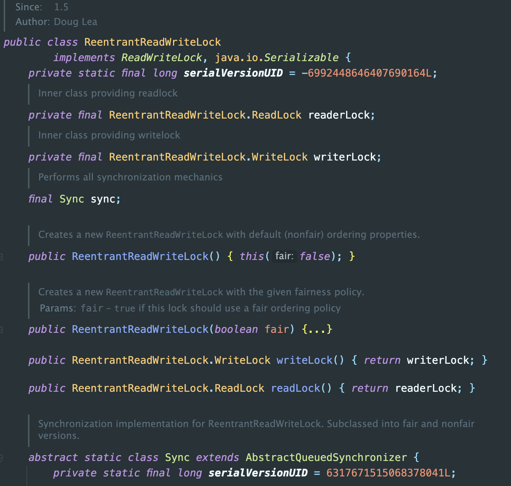

# AQS

## 前置知识

- 公平锁和非公平锁

- - 公平锁：锁被释放以后，先申请的线程先得到锁。性能较差一些，因为公平锁为了保证时间上的绝对顺序，上下文切换更频繁。
  - 非公平锁：锁被释放以后，申请等待的线程随机或者按照其他优先级顺序来获得锁。性能更好，但可能会导致某些线程永远无法获取到锁。

- 可重入锁

- - 也叫递归锁，指的是线程可以再次获取自己的内部锁，比如一个线程获取到了对象锁，此时这个对象锁还没有释放，当其想再次获取这个对象锁的时候还是可以获取的，如果不可重入的话，会导致死锁。

- 自旋

- - 当线程请求锁时，如果锁已经被其他线程持有，那么该线程会不断地重试获取锁，而不是被挂起等待，这种不断尝试获取锁的行为称为自旋。

- LockSupport

- - 一个工具类，用于线程的阻塞和唤醒操作，类似于 `wait()` 和 `notify()` 方法，但是更加灵活和可控。
  - 提供了 `park()` 和 `unpark()` 两个静态方法用于线程阻塞和唤醒操作。
  - 优点在于可以在任意时刻阻塞和唤醒线程而不需要事先获取锁或监视器对象。

- 数据结构之双向链表

- - 双向链表（Doubly Linked List）是一种常见的数据结构，它是由一系列结点（Node）组成的，每个结点包含三个部分：数据域、前驱指针和后继指针。其中，数据域存储结点的数据，前驱指针指向前一个结点，后继指针指向后一个结点。通过这种方式，双向链表可以实现双向遍历和插入、删除操作。

- 设计模式之模板设计模式

- - 模板设计模式是一种行为型设计模式，定义了一种算法的框架，并将某些步骤延迟到子类中事先，这种设计模式的主要目的是允许子类在不改变算法结构的情况下重新定义算法中的某些步骤。
  - 优点是能够提高代码复用性和可维护性。

## AQS 概述

AQS(AbstractQueuedSynchronizer)，抽象队列同步器，用来实现锁或者其它同步器组件的公共基础部分的抽象实现，是重量级基础框架及整个JUC体系的基石，只要用于解决锁分配给”谁“的问题。


AQS 整体就是一个抽象的 FIFO 队列来完成资源获取线程的排队工作，并通过一个 int 类变量表示持有锁的状态。


锁和同步器的关系：

- 锁，面向锁的使用者，定义了程序员和锁交互的使用层 API，隐藏了实现细节，调用即可。
- 同步器，面向锁的实现者，Doug Lea 提出了统一规范并简化了锁的实现，将其抽象出来，屏蔽了同步状态管理、同步队列的管理和维护、阻塞线程排队和通知、唤醒机制等，是一切锁和同步组件实现的公共基础部分。

## AQS 有关的类


- ReentrantLock

​	

- CountDownLatch

  

- ReentrantReadWriteLock

  

- Semaphore

  

## CLH 队列

加锁会导致阻塞，有阻塞就需要排队，实现排队必然需要队列

抢到资源的线程直接使用处理业务，抢不到资源的必然涉及一种排队等候机制。抢占失败的线程继续去等待，但等候线程仍然保留获取锁的可能且获取锁流程仍在继续。

当共享资源被占用，就需要一定的阻塞等待唤醒机制来保证锁分配。这个机制主要用的是 CLH 队列的变体实现的，将暂时获取不到锁的线程加入到队列中，这个队列就是 AQS 同步队列的抽象表现。它将要请求共享资源的线程及自身的等待状态封装成队列的节点对象（Node），通过 CAS、自旋以及 LockSupport.park() 的方式，维护着 state 变量的状态，使其达到同步的状态。

- 

AQS同步队列的基本结构


## AQS 源码分析

### AQS 体系架构


- AQS 的 int 类型变量 state

- AQS 的 CLH 队列

- AQS 的内部类 Node

  


### ReentrantLock 的实现

Lock 接口的实现类，基本都是通过**聚合了一个队列同步器的子类**完成线程访问控制的。


ReentrantLock 经典代码，默认是非公平锁，构造形参传入true/false 代表公平或非公平。

```java
public class AQSTest {
  public static void main(String[] args) {
    Lock lock = new ReentrantLock();
    lock.lock();
    try {

    } finally {
      lock.unlock();
    }
  }
}
```

### lock() 中的公平和非公平


对比公平锁和非公平锁的 `tryAcquire()` 方法的实现代码，其实差异就在于非公平锁获取锁时比公平锁中少了一个判断 `hasQueuedPredecessors()`，判断方法中判断了是否需要排队，导致公平锁和非公平锁的差异如下：

- 公平锁：公平锁讲究先来后到，线程在获取锁时，如果这个锁的等待队列中已经有线程在等待，那么当前线程就会进入到等待队列中；
- 非公平锁：不管是否有等待队列，如果可以获取到锁，则立刻占有锁对象。也就是说队列的第一个排队线程苏醒后，不一定就是排头的这个线程获得锁，它还需要参加竞争锁（存在线程竞争的情况下）。


### lock() 方法

`Lock lock = new ReentrantLock(); lock.lock();`

1. 调用 `ReentrantLock` 类中的 `lock()` 方法，实际上调用的是 `ReentrantLock` 类中的 `Sync` 静态抽象内部类中的 `lock()` 方法，Sync 静态抽象类继承 AQS。下图所示：


2. `Sync` 静态抽象内部类中的 `lock()` 方法 中的 `initialTryLock()` 方法，在非公平锁实现类（`NonfairSync`）和公平锁实现类（`FairSync`）中均有实现。下图所示：


3. `Sync` 静态抽象内部类中的 `lock()` 方法 中的 `acquire()` 方法，调用的是 AQS 中的 `acquire()` 方法。下图所示。

4. 其中 AQS 中的 `acquire()` 方法中的 `tryAcquire()` 方法在非公平锁实现类（`NonfairSync`）和公平锁实现类（`FairSync`）中均有实现。上图所示。


5. 最后 AQS 中的 `acquire()` 方法中调用重载的 `acquire()` 方法，此方法执行最终的获取或等待锁的逻辑。下图所示。


### unlock() 方法

`Lock lock = new ReentrantLock(); lock.lock(); lock.unlock();`

1. 调用 `ReentrantLock` 类中的 `unlock()` 方法，实际上调用的是 `ReentrantLock` 类中的静态抽象内部类 `Sync` 中的 `unlock()` 方法，Sync 静态抽象类继承 AQS。下图所示：


2. `ReentrantLock` 的静态抽象内部类 `Sync` 中的 `unlock()` 方法 中的 `release()` 方法，是 AQS 中的 `release()` 方法。下图所示：


3. 其中 `tryRelease()` 在类 `Sync` 中有实现，尝试释放对象的线程所有权。接着 `signalNext()` 方法调用唤醒给定节点的后继节点。 下图所示：


