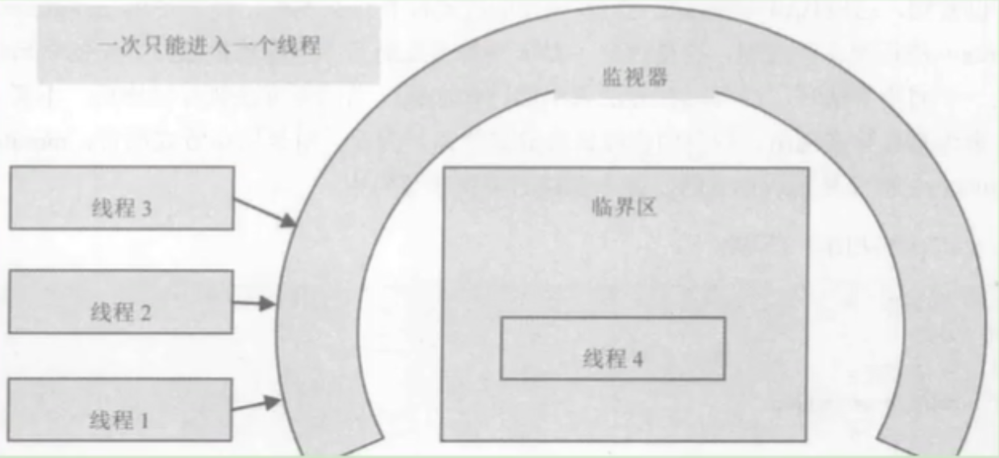

# 字节码文件

## 概述

字节码文件是源代码经过编译器编译之后的文件。

它是一种二进制文件。

它的内容是JVM指令，不是像c、c++那样由编译器直接生成机器码。

### 编译器

前端编译器：将符合java语法规范的代码转换为符合JVM规范的字节码文件。

javac编译器：全量式编译，idea默认。

ECJ编译器：增量式编译器，eclipse内置。

编译步骤：词法解析，语法解析，语义解析，生成字节码。

```flow
  src=>start: 源代码
  lexical=>operation: 词法解析
  stream=>start: Token stream
  grammar=>operation: 语法解析
  grammarTree=>start: 语法树
  semantic=>operation: 语义解析
  annoGrammarTree=>start: 注解抽象语法树
  genByteCode=>operation: 生成字节码
  dst=>end: JVM字节码
  src(right)->lexical(right)->stream(right)->grammar(right)->grammarTree(right)->semantic(right)->annoGrammarTree(right)->genByteCode(right)->dst
```

局限性：只是编译成JVM虚拟机识别的字节码文件，非机器直接识别的机器码，编译为机器码的操作交由HotSpot的JIT编译器处理，因此会感觉Java程序第一次运行慢。

AOT编译器：jdk9引入了静态提前编译器，将所输入的Java类文件转换为机器码，并存放在生成的动态共享库中。

  优点：JVM直接加载已经编译好的机器码，不用等待JIT编译器的预热，减少Java应用第一次运行慢的体验。

  缺点：必须为不同硬件和操作系统进行对应的编译，和Java的"一次编译到处运行"相违背；降低了Java链接过程的动态性，加载的代码在编译器就必须全部已知。

### Class对象

哪些类型对应有Class对象

1. class：外部类，成员内部类，静态内部类，局部内部类，匿名内部类
2. interface：接口
3. array：数组
4. enum：枚举
5. annotation：注解
6. primitive type：基本数据类型
7. void

## 结构

字节码文件的基本结构：

- 魔数（Magic Number）：四个字节，用于识别是否为合法的字节码文件。
- 版本信息：两个字节，用于确定字节码文件所使用的 JVM 版本。
- 常量池（Constant Pool）：用于存储字节码文件中使用的符号引用、字面常量等信息，起到索引和共享常量的作用，提供了高效访问和管理常量的机制。
- 访问标志（Access Flags）：用于描述类或接口的访问级别（如 public、final、abstract 等）以及一些特征（如是否是接口、是否被修饰为枚举等）。
- 类相关信息：包括该类的名称、父类的名称、该类实现的接口等。
- 字段表集合（Fields）：描述类中定义的字段（成员变量），包括字段的访问标志、名称、类型等。
- 方法表集合（Methods）：描述类中定义的方法（成员函数），包括方法的访问标志、名称、参数列表、返回值等。
- 属性表集合（Attributes）：用于存储字节码文件中的附加信息，如源文件名、行号表、注解等。


### 魔数

魔数是 class 文件的标识符，每个 class 文件开头 4 个字节的无符号整数称为魔数，魔数值固定为 0xCAFEBABE。

作用是确定当前文件是否是 JVM 虚拟机可加载的合法 class 文件。

### 文件版本

模数之后的 4 个字节代表文件版本。

前 2 个字节的无符号整数代表副版本号，称为 minor_version；后 2 个字节代表主版本号，称为 mejor_version。

主版本：1.8 => 52 11 => 55 17 => 61 21 => 65

### 常量池

常量池分为常量池计数器和常量池表。

#### 常量池计数器

版本号之后的 2 个字节代表常量池容量计数值（constant_pool_count），表示常量池中有多少项常量。

容量计数是从 1 开始的，即 constant_pool_count=1 表示常量池中有 0 个常量项。

> 加入计数器值为 0x0016，十进制为 22，实际上只有 21 项常量。索引为范围是 1-21。
>
> 把第 0 项常量空出来，是为了满足后面某些指向常量池的索引值的数据在特定情况下需要表达“不引用任何一个常量池项目”的含义，这种情况可用索引值
> 0 来表示。

#### 常量池表

常量池表（constant_pool）是一种表结构，以 1 ~ (constant_pool_count - 1) 为索引，包含了 class
文件结构及其子结构中引用的所有字符串常量、类或接口名、字段名和其他常量。

常量池表项中，用于存放编译时期生成的各种==字面量（Literal）==和==符号引用（Symbolic References）==
，这部分内容将在类加载后进入方法区的==运行时常量池==中存放。

字面量：

- 文本字符串
- final 修饰的常量

符号引用：

- 类和接口的全限定名
- 属性的名称和修饰符
- 方法的名称和修饰符

当虚拟机运行时，需要从常量池中获取对应的符号引用，在类加载过程的解析阶段，将符号引用转换为对应的直接引用，并翻译到具体的内存地址。


总结 1：

- 这 14 种表（或者常量项结构）的共同点是：表开始的第一位是一个 u1 类型的标志位（tag），代表当前这个常量项使用的是哪种表结构，即哪种常量类型。
- 在常量池列表中，CONSTANT_Utf8_info 常量项是一种使用改进过的 UTF-8 编码格式来存储诸如文字字符串、类或者接口的全限定名、字段或者方法的简单名称以及描述符等常量字符串信息。
- 这 14 种常量项结构还有一个特点是，其中 13 个常量项占用的字节固定，只有 CONSTANT_Utf8_info 占用字节不固定，其大小由 length 决定。==因为从常量池存放的内容可知，其存放的是字面量和符号引用，最终这些内容都会是一个字符串，这些字符串的大小是在编写程序时才确定==，比如定义一个类，类名可以取长取短，所以在没编译前，大小不固定，编译后，通过 utf-8 编码，就可以知道其长度。

总结 2：

- 常量池：可以理解为 Class 文件之中的资源仓库，它是 Class 文件结构中与其他项目关联最多的数据类型（后面的很多数据类型都会指向此处），也是占用Class 文件空间最大的数据项目之一。
- 常量池中为什么要包含这些内容？Java 代码在进行 Javac 编译的时候，并不像 C 和 C++那样有“连接”这一步骤，而是在虚拟机加载
  C1ass 文件的时候进行动态链接。也就是说，==在 Class
  文件中不会保存各个方法、字段的最终内存布局信息，因此这些字段、方法的符号引用不经过运行期转换的话无法得到真正的内存入口地址，也就无法直接被虚拟机使用==
  。当虚拟机运行时，需要从常量池获得对应的符号引用，再在类创建时或运行时解析、翻译到具体的内存地址之中。

### 访问标识

访问标识（access_flag、访问标志、访问标记）

在常量池后，紧跟着访问标记。该标记使用两个字节表示，用于识别一些类或者接口层次的访问信息，包括：这个 Class 是类还是接口；是否定义为
public 类型；是否定义为 abstract 类型；如果是类的话，是否被声明为 final 等。各种访问标记如下所示：

| 标志名称           | 标志值    | 含义                                                                        |
|:---------------|--------|:--------------------------------------------------------------------------|
| ACC_PUBLIC     | 0x0001 | 标志为 public 类型                                                             |
| ACC_FINAL      | 0x0010 | 标志被声明为 final，只有类可以设置                                                      |
| ACC_SUPER      | 0x0020 | 标志允许使用 invokespecial 字节码指令的新语义，JDK1.0.2 之后编译出来的类的这个标志默认为真。（使用增强的方法调用父类方法） |
| ACC_INTERFACE  | 0x0200 | 标志这是一个接口                                                                  |
| ACC_ABSTRACT   | 0x0400 | 是否为 abstract 类型，对于接口或者抽象类来说，次标志值为真，其他类型为假                                 |
| ACC_SYNTHETIC  | 0x1000 | 标志此类并非由用户代码产生（即：由编译器产生的类，没有源码对应）                                          |
| ACC_ANNOTATION | 0x2000 | 标志这是一个注解                                                                  |
| ACC_ENUM       | 0x4000 | 标志这是一个枚举                                                                  |

类的访问权限通常为 ACC\_开头的常量。

每一种类型的表示都是通过设置访问标记的 32 位中的特定位来实现的。比如，若是 public final 的类，则该标记为 ACC_PUBLIC |
ACC_FINAL。

使用 ACC_SUPER 可以让类更准确地定位到父类的方法 super.method()，现代编译器都会设置并且使用这个标记。

**补充说明：**

1. 带有 ACC_INTERFACE 标志的 class 文件表示的是接口而不是类，反之则表示的是类而不是接口。
    - 如果一个 class 文件被设置了 ACC_INTERFACE 标志，那么同时也得设置 ACC_ABSTRACT 标志。同时它不能再设置
      ACC_FINAL、ACC_SUPER 或 ACC_ENUM 标志。
    - 如果没有设置 ACC_INTERFACE 标志，那么这个 class 文件可以具有上表中除 ACC_ANNOTATION 外的其他所有标志。当然，ACC_FINAL 和 ACC_ABSTRACT 这类互斥的标志除外。这两个标志不得同时设置。
2. ACC_SUPER 标志用于确定类或接口里面的 invokespecial 指令使用的是哪一种执行语义。==针对 Java
   虚拟机指令集的编译器都应当设置这个标志==。对于 Java SE 8 及后续版本来说，无论 class 文件中这个标志的实际值是什么，也不管
   class 文件的版本号是多少，Java 虚拟机都认为每个 class 文件均设置了 ACC_SUPER 标志。

    - ACC_SUPER 标志是为了向后兼容由旧 Java 编译器所编译的代码而设计的。目前的 ACC_SUPER 标志在由 JDK1.0.2 之前的编译器所生成的 access_flags 中是没有确定含义的，如果设置了该标志，那么 oracle 的 Java 虚拟机实现会将其忽略。

3. ACC_SYNTHETIC 标志意味着该类或接口是由编译器生成的，而不是由源代码生成的。

4. 注解类型必须设置 ACC_ANNOTATION 标志。如果设置了 ACC_ANNOTATION 标志，那么也必须设置 ACC_INTERFACE 标志。

5. ACC_ENUM 标志表明该类或其父类为枚举类型。

### 类、父类、接口的索引

在访问标记后，会指定该类的类别、父类类别以及实现的接口，格式如下：

| 长度 | 含义                           | 说明                                             |
|----|:-----------------------------|------------------------------------------------|
| u2 | this_class                   | 提供类的全限定名，比如 com/zt/ar/Demo。                    |
| u2 | super_class                  | 提供当前类的父类的全限定名，默认继承的是 java/lang/object 类。       |
| u2 | interfaces_count             | 表示当前类或接口的直接超接口数量。                              |
| u2 | interfaces[interfaces_count] | 指向常量池索引集合，提供接口的全限定名，所表示的接口顺序和对应的源代码中给定的接口顺序一致。 |

这三项数据来确定这个类的继承关系：

- 类索引用于确定这个类的全限定名
- 父类索引用于确定这个类的父类的全限定名。由于 Java 语言不允许多重继承，所以父类索引只有一个，除了 java.1ang.Object 之外，所有的
  Java 类都有父类，因此除了 java.lang.Object 外，所有 Java 类的父类索引都不为 e。
- 接口索引集合就用来描述这个类实现了哪些接口，这些被实现的接口将按 implements 语句（如果这个类本身是一个接口，则应当是
  extends 语句）后的接口顺序从左到右排列在接口索引集合中。

### 字段表集合

Fields

用于描述接口或类中声明的变量。字段（field）包括类级变量以及实例级变量，不包括方法内部、代码块内部声明的局部变量。

指向常量池索引集合，描述了每个字段的完整信息。比如==字段的标识符、访问修饰符（public、private 或
protected）、是类变量还是实例变量（static 修饰符）、是否是常量（final 修饰符）==等。

注意事项：

- 字段表集合中不会列出从父类或者实现的接口中继承而来的字段，但有可能列出原本 Java
  代码之中不存在的字段。譬如在内部类中为了保持对外部类的访问性，会自动添加指向外部类实例的字段。
- 在 Java 语言中字段是无法重载的，两个字段的数据类型、修饰符不管是否相同，都必须使用不一样的名称，但是对于字节码来讲，如果两个字段的描述符不一致，那字段重名就是合法的。

#### 字段计数器

****

fields_count 的值表示当前 class 文件 fields 表的成员个数。使用两个字节来表示。

#### 字段表

fields[]（字段表）

fields 表中每个成员都是一个 field_info 结构，用于表示该类或接口所声明的所有类字段或者实例字段，不包括方法内部声明的变量，也不包括从父类或父接口继承的那些字段。

| 标志名称           | 标志值              | 含义    | 数量               |
|:---------------|:-----------------|:------|:-----------------|
| u2             | access_flags     | 访问标志  | 1                |
| u2             | name_index       | 字段名索引 | 1                |
| u2             | descriptor_index | 描述符索引 | 1                |
| u2             | attributes_count | 属性计数器 | 1                |
| attribute_info | attributes       | 属性集合  | attributes_count |

访问标识

作用域修饰符（public、private、protected）、static 修饰符、final 修饰符、volatile 修饰符等。

| 标志名称          | 标志值    | 含义              |
|:--------------|:-------|:----------------|
| ACC_PUBLIC    | 0x0001 | 字段是否为 public    |
| ACC_PRIVATE   | 0x0002 | 字段是否为 private   |
| ACC_PROTECTED | 0x0004 | 字段是否为 protected |
| ACC_STATIC    | 0x0008 | 字段是否为 static    |
| ACC_FINAL     | 0x0010 | 字段是否为 final     |
| ACC_VOLATILE  | 0x0040 | 字段是否为 volatile  |
| ACC_TRANSTENT | 0x0080 | 字段是否为 transient |
| ACC_SYNCHETIC | 0x1000 | 字段是否为由编译器自动产生   |
| ACC_ENUM      | 0x4000 | 字段是否为 enum      |

描述符索引

用来描述字段的数据类型、方法的参数列表（包括数量、类型以及顺序）和返回值。

| 标志符 | 含义                                   |
|:----|:-------------------------------------|
| B   | 基本数据类型 byte                          |
| C   | 基本数据类型 char                          |
| D   | 基本数据类型 double                        |
| F   | 基本数据类型 float                         |
| I   | 基本数据类型 int                           |
| J   | 基本数据类型 long                          |
| S   | 基本数据类型 short                         |
| Z   | 基本数据类型 boolean                       |
| V   | 代表 void 类型                           |
| L   | 对象类型，比如：`Ljava/lang/Object;`         |
| `[` | 数组类型，代表一维数组 |

属性表集合

一个字段还可能拥有一些属性，用于存储更多的额外信息。比如初始化值、一些注释信息等。属性个数存放在 attribute_count 中，属性具体内容存放在
attributes 数组中。

```text
// 以常量属性为例，结构为：
ConstantValue_attribute{
   u2 attribute_name_index;
   u4 attribute_length;
   u2 constantvalue_index;
   }
```

说明：对于常量属性而言，attribute_length 值恒为 2。

### 方法表集合

Methods

用于描述接口或类中声明的方法的签名。

- 在字节码文件中，每一个 method_info 项都对应着一个类或者接口中的方法信息。比如方法的访问修饰符（public、private 或
  protected），方法的返回值类型以及方法的参数信息等。
- 如果这个方法不是抽象的或者不是 native 的，那么字节码中会体现出来。
- 一方面，methods 表只描述当前类或接口中声明的方法，不包括从父类或父接口继承的方法。另一方面，methods
  表有可能会出现由编译器自动添加的方法，最典型的便是编译器产生的方法信息（比如：类（接口）初始化方法 `<clinit>()`
  和实例初始化方法 `<init>()`。

注意事项：

在 Java 语言中，要重载（Overload）一个方法，除了要与原方法具有相同的简单名称之外，还要求必须拥有一个与原方法不同的特征签名，
特征签名就是一个方法中各个参数在常量池中的字段符号引用的集合，也就是因为返回值不会包含在特征签名之中，
因此 Java 语言里无法仅仅依靠返回值的不同来对一个已有方法进行重载。但在 Class 文件格式中，特征签名的范围更大一些，
只要描述符不是完全一致的两个方法就可以共存。也就是说，如果两个方法有相同的名称和特征签名，但返回值不同，那么也是可以合法共存于同一个
class 文件中。

#### 方法计数器

methods_count（方法计数器）

methods_count 的值表示当前 class 文件 methods 表的成员个数。使用两个字节来表示。

methods 表中每个成员都是一个 method_info 结构。

#### 方法表

methods[]（方法表）

methods 表中的每个成员都必须是一个 method_info 结构，用于表示当前类或接口中某个方法的完整描述。如果某个 method_info 结构的
access_flags 项既没有设置 ACC_NATIVE 标志也没有设置 ACC_ABSTRACT 标志，那么该结构中也应包含实现这个方法所用的 Java 虚拟机指令。

method_info 结构可以表示类和接口中定义的所有方法，包括实例方法、类方法、实例初始化方法和类或接口初始化方法

方法表的结构实际跟字段表是一样的，方法表结构如下：

| 标志名称           | 标志值              | 含义    | 数量               |
|:---------------|:-----------------|:------|:-----------------|
| u2             | access_flags     | 访问标志  | 1                |
| u2             | name_index       | 方法名索引 | 1                |
| u2             | descriptor_index | 描述符索引 | 1                |
| u2             | attributes_count | 属性计数器 | 1                |
| attribute_info | attributes       | 属性集合  | attributes_count |

方法表访问标志

跟字段表一样，方法表也有访问标志，而且他们的标志有部分相同，部分则不同，方法表的具体访问标志如下：

| 标志名称          | 标志值    | 含义                     |
|:--------------|:-------|:-----------------------|
| ACC_PUBLIC    | 0x0001 | public，方法可以从包外访问       |
| ACC_PRIVATE   | 0x0002 | private，方法只能本类访问       |
| ACC_PROTECTED | 0x0004 | protected，方法在自身和子类可以访问 |
| ACC_STATIC    | 0x0008 | static，静态方法            |

### 属性表集合

Attributes

指的是 class 文件所携带的辅助信息，用于描述接口或类中声明的方法的签名。比如该 class 文件的源文件的名称。以及任何带有
RetentionPolicy.CLASS 或者 RetentionPolicy.RUNTIME 的注解。

#### 属性计数器

attributes_count（属性计数器）

attributes_count 的值表示当前 class 文件属性表的成员个数。属性表中每一项都是一个 attribute_info 结构。

#### 属性表

attributes[]（属性表）

属性表的每个项的值必须是 attribute_info 结构。属性表的结构比较灵活，各种不同的属性只要满足以下结构即可。

属性的通用格式

| 类型 | 名称                   | 数量               | 含义    |
|:---|:---------------------|:-----------------|:------|
| u2 | attribute_name_index | 1                | 属性名索引 |
| u4 | attribute_length     | 1                | 属性长度  |
| u1 | info                 | attribute_length | 属性表   |

属性类型

属性表实际上可以有很多类型，上面看到的 Code 属性只是其中一种，Java8 里面定义了 23 种属性。下面这些是虚拟机中预定义的属性：

| 属性名称                                | 使用位置      | 含义                                                 |
|:------------------------------------|:----------|:---------------------------------------------------|
| Code                                | 方法表       | Java 代码编译成的字节码指令                                   |
| ConstantValue                       | 字段表       | final 关键字定义的常量池                                    |
| Deprecated                          | 类，方法，字段表  | 被声明为 deprecated 的方法和字段                             |
| Exceptions                          | 方法表       | 方法抛出的异常                                            |
| EnclosingMethod                     | 类文件       | 仅当一个类为局部类或者匿名类时才能拥有这个属性，这个属性用于标识这个类所在的外围方法         |
| InnerClass                          | 类文件       | 内部类列表                                              |
| LineNumberTable                     | Code 属性   | Java 源码的行号与字节码指令的对应关系                              |
| LocalVariableTable                  | Code 属性   | 方法的局部变量描述                                          |
| StackMapTable                       | Code 属性   | JDK1.6 中新增的属性，供新的类型检查检验器和处理目标方法的局部变量和操作数有所需要的类是否匹配 |
| Signature                           | 类，方法表，字段表 | 用于支持泛型情况下的方法签名                                     |
| SourceFile                          | 类文件       | 记录源文件名称                                            |
| SourceDebugExtension                | 类文件       | 用于存储额外的调试信息                                        |
| Synthetic                           | 类，方法表，字段表 | 标志方法或字段为编译器自动生成的                                   |
| LocalVariableTypeTable              | 类         | 是哟很难过特征签名代替描述符，是为了引入泛型语法之后能描述泛型参数化类型而添加            |
| RuntimeVisibleAnnotations           | 类，方法表，字段表 | 为动态注解提供支持                                          |
| RuntimeInvisibleAnnotations         | 类，方法表，字段表 | 用于指明哪些注解是运行时不可见的                                   |
| RuntimeVisibleParameterAnnotation   | 方法表       | 作用与 RuntimeVisibleAnnotations 属性类似，只不过作用对象或方法      |
| RuntimeInvisibleParameterAnnotation | 方法表       | 作用与 RuntimeInvisibleAnnotations 属性类似，只不过作用对象或方法    |
| AnnotationDefault                   | 方法表       | 用于记录注解类元素的默认值                                      |
| BootstrapMethods                    | 类文件       | 用于保存 invokeddynamic 指令引用的引导方法限定符                   |

## 指令

在Java虚拟机的指令集中，大多数的指令都包含了其操作所对应的数据类型信息。例如，iload指令用于从局部变量表中加载int型的数据到操作数栈中，而fload指令加载的则是float类型的数据。

对于大部分与数据类型相关的字节码指令， 它们的操作码助记符中都有特殊的字符来表明专门为哪种数据类型服务：

- i代表对int类型的数据操作

- l代表long类型的数据操作

- s代表short类型的数据操作

- b代表byte类型的数据操作

- c代表char类型的数据操作

- f代表float类型的数据操作

- d代表double类型的数据操作

也有一些指令的助记符中 没有明确地指明操作类型的字母 ，如arraylength指令，它没有代表数据类型的特殊字符，但操作数永远只能是一个数组类型的对象。

还有另外一些指令，如无条件跳转指令goto则是与数据类型无关的。

大部分的指令都没有支持整数类型byte、char和short，甚至没有任何指令支持boolean类型。
编译器会在编译期或运行期将byte和short类型的数据带符号扩展（Sign-Extend）为相应的int类型数据，将boolean和char类型数据零位扩展（Zero-Extend）为相应的int类型数据。与之类似，在处理boolean、byte、short和char类型的数组时，也会转换为使用对应的int类型的字节码指令来处理。因此，
大多数对于boolean、byte、short和char类型数据的操作，实际上都是使用相应的int类型作为运算类型。

将JVM中的字节码指令集按用途大致分成 9 类。

- 加载与存储指令

- 算术指令

- 类型转换指令

- 对象的创建与访问指令

- 方法调用与返回指令

- 操作数栈管理指令

- 控制转移指令

- 异常处理指令

- 同步控制指令

> 在做值相关操作时：
>
> 一个指令，可以从局部变量表、常量池、堆中对象、方法调用、系统调用中等取得数据，这些数据（可能是值，可能是对象的引用）被压入操作数栈。
>
> 一个指令，也可以从操作数栈中取出一到多个值（pop多次），完成赋值、加减乘除、方法传参、系统调用等等操作。

### 加载与储存指令

#### 操作数栈

在解释执行字节码过程中，每当为方法分配**栈桢**时，虚拟机开辟一块额外的空间作为**操作数栈**，来存放计算的操作数以及返回结果。

具体来说便是：执行每一条指令之前，虚拟机要求该指令的操作数已被压入操作数栈中。在执行指令时，虚拟机会将该指令所需的操作数弹出，并且将指令的结果重新压入栈中。

以加法指令 iadd 为例。假设在执行该指令前，栈顶的两个元素分别为 int 值 1 和 int 值 2，那么 iadd 指令将弹出这两个 int，并将求得的和
int 值 3 压入栈中。

#### 局部变量表

栈桢的另外一个重要组成部分则是**局部变量表**， 字节码程序可以将计算的结果缓存在局部变量表之中。

实际上，Java 虚拟机将局部变量区**当成一个数组** ，依次存放 this 指针（仅非静态方法），所传入的参数，以及字节码中的局部变量。

和操作数栈一样，long 类型以及 double 类型的值将占据两个单元，其余类型仅占据一个单元。

在栈帧中，与性能调优关系最为密切的部分就是局部变量表。局部变量表中的变量也是重要的垃圾回收根节点，只要被局部变量表中直接或间接引用的对象都不会被回收。

在方法执行时，虚拟机使用局部变量表完成方法的传递。

#### 局部变量压栈指令

局部变量压栈指令将给定的局部变量表中的数据压入操作数栈中。

`xload_n`: 表示将第 n 个局部变量压入操作数栈中，n 为 0-3，比如：iload_1、fload_0、aload_0。

`xload`: 表示将第指定参数个局部变量压入操作数栈，当使用这个命令时，局部变量的数量已经超过了 4 个，比如 iload 4，fload 5。

x 为 i、l、f、d、a，表示数据类型，aload 表示将一个对象引用压栈。

#### 常量入栈指令

常量入栈指令的功能是将常量压入操作数栈中，根据数据类型和入栈方式的不同，分为 const 系列、push 系列和 dc 指令。

指令 const 系列

用于对特定的常量入栈，入栈的常量隐含在指令本身里。

指令有：

- `iconst_n` (n 从 -1 到 5)
- `lconst_n` (n 从 0 到 1)
- `dconst_n` (n 从 0 到 2)
- `fconst_n` (n 从 0 到 1)
- `aconst_null`

指令 push 系列

`bipush`：接收 8 位整数作为参数，压入操作数栈

`sipush`：接收 16 位整数作为参数，压入操作数栈

指令 ldc 系列

如果以上指令都不能满足需求，那么可以使用万能的 `ldc` 指令，它可以接收一个8位的参数，该参数指向常量池中的int、float或者String的索引，将指定的内容压入堆栈。
类似的还有 `ldc_w` ，它接收两个8位参数，能支持的索引范围大于ldc。
如果要压入的元素是 long 或者 double 类型的,则使用 `ldc2_w` 指令，使用方式都是类似的。

#### 出栈装入局部变量表指令

出栈装入局部变量表指令用于将操作数栈中栈顶弹出的数据，装入局部变量表的指定位置，用于给局部变量赋值。

`xstore_n`: 表示从操作数栈中弹出一个元素，赋值给局部变量表索引 n 位置，n 为 0-3，比如：istore_1、fstore_0、astore_2。

`xstore`: 需要提供一个byte类型的参数类指定目标局部变量表的位置。

x 为 i、l、f、d、a，表示数据类型。

### 算数指令

#### 指令

**加法指令** `xadd`

**减法指令** `xsub`

**乘法指令** `xmul`

**除法指令** `xdiv`

**取余指令** `xrem`

**取反指令** `xneg`

以上 x 为 i、l、f、d，表示数据类型。

**位运算指令**

- 位移指令 `ishl`、`ishr`、`iushr`、`lshl`、`lshr`、`lushr`
- 按位或指令 `ior`、`lor`
- 按位与指令 `iand`、`land`
- 按位异或指令 `ixor`、`lxor`

**比较指令** `dcmpg`、`dcmpl`、`fcmpg`、`fcmpl`、`lcmp`

对于double和float类型的数字，由于NaN的存在，各有两个版本的比较指令。long型整数没有NaN值。

> 举例：
>
> 指令 fcmpg 和 fcmpl
> 都从栈中弹出两个操作数，并将它们做比较，设栈顶的元素为v2，栈顶顺位第2位的元素为v1，若v1=v2，则压入0；若v1>v2 则压入 1；若 v1<
> v2
> 则压入 -1。
>
> 两个指令的不同之处在于，如果遇到NaN值，fcmpg 会压入1,而 fcmpl 会压入 -1。

#### 举例

```java
public static int bar(int i){
        return((i+1)-2)*3/4;
        } 
```


```java
public void add(){
        byte i=15;
        int j=8;
        int k=i+j;
        } 
```


```java
public static void main(String[]args){
        int x=500;
        int y=100;
        int a=x/y;
        int b=50;
        System.out.println(a+b);
        }
```


### 类型转换指令

#### 宽化类型转换

转换规则

虚拟机直接支持以下数值的宽化类型转换（widening numeric conversion，小范围类型向大范围类型的安全转换），不需要指令执行，包括：

- 从 int 类型到 long、float 或者 double 类型。对应的指令为：i2l、i2f、i2d
- 从 long 类型到 float、double 类型。对应的指令为：l2f、l2d
- 从 float 类型到 double 类型。对应的指令为：f2d

精度损失

宽化类型转换是不会因为超过目标类型最大值而丢失信息的，例如，从int转换到 long，或者从int转换到double，都不会丢失任何信息，转换前后的值是精确相等的。

从int、long类型数值转换到float，或者long类型数值转换到double时，将可能发生精度丢失——可能丢失掉几个最低有效位上的值，转换后的浮点数值是根据IEEE754最接近舍入模式所得到的正确整数值。

尽管宽化类型转换实际上是可能发生精度丢失的，但是这种转换永远不会导致Java虚拟机抛出运行时异常。

#### 窄化类型转换

转换规则

虚拟机直接支持以下窄化类型转换，包括：

- 从 int 类型至 byte 、short 或者 char 类型。 对应的指令有：i2b、i2s、i2c
- 从 long 类型到 int 类型。 对应的指令有：l2i
- 从 float 类型到 int 或者 long 类型。 对应的指令有：f2i、f2l
- 从 double 类型到 int、long 或者 float 类型。 对应的指令有：d2i、d2l、d2f

精度损失

窄化类型转换可能会导致转换结果具备不同的正负号、不同的数量级，因此，转换过程很可能会导致数值丢失精度。

尽管数据类型窄化转换可能会发生上限溢出、下限溢出和精度丢失等情况，但是Java虚拟机规范中明确规定数值类型的窄化转换指令永远不可能导致虚拟机抛出运行时异常。

### 对象的创建与访问指令

#### 创建指令

虽然类实例和数组都是对象，但Java虚拟机对类实例和数组的创建与操作使用了不同的字节码指令：

1. 创建类实例的指令：
   `new`：它接收一个操作数，为指向常量池的索引，表示要创建的类型，执行完成后，将对象的引用压入栈。
2. 创建数组的指令：
   `newarray`：创建基本类型数组
   `anewarray`：创建引用类型数组
   `multianewarray`：创建多维数组

上述创建指令可以用于创建对象或者数组，由于对象和数组在Java中的广泛使用，这些指令的使用频率也非常高。

#### 字段访问指令

对象创建后，就可以通过对象访问指令获取对象实例或数组实例中的字段或者数组元素。

- 访问类字段（static字段，或者称为类变量）的指令：`getstatic`、`putstatic`
- 访问类实例字段（非static字段，或者称为实例变量）的指令：`getfield`、`putfield`

#### 数组操作指令

数组操作指令主要有：`xastore` 和 `xaload` 指令。具体为：

| 数组指令        | byte(boolean) | char    | short   | int     | long    | float   | double  | reference |
|-------------|---------------|---------|---------|---------|---------|---------|---------|-----------|
| **xaload**  | baload        | caload  | saload  | iaload  | laload  | faload  | daload  | aaload    |
| **xastore** | bastore       | castore | sastore | iastore | lastore | fastore | dastore | aastore   |

指令 `xaload` 表示将数组的元素压栈，指令 `xaload` 在执行时，要求操作数中栈顶元素为数组索引 i，栈顶顺位第2个元素为数组引用
a，该指令会弹岀栈顶这两个元素，并将 `a[i]` 重新压入栈。

`xastore` 则专门针对数组操作，以 `iastore` 为例，它用于给一个 int 数组的给定索引赋值。在 `iastore`
执行前，操作数栈顶需要以此准备3个元素：值、索引、数组引用，`iastore` 会弹出这3个值，并将值赋给数组中指定索引的位置。

取数组长度的指令：`arraylength`，该指令弹出栈顶的数组元素，获取数组的长度，将长度压入栈。

#### 类型检查指令

- `checkcast`：用于检查类型强制转换是否可以进行。如果可以进行，那么 `checkcast`
  指令不会改变操作数栈，否则它会抛出 `ClassCastException` 异常。
- `instanceof`：用来判断给定对象是否是某一个类的实例，它会将判断结果压入操作数栈。

### 方法调用与返回指令

#### 方法调用指令

- `invokevirtual`：指令用于调用对象的 **实例方法**，根据对象的实际类型进行分派（虚方法分派），支持多态。这也是Java语言中
  **最常见的方法分派方式** 。
- `invokeinterface`：指令用于 **调用接口方法** ，它会在运行时搜索由特定对象所实现的这个接口方法，并找出适合的方法进行调用。
- `invokespecial`：指令用于调用一些需要特殊处理的实例方法，包括 **实例初始化方法（构造器）、私有方法和父类方法**。 这些方法都是
  **静态类型绑定** 的，不会在调用时进行动态派发。
- `invokestatic`：指令用于调用命名 **类中的类方法（static方法）** 。这是 **静态绑定** 的。
- `invokedynamic`：调用动态绑定的方法，JDK 1.7后加入。用于在运行时动态解析出调用点限定符所引用的方法，并执行该方法。前面4条调用指令的分派逻辑都固化在
  java 虚拟机内部，而 `invokedynamic` 指令的分派逻辑是由用户所设定的引导方法决定的。

#### 方法返回指令

方法调用结束前，需要进行返回。方法返回指令根据返回值的类型区分。

- `xreturn`：ireturn（当返回值是 boolean、byte、char、short 和 int 类型时使用）、lreturn、freturn、dreturn 和 areturn。
- `return`：指令供声明为 void 的方法、实例初始化方法以及类和接口的类初始化方法使用。

通过 `xreturn` 指令,将当前函数操作数栈的顶层元素弹出，并将这个元素压入调用者函数的操作数栈中，所有在当前函数操作数栈中的其他元素都会被丢弃。

如果当前返回的是synchronized方法，那么还会执行一个隐含的 `monitorexit` 指令，退出临界区。

最后，会丢弃当前方法的整个帧，恢复调用者的帧，并将控制权转交给调用者。

### 操作数栈管理指令

如同操作一个普通数据结构中的堆栈那样，JVM提供的操作数栈管理指令，可以用于直接操作操作数栈的指令。

这类指令包括如下内容：

- 将一个或两个元素从栈顶弹出，并且直接废弃：`pop`，`pop2`
- 复制栈顶一个或两个数值并将复制值或双份的复制值重新压入栈顶：`dup`, `dup2`, `dup_x1`, `dup2_x1`, `dup_x2`, `dup2_x2`
- 将栈最顶端的两个 Slot 数值位置交换：`swap`。Java虚拟机没有提供交换两个64位数据类型（long、double）数值的指令
- 指令 `nop`，是一个非常特殊的指令，它的字节码为 0x00。和汇编语言中的 nop 一样，它表示什么都不做。这条指令一般可用于调试、占位等。

这些指令属于通用型，对栈的压入或者弹出无需指明数据类型。

说明：

- pop：将栈顶的1个Slot数值出栈。例如1个short类型数值
- pop2：将栈顶的2个Slot数值出栈。例如1个double类型数值，或者2个int类型数值
- 不带_x的指令是复制栈顶数据并压入栈顶。包括两个指令，dup和dup2 。dup的系数代表要复制的Slot个数。
- dup开头的指令用于复制1个Slot的数据。例如1个int或1个reference类型数据
- dup2开头的指令用于复制2个Slot的数据。例如1个long，或2个int，或1个int+1个float类型数据
- 带_x的指令是复制栈顶数据并插入栈顶以下的某个位置。共有4个指令,dup_x1, dup2_x1, dup_x2, dup2_x2
  。对于带_x的复制插入指令，只要将指令的dup和x的系数相加，结果即为需要插入的位置。
  - dup_x1插入位置：1+1=2，即栈顶2个Slot下面
  - dup_x2插入位置：1+2=3，即栈顶3个Slot下面
  - dup2_x1插入位置：2+1=3，即栈顶3个Slot下面
  - dup2_x2插入位置：2+2=4，即栈顶4个Slot下面

### 控制转移指令

程序流程离不开条件控制，为了支持条件跳转，虚拟机提供了大量字节码指令，大体上可以分为
比较指令、条件跳转指令、比较条件跳转指令、多条件分支跳转指令、无条件跳转指令等。

#### 比较指令

比较指令的作用是比较占栈顶两个元素的大小，并将比较结果入栈。

比较指令有： `dcmpg`、`dcmpl`、`fcmpg`、`fcmpl`、`lcmp`

具体描述见算数指令集中的描述

#### 条件跳转指令

条件跳转指令通常和比较指令结合使用。在条件跳转指令执行前，一般可以先用比较指令进行栈顶元素的准备，然后进行条件跳转。

条件跳转指令有： `ifeq, iflt, ifle, ifne, ifgt, ifge, ifnull, ifnonnull`。这些指令都接收两个字节的操作数，用于计算跳转的位置
(16位符号整数作为当前位置的offset)。

它们的统一含义为：弹出栈顶元素，测试它是否满足某一条件，如果满足条件，则跳转到给定位置。

| <      | <=     | ==     | !=     | >=     | >      | null     | not null    |
|--------|--------|--------|--------|--------|--------|----------|-------------|
| `iflt` | `ifle` | `ifeq` | `ifng` | `ifge` | `ifgt` | `ifnull` | `ifnonnull` |

注意：

1. 与前面运算规则一致：
   对于 boolean、byte、char、short 类型的条件分支比较操作，都是使用 int 类型的比较指令完成
   对于 long、float、double 类型的条件分支比较操作，则会先执行相应类型的比较运算指令，运算指令会返回一个整型值到操作数栈中，随后再执行int类型的条件分支比较操作来完成整个分支跳转
2. 由于各类型的比较最终都会转为 int 类型的比较操作，所以Java虚拟机提供的 int 类型的条件分支指令是最为丰富和强大的。

#### 比较条件跳转指令

比较条件跳转指令类似于比较指令和条件跳转指令的结合体，它将比较和跳转两个步骤合二为一。

这类指令有： `if_icmpeq、if_icmpne、if_icmplt、if_icmpgt、if_icmple、if_icmpge、if_acmpeq、if_acmpne`。

其中指令助记符加上“if_”后，以字符“i”开头的指令针对int型整数操作(也包括short和byte类型)，以字符“a”开头的指令表示对象引用的比较。

| <           | <=          | ==                      | !=                      | >=          | >           |
|-------------|-------------|-------------------------|-------------------------|-------------|-------------|
| `if_icmplt` | `if_icmple` | `if_icmpeq`、`if_acmpeq` | `if_icmpne`、`if_acmpne` | `if_icmpge` | `if_icmpgt` |

这些指令都接收两个字节的操作数作为参数，用于计算跳转的位置。同时在执行指令时，栈顶需要准备两个元素进行比较。指令执行完成后，栈顶的这两个元素被清空，且没有任何数据入栈。
如果预设条件成立，则执行跳转，否则，继续执行下一条语句。

#### 多条件分支跳转

多条件分支跳转指令是专为 switch-case 语句设计的，主要有 `tableswitch` 和 `lookupswitch`。

- `ableswitch`：**多个条件分支值是连续的**，它内部只存放起始值和终止值，以及若干个跳转偏移量，通过给定的操作数index，可以立即定位到跳转偏移量位置，因此效率比较高。

  指令tableswitch的示意图如下图所示。由于tableswitch的case值是连续的，因此只需要记录最低值和最高值，以及每一项对应的offset偏移量，根据给定的index值通过简单的计算即可直接定位到offset。

  

- `lookupswitch`：内部存放着各个离散的case-offset对，每次执行都要搜索全部的case-offset对，找到匹配的case值，并根据对应的offset计算跳转地址，因此效率较低。

  指令lookupswitch处理的是离散的case值，但是出于效率考虑， 将case-offset对按照case 值大小排序
  ，给定index时，需要査找与index相等的case,获得其offset,如果找不到则跳转到default。指令lookupswitch 如下图所示。

  

#### 无条件跳转

目前主要的无条件跳转指令为 `goto`。指令 `goto` 接收两个字节的操作数，共同组成一个带符号的整数，
用于指定指令的偏移量，指令执行的目的就是跳转到偏移量给定的位置处。

如果指令偏移量太大，超过双字节的带符号整数的范围，则可以使用指令 `goto_w`,它和 `goto` 有相同的作用，但是它接收4个字节的操作数，可以表示更大的地址范围。

指令 `jsr`、`jsr_w`、`ret` 虽然也是无条件跳转的，但主要用于 try-finally 语句，且已经被虚拟机逐渐废弃，故不在这里介绍这两个指令。

### 异常处理指令

#### 抛出异常指令

`athrow` 指令

在Java程序中显示抛出异常的操作（throw语句）都是由 `athrow` 指令来实现。

除了使用 throw 语句显示抛出异常情况之外，JVM规范还规定了许多运行时异常会在其他Java虚拟机指令检测到异常状况时自动抛出。

正常情况下，操作数栈的压入弹出都是一条条指令完成的。唯一的例外情况是
**在抛异常时，Java 虚拟机会清除操作数栈上的所有内容，而后将异常实例压入调用者操作数栈上**。

异常及异常的处理：

- 过程一：异常对象的生成过程 ---> throw (手动 / 自动)--->指令：athrow
- 过程二：异常的处理：抓抛模型。 try-catch-finally ---> 使用异常表

#### 异常处理与异常表

在Java虚拟机中， 处理异常（catch语句）不是由字节码指令来实现的（早期使用jsr、ret指令），而是采用异常表来完成的。

如果一个方法定义了一个 try-catch 或者 try-finally 的异常处理，就会创建一个异常表。它包含了每个异常处理或者 finally
块的信息。异常表保存了每个异常处理信息。比如：

- 起始位置
- 结束位置
- 程序计数器记录的代码处理的偏移地址
- 被捕获的异常类在常量池中的索引

当一个异常被抛出时，JVM会在当前的方法里寻找一个匹配的处理，如果没有找到，这个方法会强制结束并弹出当前栈帧，
并且异常会重新抛给上层调用的方法(在调用方法栈帧)。如果在所有栈帧弹出前仍然没有找到合适的异常处理，这个线程将终止。
如果这个异常在最后一个非守护线程里抛出，将会导致JVM自己终止，比如这个线程是个main线程。

不管什么时候抛出异常，如果异常处理最终匹配了所有异常类型，代码就会继续执行。在这种情况下，如果方法结束后没有抛出异常，仍然执行
finally 块，在return前，它直接跳到 finally 块来完成目标。

### 同步控制指令

JVM支持两种同步结构：方法级的同步 和 方法内部一段指令序列的同步 ，这两种同步都是使用 monitor 来支持的。

#### 方法级同步

方法级的同步：是隐式的，即无须通过字节码指令来控制，它实现在方法调用和返回操作之中。虚拟机可以从方法常量池的方法表结构中的
`ACC_SYNCHRONIZED` 访问标志得知一个方法是否声明为同步方法。

当调用方法时，调用指令将会检查方法的 `ACC_SYNCHRONIZED` 访问标志是否设置。

- 如果设置了，执行线程将先持有同步锁，然后执行方法。最后 在方法完成（无论是正常完成还是非正常完成）时 释放同步锁 。
- 在方法执行期间，执行线程持有了同步锁，其他任何线程都无法再获得同一个锁。
- 如果一个同步方法执行期间抛出了异常，并且在方法内部无法处理此异常，那这个同步方法所持有的锁将在异常抛到同步方法之外时自动释放。

举例：

```java
class test {
    private int i = 0;

    public synchronized void add() {
        i++;
    }
}
```

> 对应的字节码：
>
> 0 aload_0
>
> 1 dup
>
> 2 getfield #2 <com/test/java1/SynchronizedTest.i>
>
> 5 iconst_1
>
> 6 iadd
>
> 7 putfield #2 <com/test/java1/SynchronizedTest.i>
>
> 10 return

说明：

这段代码和普通的无同步操作的代码没有什么不同，没有使用 `monitorenter` 和 `monitorexit` 进行同步区控制。这是因为，对于同步方法而言，
当虚拟机通过方法的访问标示符判断是一个同步方法时，会自动在方法调用前进行加锁，
当同步方法执行完毕后，不管方法是正常结束还是有异常抛岀，均会由虚拟机释放这个锁。因此，对于同步方法而言，`monitorenter`
和 `monitorexit` 指令是隐式存在的，并未直接出现在字节码中。

#### 方法内指定指令序列的同步

同步一段指令集序列：通常是由java中的 `synchronized` 语句块来表示的。jvm的指令集有 `monitorenter` 和 `monitorexit`
两条指令来支持 `synchronized` 关键字的语义。

当一个线程进入同步代码块时，它使用 `monitorenter`
指令请求进入。如果当前对象的监视器计数器为0，则它会被准许进入，若为1，则判断持有当前监视器的线程是否为自己，如果是，则进入，否则进行等待，直到对象的监视器计数器为0，才会被允许进入同步块。

当线程退岀同步块时，需要使用 `monitorexit` 声明退出。在Java虚拟机中，任何对象都有一个监视器与之相关联，用来判断对象是否被锁定，当监视器被持有后，对象处于锁定状态。

指令 `monitorenter` 和 `monitorexit` 在执行时，都需要在操作数栈顶压入对象,之后 `monitorenter` 和 `monitorexit`
的锁定和释放都是针对这个对象的监视器进行的。

下图展示了监视器如何保护临界区代码不同时被多个线程访问，只有当线程4离开临界区后，线程1、2、3才有可能进入。



举例：

```java
class test {
    private int i = 0;

    public void subtract() {
        synchronized (this) {
            i--;
        }
    }
}
```

> 对应的字节码：
>
> 0: aload_0
>
> 1: dup
>
> 2: astore_1
>
> 3: monitorenter
>
> 4: aload_0
>
> 5: dup
>
> 6: getfield #2 // Field i:I
>
> 9: iconst_1
>
> 10: isub
>
> 11: putfield #2 // Field i:I
>
> 14: aload_1
>
> 15: monitorexit
>
> 16: goto 24
>
> 19: astore_2
>
> 20: aload_1
>
> 21: monitorexit
>
> 22: aload_2
>
> 23: athrow
>
> 24: return
>
> Exception table:
>
> from to target type
>
> 4 16 19 any
>
> 19 22 19 any

编译器必须确保无论方法通过何种方式完成，方法中调用过的每条 `monitorenter` 指令都必须执行其对应的 `monitorexit`
指令，而无论这个方法是正常结束还是异常结束。
为了保证在方法异常完成时 `monitorenter` 和 `monitorexit` 指令依然可以正确配对执行，编译器会自动产生一个异常处理器，这个异常处理器声明可处理所有的异常
，它的目的就是用来执行 `monitorexit` 指令
