# 类的加载

## 类的加载过程

在 Java 中数据类型分为基本数据类型和引用数据类型。**基本数据类型由虚拟机预先定义，引用数据类型则需要进行类的加载。**

按照 Java 虚拟机规范，从 class 文件到加载到内存中的类，到类卸载出内存为止，它的整个生命周期包括如下 7 个阶段：


类的使用过程

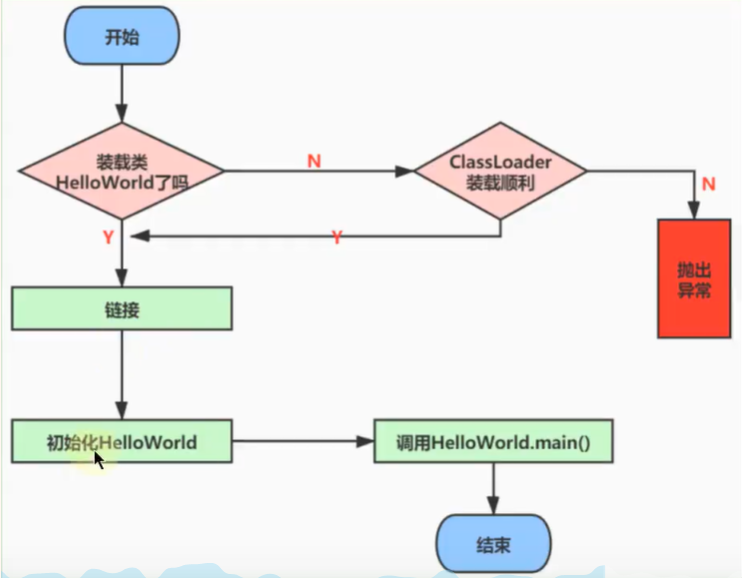

### Loading

#### 操作过程

类的装载，将类的字节码文件加载到机器内存中，并在内存中构建出类的原型（类模板对象）。也就是查找并加载类的二进制数据，生成 Class 的实例。

在加载类时，虚拟机需要完成以下工作：

1. 通过类的全名，获得类的二进制数据流。
2. 解析类的二进制数据流为方法区内的数据结构（Java 类模板）。
3. 创建 java.lang.Class 类的实例表示该类型，作为方法区这个类的各种数据的访问入口。

#### 类模板对象

类模板对象，是 Java 类在 JVM 内存中的一个快照，JVM 将从字节码文件中解析出常量池、类字段、类方法等信息储存到类模板中，这样 JVM 在运行期便能通过类模板而获取 Java 类中的任意信息，能够对 Java 类的成员变量进行遍历，也能进行 Java 方法的调用。

反射的机制即基于这一基础。如果 JVM 没有将 Java 类的声明信息存储起来，则 JVM 在运行期也无法反射。

加载的类在 JVM 中创建相应的类结构，类结构会存储在方法区(JDK1.8之前：永久代；JDK1.8及之后：元空间)。

#### 获取二进制流

对于类的二进制数据流，虚拟机可以通过多种途径产生或获得，只要所读取的字节码符合 JVM 规范即可。

- 虚拟机可能通过文件系统读入一个 class 后缀的文件。（最常见）
- 读入 jar、zip 等归档数据包，提取类文件。
- 事先存放在数据库中的类的二进制数据。
- 使用类似于 HTTP 之类的协议通过网络进行加载。
- 在运行时生成一段 Class 的二进制信息等。

在获取到类的二进制信息后，Java 虚拟机就会处理这些数据，并最终转为一个 java.lang.Class 的实例。

如果输入数据不是 ClassFile 的结构，则会抛出 ClassFormatError。

#### Class 实例的位置

字节码文件加载至方法区后，会在堆中创建一个 java.lang.Class 对象，用来封装类位于方法区内的数据结构，该 Class 对象是在加载类的过程中创建的，每个类都对应有一个 Class 类型的对象。

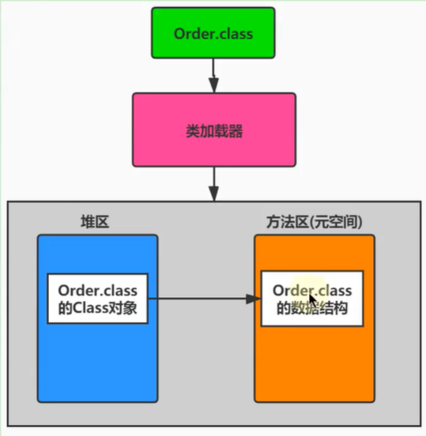

#### 数组类的加载

创建数组类的情况稍微有些特殊，因为**数组类本身并不是由类加载器负责创建**，而是由 JVM 在运行时根据需要而直接创建的，但数组的元素类型仍然需要依靠类加载器去创建。

创建数组类的过程：

- 如果数组的元素类型是引用类型，那么就遵循定义的加载过程递归加载和创建数组的元素类型；
- JVM 使用指定的元素类型和数组维度来创建新的数组类。
- 如果数组的元素类型是引用类型，数组类的可访问性就由元素类型的可访问性决定。否则数组类的可访问性将被缺省定义为 public

### Linking

当类加载到系统后，就开始链接操作，链接分为三部：验证、准备和解析。

#### 验证 Verification

验证是链接操作的第一步。**它的目的是保证加载的字节码是合法、合理并符合规范的**。

Java 虚拟机大致需要做以下检查，如图所示：

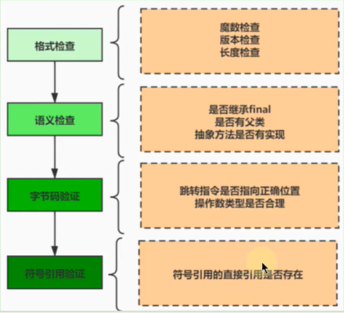

**整体说明：**

验证的内容则涵盖了类数据信息的**格式验证**、**语义检查**、**字节码验证**，以及**符号引用验证**等。

- 其中**格式验证会和加载阶段一起执行**。验证通过之后，类加载器才会成功将类的二进制数据信息加载到方法区中。
- 格式验证之外的验证操作将会在方法区中进行。

> 链接阶段的验证虽然拖慢了加载速度，但是它避免了在字节码运行时还需要进行各种检查。

**具体说明：**

1. 格式验证：是否以魔数 0XCAFEBABE 开头，主版本和副版本号是否在当前 Java 虚拟机的支持范围内，数据中每一个项是否都拥有正确的长度等。

2. 语义检查：Java 虚拟机会进行字节码的语义检查，但凡在语义上不符合规范的，虚拟机也不会给予验证通过。比如：

   - 是否所有的类都有父类的存在（在 Java 里，除了 object 外，其他类都应该有父类）
   - 是否一些被定义为 final 的方法或者类被重写或继承了
   - 非抽象类是否实现了所有抽象方法或者接口方法

3. 字节码验证：Java 虚拟机还会进行字节码验证，字节码验证也是验证过程中最为复杂的一个过程。它试图通过对字节码流的分析，判断字节码是否可以被正确地执行。比如：

   - 在字节码的执行过程中，是否会跳转到一条不存在的指令
   - 函数的调用是否传递了正确类型的参数
   - 变量的赋值是不是给了正确的数据类型等

   栈映射帧（StackMapTable）就是在这个阶段，用于检测在特定的字节码处，其局部变量表和操作数栈是否有着正确的数据类型。但遗憾的是，100%准确地判断一段字节码是否可以被安全执行是无法实现的，因此，该过程只是尽可能地检查出可以预知的明显的问题。如果在这个阶段无法通过检查，虚拟机也不会正确装载这个类。但是，如果通过了这个阶段的检查，也不能说明这个类是完全没有问题的。

   在前面3次检查中，已经排除了文件格式错误、语义错误以及字节码的不正确性。但是依然不能确保类是没有问题的。

4. 符号引用的验证：校验器还将进符号引用的验证。Class 文件在其常量池会通过字符串记录自己将要使用的其他类或者方法。因此，在验证阶段，**虚拟机就会检查这些类或者方法确实是存在的**，并且当前类有权限访问这些数据，如果一个需要使用类无法在系统中找到，则会抛出 NoClassDefFoundError，如果一个方法无法被找到，则会抛出 NoSuchMethodError。此阶段在解析环节才会执行。

#### 准备 Preparation

当一个类验证通过时，虚拟机就会进入准备阶段。在这个阶段，虚拟机就会**为这个类分配相应的内存空间，并初始化为默认值**。虚拟机为各类型变量默认的初始值如表所示。

| 类型      | 默认初始值 |
| :-------- | :--------- |
| byte      | (byte)0    |
| short     | (short)0   |
| int       | 0          |
| long      | 0L         |
| float     | 0.0f       |
| double    | 0.0        |
| char      | \u0000     |
| boolean   | false      |
| reference | null       |

> Java 并不支持 boolean 类型，对于 boolean 类型，内部实现是 int，由于 int 的默认值是 0，故对应的，boolean 的默认值就是 false。

**注意**

- 这里**不包含基本数据类型的字段用 `static final` 修饰的情况**，因为 final 在编译的时候就会分配了，准备阶段会显式赋值

  ```java
  // 一般情况：static final 修饰的基本数据类型、字符串类型字面量会在准备阶段赋值
  private static final String str = "Hello world";
  // 特殊情况：static final 修饰的引用类型不会在准备阶段赋值，而是在初始化阶段赋值
  private static final String str = new String("Hello world");
  ```

- 注意这里**不会为实例变量分配初始化，类变量会分配在方法区中，而实例变量是会随着对象一起分配到 Java 堆中**。

- 在这个阶段并**不会像初始化阶段中那样会有初始化或者代码被执行**。

#### 解析 Resolution

在准备阶段完成后，就进入了解析阶段。在这个阶段，虚拟机**将类、接口、字段和方法的符号引用转为直接引用**。

**具体说明**：

符号引用就是一些字面量的引用，和虚拟机的内部数据结构和和内存布局无关。

比较容易理解的就是在 Class 类文件中，通过常量池进行了大量的符号引用。但是在程序实际运行时，只有符号引用是不够的，比如当如下 println() 方法被调用时，系统需要明确知道该方法的位置。

**举例**：

输出操作 `System.out.println()` 对应的字节码：

```java
invokevirtual #24 <java/io/PrintStream.println>
```

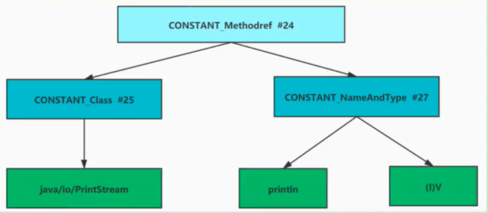

以方法为例，Java 虚拟机为每个类都准备了一张方法表，将其所有的方法都列在表中，当需要调用一个类的方法的时候，只要知道这个方法在方法表中的偏移量就可以直接调用该方法。

### Initialization

类的初始化是类装载的最后一个阶段。如果前面的步骤都没有问题，那么表示类可以顺利装载到系统中。此时，类才会开始执行Java字节码。（即：到了初始化阶段，才真正开始执行类中定义的 Java 程序代码 。）

初始化阶段的重要工作是**执行类的初始化方法 `<clinit>()`** 。

该方法仅能由Java编译器生成并由JVM调用，程序开发者 无法自定义一个同名的方法，更无法直接在Java程序中调用该方法，虽然该方法也是由字节码指令所组成。

它是由**类静态成员的赋值语句**以及**static语句块**合并产生的。

`<clinit>()` : 只有在给类的中的 static 的变量显式赋值或在静态代码块中赋值了，才会生成此方法。

`<init>()` : 一定会出现在 Class 的 method 表中。

#### &lt;clinit&gt;()方法

Java编译器并不会为所有的类都产生 `<clinit>()` 初始化方法。哪些类在编译为字节码后没有此方法：

- 一个类中并没有声明任何的类变量，也没有静态代码块时

- 一个类中声明类变量，但是没有明确使用类变量的初始化语句以及静态代码块来执行初始化操作时

- 一个类中包含static final修饰的基本数据类型的字段，这些类字段初始化语句采用编译时常量表达式

```java
public class  InitializationTest1 {
  // 场景 1 ：对于非静态的字段，不管是否进行了显式赋值，都不会生成 <clinit>() 方法
  public int  num  =  1 ;
  // 场景 2 ：静态的字段，没有显式的赋值，不会生成 <clinit>() 方法
  public static int  num1 ;
  // 场景 3 ：比如对于声明为 static final 的基本数据类型的字段，不管是否进行了显式赋值，都不会生成 <clinit>() 方法
  public static final int  num2  =  1 ;
} 
```

#### static 与 final 的搭配问题

**说明**：使用 static+ final 修饰的字段的显式赋值的操作，到底是在哪个阶段进行的赋值？

- 情况 1：在链接阶段的准备环节赋值

- 情况 2：在初始化阶段 `<clinit>()` 中赋值

**结论**： 在链接阶段的准备环节赋值的情况：

- 对于基本数据类型的字段来说，如果使用 static final 修饰，则显式赋值(直接赋值常量，而非调用方法通常是在链接阶段的准备环节进行

- 对于 String 来说，如果使用字面量的方式赋值，使用 static final 修饰的话，则显式赋值通常是在链接阶段的准备环节进行
- 在初始化阶段 `<clinit>()` 中赋值的情况： 排除上述的在准备环节赋值的情况之外的情况。

**最终结论**：使用 static+final 修饰，且显示赋值中不涉及到方法或构造器调用的基本数据类到或 String 类型的显式财值，是在链接阶段的准备环节进行。

```java
public static final int INT_CONSTANT = 10;                                // 在链接阶段的准备环节赋值
public static final int NUM1 = new Random().nextInt(10);                  // 在初始化阶段<clinit>()中赋值
public static int a = 1;                                                  // 在初始化阶段<clinit>()中赋值

public static final Integer INTEGER_CONSTANT1 = Integer.valueOf(100);     // 在初始化阶段<clinit>()中赋值
public static Integer INTEGER_CONSTANT2 = Integer.valueOf(100);           // 在初始化阶段<clinit>()中概值

public static final String s0 = "helloWorld0";                            // 在链接阶段的准备环节赋值
public static final String s1 = new String("helloWorld1");                // 在初始化阶段<clinit>()中赋值
public static String s2 = "helloWrold2";                                  // 在初始化阶段<clinit>()中赋值
```

#### &lt;clinit&gt;()的线程安全性

对于 `<clinit>()` 方法的调用，也就是类的初始化，虚拟机会在内部确保其多线程环境中的安全性。

虚拟机会保证一个类的 `<clinit>()` 方法在多线程环境中被正确地加锁、同步 ，如果多个线程同时去初始化一个类，那么只会有一个线程去执行这个类的 `<clinit>()` 方法，其他线程都需要阻塞等待，直到活动线程执行 `<clinit>()` 方法完毕。

正是因为函数 `<clinit>()` 带锁线程安全的 ，因此如果在一个类的 `<clinit>()` 方法中有耗时很长的操作，就可能造成多个线程阻塞，引发死锁 。并且这种死锁是很难发现的，因为看起来它们并没有可用的锁信息。

如果之前的线程成功加载了类，则等在队列中的线程就没有机会再执行 `<clinit>()` 方法了。那么，当需要使用这个类时，虚拟机会直接返回给它已经准备好的信息。

#### 主动使用 vs 被动使用

**主动使用的说明：**

Class只有在必须要首次使用的时候才会被装载，Java虚拟机不会无条件地装载Class类型。Java虚拟机规定，一个类或接口在初次使用前，必须要进行初始化。这里指的“使用”，是指主动使用。

主动使用只有下列几种情况：（即：如果出现如下的情况，则会对类进行初始化操作。而初始化操作之前的加载、验证、准备已经完成。）

1. 当创建一个类的实例时，比如使用new关键字，或者通过反射、克隆、反序列化。

2. 当调用类的静态方法时，即当使用了字节码invokestatic指令。

3. 当使用类、接口的静态字段时 (final修饰特殊考虑) ，比如，使用getstatic或者putstatic指令。

4. 当使用java.lang.reflect包中的方法反射类的方法时。比如：Class.forName("com.atguigu.java.Test")

5. 当初始化子类时，如果发现其父类还没有进行过初始化，则需要先触发其父类的初始化。

6. 如果一个接口定义了default方法，那么直接实现或者间接实现该接口的类的初始化，该接口要在其之前被初始化。

7. 当虚拟机启动时，用户需要指定一个要执行的主类（包含main()方法的那个类），虚拟机会先初始化这个主类。

8. 当初次调用 MethodHandle 实例时，初始化该 MethodHandle 指向的方法所在的类。（涉及解析REF_getStatic、REF_putStatic、REF_invokeStatic方法句柄对应的类）

> 针对5的补充说明：
>
> 当Java虚拟机初始化一个类时，要求它的所有父类都已经被初始化，但是这条规则并不适用于接口。
>
> 在初始化一个类时，并不会先初始化它所实现的接口
>
> 在初始化一个接口时，并不会先初始化它的父接口
>
> 因此，一个父接口并不会因为它的子接口或者实现类的初始化而初始化。只有当程序首次使用特定接口的静态字段时，才会导致该接口的初始化。
>
>  
>
> 针对7的说明：
>
> JVM启动的时候通过引导类加载器加载一个初始类。这个类在调用public static void main(String[])方法之前被链接和初始化。这个方法的执行将依次导致所需的类的加载，链接和初始化。

**被动使用的说明：

除了以上的情况属于主动使用，其他的情况均属于被动使用。被动使用不会引起类的初始化。

也就是说：并不是在代码中出现的类，就一定会被加载或者初始化。如果不符合主动使用的条件，类就不会初始化。

1. 当访问一个静态字段时，只有真正声明这个字段的类才会被初始化。 当通过子类引用父类的静态变量，不会导致子类初始化。

2. 通过数组定义类引用，不会触发此类的初始化

3. 引用常量不会触发此类或接口的初始化。因为常量在链接阶段就已经被显式赋值了。

4. 调用ClassLoader类的loadClass()方法加载一个类，并不是对类的主动使用，不会导致类的初始化。

被动的使用，意味着不需要执行初始化环节，意味着没有 `<clinit>()` 的调用。

> -XX:+TraceClassLoading：追踪打印类的加载信息

### Using

任何一个类型在使用之前都必须经历过完整的加载、链接和初始化3个类加载步骤。经历过这3个步骤之后，就可以使用了。

### unloading

#### 类、类的加载器、类的实例之间的引用关系

在类加载器的内部实现中，用一个Java集合来存放所加载类的引用。另一方面，一个Class对象总是会引用它的类加载器，调用Class对象的getClassLoader()方法，就能获得它的类加载器。由此可见，代表某个类的Class实例与其类的加载器之间为双向关联关系。

一个类的实例总是引用代表这个类的Class对象。在Object类中定义了getClass()方法，这个方法返回代表对象所属类的Class对象的引用。此外，所有的Java类都有一个静态属性class，它引用代表这个类的Class对象。

#### 生命周期

一个类何时结束生命周期，取决于代表它的Class对象何时结束生命周期。

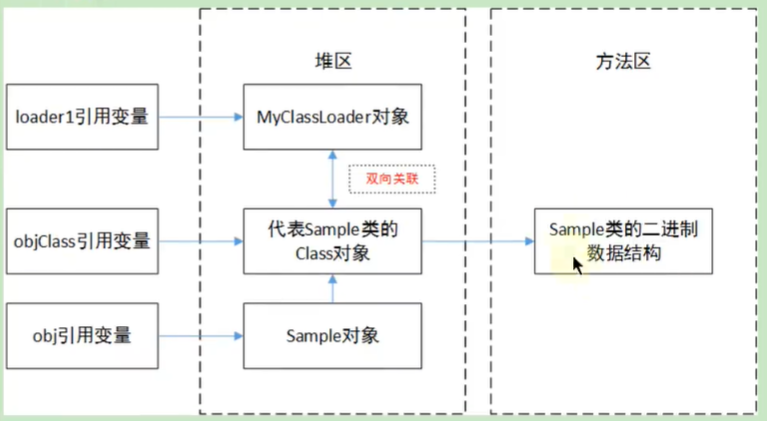

当Sample类被加载、链接和初始化后，它的生命周期就开始了。当代表Sample类的Class对象不再被引用，即不可触及时，Class对象就会结束生命周期，Sample类在方法区内的数据也会被卸载，从而结束Sample类的生命周期。

loader1变量和obj变量间接引用代表Sample类的Class对象，而objClass变量则直接引用它。

如果程序运行过程中，将上图左侧三个引用变量都置为null，此时Sample对象结束生命周期，MyClassLoader对象结束生命周期，代表Sample类的Class对象也结束生命周期，Sample类在方法区内的二进制数据 被卸载 。

当再次有需要时，会检查Sample类的Class对象是否存在， 如果存在会直接使用，不再重新加载 ；如果不存在Sample类会被重新加载，在Java虚拟机的堆区会生成一个新的代表Sample类的Class实例(可以通过哈希码查看是否是同一个实例)。

#### 类的卸载

(1) 启动类加载器加载的类型在整个运行期间是不可能被卸载的(jvm和jls规范)

(2) 被系统类加载器和扩展类加载器加载的类型在运行期间不太可能被卸载，因为系统类加载器实例或者扩展类的实例基本上在整个运行期间总能直接或者间接的访问的到，其达到unreachable的可能性极小。

(3) 被开发者自定义的类加载器实例加载的类型只有在很简单的上下文环境中才能被卸载，而且一般还要借助于强制调用虚拟机的垃圾收集功能才可以做到。可以预想，稍微复杂点的应用场景中(比如：很多时候用户在开发自定义类加载器实例的时候采用缓存的策略以提高系统性能)，被加载的类型在运行期间也是几乎不太可能被卸载的(至少卸载的时间是不确定的)。

综合以上三点，一个已经加载的类型被卸载的几率很小至少被卸载的时间是不确定的。同时我们可以看的出来，开发者在开发代码时候，不应该对虚拟机的类型卸载做任何假设的前提下，来实现系统中的特定功能。

#### 方法区的垃圾回收

方法区的垃圾收集主要回收两部分内容：常量池中废弃的常量 和 不再使用的类型。

HotSpot虚拟机对常量池的回收策略是很明确的，只要常量池中的常量没有被任何地方引用，就可以被回收。

判定一个常量是否“废弃”还是相对简单，而要判定一个类型是否属于“不再被使用的类”的条件就比较苛刻了。需要同时满足下面三个条件：  

1. 该类所有的实例都已经被回收。也就是Java堆中不存在该类及其任何派生子类的实例。
2. 加载该类的类加载器已经被回收。这个条件除非是经过精心设计的可替换类加载器的场景，如OSGi、JSP的重加载等，否则通常是很难达成的。
3. 该类对应的java.lang.Class对象没有在任何地方被引用，无法在任何地方通过反射访问该类的方法。

Java虚拟机被允许对满足上述三个条件的无用类进行回收，这里说的仅仅是“被允许”，而并不是和对象一样，没有引用了就必然会回收。

## 类的加载器

### 类加载器的作用

类加载器（classLoader）是 Java 的核心组件，所有的 Class 都是有 ClassLoader 进行加载的，ClassLoader 负责通过各种方式将 Class 信息的二进制数据流读入 JVM 内部，转换为一个与目标类对应的 java.lang.Class 对象实例，然后交由 JVM 进行链接初始化等操作。

因此，**ClassLoader 在整个装载阶段，只能影响到累的加载**，而无法通过 ClassLoader 去改变类的链接和初始化行为。至于能否运行，则由 Execution Engine 决定。

### 显示加载与隐式加载

class 文件的显式加载与隐式加载的方式是指 JVM 加载 class 文件到内存的方式。

- 显式加载指的是在代码中通过调用 ClassLoader 加载 class 对象，如直接使用 Class.forName(name) 或 this.getClass().getClassLoader().loadClass() 加载 class 对象。
- 隐式加载则是不直接在代码中调用 ClassLoader 的方法加载 class 对象，而是通过虚拟机自动加载到内存中，如在加载某个类的 class 文件时，该类的 class 文件中引用了另外一个类的对象，此时额外引用的类将通过 JVM 自动加载到内存中。

在日常开发以上两种方式一般会混合使用。

```java
// 隐式加载
User user = new User();
// 显式加载，并初始化
Class clazz = Class.forName("com.test.java.User");
// 显式加载，但不初始化
ClassLoader.getSystemClassLoader().loadClass("com.test.java.Parent"); 
```

### 类加载机制的必要性

一般情况下，Java开发人员并不需要在程序中显式地使用类加载器，但是了解类加载器的加载机制却显得至关重要。从以下几个方面说：

- 避免在开发中遇到 java.lang.ClassNotFoundException 异常或 java.lang.NoClassDefFoundErro r异常时手足无措。只有了解类加载器的加载机制才能够在出现异常的时候快速地根据错误异常日志定位问题和解决问题。
- 需要支持类的动态加载或需要对编译后的字节码文件进行加解密操作时，就需要与类加载器打交道了。
- 开发人员可以在程序中编写自定义类加载器来重新定义类的加载规则，以便实现一些自定义的处理逻辑。

### 命名空间

**类的唯一性**

对于任意一个类，**都需要由加载它的类加载器和这个类本身一同确认其在Java虚拟机中的唯一性**。每一个类加载器，都拥有一个独立的类名称空间：**比较两个类是否相等，只有在这两个类是由同一个类加载器加载的前提下才有意义** 。否则，即使这两个类源自同一个 Class 文件，被同一个虚拟机加载，只要加载他们的类加载器不同，那这两个类就必定不相等。

**命名空间**

每个类加载器都有自己的命名空间，命名空间由该加载器及所有的父加载器所加载的类组成

在同一命名空间中，不会出现类的完整名字（包括类的包名）相同的两个类

在不同的命名空间中，有可能会出现类的完整名字（包括类的包名）相同的两个类

在大型应用中，我们往往借助这一特性，来运行同一个类的不同版本。

### 类加载机制的基本特征

通常类加载机制有三个基本特征：

1. 双亲委派模型

   但不是所有类加载都遵守这个模型，有的时候，启动类加载器所加载的类型，是可能要加载用户代码的，比如JDK内部的 ServiceProvider/ServiceLoader 机制，用户可以在标准API框架上，提供自己的实现，JDK也需要提供些默认的参考实现。例如，Java 中JNDI、JDBC、文件系统、Cipher等很多方面，都是利用的这种机制，这种情况就不会用双亲委派模型去加载，而是利用所谓的上下文加载器。

2. 可见性

   子类加载器可以访问父加载器加载的类型，但是反过来是不允许的。不然，因为缺少必要的隔离，我们就没有办法利用类加载器去实现容器的逻辑。

3. 单一性

   由于父加载器的类型对于子加载器是可见的，所以父加载器中加载过的类型，就不会在子加载器中重复加载。但是注意，类加载器“邻居”间，同一类型仍然可以被加载多次， 因为互相并不可见。

## 类的加载器分类与测试

### 加载器的分类

JVM支持两种类型的类加载器，分别为引导类加载器（Bootstrap ClassLoader）和自定义类加载器（User-Defined ClassLoader）。

从概念上来讲，自定义类加载器一般指的是程序中由开发人员自定义的一类类加载器，但是Java虚拟机规范却没有这么定义，而是将所有**派生于抽象类ClassLoader的类加载器**都划分为自定义类加载器。无论类加载器的类型如何划分，在程序中我们最常见的类加载器结构主要是如下情况：


### 子类父类加载器的关系

- 除了顶层的启动类加载器外，其余的类加载器都应当有自己的“父类”加戟器。
- 不同类加载器看似是继承（Inheritance）关系，实际上是包含关系。在下层加载器中，包含着上层加载器的引用。

```java
class ClassLoader {
  ClassLoader parent; // 父类加载器
  public ClassLoader(ClassLoader parent) {
    this.parent = parent;
  }
}
class ParentClassLoader extends ClassLoader {
  public ParentClassLoader(ClassLoader parent) {
    super(parent);
  }
}
class ChildClassLoader extends ClassLoader {
  public ChildClassLoader(ClassLoader parent) { // parent = new ParentClassLoader();
    super(parent);
  }
}
```

正是由于子类加载器中包含着父类加载器的引用，所以可以通过子类加载器的方法获取对应的父类加载器。

**注意：**

启动类加载器通过 C/C++ 语言编写，而自定义类加载器都是由 Java 语言编写的，虽然扩展类加载器和应用程序类加载器是被 JDK 开发人员使用 Java 语言来编写的，但是也是由 Java 语言编写的，所以也被称为自定义类加载器。

### 引导类加载器

引导类加载器（启动类加载器，Bootstrap ClassLoader）

- 这个类加载使用 C/C++ 语言实现的，嵌套在 JVM 内部。

- 它用来加载 Java 的核心库（JAVAHOME/jre/lib/rt.jar 或 sun.boot.class.path 路径下的内容）。用于提供 JVM 自身需要的类。

- 并不继承自 java.lang.ClassLoader，没有父加载器。

- 出于安全考虑，Bootstrap 启动类加载器只加载包名为 java、javax、sun 等开头的类。

- 加载扩展类和应用程序类加载器，并指定为他们的父类加载器。

  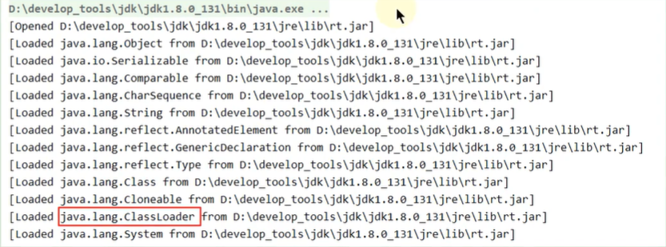

  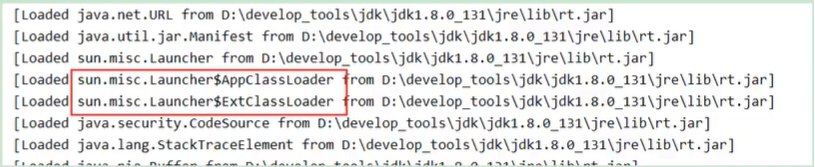

> 使用-XX:+TraceClassLoading参数得到。

```java
System.out.println("＊＊＊＊＊＊＊＊＊＊启动类加载器＊＊＊＊＊＊＊＊＊＊");
// 获取BootstrapclassLoader能够加载的api的路径
URL[] urLs = sun.misc.Launcher.getBootstrapcLassPath().getURLs();
for (URL element : urLs) {
    System.out.println(element.toExternalForm());
}
// 从上面的路径中随意选择一个类，来看看他的类加载器是什么：引导类加载器
ClassLoader classLoader = java.security.Provider.class.getClassLoader();
System.out.println(classLoader);
```

执行结果：


### 扩展类加载器

扩展类加载器（Extension ClassLoader）

- Java 语言编写，由 sun.misc.Launcher$ExtClassLoader 实现。

- 继承于 ClassLoader 类

- 父类加载器为启动类加载器

- 从 java.ext.dirs 系统属性所指定的目录中加载类库，或从 JDK 的安装目录的 jre/lib/ext 子目录下加载类库。如果用户创建的 JAR 放在此目录下，也会自动由扩展类加载器加载。

  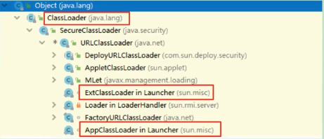

```java
System.out.println("＊＊＊＊＊＊＊＊＊＊＊扩展类加载器＊＊＊＊＊＊＊＊＊＊＊");
String extDirs = System.getProperty("java.ext.dirs");
for (String path :extDirs.split( regex:";")) {
    System.out.println(path);
}

// 从上面的路径中随意选择一个类，来看看他的类加载器是什么：扩展类加载器
lassLoader classLoader1 = sun.security.ec.CurveDB.class.getClassLoader();
System.out.print1n(classLoader1); //sun.misc. Launcher$ExtCLassLoader@1540e19d
```

**执行结果：**


### 系统类加载器

系统类加载器（应用程序类加载器，AppClassLoader）

- Java 语言编写，由 sun.misc.Launcher$AppClassLoader 实现
- 继承于 ClassLoader 类
- 父类加载器为扩展类加载器
- 它负责加载环境变量 classpath 或系统属性 java.class.path 指定路径下的类库
- 应用程序中的类加载器默认是系统类加载器
- 它是用户自定义类加载器的默认父加载器
- 通过 ClassLoader 的 getSystemClassLoader() 方法可以获取到该类加载器

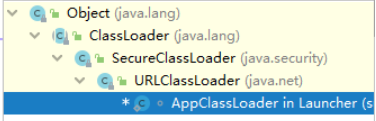

### 用户自定义加载器

- 在 Java 的日常应用程序开发中，类的加载几乎是由上述3种类加载器相互配合执行的。在必要时，我们还可以自定义类加载器，来定制类的加载方式。
- 体现 Java 语言强大生命力和巨大魅力的关键因素之一便是，Java 开发者可以自定义类加载器来实现类库的动态加载，加载源可以是本地的 JAR 包，也可以是网络上的远程资源。
- 通过类加载器可以实现非常绝妙的插件机制，这方面的实际应用案例举不胜举。例如，著名的 OSGI 组件框架，再如 Eclipse 的插件机制。类加载器为应用程序提供了一种动态增加新功能的机制，这种机制无须重新打包发布应用程序就能实现。
- 同时，自定义加载器能够实现应用隔离，例如Tomcat，Spring等中间件和组件框架都在内部实现了自定义的加载器，并通过自定义加载器隔离不同的组件模块。这种机制比 C/C++ 程序要好太多，想不修改 C/C++ 程序就能为其新增功能，几乎是不可能的，仅仅一个兼容性便能阻挡住所有美好的设想。
- 自定义类加载器通常需要继承于 ClassLoader。

### 测试不同的类加载器

每个 Class 对象都会包含一个定义它的 ClassLoader 的一个引用。

获取 ClassLoader 的途径

```java
// 获得当前类的ClassLoader
clazz.getClassLoader()
// 获得当前线程上下文的ClassLoader
Thread.currentThread().getContextClassLoader()
// 获得系统的ClassLoader
ClassLoader.getSystemClassLoader()
```

**说明：**

- 站在程序的角度看，引导类加载器与另外两种类加载器（系统类加载器和扩展类加载器）并不是同一个层次意义上的加载器，引导类加载器是使用 C/C++ 语言编写而成的，而另外两种类加载器则是使用 Java 语言编写而成的。由于引导类加载器不是一个Java类，因此在 Java 程序中只能打印出空值。
- 数组类的 Class 对象，不是由类加载器去创建的，而是在 Java 运行期 JVM 根据需要自动创建的。对于数组类的类加载器来说，是通过Class.getClassLoader() 返回的，与数组当中元素类型的类加载器是一样的；如果数组当中的元素类型是基本数据类型，数组类是没有类加载器的。

```java
// 运行结果：null
String[] strArr = new String[6];
System.out.println(strArr.getClass().getClassLoader());

// 运行结果：sun．misc．Launcher＄AppCLassLoader＠18b4aac2
ClassLoaderTest[] test = new ClassLoaderTest[1];
System.out.println(test.getClass().getClassLoader());

// 运行结果：null
int[]ints = new int[2];
System.out.println(ints.getClass().getClassLoader());
```

**代码：**

```java
public class ClassLoaderTest1{
    public static void main(String[] args) {
        // 获取系统该类加载器
        ClassLoader systemClassLoader = ClassLoader.getSystemCLassLoader();
        System.out.print1n(systemClassLoader); // sun.misc.Launcher$AppCLassLoader@18b4aac2
        // 获取扩展类加载器
        ClassLoader extClassLoader = systemClassLoader.getParent();
        System.out.println(extClassLoader); // sun.misc. Launcher$ExtCLassLoader@1540e19d
        // 试图获取引导类加载器：失败
        ClassLoader bootstrapClassLoader = extClassLoader.getParent();
        System.out.print1n(bootstrapClassLoader); // null

        // ##################################
        try{
            ClassLoader classLoader = Class.forName("java.lang.String").getClassLoader();
            System.out.println(classLoader);
            // 自定义的类默认使用系统类加载器
            ClassLoader classLoader1 = Class.forName("com.zt.java.ClassLoaderTest1").getClassLoader();
            System.out.println(classLoader1);
            
            // 关于数组类型的加载：使用的类的加载器与数组元素的类的加载器相同
            String[] arrstr = new String[10];
            System.out.println(arrstr.getClass().getClassLoader()); //null：表示使用的是引导类加载器
                
            ClassLoaderTest1[] arr1 = new ClassLoaderTest1[10];
            System.out.println(arr1.getClass().getClassLoader()); // sun.misc. Launcher$AppcLassLoader@18b4aac2
            
            int[] arr2 = new int[10];
            System.out.println(arr2.getClass().getClassLoader()); //null:
        } catch (ClassNotFoundException e) {
            e.printStackTrace();
        }
    }
}
```

## ClassLoader 源码

### ClassLoader 与现有类加载器的关系

除了虚拟机自带的加载器外，用户还可以定制自己的类加载器。Java 提供了抽象类 java.lang.ClassLoader，所有用户自定义的类加载器都应该继承 ClassLoader 类。

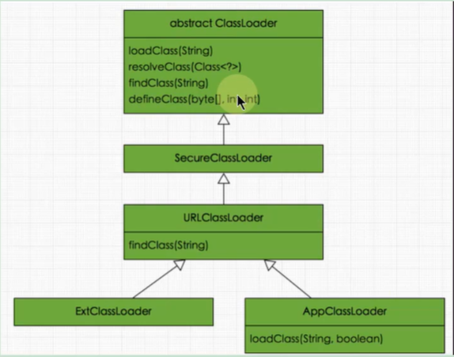

### ClassLoader 的主要方法

- 返回该类加载器的超类加载器

  ```java
  public final ClassLoader getParent()
  ```

- 加载名称为 name 的类，返回结果为 java.lang.Class 类的实例。如果找不到类，则返回 ClassNotFoundException 异常。该方法中的逻辑就是双亲委派模式的实现。

  ```java
  public Class<?> loadClass(String name) throws ClassNotFoundException
  ```

- 查找二进制名称为 name 的类，返回结果为 java.lang.Class 类的实例。这是一个受保护的方法，JVM 鼓励我们重写此方法，需要自定义加载器遵循双亲委托机制，该方法会在检查完父类加载器之后被 loadClass() 方法调用。

  ```java
  protected Class<?> findClass(String name) throws ClassNotFoundException
  ```

在 JDK1.2 之前，在自定义类加载时，总会去继承 ClassLoader 类并重写 loadClass 方法，从而实现自定义的类加载类。但是在 JDK1.2 之后已不再建议用户去覆盖 loadClass() 方法，而是建议把自定义的类加载逻辑写在 findClass() 方法中，从前面的分析可知，findClass() 方法是在 loadClass() 方法中被调用的，当 loadClass() 方法中父加载器加载失败后，则会调用自己的 findClass() 方法来完成类加载，这样就可以保证自定义的类加载器也符合双亲委托模式。

需要注意的是 ClassLoader 类中并没有实现 findClass() 方法的具体代码逻辑，取而代之的是抛出 ClassNotFoundException 异常，同时应该知道的是 findClass 方法通常是和 defineClass 方法一起使用的。一般情况下，在自定义类加载器时，会直接覆盖 ClassLoader 的 findClass() 方法并编写加载规则，取得要加载类的字节码后转换成流，然后调用 defineClass() 方法生成类的Class对象。

```java
protected final Class<?> defineClass(String name, byte[] b, int off, int len)
```

根据给定的字节数组 b 转换为 Class 的实例，off 和 len 参数表示实际 Class 信息在 byte 数组中的位置和长度，其中 byte 数组 b 是 ClassLoader 从外部获取的。这是受保护的方法，只有在自定义 ClassLoader 子类中可以使用。

defineClass() 方法是用来将 byte 字节流解析成 JVM 能够识别的 Class 对象（ClassLoader 中已实现该方法逻辑），通过这个方法不仅能够通过 Class 文件实例化 Class 对象，也可以通过其他方式实例化 Class 对象，如通过网络接收一个类的字节码，然后转换为 byte 字节流创建对应的 Class 对象。

defineClass() 方法通常与 findClass() 方法一起使用，一般情况下，在自定义类加载器时，会直接覆盖 ClassLoader 的 findClass() 方法并编写加载规则，取得要加载类的字节码后转换成流，然后调用 defineClass() 方法生成类的 Class 对象。

**简单举例：**

```java
protected Class<?> findClass(String name) throws ClassNotFoundException {
    // 获取类的字节数组
    byte[] classData = getClassData(name);
    if (classData == null) {
        throw new ClassNotFoundException();
    } else{
        // 使用defineClass生成class对象
        return defineClass(name,classData,θ,classData.length);
    }
}
```

```java
protected final void resolveClass(Class<?> c)
```

链接指定的一个Java类。使用该方法可以使用类的Class对象创建完成的同时也被解析。前面我们说链接阶段主要是对字节码进行验证，为类变量分配内存并设置初始值同时将字节码文件中的符号引用转换为直接引用。

```java
protected final Class<?> findLoadedClass(String name)
```

查找名称为 name 的已经被加载过的类，返回结果为 java.lang.Class 类的实例。这个方法是 final 方法，无法被修改。

```java
private final ClassLoader parent;
```

它也是一个 ClassLoader 的实例，这个字段所表示的 ClassLoader 也称为这个 ClassLoader 的双亲。在类加载的过程中，ClassLoader 可能会将某些请求交予自己的双亲处理。

### SecureClassLoader 与 URLClassLoader

接着 SecureClassLoader 扩展了 ClassLoader，新增了几个与使用相关的代码源（对代码源的位置及其证书的验证）和权限定义类验证（主要指对class源码的访问权限）的方法，一般我们不会直接跟这个类打交道，更多是与它的子类 URLClassLoader 有所关联。

前面说过，ClassLoader 是一个抽象类，很多方法是空的没有实现，比如 findClass()、findResource() 等。而 URLClassLoader 这个实现类为这些方法提供了具体的实现。并新增了 URLClassPath 类协助取得 Class 字节码流等功能。**在编写自定义类加载器时，如果没有太过于复杂的需求，可以直接继承 URLClassLoader 类**，这样就可以避免自己去编写 findClass() 方法及其获取字节码流的方式，使自定义类加载器编写更加简洁。

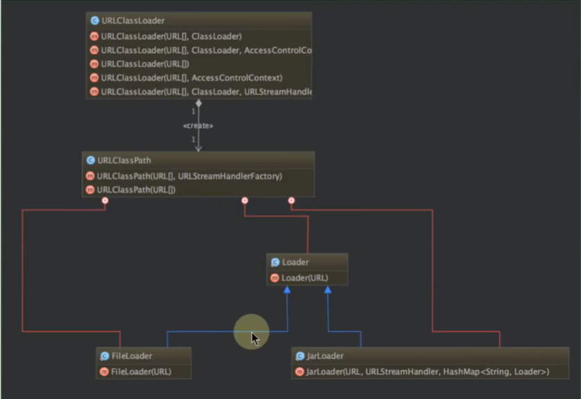

### ExtClassLoader 与 AppClassLoader

了解完 URLClassLoader 后接着看看剩余的两个类加载器，即拓展类加载器 ExtClassLoader 和系统类加载器 AppClassLoader，这两个类都继承自 URLClassLoader，是 sun.misc.Launcher 的静态内部类。

sun.misc.Launcher 主要被系统用于启动主应用程序，ExtClassLoader 和 AppClassLoader 都是由 sun.misc.Launcher 创建的，其类主要类结构如下：

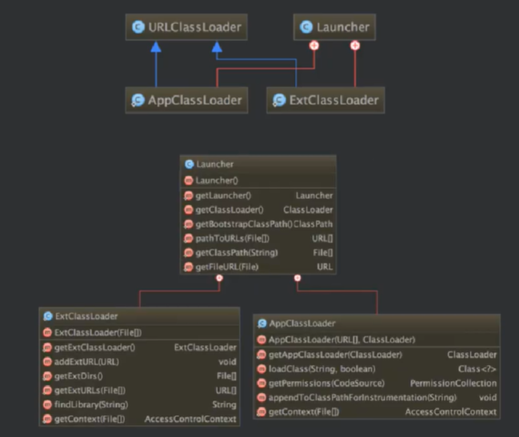

我们发现 ExtClassLoader 并没有重写 loadClass() 方法，这足矣说明其遵循双亲委派模式，而 AppClassLoader 重载了 loadClass() 方法，但最终调用的还是父类 loadClass() 方法，因此依然遵守双亲委派模式。

### Class.forName() 与 ClassLoader.loadClass()

**Class.forName()**

- Class.forName()：是一个静态方法，最常用的是 Class.forName(String className);

- 根据传入的类的全限定名返回一个 Class 对象。该方法在将 Class 文件加载到内存的同时，会执行类的初始化。

  ```java
  Class.forName("com.zt.java.Helloworld");
  ```

**ClassLoader.loadClass()**

- ClassLoader.loadClass()：这是一个实例方法，需要一个 ClassLoader 对象来调用该方法。

- 该方法将 Class 文件加载到内存时，并不会执行类的初始化，直到这个类第一次使用时才进行初始化。该方法因为需要得到一个 ClassLoader 对象，所以可以根据需要指定使用哪个类加载器。

  ```java
  Classloader cl = ......; 
  cl.loadClass("com.zt.java.Helloworld");
  ```

## 自定义类的加载器

### 作用

- 隔离加载类

  在某些框架内进行中间件与应用的模块隔离，把类加载到不同的环境。比如：阿里内某容器框架通过自定义类加载器确保应用中依赖的jar包不会影响到中间件运行时使用的jar包。再比如：Tomcat这类Web应用服务器，内部自定义了好几种类加载器，用于隔离同一个 Web 应用服务器上的不同应用程序。（类的仲裁-->类冲突）

- 修改类加载的方式

  类的加载模型并非强制，除 Bootstrap 外，其他的加载并非一定要引入，或者根据实际情况在某个时间点进行按需进行动态加载

- 扩展加载源

  比如从数据库、网络、甚至是电视机机顶盒进行加载

- 防止源码泄漏

  Java代码容易被编译和篡改，可以进行编译加密。那么类加载也需要自定义，还原加密的字节码。

### 应用场景

常见的应用场景

实现类似进程内隔离，类加载器实际上用作不同的命名空间，以提供类似容器、模块化的效果。

例如，两个模块依赖于某个类库的不同版本，如果分别被不同的容器加载，就可以互不干扰。这个方面的集大成者是 Java EE 和 OSGI、JPMS 等框架。

应用需要从不同的数据源获取类定义信息，例如网络数据源，而不是本地文件系统。或者是需要自己操纵字节码，动态修改或者生成类型。

注意：

在一般情况下，使用不同的类加载器去加载不同的功能模块，会提高应用程序的安全性。但是，如果涉及 Java 类型转换，则加载器反而容易产生不美好的事情。在做 Java 类型转换时，只有两个类型都是由同一个加载器所加载，才能进行类型转换，否则转换时会发生异常。

### 实现方式

用户通过定制自己的类加载器，这样可以重新定义类的加载规则，以便实现一些自定义的处理逻辑。

实现方式：

- Java 提供了抽象类 java.lang.ClassLoader，所有用户自定义的类加载器都应该继承 ClassLoader 类。
- 在自定义 ClassLoader 的子类时候，我们常见的会有两种做法：
- 方式一：重写 loadClass() 方法
- 方式二：重写 findClass() 方法（推荐）

## 相关机制

### 双亲委派机制

#### 定义与本质

类加载器用来把类加载到 Java 虚拟机中。从 JDK1.2 版本开始，类的加载过程采用双亲委派机制，这种机制能更好地保证 Java 平台的安全。

**定义**

如果一个类加载器在接到加载类的请求时，它首先不会自己尝试去加载这个类，而是把这个请求任务委托给父类加载器去完成，依次递归，如果父类加载器可以完成类加载任务，就成功返回。只有父类加载器无法完成此加载任务时，才自己去加载。

**本质**

规定了类加载的顺序是：引导类加载器先加载，若加载不到，由扩展类加载器加载，若还加载不到，才会由系统类加载器或自定义的类加载器进行加载。

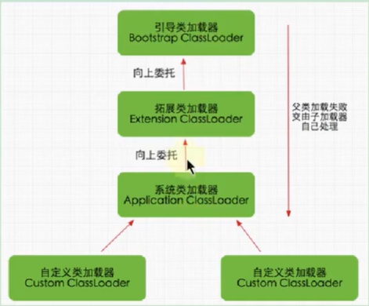

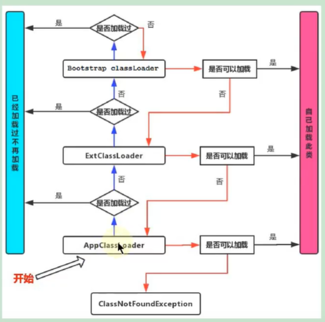

#### 优势与劣势

**双亲委派机制优势**

- 避免类的重复加载，确保一个类的全局唯一性

  Java 类随着它的类加载器一起具备了一种带有优先级的层次关系，通过这种层级关可以避免类的重复加载，当父亲已经加载了该类时，就没有必要子 ClassLoader 再加载一次。

- 保护程序安全，防止核心 API 被随意篡改

**代码支持**

双亲委派机制在 `java.lang.ClassLoader.loadClass(String，boolean)` 接口中体现。该接口的逻辑如下：

（1）先在当前加载器的缓存中查找有无目标类，如果有，直接返回。

（2）判断当前加载器的父加载器是否为空，如果不为空，则调用 `parent.loadClass(name，false)` 接口进行加载。

（3）反之，如果当前加载器的父类加载器为空，则调用 `findBootstrapClassorNull(name)` 接口，让引导类加载器进行加载。

（4）如果通过以上 3 条路径都没能成功加载，则调用 `findClass(name)` 接口进行加载。该接口最终会调用 `java.lang.ClassLoader` 接口的 `defineClass` 系列的 `native` 接口加载目标 Java 类。

双亲委派的模型就隐藏在这第2和第3步中。

**举例**

假设当前加载的是 `java.lang.Object` 这个类，很显然，该类属于 JDK 中核心类，因此一定只能由引导类加载器进行加载。当 JVM 准备加载 `java.lang.Object` 时，JVM 默认会使用系统类加载器去加载，按照上面 4 步加载的逻辑，在第 1 步从系统类的缓存中肯定查找不到该类，于是进入第 2 步。由于从系统类加载器的父加载器是扩展类加载器，于是扩展类加载器继续从第 1 步开始重复。由于扩展类加载器的缓存中也一定查找不到该类，因此进入第 2 步。扩展类的父加载器是 null，因此系统调用 `findClass()`，最终通过引导类加载器进行加载。

**思考**

如果在自定义的类加载器中重写 `java.lang.ClassLoader.loadClass(String)` 或 `java.lang.ClassLoader.loadclass(String，boolean)` 方法，抹去其中的双亲委派机制，仅保留上面这 4 步中的第 1 步与第 4 步，那么是不是就能够加载核心类库了呢？

这也不行！因为 JDK 还为核心类库提供了一层保护机制。不管是自定义的类加载器，还是系统类加载器抑或扩展类加载器，最终都必须调用  `java.lang.ClassLoader.defineclass(String，byte[]，int，int，ProtectionDomain)` 方法，而该方法会执行 `preDefineClass()` 接口，该接口中提供了对 JDK 核心类库的保护。

**弊端**

检查类是否加载的委托过程是单向的，这个方式虽然从结构上说比较清晰，使各个 ClassLoader 的职责非常明确，但是同时会带来一个问题，即顶层的 ClassLoader 无法访问底层的 ClassLoader 所加载的类。

通常情况下，启动类加载器中的类为系统核心类，包括一些重要的系统接口，而在应用类加载器中，为应用类。按照这种模式，应用类访问系统类自然是没有问题，但是系统类访问应用类就会出现问题。比如在系统类中提供了一个接口，该接口需要在应用类中得以实现，该接口还绑定一个工厂方法，用于创建该接口的实例，而接口和工厂方法都在启动类加载器中。这时，就会出现该工厂方法无法创建由应用类加载器加载的应用实例的问题。

**结论**

由于 JVM 规范并没有明确要求类加载器的加载机制一定要使用双亲委派模型，只是建议采用这种方式而已。比如在 Tomcat 中，类加载器所采用的加载机制就和传统的双亲委派模型有一定区别，当缺省的类加载器接收到一个类的加载任务时，首先会由它自行加载，当它加载失败时，才会将类的加载任务委派给它的超类加载器去执行，这同时也是 Serylet 规范推荐的一种做法。

#### 破坏双亲委派机制

双亲委派模型并不是一个具有强制性约束的模型，而是 Java 设计者推荐给开发者们的类加载器实现方式。

在 Java 的世界中大部分的类加载器都遵循这个模型，但也有例外的情况，直到 Java 模块化出现为止，双亲委派模型主要出现过 3 次较大规模“被破坏”的情况。

**第一次破坏双亲委派机制**

双亲委派模型的第一次“被破坏”其实发生在双亲委派模型出现之前一—即JDK1.2面世以前的“远古”时代。

由于双亲委派模型在 JDK 1.2 之后才被引入，但是类加载器的概念和抽象类 java.lang.ClassLoader 则在 Java 的第一个版本中就已经存在，面对经存在的用户自定义类加载器的代码，Java 设计者们引入双亲委派模型时不得不做出一些妥协，**为了兼容这些已有代码，无法再以技术手段避免 loadClass() 被子类覆盖的可能性**，只能在 JDK1.2 之后的 java.lang.ClassLoader 中添加一个新的 protected 方法 findClass()，并引导用户编写的类加载逻辑时尽可能去重写这个方法，而不是在 loadClass() 中编写代码。上节我们已经分析过 loadClass() 方法，双亲委派的具体逻辑就实现在这里面，按照 loadClass() 方法的逻辑，如果父类加载失败，会自动调用自己的 findClass() 方法来完成加载，这样既不影响用户按照自己的意愿去加载类，又可以保证新写出来的类加载器是符合双亲委派规则的。

**第二次破坏双亲委派机制：线程上下文类加载器**

双亲委派模型的第二次“被破坏”是由这个模型自身的缺陷导致的，双亲委派很好地解决了各个类加载器协作时基础类型的一致性问题（**越基础的类由越上层的加载器进行加载**），基础类型之所以被称为“基础”，是因为它们总是作为被用户代码继承、调用的 API 存在，但程序设计往往没有绝对不变的完美规则，**如果有基础类型又要调用回用户的代码，那该怎么办呢？**

这并非是不可能出现的事情，一个典型的例子便是 JNDI 服务，JNDI 现在已经是 Java 的标准服务，它的代码由启动类加载器来完成加载（在 JDK 1.3 时加入到 rt.jar 的），肯定属于 Java 中很基础的类型了。但 JNDI 存在的目的就是对资源进行查找和集中管理，它需要调用由其他厂商实现并部署在应用程序的 ClassPath 下的 JNDI 服务提供者接口（Service Provider Interface，SPI）的代码，现在问题来了，**启动类加载器是绝不可能认识、加载这些代码的，那该怎么办？**<u>（SPI：在 Java 平台中，通常把核心类 rt.jar 中提供外部服务、可由应用层自行实现的接口称为SPI）</u>

为了解决这个困境，Java 的设计团队只好引入了一个不太优雅的设计：**线程上下文类加载器（Thread Context ClassLoader）**。这个类加载器可以通过 java.lang.Thread 类的 setContextClassLoader() 方法进行设置，如果创建线程时还未设置，它将会从父线程中继承一个，如果在应用程序的全局范围内都没有设置过的话，那这个类加载器默认就是应用程序类加载器。

有了线程上下文类加载器，程序就可以做一些“舞弊”的事情了。JNDI 服务使用这个线程上下文类加载器去加载所需的 SPI 服务代码，**这是一种父类加载器去请求子类加载器完成类加载的行为，这种行为实际上是打通了双亲委派模型的层次结构来逆向使用类加载器，已经违背了双亲委派模型的一般性原则**，但也是无可奈何的事情。 ，例如 JNDI、JDBC、JCE、JAXB 和 JBI 等。不过，当 SPI 的服务提供者多于一个的时候，代码就只能根据具体提供者的类型来硬编码判断，为了消除这种极不优雅的实现方式，在 JDK6 时，JDK 提供了 java.util.ServiceLoader 类，以 META-INF/services 中的配置信息，辅以责任链模式，这才算是给SPI的加载提供了一种相对合理的解决方案。

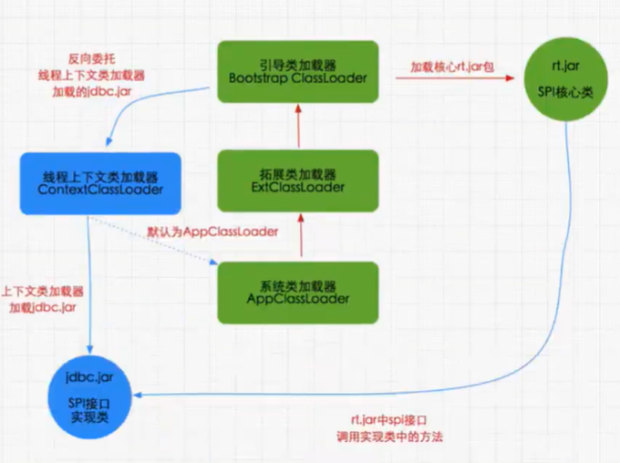

默认上下文加载器就是应用类加载器，这样以上下文加载器为中介，使得启动类加载器中的代码也可以访问应用类加载器中的类。

**第三次破坏双亲委派机制**

双亲委派模型的第三次“被破坏”是由于用户对程序动态性的追求而导致的。如：**代码热替换(Hot Swap)、模块热部署(Hot Deployment)**等

IBM 公司主导的 JSR-291(即OSGiR4.2) 实现模块化热部署的关键是它自定义的类加载器机制的实现，每一个程序模块(osGi中称为Bundle)都有一个自己的类加载器，当需要更换一个 Bundle 时，就把 Bund1e 连同类加载器一起换掉以实现代码的热替换。在 oSGi 环境下，类加载器不再双亲委派模型推荐的树状结构，而是进一步发展为更加复杂的网状结构。

当收到类加载请求时，OSGi 将按照下面的顺序进行类搜索：

1）**将以java.*开头的类，委派给父类加载器加载。**

2）**否则，将委派列表名单内的类，委派给父类加载器加载。**

3）否则，将 Import 列表中的类，委派给 Export 这个类的 Bundle 的类加载器加载。

4）否则，查找当前 Bundle 的 ClassPath，使用自己的类加载器加载。

5）否则，查找类是否在自己的 Fragment Bundle 中，如果在，则委派给 Fragment Bundle 的类加载器加载。

6）否则，查找 Dynamic Import 列表的 Bundle，委派给对应 Bund1e 的类加载器加载。

7）否则，类查找失败。

说明：只有开头两点仍然符合双亲委派模型的原则，其余的类查找都是在平级的类加载器中进行的

小结：这里，我们使用了“被破坏”这个词来形容上述不符合双亲委派模型原则的行为，但这里“被破坏”并不一定是带有贬义的。只要有明确的目的和充分的理由，突破旧有原则无疑是一种创新。

正如：OSGi 中的类加载器的设计不符合传统的双亲委派的类加载器架构，且业界对其为了实现热部署而带来的额外的高复杂度还存在不少争议，但对这方面有了解的技术人员基本还是能达成一个共识，认为 **OSGi 中对类加载器的运用是值得学习的，完全弄懂了 OSGi 的实现，就算是掌握了类加载器的精粹。**

#### 热替换的实现

热替换是指在程序的运行过程中，不停止服务，只通过替换程序文件来修改程序的行为。**热替换的关键需求在于服务不能中断，修改必须立即表现正在运行的系统之中。**基本上大部分脚本语言都是天生支持热替换的，比如：PHP，只要替换了 PHP 源文件，这种改动就会立即生效，而无需重启 Web 服务器。

但对 Java 来说，热替换并非天生就支持，如果一个类已经加载到系统中，通过修改类文件，并无法让系统再来加载并重定义这个类。因此，在 Java中实现这一功能的一个可行的方法就是灵活运用 ClassLoader。

注意：由不同 ClassLoader 加载的同名类属于不同的类型，不能相互转换和兼容。即两个不同的 ClassLoader 加载同一个类，在虚拟机内部，会认为这 2 个类是完全不同的。

根据这个特点，可以用来模拟热替换的实现，基本思路如下图所示：

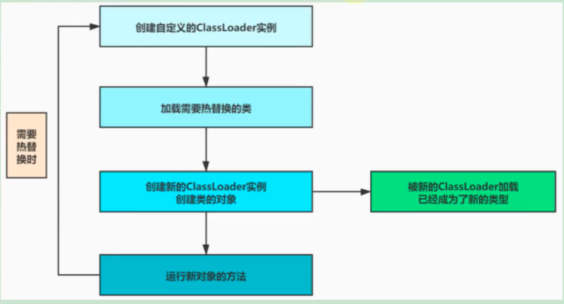

### 沙箱安全机制

- 保证程序安全
- 保护 Java 原生的 JDK 代码

**Java 安全模型的核心就是 Java 沙箱（sandbox）**。什么是沙箱？沙箱是一个限制程序运行的环境。

沙箱机制就是将 Java 代码**限定在虚拟机（JVM）特定的运行范围中，并且严格限制代码对本地系统资源访问**。通过这样的措施来保证对代码的有限隔离，防止对本地系统造成破坏。

沙箱主要限制系统资源访问，那系统资源包括什么？CPU、内存、文件系统、网络。不同级别的沙箱对这些资源访问的限制也可以不一样。

所有的 Java 程序运行都可以指定沙箱，可以定制安全策略。

#### JDK1.0时期

在 Java 中将执行程序分成本地代码和远程代码两种，本地代码默认视为可信任的，而远程代码则被看作是不受信的。对于授信的本地代码，可以访问一切本地资源。而对于非授信的远程代码在早期的Java实现中，安全依赖于**沙箱（Sandbox）机制**。如下图所示 JDK1.0 安全模型

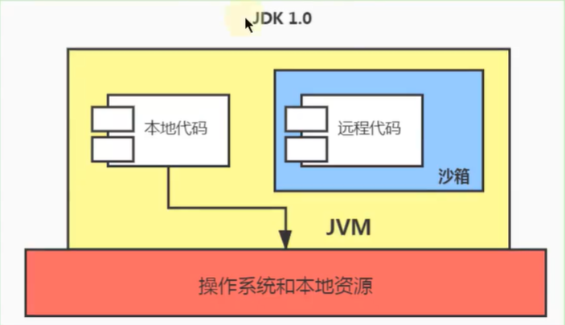

#### JDK1.1时期

JDK1.0 中如此严格的安全机制也给程序的功能扩展带来障碍，比如当用户希望远程代码访问本地系统的文件时候，就无法实现。

因此在后续的 JDK1.1 版本中，针对安全机制做了改进，增加了**安全策略**。允许用户指定代码对本地资源的访问权限。

如下图所示 JDK1.1 安全模型

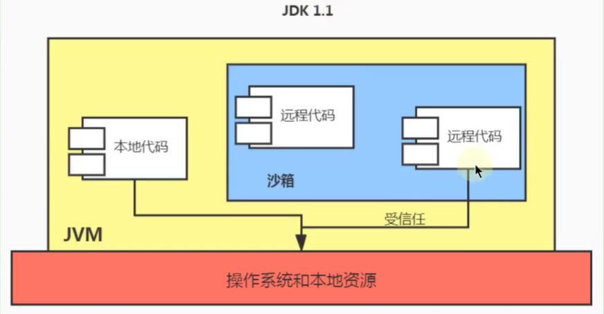

#### JDK1.2时期

在 JDK1.2 版本中，再次改进了安全机制，增加了**代码签名**。不论本地代码或是远程代码，都会按照用户的安全策略设定，由类加载器加载到虚拟机中权限不同的运行空间，来实现差异化的代码执行权限控制。如下图所示 JDK1.2 安全模型：

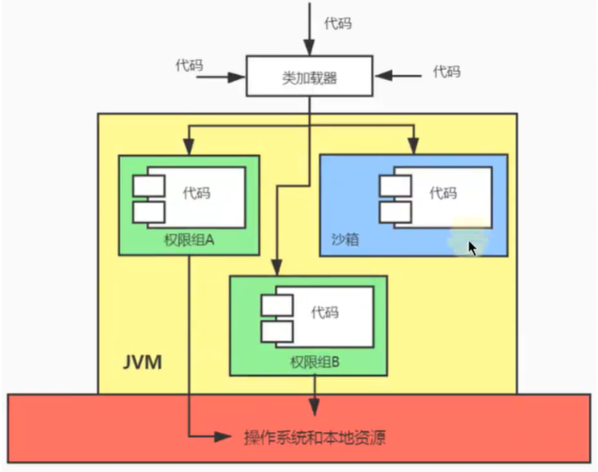

#### JDK1.6时期

当前最新的安全机制实现，则引入了**域（Domain）**的概念。

虚拟机会把所有代码加载到不同的系统域和应用域。**系统域部分专门负责与关键资源进行交互**，而各个应用域部分则通过系统域的部分代理来对各种需要的资源进行访问。虚拟机中不同的受保护域（Protected Domain），对应不一样的权限（Permission）。存在于不同域中的类文件就具有了当前域的全部权限，如下图所示，最新的安全模型（jdk1.6）

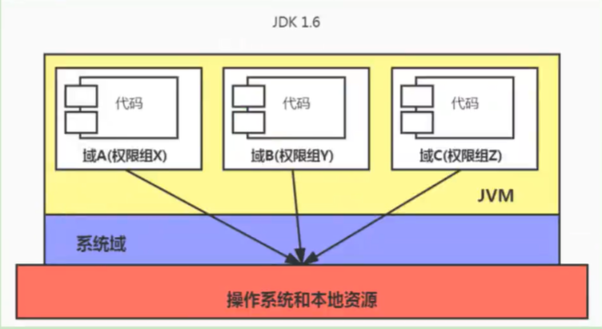

## JDK9 中类加载结构的变化

为了保证兼容性，JDK9 没有从根本上改变三层类加载器架构和双亲委派模型，但为了模块化系统的顺利运行，仍然发生了一些值得被注意的变动。

1. 扩展机制被移除，扩展类加载器由于向后兼容性的原因被保留，不过被重命名为平台类加载器(platform class loader)。可以通过classLoader 的新方法 getPlatformClassLoader() 来获取。

   JDK9 是基于模块化进行构建(原来的 `rt.jar` 和 `tools.jar` 被拆分成数十个 JMOD 文件)，其中的 Java 类库就已天然地满足了可扩展的需求，那自然无须再保留 `<JAVA_HOME>\lib\ext` 目录，此前使用这个目录或者 `java.ext.dirs` 系统变量来扩展 JDK 功能的机制已经没有继续存在的价值了。

2. 平台类加载器和应用程序类加载器都不再继承自 `java.net.URLClassLoader`。

   现在启动类加载器、平台类加载器、应用程序类加载器全都继承于 `jdk.internal.loader.BuiltinClassLoader`。

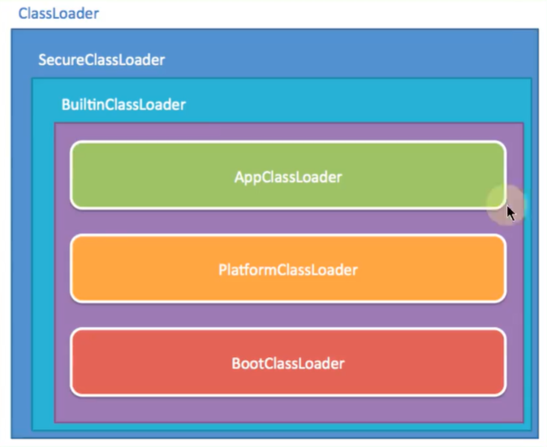

​	如果有程序直接依赖了这种继承关系，或者依赖了 URLClassLoader 类的特定方法，那代码很可能会在 JDK9 及更高版本的 JDK 中崩溃。

3. 在 JDK9 中，类加载器有了名称。该名称在构造方法中指定，可以通过 getName() 方法来获取。平台类加载器的名称是 platform，应用类加载器的名称是 app。类加载器的名称在调试与类加载器相关的问题时会非常有用。
4. 启动类加载器现在是在 jvm 内部和 java 类库共同协作实现的类加载器（以前是C++实现），但为了与之前代码兼容，在获取启动类加载器的场景中仍然会返回 null，而不会得到 BootClassLoader实例。
5. 类加载的委派关系也发生了变动。当平台及应用程序类加载器收到类加载请求，在委派给父加载器加载前，要先判断该类是否能够归属到某一个系统模块中，如果可以找到这样的归属关系，就要优先委派给负责那个模块的加载器完成加载。

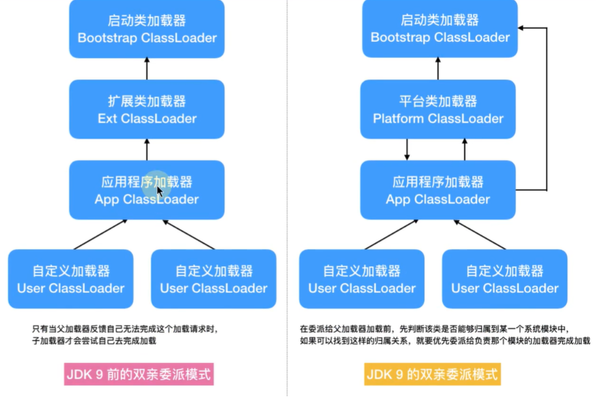

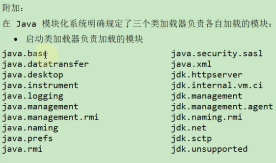

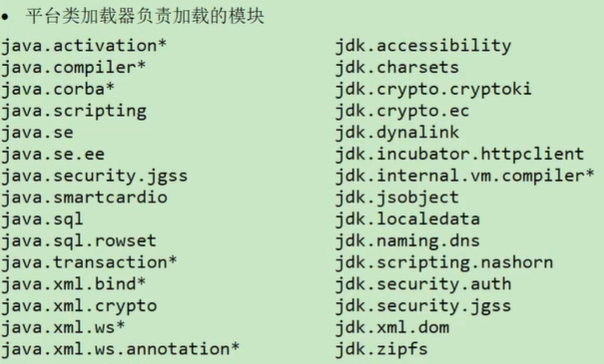

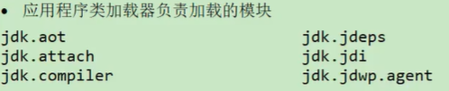

**代码：**

```java
public class ClassLoaderTest {
    public static void main(String[] args) {
        System.out.println(ClassLoaderTest.class.getClassLoader());
        System.out.println(ClassLoaderTest.class.getClassLoader().getParent());
        System.out.println(ClassLoaderTest.class.getClassLoader().getParent().getParent());

        // 获取系统类加载器
        System.out.println(ClassLoader.getSystemClassLoader());
        // 获取平台类加载器
        System.out.println(ClassLoader.getPlatformClassLoader());
        // 获取类的加载器的名称
        System.out.println(ClassLoaderTest.class.getClassLoader().getName());
    }
}
```

