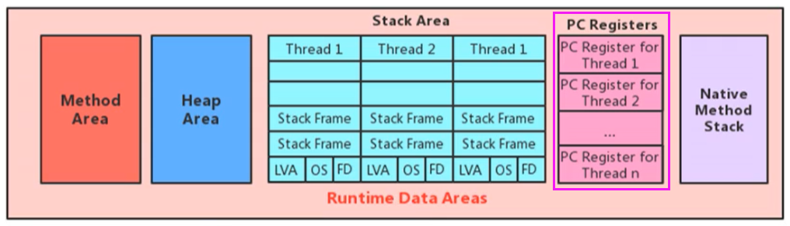
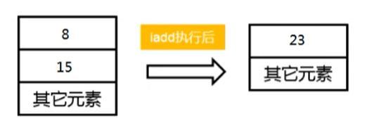
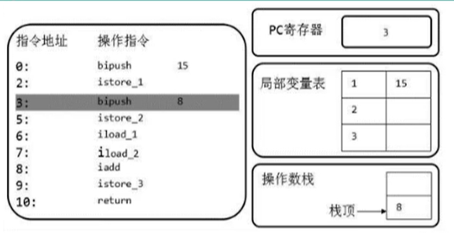
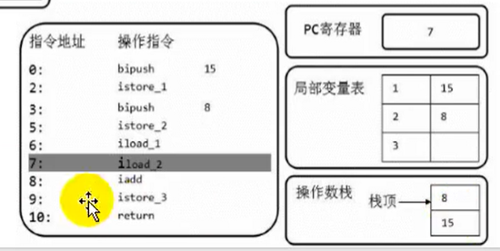

# 运行时数据区

## 概述

当我们通过前面的：类的加载-> 验证 -> 准备 -> 解析 -> 初始化 这几个阶段完成后，就会用到执行引擎对我们的类进行使用，同时执行引擎将会使用到我们运行时数据区。每个 JVM 只有一个 Runtime 实例。即为运行时环境。

### HotSpot 虚拟机内存结构


Java 虚拟机定义了若干种程序运行期间会使用到的运行时数据区，其中有一些会随着虚拟机启动而创建，随着虚拟机退出而销毁。另外一些则是与线程一一对应的，这些与线程对应的数据区域会随着线程开始和结束而创建和销毁。

- 每个线程独有：程序计数器，虚拟机栈、本地方法栈
- 多个线程共享：堆、堆外内存（元空间、代码缓存）

### 线程

线程是一个程序里的运行单元。JVM 允许一个应用有多个线程并行的执行。 在 Hotspot JVM 里，每个线程都与操作系统的本地线程直接映射。

当一个 Java 线程准备好执行以后，此时一个操作系统的本地线程也同时创建。Java 线程执行终止后，本地线程也会回收。

操作系统负责所有线程的安排调度到任何一个可用的 CPU 上。一旦本地线程初始化成功，它就会调用 Java 线程中的 run() 方法。

## 程序计数器

JVM 中的程序计数器（Program Counter Register）中，Register 的命名源于 CPU 的寄存器，寄存器存储指令相关的现场信息。



### 作用

程序计数器用来存储指向下一条指令的地址，以及将要执行的指令代码。由执行引擎读取下一条指令。


### 特征

1. 内存空间很小
2. 运行速度最快的存储区域
3. 线程私有，生命周期与线程的生命周期保持一致
4. 程序控制流的指示器，分支、循环、跳转、异常处理、线程恢复等基础功能都需要依赖这个计数器来完成

5. 存储当前线程正在执行的 Java 方法的 JVM 指令地址；如果是在执行 native 方法，则是未指定值（undefined）
6. 没有 OutofMemoryError 情况的区域

## 虚拟机栈

### 概述

由于跨平台性的设计，Java 的指令都是根据栈来设计的。不同平台 CPU 架构不同，因此不能基于寄存器来设计。

优点是跨平台，指令集小，编译器容易实现，缺点是性能下降，实现同样的功能需要更多的指令。

#### 作用

**栈是运行时的单位，而堆是存储的单位**

- 栈解决程序的运行问题，即程序如何执行，或者说如何处理数据。
- 堆解决的是数据存储的问题，即数据怎么放，放哪里

#### 特点

栈是一种快速有效的分配存储方式，访问速度仅次于程序计数器。

JVM 直接对 Java 栈的操作只有两个：

- 每个方法执行，伴随着进栈（入栈、压栈）
- 执行结束后的出栈工作

对于栈来说不存在垃圾回收问题（栈存在溢出的情况）

#### 生命周期

生命周期和线程一致。

### 栈帧

#### 存储单位

每个线程都有自己的栈，栈中的数据都是以**栈帧**（Stack Frame）的格式存在。

在这个线程上正在执行的每个方法都各自对应一个栈帧（Stack Frame）。

栈帧是一个内存区块，是一个数据集，维系着方法执行过程中的各种数据信息。

#### 运行原理

JVM 直接对 Java 栈的操作只有两个，就是对**栈帧的压栈和出栈，遵循“先进后出”/“后进先出”原则**。

在一条活动线程中，一个时间点上，只会有一个活动的栈帧。即只有当前正在执行的方法的栈帧（栈顶栈帧）是有效的，这个栈帧被称为当前栈帧（Current Frame），与当前栈帧相对应的方法就是当前方法（Current Method），定义这个方法的类就是前类（Current Class）。

执行引擎运行的所有字节码指令只针对当前栈帧进行操作。

如果在该方法中调用了其他方法，对应的新的栈帧会被创建出来，放在栈的顶端，成为新的当前帧。

如果当前方法调用了其他方法，方法返回之际，当前栈帧会传回此方法的执行结果给前一个栈帧，接着，虚拟机会丢弃当前栈帧，使得前一个栈帧重新成为当前栈帧。

Java 方法有两种返回函数的方式，一种是正常的函数返回，使用 return 指令；另外一种是抛出异常。不管使用哪种方式，都会导致栈帧被弹出。

#### 内部结构

每个栈帧中存储着：

- **局部变量表（Local Variables）**
- **操作数栈（operand Stack）（或表达式栈）**
- 动态链接（DynamicLinking）（或指向运行时常量池的方法引用）
- 方法返回地址（Return Address）（或方法正常退出或者异常退出的定义）
- 一些附加信息


并行每个线程下的栈都是私有的，因此每个线程都有自己各自的栈，并且每个栈里面都有很多栈帧，栈帧的大小主要由局部变量表 和 操作数栈决定的


### 局部变量表

局部变量表也被称之为局部变量数组或本地变量表

- 定义为一个数字数组，主要用于**存储方法参数和定义在方法体内的局部变量**，这些数据类型包括**各类基本数据类型、对象引用（reference），以及 returnAddress 类型**。
- 由于局部变量表是建立在线程的栈上，是线程的私有数据，因此**不存在数据安全问题**。

- **局部变量表所需的容量大小是在编译期确定下来的**，并保存在方法的 Code 属性的 maximum local variables 数据项中。在方法运行期间是不会改变局部变量表的大小的。
- 方法嵌套调用的次数由栈的大小决定。一般来说，栈越大，方法嵌套调用次数越多。对一个函数而言，它的参数和局部变量越多，使得局部变量表膨胀，它的栈帧就越大，以满足方法调用所需传递的信息增大的需求。进而函数调用就会占用更多的栈空间，导致其嵌套调用次数就会减少。
- **局部变量表中的变量只在当前方法调用中有效**。在方法执行时，虚拟机通过使用局部变量表完成参数值到参数变量列表的传递过程。当方法调用结束后，随着方法栈帧的销毁，局部变量表也会随之销毁。

#### 关于 Slot 的理解

- 局部变量表，最基本的存储单元是 Slot（变量槽）
- 参数值的存放总是在局部变量数组的 index0 开始，到数组长度-1 的索引结束。
- 局部变量表中存放编译期可知的各种基本数据类型（8 种），引用类型（reference），returnAddress 类型的变量。
- 在局部变量表里，32 位以内的类型只占用一个 slot（包括 returnAddress 类型），64 位的类型（long 和 double）占用两个 slot。

- byte、short、char 在存储前被转换为 int，boolean 也被转换为 int，0 表示 false，非 0 表示 true。
- JVM 会为局部变量表中的每一个 Slot 都分配一个访问索引，通过这个索引即可成功访问到局部变量表中指定的局部变量值

- 当一个实例方法被调用的时候，它的方法参数和方法体内部定义的局部变量将会**按照顺序被复制**到局部变量表中的每一个 slot 上

- **如果需要访问局部变量表中一个 64bit 的局部变量值时，只需要使用前一个索引即可**。（比如：访问 long 或 doub1e 类型变量）
- 如果当前帧是由构造方法或者实例方法创建的，那么**该对象引用 this 将会存放在 index 为 0 的 slot 处**，其余的参数按照参数表顺序继续排列。


#### Slot 的重复利用

栈帧中的局部变量表中的槽位是可以重用的，如果一个局部变量过了其作用域，那么在其作用域之后申明的新的局部变就很有可能会复用过期局部变量的槽位，从而达到节省资源的目的。

#### 静态变量与局部变量的对比

参数表分配完毕之后，再根据方法体内定义的变量的顺序和作用域分配。

我们知道类变量表有两次初始化的机会，第一次是在“准备阶段”，执行系统初始化，对类变量设置零值，另一次则是在“初始化”阶段，赋予程序员在代码中定义的初始值。

和类变量初始化不同的是，局部变量表不存在系统初始化的过程，这意味着一旦定义了局部变量则必须人为的初始化，否则无法使用。

#### 说明

在栈帧中，与性能调优关系最为密切的部分就是局部变量表。在方法执行时，虚拟机使用局部变量表完成方法的传递。

**局部变量表中的变量也是重要的垃圾回收根节点，只要被局部变量表中直接或间接引用的对象都不会被回收**。

### 操作数栈

每一个独立的栈帧除了包含局部变量表以外，还包含一个**后进先出（Last-In-First-Out）的操作数栈**，也可以称之为表达式栈（Expression Stack）。

#### 执行过程

操作数栈，在方法执行过程中，根据字节码指令，往栈中写入数据或提取数据，即入栈（push）和 出栈（pop）

- 某些字节码指令将值压入操作数栈，其余的字节码指令将操作数取出栈。使用它们后再把结果压入栈
- 比如：执行复制、交换、求和等操作



#### 作用

操作数栈，主要用于**保存计算过程的中间结果，同时作为计算过程中变量临时的存储空间**。

#### 说明

操作数栈就是 JVM 执行引擎的一个工作区，当一个方法刚开始执行的时候，一个新的栈帧也会随之被创建出来，这个方法的操作数栈是空的。

每一个操作数栈都会拥有一个明确的栈深度用于存储数值，其**所需的最大深度在编译期就定义好**了，保存在方法的 Code 属性中，为 max_stack 的值。

栈中的任何一个元素都是可以任意的 Java 数据类型

- 32bit 的类型占用一个栈单位深度
- 64bit 的类型占用两个栈单位深度

操作数栈并非采用访问索引的方式来进行数据访问的，而是只能**通过标准的入栈和出栈操作来完成一次数据访问**。

如果被调用的方法带有返回值的话，其返回值将会被压入当前栈帧的操作数栈中，并更新程序计数器中下一条需要执行的字节码指令。

操作数栈中元素的数据类型必须与字节码指令的序列严格匹配，这由编译器在编译器期间进行验证，同时在类加载过程中的类检验阶段的数据流分析阶段要再次验证。

另外，我们说 Java 虚拟机的**解释引擎是基于栈的执行引擎**，其中的栈指的就是操作数栈。

#### 代码追踪

```java
public void testAddOperation() {
    byte i = 15;
    int j = 8;
    int k = i + j;
}
```

使用 javap 命令反编译 class 文件：`javap -v 类名.class`

```java
public void testAddoperation();
Code:
0: bipush 15
2: istore_1
3: bipush 8
5: istore_2
6: iload_1
7: iload_2
8: iadd
9: istore_3
10: return
```








#### 栈顶缓存技术

前面提过，基于栈式架构的虚拟机所使用的零地址指令更加紧凑，但完成一项操作的时候必然需要使用更多的入栈和出栈指令，这同时也就意味着将需要更多的指令分派（instruction dispatch）次数和内存读/写次数。

由于操作数栈是存储在内存中的，因此频繁地执行内存读/写操作必然会影响执行速度。为了解决这个问题，HotSpot JVM 的设计者们提出了栈顶缓存（Tos，Top-of-Stack Cashing）技术，**将栈顶元素全部缓存在物理 CPU 的寄存器中，以此降低对内存的读/写次数，提升执行引擎的执行效率**。

### 动态链接

动态链接、方法返回地址、附加信息：有些地方被称为帧数据区

**每一个栈帧内部都包含一个指向运行时常量池中该栈帧所属方法的引用**。包含这个引用的目的就是**为了支持当前方法的代码能够实现动态链接（Dynamic Linking）**。比如：invokedynamic 指令。

在 Java 源文件被编译到字节码文件中时，所有的变量和方法引用都作为符号引用（Symbolic Reference）保存在 class 文件的常量池里。比如：描述一个方法调用了另外的其他方法时，就是通过常量池中指向方法的符号引用来表示的，那么**动态链接的作用就是为了将这些符号引用转换为调用方法的直接引用**。


#### 运行时常量池

常量池的作用：就是为了提供一些符号和常量，便于指令的识别。

#### 方法的调用

在 JVM 中，将符号引用转换为调用方法的直接引用与方法的绑定机制相关。

引用转换分为：**静态链接**和**动态链接**，对应的方法的绑定机制为：**早期绑定（Early Binding）**和**晚期绑定（Late Binding）**。

**绑定是一个字段、方法或者类在符号引用被替换为直接引用的过程，这仅仅发生一次**。

静态链接：当一个字节码文件被装载进 JVM 内部时，如果被调用的**目标方法在编译期可知，且运行期保持不变时**，这种情况下降调用方法的符号引用转换为直接引用的过程称之为静态链接。

动态链接：如果**被调用的方法在编译期无法被确定下来，只能够在程序运行期将调用的方法的符号转换为直接引用**，由于这种引用转换过程具备动态性，因此也被称之为动态链接。

> 静态链接和动态链接不是名词，而是动词。

早期绑定：早期绑定就是指被调用的目标方法如果在编译期可知，且运行期保持不变时，即可将这个方法与所属的类型进行绑定，这样一来，由于明确了被调用的目标方法究竟是哪一个，因此也就可以使用静态链接的方式将符号引用转换为直接引用。

晚期绑定：如果被调用的方法在编译期无法被确定下来，只能够在程序运行期根据实际的类型绑定相关的方法，这种绑定方式也就被称之为晚期绑定。

> 随着高级语言的横空出世，类似于 Java 一样的基于面向对象的编程语言如今越来越多，尽管这类编程语言在语法风格上存在一定的差别，但是它们彼此之间始终保持着一个共性，那就是都支持封装、继承和多态等面向对象特性，既然这一类的编程语言具备多态特性，那么自然也就具备早期绑定和晚期绑定两种绑定方式。

Java 中任何一个普通的方法其实都具备虚函数的特征，它们相当于 C++语言中的虚函数（C++中则需要使用关键字 virtual 来显式定义）。如果在 Java 程序中不希望某个方法拥有虚函数的特征时，则可以使用关键字 final 来标记这个方法。

##### 虚方法和非虚方法

如果方法在编译期就确定了具体的调用版本，这个版本在运行时是不可变的。这样的方法称为非虚方法。

静态方法、私有方法、final 方法、实例构造器、父类方法都是非虚方法。其他方法称为虚方法。

在类加载的解析阶段就可以进行解析，如下是非虚方法举例：

```java
class Father {
  public static void print(String str) {
    System.out.println("father " + str);
  }
  private void show(String str) {
    System.out.println("father" + str);
  }
}

class Son extends Father {
  public class VirtualMethodTest {
    public static void main(String[] args) {
      Son.print("coder"); 
      // Father fa = new Father();
      // fa.show("atguigu.com");
    }    
  }
}
```

虚拟机中提供了以下几条方法调用指令：

1. 普通调用指令：
   1. **`invokestatic`：调用静态方法，解析阶段确定唯一方法版本**
   2. **`invokespecial`：调用方法、私有及父类方法，解析阶段确定唯一方法版本**
   3. `invokevirtual`：调用所有虚方法
   4. `invokeinterface`：调用接口方法

2. 动态调用指令：
   1. invokedynamic：动态解析出需要调用的方法，然后执行

前四条指令固化在虚拟机内部，方法的调用执行不可人为干预，而 `invokedynamic` 指令则支持由用户确定方法版本。其中 `invokestatic` 指令和 `invokespecial` 指令调用的方法称为非虚方法，其余的（final 修饰的除外）称为虚方法。

> 动态类型语言和静态类型语言两者的区别就在于对类型的检查是在编译期还是在运行期，满足前者就是静态类型语言，反之是动态类型语言。
>
> **静态类型语言是判断变量自身的类型信息**；**动态类型语言是判断变量值的类型信息，变量没有类型信息，变量值才有类型信息**，这是动态语言的一个重要特征。

##### 方法重写的本质

Java 语言中方法重写的本质：

1. 找到操作数栈顶的第一个元素所执行的对象的实际类型，记作 C。
2. 如果在类型 C 中找到与常量中的描述符合简单名称都相符的方法，则进行访问权限校验，如果通过则返回这个方法的直接引用，查找过程结束；如果不通过，则返回 `java.lang.IllegalAccessError` 异常。
3. 否则，按照继承关系从下往上依次对 C 的各个父类进行第 2 步的搜索和验证过程。
4. 如果始终没有找到合适的方法，则抛出 `java.1ang.AbstractMethodsrror` 异常。

> IllegalAccessError 介绍
>
> 程序试图访问或修改一个属性或调用一个方法，这个属性或方法没有权限访问。一般的，这个会引起编译器异常。这个错误如果发生在运行时，就说明一个类发生了不兼容的改变。

##### 虚方法表

在面向对象的编程中，会很频繁的使用到动态分派，如果在每次动态分派的过程中都要重新在类的方法元数据中搜索合适的目标的话就可能影响到执行效率。因此，为了提高性能，JVM 采用在类的方法区建立一个虚方法表 （virtual method table）（非虚方法不会出现在表中）来实现。使用索引表来代替查找。

每个类中都有一个虚方法表，表中存放着各个方法的实际入口。

虚方法表是什么时候被创建的呢？

**虚方法表会在类加载的链接阶段被创建并开始初始化**，类的变量初始值准备完成之后，JVM 会把该类的方法表也初始化完毕。

举例 1：


举例 2：

```java
interface Friendly {
  void sayHello();
  void sayGoodbye();
}
class Dog {
  public void sayHello() {
  }
  public String tostring() {
    return "Dog";
  }
}
class Cat implements Friendly {
  public void eat() {
  }
  public void sayHello() { 
  }
  public void sayGoodbye() {
  }
  protected void finalize() {
  }
}

class CockerSpaniel extends Dog implements Friendly {    
  public void sayHello() {         
    super.sayHello();
  }    
  public void sayGoodbye() {
  }
}
```


### 方法返回地址

存放调用该方法的程序计数器的值。在方法退出后返回到该方法被调用的位置。方法正常退出时，调用者的程序计数器的值作为返回地址，即调用该方法的指令的下一条指令的地址。而通过异常退出的，返回地址是要通过异常表来确定，栈帧中一般不会保存这部分信息。

当一个方法开始执行后，只有两种方式可以退出这个方法：

1. 执行引擎遇到任意一个方法返回的字节码指令（return），会有返回值传递给上层的方法调用者，简称**正常完成出口**；
   - 一个方法在正常调用完成之后，究竟需要使用哪一个返回指令，还需要根据方法返回值的实际数据类型而定。
   - 在字节码指令中，返回指令包含 ireturn（当返回值是 boolean，byte，char，short 和 int 类型时使用），lreturn（Long 类型），freturn（Float 类型），dreturn（Double 类型），areturn。另外还有一个 return 指令声明为 void 的方法，实例初始化方法，类和接口的初始化方法使用。
2. 在方法执行过程中遇到异常（Exception），并且这个异常没有在方法内进行处理，也就是只要在本方法的异常表中没有搜索到匹配的异常处理器，就会导致方法退出，简称**异常完成出口**。

方法执行过程中，抛出异常时的异常处理，存储在一个异常处理表，方便在发生异常的时候找到处理异常的代码

```shell
Exception table:from to target type4  16   19   any19  21   19   any
```

本质上，方法的退出就是当前栈帧出栈的过程。此时，需要恢复上层方法的局部变量表、操作数栈、将返回值压入调用者栈帧的操作数栈、设置 PC 寄存器值等，让调用者方法继续执行下去。

正常完成出口和异常完成出口的区别在于：**通过异常完成出口退出的不会给他的上层调用者产生任何的返回值。**

### 一些附加信息

栈帧中还允许携带与Java虚拟机实现相关的一些附加信息。例如，对程序调试提供支持的信息。

## 本地方法接口与本地方法栈

### 本地方法

简单地讲，**一个 Native Method 是一个 Java 调用非 Java 代码的接囗**。一个 Native Method 是这样一个 Java 方法：该方法的实现由非 Java 语言实现，比如 C。这个特征并非 Java 所特有，很多其它的编程语言都有这一机制，比如在 C++中，你可以用 extern "c" 告知 c++编译器去调用一个 c 的函数。

> A native method is a Java method whose implementation is provided by non-java code.

在定义一个 native method 时，并不提供实现体（有些像定义一个 Java interface），因为其实现体是由非 java 语言在外面实现的。

本地接口的作用是融合不同的编程语言为 Java 所用，它的初衷是融合 C/C++程序。


举例

```java
public class IHaveNatives {
    public native void methodNative1(int x);
    public native static long methodNative2();
    private native synchronized float methodNative3(Object o);
    native void methodNative4(int[] ary) throws Exception;
}
```

标识符 native 可以与其它 java 标识符连用，但是 abstract 除外。

### 作用

Java 使用起来非常方便，然而有些层次的任务用 Java 实现起来不容易，或者我们对程序的效率很在意时，问题就来了。

**与外界环境的交互**

有时 Java 应用需要与 Java 外面的环境交互，这是本地方法存在的主要原因。你可以想想 Java 需要与一些底层系统，如操作系统或某些硬件交换信息时的情况。本地方法正是这样一种交流机制：它为我们提供了一个非常简洁的接口，而且我们无需去了解 Java 应用之外的繁琐的细节。

**与操作系统的交互**

JVM 支持着 Java 语言本身和运行时库，它是 Java 程序赖以生存的平台，它由一个解释器（解释字节码）和一些连接到本地代码的库组成。然而不管怎样，它毕竟不是一个完整的系统，它经常依赖于一底层系统的支持。这些底层系统常常是强大的操作系统。通过使用本地方法，我们得以用 Java 实现了 jre 的与底层系统的交互，甚至 JVM 的一些部分就是用 c 写的。还有，如果我们要使用一些 Java 语言本身没有提供封装的操作系统的特性时，我们也需要使用本地方法。

**Sun's Java**

Sun 的解释器是用 C 实现的，这使得它能像一些普通的 C 一样与外部交互。jre 大部分是用 Java 实现的，它也通过一些本地方法与外界交互。例如：类 java.lang.Thread 的 setPriority()方法是用 Java 实现的，但是它实现调用的是该类里的本地方法 setPriority()。这个本地方法是用 C 实现的，并被植入 JVM 内部，在 Windows 95 的平台上，这个本地方法最终将调用 Win32 setPriority() ApI。这是一个本地方法的具体实现由 JVM 直接提供，更多的情况是本地方法由外部的动态链接库（external dynamic link library）提供，然后被 JVw 调用。

**现状**

目前该方法使用的越来越少了，除非是与硬件有关的应用，比如通过 Java 程序驱动打印机或者 Java 系统管理生产设备，在企业级应用中已经比较少见。因为现在的异构领域间的通信很发达，比如可以使用 Socket 通信，也可以使用 Web Service 等等，不多做介绍。

### 本地方法栈

Java **虚拟机栈于管理 Java 方法的调用**，而**本地方法栈用于管理本地方法的调用**。

本地方法栈，也是线程私有的。

允许被实现成固定或者是可动态扩展的内存大小。（在内存溢出方面是相同的）

- 如果线程请求分配的栈容量超过本地方法栈允许的最大容量，Java 虚拟机将会抛出一个 StackOverflowError 异常。
- 如果本地方法栈可以动态扩展，并且在尝试扩展的时候无法申请到足够的内存，或者在创建新的线程时没有足够的内存去创建对应的本地方法栈，那么 Java 虚拟机将会抛出一个 OutOfMemoryError 异常。

本地方法是使用 C 语言实现的。

它的具体做法是 Native Method Stack 中登记 native 方法，在 Execution Engine 执行时加载本地方法库。


当某个线程调用一个本地方法时，它就进入了一个全新的并且不再受虚拟机限制的世界。它和虚拟机拥有同样的权限。

- 本地方法可以通过本地方法接口来**访问虚拟机内部的运行时数据区**。
- 它甚至可以直接使用本地处理器中的寄存器
- 直接从本地内存的堆中分配任意数量的内存。

并不是所有的 JVM 都支持本地方法。因为 Java 虚拟机规范并没有明确要求本地方法栈的使用语言、具体实现方式、数据结构等。如果 JVM 产品不打算支持 native 方法，也可以无需实现本地方法栈。

在 Hotspot JVM 中，直接将本地方法栈和虚拟机栈合二为一。

## 堆

### 核心概念

一个 JVM 实例只存在一个堆内存，堆也是 Java 内存管理的核心区域。JVM 进程中的多个线程共享同一堆空间。

堆空间在 JVM 启动的时候创建，其空间大小也就确定了，它是 JVM 管理的最大一块内存空间。

堆可以处于物理上不连续的内存空间中，但在逻辑上它应该被视为连续的。

所有的对象实例以及数组都应当在运行时分配在堆上。

所有的线程共享 Java 堆，在这里还可以划分线程私有的缓冲区（Thread Local Allocation Buffer，TLAB）。

在方法结束后，堆中的对象不会马上被移除，仅仅在垃圾收集的时候才会被移除。

堆，是 GC 执行垃圾回收的重点区域。


#### 堆内存细分

- Young Generation Space 新生区 Young/New 又被划分为 Eden 区和 Survivor 区
- Tenure generation space 养老区 Old/Tenure
- Meta Space 元空间 Meta（JDK7 及以前是 Permanent Space 永久区 Perm）

#### 内部结构


### 设置堆内存

Java 堆区用于存储 Java 对象实例，那么堆的大小在 JVM 启动时就已经设定好了，可以通过选项"`-Xmx`"和"`-Xms`"来进行设置。

- “`-Xms`"用于表示堆区的起始内存，等价于`-XX:InitialHeapSize`
- “`-Xmx`"用于表示堆区的最大内存，等价于`-XX:MaxHeapSize`

一旦堆区中的内存大小超过“-Xmx"所指定的最大内存时，将会抛出 OutOfMemoryError 异常。

通常会将 -Xms 和 -Xmx 两个参数配置相同的值，其目的是**为了能够在 Java 垃圾回收机制清理完堆区后不需要重新分隔计算堆区的大小，从而提高性能**。

默认情况下

- 初始内存大小：物理电脑内存大小 / 64
- 最大内存大小：物理电脑内存大小 / 4

#### 新生代与老年代

存储在 JVM 中的 Java 对象可以被划分为两类：

- 一类是生命周期较短的瞬时对象，这类对象的创建和消亡都非常迅速
- 另外一类对象的生命周期却非常长，在某些极端的情况下还能够与 JVM 的生命周期保持一致

Java 堆区进一步细分的话，可以划分为年轻代（YoungGen）和老年代（oldGen）

其中年轻代又可以划分为 Eden 空间、Survivor0 空间和 Survivor1 空间（有时也叫做 from 区、to 区）


配置新生代与老年代在堆结构的占比:

- 默认`-XX:NewRatio=2`，表示新生代占 1，老年代占 2，新生代占整个堆的 1/3
- 可以修改`-XX:NewRatio=4`，表示新生代占 1，老年代占 4，新生代占整个堆的 1/5

在 HotSpot 中，Eden 空间和另外两个 survivor 空间缺省所占的比例是 8：1：1

当然开发人员可以通过选项“`-xx:SurvivorRatio`”调整这个空间比例。比如`-xx:SurvivorRatio=8`

几乎所有的 Java 对象都是在 Eden 区被 new 出来的。绝大部分的 Java 对象的销毁都在新生代进行了。

> IBM 公司的专门研究表明，新生代中 80%的对象都是“朝生夕死”的。

可以使用选项"`-Xmn`"设置新生代最大内存大小，这个参数一般使用默认值就可以了。


### 对象分配

为新对象分配内存是一件非常严谨和复杂的任务，JVM 的设计者们不仅需要考虑内存如何分配、在哪里分配等问题，并且由于内存分配算法与内存回收算法密切相关，所以还需要考虑 GC 执行完内存回收后是否会在内存空间中产生内存碎片。

#### 过程分析

1. new 的对象先放伊甸园区。此区有大小限制。
2. 当伊甸园的空间填满时，程序又需要创建对象，JVM 的垃圾回收器将对伊甸园区进行垃圾回收（MinorGC），将伊甸园区中的不再被其他对象所引用的对象进行销毁。再加载新的对象放到伊甸园区。
3. 然后将伊甸园中的剩余对象移动到幸存者 0 区。
4. 如果再次触发垃圾回收，此时上次幸存下来的放到幸存者 0 区的，如果没有回收，就会放到幸存者 1 区。
5. 如果再次经历垃圾回收，此时会重新放回幸存者 0 区，接着再去幸存者 1 区。
6. 啥时候能去养老区呢？可以设置次数。默认是 **15** 次，可以设置参数：`-Xx:MaxTenuringThreshold=N` 进行设置。

7. 在养老区，相对悠闲。当养老区内存不足时，再次触发 GC：Major GC，进行养老区的内存清理。
8. 若养老区执行了 Major GC 之后，发现依然无法进行对象的保存，就会产生 OOM 异常。


#### 分配原则

如果对象在 Eden 出生并经过第一次 Minor GC 后仍然存活，并且能被 Survivor 容纳的话，将被移动到 survivor 空间中，并将对象年龄设为 1。对象在 survivor 区中每熬过一次 MinorGC，年龄就增加 1 岁，当它的年龄增加到一定程度（默认为 15 岁，其实每个 JVM、每个 GC 都有所不同）时，就会被晋升到老年代

对象晋升老年代的年龄阀值，可以通过选项`-XX:MaxTenuringThreshold`来设置

针对不同年龄段的对象分配原则如下所示：

- 优先分配到 Eden
- 大对象直接分配到老年代（尽量避免程序中出现过多的大对象）
- 长期存活的对象分配到老年代
- 动态对象年龄判断：如果 survivor 区中相同年龄的所有对象大小的总和大于 Survivor 空间的一半，年龄大于或等于该年龄的对象可以直接进入老年代，无须等到`MaxTenuringThreshold`中要求的年龄。
- 空间分配担保： `-XX:HandlePromotionFailure`
  - 在发生 Minor GC 之前，虚拟机会**检查老年代最大可用的连续空间是否大于新生代所有对象的总空间**。
    - 如果大于，则此次 Minor GC 是安全的
    - 如果小于，则虚拟机会查看`-XX:HandlePromotionFailure`设置值是否允担保失败。
      - 如果`HandlePromotionFailure=true`，那么会继续检查老年代最大可用连续空间是否大于历次晋升到老年代的对象的平均大小。
        - 如果大于，则尝试进行一次 Minor GC，但这次 Minor GC 依然是有风险的；
        - 如果小于，则改为进行一次 Full GC。
      - 如果`HandlePromotionFailure=false`，则改为进行一次 Full Gc。
  - 在 JDK6 Update24 之后，HandlePromotionFailure 参数不会再影响到虚拟机的空间分配担保策略，只要老年代的连续空间大于新生代对象总大小或者历次晋升的平均大小就会进行 Minor GC，否则将进行 FullGC


其他：

- 针对幸存者 s0，s1 区：复制之后有交换，谁空谁是 to
- 关于垃圾回收：频繁在新生区收集，很少在老年代收集，几乎不再永久代和元空间进行收集

### Minor GC，MajorGC、Full GC

JVM 在进行 GC 时，并非每次都对上面三个内存区域一起回收的，大部分时候回收的都是指新生代。

针对 Hotspot VM 的实现，它里面的 GC 按照回收区域又分为两大种类型：一种是部分收集（Partial GC），一种是整堆收集（FullGC）

- 部分收集：不是完整收集整个 Java 堆的垃圾收集。其中又分为：
  - 新生代收集（Minor GC / Young GC）：只是新生代的垃圾收集
  - 老年代收集（Major GC / Old GC）：只是老年代的圾收集。
    - 目前，只有 CMSGC 会有单独收集老年代的行为。
    - 注意，很多时候 Major GC 会和 Full GC 混淆使用，需要具体分辨是老年代回收还是整堆回收。
  - 混合收集（MixedGC）：收集整个新生代以及部分老年代的垃圾收集。
    - 目前，只有 G1 GC 会有这种行为
- 整堆收集（Full GC）：收集整个 java 堆和方法区的垃圾收集。

#### Minor GC 触发机制

- 当年轻代空间不足时，就会触发 MinorGC，这里的年轻代满指的是 Eden 代满，Survivor 满不会引发 GC。

- 因为Java 对象大多都具备朝生夕灭的特性，所以 Minor GC 非常频繁，一般回收速度也比较快。

- Minor GC 会引发 STW，暂停其它用户的线程，等垃圾回收结束，用户线程才恢复运行


#### major GC 触发机制

- 指发生在老年代的 GC，对象从老年代消失时，我们说 “Major GC” 或 “Full GC” 发生了
- 出现了 Major GC，经常会伴随至少一次的 Minor GC（但非绝对的，在 Parallel Scavenge 收集器的收集策略里就有直接进行 MajorGC 的策略选择过程），也就是在老年代空间不足时，会先尝试触发 Minor Gc。如果之后空间还不足，则触发 Major GC
- Major GC 的速度一般会比 Minor GC 慢 10 倍以上，STW 的时间更长
- 如果 Major GC 后，内存还不足，就报 OOM 了

#### Full GC 触发机制

触发 Full GC 执行的情况有如下五种：

1. 调用 `System.gc()` 时，系统建议执行 Full GC，但是不必然执行
2. 老年代空间不足
3. 方法区空间不足
4. 通过 Minor GC 后进入老年代的平均大小大于老年代的可用内存
5. 由 Eden 区、survivor space0（From Space）区向 survivor space1（To Space）区复制时，对象大小大于 To Space 可用内存，则把该对象转存到老年代，且老年代的可用内存小于该对象大小

说明：Full GC 是开发或调优中尽量要避免的。这样暂时时间会短一些。

### OOM 的应对方式

1. 要解决 OOM 异常或 heap space 的异常，一般的手段是首先通过内存映像分析工具（如Eclipse Memory Analyzer）对 dump 出来的堆转储快照进行分析，重点是确认内存中的对象是否是必要的，也就是要先分清楚到底是出现了内存泄漏（Memory Leak）还是内存溢出（Memory Overflow）。
2. 如果是内存泄漏，可进一步通过工具查看泄漏对象到 GC Roots 的引用链。于是就能找到泄漏对象是通过怎样的路径与 GC Roots 相关联并导致垃圾收集器无法自动回收它们的。掌握了泄漏对象的类型信息，以及 GC Roots 引用链的信息，就可以比较准确地 定位出泄漏代码的位置。
3. 如果不存在内存泄漏，换句话说就是内存中的对象确实都还必须存活着，那就应当检查虚拟机的堆参数（-Xmx 与-Xms），与机器物理内存对比看 是否还可以调大 ，从代码上检查 是否存在某些对象生命周期过长、持有状态时间过长的情况，尝试减少程序运行期的内存消耗 。

### 堆空间分代思想

分代是为了优化 GC 性能。

如果没有分代，GC 的时候要找到哪些对象没用，这样就会对堆的所有区域进行扫描。

不同对象的生命周期不同。70%-99%的对象是临时对象。

- 新生代：有 Eden、两块大小相同的 survivor（又称为 from/to，s0/s1）构成，to 总为空。
- 老年代：存放新生代中经历多次 GC 仍然存活的对象。

分代可以把新创建的对象放到某一地方，当 GC 的时候先把这块“临时对象”的区域进行回收，这样就会腾出很大的空间出来。

### 为对象分配内存

#### 问题

- 堆区是线程共享区域，任何线程都可以访问到堆区中的共享数据

- 由于对象实例的创建在 JVM 中非常频繁，因此在并发环境下从堆区中划分内存空间是线程不安全的

- 为避免多个线程操作同一地址，需要使用加锁等机制，进而影响分配速度。

#### TLAB

TLAB（Thread Local Allocation Buffer）

- 从内存模型而不是垃圾收集的角度，对 Eden 区域继续进行划分，JVM 为**每个线程分配了一个私有缓存区域**，它包含在 Eden 空间内。

- 多线程同时分配内存时，使用 TLAB 可以避免一系列的非线程安全问题，同时还能够提升内存分配的吞吐量，因此我们可以将这种内存分配方式称之为快速**分配策略**。

- 基本上 OpenJDK 衍生出来的 JVM 都提供了 TLAB 的设计。


#### 说明

- 尽管不是所有的对象实例都能够在 TLAB 中成功分配内存，但 **JVM 确实是将 TLAB 作为内存分配的首选**。
- 在程序中，开发人员可以通过选项“`-XX:UseTLAB`”设置是否开启 TLAB 空间。

- 默认情况下，TLAB 空间的内存非常小，**仅占有整个 Eden 空间的 1%**，当然我们可以通过选项 “`-XX:TLABWasteTargetPercent`” 设置 TLAB 空间所占用 Eden 空间的百分比大小。

- 一旦对象在 TLAB 空间分配内存失败时，JVM 就会尝试着通过使用加锁机制确保数据操作的原子性，从而直接在 Eden 空间中分配内存。


### 堆空间的参数设置

官网地址：[https://docs.oracle.com/javase/8/docs/technotes/tools/windows/java.html](https://docs.oracle.com/javase/8/docs/technotes/tools/windows/java.html)

`-XX:+PrintFlagsInitial` : 查看所有的参数的默认初始值
`-XX:+PrintFlagsFinal` : 查看所有的参数的最终值（可能会存在修改，不再是初始值）
`-Xms` : 初始堆空间内存（默认为物理内存的1/64）
`-Xmx` : 最大堆空间内存（默认为物理内存的1/4）
`-Xmn` : 设置新生代的大小。（初始值及最大值）
`-XX:NewRatio` : 配置新生代与老年代在堆结构的占比
`-XX:SurvivorRatio` : 设置新生代中Eden和S0/S1空间的比例
`-XX:MaxTenuringThreshold` : 设置新生代垃圾的最大年龄
`-XX:+PrintGCDetails` : 输出详细的GC处理日志
`-XX:+PrintGC` `-verbose:gc` : 打印gc简要信息
`-XX:HandlePromotionFalilure` : 是否设置空间分配担保

### 逃逸分析

在《深入理解 Java 虚拟机》中关于 Java 堆内存有这样一段描述：

> 随着 JIT 编译期的发展与**逃逸分析技术**逐渐成熟，**栈上分配**、**标量替换优化技术**将会导致一些微妙的变化，所有的对象都分配到堆上也渐渐变得不那么“绝对”了。

在 Java 虚拟机中，对象是在 Java 堆中分配内存的，这是一个普遍的常识。但是，有一种特殊情况，那就是**如果经过逃逸分析（Escape Analysis）后发现，一个对象并没有逃逸出方法的话，那么就可能被优化成栈上分配**。这样就无需在堆上分配内存，也无须进行垃圾回收了。这也是最常见的堆外存储技术。

此外，前面提到的基于 OpenJDK 深度定制的 TaoBaoVM，其中创新的 GCIH（GC invisible heap）技术实现 off-heap，将生命周期较长的 Java 对象从 heap 中移至 heap 外，并且 GC 不能管理 GCIH 内部的 Java 对象，以此达到降低 GC 的回收频率和提升 GC 的回收效率的目的。

## 方法区

### 堆、栈、方法区的关系


### 方法区的理解

《Java 虚拟机规范》中明确说明：“尽管所有的方法区在逻辑上是属于堆的一部分，但一些简单的实现可能不会选择去进行垃圾收集或者进行压缩。”但对于 HotSpotJVM 而言，方法区还有一个别名叫做 Non-Heap（非堆），目的就是要和堆分开。

所以，**方法区看作是一块独立于 Java 堆的内存空间**。


- 方法区（Method Area）与 Java 堆一样，是各个线程共享的内存区域。
- 方法区在 JVM 启动的时候被创建，并且它的实际的物理内存空间中和 Java 堆区一样都可以是不连续的。
- 方法区的大小，跟堆空间一样，可以选择固定大小或者可扩展。
- 方法区的大小决定了系统可以保存多少个类，如果系统定义了太多的类，导致方法区溢出，虚拟机同样会抛出内存溢出错误：`java.lang.OutOfMemoryError: PermGen space` 或者 `java.lang.OutOfMemoryError: Metaspace`
- 关闭 JVM 就会释放这个区域的内存。

### 设置方法区大小与 OOM

方法区的大小不必是固定的，JVM 可以根据应用的需要动态调整。

**jdk7 及以前**

- 通过`-XX:Permsize`来设置永久代初始分配空间。默认值是 20.75M
- 通过`-XX:MaxPermsize`来设定永久代最大可分配空间。32 位机器默认是 64M，64 位机器模式是 82M
- 当 JVM 加载的类信息容量超过了这个值，会报异常`OutOfMemoryError:PermGen space`。


**JDK8 以后**

- 元数据区大小可以使用参数 `-XX:MetaspaceSize` 和 `-XX:MaxMetaspaceSize` 指定
- 默认值依赖于平台。windows 下，`-XX:MetaspaceSize=21M`，`-XX:MaxMetaspaceSize=-1` 即没有限制。
- 与永久代不同，如果不指定大小，默认情况下，虚拟机会耗尽所有的可用系统内存。如果元数据区发生溢出，虚拟机一样会抛出异常`OutOfMemoryError:Metaspace`
- `-XX:MetaspaceSize`：设置初始的元空间大小。对于一个 64 位的服务器端 JVM 来说，其默认的`-XX:MetaspaceSize`值为 21MB。这就是初始的高水位线，一旦触及这个水位线，Full GC 将会被触发并卸载没用的类（即这些类对应的类加载器不再存活），然后这个高水位线将会重置。新的高水位线的值取决于 GC 后释放了多少元空间。如果释放的空间不足，那么在不超过`MaxMetaspaceSize`时，适当提高该值。如果释放空间过多，则适当降低该值。
- 如果初始化的高水位线设置过低，上述高水位线调整情况会发生很多次。通过垃圾回收器的日志可以观察到 Full GC 多次调用。为了避免频繁地 GC，建议将`-XX:MetaspaceSize`设置为一个相对较高的值。


### 方法区的内部结构


《深入理解 Java 虚拟机》书中对方法区（Method Area）存储内容描述如下：

> 它用于存储**被虚拟机加载的类型信息、常量、静态变量、即时编译器编译后的代码缓存等**。


#### 类型信息

对每个加载的类型（类 class、接口 interface、枚举 enum、注解 annotation），JVM 必须在方法区中存储以下类型信息：

1. 这个类型的完整有效名称（全名=包名.类名）
2. 这个类型直接父类的完整有效名（对于 interface 或是 java.lang.object，都没有父类）
3. 这个类型的修饰符（public，abstract，final 的某个子集）
4. 这个类型直接接口的一个有序列表

#### 域信息

JVM 必须在方法区中保存类型的所有域（Field）的相关信息以及域的声明顺序。

域的相关信息包括：域名称、域类型、域修饰符（public，private，protected，static，final，volatile，transient 的某个子集）

#### 方法信息

JVM 必须保存所有方法（Method）的以下信息，同域信息一样包括声明顺序：

1. 方法名称
2. 方法的返回类型（或 void）
3. 方法参数的数量和类型（按顺序）
4. 方法的修饰符（public，private，protected，static，final，synchronized，native，abstract 的一个子集）
5. 方法的字节码（bytecodes）、操作数栈、局部变量表及大小（abstract 和 native 方法除外）
6. 异常表（abstract 和 native 方法除外）
   - 每个异常处理的开始位置、结束位置、代码处理在程序计数器中的偏移地址、被捕获的异常类的常量池索引

#### non-final 的类变量

- 静态变量和类关联在一起，随着类的加载而加载，他们成为类数据在逻辑上的一部分
- 类变量被类的所有实例共享，即使没有类实例时，你也可以访问它

#### 全局常量

被声明为 final 的类变量的处理方法则不同，每个全局常量在编译的时候就会被分配了。

#### 运行时常量池

- 运行时常量池（Runtime Constant Pool）是方法区的一部分。
- 常量池表（Constant Pool Table）是 Class 文件的一部分，用于存放编译期生成的各种字面量与符号引用，这部分内容将在类加载后存放到方法区的运行时常量池中。
- 运行时常量池，在加载类和接口到虚拟机后，就会创建对应的运行时常量池。
- JVM 为每个已加载的类型（类或接口）都维护一个常量池。池中的数据项像数组项一样，是通过索引访问的。
- 运行时常量池中包含多种不同的常量，包括编译期就已经明确的数值字面量，也包括到运行期解析后才能够获得的方法或者字段引用。此时不再是常量池中的符号地址了，这里换为真实地址。
- 运行时常量池，相对于 Class 文件常量池的另一重要特征是：具备动态性。
- 运行时常量池类似于传统编程语言中的符号表（symboltable），但是它所包含的数据却比符号表要更加丰富一些。
- 当创建类或接口的运行时常量池时，如果构造运行时常量池所需的内存空间超过了方法区所能提供的最大值，则 JVM 会抛 OutOfMemoryError 异常。

运行时常量池 和 常量池 的区别：

- 运行时常量池在方法区
- 常量池在字节码文件

为什么需要常量池：Java 中的字节码需要数据支持，通常这种数据会很大以至于不能直接存到字节码里，换另一种方式，可以存到常量池，这个字节码包含了指向常量池的引用。

一个有效的字节码文件中除了包含类的版本信息、字段、方法以及接口等描述符信息外，还包含常量池表（Constant Pool Table），包括数量值、字符串值、类引用、字段引用、方法引用等。

### 方法区的演进


### 方法区的垃圾回收

有些人认为方法区（如 Hotspot 虚拟机中的元空间或者永久代）是没有垃圾收集行为的，其实不然。《Java 虚拟机规范》对方法区的约束是非常宽松的，提到过可以不要求虚拟机在方法区中实现垃圾收集。事实上也确实有未实现或未能完整实现方法区类型卸载的收集器存在（如 JDK11 时期的 zGC 收集器就不支持类卸载）。

一般来说这个区域的回收效果比较难令人满意，尤其是类型的卸载，条件相当苛刻。但是这部分区域的回收有时又确实是必要的。以前 sun 公司的 Bug 列表中，曾出现过的若干个严重的 Bug 就是由于低版本的 HotSpot 虚拟机对此区域未完全回收而导致内存泄漏。

**方法区的垃圾收集主要回收两部分内容：常量池中废弃的常量和不再使用的类型。**

先来说说方法区内常量池之中主要存放的两大类常量：字面量和符号引用。字面量比较接近 Java 语言层次的常量概念，如文本字符串、被声明为 final 的常量值等。而符号引用则属于编译原理方面的概念，包括下面三类常量：

- 类和接口的全限定名
- 字段的名称和描述符
- 方法的名称和描述符

HotSpot 虚拟机对常量池的回收策略是很明确的，只要**运行时常量池中的常量没有被任何地方引用，就可以被回收**。

回收废弃常量与回收 Java 堆中的对象非常类似。

判定一个常量是否“废弃”还是相对简单，而要判定一个类型是否属于“不再被使用的类”的条件就比较苛刻了。需要同时满足下面三个条件：

- **该类所有的实例都已经被回收**，也就是 Java 堆中不存在该类及其任何派生子类的实例。

- **加载该类的类加载器已经被回收**，这个条件除非是经过精心设计的可替换类加载器的场景，如 OSGi、JSP 的重加载等，否则通常是很难达成的。

- **该类对应的 java.lang.Class 对象没有在任何地方被引用**，无法在任何地方通过反射访问该类的方法。

Java 虚拟机被允许对满足上述三个条件的无用类进行回收，这里说的仅仅是“被允许”，而并不是和对象一样，没有引用了就必然会回收。关于是否要对类型进行回收，HotSpot 虚拟机提供了`-Xnoclassgc`参数进行控制，还可以使用`-verbose:class` 以及 `-XX:+TraceClassLoading`、`-XX:+TraceClassUnLoading`查看类加载和卸载信息。

在大量使用反射、动态代理、CGLib 等字节码框架，动态生成 JSP 以及 OSGi 这类频繁自定义类加载器的场景中，**通常都需要 Java 虚拟机具备类型卸载的能力，以保证不会对方法区造成过大的内存压力**。

### 总结


## 直接内存

### 直接内存概述

直接内存不是虚拟机运行时数据区的一部分，也不是《Java 虚拟机规范》中定义的内存区域。直接内存是在 Java 堆外的、直接向系统申请的内存区间。来源于 NIO，通过存在堆中的 DirectByteBuffer 操作 Native 内存。通常访问直接内存的速度会优于 Java 堆，即读写性能高。

- 因此出于性能考虑，读写频繁的场合可能会考虑使用直接内存。
- Java 的 NIO 库允许 Java 程序使用直接内存，用于数据缓冲区。

### 非直接缓存区

使用 IO 读写文件，需要与磁盘交互，需要由用户态切换到内核态。在内核态时，需要两份内存存储重复数据，效率低。


### 直接缓存区

使用 NIO 时，操作系统划出的直接缓存区可以被 java 代码直接访问，只有一份。NIO 适合对大文件的读写操作。


也可能导致 OutOfMemoryError 异常

由于直接内存在 Java 堆外，因此它的大小不会直接受限于 `-Xmx` 指定的最大堆大小，但是系统内存是有限的，Java 堆和直接内存的总和依然受限于操作系统能给出的最大内存。

- 分配回收成本较高
- 不受 JVM 内存回收管理

直接内存大小可以通过`MaxDirectMemorySize`设置。如果不指定，默认与堆的最大值 `-Xmx` 参数值一致


## String Table

### String 的基本特性

- String：字符串，使用一对""引起来表示
- String 声明为 final 的，不可被继承
- String 实现了 Serializable 接口：表示字符串是支持序列化的。
- String 实现了 Comparable 接口：表示 string 可以比较大小
- String 在 jdk8 及以前内部定义了 `final char[] value` 用于存储字符串数据。JDK9 时改为 `byte[]`

- String：代表不可变的字符序列。简称：不可变性。

  - 当对字符串重新赋值时，需要重写指定内存区域赋值，不能使用原有的 value 进行赋值。

  - 当对现有的字符串进行连接操作时，也需要重新指定内存区域赋值，不能使用原有的 value 进行赋值。

  - 当调用 string 的 replace() 方法修改指定字符或字符串时，也需要重新指定内存区域赋值，不能使用原有的 value 进行赋值。

- 通过字面量的方式（区别于 new）给一个字符串赋值，此时的字符串值声明在字符串常量池中。

- 字符串常量池是不会存储相同内容的字符串的

- String 的 String Pool 是一个固定大小的 Hashtable，默认值大小长度是 1009。如果放进 String Pool 的 String 非常多，就会造成 Hash 冲突严重，从而导致链表会很长，而链表长了后直接会造成的影响就是当调用 String.intern 时性能会大幅下降。

- 使用`-XX:StringTablesize`可设置 StringTable 的长度

  - 在 jdk6 中 StringTable 是固定的，就是 1009 的长度，所以如果常量池中的字符串过多就会导致效率下降很快。StringTablesize 设置没有要求。

  - 在 jdk7 中，StringTable 的长度默认值是 60013，StringTablesize 设置没有要求。

  - 在 JDK8 中，设置 StringTable 长度的话，1009 是可以设置的最小值。

### String 的内存分配

在 Java 语言中有 8 种基本数据类型和一种比较特殊的类型 String。这些类型为了使它们在运行过程中速度更快、更节省内存，都提供了一种常量池的概念。

常量池就类似一个 Java 系统级别提供的缓存。8 种基本数据类型的常量池都是系统协调的，String 类型的常量池比较特殊。它的主要使用方法有两种：

- 直接使用双引号声明出来的 String 对象会直接存储在常量池中。
- 如果不是用双引号声明的 String 对象，可以使用 String 提供的 intern() 方法。

Java 6 及以前，字符串常量池存放在永久代，Java 7 将字符串常量池的位置调整到 Java 堆内。

- 所有的字符串都保存在堆（Heap）中，和其他普通对象一样，这样可以让你在进行调优应用时仅需要调整堆大小就可以了。
- 字符串常量池概念原本使用得比较多，但是这个改动使得我们有足够的理由让我们重新考虑在 Java 7 中使用`String.intern()`。

### String 的拼接操作

- 常量与常量的拼接结果在常量池，原理是编译期优化
- 常量池中不会存在相同内容的变量
- 只要其中有一个是变量，结果就在堆中。变量拼接的原理是 StringBuilder
- 如果拼接的结果调用 intern() 方法，则主动将常量池中还没有的字符串对象放入池中，并返回此对象地址

举例 1

```java
public static void test1() {
  // 都是常量，前端编译期会进行代码优化
  // 通过idea直接看对应的反编译的class文件，会显示 String s1 = "abc"; 说明做了代码优化
  String s1 = "a" + "b" + "c";
  String s2 = "abc";

  // true，有上述可知，s1和s2实际上指向字符串常量池中的同一个值
  System.out.println(s1 == s2);
}
```

举例 2

```java
public static void test5() {
  String s1 = "javaEE";
  String s2 = "hadoop";

  String s3 = "javaEEhadoop";
  String s4 = "javaEE" + "hadoop";
  String s5 = s1 + "hadoop";
  String s6 = "javaEE" + s2;
  String s7 = s1 + s2;

  System.out.println(s3 == s4); // true 编译期优化
  System.out.println(s3 == s5); // false s1是变量，不能编译期优化
  System.out.println(s3 == s6); // false s2是变量，不能编译期优化
  System.out.println(s3 == s7); // false s1、s2都是变量
  System.out.println(s5 == s6); // false s5、s6 不同的对象实例
  System.out.println(s5 == s7); // false s5、s7 不同的对象实例
  System.out.println(s6 == s7); // false s6、s7 不同的对象实例

  String s8 = s6.intern();
  System.out.println(s3 == s8); // true intern之后，s8和s3一样，指向字符串常量池中的"javaEEhadoop"
}
```

**举例 3**

```java
public void test6(){
  String s0 = "beijing";
  String s1 = "bei";
  String s2 = "jing";
  String s3 = s1 + s2;
  System.out.println(s0 == s3); // false s3指向对象实例，s0指向字符串常量池中的"beijing"
  String s7 = "shanxi";
  final String s4 = "shan";
  final String s5 = "xi";
  String s6 = s4 + s5;
  System.out.println(s6 == s7); // true s4和s5是final修饰的，编译期就能确定s6的值了
}
```

- 不使用 final 修饰，即为变量。如 s3 行的 s1 和 s2，会通过 new StringBuilder 进行拼接
- 使用 final 修饰，即为常量。会在编译器进行代码优化。在实际开发中，能够使用 final 的，尽量使用

**举例 4**

```java
public void test3(){
  String s1 = "a";
  String s2 = "b";
  String s3 = "ab";
  String s4 = s1 + s2;
  System.out.println(s3==s4);
}
```

我们拿例 4 的字节码进行查看，可以发现`s1 + s2`实际上是 new 了一个 StringBuilder 对象，并使用了 append 方法将 s1 和 s2 添加进来，最后调用了 toString 方法赋给 s4

```
  0 ldc #2 <a>
  2 astore_1
  3 ldc #3 <b>
  5 astore_2
  6 ldc #4 <ab>
  8 astore_3
  9 new #5 <java/lang/StringBuilder>
 12 dup
 13 invokespecial #6 <java/lang/StringBuilder.<init>>
 16 aload_1
 17 invokevirtual #7 <java/lang/StringBuilder.append>
 20 aload_2
 21 invokevirtual #7 <java/lang/StringBuilder.append>
 24 invokevirtual #8 <java/lang/StringBuilder.toString>
 27 astore 4
 29 getstatic #9 <java/lang/System.out>
 32 aload_3
 33 aload 4
 35 if_acmpne 42 (+7)
 38 iconst_1
 39 goto 43 (+4)
 42 iconst_0
 43 invokevirtual #10 <java/io/PrintStream.println>
 46 return
```

字符串拼接操作性能对比：

```java
 public class Test {
   public static void main(String[] args) {
     int times = 50000;
     long start = System.currentTimeMillis();
     testString(times);
     long end = System.currentTimeMillis();
     System.out.println("String: " + (end-start) + "ms");
     start = System.currentTimeMillis();
     testStringBuilder(times);
     end = System.currentTimeMillis();
     System.out.println("StringBuilder: " + (end-start) + "ms");
     start = System.currentTimeMillis();
     testStringBuffer(times);
     end = System.currentTimeMillis();
     System.out.println("StringBuffer: " + (end-start) + "ms");
   }
   public static void testString(int times) {
     String str = "";
     for (int i = 0; i < times; i++) {
       str += "test";
     }
   }
   public static void testStringBuilder(int times) {
     StringBuilder sb = new StringBuilder();
     for (int i = 0; i < times; i++) {
       sb.append("test");
     }
   }
   public static void testStringBuffer(int times) {
     StringBuffer sb = new StringBuffer();
     for (int i = 0; i < times; i++) {
       sb.append("test");
     }
   }
 }
// 结果String: 7963ms StringBuilder: 1ms StringBuffer: 4ms
```

本实验进行 5 万次循环，String 拼接方式的时间是 StringBuilder.append 方式的约 8000 倍，StringBuffer.append()方式的时间是 StringBuilder.append()方式的约 4 倍。因此在实际开发中，对于需要多次或大量拼接的操作，在不考虑线程安全问题时，我们就应该尽可能使用 StringBuilder 进行 append 操作。

除此之外，还有那些操作能够帮助我们提高字符串方面的运行效率呢？

StringBuilder 空参构造器的初始化大小为 16。那么，如果提前知道需要拼接 String 的个数，就应该直接使用带参构造器指定 capacity，以减少扩容的次数（扩容的逻辑可以自行查看源代码）

```java
 /**
  * Constructs a string builder with no characters in it and an * initial capacity of 16 characters. 
  */
public StringBuilder() {    super(16);}
/**
 * Constructs a string builder with no characters in it and an 
 * initial capacity specified by the {@code capacity} argument. 
 * 
 * @param      capacity  the initial capacity. * @throws     NegativeArraySizeException  if the {@code capacity} 
 *               argument is less than {@code 0}. 
 */
public StringBuilder(int capacity) {
  super(capacity);
}
```

### intern() 的使用

当调用 intern() 方法时，如果池子里已经包含了一个与这个 String 对象相等的字符串，正如 equals(Object) 方法所确定的，那么池子里的字符串会被返回。否则，这个 String 对象被添加到池中，并返回这个 String 对象的引用。

由此可见，对于任何两个字符串 s 和 t，当且仅当 s.equals(t) 为真时，s.intern() == t.intern()为真。

所有字面字符串和以字符串为值的常量表达式都是 interned。

返回一个与此字符串内容相同的字符串，但保证是来自一个唯一的字符串池。

intern 是一个 native 方法，调用的是底层 C 的方法

```java
 public native String intern();
```

如果不是用双引号声明的 String 对象，可以使用 String 提供的 intern 方法，它会从字符串常量池中查询当前字符串是否存在，若不存在就会将当前字符串放入常量池中。

```java
 String myInfo = new string("I am batman").intern();
```

也就是说，如果在任意字符串上调用 String.intern 方法，那么其返回结果所指向的那个类实例，必须和直接以常量形式出现的字符串实例完全相同。因此，下列表达式的值必定是 true

```java
 ("a"+"b"+"c").intern() == "abc"
```

通俗点讲，Interned string 就是确保字符串在内存里只有一份拷贝，这样可以节约内存空间，加快字符串操作任务的执行速度。注意，这个值会被存放在字符串内部池（String Intern Pool）

#### JDK6 vs JDK7/8

```java
/**
 * 1. String s = new String("1")
 * 创建了两个对象: a.堆空间中一个new对象; b.字符串常量池中一个字符串常量"1"（注意：此时字符串常量池中已有"1"）
 *
 * 2. s.intern() 
 * 由于字符串常量池中已存在"1"，s 指向的是堆空间中的对象地址，s2 指向的是堆空间中常量池中"1"的地址
 *
 * 所以不相等
 */
String s = new String("1");
s.intern();
String s2 = "1";
System.out.println(s==s2); // jdk1.6 false jdk7/8 false
/*
* 1. String s3 = new String("1") + new String("1")
* 等价于 new String（"11"），但是，常量池中并不生成字符串"11"；
*
* 2. s3.intern()
* 由于此时常量池中并无"11"，所以把s3中记录的对象的地址存入常量池
* 所以s3 和 s4 指向的都是一个地址
*/
String s3 = new String("1") + new String("1");
s3.intern();
String s4 = "11";
System.out.println(s3==s4); //jdk1.6 false jdk7/8 true
```

JDK1.6 中，将这个字符串对象尝试放入串池。

- 如果串池中有，则并不会放入。返回已有的串池中的对象的地址。
- 如果没有，**会把此对象复制一份，放入串池，并返回串池中的对象地址。**

JDK1.7 起，将这个字符串对象尝试放入串池。

- 如果串池中有，则并不会放入。返回已有的串池中的对象的地址。
- 如果没有，则会**把对象的引用地址复制一份，放入串池，并返回串池中的引用地址。**


#### 效率测试：空间角度

我们通过测试一下，使用了 intern 和不使用的时候，其实相差还挺多的

```java
public class StringIntern2 {
  static final int MAX_COUNT = 1000 * 10000;
  static final String[] arr = new String[MAX_COUNT];
  public static void main(String[] args) {
    Integer [] data = new Integer[]{1,2,3,4,5,6,7,8,9,10};
    long start = System.currentTimeMillis();
    for (int i = 0; i < MAX_COUNT; i++) {
      // arr[i] = new String(String.valueOf(data[i%data.length]));
      arr[i] = new String(String.valueOf(data[i%data.length])).intern();
    }        long end = System.currentTimeMillis();
    System.out.println("花费的时间为：" + (end - start));
    try {
      Thread.sleep(1000000);
    } catch (Exception e) {
      e.getStackTrace();
    }
  }
}
// 运行结果不使用intern：7256ms使用intern：1395ms
```

**结论**：对于程序中大量使用存在的字符串时，尤其存在很多已经重复的字符串时，使用 intern() 方法能够节省内存空间。

大的网站平台，需要内存中存储大量的字符串。比如社交网站，很多人都存储：北京市、海淀区等信息。这时候如果字符串都调用 intern()方法，就会很明显降低内存的大小。

### StringTable 的垃圾回收

```java
 public class StringGCTest {
  /**
   * -Xms15m -Xmx15m -XX:+PrintGCDetails
   */
   public static void main(String[] args) {
     for (int i = 0; i < 100000; i++) {
       String.valueOf(i).intern();
     }
   }
 }
```

运行结果

```shell
 [GC (Allocation Failure) [PSYoungGen: 4096K->504K(4608K)] 4096K->1689K(15872K), 0.0581583 secs] [Times: user=0.00 sys=0.00, real=0.06 secs] [GC (Allocation Failure) [PSYoungGen: 4600K->504K(4608K)] 5785K->2310K(15872K), 0.0015621 secs] [Times: user=0.00 sys=0.00, real=0.00 secs] [GC (Allocation Failure) [PSYoungGen: 4600K->504K(4608K)] 6406K->2350K(15872K), 0.0034849 secs] [Times: user=0.00 sys=0.00, real=0.00 secs] Heap PSYoungGen      total 4608K, used 1919K [0x00000000ffb00000, 0x0000000100000000, 0x0000000100000000)  eden space 4096K, 34% used [0x00000000ffb00000,0x00000000ffc61d30,0x00000000fff00000)  from space 512K, 98% used [0x00000000fff00000,0x00000000fff7e010,0x00000000fff80000)  to   space 512K, 0% used [0x00000000fff80000,0x00000000fff80000,0x0000000100000000) ParOldGen       total 11264K, used 1846K [0x00000000ff000000, 0x00000000ffb00000, 0x00000000ffb00000)  object space 11264K, 16% used [0x00000000ff000000,0x00000000ff1cd9b0,0x00000000ffb00000) Metaspace       used 3378K, capacity 4496K, committed 4864K, reserved 1056768K  class space    used 361K, capacity 388K, committed 512K, reserved 1048576K
```

### G1 中的 String 去重操作

官网地址：[JEP 192: String Deduplication in G1 (java.net)](http://openjdk.java.net/jeps/192)

目前，许多大规模的 Java 应用程序在内存上遇到了瓶颈。测量表明，在这些类型的应用程序中，大约 25%的 Java 堆实时数据集被 String 对象所消耗。此外，这些 "String" 对象中大约有一半是重复的，其中重复意味着 "string1.equals(string2) "是真的。在堆上有重复的 String 对象，从本质上讲，只是一种内存的浪费。这个项目将在 G1 垃圾收集器中实现自动和持续的 String 重复数据删除，以避免浪费内存，减少内存占用。

注意这里说的重复，指的是在堆中的数据，而不是常量池中的，因为常量池中的本身就不会重复

背景：对许多 Java 应用（有大的也有小的）做的测试得出以下结果：

- 堆存活数据集合里面 string 对象占了 25%
- 堆存活数据集合里面重复的 string 对象有 13.5%
- string 对象的平均长度是 45

实现：

1. 当垃圾收集器工作的时候，会访问堆上存活的对象。对每一个访问的对象都会检查是否是候选的要去重的 String 对象
2. 如果是，把这个对象的一个引用插入到队列中等待后续的处理。一个去重的线程在后台运行，处理这个队列。处理队列的一个元素意味着从队列删除这个元素，然后尝试去重它引用的 string 对象。
3. 使用一个 hashtable 来记录所有的被 String 对象使用的不重复的 char 数组。当去重的时候，会查这个 hashtable，来看堆上是否已经存在一个一模一样的 char 数组。
4. 如果存在，String 对象会被调整引用那个数组，释放对原来的数组的引用，最终会被垃圾收集器回收掉。
5. 如果查找失败，char 数组会被插入到 hashtable，这样以后的时候就可以共享这个数组了。

命令行选项:

```shell
# 开启String去重，默认是不开启的，需要手动开启。
UseStringDeduplication(bool)
# 打印详细的去重统计信息
PrintStringDeduplicationStatistics(bool)
# 达到这个年龄的String对象被认为是去重的候选对象
StringpeDuplicationAgeThreshold(uintx)
```
