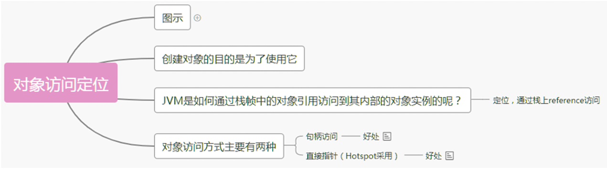
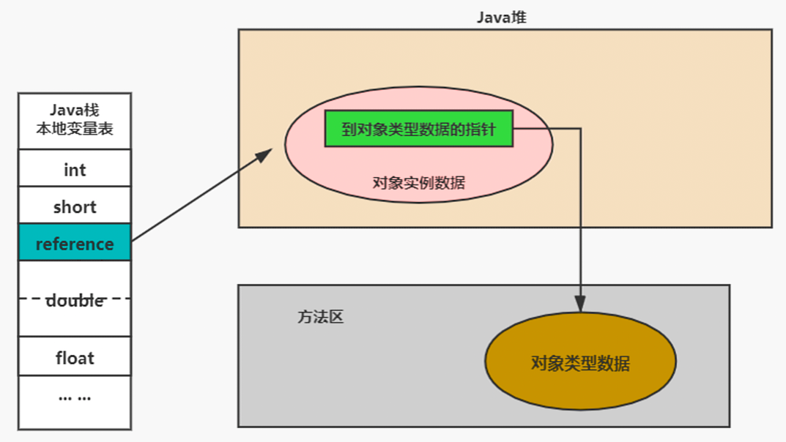

# 对象内存布局

## 对象实例化


### 创建对象的方式

- new：最常见的方式、Xxx 的静态方法，XxxBuilder/XxxFactory 的静态方法
- Class 的 newInstance 方法：反射的方式，只能调用空参的构造器，权限必须是 public
- Constructor 的 newInstance(XXX)：反射的方式，可以调用空参、带参的构造器，权限没有要求
- 使用 clone()：不调用任何的构造器，要求当前的类需要实现 Cloneable 接口，实现 clone()
- 使用序列化：从文件中、从网络中获取一个对象的二进制流
- 第三方库 Objenesis

### 创建对象的步骤

前面所述是从字节码角度看待对象的创建过程，现在从执行步骤的角度来分析：

1. 判断对象对应的类是否加载、链接、初始化

   - 虚拟机遇到一条 new 指令，首先去检查这个指令的参数能否在 Metaspace 的常量池中定位到一个类的符号引用，并且检查这个符号引用代表的类是否已经被加载，解析和初始化（即判断类元信息是否存在）。

   - 如果没有，那么在双亲委派模式下，使用当前类加载器以 ClassLoader + 包名 + 类名为 key 进行查找对应的 .class 文件

   - 如果没有找到文件，则抛出 ClassNotFoundException 异常

   - 如果找到，则进行类加载，并生成对应的 Class 对象

1. 为对象分配内存

   - 首先计算对象占用空间的大小，接着在堆中划分一块内存给新对象。如果实例成员变量是引用变量，仅分配引用变量空间即可，即 4 个字节大小。
   - **如果内存规整**：虚拟机将采用的是**指针碰撞法（Bump The Point）**来为对象分配内存。意思是所有用过的内存在一边，空闲的内存放另外一边，中间放着一个指针作为分界点的指示器，分配内存就仅仅是把指针指向空闲那边挪动一段与对象大小相等的距离罢了。如果垃圾收集器选择的是 Serial ，ParNew 这种基于压缩算法的，虚拟机采用这种分配方式。一般使用带 Compact（整理）过程的收集器时，使用指针碰撞。

   - **如果内存不规整**：虚拟机需要维护一个**空闲列表（Free List）**来为对象分配内存。

   - 已使用的内存和未使用的内存相互交错，那么虚拟机将采用的是空闲列表来为对象分配内存。意思是虚拟机维护了一个列表，记录上那些内存块是可用的，再分配的时候从列表中找到一块足够大的空间划分给对象实例，并更新列表上的内容。

   选择哪种分配方式由 Java 堆是否规整所决定，而 Java 堆是否规整又由所采用的垃圾收集器是否带有压缩整理功能决定。

1. 处理并发问题

   - 采用 CAS 失败重试、区域加锁保证更新的原子性

   - 每个线程预先分配一块 TLAB：通过设置 `-XX:+UseTLAB` 参数来设定

1. 初始化分配到的内存
   - 所有属性设置默认值，保证对象实例字段在不赋值时可以直接使用

1. 设置对象的对象头

- 将对象的所属类（即类的元数据信息）、对象的 HashCode 和对象的 GC 信息、锁信息等数据存储在对象的对象头中。这个过程的具体设置方式取决于 JVM 实现。

1. 执行 init 方法进行初始化

   - 在 Java 程序的视角看来，初始化才正式开始。**初始化成员变量，执行实例化代码块，调用类的构造方法**，并把堆内对象的首地址赋值给引用变量。

   - 一般来说（由字节码中跟随 invokespecial 指令所决定），new 指令之后会接着就是执行方法，把对象按照程序员的意愿进行初始化，这样一个真正可用的对象才算完成创建出来。

- **给对象属性赋值的操作**：属性的默认初始化、显式初始化、代码块中初始化、构造器中初始化。

- **对象实例化的过程**：加载类元信息、为对象分配内存、处理并发问题、属性的默认初始化（零值初始化）、设置对象头信息、属性的显示初始化、代码块中初始化、构造器中初始化。

## 内存布局


### 对象头（Header）

对象头包含了两部分，分别是**运行时元数据（Mark Word）**和**类型指针**。如果是数组，还需要记录数组的长度。

运行时元数据：

- 哈希值（HashCode）
- GC 分代年龄
- 锁状态标志
- 线程持有的锁
- 偏向线程 ID
- 翩向时间戳

类型指针：指向类元数据 InstanceKlass，确定该对象所属的类型。

### 实例数据（Instance Data）

它是对象真正存储的有效信息，包括程序代码中定义的各种类型的字段（包括从父类继承下来的和本身拥有的字段）

- 相同宽度的字段总是被分配在一起
- 父类中定义的变量会出现在子类之前
- 如果 CompactFields 参数为 true（默认为 true）：子类的窄变量可能插入到父类变量的空隙

### 对齐填充（Padding）

不是必须的，也没有特别的含义，仅仅起到占位符的作用

```java
 public class Customer{
     int id = 1001;
     String name;
     Account acct;
 
     {
         name = "匿名客户";
     }
 
     public Customer() {
         acct = new Account();
     }
 }
 
 public class CustomerTest{
     public static void main(string[] args){
         Customer cust=new Customer();
     }
 }
```


## 对象的访问定位



### 句柄访问

实现：堆需要划分出一块内存来做句柄池，reference 中存储对象的句柄池地址，句柄中包含对象实例与类型数据各自具体的地址信息。

好处：reference 中存储稳定句柄地址，对象被移动（垃圾收集时移动对象很普遍）时只会改变句柄中实例数据指针即可，reference 本身不需要被修改。


### 直接指针（HotSpot 采用）

直接指针是局部变量表中的引用，直接指向堆中的实例，在对象实例中有类型指针，指向的是方法区中的对象类型数据。

JVM 可以通过对象引用准确定位到 Java 堆区中的 instanceOopDesc 对象，这样既可成功访问到对象的实例信息，当需要访问目标对象的具体类型时，JVM 则会通过存储在 instanceOopDesc 中的元数据指针定位到存储在方法区中的 instanceKlass 对象上。

实现：reference 中存储的就是对象的地址，如果只是访问对象本身的话，就不需要多一次间接访问的开销。

好处：速度更快，java中对象访问频繁，每次访问都节省了一次指针定位的时间开销。


