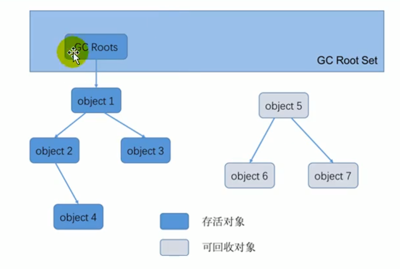

# 垃圾回收

## 概述

### 什么是垃圾

垃圾是指在运行程序中没有任何指针指向的对象，这个对象就是需要被回收的垃圾。

如果不及时对内存中的垃圾进行清理，那么，这些垃圾对象所占的内存空间会一直保留到应用程序的结束，被保留的空间无法被其它对象使用，甚至可能导致内存溢出。

### 为什么需要 GC

对于高级语言来说，如果不断地分配内存空间而不进行回收，内存迟早都会被消耗完。

除了释放没用的对象，垃圾回收也可以清除内存里的记录碎片。碎片整理将所占用的堆内存移到堆的一端，以便JVM 将整理出的内存分配给新的对象。

随着应用程序所应付的业务越来越庞大、复杂，用户越来越多，没有 GC 就不能保证应用程序的正常进行。而经常造成 STW 的 GC 又跟不上实际的需求，所以才会不断地尝试对 GC 进行优化。

垃圾收集机制极大地提高了开发效率。

### 早期的垃圾回收

在早期的 C/C++时代，垃圾回收基本上是手工进行的。开发人员可以使用 new 关键字进行内存申请，并使用 delete 关键字进行内存释放。比如以下代码：

```c++
MibBridge *pBridge= new cmBaseGroupBridge();
//如果注册失败，使用Delete释放该对象所占内存区域
if (pBridge->Register(kDestroy) != NO ERROR）
 delete pBridge;
```

这种方式可以灵活控制内存释放的时间，但是会给开发人员带来频繁申请和释放内存的管理负担。倘若有一处内存区间由于程序员编码的问题忘记被回收，那么就会产生**内存泄漏**，垃圾对象永远无法被清除，随着系统运行时间的不断增长，垃圾对象所耗内存可能持续上升，直到出现内存溢出并造成应用程序崩溃。

### Java 垃圾回收机制

自动内存管理，无需开发人员手动参与内存的分配与回收，降低内存泄漏和内存溢出的风险。自动内存管理机制，程序员可以更专心地专注于业务开发。

对于 Java 开发人员而言，自动内存管理就像是一个黑匣子，如果过度依赖于“自动”，那么这将会是一场灾难，最严重的就会弱化 Java 开发人员在程序出现内存溢出时定位问题和解决问题的能力。

此时，了解 JVM 的自动内存分配和内存回收原理就显得非常重要，只有在真正了解 JVM 是如何管理内存后，我们才能够在遇见 outofMemoryError 时，快速地根据错误异常日志定位问题和解决问题。

当需要排查各种内存溢出、内存泄漏问题时，当垃圾收集成为系统达到更高并发量的瓶颈时，我们就必须对这些“自动化”的技术实施必要的监控和调节。

GC 主要关注于 **方法区** 和 **堆** 中的垃圾收集。

垃圾收集器可以对年轻代回收，也可以对老年代回收，甚至是全栈和方法区的回收。其中，**Java 堆是垃圾收集器的工作重点**。

从次数上讲：

- 频繁收集 Young 区
- 较少收集 Old 区
- 基本不收集 Perm 区（元空间）

## 垃圾回收算法

### 垃圾判别阶段

#### 引用计数算法

引用计数算法（Reference Counting）比较简单，对每个对象保存一个整型的**引用计数器属性。用于记录对象被引用的情况。**

##### 原理

对于一个对象 A，只要有任何一个对象引用了 A，则 A 的引用计数器就加 1；当引用失效时，引用计数器就减 1。只要对象 A 的引用计数器的值为 0，即表示对象 A 不可能再被使用，可进行回收。

##### 优缺点

优点：**实现简单，垃圾对象便于辨识；判定效率高，回收没有延迟性。**

缺点：

- 它需要单独的字段存储计数器，这样的做法增加了**存储空间的开销**。
- 每次赋值都需要更新计数器，伴随着加法和减法操作，这增加了**时间开销**。
- 引用计数器有一个严重的问题，即**无法处理循环引用**的情况。这是一条致命缺陷，导致在 Java 的垃圾回收器中没有使用这类算法。

##### 循环引用

```java
/**
 * -XX:+PrintGCDetails 
 */
public class RefCountGC { 
  // 这个成员属性唯一的作用就是占用一点内存 
  private byte [] bigSize = new byte [ 4 * 1024 * 1024 ]; 
  Object reference = null ; 
  public static void main(String[] args) { 
    RefCountGC obj1 = new RefCountGC(); 
    RefCountGC obj2 = new RefCountGC(); 
    obj1. reference = obj2; 
    obj2. reference = obj1; 
    obj1 = null; 
    obj2 = null; 
    // 显式的执行垃圾回收行为  
    // 这里发生 GC，但是在  Java  堆当中的两块内存依然保持着互相引用，无法回收。 
    System.gc(); 
  }
} 
```

引用计数算法，是很多语言的资源回收选择，例如因人工智能而更加火热的 Python ，它更是同时支持引用计数和垃圾收集机制。

**Java 并没有选择引用计数**，是因为其存在一个基本的难题，也就是很难处理循环引用关系。

Python 如何解决循环引用：

- 手动解除：很好理解，就是在合适的时机，解除引用关系。

- 使用弱引用 weakref，weakref 是 Python 提供的标准库，旨在解决循环引用。

#### 可达性分析算法

##### 原理

可达性分析算法（根搜索算法、追踪性垃圾收集）是将对象及其引用关系看作一个图，选定活动的对象作为 GC Roots，然后跟踪引用链条，如果一个对象和 GC Roots 之间不可达，也就是不存在引用链条，那么即可认为是可回收对象。

##### 基本思路

- 可达性分析算法是以根对象集合（GCRoots）为起始点，按照从上至下的方式**搜索被根对象集合所连接的目标对象是否可达**。
- 使用可达性分析算法后，内存中的存活对象都会被根对象集合直接或间接连接着，搜索所走过的路径称为**引用链（Reference Chain）**
- 如果目标对象没有任何引用链相连，则是不可达的，就意味着该对象己经死亡，可以标记为垃圾对象。
- 在可达性分析算法中，只有能够被根对象集合直接或者间接连接的对象才是存活对象。



##### 优点

相对于引用计数算法而言，可达性分析算法不仅同样具备实现简单和执行高效等特点，更重要的是该算法可以有效地**解决在引用计数算法中循环引用的问题，防止内存泄漏的发生**。

相较于引用计数算法，这里的可达性分析就是 Java、C# 选择的。这种类型的垃圾收集通常也叫作**追踪性垃圾收集（Tracing Garbage Collection）**

##### GC Roots

在 Java 语言中，GC Roots 包括以下几类元素：

- 虚拟机栈中引用的对象，比如：各个线程被调用的方法中使用到的参数、局部变量等。

- 本地方法栈内 JNI（通常说的本地方法）引用的对象。
- 方法区中类静态属性引用的对象，比如：Java 类的引用类型静态变量。

- 方法区中常量引用的对象，比如：字符串常量池（String Table）里的引用。

- 所有被同步锁 synchronized 持有的对象。
- Java 虚拟机内部的引用。基本数据类型对应的 Class 对象，一些常驻的异常对象（如：NullPointerException、OutOfMemoryError），系统类加载器。

- 反映 java 虚拟机内部情况的 JMXBean、JVMTI 中注册的回调、本地代码缓存等。


除了这些固定的 GC Roots 集合以外，根据用户所选用的垃圾收集器以及当前回收的内存区域不同，还可以有其他对象“临时性”地加入，共同构成完整 GC Roots 集合。比如：分代收集和局部回收（PartialGC）。

如果只针对 Java 堆中的某一块区域进行垃圾回收（比如：典型的只针对新生代），必须考虑到内存区域是虚拟机自己的实现细节，更不是孤立封闭的，这个区域的对象完全有可能被其他区域的对象所引用，这时候就需要一并将关联的区域对象也加入 GCRoots 集合中去考虑，才能保证可达性分析的准确性。

小技巧：由于 Root 采用栈方式存放变量和指针，所以如果一个指针，它保存了堆内存里面的对象，但是自己又不存放在堆内存里面，那它就是一个 Root。

##### 注意点

如果要使用可达性分析算法来判断内存是否可回收，那么分析工作必须在一个能保障一致性的快照中进行。这点不满足的话分析结果的准确性就无法保证。

这点也是导致 GC 进行时必须“stop The World”的一个重要原因。

即使是号称（几乎）不会发生停顿的 CMS 收集器中，枚举根节点时也是必须要停顿的。

#### MAT

##### MAT 是什么

MAT 是 Memory Analyzer 的简称，它是一款功能强大的 Java 堆内存分析器。用于查找内存泄漏以及查看内存消耗情况。

MAT 是基于 Eclipse 开发的，是一款免费的性能分析工具。

大家可以在 [http://www.eclipse.org/mat/](http://www.eclipse.org/mat/) 下载并使用 MAT

##### 获取 dump 文件

方式一：命令行使用 jmap


方式二：使用 JVisualVM 导出

捕获的 heap dump 文件是一个临时文件，关闭 JVisualVM 后自动删除，若要保留，需要将其另存为文件。

可通过以下方法捕获 heap dump：

- 在左侧“Application"（应用程序）子窗口中右击相应的应用程序，选择 Heap Dump（堆 Dump）。

- 在 Monitor（监视）子标签页中点击 Heap Dump（堆 Dump）按钮。

本地应用程序的 Heap dumps 作为应用程序标签页的一个子标签页打开。同时，heap dump 在左侧的 Application（应用程序）栏中对应一个含有时间戳的节点。

右击这个节点选择 save as（另存为）即可将 heap dump 保存到本地。

方式三：使用 MAT 打开 Dump 文件


##### JProfiler 的 GC Roots 溯源

我们在实际的开发中，一般不会查找全部的 GC Roots，可能只是查找某个对象的整个链路，或者称为 GC Roots 溯源，这个时候，我们就可以使用 JProfiler


### 垃圾清除阶段

当成功区分出内存中存活对象和死亡对象后，GC 接下来的任务就是执行垃圾回收，释放掉无用对象所占用的内存空间，以便有足够的可用内存空间为新对象分配内存。

目前在 JVM 中比较常见的三种垃圾收集算法是**标记一清除算法（Mark-Sweep）、复制算法（copying）、标记-压缩算法（Mark-Compact）**

#### 标记-清除算法

标记-清除算法（Mark-Sweep）是一种非常基础和常见的垃圾收集算法，该算法被 J.McCarthy 等人在 1960 年提出并并应用于 Lisp 语言。

##### 执行过程

当堆中的有效内存空间（available memory）被耗尽的时候，就会停止整个程序（也被称为 stop the world），然后进行两项工作，第一项则是标记，第二项则是清除

- **标记**：Collector 从引用根节点开始遍历，标记所有被引用的对象。一般是在对象的 Header 中记录为可达对象。

- **清除**：Collector 对堆内存从头到尾进行线性的遍历，如果发现某个对象在其 Header 中没有标记为可达对象，则将其回收


##### 缺点

- 效率比较低：递归与全堆对象遍历两次
- 在进行 GC 的时候，需要停止整个应用程序，用户体验较差
- 这种方式清理出来的空闲内存是不连续的，产生内碎片，需要维护一个空闲列表

##### 何为清除？

这里所谓的清除并不是真的置空，而是把需要清除的对象地址保存在空闲的地址列表里。下次有新对象需要加载时，判断垃圾的位置空间是否够，如果够，就存放覆盖原有的地址。

#### 复制算法

为了解决标记-清除算法在垃圾收集效率方面的缺陷，M.L.Minsky 于 1963 年发表了著名的论文，“使用双存储区的 Lisp 语言垃圾收集器 CA LISP Garbage Collector Algorithm Using Serial Secondary Storage）”。M.L.Minsky 在该论文中描述的算法被人们称为复制（Copying）算法，它也被 M.L.Minsky 本人成功地引入到了 Lisp 语言的一个实现版本中。

##### 核心思想

将活着的内存空间分为两块，每次只使用其中一块，在垃圾回收时将正在使用的内存中的存活对象复制到未被使用的内存块中，之后清除正在使用的内存块中的所有对象，交换两个内存的角色，最后完成垃圾回收


##### 优点

- 没有标记和清除过程，实现简单，运行高效
- 复制过去以后保证空间的连续性，不会出现“碎片”问题。

##### 缺点

- 此算法的缺点也是很明显的，就是需要两倍的内存空间。
- 对于 G1 这种分拆成为大量 region 的 GC，复制而不是移动，意味着 GC 需要维护 region 之间对象引用关系，不管是内存占用或者时间开销也不小

##### 特别的

如果系统中的垃圾对象很多，复制算法需要复制的存活对象数量并不会太大，或者说非常低才行

##### 应用场景

在新生代，对常规应用的垃圾回收，一次通常可以回收 70% - 99% 的内存空间。回收性价比很高。所以现在的商业虚拟机都是用这种收集算法回收新生代。


#### 标记-压缩（整理）算法

复制算法的高效性是建立在存活对象少、垃圾对象多的前提下的。这种情况在新生代经常发生，但是在老年代，更常见的情况是大部分对象都是存活对象。如果依然使用复制算法，由于存活对象较多，复制的成本也将很高。因此，基于老年代垃圾回收的特性，需要使用其他的算法。

标记一清除算法的确可以应用在老年代中，但是该算法不仅执行效率低下，而且在执行完内存回收后还会产生内存碎片，所以 JVM 的设计者需要在此基础之上进行改进。标记-压缩（Mark-Compact）算法由此诞生。

1970 年前后，G.L.Steele、C.J.Chene 和 D.s.Wise 等研究者发布标记-压缩算法。在许多现代的垃圾收集器中，人们都使用了标记-压缩算法或其改进版本。

##### 执行过程

1. 第一阶段和标记清除算法一样，从根节点开始标记所有被引用对象

2. 第二阶段将所有的存活对象压缩到内存的一端，按顺序排放。
3. 之后，清理边界外所有的空间。


标记-压缩算法的最终效果等同于标记-清除算法执行完成后，再进行一次内存碎片整理，因此，也可以把它称为**标记-清除-压缩（Mark-Sweep-Compact）算法**。

二者的本质差异在于标记-清除算法是一种**非移动式的回收算法**，标记-压缩是移动式的。是否移动回收后的存活对象是一项优缺点并存的风险决策。可以看到，标记的存活对象将会被整理，按照内存地址依次排列，而未被标记的内存会被清理掉。如此一来，当我们需要给新对象分配内存时，JVM 只需要持有一个内存的起始地址即可，这比维护一个空闲列表显然少了许多开销。

##### 指针碰撞

如果内存空间以规整和有序的方式分布，即已用和未用的内存都各自一边，彼此之间维系着一个记录下一次分配起始点的标记指针，当为新对象分配内存时，只需要通过修改指针的偏移量将新对象分配在第一个空闲内存位置上，这种分配方式就叫做指针碰撞（Bump tHe Pointer）。

##### 优点

- 消除了标记-清除算法当中，内存区域分散的缺点，我们需要给新对象分配内存时，JVM 只需要持有一个内存的起始地址即可。
- 消除了复制算法当中，内存减半的高额代价。

##### 缺点

- 从效率上来说，标记-整理算法要低于复制算法。
- 移动对象的同时，如果对象被其他对象引用，则还需要调整引用的地址。
- 移动过程中，需要全程暂停用户应用程序。即：STW。

#### 对比

|              | Mark-Sweep         | Mark-Compact     | Copying                                 |
| :----------- | :----------------- | :--------------- | :-------------------------------------- |
| **速率**     | 中等               | 最慢             | 最快                                    |
| **空间开销** | 少（但会堆积碎片） | 少（不堆积碎片） | 通常需要活对象的 2 倍空间（不堆积碎片） |
| **移动对象** | 否                 | 是               | 是                                      |

效率上来说，复制算法是当之无愧的老大，但是却浪费了太多内存。

而为了尽量兼顾上面提到的三个指标，标记-整理算法相对来说更平滑一些，但是效率上不尽如人意，它比复制算法多了一个标记的阶段，比标记-清除多了一个整理内存的阶段

难道就没有一种最优算法吗？

回答：无，没有最好的算法，只有最合适的算法。

#### 分代收集算法

前面所有这些算法中，并没有一种算法可以完全替代其他算法，它们都具有自己独特的优势和特点。分代收集算法应运而生。

分代收集算法，是基于这样一个事实：不同的对象的生命周期是不一样的。因此，**不同生命周期的对象可以采取不同的收集方式**，以便提高回收效率。一般是把 Java 堆分为新生代和老年代，这样就可以根据各个年代的特点使用不同的回收算法，以提高垃圾回收的效率。

在 Java 程序运行的过程中，会产生大量的对象，其中有些对象是与业务信息相关，比如**Http 请求中的 Session 对象、线程、Socket 连接**，这类对象跟业务直接挂钩，因此生命周期比较长。但是还有一些对象，主要是程序运行过程中生成的临时变量，这些对象生命周期会比较短，比如：**String 对象**，由于其不变类的特性，系统会产生大量的这些对象，有些对象甚至只用一次即可回收。

**目前几乎所有的 GC 都采用分代收集算法执行垃圾回收的。**

在 HotSpot 中，基于分代的概念，GC 所使用的内存回收算法必须结合年轻代和老年代各自的特点。

##### 年轻代

年轻代（Young Gen）特点：区域相对老年代较小，对象生命周期短、存活率低，回收频繁。

这种情况复制算法的回收整理，速度是最快的。复制算法的效率只和当前存活对象大小有关，因此很适用于年轻代的回收。而复制算法内存利用率不高的问题，通过 hotspot 中的两个 survivor 的设计得到缓解。

##### 老年代

老年代（Tenured Gen）特点：区域较大，对象生命周期长、存活率高，回收不及年轻代频繁。

这种情况存在大量存活率高的对象，复制算法明显变得不合适。一般是由标记-清除或者是标记-清除与标记-整理的混合实现。

- Mark 阶段的开销与存活对象的数量成正比。
- Sweep 阶段的开销与所管理区域的大小成正相关。
- Compact 阶段的开销与存活对象的数据成正比。

以 HotSpot 中的 CMS 回收器为例，CMS 是基于 Mark-Sweep 实现的，对于对象的回收效率很高。而对于碎片问题，CMS 采用基于 Mark-Compact 算法的 Serial Old 回收器作为补偿措施：当内存回收不佳（碎片导致的 Concurrent Mode Failure 时），将采用 Serial Old 执行 Full GC 以达到对老年代内存的整理。

分代的思想被现有的虚拟机广泛使用。几乎所有的垃圾回收器都区分新生代和老年代。

#### 增量收集算法

上述现有的算法，在垃圾回收过程中，应用软件将处于一种 Stop the World 的状态。在 Stop the World 状态下，应用程序所有的线程都会挂起，暂停一切正常的工作，等待垃圾回收的完成。如果垃圾回收时间过长，应用程序会被挂起很久，将**严重影响用户体验或者系统的稳定性**。为了解决这个问题，即对实时垃圾收集算法的研究直接导致了增量收集（Incremental Collecting）算法的诞生。

##### 基本思想

如果一次性将所有的垃圾进行处理，需要造成系统长时间的停顿，那么就可以让垃圾收集线程和应用程序线程交替执行。每次，**垃圾收集线程只收集一小片区域的内存空间，接着切换到应用程序线程。依次反复，直到垃圾收集完成**。

总的来说，增量收集算法的基础仍是传统的标记-清除和复制算法。增量收集算法通过**对线程间冲突的妥善处理，允许垃圾收集线程以分阶段的方式完成标记、清理或复制工作**

##### 缺点

使用这种方式，由于在垃圾回收过程中，间断性地还执行了应用程序代码，所以能减少系统的停顿时间。但是，因为线程切换和上下文转换的消耗，会使得垃圾回收的总体成本上升，**造成系统吞吐量的下降**。

#### 分区算法

一般来说，在相同条件下，堆空间越大，一次 GC 时所需要的时间就越长，有关 GC 产生的停顿也越长。为了更好地控制 GC 产生的停顿时间，将一块大的内存区域分割成多个小块，根据目标的停顿时间，每次合理地回收若干个小区间，而不是整个堆空间，从而减少一次 GC 所产生的停顿。

分代算法将按照对象的生命周期长短划分成两个部分，分区算法将整个堆空间划分成连续的不同小区间。

每一个小区间都独立使用，独立回收。这种算法的好处是可以控制一次回收多少个小区间。


## 相关概念

### System.gc() 的理解

在默认情况下，通过 `system.gc()` 或者 `Runtime.getRuntime().gc()` 的调用，**会显式触发 Full GC**，同时对老年代和新生代进行回收，尝试释放被丢弃对象占用的内存。

然而 `System.gc()` 调用附带一个免责声明，无法保证对垃圾收集器的调用。(不能确保立即生效)

JVM 实现者可以通过 `System.gc()` 调用来决定 JVM 的 GC 行为。而一般情况下，垃圾回收应该是自动进行的，无须手动触发，否则就太过于麻烦了。在一些特殊情况下，如我们正在编写一个性能基准，我们可以在运行之间调用 `System.gc()`。

### finalize() 方法

`finalize()` 是 Object 的 protected 方法，子类可以覆盖该方法以实现资源清理工作，GC 在回收对象之前调用该方法。

Java 语言提供了对象终止（finalization）机制来允许开发人员提供**对象被销毁之前的自定义处理逻辑**。

当垃圾回收器发现没有引用指向一个对象，即：垃圾回收此对象之前，总会先调用这个对象的 `finalize()` 方法。

`finalize()` 方法允许在子类中被重写，**用于在对象被回收时进行资源释放**。通常在这个方法中进行一些资源释放和清理的工作，比如关闭文件、套接字和数据库连接等。

永远不要主动调用某个对象的 `finalize()` 方法 I 应该交给垃圾回收机制调用。理由包括下面三点：

- 在 `finalize()` 时可能会导致对象复活。
- `finalize()` 方法的执行时间是没有保障的，它完全由 GC 线程决定，极端情况下，若不发生 GC，则 finalize( )方法将没有执行机会。
- 一个糟糕的 `finalize()` 会严重影响 Gc 的性能。

从功能上来说，`finalize()` 方法与 C++ 中的析构函数比较相似，但是 Java 采用的是基于垃圾回收器的自动内存管理机制，所以 `finalize()` 方法在本质上不同于 C++ 中的析构函数。

由于 `finalize()` 方法的存在，**虚拟机中的对象一般处于三种可能的状态**。

### 内存溢出与内存泄露

#### 内存溢出

内存溢出（OOM）相对于内存泄漏来说，尽管更容易被理解，但是同样的，内存溢出也是引发程序崩溃的罪魁祸首之一。

由于 GC 一直在发展，所有一般情况下，除非应用程序占用的内存增长速度非常快，造成垃圾回收已经跟不上内存消耗的速度，否则不太容易出现 OOM 的情况。

大多数情况下，GC 会进行各种年龄段的垃圾回收，实在不行就来一次独占式的 Full GC 操作，这时候会回收大量的内存，供应用程序继续使用。

javadoc 中对 OutOfMemoryError 的解释是，**没有空闲内存，并且垃圾收集器也无法提供更多内存**。

首先说没有空闲内存的情况：说明 Java 虚拟机的堆内存不够。原因有二：

1. **Java 虚拟机的堆内存设置不够。**

   比如：可能存在内存泄漏问题；也很有可能就是堆的大小不合理，比如我们要处理比较可观的数据量，但是没有显式指定 JVM 堆大小或者指定数值偏小。我们可以通过参数`-Xms` 、`-Xmx`来调整。

2. **代码中创建了大量大对象，并且长时间不能被垃圾收集器收集（存在被引用）**

   对于老版本的 Oracle JDK，因为永久代的大小是有限的，并且 JVM 对永久代垃圾回收（如，常量池回收、卸载不再需要的类型）非常不积极，所以当我们不断添加新类型的时候，永久代出现 OutOfMemoryError 也非常多见，尤其是在运行时存在大量动态类型生成的场合；类似 intern 字符串缓存占用太多空间，也会导致 OOM 问题。对应的异常信息，会标记出来和永久代相关：“`java.lang.OutOfMemoryError: PermGen space`"。

   随着元数据区的引入，方法区内存已经不再那么窘迫，所以相应的 OOM 有所改观，出现 OOM，异常信息则变成了：“`java.lang.OutofMemoryError:Metaspace`"。直接内存不足，也会导致 OOM。

这里面隐含着一层意思是，在抛出 OutOfMemoryError 之前，通常垃圾收集器会被触发，尽其所能去清理出空间。

- 例如：在引用机制分析中，涉及到 JVM 会去尝试回收软引用指向的对象等。
- 在`java.nio.BIts.reserveMemory()`方法中，我们能清楚的看到，`System.gc()`会被调用，以清理空间。

当然，也不是在任何情况下垃圾收集器都会被触发的，比如分配一个超大对象，类似一个超大数组超过堆的最大值，JVM 可以判断出垃圾收集并不能解决这个问题，所以直接抛出 OutOfMemoryError。

#### 内存泄漏

内存泄漏（Memory Leak）也称作“存储渗漏”。严格来说，**只有对象不会再被程序用到了，但是 GC 又不能回收他们的情况，才叫内存泄漏**。

但实际情况很多时候一些不太好的实践（或疏忽）会导致对象的生命周期变得很长甚至导致 OOM，也可以叫做**宽泛意义上的“内存泄漏”**。

尽管内存泄漏并不会立刻引起程序崩溃，但是一旦发生内存泄漏，程序中的可用内存就会被逐步蚕食，直至耗尽所有内存，最终出现 OutOfMemory 异常，导致程序崩溃。

注意，这里的存储空间并不是指物理内存，而是指虚拟内存大小，这个虚拟内存大小取决于磁盘交换区设定的大小。

举例：

1. 单例模式

   单例的生命周期和应用程序是一样长的，所以单例程序中，如果持有对外部对象的引用的话，那么这个外部对象是不能被回收的，则会导致内存泄漏的产生。

2. 一些提供 close 的资源未关闭导致内存泄漏

   数据库连接（dataSourse.getConnection() ），网络连接（socket）和 io 连接必须手动 close，否则是不能被回收的。

### STW

Stop-the-World，简称 STW，指的是 GC 事件发生过程中，会产生应用程序的停顿。停顿产生时整个应用程序线程都会被暂停，没有任何响应，有点像卡死的感觉，这个停顿称为 STW。

**可达性分析算法中枚举根节点（GC Roots）会导致所有 Java 执行线程停顿。**

- 分析工作必须在一个能确保一致性的快照中进行
- 一致性指整个分析期间整个执行系统看起来像被冻结在某个时间点上
- **如果出现分析过程中对象引用关系还在不断变化，则分析结果的准确性无法保证**

被 STW 中断的应用程序线程会在完成 GC 之后恢复，频繁中断会让用户感觉像是网速不快造成电影卡带一样，所以我们需要减少 STW 的发生。

STW 事件和采用哪款 GC 无关，所有的 GC 都有这个事件。只能说垃圾回收器越来越优秀，回收效率越来越高，尽可能地缩短了暂停时间。

STW 是 JVM 在**后台自动发起和自动完成**的。在用户不可见的情况下，把用户正常的工作线程全部停掉。

开发中使用 `System.gc()` 会导致 Stop-the-World 的发生。

### 垃圾回收的并行与并发

并发和并行，在谈论垃圾收集器的上下文语境中，它们可以解释如下：

- 并行（Parallel）：指**多条垃圾收集线程并行工作**，但此时用户线程仍处于等待状态。如ParNew、Parallel Scavenge、Parallel Old。
- 串行（Serial）：相较于并行的概念，**单线程执行**。如果内存不够，则程序暂停，启动jvm垃圾回收器进行垃圾回收。回收完，再启动程序的线程。

- 并发（Concurrent）：指**用户线程与垃圾收集线程同时执行**（但不一定是并行的，可能会交替执行），垃圾回收线程在执行时不会停顿用户程序的运行。如：CMS、G1。

### 安全点与安全域

#### 安全点

程序执行时并非在所有地方都能停顿下来开始 GC，只有在特定的位置才能停顿下来开始 GC，这些位置称为“安全点（Safe Point）”。

Safe Point 的选择很重要，**如果太少可能导致 GC 等待的时间太长，如果太频繁可能导致运行时的性能问题**。大部分指令的执行时间都非常短暂，通常会根据“**是否具有让程序长时间执行的特征**”为标准。比如：选择一些执行时间较长的指令作为 Safe Point，如**方法调用、循环跳转和异常跳转等**。

如何在 GC 发生时，检查所有线程都跑到最近的安全点停顿下来呢？

- 抢先式中断：首先中断所有线程。如果还有线程不在安全点，就恢复线程，让线程跑到安全点。（目前没有虚拟机采用了）
- 主动式中断：设置一个中断标志，各个线程运行到 Safe Point 的时候主动轮询这个标志，如果中断标志为真，则将自己进行中断挂起。（有轮询的机制）

#### 安全区域

Safe Point 机制保证了程序执行时，在不太长的时间内就会遇到可进入 GC 的 Safepoint。但是，程序“不执行”的时候呢？例如线程处于 Sleep 状态或 Blocked 状态，这时候线程无法响应 JVM 的中断请求，“走”到安全点去中断挂起，JVM 也不太可能等待线程被唤醒。对于这种情况，就需要安全域（Safe Region）来解决。

**安全域是指在一段代码片段中，对象的引用关系不会发生变化，在这个区域中的任何位置开始 GC 都是安全的。**我们也可以把 Safe Region 看做是被扩展了的 Safe Point。

实际执行时：

1. 当线程运行到 Safe Region 的代码时，首先标识已经进入了 Safe Region，如果这段时间内发生 GC，JVM 会忽略标识为 Safe Region 状态的线程。
2. 当线程即将离开 Safe Region 时，会检查 JVM 是否已经完成 GC，如果完成了，则继续运行，否则线程必须等待直到收到可以安全离开 Safe Region 的信号为止。

### 5 种引用

我们希望能描述这样一类对象：当内存空间还足够时，则能保留在内存中；如果内存空间在进行垃圾收集后还是很紧张，则可以抛弃这些对象。

在 JDK1.2 版之后，Java 对引用的概念进行了扩充，将引用分为：强引用（Strong Reference）、软引用（Soft Reference）、弱引用（Weak Reference）、虚引用（Phantom Reference）这 4 种引用强度依次逐渐减弱。

除强引用外，其他 3 种引用均可以在 `java.lang.ref` 包中找到它们的身影。如下图，显示了这 3 种引用类型对应的类，开发人员可以在应用程序中直接使用它们。


Reference 子类中只有终结器引用是包内可见的，其他 3 种引用类型均为 public，可以在应用程序中直接使用

- 强引用（StrongReference）：最传统的“引用”的定义，是指在程序代码之中普遍存在的引用赋值，即类似“`Object obj = new Object()`”这种引用关系。无论任何情况下，只要强引用关系还存在，垃圾收集器就永远不会回收掉被引用的对象。
- 软引用（SoftReference）：在系统将要发生内存溢出之前，将会把这些对象列入回收范围之中进行第二次回收。如果这次回收后还没有足够的内存，才会抛出内存流出异常。
- 弱引用（WeakReference）：被弱引用关联的对象只能生存到下一次垃圾收集之前。当垃圾收集器工作时，无论内存空间是否足够，都会回收掉被弱引用关联的对象。
- 虚引用（PhantomReference）：一个对象是否有虚引用的存在，完全不会对其生存时间构成影响，也无法通过虚引用来获得一个对象的实例。为一个对象设置虚引用关联的唯一目的就是能在这个对象被收集器回收时收到一个系统通知。

#### 强引用

在 Java 程序中，最常见的引用类型是强引用（**普通系统 99%以上都是强引用**），也就是我们最常见的普通对象引用，**也是默认的引用类型**。

当在 Java 语言中使用 new 操作符创建一个新的对象，并将其赋值给一个变量的时候，这个变量就成为指向该对象的一个强引用。

**强引用的对象是可触及的，垃圾收集器就永远不会回收掉被引用的对象。**

对于一个普通的对象，如果没有其他的引用关系，只要超过了引用的作用域或者显式地将相应（强）引用赋值为 null，就是可以当做垃圾被收集了，当然具体回收时机还是要看垃圾收集策略。

相对的，软引用、弱引用和虚引用的对象是软可触及、弱可触及和虚可触及的，在一定条件下，都是可以被回收的。所以，**强引用是造成 Java 内存泄漏的主要原因之一**。

示例：

```java
StringBuffer str = new StringBuffer("hello mogublog");
```

局部变量 str 指向 StringBuffer 实例所在堆空间，通过 str 可以操作该实例，那么 str 就是 StringBuffer 实例的强引用。

再运行一个赋值语句

```java
StringBuffer str1 = str;
```

本例中的两个引用，都是强引用，强引用具备以下特点：

- 强引用可以直接访问目标对象。
- 强引用所指向的对象在任何时候都不会被系统回收，虚拟机宁愿抛出 OOM 异常，也不会回收强引用所指向对象。
- 强引用可能导致内存泄漏。

#### 软引用

软引用是用来描述一些还有用，但非必需的对象。**只被软引用关联着的对象，在系统将要发生内存溢出异常前，会把这些对象列进回收范围之中进行第二次回收**，如果这次回收还没有足够的内存，才会抛出内存溢出异常。

软引用通常用来实现内存敏感的缓存。比如：**高速缓存**就有用到软引用。如果还有空闲内存，就可以暂时保留缓存，当内存不足时清理掉，这样就保证了使用缓存的同时，不会耗尽内存。

垃圾回收器在某个时刻决定回收软可达的对象的时候，会清理软引用，并可选地把引用存放到一个引用队列（Reference Queue）。

类似弱引用，只不过 Java 虚拟机会尽量让软引用的存活时间长一些，迫不得已才清理。

在 JDK1.2 版之后提供了 `java.lang.ref.SoftReference` 类来实现软引用

```java
Object obj = new Object(); // 声明强引用
SoftReference<Object> sf = new SoftReference<>(obj);
obj = null; //销毁强引用
```

#### 弱引用

弱引用也是用来描述那些非必需对象，**只被弱引用关联的对象只能生存到下一次垃圾收集发生为止**。在系统 GC 时，只要发现弱引用，不管系统堆空间使用是否充足，都会回收掉只被弱引用关联的对象。

但是，由于垃圾回收器的线程通常优先级很低，因此，并不一定能很快地发现持有弱引用的对象。在这种情况下，**弱引用对象可以存在较长的时间**。

弱引用和软引用一样，在构造弱引用时，也可以指定一个引用队列，当弱引用对象被回收时，就会加入指定的引用队列，通过这个队列可以跟踪对象的回收情况。

**软引用、弱引用都非常适合来保存那些可有可无的缓存数据**。如果这么做，当系统内存不足时，这些缓存数据会被回收，不会导致内存溢出。而当内存资源充足时，这些缓存数据又可以存在相当长的时间，从而起到加速系统的作用。

在 JDK1.2 版之后提供了 WeakReference 类来实现弱引用

```java
Object obj = new Object(); // 声明强引用
WeakReference<Object> sf = new WeakReference<>(obj);
obj = null; //销毁强引用
```

**弱引用对象与软引用对象的最大不同**就在于，当 GC 在进行回收时，需要通过算法检查是否回收软引用对象，而对于弱引用对象，GC 总是进行回收。**弱引用对象更容易、更快被 GC 回收**。

`WeakHashMap` 用来存储图片信息，可以在内存不足的时候，及时回收，避免了 OOM。

#### 虚引用

也称为“幽灵引用”或者“幻影引用”，是所有引用类型中最弱的一个。

一个对象是否有虚引用的存在，完全不会决定对象的生命周期。如果一个对象仅持有虚引用，那么它和没有引用几乎是一样的，随时都可能被垃圾回收器回收。

它不能单独使用，也无法通过虚引用来获取被引用的对象。当试图通过虚引用的 get()方法取得对象时，总是 null

**为一个对象设置虚引用关联的唯一目的在于跟踪垃圾回收过程。比如：能在这个对象被收集器回收时收到一个系统通知。**

虚引用必须和引用队列一起使用。虚引用在创建时必须提供一个引用队列作为参数。当垃圾回收器准备回收一个对象时，如果发现它还有虚引用，就会在回收对象后，将这个虚引用加入引用队列，以通知应用程序对象的回收情况。

**由于虚引用可以跟踪对象的回收时间，因此，也可以将一些资源释放操作放置在虚引用中执行和记录。**

在 JDK1.2 版之后提供了 PhantomReference 类来实现虚引用。

```java
Object obj = new Object(); // 声明强引用
ReferenceQueue phantomQueue = new ReferenceQueue();
PhantomReference<Object> sf = new PhantomReference<>(obj, phantomQueue);
obj = null;
```

#### 终结器引用

它用于实现对象的 finalize() 方法，也可以称为终结器引用。无需手动编码，其内部配合引用队列使用。

在 GC 时，终结器引用入队。由 Finalizer 线程通过终结器引用找到被引用对象调用它的 finalize() 方法，第二次 GC 时才回收被引用的对象

## 垃圾回收器

## 分析 GC 日志
