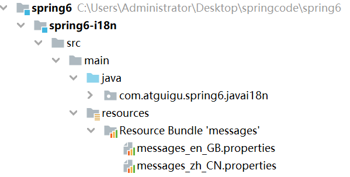

# 9、国际化：i18n


## 9.1、i18n概述

国际化也称作i18n，其来源是英文单词
internationalization的首末字符i和n，18为中间的字符数。由于软件发行可能面向多个国家，对于不同国家的用户，软件显示不同语言的过程就是国际化。通常来讲，软件中的国际化是通过配置文件来实现的，假设要支撑两种语言，那么就需要两个版本的配置文件。

## 9.2、Java国际化

（1）Java自身是支持国际化的，java.util.Locale用于指定当前用户所属的语言环境等信息，java.util.ResourceBundle用于查找绑定对应的资源文件。Locale包含了language信息和country信息，Locale创建默认locale对象时使用的静态方法：

```java
    /**
 * This method must be called only for creating the Locale.*
 * constants due to making shortcuts.
 */
private static Locale createConstant(String lang,String country){
        BaseLocale base=BaseLocale.createInstance(lang,country);
        return getInstance(base,null);
        }
```

（2）配置文件命名规则：
**basename_language_country.properties**
必须遵循以上的命名规则，java才会识别。其中，basename是必须的，语言和国家是可选的。这里存在一个优先级概念，如果同时提供了messages.properties和messages_zh_CN.propertes两个配置文件，如果提供的locale符合en_CN，那么优先查找messages_en_CN.propertes配置文件，如果没查找到，再查找messages.properties配置文件。最后，提示下，所有的配置文件必须放在classpath中，一般放在resources目录下

**（3）实验：演示Java国际化**

**第一步 创建子模块spring6-i18n，引入spring依赖**


**第二步 在resource目录下创建两个配置文件：messages_zh_CN.properties和messages_en_GB.properties**



**第三步 测试**

```java
package com.atguigu.spring6.javai18n;

import java.nio.charset.StandardCharsets;
import java.util.Locale;
import java.util.ResourceBundle;

public class Demo1 {

    public static void main(String[] args) {
        System.out.println(ResourceBundle.getBundle("messages",
                new Locale("en", "GB")).getString("test"));

        System.out.println(ResourceBundle.getBundle("messages",
                new Locale("zh", "CN")).getString("test"));
    }
}
```

## 9.3、Spring6国际化

### 9.3.1、MessageSource接口

spring中国际化是通过MessageSource这个接口来支持的

**常见实现类**

**ResourceBundleMessageSource**

这个是基于Java的ResourceBundle基础类实现，允许仅通过资源名加载国际化资源

**ReloadableResourceBundleMessageSource**

这个功能和第一个类的功能类似，多了定时刷新功能，允许在不重启系统的情况下，更新资源的信息

**StaticMessageSource**

它允许通过编程的方式提供国际化信息，一会我们可以通过这个来实现db中存储国际化信息的功能。

### 9.3.2、使用Spring6国际化

**第一步 创建资源文件**

**国际化文件命名格式：基本名称 _ 语言 _ 国家.properties**

**{0},{1}这样内容，就是动态参数**


**（1）创建atguigu_en_US.properties**

```properties
www.atguigu.com=welcome {0},时间:{1}
```

**（2）创建atguigu_zh_CN.properties**

```properties
www.atguigu.com=欢迎 {0},时间:{1}
```

**第二步 创建spring配置文件，配置MessageSource**

```xml
<?xml version="1.0" encoding="UTF-8"?>
<beans xmlns="http://www.springframework.org/schema/beans"
       xmlns:xsi="http://www.w3.org/2001/XMLSchema-instance"
       xsi:schemaLocation="http://www.springframework.org/schema/beans http://www.springframework.org/schema/beans/spring-beans.xsd">

    <bean id="messageSource"
          class="org.springframework.context.support.ResourceBundleMessageSource">
        <property name="basenames">
            <list>
                <value>atguigu</value>
            </list>
        </property>
        <property name="defaultEncoding">
            <value>utf-8</value>
        </property>
    </bean>
</beans>
```

**第三步 创建测试类**

```java
package com.atguigu.spring6.javai18n;

import org.springframework.context.ApplicationContext;
import org.springframework.context.annotation.AnnotationConfigApplicationContext;
import org.springframework.context.support.ClassPathXmlApplicationContext;

import java.util.Date;
import java.util.Locale;

public class Demo2 {

    public static void main(String[] args) {

        ApplicationContext context = new ClassPathXmlApplicationContext("beans.xml");

        //传递动态参数，使用数组形式对应{0} {1}顺序
        Object[] objs = new Object[]{"atguigu", new Date().toString()};

        //www.atguigu.com为资源文件的key值,
        //objs为资源文件value值所需要的参数,Local.CHINA为国际化为语言
        String str = context.getMessage("www.atguigu.com", objs, Locale.CHINA);
        System.out.println(str);
    }
}
```
