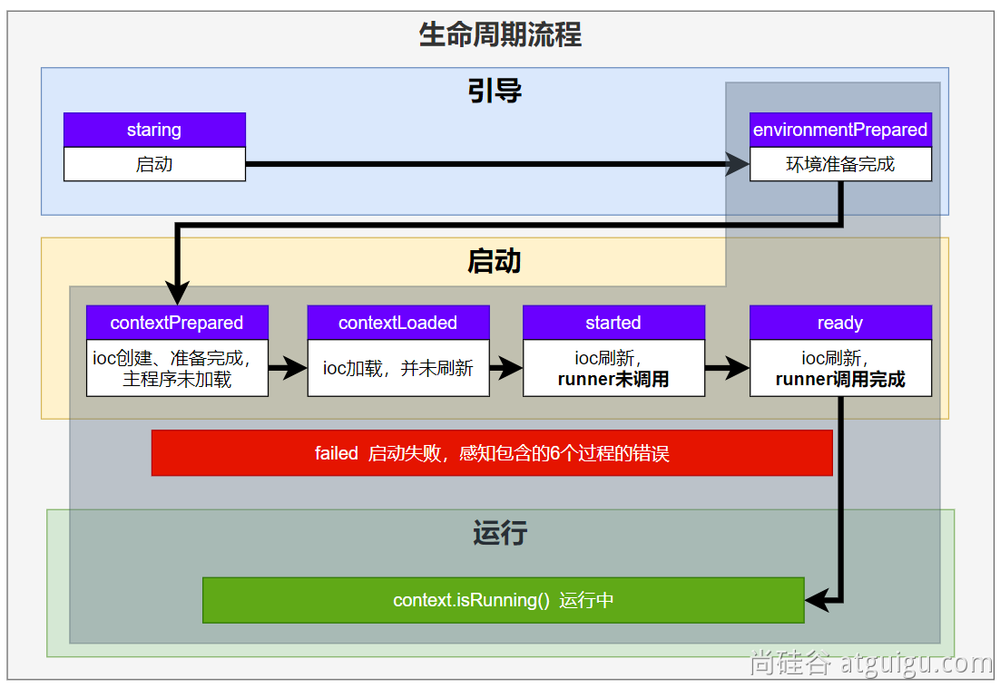
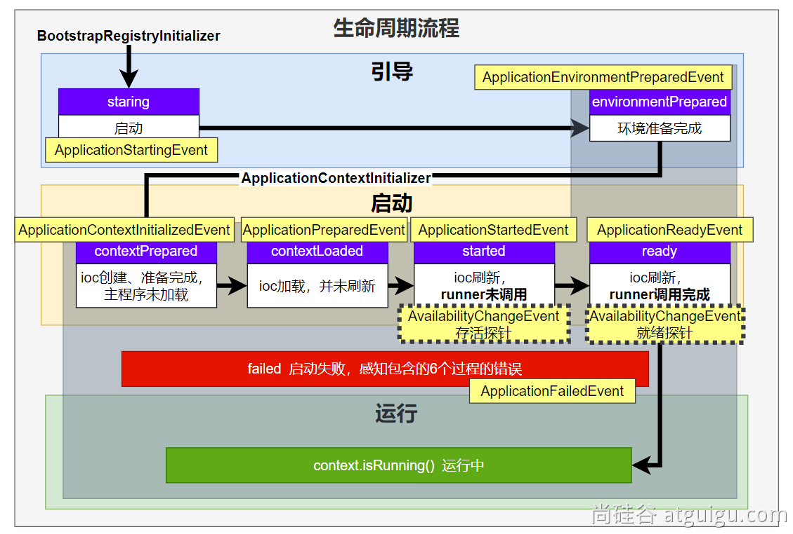
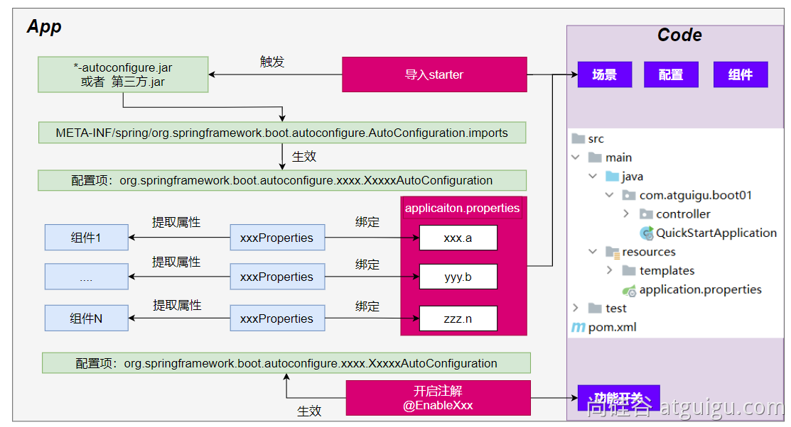

# 5、核心原理

## 5.1、事件和监听器

### 5.1.1、生命周期监听

监听器 `SpringApplicationRunListener`，自定义 `SpringApplicationRunListener` 来**监听事件**

1. 编写 `SpringApplicationRunListener` 的实现类

2. 在 `META-INF/spring.factories` 中配置 `org.springframwork.boot.SpringApplicationRunLitener=自定义监听器类全类名`，还可以指定一个有参构造器，接收连个参数 `(SpringApplication application, String[] args)`

3. Springboot 在 spring-boot.jar 中配置了默认的 Listener

   

生命周期流程：

1. 引导，利用 `BootstrapContext` 引导整个项目启动
   1. `starting` ：应用开始，SpringApplication 的 run 方法一调用，只要有了 BootstrapContext 就执行
   2. `environmentPrepared` ：环境准备好（把启动参数等绑定到环境变量中），但是ioc还没有创建；【调一次】
2. 启动
   1. `contextPrepared` ：ioc容器创建并准备好，但是sources（主配置类）没加载。并关闭引导上下文；组件都没创建  【调一次】
   2. `contextLoaded` ：ioc容器加载。主配置类加载进去了。但是ioc容器还没刷新（我们的bean没创建）。
   3. `started` ：ioc容器刷新了（所有bean造好了），但是 runner 没调用。
   4. `ready` ：ioc容器刷新了（所有bean造好了），所有 runner 调用完了。
3. 运行
   1. 以前步骤都正确执行，代表容器running。



### 5.1.2、事件触发机制

#### 5.1.2.1、各种回调监听器

- `BootstrapRegistryInitializer` : 感知特定阶段，感知初始化引导
  - 在 META-INF/spring.factories 中配置
  - 创建引导上下文 `bootstrapContext` 的时候触发
  - 使用 `application.addBootstrapRegistryInitializer()` 配置
  - 场景：进行密钥校对授权
- `ApplicationContextInitializer` : 感知特定阶段，感知 ioc 容器初始化
  - 在 META-INF/spring.factories 中配置
  - 使用 `application.addInitializers(` 配置
- `ApplicationListener` : 感知全阶段，基于事件机制，感知事件
  - @Bean 或 @EventListener：事件驱动
  - 使用 `SpringApplication.addListeners()` 或 `SpringApplicationBuilder.listeners()` 配置
  - 在 META-INF/spring.factories 中配置
- `SpringApplicationRunListener` : 感知全阶段生命周期，各种阶段都能自定义操作，功能更完善
  - 在 META-INF/spring.factories 中配置
- `ApplicationRunner` : 感知特定阶段，感知应用就绪 Ready，卡死应用就不会就绪
  - 通过 @Bean 配置
- `CommandLineRunner` : 感知特定阶段，感知应用就绪 Ready，卡死应用就不会就绪
  - 通过 @Bean 配置

最佳实战：

- 如果项目启动前做事： `BootstrapRegistryInitializer` 和 `ApplicationContextInitializer`
- 如果想要在项目启动完成后做事：`ApplicationRunner` 和 `CommandLineRunner`
- 如果要干涉生命周期做事：`SpringApplicationRunListener`
- 如果想要用事件机制：`ApplicationListener`

#### 5.1.2.2、完整触发流程

**9大事件触发顺序和时机**

1. `ApplicationStartingEvent`：应用启动但未做任何事情, 除过注册 listeners and initializers.
2. `ApplicationEnvironmentPreparedEvent`： Environment 准备好，但context 未创建
3. `ApplicationContextInitializedEvent`: ApplicationContext 准备好，ApplicationContextInitializers 调用，但是任何bean未加载
4. `ApplicationPreparedEvent`： 容器刷新之前，bean定义信息加载
5. `ApplicationStartedEvent`： 容器刷新完成， runner未调用
6. `AvailabilityChangeEvent`： LivenessState.CORRECT 应用存活，存活探针，感知应用是否存活了（可能植物状态，虽然活着但是不能处理请求）
7. `ApplicationReadyEvent`: 任何runner被调用
8. `AvailabilityChangeEvent` ：ReadinessState.ACCEPTING\_TRAFFIC 就绪探针，可以接请求
9. `ApplicationFailedEvent` ：启动出错



应用事件发送顺序如下:


#### 5.1.2.3、事件驱动开发

**应用启动过程生命周期事件感知（9大事件）**、**应用运行中事件感知（无数种）**

- **事件发布**：`ApplicationEventPublisherAware` 或 `注入：ApplicationEventMulticaster`
- **事件监听**：`组件 + @EventListener`


事件发布者：

```java
@Component
public class EventPublisher implements ApplicationEventPublisherAware {

    /**
     * 底层发送事件用的组件，Springboot 会通过 ApplicationEventPublisherAware 接口自动注入
     * 事件是广播出去的，所有监听这个时间的监听器都可以收到
     */
    ApplicationEventPublisher applicationEventPublisher;

    /**
     * 会被自动调用，把真正发事件的底层组组件给我们注入进来
     */
    @Override
    public void setApplicationEventPublisher(ApplicationEventPublisher applicationEventPublisher) {
        this.applicationEventPublisher = applicationEventPublisher;
    }

    /**
     * 发送事件
     */
    public void sendEvent(ApplicationEvent event) {
        applicationEventPublisher.publishEvent(event);
    }
}
```

事件订阅者：

```java
@Order(2)
@Service
public class AccountService implements ApplicationListener<LoginSuccessEvent> {

    public void addAccountScore(String username) {
        System.out.println(username + "签到加1积分");
    }

    @Override
    public void onApplicationEvent(LoginSuccessEvent event) {
        System.out.println("=====  AccountService  监听到 LoginSuccessEvent 事件 =====");
        String username = (String) event.getSource();
        addAccountScore(username);
    }
}
```

```java
@Service
public class SystemService {

    public void recordLog(String username) {
        System.out.println(username + "登录，记录系统日志");
    }

    @Order(0)
    @EventListener
    public void onEvent(LoginSuccessEvent event) {
        System.out.println("=====  SystemService  监听到 LoginSuccessEvent 事件 =====");
        String username = (String) event.getSource();
        recordLog(username);
    }
}
```

## 5.2、自动配置原理

### 5.2.1、入门理解

应用关注的**三大核心**：**场景**、**配置**、**组件**

1. 自动配置流程

   

   1. 导入 starter
   2. 依赖导入 autoconfigure
   3. 寻找类路径下的 META-INF/spring/org.springframework.boot.autoconfigure.AutoConfiguration.imports 文件
   4. 启动，加载所有 自动配置类 xxxAutoConfiguration
      1. 给容器中配置功能组件
      2. 组件参数绑定到属性类中 xxxProperties
      3. 属性类和配置文件前缀项绑定
      4. @Contional 派生的条件注解 进行判断是否组件生效
   5. 效果：
      1. 修改配置文件，修改底层参数
      2. 所有场景自动配置好直接使用
      3. 可以注入 springboot 配置好的组件随时使用

2. SPI机制

   1. Java中的SPI（Service Provider Interface）是一种软件设计模式，用于在应用程序中动态地发现和加载组件。SPI的思想是，定义一个接口或抽象类，然后通过在classpath中定义实现该接口的类来实现对组件的动态发现和加载。
   2. SPI的主要目的是解决在应用程序中使用可插拔组件的问题。例如，一个应用程序可能需要使用不同的日志框架或数据库连接池，但是这些组件的选择可能取决于运行时的条件。通过使用SPI，应用程序可以在运行时发现并加载适当的组件，而无需在代码中硬编码这些组件的实现类。
   3. 在Java中，SPI的实现方式是通过在META-INF/services目录下创建一个以服务接口全限定名为名字的文件，文件中包含实现该服务接口的类的全限定名。当应用程序启动时，Java的SPI机制会自动扫描classpath中的这些文件，并根据文件中指定的类名来加载实现类。
   4. 通过使用SPI，应用程序可以实现更灵活、可扩展的架构，同时也可以避免硬编码依赖关系和增加代码的可维护性。

3. 功能开关

   1. 自动配置：自动批量导入。项目一启动，spi文件中指定的所有都加载。
   2. @EnableXxxx ：手动控制哪些功能的开启；手动导入。开启xxx功能，利用 @Import 把此功能要用的组件导入进去。

### 5.2.2、进阶理解

1. @SpringBootApplication 包含以下三个注解

   1. @SpringBootConfiguration

      就是：@Configuration ，容器中的组件，配置类。spring ioc启动就会加载创建这个类对象

   2. @EnableAutoConfiguration 开启自动配置

      1. @AutoConfigurationPackage：扫描主程序包：加载自己的组件

         利用 @Import(AutoConfigurationPackages.Registrar.class) 想要给容器中导入组件。

         把主程序所在的包的所有组件导入进来。

      2. @Import(AutoConfigurationImportSelector.class)：加载所有自动配置类：加载starter导入的组件

         ```java
         List<String> configurations = ImportCandidates.load(AutoConfiguration.class, getBeanClassLoader())
           .getCandidates();
         ```

         扫描SPI文件：META-INF/spring/org.springframework.boot.autoconfigure.AutoConfiguration.imports

   3. @ComponentScan

      组件扫描：排除一些组件（哪些不要），排除前面已经扫描进来的配置类、和自动配置类

      ```java
      @ComponentScan(excludeFilters = { @Filter(type = FilterType.CUSTOM, classes = TypeExcludeFilter.class),
            @Filter(type = FilterType.CUSTOM, classes = AutoConfigurationExcludeFilter.class) })
      ```

2. 完整的启动加载流程

   生命周期启动加载流程

   

## 5.3、自定义starter

场景：**抽取聊天机器人场景，它可以打招呼**。

效果：任何项目导入此`starter`都具有打招呼功能，并且**问候语**中的**人名**需要可以在**配置文件**中修改

1. 创建自定义starter项目，引入spring-boot-starter基础依赖
2. 编写模块功能，引入模块所有需要的依赖
3. 编写 xxxAutoConfiguration 自动配置类，帮其他项目导入这个模块需要的所有组件
4. 编写配置文件 META-INF/spring/org.springframework.boot.autoconfigure.AutoConfiguration.imports 指定启动需要加载的自动配置
5. 其他项目引入即可使用

### 5.3.1、业务代码

配置类

```java
@ConfigurationProperties(prefix = "robot")  //此属性类和配置文件指定前缀绑定
@Component
@Data
public class RobotProperties {
    private String name;
    private String age;
    private String email;
}
```

导入配置处理器，配置文件自定义的properties配置都会有提示

```java
<dependency>
  <groupId>org.springframework.boot</groupId>
  <artifactId>spring-boot-configuration-processor</artifactId>
  <optional>true</optional>
</dependency>
```

### 5.3.2、基本抽取

- 创建starter项目，把公共代码需要的所有依赖导入
- 把公共代码复制进来
- 自己写一个 `RobotAutoConfiguration`，给容器中导入这个场景需要的所有组件

- - 为什么这些组件默认不会扫描进去？
  - **starter所在的包和 引入它的项目的主程序所在的包不是父子层级**

- 别人引用这个 `starter`，直接导入这个 `RobotAutoConfiguration`, 就能把这个场景的组件导入进来
- 功能生效
- 测试编写配置文件

### 5.3.3、使用 @EnableXxx 机制

编写注解

```java
@Retention(RetentionPolicy.RUNTIME)
@Target({ElementType.TYPE})
@Documented
@Import(RobotAutoConfiguration.class)
public @interface EnableRobot {
}
```

别人引入 `starter` 需要使用 `@EnableRobot` 开启功能

### 5.3.4、完全自动配置

- 依赖SpringBoot的SPI机制
- META-INF/spring/org.springframework.boot.autoconfigure.AutoConfiguration.imports 文件中编写好我们自动配置类的全类名即可
- 项目启动，自动加载我们的自动配置类
