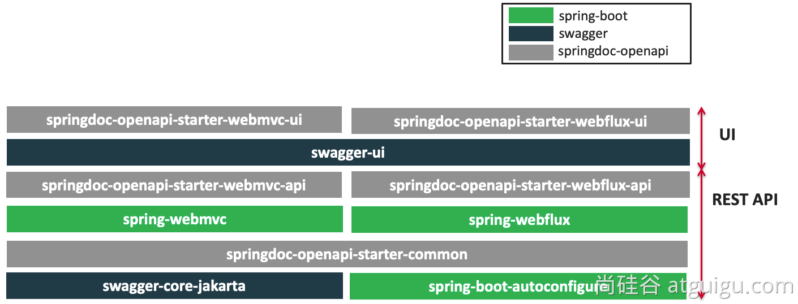
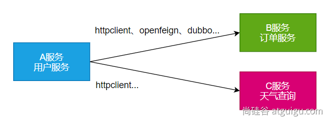
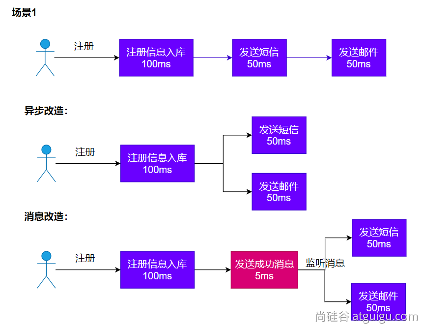
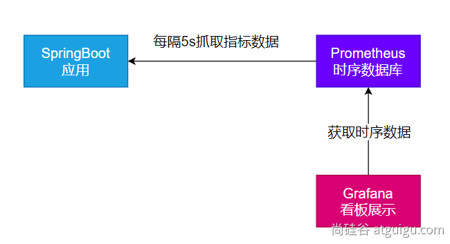
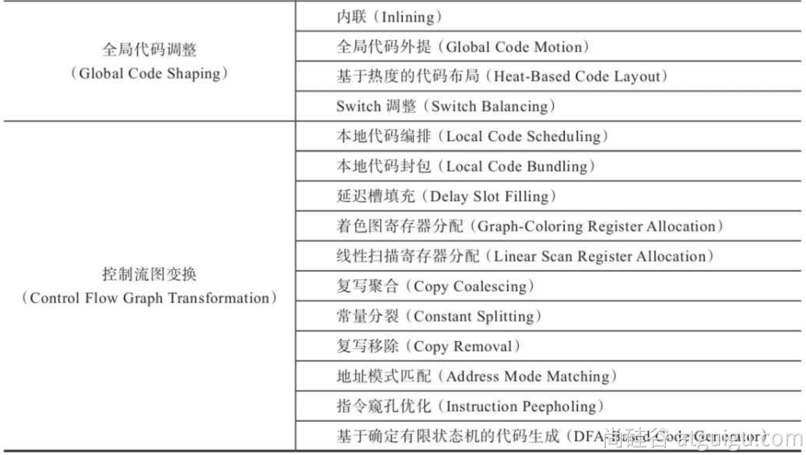
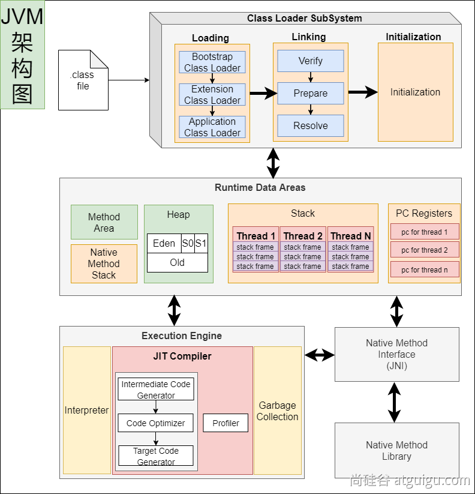
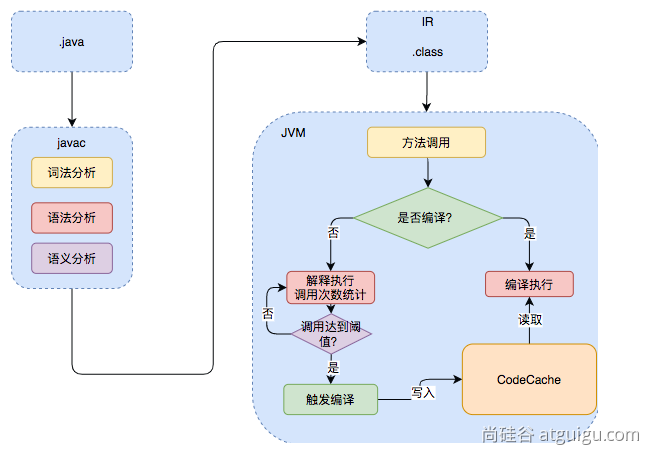
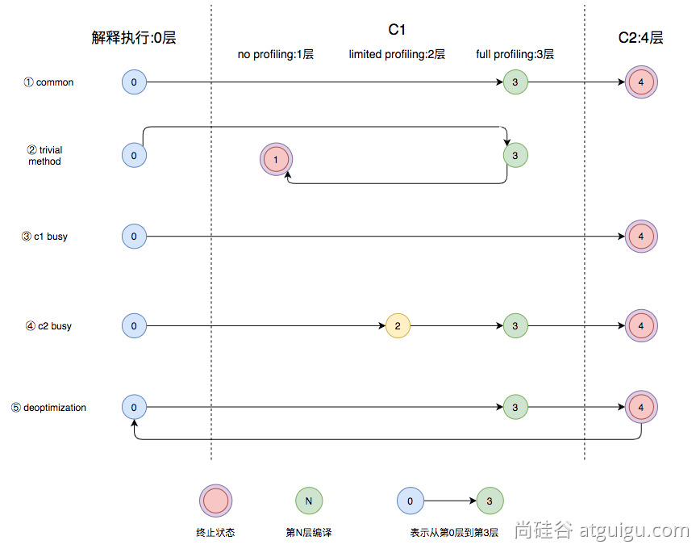
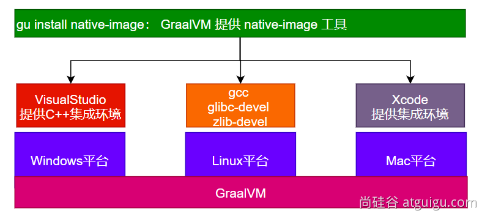
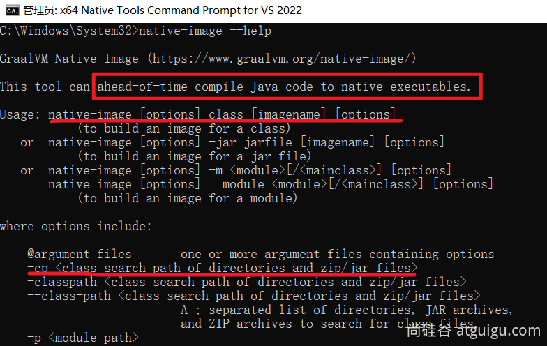

# 6、场景整合

## 6.1、NoSQL

### 6.1.1、redis

#### 6.1.1.1、场景整合

1. 导入依赖

   ```java
   <dependency>
       <groupId>org.springframework.boot</groupId>
       <artifactId>spring-boot-starter-data-redis</artifactId>
   </dependency>
   ```

2. 配置

   ```properties
   spring.data.redis.host=192.168.200.100
   spring.data.redis.password=
   ```

3. 测试

   ```java
   @Autowired
   StringRedisTemplate redisTemplate;
   
   @Test
   void redisTest(){
       redisTemplate.opsForValue().set("a","1234");
       Assertions.assertEquals("1234",redisTemplate.opsForValue().get("a"));
   }
   ```

#### 6.1.1.2、自动配置原理

1. `META-INF/spring/org.springframework.boot.autoconfigure.AutoConfiguration.imports` 中导入了 `RedisAutoConfiguration` / `RedisReactiveAutoConfiguration` / `RedisRepositoriesAutoConfiguration`。所有属性绑定在 `RedisProperties` 中。
2. `RedisReactiveAutoConfiguration` 属于响应式编程。`RedisRepositoriesAutoConfiguration` 属于JPA操作。
3. `RedisAutoConfiguration` 配置以下组件：
   1. `LettuceConnectionConfiguration` : 给容器中出入连接工厂 `LettuceConnectionFactory`，和操作redis的客户端 `DefaultClientResources`。
   2. `RedisTemplate<Object, Object>` : 可给redis中存储任意对象，会使用jdk默认序列化方式。
   3. `StringRedisTemplate` : 给redis中存储字符串，如果要存对象需要开发人员自己进行序列化。

#### 6.1.1.3、定制化

1. 序列化机制

   ```java
   @Configuration
   public class AppRedisConfiguration {
     /**
        * 允许Object类型的key-value，都可以被转为json进行存储。
        * @param redisConnectionFactory 自动配置好了连接工厂
        * @return
        */
     @Bean
     public RedisTemplate<Object, Object> redisTemplate(RedisConnectionFactory redisConnectionFactory) {
       RedisTemplate<Object, Object> template = new RedisTemplate<>();
       template.setConnectionFactory(redisConnectionFactory);
       //把对象转为json字符串的序列化工具
       template.setDefaultSerializer(new GenericJackson2JsonRedisSerializer());
       return template;
     }
   }
   ```

2. redis客户端

   Redis客户端：Lettuce（默认）、Jedis

   切换：

   ```java
           <dependency>
               <groupId>org.springframework.boot</groupId>
               <artifactId>spring-boot-starter-data-redis</artifactId>
               <exclusions>
                   <exclusion>
                       <groupId>io.lettuce</groupId>
                       <artifactId>lettuce-core</artifactId>
                   </exclusion>
               </exclusions>
           </dependency>
   
   <!--        切换 jedis 作为操作redis的底层客户端-->
           <dependency>
               <groupId>redis.clients</groupId>
               <artifactId>jedis</artifactId>
           </dependency>
   ```

3. 配置参考

   ```properties
   spring.data.redis.host=8.130.74.183
   spring.data.redis.port=6379
   #spring.data.redis.client-type=lettuce
   
   #设置lettuce的底层参数
   #spring.data.redis.lettuce.pool.enabled=true
   #spring.data.redis.lettuce.pool.max-active=8
   
   spring.data.redis.client-type=jedis
   spring.data.redis.jedis.pool.enabled=true
   spring.data.redis.jedis.pool.max-active=8
   ```

## 6.2、接口文档

### 6.2.1、OpenAPI 3



### 6.2.2、整合

Swagger 可以快速生成**实时接口**文档，方便前后开发人员进行协调沟通。遵循 **OpenAPI** 规范。

导入场景

```java
<dependency>
    <groupId>org.springdoc</groupId>
    <artifactId>springdoc-openapi-starter-webmvc-ui</artifactId>
    <version>2.1.0</version>
</dependency>
```

配置

```properties
# /api-docs endpoint custom path 默认 /v3/api-docs
springdoc.api-docs.path=/api-docs
# swagger 相关配置在  springdoc.swagger-ui
# swagger-ui custom path
springdoc.swagger-ui.path=/swagger-ui/index.html
  springdoc.show-actuator=true
```

### 6.2.3、使用

1. 常用注解

   | 注解         | 标注位置            | 作用                   |
   | ------------ | ------------------- | ---------------------- |
   | @Tag         | controller 类       | 标识 controller 作用   |
   | @Parameter   | 参数                | 标识参数作用           |
   | @Parameters  | 参数                | 参数多重说明           |
   | @Schema      | model 层的 JavaBean | 描述模型作用及每个属性 |
   | @Operation   | 方法                | 描述方法作用           |
   | @ApiResponse | 方法                | 描述响应状态码等       |

2. docket配置

   如果有多个Docket，配置如下：

   ```java
     @Bean
     public GroupedOpenApi publicApi() {
         return GroupedOpenApi.builder()
                 .group("springshop-public")
                 .pathsToMatch("/public/**")
                 .build();
     }
     @Bean
     public GroupedOpenApi adminApi() {
         return GroupedOpenApi.builder()
                 .group("springshop-admin")
                 .pathsToMatch("/admin/**")
                 .addMethodFilter(method -> method.isAnnotationPresent(Admin.class))
                 .build();
     }
   ```

   如果只有一个Docket，可以配置如下:

   ```properties
   springdoc.packagesToScan=package1, package2
   springdoc.pathsToMatch=/v1, /api/balance/**
   ```

3. OpenAPI配置

   ```java
     @Bean
     public OpenAPI springShopOpenAPI() {
         return new OpenAPI()
                 .info(new Info().title("SpringShop API")
                 .description("Spring shop sample application")
                 .version("v0.0.1")
                 .license(new License().name("Apache 2.0").url("http://springdoc.org")))
                 .externalDocs(new ExternalDocumentation()
                 .description("SpringShop Wiki Documentation")
                 .url("https://springshop.wiki.github.org/docs"));
     }
   ```

## 6.3、远程调用

**RPC**（Remote Procedure Call）：远程过程调用



**本地过程调用**： a()； b()； a() { b()；} 不同方法都在**同一个JVM运行**

**远程过程调用**：

- 服务提供者
- 服务消费者
- 通过连接对方服务器进行请求\响应交互，来实现调用效果

API/SDK的区别是什么？

- api：接口（Application Programming Interface）远程提供功能

- sdk：工具包（Software Development Kit）导入jar包，直接调用功能即可

开发过程中，我们经常需要调用别人写的功能

- 如果是内部微服务，可以通过依赖cloud、注册中心、openfeign等进行调用
- 如果是外部暴露的，可以发送 http 请求、或遵循外部协议进行调用

SpringBoot 整合提供了很多方式进行远程调用

- 轻量级客户端方式
  - RestTemplate： 普通开发
  - WebClient： 响应式编程开发
  - Http Interface： 声明式编程
- Spring Cloud 分布式解决方案方式
  - Spring Cloud OpenFeign
- 第三方框架
  - Dubbo
  - gRPC

### 6.3.1、WebClient

非阻塞、响应式HTTP客户端

1. 创建与配置

   发请求

   - 请求方式： GET\POST\DELETE\xxxx
   - 请求路径： /xxx
   - 请求参数：aa=bb&cc=dd&xxx
   - 请求头： aa=bb,cc=ddd
   - 请求体：

   创建 WebClient:

   - WebClient.create()
   - WebClient.create(String baseUrl)

   还可以使用 WebClient.builder() 配置更多参数项:

   - uriBuilderFactory: 自定义UriBuilderFactory ，定义 baseurl
   - defaultUriVariables: 默认 uri 变量
   - defaultHeader: 每个请求默认头
   - defaultCookie: 每个请求默认 cookie
   - defaultRequest: Consumer 自定义每个请求
   - filter: 过滤 client 发送的每个请求
   - exchangeStrategies: HTTP 消息 reader/writer 自定
   - clientConnector: HTTP client 库设置

   ```java
   // 获取响应完整信息
   WebClient client = WebClient.create("https://example.org");
   ```

2. 获取相应

   retrieve()方法用来声明如何提取响应数据。比如:

   ```java
   //获取响应完整信息
   WebClient client = WebClient.create("https://example.org");
   
   Mono<ResponseEntity<Person>> result = client.get()
           .uri("/persons/{id}", id).accept(MediaType.APPLICATION_JSON)
           .retrieve()
           .toEntity(Person.class);
   
   //只获取body
   WebClient client = WebClient.create("https://example.org");
   
   Mono<Person> result = client.get()
           .uri("/persons/{id}", id).accept(MediaType.APPLICATION_JSON)
           .retrieve()
           .bodyToMono(Person.class);
   
   //stream数据
   Flux<Quote> result = client.get()
           .uri("/quotes").accept(MediaType.TEXT_EVENT_STREAM)
           .retrieve()
           .bodyToFlux(Quote.class);
   
   //定义错误处理
   Mono<Person> result = client.get()
           .uri("/persons/{id}", id).accept(MediaType.APPLICATION_JSON)
           .retrieve()
           .onStatus(HttpStatus::is4xxClientError, response -> ...)
           .onStatus(HttpStatus::is5xxServerError, response -> ...)
           .bodyToMono(Person.class);
   ```

3. 定义请求体

   ```java
   //1、响应式-单个数据
   Mono<Person> personMono = ... ;
   
   Mono<Void> result = client.post()
           .uri("/persons/{id}", id)
           .contentType(MediaType.APPLICATION_JSON)
           .body(personMono, Person.class)
           .retrieve()
           .bodyToMono(Void.class);
   
   //2、响应式-多个数据
   Flux<Person> personFlux = ... ;
   
   Mono<Void> result = client.post()
           .uri("/persons/{id}", id)
           .contentType(MediaType.APPLICATION_STREAM_JSON)
           .body(personFlux, Person.class)
           .retrieve()
           .bodyToMono(Void.class);
   
   //3、普通对象
   Person person = ... ;
   
   Mono<Void> result = client.post()
           .uri("/persons/{id}", id)
           .contentType(MediaType.APPLICATION_JSON)
           .bodyValue(person)
           .retrieve()
           .bodyToMono(Void.class);
   ```

### 6.3.2、Http Interface

Spring 允许我们通过定义接口的方式，给任意位置发送 http 请求，实现远程调用，可以用来简化 HTTP 远程访问。需要webflux场景。

1. 导入依赖

   ```java
   <dependency>
       <groupId>org.springframework.boot</groupId>
       <artifactId>spring-boot-starter-webflux</artifactId>
   </dependency>
   ```

2. 定义接口

   ```java
   public interface BingService {
       @GetExchange(url = "/search")
       String search(@RequestParam("q") String keyword);
   }
   ```

3. 创建代理和测试

   ```java
   @SpringBootTest
   class Boot05TaskApplicationTests {
       @Test
       void contextLoads() throws InterruptedException {
           //1、创建客户端
           WebClient client = WebClient.builder()
                   .baseUrl("https://cn.bing.com")
                   .codecs(clientCodecConfigurer -> {
                       clientCodecConfigurer
                               .defaultCodecs()
                               .maxInMemorySize(256*1024*1024);
                               //响应数据量太大有可能会超出BufferSize，所以这里设置的大一点
                   })
                   .build();
           //2、创建工厂
           HttpServiceProxyFactory factory = HttpServiceProxyFactory
                   .builder(WebClientAdapter.forClient(client)).build();
           //3、获取代理对象
           BingService bingService = factory.createClient(BingService.class);
   
   
           //4、测试调用
           Mono<String> search = bingService.search("尚硅谷");
           System.out.println("==========");
           search.subscribe(str -> System.out.println(str));
   
           Thread.sleep(100000);
       }
   }
   ```

## 6.4、消息服务

### 6.4.1、场景

1. 异步



2. 解耦


3. 削峰


4. 缓冲


### 6.4.2、消息队列 kafka

1. 消息模式


2. Kafka工作原理

   核心概念
    - 分区： 分散存储，1T的数据分散到N个节点
    - 副本： 备份机制，每个小分区的数据都有备份
    - 主题： topics； 消息是发送给某个主题


3. SpringBoot整合

   参照：<https://docs.spring.io/spring-kafka/docs/current/reference/html/#preface>

   ```java
   <dependency>
       <groupId>org.springframework.kafka</groupId>
       <artifactId>spring-kafka</artifactId>
   </dependency>
   ```

   配置

   ```properties
   spring.kafka.bootstrap-servers=172.20.128.1:9092
   ```

4. 消息发送

   ```java
   @SpringBootTest
   class Boot07KafkaApplicationTests {
   
       @Autowired
       KafkaTemplate kafkaTemplate;
       @Test
       void contextLoads() throws ExecutionException, InterruptedException {
           StopWatch watch = new StopWatch();
           watch.start();
           CompletableFuture[] futures = new CompletableFuture[10000];
           for (int i = 0; i < 10000; i++) {
               CompletableFuture send = kafkaTemplate.send("order", "order.create."+i, "订单创建了："+i);
               futures[i]=send;
           }
           CompletableFuture.allOf(futures).join();
           watch.stop();
           System.out.println("总耗时："+watch.getTotalTimeMillis());
       }
   
   }
   ```

   ```java
   import org.springframework.kafka.core.KafkaTemplate;
   import org.springframework.stereotype.Component;
   
   @Component
   public class MyBean {
   
       private final KafkaTemplate<String, String> kafkaTemplate;
   
       public MyBean(KafkaTemplate<String, String> kafkaTemplate) {
           this.kafkaTemplate = kafkaTemplate;
       }
   
       public void someMethod() {
           this.kafkaTemplate.send("someTopic", "Hello");
       }
   
   }
   ```

5. 消息监听

   ```java
   @Component
   public class OrderMsgListener {
   
       @KafkaListener(topics = "order",groupId = "order-service")
       public void listen(ConsumerRecord record){
           System.out.println("收到消息："+record); //可以监听到发给kafka的新消息，以前的拿不到
       }
   
       @KafkaListener(groupId = "order-service-2",topicPartitions = {
               @TopicPartition(topic = "order",partitionOffsets = {
                       @PartitionOffset(partition = "0",initialOffset = "0")
               })
       })
       public void listenAll(ConsumerRecord record){
           System.out.println("收到partion-0消息："+record);
       }
   }
   ```

6. 参数配置

   消费者

   ```properties
   spring.kafka.consumer.value-deserializer=org.springframework.kafka.support.serializer.JsonDeserializer
   spring.kafka.consumer.properties[spring.json.value.default.type]=com.example.Invoice
   spring.kafka.consumer.properties[spring.json.trusted.packages]=com.example.main,com.example.another
   ```

   生产者

   ```properties
   spring.kafka.producer.value-serializer=org.springframework.kafka.support.serializer.JsonSerializer
   spring.kafka.producer.properties[spring.json.add.type.headers]=false
   ```

7. 自动配置原理

   kafka 自动配置在 `KafkaAutoConfiguration`

   1. 容器中放了 `KafkaTemplate` 可以进行消息收发
   2. 容器中放了 `KafkaAdmin` 可以进行 Kafka 的管理，比如创建 topic 等
   3. Kafka 的配置在 `KafkaProperties` 中
   4. `@EnableKafka` 可以开启基于注解的模式

## 6.5、web安全

### 6.5.1、Spring Security

#### 6.5.1.1、安全架构

1. 认证：Authentication

   who are you? 系统登录，用户系统

2. 授权：Authorization

   what are you allowed to do？权限管理，用户授权

3. 攻击防护

   1. XSS（Cross-site scripting）
   2. CSRF（Cross-site request forgery）
   3. CORS（Cross-Origin Resource Sharing）
   4. SQL注入

4. 权限模型

   1. RBAC(Role Based Access Controll)

      - 用户（t_user）
      - 用户_角色（t_user_role）【N对N关系需要中间表】
      - 角色（t_role）
      - 角色_权限(t_role_perm)
      - 权限（t_permission）

   2. ACL(Access Controll List)

      直接用户和权限挂钩

      - 用户（t_user）
      - 用户_权限(t_user_perm)
      - 权限（t_permission）

#### 6.5.1.2、Spring Security 原理

1. 过滤器链架构

   Spring Security利用 FilterChainProxy 封装一系列拦截器链，实现各种安全拦截功能

   Servlet三大组件：Servlet、Filter、Listener

   

2. FilterChainProxy

   

3. SecurityFilterChain

   

#### 6.5.1.3、使用

1. HttpSecurity

   ```java
   @Configuration
   @Order(SecurityProperties.BASIC_AUTH_ORDER - 10)
   public class ApplicationConfigurerAdapter extends WebSecurityConfigurerAdapter {
     @Override
     protected void configure(HttpSecurity http) throws Exception {
       http.antMatcher("/match1/**")
         .authorizeRequests()
           .antMatchers("/match1/user").hasRole("USER")
           .antMatchers("/match1/spam").hasRole("SPAM")
           .anyRequest().isAuthenticated();
     }
   }
   ```

2. MethodSecurity

   ```java
   @SpringBootApplication
   @EnableGlobalMethodSecurity(securedEnabled = true)
   public class SampleSecureApplication {
   }
   
   @Service
   public class MyService {
   
     @Secured("ROLE_USER")
     public String secure() {
       return "Hello Security";
     }
   
   }
   ```

核心

- **WebSecurityConfigurerAdapter**
- @**EnableGlobalMethodSecurity**： 开启全局方法安全配置

- - @Secured
  - @PreAuthorize
  - @PostAuthorize

- **UserDetailService**： 去数据库查询用户详细信息的service（用户基本信息、用户角色、用户权限）

#### 6.5.1.4、实战

1. 引入依赖

   ```java
   <dependency>
       <groupId>org.springframework.boot</groupId>
       <artifactId>spring-boot-starter-thymeleaf</artifactId>
   </dependency>
   <dependency>
       <groupId>org.springframework.boot</groupId>
       <artifactId>spring-boot-starter-security</artifactId>
   </dependency>
   <dependency>
       <groupId>org.springframework.boot</groupId>
       <artifactId>spring-boot-starter-web</artifactId>
   </dependency>
   <dependency>
       <groupId>org.springframework.boot</groupId>
       <artifactId>spring-boot-devtools</artifactId>
       <scope>runtime</scope>
       <optional>true</optional>
   </dependency>
   <dependency>
       <groupId>com.mysql</groupId>
       <artifactId>mysql-connector-j</artifactId>
       <scope>runtime</scope>
   </dependency>
   <dependency>
       <groupId>org.springframework.boot</groupId>
       <artifactId>spring-boot-starter-test</artifactId>
       <scope>test</scope>
   </dependency>
   <dependency>
       <groupId>org.thymeleaf.extras</groupId>
       <artifactId>thymeleaf-extras-springsecurity6</artifactId>
       <!-- Temporary explicit version to fix Thymeleaf bug -->
       <version>3.1.1.RELEASE</version>
   </dependency>
   <dependency>
       <groupId>org.springframework.security</groupId>
       <artifactId>spring-security-test</artifactId>
       <scope>test</scope>
   </dependency>
   ```

2. Security场景的自动配置类

   SecurityAutoConfiguration、SpringBootWebSecurityConfiguration、SecurityFilterAutoConfiguration

   Security的所有配置在 SecurityProperties： 以spring.security开头

   默认SecurityFilterChain组件：

    - 所有请求都需要认证（登录）
    - 开启表单登录: spring security提供一个默认登录页，未经登录的所有请求都需要登录
    - httpbasic方式登录

   @EnableWebSecurity 生效
   - WebSecurityConfiguration生效：web安全配置
   - HttpSecurityConfiguration生效：http安全规则
   - @EnableGlobalAuthentication生效：全局认证生效
   - AuthenticationConfiguration：认证配置

## 6.6、可观测性

可观测性 Observability

- 健康状况【组件状态、存活状态】Health
- 运行**指标**【cpu、内存、垃圾回收、吞吐量、响应成功率...】**Metrics**
- 链路追踪
- ...

### 6.6.1、SpringBoot Actuator

实战：

1. 场景引入

   ```java
   <dependency>
       <groupId>org.springframework.boot</groupId>
       <artifactId>spring-boot-starter-actuator</artifactId>
   </dependency>
   ```

2. 暴露指标

   ```properties
   management:
     endpoints:
       enabled-by-default: true #暴露所有端点信息
       web:
         exposure:
           include: '*'  #以web方式暴露
   ```

3. 访问数据

   - 访问 `http://localhost:8080/actuator` 展示出所有可以用的监控端点
   - `http://localhost:8080/actuator/beans`
   - `http://localhost:8080/actuator/configprops`
   - `http://localhost:8080/actuator/metrics`
   - `http://localhost:8080/actuator/metrics/jvm.gc.pause`
   - `http://localhost:8080/actuator/metrics/endpointName/detailPath`

Endpoint

1. 常用端点

   | ID                 | 描述                                                         |
   | ------------------ | ------------------------------------------------------------ |
   | `auditevents`      | 暴露当前应用程序的审核事件信息。需要一个`AuditEventRepository组件`。 |
   | `beans`            | 显示应用程序中所有Spring Bean的完整列表。                    |
   | `caches`           | 暴露可用的缓存。                                             |
   | `conditions`       | 显示自动配置的所有条件信息，包括匹配或不匹配的原因。         |
   | `configprops`      | 显示所有`@ConfigurationProperties`。                         |
   | `env`              | 暴露Spring的属性`ConfigurableEnvironment`                    |
   | `flyway`           | 显示已应用的所有Flyway数据库迁移。 需要一个或多个`Flyway`组件。 |
   | `health`           | 显示应用程序运行状况信息。                                   |
   | `httptrace`        | 显示HTTP跟踪信息（默认情况下，最近100个HTTP请求-响应）。需要一个`HttpTraceRepository`组件。 |
   | `info`             | 显示应用程序信息。                                           |
   | `integrationgraph` | 显示Spring `integrationgraph` 。需要依赖`spring-integration-core`。 |
   | `loggers`          | 显示和修改应用程序中日志的配置。                             |
   | `liquibase`        | 显示已应用的所有Liquibase数据库迁移。需要一个或多个`Liquibase`组件。 |
   | `metrics`          | 显示当前应用程序的“指标”信息。                               |
   | `mappings`         | 显示所有`@RequestMapping`路径列表。                          |
   | `scheduledtasks`   | 显示应用程序中的计划任务。                                   |
   | `sessions`         | 允许从Spring Session支持的会话存储中检索和删除用户会话。需要使用Spring Session的基于Servlet的Web应用程序。 |
   | `shutdown`         | 使应用程序正常关闭。默认禁用。                               |
   | `startup`          | 显示由`ApplicationStartup`收集的启动步骤数据。需要使用`SpringApplication`进行配置`BufferingApplicationStartup`。 |
   | `threaddump`       | 执行线程转储。                                               |
   | `heapdump`         | 返回`hprof`堆转储文件。                                      |
   | `jolokia`          | 通过HTTP暴露JMX bean（需要引入Jolokia，不适用于WebFlux）。需要引入依赖`jolokia-core`。 |
   | `logfile`          | 返回日志文件的内容（如果已设置`logging.file.name`或`logging.file.path`属性）。支持使用HTTP`Range`标头来检索部分日志文件的内容。 |
   | `prometheus`       | 以Prometheus服务器可以抓取的格式公开指标。需要依赖`micrometer-registry-prometheus`。 |

2. 定制端点

   1. 健康监控：返回存活、死亡
   2. 指标监控：次数、率

   HealthEndpoint

   ```java
   import org.springframework.boot.actuate.health.Health;
   import org.springframework.boot.actuate.health.HealthIndicator;
   import org.springframework.stereotype.Component;
   
   @Component
   public class MyHealthIndicator implements HealthIndicator {
   
       @Override
       public Health health() {
           int errorCode = check(); // perform some specific health check
           if (errorCode != 0) {
               return Health.down().withDetail("Error Code", errorCode).build();
           }
           return Health.up().build();
       }
   
   }
   
   构建Health
   Health build = Health.down()
                   .withDetail("msg", "error service")
                   .withDetail("code", "500")
                   .withException(new RuntimeException())
                   .build();
   ```

   ```properties
   management:
       health:
         enabled: true
         show-details: always #总是显示详细信息。可显示每个模块的状态信息
   ```

   ```java
   @Component
   public class MyComHealthIndicator extends AbstractHealthIndicator {
   
       /**
        * 真实的检查方法
        * @param builder
        * @throws Exception
        */
       @Override
       protected void doHealthCheck(Health.Builder builder) throws Exception {
           //mongodb。  获取连接进行测试
           Map<String,Object> map = new HashMap<>();
           // 检查完成
           if(1 == 2){
   //            builder.up(); //健康
               builder.status(Status.UP);
               map.put("count",1);
               map.put("ms",100);
           }else {
   //            builder.down();
               builder.status(Status.OUT_OF_SERVICE);
               map.put("err","连接超时");
               map.put("ms",3000);
           }
   
   
           builder.withDetail("code",100)
                   .withDetails(map);
   
       }
   }
   ```

   MetricsEndpoint

   ```java
   class MyService{
       Counter counter;
       public MyService(MeterRegistry meterRegistry){
            counter = meterRegistry.counter("myservice.method.running.counter");
       }
   
       public void hello() {
           counter.increment();
       }
   }
   
   ```

### 6.6.2、监控案例

基于 Prometheus + Grafana



1. 安装 Prometheus + Grafana

   ```shell
   #安装prometheus:时序数据库
   docker run -p 9090:9090 -d \
   -v pc:/etc/prometheus \
   prom/prometheus
   
   #安装grafana；默认账号密码 admin:admin
   docker run -d --name=grafana -p 3000:3000 grafana/grafana
   ```

2. 导入依赖

   ```java
   <dependency>
       <groupId>org.springframework.boot</groupId>
       <artifactId>spring-boot-starter-actuator</artifactId>
   </dependency>
   <dependency>
       <groupId>io.micrometer</groupId>
       <artifactId>micrometer-registry-prometheus</artifactId>
       <version>1.10.6</version>
   </dependency>
   ```

   ```properties
   management:
     endpoints:
       web:
         exposure: #暴露所有监控的端点
           include: '*'
   ```

   访问： `http://localhost:8001/actuator/prometheus`  验证，返回 prometheus 格式的所有指标

   ```shell
   #安装上传工具
   yum install lrzsz
   
   #安装openjdk
   # 下载openjdk
   wget https://download.oracle.com/java/17/latest/jdk-17_linux-x64_bin.tar.gz
   
   mkdir -p /opt/java
   tar -xzf jdk-17_linux-x64_bin.tar.gz -C /opt/java/
   sudo vi /etc/profile
   #加入以下内容
   export JAVA_HOME=/opt/java/jdk-17.0.7
   export PATH=$PATH:$JAVA_HOME/bin
   
   #环境变量生效
   source /etc/profile
   
   
   # 后台启动java应用
   nohup java -jar boot3-14-actuator-0.0.1-SNAPSHOT.jar > output.log 2>&1 &
   
   ```

3. 配置 Prometheus 拉取数据

   ```properties
   ## 修改 prometheus.yml 配置文件
   scrape_configs:
     - job_name: 'spring-boot-actuator-exporter'
       metrics_path: '/actuator/prometheus' #指定抓取的路径
       static_configs:
         - targets: ['192.168.200.1:8001']
           labels:
             nodename: 'app-demo'
   ```

4. 配置 Grafana 监控面板

   - 添加数据源（Prometheus）
   - 添加面板。可去 dashboard 市场找一个自己喜欢的面板，也可以自己开发面板;[Dashboards | Grafana Labs](https://grafana.com/grafana/dashboards/?plcmt=footer)

## 6.7、AOT

### 6.7.1、AOT和JIT

**AOT**：Ahead-of-Time（提前**编译**）：**程序执行前**，全部被编译成**机器码**

**JIT**：Just in Time（即时**编译**）: 程序边**编译**，边运行

**语言：**

- 编译型语言：编译器
- 解释型语言：解释器

#### 6.7.1.1、Complier 与 Interpreter

Java：**半编译半解释**

<https://anycodes.cn/editor>


| 对比项                 | **编译器**                                         | **解释器**                                               |
| ---------------------- | -------------------------------------------------- | -------------------------------------------------------- |
| **机器执行速度**       | **快**，因为源代码只需被转换一次                   | **慢**，因为每行代码都需要被解释执行                     |
| **开发效率**           | **慢**，因为需要耗费大量时间编译                   | **快**，无需花费时间生成目标代码，更快的开发和测试       |
| **调试**               | **难以调试**编译器生成的目标代码                   | **容易调试**源代码，因为解释器一行一行地执行             |
| **可移植性（跨平台）** | 不同平台需要重新编译目标平台代码                   | 同一份源码可以跨平台执行，因为每个平台会开发对应的解释器 |
| **学习难度**           | 相对较高，需要了解源代码、编译器以及目标机器的知识 | 相对较低，无需了解机器的细节                             |
| **错误检查**           | 编译器可以在编译代码时检查错误                     | 解释器只能在执行代码时检查错误                           |
| **运行时增强**         | 无                                                 | 可以**动态增强**                                         |

#### 6.7.1.2、AOT 与 JIT 对比

|      | JIT                                                          | AOT                                                          |
| ---- | ------------------------------------------------------------ | ------------------------------------------------------------ |
| 优点 | 1.具备**实时调整**能力 2.生成**最优机器指令** 3.根据代码运行情况**优化内存占用** | 1.速度快，优化了运行时编译时间和内存消耗 2.程序初期就能达最高性能 3.加快程序启动速度 |
| 缺点 | 1.运行期边编译**速度慢** 2.初始编译不能达到**最高性能**      | 1.程序第一次编译占用时间长 2.牺牲**高级语言**一些特性        |

在 OpenJDK 的官方 Wiki 上，介绍了HotSpot 虚拟机一个相对比较全面的、**即时编译器（JIT）**中采用的[优化技术列表](https://xie.infoq.cn/link?target=https%3A%2F%2Fwiki.openjdk.java.net%2Fdisplay%2FHotSpot%2FPerformanceTacticIndex)。




可使用：-XX:+PrintCompilation 打印JIT编译信息

#### 6.7.1.3、JVM 架构

.java -> .class -> 机器码



**JVM**: 既有**解释器**，又有**编辑器（JIT：即时编译）**

#### 6.7.1.4、java的执行过程

建议阅读：

- 美团技术：<https://tech.meituan.com/2020/10/22/java-jit-practice-in-meituan.html>
- openjdk官网：<https://wiki.openjdk.org/display/HotSpot/Compiler>

流程概要：



流程详情：

  热点代码：调用次数非常多的代码


#### 6.7.1.5、JVM编译器

JVM中集成了两种编译器，Client Compiler 和 Server Compiler；

- Client Compiler注重启动速度和局部的优化
- Server Compiler更加关注全局优化，性能更好，但由于会进行更多的全局分析，所以启动速度会慢。

Client Compiler：

- HotSpot VM带有一个Client Compiler **C1编译器**
- 这种编译器**启动速度快**，但是性能比较Server Compiler来说会差一些。
- 编译后的机器码执行效率没有C2的高

Server Compiler：

- Hotspot虚拟机中使用的Server Compiler有两种：**C2** 和 **Graal**。
- 在Hotspot VM中，默认的Server Compiler是**C2编译器。**

#### 6.7.1.6、分层编译

Java 7开始引入了分层编译(**Tiered Compiler**)的概念，它结合了**C1**和**C2**的优势，追求启动速度和峰值性能的一个平衡。分层编译将JVM的执行状态分为了五个层次。**五个层级**分别是：

- 解释执行。
- 执行不带profiling的C1代码。
- 执行仅带方法调用次数以及循环回边执行次数profiling的C1代码。
- 执行带所有profiling的C1代码。
- 执行C2代码。

**profiling就是收集能够反映程序执行状态的数据**。其中最基本的统计数据就是方法的调用次数，以及循环回边的执行次数。



- 图中第①条路径，代表编译的一般情况，**热点方法**从解释执行到被3层的C1编译，最后被4层的C2编译。
- 如果**方法比较小**（比如Java服务中常见的**getter/setter**方法），3层的profiling没有收集到有价值的数据，JVM就会断定该方法对于C1代码和C2代码的执行效率相同，就会执行图中第②条路径。在这种情况下，JVM会在3层编译之后，放弃进入C2编译，**直接选择用1层的C1编译运行**。
- 在**C1忙碌**的情况下，执行图中第③条路径，在解释执行过程中对程序进行**profiling** ，根据信息直接由第4层的**C2编译**。
- 前文提到C1中的执行效率是**1层>2层>3层**，**第3层**一般要比**第2层**慢35%以上，所以在**C2忙碌**的情况下，执行图中第④条路径。这时方法会被2层的C1编译，然后再被3层的C1编译，以减少方法在**3层**的执行时间。
- 如果**编译器**做了一些比较**激进的优化**，比如分支预测，在实际运行时**发现预测出错**，这时就会进行**反优化**，重新进入**解释执行**，图中第⑤条执行路径代表的就是**反优化**。

总的来说，C1的编译速度更快，C2的编译质量更高，分层编译的不同编译路径，也就是JVM根据当前服务的运行情况来寻找当前服务的最佳平衡点的一个过程。从JDK 8开始，JVM默认开启分层编译。

**云原生**：Cloud Native； Java小改版；

最好的效果：

存在的问题：

- java应用如果用jar，解释执行，热点代码才编译成机器码；初始启动速度慢，初始处理请求数量少。
- 大型云平台，要求每一种应用都必须秒级启动。每个应用都要求效率高。

希望的效果：

- java应用也能提前被编译成**机器码**，随时**急速启动**，一启动就急速运行，最高性能
- 编译成机器码的好处：

- - 另外的服务器还需要安装Java环境
  - 编译成**机器码**的，可以在这个平台 Windows X64 **直接运行**。

**原生**镜像：**native**-image（机器码、本地镜像）

- 把应用打包成能适配本机平台 的可执行文件（机器码、本地镜像）

### 6.7.2、GraalVM

#### 6.7.2.1、架构


#### 6.7.2.2、安装

跨平台提供原生镜像原理：



1. VisualStudio

   <https://visualstudio.microsoft.com/zh-hans/free-developer-offers/>

   

   

   

   

2. GraalVM

   安装：下载 GraalVM + native-image

   配置：修改 JAVA_HOME 与 Path，指向新bin路径

   验证：java -version 验证JDK环境为GraalVM提供的

   依赖：安装 native-image 依赖 <https://www.graalvm.org/latest/reference-manual/native-image/#install-native-image>

   验证：native-image

#### 6.7.2.3、测试

1. 创建项目

   1. 创建普通java项目。编写HelloWorld类
   2. 使用 mvn clean package 进行打包
   3. 确认jar包是否可以执行 java -jar xxx.jar
   4. 可能需要给 MANIFEST.MF添加 Main-Class: 你的主类

2. 编译镜像

   编译为原生镜像（native-image）：使用native-tools终端

   

   ```shell
   #从入口开始，编译整个jar
   native-image -cp boot3-15-aot-common-1.0-SNAPSHOT.jar com.atguigu.MainApplication -o Haha
   
   #编译某个类【必须有main入口方法，否则无法编译】
   native-image -cp .\classes org.example.App
   ```

3. Linux平台

   1. 安装gcc等环境

      ```shell
      yum install lrzsz
      sudo yum install gcc glibc-devel zlib-devel
      ```

   2. 下载安装配置Linux下的GraalVM、native-image

      下载：[https://www.graalvm.org/downloads/](https://www.graalvm.org/downloads/)

      安装：GraalVM、native-image

      配置：JAVA环境变量为GraalVM

      ```shell
      tar -zxvf graalvm-ce-java17-linux-amd64-22.3.2.tar.gz -C /opt/java/
      
      sudo vim /etc/profile
      #修改以下内容
      export JAVA_HOME=/opt/java/graalvm-ce-java17-22.3.2
      export PATH=$PATH:$JAVA_HOME/bin
      
      source /etc/profile
      ```

   3. 安装 native-image

      ```shell
      gu install --file native-image-installable-svm-java17-linux-amd64-22.3.2.jar
      ```

   4. 使用native-image编译jar为原生程序

      ```java
      native-image -cp xxx.jar org.example.App
      ```

### 6.7.3、springboot整合

1. 依赖导入

   ```xml
    <build>
      <plugins>
        <plugin>
          <groupId>org.graalvm.buildtools</groupId>
          <artifactId>native-maven-plugin</artifactId>
        </plugin>
        <plugin>
          <groupId>org.springframework.boot</groupId>
          <artifactId>spring-boot-maven-plugin</artifactId>
        </plugin>
      </plugins>
   </build>
   ```

2. 生成native-image

   运行aot提前处理命令：`mvn springboot:process-aot`

   运行native打包：`mvn -Pnative native:build`

3. 常见问题

   可能提示如下各种错误，无法构建原生镜像，需要配置环境变量；

   - 出现`cl.exe`找不到错误
   - 出现乱码
   - 提示`no include path set`
   - 提示fatal error LNK1104: cannot open file 'LIBCMT.lib'
   - 提示 LINK : fatal error LNK1104: cannot open file 'kernel32.lib'
   - 提示各种其他找不到

   **需要修改三个环境变量**：`Path`、`INCLUDE`、`lib`

   1. Path：添加如下值

      C:\Program Files\Microsoft Visual Studio\2022\Community\VC\Tools\MSVC\14.33.31629\bin\Hostx64\x64

   2. 新建`INCLUDE`环境变量：值为

      C:\Program Files\Microsoft Visual Studio\2022\Community\VC\Tools\MSVC\14.33.31629\include;C:\Program Files (x86)\Windows Kits\10\Include\10.0.19041.0\shared;C:\Program Files (x86)\Windows Kits\10\Include\10.0.19041.0\ucrt;C:\Program Files (x86)\Windows Kits\10\Include\10.0.19041.0\um;C:\Program Files (x86)\Windows Kits\10\Include\10.0.19041.0\winrt

   3. 新建`lib`环境变量：值为

      C:\Program Files\Microsoft Visual Studio\2022\Community\VC\Tools\MSVC\14.33.31629\lib\x64;C:\Program Files (x86)\Windows Kits\10\Lib\10.0.19041.0\um\x64;C:\Program Files (x86)\Windows Kits\10\Lib\10.0.19041.0\ucrt\x64
