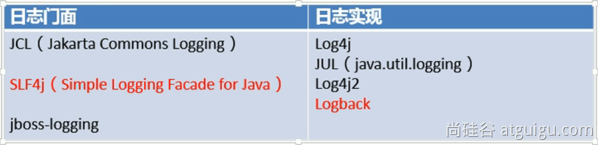
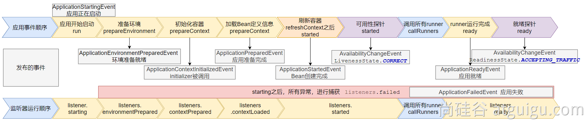

# Springboot3

## 1、入门

### 1.1、快速体验

场景：浏览器发送**/hello**请求，返回"**Hello,Spring Boot 3!**"

#### 1.1.1、创建项目

maven 项目

```xml
<!--    所有springboot项目都必须继承自 spring-boot-starter-parent -->
<parent>
    <groupId>org.springframework.boot</groupId>
    <artifactId>spring-boot-starter-parent</artifactId>
    <version>3.2.2</version>
</parent>
```

#### 1.1.2、导入场景

场景启动器

```xml

<dependencies>
    <!--        web开发的场景启动器 -->
    <dependency>
        <groupId>org.springframework.boot</groupId>
        <artifactId>spring-boot-starter-web</artifactId>
    </dependency>
</dependencies>
```

#### 1.1.3、主程序

```java

@SpringBootApplication //这是一个SpringBoot应用
public class MainApplication {

    public static void main(String[] args) {
        SpringApplication.run(MainApplication.class, args);
    }
}
```

#### 1.1.4、业务

```java

@RestController
public class HelloController {
    @GetMapping("/hello")
    public String hello() {
        return "Hello,Spring Boot 3!";
    }
}
```

#### 1.1.5、测试

默认启动访问：localhost:8080

#### 1.1.6、打包

```xml
<!--    SpringBoot应用打包插件-->
<build>
    <plugins>
        <plugin>
            <groupId>org.springframework.boot</groupId>
            <artifactId>spring-boot-maven-plugin</artifactId>
        </plugin>
    </plugins>
</build>
```

`mvn clean package` 把项目打成可执行的jar包

`java -jar demo.jar` 启动项目

### 1.2、特性小结

#### 1.2.1、简化整合

导入相关的场景，拥有相关的功能。场景启动器

默认支持的所有场景：<https://docs.spring.io/spring-boot/docs/current/reference/html/using.html#using.build-systems.starters>

- 官方提供的场景：命名为：`spring-boot-starter-*`
- 第三方提供场景：命名为：`*-spring-boot-starter`

场景一导入，万物皆就绪

#### 1.2.2、简化开发

无需编写任何配置，直接开发业务

#### 1.2.3、简化配置

`application.properties`：

- 集中式管理配置。只需要修改这个文件就行 。
- 配置基本都有默认值

能写的所有配置都在： <https://docs.spring.io/spring-boot/docs/current/reference/html/application-properties.html#appendix.application-properties>

#### 1.2.4、简化部署

打包为可执行的jar包。

linux服务器上有java环境。

#### 1.2.5、简化运维

修改配置（外部放一个application.properties文件）、监控、健康检查。

### 1.3、应用分析

#### 1.3.1、依赖管理机制

1. 为什么导入`starter-web`所有相关依赖都导入进来？
    - 开发什么场景，导入什么**场景启动器。**
    - maven 依赖传递原则。A-B-C： A就拥有B和C
    - 导入场景启动器，场景启动器自动把这个场景的所有核心依赖全部导入进来

2. 为什么版本号都不用写？
    - 每个 springboot 项目都有一个父项目 `spring-boot-starter-parent`
    - parent 的父项目是 `spring-boot-dependencies`
    - 父项目 **版本仲裁中心**，把所有常见的 jar 的依赖版本都声明好了。
    - 比如：`mysql-connector-java`

3. 自定义版本号
    - 利用 maven 的就近原则
        - 直接在当前项目 `properties` 标签中声明父项目用的版本属性的key
        - 直接在**导入依赖的时候声明版本**

4. 第三方的jar包

   boot父项目没有管理的需要自行声明好

   ```java
   <!-- https://mvnrepository.com/artifact/com.alibaba/druid -->
   <dependency>
       <groupId>com.alibaba</groupId>
       <artifactId>druid</artifactId>
       <version>1.2.16</version>
   </dependency>
   ```


#### 1.3.2、自动配置机制

##### 1.3.2.1、初步理解

- **自动配置**的 Tomcat、SpringMVC 等
  - **导入场景**，容器中就会自动配置好这个场景的核心组件。
  - 以前：DispatcherServlet、ViewResolver、CharacterEncodingFilter....
  - 现在：自动配置好的这些组件
  - 验证：**容器中有了什么组件，就具有什么功能**

```java
public static void main(String[]args){
        // java10： 局部变量类型的自动推断
        var ioc=SpringApplication.run(MainApplication.class,args);
        // 1、获取容器中所有组件的名字
        String[]names=ioc.getBeanDefinitionNames();
        // 2、挨个遍历：
        // dispatcherServlet、beanNameViewResolver、characterEncodingFilter、multipartResolver
        // SpringBoot把以前配置的核心组件现在都给我们自动配置好了。
        for(String name:names){
        System.out.println(name);
        }
        }
```

- **默认的包扫描规则**
  - `@SpringBootApplication` 标注的类就是主程序类
  - **SpringBoot 只会扫描主程序所在的包及其下面的子包，自动的 component-scan 功能**
  - 自定义扫描路径：`@SpringBootApplication(scanBasePackages = "com.zt")`、`@ComponentScan("com.zt")`

- **配置默认值**

  - **配置文件**的所有配置项是和某个**类的对象**值进行一一绑定的。

      绑定了配置文件中每一项值的类： **属性类**。

      比如：`ServerProperties` 绑定了所有Tomcat服务器有关的配置，`MultipartProperties` 绑定了所有文件上传相关的配置。

      参照[官方文档](https://docs.spring.io/spring-boot/docs/current/reference/html/application-properties.html#appendix.application-properties.server)，或者参照绑定的属性类。

- 按需加载自动配置
  - 导入场景 `spring-boot-starter-web`。
  - 场景启动器除了会导入相关功能依赖，还导入一个 `spring-boot-starter`，是所有 `starter` 的 `starter`，基础核心 starter。
  - `spring-boot-starter` 导入了一个包 `spring-boot-autoconfigure`。包里面都是各种场景的 `AutoConfiguration` **自动配置类。
      **
  - 虽然全场景的自动配置都在 `spring-boot-autoconfigure` 这个包，但是不是全都开启的。导入哪个场景就开启哪个自动配置。

总结： 导入场景启动器、触发 `spring-boot-autoconfigure` 这个包的自动配置生效、容器中就会具有相关场景的功能。

##### 1.3.2.2、完整流程

思考：

1. SpringBoot 怎么实现导一个 `starter`、写一些简单配置，应用就能跑起来，我们无需关心整合
2. 为什么 Tomcat 的端口号可以配置在 `application.properties` 中，并且 `Tomcat` 能启动成功？
3. 导入场景后哪些**自动配置能生效**？


**自动配置流程细节梳理：**

1. 导入 `starter-web`：导入了web开发场景
    1. 场景启动器导入了相关场景的所有依赖：`starter-json`、`starter-tomcat`、`springmvc`
    2. 每个场景启动器都引入了一个 `spring-boot-starter`，核心场景启动器。
    3. **核心场景启动器**引入了 `spring-boot-autoconfigure` 包。
    4. `spring-boot-autoconfigure` 里面囊括了所有场景的所有配置。
    5. 只要这个包下的所有类都能生效，那么相当于 SpringBoot 官方写好的整合功能就生效了。
    6. SpringBoot 默认扫描不到 `spring-boot-autoconfigure` 下写好的所有**配置类**。（这些**配置类**给我们做了整合操作），**默认只扫描主程序所在的包**。

2. **主程序**：`@SpringBootApplication`
    1. `@SpringBootApplication` 由三个注解组成 `@SpringBootConfiguration`、`@EnableAutoConfiguratio`、`@ComponentScan`。
    2. SpringBoot 默认只能扫描自己主程序所在的包及其下面的子包，扫描不到 `spring-boot-autoconfigure` 包中官方写好的**配置类**。
    3. `@EnableAutoConfiguration`：SpringBoot **开启自动配置的核心**。
        - 是由 `@Import(AutoConfigurationImportSelector.class)` 提供功能：批量给容器中导入组件。
        - SpringBoot 启动会默认加载152个配置类。
        - 这**142个配置类**来自于 `spring-boot-autoconfigure`
          下 `META-INF/spring/org.springframework.boot.autoconfigure.AutoConfiguration.imports` 文件指定的。
        - 项目启动的时候利用 @Import 批量导入组件机制把 `autoconfigure` 包下的142 `xxxxAutoConfiguration`类导入进来（**自动配置类**）。
        - 虽然导入了152个自动配置类，并不是都能生效，每一个自动配置类，都有条件注解 `@ConditionalOnxxx`，只有条件成立，才能生效。

3. `xxxxAutoConfiguratio`**自动配置类**
    1. 给容器中使用 @Bean 放一堆组件。
    2. 每个**自动配置类**都可能有这个注解 `@EnableConfigurationProperties(ServerProperties.class)`，用来把配置文件中配的指定前缀的属性值封装到 `xxxProperties` **属性类**中。
    3. 以Tomcat为例：把服务器的所有配置都是以 `server` 开头的，配置都封装到了属性类中。
    4. 给**容器**中放的所有**组件**的一些**核心参数**，都来自于 `xxxProperties`。`xxxProperties` 都是和配置文件绑定。
    5. **只需要改配置文件的值，核心组件的底层参数都能修改**
4. 写业务，全程无需关心各种整合（底层这些整合写好了，而且也生效了）

**核心流程总结：**

1. 导入 `starter`，就会导入 `autoconfigure` 包。
2. `autoconfigure` 包里面有一个文件 `META-INF/spring/org.springframework.boot.autoconfigure.AutoConfiguration.imports`，里面指定的所有启动要加载的自动配置类。
3. `@EnableAutoConfiguration` 会自动的把上面文件里面写的所有自动配置类都导入进来。`xxxAutoConfiguration` 是有条件注解进行按需加载。
4. `xxxAutoConfiguration` 给容器中导入一堆组件，组件都是从 `xxxProperties` 中提取属性值。
5. `xxxProperties` 又是和**配置文件**进行了绑定。

**效果：**导入`starter`、修改配置文件，就能修改底层行为。

##### 1.3.2.3、最佳实践

普通开发：导入starter，Controller、Service、Mapper、偶尔修改配置文件

高级开发：自定义组件、自定义配置、自定义starter

核心：

- 这个场景自动配置导入了哪些组件，我们能不能Autowired进来使用
- 能不能通过修改配置改变组件的一些默认参数
- 需不需要自己完全定义这个组件
- 场景定制化

实践：

- 选场景，导入到项目
  - 官方：starter
  - 第三方：去仓库搜

- 写配置，改配置文件关键项
  - 数据库参数（连接地址、账号密码...）

- 分析这个场景给我们导入了**哪些能用的组件**
  - **自动装配**这些组件进行后续使用。
  - 不满意boot提供的自动配好的默认组件，**定制化**，改配置、自定义组件。

整合redis：

- [选场景](https://docs.spring.io/spring-boot/docs/current/reference/html/using.html#using.build-systems.starters)：`spring-boot-starter-data-redis`
  - 场景 AutoConfiguration 就是这个场景的自动配置类

- 写配置：
  - 分析到这个场景的自动配置类开启了哪些属性绑定关系
  - `@EnableConfigurationProperties(RedisProperties.class)`
  - 修改redis相关的配置

- 分析组件：
  - 分析到 `RedisAutoConfiguration`  给容器中放了 `StringRedisTemplate`
  - 给业务代码中自动装配 `StringRedisTemplate`

- 定制化
  - 修改配置文件
  - 自定义组件，自己给容器中放一个 `StringRedisTemplate`

### 1.4、核心技能

#### 1.4.1、常用注解

SpringBoot 摒弃 XML 配置方式，改为**全注解驱动**。

##### 1.4.1.1、组件注册

**@Configuration**、**@SpringBootConfiguration**

**@Bean**、**@Scope**

**@Controller、 @Service、@Repository、@Component**

**@Import**

**@ComponentScan**

步骤：

1. **@Configuration 编写一个配置类**
2. **在配置类中，自定义方法给容器中注册组件，配合@Bean**
3. **或使用 @Import 导入第三方的组件**

##### 1.4.1.2、条件注解

如果注解指定的**条件成立**，则触发指定行为

***@ConditionalOnXxx***

**@ConditionalOnClass：如果类路径中存在这个类，则触发指定行为**

**@ConditionalOnMissingClass：如果类路径中不存在这个类，则触发指定行为**

**@ConditionalOnBean：如果容器中存在这个Bean（组件），则触发指定行为**

**@ConditionalOnMissingBean：如果容器中不存在这个Bean（组件），则触发指定行为**

场景：

- 如果存在 `FastsqlException` 这个类，给容器中放一个`Cat`组件，名cat01，
- 否则，就给容器中放一个`Dog`组件，名dog01
- 如果系统中有`dog01`这个组件，就给容器中放一个 User 组件，名 zhangsan
- 否则，就放一个 User，名叫 lisi

**@ConditionalOnBean（value=组件类型，name=组件名字）：判断容器中是否有这个类型的组件，并且名字是指定的值**

> @ConditionalOnRepositoryType (org.springframework.boot.autoconfigure.data)
> @ConditionalOnDefaultWebSecurity (org.springframework.boot.autoconfigure.security)
> @ConditionalOnSingleCandidate (org.springframework.boot.autoconfigure.condition)
> @ConditionalOnWebApplication (org.springframework.boot.autoconfigure.condition)
> @ConditionalOnWarDeployment (org.springframework.boot.autoconfigure.condition)
> @ConditionalOnJndi (org.springframework.boot.autoconfigure.condition)
> @ConditionalOnResource (org.springframework.boot.autoconfigure.condition)
> @ConditionalOnExpression (org.springframework.boot.autoconfigure.condition)
> **@ConditionalOnClass** (org.springframework.boot.autoconfigure.condition)
> @ConditionalOnEnabledResourceChain (org.springframework.boot.autoconfigure.web)
> **@ConditionalOnMissingClass** (org.springframework.boot.autoconfigure.condition)
> @ConditionalOnNotWebApplication (org.springframework.boot.autoconfigure.condition)
> @ConditionalOnProperty (org.springframework.boot.autoconfigure.condition)
> @ConditionalOnCloudPlatform (org.springframework.boot.autoconfigure.condition)
> **@ConditionalOnBean** (org.springframework.boot.autoconfigure.condition)
> **@ConditionalOnMissingBean** (org.springframework.boot.autoconfigure.condition)
> @ConditionalOnMissingFilterBean (org.springframework.boot.autoconfigure.web.servlet)
> @Profile (org.springframework.context.annotation)
> @ConditionalOnInitializedRestarter (org.springframework.boot.devtools.restart)
> @ConditionalOnGraphQlSchema (org.springframework.boot.autoconfigure.graphql)
> @ConditionalOnJava (org.springframework.boot.autoconfigure.condition)

##### 1.4.1.3、属性绑定

**@ConfigurationProperties： 声明组件的属性和配置文件哪些前缀开始项进行绑定**

**@EnableConfigurationProperties：快速注册注解：**

- **场景：**SpringBoot默认只扫描自己主程序所在的包。如果导入第三方包，即使组件上标注了 @Component、@ConfigurationProperties
  注解，也没用。因为组件都扫描不进来，此时使用这个注解就可以快速进行属性绑定并把组件注册进容器。

将容器中任意**组件（Bean）的属性值**和**配置文件**的配置项的值**进行绑定**

- **1、给容器中注册组件（@Component、@Bean）**
- 2、使用 **@ConfigurationProperties 声明组件和配置文件的哪些配置项进行绑定**

#### 1.4.2、YAML配置文件

**痛点**：SpringBoot 集中化管理配置，`application.properties`

**问题**：配置多以后难阅读和修改，**层级结构辨识度不高**

YAML 是 "YAML Ain't a Markup Language"（YAML 不是一种标记语言）。在开发的这种语言时，YAML 的意思其实是："Yet Another Markup Language"（是另一种标记语言）。

- 设计目标，就是**方便人类读写**
- **层次分明**，更适合做配置文件
- 使用 `.yaml` 或 `.yml` 作为文件后缀

##### 1.4.2.1、基本语法

- **大小写敏感**
- 使用**缩进表示层级关系，k: v，使用空格分割k,v**
- 缩进时不允许使用Tab键，只允许**使用空格**换行
- 缩进的空格数目不重要，只要**相同层级**的元素**左侧对齐**即可
- **# 表示注释**，从这个字符一直到行尾，都会被解析器忽略。

支持的写法：

- **对象**：**键值对**的集合，如：映射（map）/ 哈希（hash） / 字典（dictionary）
- **数组**：一组按次序排列的值，如：序列（sequence） / 列表（list）
- **纯量**：单个的、不可再分的值，如：字符串、数字、bool、日期

##### 1.4.2.2、示例

```java
@Component
@ConfigurationProperties(prefix = "person") //和配置文件person前缀的所有配置进行绑定
@Data //自动生成JavaBean属性的getter/setter
//@NoArgsConstructor //自动生成无参构造器
//@AllArgsConstructor //自动生成全参构造器
public class Person {
    private String name;
    private Integer age;
    private Date birthDay;
    private Boolean like;
    private Child child; //嵌套对象
    private List<Dog> dogs; //数组（里面是对象）
    private Map<String, Cat> cats; //表示Map
}

@Data
public class Dog {
    private String name;
    private Integer age;
}

@Data
public class Child {
    private String name;
    private Integer age;
    private Date birthDay;
    private List<String> text; //数组
}

@Data
public class Cat {
    private String name;
    private Integer age;
}
```

properties表示法

```properties
person.name=张三
person.age=18
person.birthDay=2010/10/12 12:12:12
person.like=true
person.child.name=李四
person.child.age=12
person.child.birthDay=2018/10/12
person.child.text[0]=abc
person.child.text[1]=def
person.dogs[0].name=小黑
person.dogs[0].age=3
person.dogs[1].name=小白
person.dogs[1].age=2
person.cats.c1.name=小蓝
person.cats.c1.age=3
person.cats.c2.name=小灰
person.cats.c2.age=2
```

yaml表示法

```yaml
person:
  name: 张三
  age: 18
  birthDay: 2010/10/10 12:12:12
  like: true
  child:
    name: 李四
    age: 20
    birthDay: 2018/10/10
    text: [ "abc","def" ]
  dogs:
    - name: 小黑
      age: 3
    - name: 小白
      age: 2
  cats:
    c1:
      name: 小蓝
      age: 3
    c2: { name: 小绿,age: 2 } #对象也可用{}表示
```

##### 1.4.2.3、细节

- birthDay 推荐写为 birth-day
- **文本**：
  - **单引号**不会转义【\n 则为普通字符串显示】
  - **双引号**会转义【\n会显示为**换行符**】

- **大文本**
  - `|`开头，大文本写在下层，**保留文本格式**，**换行符正确显示**
  - `>`开头，大文本写在下层，折叠换行符

- **多文档合并**
  - 使用`---`可以把多个yaml文档合并在一个文档中，每个文档区依然认为内容独立

##### 1.4.2.4、lombok

简化 JavaBean 开发，自动生成构造器、getter/setter、自动生成Builder模式等。

```java
<dependency>
<groupId>org.projectlombok</groupId>
<artifactId>lombok</artifactId>
<scope>compile</scope>
</dependency>
```

使用 `@Data`等注解。

#### 1.4.3、日志配置

规范：项目开发不要编写 `System.out.println()`，应该用**日志**记录信息。



##### 1.4.3.1、简介

1. Spring 使用 commons-logging 作为内部日志，但底层日志实现是开放的。可对接其他日志框架。spring5 及以后 commons-logging 被 spring 直接自己写了。
1. 支持 jul，log4j2, logback。SpringBoot 提供了默认的控制台输出配置，也可以配置输出为文件。
1. logback 是默认使用的。
1. 虽然**日志框架很多**，但是我们不用担心，使用 SpringBoot 的**默认配置就能工作的很好**。

**SpringBoot 怎么把日志默认配置好的**

1. 每个 `starter` 场景，都会导入一个核心场景 `spring-boot-starter`。
2. 核心场景引入了日志的所用功能 `spring-boot-starter-logging`。
3. 默认使用了 `logback + slf4j` 组合作为默认底层日志。
4. 日志是系统一启动就要用，`xxxAutoConfiguration` 是系统启动好了以后放好的组件，后来用的。
5. 日志是利用**监听器机制**配置好的。`ApplicationListener`。
6. 日志所有的配置都可以通过修改配置文件实现。以 `logging` 开始的所有配置。

##### 1.4.3.2、日志格式

```shell
2023-03-31T13:56:17.511+08:00  INFO 4944 --- [           main] o.apache.catalina.core.StandardService   : Starting service [Tomcat]
2023-03-31T13:56:17.511+08:00  INFO 4944 --- [           main] o.apache.catalina.core.StandardEngine    : Starting Servlet engine: [Apache Tomcat/10.1.7]
```

默认输出格式：

- 时间和日期：毫秒级精度
- 日志级别：ERROR, WARN, INFO, DEBUG, or TRACE.
- 进程 ID
- ---： 消息分割符
- 线程名： 使用[]包含
- Logger 名： 通常是产生日志的**类名**
- 消息： 日志记录的内容

注意： logback 没有 FATAL 级别，对应的是 ERROR

默认值：参照：`spring-boot` 包 `additional-spring-configuration-metadata.json` 文件

默认输出格式值：`%clr(%d{${LOG_DATEFORMAT_PATTERN:-yyyy-MM-dd'T'HH:mm:ss.SSSXXX}}){faint} %clr(${LOG_LEVEL_PATTERN:-%5p}) %clr(${PID:- }){magenta} %clr(---){faint} %clr([%15.15t]){faint} %clr(%-40.40logger{39}){cyan} %clr(:){faint} %m%n${LOG_EXCEPTION_CONVERSION_WORD:-%wEx}`

可修改为：`'%d{yyyy-MM-dd HH:mm:ss.SSS} %-5level [%thread] %logger{15} ===> %msg%n'`

##### 1.4.3.3、记录日志

- `Logger logger=LoggerFactory.getLogger(getClass());`
- 使用 Lombok 的 `@Slf4j` 注解

##### 1.4.3.4、日志级别

- 由低到高：`ALL, TRACE, DEBUG, INFO, WARN, ERROR, FATAL, OFF`；

  - **只会打印指定级别及以上级别的日志**
    - ALL：打印所有日志
  - TRACE：追踪框架详细流程日志，一般不使用
  - DEBUG：开发调试细节日志
  - INFO：关键、感兴趣信息日志
  - WARN：警告但不是错误的信息日志，比如：版本过时
  - ERROR：业务错误日志，比如出现各种异常
  - FATAL：致命错误日志，比如jvm系统崩溃
  - OFF：关闭所有日志记录

- 不指定级别的所有类，都使用 root 指定的级别作为默认级别
- SpringBoot 日志**默认级别是** **INFO**
- 在application.properties/yaml中配置logging.level.`<logger-name>`=`<level>`指定日志级别
- level可取值范围：`TRACE, DEBUG, INFO, WARN, ERROR, FATAL, or OFF`，定义在 `LogLevel`类中
- root 的logger-name叫root，可以配置logging.level.root=warn，代表所有未指定日志级别都使用 root 的 warn 级别

##### 1.4.3.5、日志分组

比较有用的技巧是：

将相关的logger分组在一起，统一配置。SpringBoot 也支持。比如：Tomcat 相关的日志统一设置

```java
logging.group.tomcat=org.apache.catalina,org.apache.coyote,org.apache.tomcat
        logging.level.tomcat=trace
```

SpringBoot 预定义两个组

| Name | Loggers                                                                                                                                                                                               |
|------|-------------------------------------------------------------------------------------------------------------------------------------------------------------------------------------------------------|
| web  | org.springframework.core.codec, org.springframework.http, org.springframework.web, org.springframework.boot.actuate.endpoint.web, org.springframework.boot.web.servlet.ServletContextInitializerBeans |
| sql  | org.springframework.jdbc.core, org.hibernate.SQL, org.jooq.tools.LoggerListener                                                                                                                       |

##### 1.4.3.6、文件输出

SpringBoot 默认只把日志写在控制台，如果想额外记录到文件，可以在 application.properties 中添加 `logging.file.name`
or `logging.file.path` 配置项。

| logging.file.name | logging.file.path | 示例       | 效果                    |
|-------------------|-------------------|----------|-----------------------|
| 未指定               | 未指定               |          | 仅控制台输出                |
| **指定**            | 未指定               | my.log   | 写入指定文件。可以加路径          |
| 未指定               | **指定**            | /var/log | 写入指定目录，文件名为spring.log |
| **指定**            | **指定**            |          | 以logging.file.name为准  |

##### 1.4.3.7、归档与切割

归档：每天的日志单独存到一个文档中。

切割：每个文件10MB，超过大小切割成另外一个文件。

1. 每天的日志应该独立分割出来存档。如果使用logback（SpringBoot 默认整合），可以通过application.properties/yaml文件指定日志滚动规则。
2. 如果是其他日志系统，需要自行配置（添加log4j2.xml或log4j2-spring.xml）
3. 支持的滚动规则设置如下

| 配置项                                                  | 描述                                                        |
|------------------------------------------------------|-----------------------------------------------------------|
| logging.logback.rollingpolicy.file-name-pattern      | 日志存档的文件名格式（默认值：${LOG_FILE}.%d{yyyy-MM-dd}.%i.gz）          |
| logging.logback.rollingpolicy.clean-history-on-start | 应用启动时是否清除以前存档（默认值：false）                                  |
| logging.logback.rollingpolicy.max-file-size          | 存档前，每个日志文件的最大大小（默认值：10MB）                                 |
| logging.logback.rollingpolicy.total-size-cap         | 日志文件被删除之前，可以容纳的最大大小（默认值：0B）。设置1GB则磁盘存储超过 1GB 日志后就会删除旧日志文件 |
| logging.logback.rollingpolicy.max-history            | 日志文件保存的最大天数(默认值：7).                                       |

##### 1.4.3.8、自定义配置

通常我们配置 application.properties 就够了。当然也可以自定义。比如：

| 日志系统                    | 自定义                                                                       |
|-------------------------|---------------------------------------------------------------------------|
| Logback                 | logback-spring.xml, logback-spring.groovy, logback.xml, or logback.groovy |
| Log4j2                  | log4j2-spring.xml or log4j2.xml                                           |
| JDK (Java Util Logging) | logging.properties                                                        |

如果可能，我们建议您在日志配置中使用`-spring` 变量（例如，`logback-spring.xml` 而不是 `logback.xml`）。如果您使用标准配置文件，spring 无法完全控制日志初始化。

最佳实战：自己要写配置，配置文件名加上 `xx-spring.xml`

##### 1.4.3.9、切换日志组合

```xml

<dependency>
    <groupId>org.springframework.boot</groupId>
    <artifactId>spring-boot-starter-web</artifactId>
</dependency>
<dependency>
<groupId>org.springframework.boot</groupId>
<artifactId>spring-boot-starter</artifactId>
<exclusions>
    <exclusion>
        <groupId>org.springframework.boot</groupId>
        <artifactId>spring-boot-starter-logging</artifactId>
    </exclusion>
</exclusions>
</dependency>
<dependency>
<groupId>org.springframework.boot</groupId>
<artifactId>spring-boot-starter-log4j2</artifactId>
</dependency>
```

log4j2 支持 yaml 和 json 格式的配置文件

| 格式   | 依赖                                                                                                     | 文件名                      |
|------|--------------------------------------------------------------------------------------------------------|--------------------------|
| YAML | com.fasterxml.jackson.core:jackson-databind + com.fasterxml.jackson.dataformat:jackson-dataformat-yaml | log4j2.yaml + log4j2.yml |
| JSON | com.fasterxml.jackson.core:jackson-databind                                                            | log4j2.json + log4j2.jsn |

##### 1.4.3.10、最佳实战

1. 导入任何第三方框架，先排除它的日志包，因为Boot底层控制好了日志
2. 修改 `application.properties`
   配置文件，就可以调整日志的所有行为。如果不够，可以编写日志框架自己的配置文件放在类路径下就行，比如`logback-spring.xml`，`log4j2-spring.xml`
3. 如需对接**专业日志系统**，也只需要把 logback 记录的**日志**灌倒 **kafka**之类的中间件，这和 SpringBoot 没关系，都是日志框架自己的配置，**修改配置文件即可**
4. **业务中使用 slf4j-api 记录日志。不要再 sout 了**

## 2、web开发

### 2.1、WebMvcAutoConfiguration

#### 2.1.1、生效条件

```java

@AutoConfiguration(after = {DispatcherServletAutoConfiguration.class, TaskExecutionAutoConfiguration.class,
        ValidationAutoConfiguration.class}) //在这些自动配置之后
@ConditionalOnWebApplication(type = Type.SERVLET) //如果是web应用就生效，类型SERVLET、REACTIVE 响应式web
@ConditionalOnClass({Servlet.class, DispatcherServlet.class, WebMvcConfigurer.class})
@ConditionalOnMissingBean(WebMvcConfigurationSupport.class) //容器中没有这个Bean，才生效。默认就是没有
@AutoConfigureOrder(Ordered.HIGHEST_PRECEDENCE + 10)//优先级
@ImportRuntimeHints(WebResourcesRuntimeHints.class)
public class WebMvcAutoConfiguration {
}
```

#### 2.1.2、效果

1. 放了两个 Filter：

    1. `HiddenHttpMethodFilter`：页面表单提交 Rest 请求

       ```java
       @Bean
       @ConditionalOnMissingBean(HiddenHttpMethodFilter.class)
       @ConditionalOnProperty(prefix = "spring.mvc.hiddenmethod.filter", name = "enabled")
       public OrderedHiddenHttpMethodFilter hiddenHttpMethodFilter() {
         return new OrderedHiddenHttpMethodFilter();
       }
       ```

    2. `FormContentFilter`：表单内容 Filter，GET（数据放URL后面）、POST（数据放请求体）请求可以携带数据，PUT、DELETE 的请求体数据会被忽略

       ```java
       @Bean
       @ConditionalOnMissingBean(FormContentFilter.class)
       @ConditionalOnProperty(prefix = "spring.mvc.formcontent.filter", name = "enabled", matchIfMissing = true)
       public OrderedFormContentFilter formContentFilter() {
         return new OrderedFormContentFilter();
       }
       ```

2. 给容器中放了 `WebMvcConfigurer` 组件；给SpringMVC添加各种定制功能

    1. 所有的功能最终会和配置文件进行绑定
    2. WebMvcProperties：`spring.mvc` 配置文件
    3. WebProperties：`spring.web` 配置文件

```java

@Configuration(proxyBeanMethods = false)
@Import(EnableWebMvcConfiguration.class) //额外导入了其他配置
@EnableConfigurationProperties({WebMvcProperties.class, WebProperties.class})
@Order(0)
public static class WebMvcAutoConfigurationAdapter implements WebMvcConfigurer, ServletContextAware {
}
```

#### 2.1.3、WebMvcConfigurer 接口

提供了配置 SpringMVC 底层的所有组件入口


#### 2.1.4、静态资源规则源码

```java
@Override
public void addResourceHandlers(ResourceHandlerRegistry registry){
        if(!this.resourceProperties.isAddMappings()){
        logger.debug("Default resource handling disabled");
        return;
        }
        addResourceHandler(registry,this.mvcProperties.getWebjarsPathPattern(),
        "classpath:/META-INF/resources/webjars/");
        addResourceHandler(registry,this.mvcProperties.getStaticPathPattern(),(registration)->{
        registration.addResourceLocations(this.resourceProperties.getStaticLocations());
        if(this.servletContext!=null){
        ServletContextResource resource=new ServletContextResource(this.servletContext,SERVLET_LOCATION);
        registration.addResourceLocations(resource);
        }
        });
        }

private void addResourceHandler(ResourceHandlerRegistry registry,String pattern,String...locations){
        addResourceHandler(registry,pattern,(registration)->registration.addResourceLocations(locations));
        }

private void addResourceHandler(ResourceHandlerRegistry registry,String pattern,
        Consumer<ResourceHandlerRegistration> customizer){
        if(registry.hasMappingForPattern(pattern)){
        return;
        }
        ResourceHandlerRegistration registration=registry.addResourceHandler(pattern);
        customizer.accept(registration);
        registration.setCachePeriod(getSeconds(this.resourceProperties.getCache().getPeriod()));
        registration.setCacheControl(this.resourceProperties.getCache().getCachecontrol().toHttpCacheControl());
        registration.setUseLastModified(this.resourceProperties.getCache().isUseLastModified());
        customizeResourceHandlerRegistration(registration);
        }
```

1. 规则一：访问 `/webjars/**` 路径就去 `classpath:/META-INF/resource/webjars/` 下找资源。

2. 规则二：访问 `/**` 路径就去 静态资源默认的四个位置找资源
    1. `classpath:/META-INF/resource/`
    2. `classpath:/resource/`
    3. `classpath:/static/`
    4. `classpath:/public/`
3. 规则三：静态资源默认都有缓存规则的设置
    1. 所有缓存的设置，直接通过配置文件：`spring.web`
    2. cachePeriod：缓存周期；多久不用找服务器要新的。默认没有，以秒为单位
    3. cacheControl：HTTP缓存控制
    4. useLastModified：是否使用最后一次修改。配合HTTP Cache规则

#### 2.1.5、EnableWebMvcConfiguration 源码

```java
// SpringBoot 给容器中放 WebMvcConfigurationSupport 组件。
// 我们如果自己放了 WebMvcConfigurationSupport 组件，Boot的WebMvcAutoConfiguration都会失效。
@Configuration(proxyBeanMethods = false)
@EnableConfigurationProperties(WebProperties.class)
public static class EnableWebMvcConfiguration extends DelegatingWebMvcConfiguration implements ResourceLoaderAware {
    // ...

    @Bean
    public WelcomePageHandlerMapping welcomePageHandlerMapping(ApplicationContext applicationContext,
                                                               FormattingConversionService mvcConversionService, ResourceUrlProvider mvcResourceUrlProvider) {
        return createWelcomePageHandlerMapping(applicationContext, mvcConversionService, mvcResourceUrlProvider,
                WelcomePageHandlerMapping::new);
    }

    @Bean
    public WelcomePageNotAcceptableHandlerMapping welcomePageNotAcceptableHandlerMapping(
            ApplicationContext applicationContext, FormattingConversionService mvcConversionService,
            ResourceUrlProvider mvcResourceUrlProvider) {
        return createWelcomePageHandlerMapping(applicationContext, mvcConversionService, mvcResourceUrlProvider,
                WelcomePageNotAcceptableHandlerMapping::new);
    }

    private <T extends AbstractUrlHandlerMapping> T createWelcomePageHandlerMapping(
            ApplicationContext applicationContext, FormattingConversionService mvcConversionService,
            ResourceUrlProvider mvcResourceUrlProvider, WelcomePageHandlerMappingFactory<T> factory) {
        TemplateAvailabilityProviders templateAvailabilityProviders = new TemplateAvailabilityProviders(
                applicationContext);
        String staticPathPattern = this.mvcProperties.getStaticPathPattern();
        T handlerMapping = factory.create(templateAvailabilityProviders, applicationContext, getIndexHtmlResource(),
                staticPathPattern);
        handlerMapping.setInterceptors(getInterceptors(mvcConversionService, mvcResourceUrlProvider));
        handlerMapping.setCorsConfigurations(getCorsConfigurations());
        return handlerMapping;
    }

    // ...
}
```

HandlerMapping：根据请求路径 /a 找那个handler能处理请求

#### 2.1.6、配置底层行为

为什么容器中放一个`WebMvcConfigurer`就能配置底层行为？

1. WebMvcAutoConfiguration 是一个自动配置类，里面有一个 EnableWebMvcConfiguration
2. EnableWebMvcConfiguration 继承于 DelegatingWebMvcConfiguration
3. DelegatingWebMvcConfiguration 利用 DI 把容器中所有的 WebMvcConfigurer 注入进来
4. 调用 DelegatingWebMvcConfiguration 的方法配置底层规则，进而调用 WebMvcConfigurer 的配置底层方法

#### 2.1.7、WebMvcConfigurationSupport

提供了很多的默认设置。

判断系统中是否有相应的类：如果有，就加入相应的`HttpMessageConverter`

```java
static {
        ClassLoader classLoader=WebMvcConfigurationSupport.class.getClassLoader();
        romePresent=ClassUtils.isPresent("com.rometools.rome.feed.WireFeed",classLoader);
        jaxb2Present=ClassUtils.isPresent("jakarta.xml.bind.Binder",classLoader);
        jackson2Present=ClassUtils.isPresent("com.fasterxml.jackson.databind.ObjectMapper",classLoader)&&
        ClassUtils.isPresent("com.fasterxml.jackson.core.JsonGenerator",classLoader);
        jackson2XmlPresent=ClassUtils.isPresent("com.fasterxml.jackson.dataformat.xml.XmlMapper",classLoader);
        jackson2SmilePresent=ClassUtils.isPresent("com.fasterxml.jackson.dataformat.smile.SmileFactory",classLoader);
        jackson2CborPresent=ClassUtils.isPresent("com.fasterxml.jackson.dataformat.cbor.CBORFactory",classLoader);
        gsonPresent=ClassUtils.isPresent("com.google.gson.Gson",classLoader);
        jsonbPresent=ClassUtils.isPresent("jakarta.json.bind.Jsonb",classLoader);
        kotlinSerializationCborPresent=ClassUtils.isPresent("kotlinx.serialization.cbor.Cbor",classLoader);
        kotlinSerializationJsonPresent=ClassUtils.isPresent("kotlinx.serialization.json.Json",classLoader);
        kotlinSerializationProtobufPresent=ClassUtils.isPresent("kotlinx.serialization.protobuf.ProtoBuf",classLoader);
        }
```

### 2.2、web场景

#### 2.2.1、自动配置

1. 整合web场景

   ```java
   <dependency>
     <groupId>org.springframework.boot</groupId>
     <artifactId>spring-boot-starter-web</artifactId>
    </dependency>
   ```

2. 引入了 autoconfigure 功能

3. @EnableAutoConfiguration 注解使用 @Import(AutoConfigurationImportSelector.class) 批量导入组件

4. 加载 META-INF/spring/org.springframework.boot.autoconfigure.AutoConfiguration.imports 文件中配置的所有组件

5. 所有自动配置类如下

   ```java
   org.springframework.boot.autoconfigure.web.client.RestTemplateAutoConfiguration
   org.springframework.boot.autoconfigure.web.embedded.EmbeddedWebServerFactoryCustomizerAutoConfiguration
   ====以下是响应式web场景和现在的没关系======
   org.springframework.boot.autoconfigure.web.reactive.HttpHandlerAutoConfiguration
   org.springframework.boot.autoconfigure.web.reactive.ReactiveMultipartAutoConfiguration
   org.springframework.boot.autoconfigure.web.reactive.ReactiveWebServerFactoryAutoConfiguration
   org.springframework.boot.autoconfigure.web.reactive.WebFluxAutoConfiguration
   org.springframework.boot.autoconfigure.web.reactive.WebSessionIdResolverAutoConfiguration
   org.springframework.boot.autoconfigure.web.reactive.error.ErrorWebFluxAutoConfiguration
   org.springframework.boot.autoconfigure.web.reactive.function.client.ClientHttpConnectorAutoConfiguration
   org.springframework.boot.autoconfigure.web.reactive.function.client.WebClientAutoConfiguration
   ================以上没关系=================
   org.springframework.boot.autoconfigure.web.servlet.DispatcherServletAutoConfiguration
   org.springframework.boot.autoconfigure.web.servlet.ServletWebServerFactoryAutoConfiguration
   org.springframework.boot.autoconfigure.web.servlet.error.ErrorMvcAutoConfiguration
   org.springframework.boot.autoconfigure.web.servlet.HttpEncodingAutoConfiguration
   org.springframework.boot.autoconfigure.web.servlet.MultipartAutoConfiguration
   org.springframework.boot.autoconfigure.web.servlet.WebMvcAutoConfiguration
   ```

6. 绑定了配置文件的一堆配置项

    1. SpringMVC 的所有配置 spring.mvc
    2. Web 场景通用配置 spring.web
    3. 文件上传配置 spring.servlet.multipart
    4. 服务器的配置 server: 比如：编码方式

#### 2.2.2、默认效果

默认配置

1. 包含了 ContentNegotiatingViewResolver 和 BeanNameVIewResolver 组件，方便视图解析
2. 默认的静态资源处理机制：静态资源放在 static 文件夹下即可直接访问
3. 自动注册了 Converter，GenericConverter，Formatter 组件，适配常见数据类型转换和格式化需求
4. 支持 HttpMessageConverters，可以方便返回 json 等数据类型
5. 注册 MessageCodesResolver，方便国际化及错误消息处理
6. 支持静态 index.html
7. 自动使用 ConfigurableWebBindingInitializer，实现消息处理、数据绑定、类型转化、数据校验等功能

自定义：

- 如果想保持 boot mvc 的默认配置，并且自定义更多的 mvc 配置，如：interceptors, formatters, view controllers 等。可以使用
  @Configuration 注解添加一个 WebMvcConfigurer 类型的配置类，并不要标注 @EnableWebMvc。
- 如果想保持 boot mvc 的默认配置，但要自定义核心组件实例，比如：RequestMappingHandlerMapping, RequestMappingHandlerAdapter,
  或ExceptionHandlerExceptionResolver，给容器中放一个 WebMvcRegistrations 组件即可。
- 如果想全面接管 Spring MVC，@Configuration 标注一个配置类，并加上 @EnableWebMvc 注解，实现 WebMvcConfigurer 接口。

### 2.3、静态资源

#### 2.3.1、默认规则

静态资源映射

静态资源映射规则在 WebMvcAutoConfiguration 中进行了定义;

1. `/webjars/**` 的所有路径资源都在 `classpath:/META-INF/resources/webjars/`
2. `/**` 的所有路径资源都在 `classpath:/META-INF/resources/`、`classpath:/resources/`、`classpath:/static/`、`classpath:/public/`

静态资源缓存

所有静态资源定义了缓存规则

1. period： 缓存间隔。 默认 0S；
2. cacheControl：缓存控制。 默认无；
3. useLastModified：是否使用 lastModified 头。 默认 false；

欢迎页

欢迎页规则在 WebMvcAutoConfiguration 中进行了定义

1. 在静态资源目录下找 index.html
2. 没有就在 templates 下找 index 模板页

Favicon

1. 在静态资源目录下找 favicon.ico

#### 2.3.2、自定义

1. 配置方式

   spring.mvc：静态资源访问前缀路径

   spring.web：静态资源目录、静态资源缓存策略

   ```java
   #1、spring.web：
   # 1.配置国际化的区域信息
   # 2.静态资源策略(开启、处理链、缓存)
   
   #开启静态资源映射规则
   spring.web.resources.add-mappings=true
   
   #设置缓存
   spring.web.resources.cache.period=3600
   ##缓存详细合并项控制，覆盖period配置：
   ## 浏览器第一次请求服务器，服务器告诉浏览器此资源缓存7200秒，7200秒以内的所有此资源访问不用发给服务器请求，7200秒以后发请求给服务器
   spring.web.resources.cache.cachecontrol.max-age=7200
   ## 共享缓存
   spring.web.resources.cache.cachecontrol.cache-public=true
   #使用资源 last-modified 时间，来对比服务器和浏览器的资源是否相同没有变化。相同返回 304
   spring.web.resources.cache.use-last-modified=true
   
   #自定义静态资源文件夹位置
   spring.web.resources.static-locations=
   
   #2、 spring.mvc
   ## 2.1. 自定义webjars路径前缀
   spring.mvc.webjars-path-pattern=/wj/**
   ## 2.2. 静态资源访问路径前缀
   spring.mvc.static-path-pattern=/static/**
   ```

2. 代码方式

   容器中只要有一个 WebMvcConfigurer 组件。配置的底层行为都会生效。

   @EnableWebMvc //禁用boot的默认配置

   ```java
   @Configuration //这是一个配置类
   public class MyConfig implements WebMvcConfigurer {
     @Override
     public void addResourceHandlers(ResourceHandlerRegistry registry) {
       // 保留以前规则
       WebMvcConfigurer.super.addResourceHandlers(registry);
       // 自己写新的规则。
       registry.addResourceHandler("/static/**")
         .addResourceLocations("classpath:/a/","classpath:/b/")
         .setCacheControl(CacheControl.maxAge(1180, TimeUnit.SECONDS));
     }
   }
   ```

   ```java
   @Configuration //这是一个配置类,给容器中放一个 WebMvcConfigurer 组件，就能自定义底层
   public class MyConfig  /*implements WebMvcConfigurer*/ {
     @Bean
     public WebMvcConfigurer webMvcConfigurer(){
       return new WebMvcConfigurer() {
         @Override
         public void addResourceHandlers(ResourceHandlerRegistry registry) {
           registry.addResourceHandler("/static/**")
             .addResourceLocations("classpath:/a/", "classpath:/b/")
             .setCacheControl(CacheControl.maxAge(1180, TimeUnit.SECONDS));
         }
       };
     }
   }
   ```

### 2.4、路径匹配

Spring5.3 之后加入了更多的请求路径匹配的实现策略；
以前只支持 AntPathMatcher 策略, 现在提供了 PathPatternParser 策略。并且可以让我们指定到底使用那种策略。

#### 2.4.1、Ant风格

Ant 风格的路径模式语法具有以下规则：

- `*`：表示**任意数量**的字符。
- `?`：表示任意**一个字符**。
- `**`：表示任意数量的目录。
- `{}`：表示一个命名的模式**占位符**。
- `[]`：表示**字符集合**，例如[a-z]表示小写字母。

例如：

- `*.html` 匹配任意名称，扩展名为.html的文件。
- `/folder1/*/*.java` 匹配在folder1目录下的任意两级目录下的.java文件。
- `/folder2/**/*.jsp` 匹配在folder2目录下任意目录深度的.jsp文件。
- `/{type}/{id}.html` 匹配任意文件名为{id}.html，在任意命名的{type}目录下的文件。

注意：Ant 风格的路径模式语法中的特殊字符需要转义，如：

- 要匹配文件路径中的星号，则需要转义为 `\\*`。
- 要匹配文件路径中的问号，则需要转义为 `\\?`。

#### 2.4.2、模式切换

AntPathMatcher 与 PathPatternParser

- PathPatternParser 在 jmh 基准测试下，有 6~8 倍吞吐量提升，降低 30%~40%空间分配率
- PathPatternParser 兼容 AntPathMatcher 语法，并支持更多类型的路径模式
- PathPatternParser "\*\*" **多段匹配**的支持**仅允许在模式末尾使用**

```java
@GetMapping("/a*/b?/{p1:[a-f]+}")
public String hello(HttpServletRequest request,@PathVariable("p1") String path){
        log.info("路径变量p1： {}",path);
        // 获取请求路径
        String uri=request.getRequestURI();
        return uri;
        }
```

总结：

- 使用默认的路径匹配规则，是由 PathPatternParser 提供的
- 如果路径中间需要有 `**`，替换成 ant 风格路径

```java
# 改变路径匹配策略：
        # ant_path_matcher 老版策略；
        # path_pattern_parser 新版策略；
        spring.mvc.pathmatch.matching-strategy=ant_path_matcher
```

### 2.5、内容协商


#### 2.5.1、多段内容适配

1. 默认规则

    1. 基于请求头内容协商（默认开启）

       客户端向服务端发送请求，携带HTTP标准的Accept请求头（application/json,text/xml,text/yaml）。

       服务端根据客户端请求头期望的数据类型进行动态返回。

    2. 基于请求参数内容协商（需要开启）

       发送请求 GET /projects/spring-boot?format=json

       匹配到 @GetMapping("/projects/spring-boot")

       根据参数协商，优先返回 json 类型数据【需要开启参数匹配设置】

       发送请求 GET /projects/spring-boot?format=xml,优先返回 xml 类型数据

2. 演示

    1. 引入支持写入xml内容依赖

       ```java
       <dependency>
         <groupId>com.fasterxml.jackson.dataformat</groupId>
         <artifactId>jackson-dataformat-xml</artifactId>
        </dependency>
       ```

    2. 标注注解

       ```java
       @JacksonXmlRootElement  // 可以写出为xml文档
       @Data
       public class Person {
         private Long id;
         private String userName;
         private String email;
         private Integer age;
       }
       ```

    3. 开启基于请求参数的内容协商

       ```java
       # 开启基于请求参数的内容协商功能。 默认参数名：format。 默认此功能不开启
       spring.mvc.contentnegotiation.favor-parameter=true
       # 指定内容协商时使用的参数名。默认是 format
       spring.mvc.contentnegotiation.parameter-name=type
       ```

3. 配置协商规则与支持类型

    1. 修改内容协商方式

       ```java
       #使用参数进行内容协商
       spring.mvc.contentnegotiation.favor-parameter=true  
       #自定义参数名，默认为format
       spring.mvc.contentnegotiation.parameter-name=myparam 
       ```

    2. 自定义内容类型

       ```java
       spring.mvc.contentnegotiation.media-types.yaml=text/yaml
       ```

#### 2.5.2、自定义内容返回

1. 增加yaml返回支持

   导入依赖

   ```java
   <dependency>
     <groupId>com.fasterxml.jackson.dataformat</groupId>
     <artifactId>jackson-dataformat-yaml</artifactId>
   </dependency>
   ```

   把对象写出成yaml

   ```java
   public static void main(String[] args) throws JsonProcessingException {
     Person person = new Person();
     person.setId(1L);
     person.setUserName("张三");
     person.setEmail("aaa@qq.com");
     person.setAge(18);
   
     YAMLFactory factory = new YAMLFactory().disable(YAMLGenerator.Feature.WRITE_DOC_START_MARKER);
     ObjectMapper mapper = new ObjectMapper(factory);
   
     String s = mapper.writeValueAsString(person);
     System.out.println(s);
   }
   ```

   写配置

   ```java
   #新增一种媒体类型
   spring.mvc.contentnegotiation.media-types.yaml=text/yaml
   ```

   增加 HttpMessageConverter 组件，专门负责吧对象写出yaml格式

   ```java
   @Bean
   public WebMvcConfigurer webMvcConfigurer(){
     return new WebMvcConfigurer() {
       @Override //配置一个能把对象转为yaml的messageConverter
       public void configureMessageConverters(List<HttpMessageConverter<?>> converters) {
         converters.add(new MyYamlHttpMessageConverter());
       }
     };
   }
   ```

2. 如何增加其他

    1. 配置媒体类型支持，`spring.mvc.contentnegotiation.media-types.yaml=text/yaml`

    2. 编写对应的 HttpMessageConverter，告诉 Springboot 这个支持的媒体类型

    3. 把 MessageConverter 组件加入到底层

       容器中放一个 `WebMvcConfigurer` 组件，并配置底层的 MessageConverter

3. HttpMessageConverter的示例写法

   ```java
   public class MyYamlHttpMessageConverter extends AbstractHttpMessageConverter<Object> {
   
       private ObjectMapper objectMapper = null; //把对象转成yaml
   
       public MyYamlHttpMessageConverter(){
           //告诉SpringBoot这个MessageConverter支持哪种媒体类型  //媒体类型
           super(new MediaType("text", "yaml", Charset.forName("UTF-8")));
           YAMLFactory factory = new YAMLFactory()
                   .disable(YAMLGenerator.Feature.WRITE_DOC_START_MARKER);
           this.objectMapper = new ObjectMapper(factory);
       }
   
       @Override
       protected boolean supports(Class<?> clazz) {
           //只要是对象类型，不是基本类型
           return true;
       }
   
       @Override  //@RequestBody
       protected Object readInternal(Class<?> clazz, HttpInputMessage inputMessage) throws IOException, HttpMessageNotReadableException {
           return null;
       }
   
       @Override //@ResponseBody 把对象怎么写出去
       protected void writeInternal(Object methodReturnValue, HttpOutputMessage outputMessage) throws IOException, HttpMessageNotWritableException {
   
           //try-with写法，自动关流
           try(OutputStream os = outputMessage.getBody()){
               this.objectMapper.writeValue(os,methodReturnValue);
           }
   
       }
   }
   ```

#### 2.5.3、内容协商原理

1. `@ResponseBody` 由 `HttpMessageConverter` 处理

   标注了 `@ResponseBody` 的返回值 将会由支持它的 `HttpMessageConverter` 写给浏览器

    1. 请求进来先来到 DispatcherServlet 的 doDispatch() 进行处理。

    2. 找到一个 HandlerAdapter 适配器 RequestMappingHandlerAdapter，调用 invokeHandlerMethod() 来执行目标方法。

    3. 目标方法执行之前，准备好两个东西

       HandlerMethodArgumentResolver：参数解析器，确定目标方法每个参数值

       HandlerMethodReturnValueHandler：返回值处理器，确定目标方法的返回值改怎么处理

    4. 目标方法执行完成，会返回返回值对象
    5. 找到一个合适的返回值处理器 HandlerMethodReturnValueHandler
    6. 最终找到 RequestResponseBodyMethodProcessor 能处理标注了 @ResponseBody 注解的方法
       RequestResponseBodyMethodProcessor 调用 writeWithMessageConverters，利用 MessageConverter 把返回值写出去
    7. HttpMessageConverter 会先进行内容协商，遍历所有的 MessageConverter 看谁支持这种内容类型的数据。最终因为要 json 所以
       MappingJackson2HttpMessageConverter 支持写出 json，jackson 用 ObjectMapper 把对象写出去。

2. `WebMvcAutoConfiguration` 提供几种默认 `HttpMessageConverters`

   EnableWebMvcConfiguration 通过 addDefaultHttpMessageConverters 添加了默认的 MessageConverter

    - ByteArrayHttpMessageConverter： 支持字节数据读写
    - StringHttpMessageConverter： 支持字符串读写
    - ResourceHttpMessageConverter：支持资源读写
    - ResourceRegionHttpMessageConverter: 支持分区资源写出
    - AllEncompassingFormHttpMessageConverter：支持表单xml/json读写
    - MappingJackson2HttpMessageConverter： 支持请求响应体Json读写

   默认8个（0-7）：

   

### 2.6、模板引擎

由于 SpringBoot 使用了嵌入式 Servlet 容器。所以 JSP 默认是不能使用的。

如果需要服务端页面渲染，优先考虑使用 模板引擎。

模板引擎页面默认放在 src/main/resources/templates

**SpringBoot** 包含以下模板引擎的自动配置

- FreeMarker
- Groovy
- [**Thymeleaf**](https://www.thymeleaf.org/ )
- Mustache

#### 2.6.1、Thymeleaf整合

```xml

<dependency>
    <groupId>org.springframework.boot</groupId>
    <artifactId>spring-boot-starter-thymeleaf</artifactId>
</dependency>
```

自动配置原理

1. 开启了 org.springframework.boot.autoconfigure.thymeleaf.ThymeleafAutoConfiguration 自动配置
2. 属性绑定在 ThymeleafProperties 中，对应配置文件 spring.thymeleaf 内容
3. 所有的模板页面默认在 `classpath:/templates` 文件夹下
4. 默认效果

    1. 所有的模板页面在 `classpath:/templates/` 下面找
    2. 找后缀名为`.html`的页面

#### 2.6.2、基础语法

1. 核心用法

   th:xxx：动态渲染指定的 html 标签属性值、或者th指令（遍历、判断等）

    - `th:text`：标签体内文本值渲染
    - `th:utext`：不会转义，显示为html原本的样子。
    - `th:属性`：标签指定属性渲染
    - `th:attr`：标签任意属性渲染
    - `th:if`、`th:each`：其他th指令

   表达式：用来动态取值

    - `${}`：**变量取值；使用model共享给页面的值都直接用${}**
    - `@{}`：url路径；
    - `#{}`：国际化消息
    - `~{}`：片段引用
    - `*{}`：变量选择：需要配合th:object绑定对象

   系统工具&内置对象：[详细文档](https://www.thymeleaf.org/doc/tutorials/3.1/usingthymeleaf.html#appendix-a-expression-basic-objects)

    - `param`：请求参数对象
    - `session`：session对象
    - `application`：application对象
    - `#execInfo`：模板执行信息
    - `#messages`：国际化消息
    - `#uris`：uri/url工具
    - `#conversions`：类型转换工具
    - `#dates`：日期工具，是`java.util.Date`对象的工具类
    - `#calendars`：类似#dates，只不过是`java.util.Calendar`对象的工具类
    - `#temporals`： JDK8+ `**java.time**` API 工具类
    - `#numbers`：数字操作工具
    - `#strings`：字符串操作
    - `#objects`：对象操作
    - `#bools`：bool操作
    - `#arrays`：array工具
    - `#lists`：list工具
    - `#sets`：set工具
    - `#maps`：map工具
    - `#aggregates`：集合聚合工具（sum、avg）
    - `#ids`：id生成工具

2. 语法示例

   表达式：

    - 变量取值：`${...}`
    - url 取值：`@{...}`
    - 国际化消息：`#{...}`
    - 变量选择：`*{...}`
    - 片段引用: `~{...}`

   常见：

    - 文本：'one text', 'another one!', ...
    - 数字：0,34, 3.0, 12.3, ...
    - 布尔：true, false
    - null: null
    - 变量名：one, sometext, main...

   文本操作：

    - 拼串： +
    - 文本替换：| The name is ${name} |

   布尔操作：

    - 二进制运算： and,or
    - 取反：!,not

   比较运算：

    - 比较：>，<，<=，>=（gt，lt，ge,le）
    - 等值运算：==,!=（eq，ne）

   条件运算：

    - if-then： (if)?(then)
    - if-then-else: (if)?(then):(else)
    - default: (value)?:(defaultValue)

   特殊语法：

    - 无操作：_

   **所有以上都可以嵌套组合**

```plain
'User is of type ' + (${user.isAdmin()} ? 'Administrator' : (${user.type} ?: 'Unknown'))
```

#### 2.6.3、属性设置

1. th:href="@{/product/list}"
2. th:attr="class=${active}"
3. th:attr="src=@{/images/gtvglogo.png},title=${logo},alt=#{logo}"
4. th:checked="${user.active}"

```html
<p th:text="${content}">原内容</p>
<a th:href="${url}">登录</a>

```

#### 2.6.4、遍历

语法：`th:each="元素名,迭代状态 : ${集合}"`

```html

<tr th:each="prod : ${prods}">
    <td th:text="${prod.name}">Onions</td>
    <td th:text="${prod.price}">2.41</td>
    <td th:text="${prod.inStock}? #{true} : #{false}">yes</td>
</tr>

<tr th:each="prod,iterStat : ${prods}" th:class="${iterStat.odd}? 'odd'">
    <td th:text="${prod.name}">Onions</td>
    <td th:text="${prod.price}">2.41</td>
    <td th:text="${prod.inStock}? #{true} : #{false}">yes</td>
</tr>
```

iterStat 有以下属性：

- index：当前遍历元素的索引，从0开始
- count：当前遍历元素的索引，从1开始
- size：需要遍历元素的总数量
- current：当前正在遍历的元素对象
- even/odd：是否偶数/奇数行
- first：是否第一个元素
- last：是否最后一个元素

#### 2.6.5、判断

th:if

```html
<a
        href="comments.html"
        th:href="@{/product/comments(prodId=${prod.id})}"
        th:if="${not #lists.isEmpty(prod.comments)}"
>view</a
```

th:switch

```html

<div th:switch="${user.role}">
    <p th:case="'admin'">User is an administrator</p>
    <p th:case="#{roles.manager}">User is a manager</p>
    <p th:case="*">User is some other thing</p>
</div>
```

#### 2.6.6、属性优先级

- 片段
- 遍历
- 判断

```html

<ul>
    <li th:each="item : ${items}" th:text="${item.description}">Item description here...</li>
</ul>
```

| Order | Feature  | Attributes                           |
|-------|----------|--------------------------------------|
| 1     | 片段包含     | th:insert th:replace                 |
| 2     | 遍历       | th:each                              |
| 3     | 判断       | th:if th:unless th:switch th:case    |
| 4     | 定义本地变量   | th:object th:with                    |
| 5     | 通用方式属性修改 | th:attr th:attrprepend th:attrappend |
| 6     | 指定属性修改   | th:value th:href th:src ...          |
| 7     | 文本值      | th:text th:utext                     |
| 8     | 片段指定     | th:fragment                          |
| 9     | 片段移除     | th:remove                            |

#### 2.6.7、行内写法

```html
[[...]] or [(...)]
<p>Hello, [[${session.user.name}]]!</p>
```

#### 2.6.8、变量选择

```html

<div th:object="${session.user}">
    <p>Name: <span th:text="*{firstName}">Sebastian</span>.</p>
    <p>Surname: <span th:text="*{lastName}">Pepper</span>.</p>
    <p>Nationality: <span th:text="*{nationality}">Saturn</span>.</p>
</div>
```

等同于

```html

<div>
    <p>Name: <span th:text="${session.user.firstName}">Sebastian</span>.</p>
    <p>Surname: <span th:text="${session.user.lastName}">Pepper</span>.</p>
    <p>Nationality: <span th:text="${session.user.nationality}">Saturn</span>.</p>
</div
```

#### 2.6.9、模板布局

- 定义模板：`th:fragment`
- 引用模板：`~{templatename::selector}`
- 插入模板：`th:insert`、`th:replace`

```html

<footer th:fragment="copy">&copy; 2011 The Good Thymes Virtual Grocery</footer>
<body>
<div th:insert="~{footer :: copy}"></div>
<div th:replace="~{footer :: copy}"></div>
</body>
<body>
结果：
<body>
<div>
    <footer>&copy; 2011 The Good Thymes Virtual Grocery</footer>
</div>

<footer>&copy; 2011 The Good Thymes Virtual Grocery</footer>
</body>
</body>
```

#### 2.6.10、devtools

```xml

<dependency>
    <groupId>org.springframework.boot</groupId>
    <artifactId>spring-boot-devtools</artifactId>
</dependency>
```

修改页面后；`ctrl+F9` 刷新效果；

java代码的修改，如果`devtools`热启动了，可能会引起一些bug，难以排查

### 2.7、国际化

国际化的自动配置参照 `MessageSourceAutoConfiguration`

**实现步骤**：

1. Spring Boot 在类路径根下查找messages资源绑定文件。文件名为：messages.properties
2. 多语言可以定义多个消息文件，命名为 `messages_区域代码.properties`。如：

    1. `messages.properties`：默认
    2. `messages_zh_CN.properties`：中文环境
    3. `messages_en_US.properties`：英语环境
3. 在**程序中**可以自动注入 `MessageSource` 组件，获取国际化的配置项值
4. 在**页面中**可以使用表达式 `#{}` 获取国际化的配置项值

```java
/**
 * 国际化消息组件
 */
@Autowired
MessageSource messageSource;

/**
 * 国际化
  */
@GetMapping("/i18n")
public String I18n(HttpServletRequest request) {
  Locale locale = request.getLocale();
  return messageSource.getMessage("login", null, locale);
}
```

### 2.8、错误处理

#### 2.8.1、默认机制

**错误处理的自动配置**都在 `ErrorMvcAutoConfiguration` 中，两大核心机制：

1. SpringBoot 会**自适应**处理错误，**响应页面**或**JSON数据**
2. **SpringMVC的错误处理机制**依然保留，**MVC处理不了**，才会**交给boot进行处理**


发生错误以后，转发给/error路径，SpringBoot 在底层写好一个 BasicErrorController 的组件，专门处理这个请求

```java
@RequestMapping(produces = MediaType.TEXT_HTML_VALUE) //返回HTML
public ModelAndView errorHtml(HttpServletRequest request, HttpServletResponse response) {
  HttpStatus status = getStatus(request);
  Map<String, Object> model = Collections
    .unmodifiableMap(getErrorAttributes(request, getErrorAttributeOptions(request, MediaType.TEXT_HTML)));
  response.setStatus(status.value());
  // 错误页面解析
  // 1、解析错误的自定义视图地址
  ModelAndView modelAndView = resolveErrorView(request, response, status, model);
  // 2、如果解析不到错误页面的地址，默认的错误页就是 error
  return (modelAndView != null) ? modelAndView : new ModelAndView("error", model);
}

@RequestMapping  //返回 ResponseEntity, JSON
public ResponseEntity<Map<String, Object>> error(HttpServletRequest request) {
  HttpStatus status = getStatus(request);
  if (status == HttpStatus.NO_CONTENT) {
    return new ResponseEntity<>(status);
  }
  Map<String, Object> body = getErrorAttributes(request, getErrorAttributeOptions(request, MediaType.ALL));
  return new ResponseEntity<>(body, status);
}
```

容器中专门有一个错误视图解析器

```java
@Bean
@ConditionalOnBean(DispatcherServlet.class)
@ConditionalOnMissingBean(ErrorViewResolver.class)
DefaultErrorViewResolver conventionErrorViewResolver() {
    return new DefaultErrorViewResolver(this.applicationContext, this.resources);
}
```

SpringBoot解析自定义错误页的默认规则

```java
@Override
public ModelAndView resolveErrorView(HttpServletRequest request, HttpStatus status, Map<String, Object> model) {
  ModelAndView modelAndView = resolve(String.valueOf(status.value()), model);
  if (modelAndView == null && SERIES_VIEWS.containsKey(status.series())) {
    modelAndView = resolve(SERIES_VIEWS.get(status.series()), model);
  }
  return modelAndView;
}

private ModelAndView resolve(String viewName, Map<String, Object> model) {
  String errorViewName = "error/" + viewName;
  TemplateAvailabilityProvider provider = this.templateAvailabilityProviders.getProvider(errorViewName,
                                                                                         this.applicationContext);
  if (provider != null) {
    return new ModelAndView(errorViewName, model);
  }
  return resolveResource(errorViewName, model);
}

private ModelAndView resolveResource(String viewName, Map<String, Object> model) {
  for (String location : this.resources.getStaticLocations()) {
    try {
      Resource resource = this.applicationContext.getResource(location);
      resource = resource.createRelative(viewName + ".html");
      if (resource.exists()) {
        return new ModelAndView(new HtmlResourceView(resource), model);
      }
    }
    catch (Exception ex) {
    }
  }
  return null;
}
```

容器中有一个默认的名为 error 的 view； 提供了默认白页功能

```java
@Bean(name = "error")
@ConditionalOnMissingBean(name = "error")
public View defaultErrorView() {
    return this.defaultErrorView;
}
```

封装了JSON格式的错误信息

```java
@Bean
@ConditionalOnMissingBean(value = ErrorAttributes.class, search = SearchStrategy.CURRENT)
public DefaultErrorAttributes errorAttributes() {
  return new DefaultErrorAttributes();
}
```

规则：

1. 解析一个错误页

   1. 如果发生了500、404、503、403 这些错误

      如果有模板引擎，默认在 classpath:/templates/error/精确码.html

      如果没有模板引擎，在静态资源文件夹下找 精确码.html

   2. 如果匹配不到精确码.html这些精确的错误页，就去找5xx.html，4xx.html模糊匹配

      如果有模板引擎，默认在 classpath:/templates/error/5xx.html

      如果没有模板引擎，在静态资源文件夹下找 5xx.html

2. 如果模板引擎路径`templates`下有 `error.html`页面，就直接渲染

#### 2.8.2、自定义错误响应

1. 自定义 json 响应

   使用@ControllerAdvice + @ExceptionHandler 进行统一异常处理

2. 自定义页面响应

   根据boot的错误页面规则，自定义页面模板

#### 2.8.3、最佳实战

1. 前后分离

   后台发生的所有错误，@ControllerAdvice + @ExceptionHandler 进行统一异常处理。

2. 服务端页面渲染

   1. 不可预知的一些，HTTP 码表示的服务器或客户端错误

      给classpath:/templates/error/下面，放常用精确的错误码页面。500.html，404.html

      给classpath:/templates/error/下面，放通用模糊匹配的错误码页面。 5xx.html，4xx.html

   2. 发生业务错误

      核心业务，每一种错误，都应该代码控制，跳转到自己定制的错误页。

      通用业务，classpath:/templates/error.html页面，显示错误信息。

### 2.9、嵌入式容器

**Servlet容器**：管理、运行**Servlet组件**（Servlet、Filter、Listener）的环境，一般指**服务器**

#### 2.9.1、自动配置原理

SpringBoot 默认嵌入 Tomcat 作为 Servlet 容器。

自动配置类是 `ServletWebServerFactoryAutoConfiguration`，`EmbeddedWebServerFactoryCustomizerAutoConfiguration`

自动配置类开始分析功能。xxxxAutoConfiguration

```java
@AutoConfiguration
@AutoConfigureOrder(Ordered.HIGHEST_PRECEDENCE)
@ConditionalOnClass(ServletRequest.class)
@ConditionalOnWebApplication(type = Type.SERVLET)
@EnableConfigurationProperties(ServerProperties.class)
@Import({ ServletWebServerFactoryAutoConfiguration.BeanPostProcessorsRegistrar.class,
  ServletWebServerFactoryConfiguration.EmbeddedTomcat.class,
  ServletWebServerFactoryConfiguration.EmbeddedJetty.class,
  ServletWebServerFactoryConfiguration.EmbeddedUndertow.class })
public class ServletWebServerFactoryAutoConfiguration {
    
}
```

1. `ServletWebServerFactoryAutoConfiguration` 自动配置了嵌入式容器场景
2. 绑定了 `ServerProperties` 配置类，所有和服务器有关的配置 `server`
3. `ServletWebServerFactoryAutoConfiguration` 导入了嵌入式的三大服务器 `Tomcat`、`Jetty`、`Undertow`
   1. 导入 Tomcat、Jetty、Undertow 都有条件注解。系统中有这个类才行（也就是导了包）
   2. 默认 Tomcat 配置生效。给容器中放 `TomcatServletWebServerFactory`
   3. 都给容器中 `ServletWebServerFactory` 放了一个 web 服务器工厂（造web服务器的）
   4. web服务器工厂 都有一个功能，`getWebServer` 获取web服务器
   5. `TomcatServletWebServerFactory` 创建了 tomcat。
4. `ServletWebServerFactory` 什么时候会创建 webServer 出来。
5. `ServletWebServerApplicationContextioc` 容器，启动的时候会调用创建web服务器
6. Spring容器刷新（启动）的时候，会预留一个时机，刷新子容器。`onRefresh()`
7. `refresh()` 容器刷新 十二大步的刷新子容器会调用 `onRefresh()`；

```java
 @Override
 protected void onRefresh() {
  super.onRefresh();
  try {
   createWebServer();
  }
  catch (Throwable ex) {
   throw new ApplicationContextException("Unable to start web server", ex);
  }
 }
```

Web场景的Spring容器启动，在onRefresh的时候，会调用创建web服务器的方法。

Web服务器的创建是通过WebServerFactory搞定的。容器中又会根据导了什么包条件注解，启动相关的 服务器配置，默认`EmbeddedTomcat`会给容器中放一个 `TomcatServletWebServerFactory`，导致项目启动，自动创建出Tomcat。

#### 2.9.2、自定义

切换服务器：

```java
<properties>
    <servlet-api.version>3.1.0</servlet-api.version>
</properties>
<dependency>
    <groupId>org.springframework.boot</groupId>
    <artifactId>spring-boot-starter-web</artifactId>
    <exclusions>
        <!-- Exclude the Tomcat dependency -->
        <exclusion>
            <groupId>org.springframework.boot</groupId>
            <artifactId>spring-boot-starter-tomcat</artifactId>
        </exclusion>
    </exclusions>
</dependency>
<!-- Use Jetty instead -->
<dependency>
    <groupId>org.springframework.boot</groupId>
    <artifactId>spring-boot-starter-jetty</artifactId>
</dependency>
```

#### 2.9.3、最佳实战

用法：

- 修改 server 下的相关配置就可以修改服务器参数
- 通过给容器中放一个 ServletWebServerFactory，来禁用掉 SpringBoot 默认放的服务器工厂，实现自定义嵌入任意服务器。

### 2.10、全面接管

SpringBoot 默认配置好了 SpringMVC 的所有常用特性。

如果我们需要全面接管SpringMVC的所有配置并禁用默认配置，仅需要编写一个 WebMvcConfigurer 配置类，并标注 @EnableWebMvc 即可。

全手动模式

- `@EnableWebMvc` : 禁用默认配置
- `WebMvcConfigurer` 组件：定义MVC的底层行为

#### 2.10.1、WebMvcAutoConfiguration

SpringMVC自动配置场景（`WebMvcAutoConfiguration` web场景的自动配置类），给我们配置了如下所有**默认行为**

1. 支持 RESTful 的 filter：HiddenHttpMethodFilter
2. 支持非POST请求，请求体携带数据：FormContentFilter
3. 导入 EnableWebMvcConfiguration
   1. RequestMappingHandlerAdapter
   2. WelcomePageHandlerMapping： 欢迎页功能支持（模板引擎目录、静态资源目录放index.html），项目访问/ 就默认展示这个页面
   3. RequestMappingHandlerMapping：找每个请求由谁处理的映射关系
   4. ExceptionHandlerExceptionResolver：默认的异常解析器
   5. LocaleResolver：国际化解析器
   6. ThemeResolver：主题解析器
   7. FlashMapManager：临时数据共享
   8. FormattingConversionService： 数据格式化 、类型转化
   9. Validator： 数据校验JSR303提供的数据校验功能
   10. WebBindingInitializer：请求参数的封装与绑定
   11. ContentNegotiationManager：内容协商管理器
4. WebMvcAutoConfigurationAdapter 配置生效，它是一个 WebMvcConfigurer，定义mvc底层组件
   1. 定义好 WebMvcConfigurer 底层组件默认功能；所有功能详见列表
   2. 视图解析器：InternalResourceViewResolver
   3. 视图解析器：BeanNameViewResolver,视图名（controller方法的返回值字符串）就是组件名
   4. 内容协商解析器：ContentNegotiatingViewResolver
   5. 请求上下文过滤器：RequestContextFilter: 任意位置直接获取当前请求
   6. 静态资源链规则
   7. ProblemDetailsExceptionHandler：错误详情
5. 定义了MVC默认的底层行为: WebMvcConfigurer

#### 2.10.2、@EnableWebMvc

1. @EnableWebMvc 给容器中导入 DelegatingWebMvcConfiguration 组件，WebMvcConfigurationSupport
2. WebMvcAutoConfiguration 有一个核心的条件注解, @ConditionalOnMissingBean(WebMvcConfigurationSupport.class)，容器中没有 WebMvcConfigurationSupport，WebMvcAutoConfiguration才生效。
3. @EnableWebMvc 导入 WebMvcConfigurationSupport 导致 WebMvcAutoConfiguration 失效。导致禁用了默认行为。

EnableWebMVC 禁用了Mvc的自动配置

WebMvcConfigurer 定义SpringMVC底层组件的功能类

#### 2.10.3、WebMvcConfigurer

定义扩展SpringMVC底层功能

| 提供方法                           | 核心参数                              | 功能                                                         | 默认                                                         |
| ---------------------------------- | ------------------------------------- | ------------------------------------------------------------ | ------------------------------------------------------------ |
| addFormatters                      | FormatterRegistry                     | **格式化器**：支持属性上@NumberFormat和@DatetimeFormat的数据类型转换 | GenericConversionService                                     |
| getValidator                       | 无                                    | **数据校验**：校验 Controller 上使用@Valid标注的参数合法性。需要导入starter-validator | 无                                                           |
| addInterceptors                    | InterceptorRegistry                   | **拦截器**：拦截收到的所有请求                               | 无                                                           |
| configureContentNegotiation        | ContentNegotiationConfigurer          | **内容协商**：支持多种数据格式返回。需要配合支持这种类型的HttpMessageConverter | 支持 json                                                    |
| configureMessageConverters         | List<HttpMessageConverter<?>>         | **消息转换器**：标注@ResponseBody的返回值会利用MessageConverter直接写出去 | 8 个，支持byte，string,multipart,resource，json              |
| addViewControllers                 | ViewControllerRegistry                | **视图映射**：直接将请求路径与物理视图映射。用于无 java 业务逻辑的直接视图页渲染 | 无 <mvc:view-controller>                                     |
| configureViewResolvers             | ViewResolverRegistry                  | **视图解析器**：逻辑视图转为物理视图                         | ViewResolverComposite                                        |
| addResourceHandlers                | ResourceHandlerRegistry               | **静态资源处理**：静态资源路径映射、缓存控制                 | ResourceHandlerRegistry                                      |
| configureDefaultServletHandling    | DefaultServletHandlerConfigurer       | **默认 Servlet**：可以覆盖 Tomcat 的DefaultServlet。让DispatcherServlet拦截/ | 无                                                           |
| configurePathMatch                 | PathMatchConfigurer                   | **路径匹配**：自定义 URL 路径匹配。可以自动为所有路径加上指定前缀，比如 /api | 无                                                           |
| configureAsyncSupport              | AsyncSupportConfigurer                | **异步支持**：                                               | TaskExecutionAutoConfiguration                               |
| addCorsMappings                    | CorsRegistry                          | **跨域**：                                                   | 无                                                           |
| addArgumentResolvers               | `List<HandlerMethodArgumentResolver>`   | **参数解析器**：                                             | mvc 默认提供                                                 |
| addReturnValueHandlers             | `List<HandlerMethodReturnValueHandler>` | **返回值解析器**：                                           | mvc 默认提供                                                 |
| configureHandlerExceptionResolvers | `List<HandlerExceptionResolver>`        | **异常处理器**：                                             | 默认 3 个 ExceptionHandlerExceptionResolver ResponseStatusExceptionResolver DefaultHandlerExceptionResolver |
| getMessageCodesResolver            | 无                                    | **消息码解析器**：国际化使用                                 | 无                                                           |

### 2.11、最佳实践

SpringBoot 已经默认配置好了**Web开发**场景常用功能。我们直接使用即可。

**三种方式：**

| 方式         | 用法                                                         |                              | 效果                                                      |
| ------------ | ------------------------------------------------------------ | ---------------------------- | --------------------------------------------------------- |
| **全自动**   | 直接编写控制器逻辑                                           |                              | 全部使用**自动配置默认效果**                              |
| **手自一体** | `@Configuration` + 配置`WebMvcConfigurer` + 配置 `WebMvcRegistrations` | **不要标注** `@EnableWebMvc` | **保留自动配置效果** **手动设置部分功能** 定义MVC底层组件 |
| **全手动**   | `@Configuration` + 配置`WebMvcConfigurer`                    | **标注** `@EnableWebMvc`     | **禁用自动配置效果** **全手动设置**                       |

给容器中写一个配置类 @Configuration 实现 WebMvcConfigurer 但是不要标注 @EnableWebMvc 注解，实现手自一体的效果。

**两种模式：**

1. 前后分离模式：@RestController 响应JSON数据
2. 前后不分离模式：@Controller + Thymeleaf 模板引擎

### 2.12、新特性

#### 2.12.1、Problemdetails

RFC 7807: <https://www.rfc-editor.org/rfc/rfc7807>

**错误信息**返回新格式

原理：

```java
@Configuration(proxyBeanMethods = false)
//配置过一个属性 spring.mvc.problemdetails.enabled=true
@ConditionalOnProperty(prefix = "spring.mvc.problemdetails", name = "enabled", havingValue = "true")
static class ProblemDetailsErrorHandlingConfiguration {

    @Bean
    @ConditionalOnMissingBean(ResponseEntityExceptionHandler.class)
    ProblemDetailsExceptionHandler problemDetailsExceptionHandler() {
        return new ProblemDetailsExceptionHandler();
    }

}
```

1. ProblemDetailsExceptionHandler 是一个 @ControllerAdvice 集中处理系统异常
2. 处理以下异常。如果系统出现以下异常，会被SpringBoot支持以 RFC 7807规范方式返回错误数据

```java
@ExceptionHandler({
  HttpRequestMethodNotSupportedException.class, //请求方式不支持
  HttpMediaTypeNotSupportedException.class,
  HttpMediaTypeNotAcceptableException.class,
  MissingPathVariableException.class,
  MissingServletRequestParameterException.class,
  MissingServletRequestPartException.class,
  ServletRequestBindingException.class,
  MethodArgumentNotValidException.class,
  NoHandlerFoundException.class,
  AsyncRequestTimeoutException.class,
  ErrorResponseException.class,
  ConversionNotSupportedException.class,
  TypeMismatchException.class,
  HttpMessageNotReadableException.class,
  HttpMessageNotWritableException.class,
  BindException.class
})
```

效果：

默认响应错误的json，状态码 405

```json
{
    "timestamp": "2023-04-18T11:13:05.515+00:00",
    "status": 405,
    "error": "Method Not Allowed",
    "trace": "org.springframework.web.HttpRequestMethodNotSupportedException: Request method 'POST' is not supported\r\n\tat org.springframework.web.servlet.mvc.method.RequestMappingInfoHandlerMapping.handleNoMatch(RequestMappingInfoHandlerMapping.java:265)\r\n\tat org.springframework.web.servlet.handler.AbstractHandlerMethodMapping.lookupHandlerMethod(AbstractHandlerMethodMapping.java:441)\r\n\tat org.springframework.web.servlet.handler.AbstractHandlerMethodMapping.getHandlerInternal(AbstractHandlerMethodMapping.java:382)\r\n\tat org.springframework.web.servlet.mvc.method.RequestMappingInfoHandlerMapping.getHandlerInternal(RequestMappingInfoHandlerMapping.java:126)\r\n\tat org.springframework.web.servlet.mvc.method.RequestMappingInfoHandlerMapping.getHandlerInternal(RequestMappingInfoHandlerMapping.java:68)\r\n\tat org.springframework.web.servlet.handler.AbstractHandlerMapping.getHandler(AbstractHandlerMapping.java:505)\r\n\tat org.springframework.web.servlet.DispatcherServlet.getHandler(DispatcherServlet.java:1275)\r\n\tat org.springframework.web.servlet.DispatcherServlet.doDispatch(DispatcherServlet.java:1057)\r\n\tat org.springframework.web.servlet.DispatcherServlet.doService(DispatcherServlet.java:974)\r\n\tat org.springframework.web.servlet.FrameworkServlet.processRequest(FrameworkServlet.java:1011)\r\n\tat org.springframework.web.servlet.FrameworkServlet.doPost(FrameworkServlet.java:914)\r\n\tat jakarta.servlet.http.HttpServlet.service(HttpServlet.java:563)\r\n\tat org.springframework.web.servlet.FrameworkServlet.service(FrameworkServlet.java:885)\r\n\tat jakarta.servlet.http.HttpServlet.service(HttpServlet.java:631)\r\n\tat org.apache.catalina.core.ApplicationFilterChain.internalDoFilter(ApplicationFilterChain.java:205)\r\n\tat org.apache.catalina.core.ApplicationFilterChain.doFilter(ApplicationFilterChain.java:149)\r\n\tat org.apache.tomcat.websocket.server.WsFilter.doFilter(WsFilter.java:53)\r\n\tat org.apache.catalina.core.ApplicationFilterChain.internalDoFilter(ApplicationFilterChain.java:174)\r\n\tat org.apache.catalina.core.ApplicationFilterChain.doFilter(ApplicationFilterChain.java:149)\r\n\tat org.springframework.web.filter.RequestContextFilter.doFilterInternal(RequestContextFilter.java:100)\r\n\tat org.springframework.web.filter.OncePerRequestFilter.doFilter(OncePerRequestFilter.java:116)\r\n\tat org.apache.catalina.core.ApplicationFilterChain.internalDoFilter(ApplicationFilterChain.java:174)\r\n\tat org.apache.catalina.core.ApplicationFilterChain.doFilter(ApplicationFilterChain.java:149)\r\n\tat org.springframework.web.filter.FormContentFilter.doFilterInternal(FormContentFilter.java:93)\r\n\tat org.springframework.web.filter.OncePerRequestFilter.doFilter(OncePerRequestFilter.java:116)\r\n\tat org.apache.catalina.core.ApplicationFilterChain.internalDoFilter(ApplicationFilterChain.java:174)\r\n\tat org.apache.catalina.core.ApplicationFilterChain.doFilter(ApplicationFilterChain.java:149)\r\n\tat org.springframework.web.filter.CharacterEncodingFilter.doFilterInternal(CharacterEncodingFilter.java:201)\r\n\tat org.springframework.web.filter.OncePerRequestFilter.doFilter(OncePerRequestFilter.java:116)\r\n\tat org.apache.catalina.core.ApplicationFilterChain.internalDoFilter(ApplicationFilterChain.java:174)\r\n\tat org.apache.catalina.core.ApplicationFilterChain.doFilter(ApplicationFilterChain.java:149)\r\n\tat org.apache.catalina.core.StandardWrapperValve.invoke(StandardWrapperValve.java:166)\r\n\tat org.apache.catalina.core.StandardContextValve.invoke(StandardContextValve.java:90)\r\n\tat org.apache.catalina.authenticator.AuthenticatorBase.invoke(AuthenticatorBase.java:493)\r\n\tat org.apache.catalina.core.StandardHostValve.invoke(StandardHostValve.java:115)\r\n\tat org.apache.catalina.valves.ErrorReportValve.invoke(ErrorReportValve.java:93)\r\n\tat org.apache.catalina.core.StandardEngineValve.invoke(StandardEngineValve.java:74)\r\n\tat org.apache.catalina.connector.CoyoteAdapter.service(CoyoteAdapter.java:341)\r\n\tat org.apache.coyote.http11.Http11Processor.service(Http11Processor.java:390)\r\n\tat org.apache.coyote.AbstractProcessorLight.process(AbstractProcessorLight.java:63)\r\n\tat org.apache.coyote.AbstractProtocol$ConnectionHandler.process(AbstractProtocol.java:894)\r\n\tat org.apache.tomcat.util.net.NioEndpoint$SocketProcessor.doRun(NioEndpoint.java:1741)\r\n\tat org.apache.tomcat.util.net.SocketProcessorBase.run(SocketProcessorBase.java:52)\r\n\tat org.apache.tomcat.util.threads.ThreadPoolExecutor.runWorker(ThreadPoolExecutor.java:1191)\r\n\tat org.apache.tomcat.util.threads.ThreadPoolExecutor$Worker.run(ThreadPoolExecutor.java:659)\r\n\tat org.apache.tomcat.util.threads.TaskThread$WrappingRunnable.run(TaskThread.java:61)\r\n\tat java.base/java.lang.Thread.run(Thread.java:833)\r\n",
    "message": "Method 'POST' is not supported.",
    "path": "/list"
}
```

开启 ProblemDetails 返回, 使用新的 MediaType

`Content-Type: application/problem+json` + 额外扩展返回

```json
{
    "type": "about:blank",
    "title": "Method Not Allowed",
    "status": 405,
    "detail": "Method 'POST' is not supported.",
    "instance": "/list"
}
```

#### 2.12.2、函数式Web

`SpringMVC 5.2` 以后，允许我们使用**函数式**的方式，**定义Web的请求处理流程**。

函数式接口 Web请求处理的方式：

1. @Controller + @RequestMapping：耦合式 （路由、业务耦合）
2. 函数式Web：分离式（路由、业务分离）

场景：

场景：User RESTful - CRUD

- GET /user/1 获取1号用户
- GET /users 获取所有用户
- POST /user 请求体携带JSON，新增一个用户
- PUT /user/1 请求体携带JSON，修改1号用户
- DELETE /user/1 删除1号用户

核心类：

- RouterFunction
- RequestPredicate
- ServerRequest
- ServerResponse

示例：

```java
import org.springframework.context.annotation.Bean;
import org.springframework.context.annotation.Configuration;
import org.springframework.http.MediaType;
import org.springframework.web.servlet.function.RequestPredicate;
import org.springframework.web.servlet.function.RouterFunction;
import org.springframework.web.servlet.function.ServerResponse;

import static org.springframework.web.servlet.function.RequestPredicates.accept;
import static org.springframework.web.servlet.function.RouterFunctions.route;

@Configuration(proxyBeanMethods = false)
public class MyRoutingConfiguration {

    private static final RequestPredicate ACCEPT_JSON = accept(MediaType.APPLICATION_JSON);

    @Bean
    public RouterFunction<ServerResponse> routerFunction(MyUserHandler userHandler) {
        return route()
                .GET("/{user}", ACCEPT_JSON, userHandler::getUser)
                .GET("/{user}/customers", ACCEPT_JSON, userHandler::getUserCustomers)
                .DELETE("/{user}", ACCEPT_JSON, userHandler::deleteUser)
                .build();
    }

}
```

```java
import org.springframework.stereotype.Component;
import org.springframework.web.servlet.function.ServerRequest;
import org.springframework.web.servlet.function.ServerResponse;

@Component
public class MyUserHandler {

    public ServerResponse getUser(ServerRequest request) {
        ...
        return ServerResponse.ok().build();
    }

    public ServerResponse getUserCustomers(ServerRequest request) {
        ...
        return ServerResponse.ok().build();
    }

    public ServerResponse deleteUser(ServerRequest request) {
        ...
        return ServerResponse.ok().build();
    }

}
```

## 3、数据访问

### 3.1、ssm整合场景

```java
<!-- https://mvnrepository.com/artifact/org.mybatis.spring.boot/mybatis-spring-boot-starter -->
<dependency>
    <groupId>org.mybatis.spring.boot</groupId>
    <artifactId>mybatis-spring-boot-starter</artifactId>
    <version>3.0.1</version>
</dependency>
<dependency>
    <groupId>mysql</groupId>
    <artifactId>mysql-connector-java</artifactId>
    <scope>runtime</scope>
</dependency>
```

### 3.2、配置数据源

```properties
spring.datasource.url=jdbc:mysql://192.168.200.100:3306/demo
spring.datasource.driver-class-name=com.mysql.cj.jdbc.Driver
spring.datasource.username=root
spring.datasource.password=123456
spring.datasource.type=com.zaxxer.hikari.HikariDataSource
```

### 3.3、配置MyBatis

```properties
# 指定mapper映射文件位置
mybatis.mapper-locations=classpath:/mapper/*.xml
# 参数项调整
mybatis.configuration.map-underscore-to-camel-case=true
```

### 3.4、CRUD编写

- 编写Bean
- 编写Mapper
- 使用`mybatisx`插件，快速生成MapperXML
- 测试CRUD

### 3.5、自动配置原理

**SSM整合总结**

1. 导入 mybatis-spring-boot-starter
2. 配置数据源信息
3. 配置mybatis的mapper接口扫描与xml映射文件扫描
4. 编写bean，mapper，生成xml，编写sql 进行crud。事务等操作依然和Spring中用法一样
5. 效果：
   1. 所有sql写在xml中
   2. 所有mybatis配置写在application.properties下面

**jdbc场景的自动配置**

- mybatis-spring-boot-starter 导入 spring-boot-starter-jdbc，jdbc是操作数据库的场景。

- Jdbc场景的几个自动配置

  - org.springframework.boot.autoconfigure.jdbc.DataSourceAutoConfiguration

    数据源的自动配置

    所有和数据源有关的配置都绑定在 DataSourceProperties

    默认使用 HikariDataSource

  - org.springframework.boot.autoconfigure.jdbc.JdbcTemplateAutoConfiguration

    给容器中放了JdbcTemplate操作数据库

  - org.springframework.boot.autoconfigure.jdbc.JndiDataSourceAutoConfiguration

  - org.springframework.boot.autoconfigure.jdbc.XADataSourceAutoConfiguration

    基于XA二阶提交协议的分布式事务数据源

  - org.springframework.boot.autoconfigure.jdbc.DataSourceTransactionManagerAutoConfiguration

    支持事务

- 具有的底层能力：数据源、JdbcTemplate、事务

**MyBatisAutoConfiguration**：配置了MyBatis的整合流程

- mybatis-spring-boot-starter 导入 mybatis-spring-boot-autoconfigure（mybatis的自动配置包）

- 默认加载两个自动配置类：

  - org.mybatis.spring.boot.autoconfigure.MybatisLanguageDriverAutoConfiguration

  - org.mybatis.spring.boot.autoconfigure.MybatisAutoConfiguration

    必须在数据源配置好之后才配置

    给容器中 SqlSessionFactory 组件。创建和数据库的一次会话

    给容器中 SqlSessionTemplate 组件。操作数据库

  - MyBatis 的所有配置绑定在 MybatisProperties

  - 每个Mapper接口的代理对象是怎么创建放到容器中。详见@MapperScan原理：

    利用 @Import(MapperScannerRegistrar.class) 批量给容器中注册组件。解析指定的包路径里面的每一个类，为每一个Mapper接口类，创建Bean定义信息，注册到容器中。

> 如何分析哪个场景导入以后，开启了哪些自动配置类。  
> 找：classpath:/META-INF/spring/org.springframework.boot.autoconfigure.AutoConfiguration.imports文件中配置的所有值，就是要开启的自动配置类，但是每个类可能有条件注解，基于条件注解判断哪个自动配置类生效了。

### 3.6、快速定位生效的配置

```properties
#开启调试模式，详细打印开启了哪些自动配置，Positive（生效的自动配置）  Negative（不生效的自动配置）
debug=true
```

### 3.7、整合其他数据源

Druid 数据源

- 导入`druid-starter`

- 写配置

  ```properties
  #数据源基本配置
  spring.datasource.url=jdbc:mysql://192.168.200.100:3306/demo
  spring.datasource.driver-class-name=com.mysql.cj.jdbc.Driver
  spring.datasource.username=root
  spring.datasource.password=123456
  spring.datasource.type=com.alibaba.druid.pool.DruidDataSource
  
  # 配置StatFilter监控
  spring.datasource.druid.filter.stat.enabled=true
  spring.datasource.druid.filter.stat.db-type=mysql
  spring.datasource.druid.filter.stat.log-slow-sql=true
  spring.datasource.druid.filter.stat.slow-sql-millis=2000
  # 配置WallFilter防火墙
  spring.datasource.druid.filter.wall.enabled=true
  spring.datasource.druid.filter.wall.db-type=mysql
  spring.datasource.druid.filter.wall.config.delete-allow=false
  spring.datasource.druid.filter.wall.config.drop-table-allow=false
  # 配置监控页，内置监控页面的首页是 /druid/index.html
  spring.datasource.druid.stat-view-servlet.enabled=true
  spring.datasource.druid.stat-view-servlet.login-username=admin
  spring.datasource.druid.stat-view-servlet.login-password=admin
  spring.datasource.druid.stat-view-servlet.allow=*
  
  # 其他 Filter 配置不再演示
  # 目前为以下 Filter 提供了配置支持，请参考文档或者根据IDE提示（spring.datasource.druid.filter.*）进行配置。
  # StatFilter
  # WallFilter
  # ConfigFilter
  # EncodingConvertFilter
  # Slf4jLogFilter
  # Log4jFilter
  # Log4j2Filter
  # CommonsLogFilter
  
  ```

## 4、基础特性

### 4.1、SpringApplication

#### 4.1.1、自定义 banner

1. 类路径添加banner.txt或设置spring.banner.location就可以定制 banner
2. 推荐网站：[Spring Boot banner 在线生成工具](https://www.bootschool.net/ascii)

#### 4.1.2、自定义 SpringApplication

```java
import org.springframework.boot.Banner;
import org.springframework.boot.SpringApplication;
import org.springframework.boot.autoconfigure.SpringBootApplication;

@SpringBootApplication
public class MyApplication {

    public static void main(String[] args) {
        SpringApplication application = new SpringApplication(MyApplication.class);
        application.setBannerMode(Banner.Mode.OFF);
        application.run(args);
    }

}
```

#### 4.1.3、FluentBuilder API

```java
new SpringApplicationBuilder()
    .sources(Parent.class)
    .child(Application.class)
    .bannerMode(Banner.Mode.OFF)
    .run(args);
```

### 4.2、Profiles

环境隔离能力；快速切换开发、测试、生产环境

步骤:

1. 标识环境：指定哪些组件、配置在哪个环境生效
2. 切换环境：这个环境对应的所有组件和配置就应该生效

#### 4.2.1、使用

指定环境

- Spring Profiles 提供一种隔离配置的方式，使其仅在特定环境生效
- 任何 @Component, @Configuration 或 @ConfigurationProperties 可以使用 @Profile 标记，来指定何时被加载。【容器中的组件都可以被 @Profile标记】

环境激活

- 配置文件激活

  ```properties
  spring.profiles.active=dev,test
  ```

- 命令行激活

  ```shell
  java -jar xxx.jar --spring.profiles.active=prod
  ```

- 配置默认环境

  ```properties
  # 默认为 default
  spring.profiles.default=test
  ```

环境包含

- 添加额外生效的配置，而不是替换激活

  ```properties
  spring.profiles.include[0]=dev
  spring.profiles.include[1]=test
  ```

最佳实战

- **生效的环境** = **激活的环境/默认环境**  + **包含的环境**
- 项目中用法
  - 基础的配置mybatis、log、xxx：写到包含环境中
  - 需要动态切换变化的 db、redis：写到激活的环境中

#### 4.2.2、Profile分组

创建prod组，指定包含db和mq配置

```properties
spring.profiles.group.prod[0]=db
spring.profiles.group.prod[1]=mq
```

使用--spring.profiles.active=prod ，就会激活prod，db，mq配置文件

#### 4.2.3、Profile配置文件

- application-{profile}.properties可以作为指定环境的配置文件
- 激活这个环境，配置就会生效。最终生效的所有配置是
  - application.properties：主配置文件，任意时候都生效
  - application-{profile}.properties：指定环境配置文件，激活指定环境生效，profile优先级 > application

### 4.3、外部化配置

场景：线上应用如何快速修改配置，并应用最新配置？

- SpringBoot 使用 配置优先级 + 外部配置 简化配置更新、简化运维
- 只需要给jar应用所在的文件夹放一个application.properties最新配置文件，重启项目就能自动应用最新配置

#### 4.3.1、配置优先级

Spring Boot 允许将配置外部化，以便可以在不同的环境中使用相同的应用程序代码。

我们可以使用各种外部配置源，包括 Java Properties 文件、YAML 文件、环境变量和命令行参数。

@Value可以获取值，也可以用 @ConfigurationProperties 将所有属性绑定到 java object 中。

以下是 SpringBoot 属性源加载顺序。后面的会覆盖前面的值。由低到高，高优先级配置覆盖低优先级：

1. 默认属性（通过 SpringApplication.setDefaultProperties 指定的）
2. @PropertySource 指定加载的配置（需要写在 @Configuration 类上才可生效）
3. 配置文件（application.properties/yml等）
4. RandomValuePropertySource 支持的 random.\* 配置（如：@Value("\${random.int}")）
5. OS 环境变量
6. Java 系统属性（System.getProperties()）
7. JNDI 属性（来自java:comp/env）
8. ServletContext 初始化参数
9. ServletConfig 初始化参数
10. SPRING\_APPLICATION\_JSON属性（内置在环境变量或系统属性中的 JSON）
11. 命令行参数
12. 测试属性。(@SpringBootTest进行测试时指定的属性)
13. 测试类@TestPropertySource注解
14. Devtools 设置的全局属性。($HOME/.config/spring-boot)

> 结论：配置可以写到很多位置，常见的优先级顺序：
>
> 命令行 > 配置文件 > springapplication配置

配置文件优先级如下：(后面覆盖前面)

1. jar 包内的application.properties/yml
2. jar 包内的application-{profile}.properties/yml
3. jar 包外的application.properties/yml
4. jar 包外的application-{profile}.properties/yml

> 建议：用一种格式的配置文件。如果.properties和.yml同时存在,则.properties优先

所有参数均可由命令行传入，使用\--参数项=参数值，将会被添加到环境变量中，并优先于配置文件。比如java -jar app.jar --name="Spring",可以使用@Value("\${name}")获取

演示场景：

- 包内： application.properties server.port=8000
- 包内： application-dev.properties server.port=9000
- 包外： application.properties server.port=8001
- 包外： application-dev.properties server.port=9001
- 启动端口：命令行 > 9001 > 8001 > 9000 > 8000

#### 4.3.2、外部配置

SpringBoot 应用启动时会自动寻找application.properties和application.yaml位置，进行加载。顺序如下：（后面覆盖前面）

1. 类路径: 内部
   1. 类根路径
   2. 类下/config包
2. 当前路径（项目所在的位置）
   1. 当前路径
   2. 当前下/config子目录
   3. /config目录的直接子目录

最终效果：优先级由高到低，前面覆盖后面

- 命令行 > 包外config直接子目录 > 包外config目录 > 包外根目录 > 包内目录
- 同级比较：
  - profile配置 > 默认配置
  - properties配置 > yaml配置


规律：最外层的最优先。

- 命令行 > 所有
- 包外 > 包内
- config目录 > 根目录
- profile > application
- properties > yaml

配置不同就都生效（互补），配置相同高优先级覆盖低优先级

#### 4.3.3、导入配置

使用 spring.config.import 可以导入额外配置

```properties
spring.config.import=my.properties
my.property=value
```

无论以上写法的先后顺序，my.properties 的值总是优先于直接在文件中编写的 my.property。

#### 4.3.4、属性占位符

配置文件中可以使用 \${name:default} 形式取出之前配置过的值。

```properties
app.name=MyApp
app.description=${app.name} is a Spring Boot application written by ${username:Unknown}
```

### 4.4、单元测试-JUnit5

#### 4.4.1、整合

SpringBoot 提供一系列测试工具集及注解方便我们进行测试。

spring-boot-test提供核心测试能力，spring-boot-test-autoconfigure 提供测试的一些自动配置。

我们只需要导入spring-boot-starter-test 即可整合测试

```java
<dependency>
    <groupId>org.springframework.boot</groupId>
    <artifactId>spring-boot-starter-test</artifactId>
    <scope>test</scope>
</dependency>
```

spring-boot-starter-test 默认提供了以下库供我们测试使用

- [JUnit 5](https://junit.org/junit5/)
- [Spring Test](https://docs.spring.io/spring-framework/docs/6.0.4/reference/html/testing.html#integration-testing)
- [AssertJ](https://assertj.github.io/doc/)
- [Hamcrest](https://github.com/hamcrest/JavaHamcrest)
- [Mockito](https://site.mockito.org/)
- [JSONassert](https://github.com/skyscreamer/JSONassert)
- [JsonPath](https://github.com/jayway/JsonPath)

#### 4.4.2、测试

##### 4.4.2.1、组件测试

直接`@Autowired`容器中的组件进行测试

##### 4.4.2.2、注解

JUnit5的注解与JUnit4的注解有所变化

<https://junit.org/junit5/docs/current/user-guide/#writing-tests-annotations>

- **@Test :** 表示方法是测试方法。但是与JUnit4的@Test不同，他的职责非常单一不能声明任何属性，拓展的测试将会由Jupiter提供额外测试
- **@ParameterizedTest :** 表示方法是参数化测试，下方会有详细介绍
- **@RepeatedTest :** 表示方法可重复执行，下方会有详细介绍
- **@DisplayName :** 为测试类或者测试方法设置展示名称
- **@BeforeEach :** 表示在每个单元测试之前执行
- **@AfterEach :** 表示在每个单元测试之后执行
- **@BeforeAll :**表示在所有单元测试之前执行
- **@AfterAll :** 表示在所有单元测试之后执行
- **@Tag :**表示单元测试类别，类似于JUnit4中的@Categories
- **@Disabled :** 表示测试类或测试方法不执行，类似于JUnit4中的@Ignore
- **@Timeout :**表示测试方法运行如果超过了指定时间将会返回错误
- **@ExtendWith :**为测试类或测试方法提供扩展类引用

```java
import static org.junit.jupiter.api.Assertions.fail;
import static org.junit.jupiter.api.Assumptions.assumeTrue;

import org.junit.jupiter.api.AfterAll;
import org.junit.jupiter.api.AfterEach;
import org.junit.jupiter.api.BeforeAll;
import org.junit.jupiter.api.BeforeEach;
import org.junit.jupiter.api.Disabled;
import org.junit.jupiter.api.Test;

class StandardTests {

    @BeforeAll
    static void initAll() {
    }

    @BeforeEach
    void init() {
    }

    @DisplayName("😱")
    @Test
    void succeedingTest() {
    }

    @Test
    void failingTest() {
        fail("a failing test");
    }

    @Test
    @Disabled("for demonstration purposes")
    void skippedTest() {
        // not executed
    }

    @Test
    void abortedTest() {
        assumeTrue("abc".contains("Z"));
        fail("test should have been aborted");
    }

    @AfterEach
    void tearDown() {
    }

    @AfterAll
    static void tearDownAll() {
    }
}
```

##### 4.4.2.3、断言

| 方法              | 说明                                 |
| ----------------- | ------------------------------------ |
| assertEquals      | 判断两个对象或两个原始类型是否相等   |
| assertNotEquals   | 判断两个对象或两个原始类型是否不相等 |
| assertSame        | 判断两个对象引用是否指向同一个对象   |
| assertNotSame     | 判断两个对象引用是否指向不同的对象   |
| assertTrue        | 判断给定的布尔值是否为 true          |
| assertFalse       | 判断给定的布尔值是否为 false         |
| assertNull        | 判断给定的对象引用是否为 null        |
| assertNotNull     | 判断给定的对象引用是否不为 null      |
| assertArrayEquals | 数组断言                             |
| assertAll         | 组合断言                             |
| assertThrows      | 异常断言                             |
| assertTimeout     | 超时断言                             |
| fail              | 快速失败                             |

##### 4.4.2.4、嵌套测试

JUnit 5 可以通过 Java 中的内部类和 @Nested 注解实现嵌套测试，从而可以更好的把相关的测试方法组织在一起。在内部类中可以使用 @BeforeEach 和 @AfterEach 注解，而且嵌套的层次没有限制。

```java
@DisplayName("A stack")
class TestingAStackDemo {
  Stack<Object> stack;

  @Test
  @DisplayName("is instantiated with new Stack()")
  void isInstantiatedWithNew() {
    new Stack<>();
  }

  @Nested
  @DisplayName("when new")
  class WhenNew {

    @BeforeEach
    void createNewStack() {
      stack = new Stack<>();
    }

    @Test
    @DisplayName("is empty")
    void isEmpty() {
      assertTrue(stack.isEmpty());
    }

    @Test
    @DisplayName("throws EmptyStackException when popped")
    void throwsExceptionWhenPopped() {
      assertThrows(EmptyStackException.class, stack::pop);
    }

    @Test
    @DisplayName("throws EmptyStackException when peeked")
    void throwsExceptionWhenPeeked() {
      assertThrows(EmptyStackException.class, stack::peek);
    }

    @Nested
    @DisplayName("after pushing an element")
    class AfterPushing {

      String anElement = "an element";

      @BeforeEach
      void pushAnElement() {
        stack.push(anElement);
      }

      @Test
      @DisplayName("it is no longer empty")
      void isNotEmpty() {
        assertFalse(stack.isEmpty());
      }

      @Test
      @DisplayName("returns the element when popped and is empty")
      void returnElementWhenPopped() {
        assertEquals(anElement, stack.pop());
        assertTrue(stack.isEmpty());
      }

      @Test
      @DisplayName("returns the element when peeked but remains not empty")
      void returnElementWhenPeeked() {
        assertEquals(anElement, stack.peek());
        assertFalse(stack.isEmpty());
      }
    }
  }
}
```

##### 4.4.2.5、参数化测试

参数化测试是JUnit5很重要的一个新特性，它使得用不同的参数多次运行测试成为了可能，也为我们的单元测试带来许多便利。

利用 **@ValueSource** 等注解，指定入参，我们将可以使用不同的参数进行多次单元测试，而不需要每新增一个参数就新增一个单元测试，省去了很多冗余代码。

**@ValueSource**: 为参数化测试指定入参来源，支持八大基础类以及String类型,Class类型

**@NullSource**: 表示为参数化测试提供一个null的入参

**@EnumSource**: 表示为参数化测试提供一个枚举入参

**@CsvFileSource**：表示读取指定CSV文件内容作为参数化测试入参

**@MethodSource**：表示读取指定方法的返回值作为参数化测试入参(注意方法返回需要是一个流)

```java
@ParameterizedTest
@ValueSource(strings = {"one", "two", "three"})
@DisplayName("参数化测试1")
public void parameterizedTest1(String string) {
    System.out.println(string);
    Assertions.assertTrue(StringUtils.isNotBlank(string));
}

@ParameterizedTest
@MethodSource("method")    //指定方法名
@DisplayName("方法来源参数")
public void testWithExplicitLocalMethodSource(String name) {
    System.out.println(name);
    Assertions.assertNotNull(name);
}

static Stream<String> method() {
    return Stream.of("apple", "banana");
}
```

## 5、核心原理

### 5.1、事件和监听器

#### 5.1.1、生命周期监听

监听器 `SpringApplicationRunListener`，自定义 `SpringApplicationRunListener` 来**监听事件**

1. 编写 `SpringApplicationRunListener` 的实现类

2. 在 `META-INF/spring.factories` 中配置 `org.springframwork.boot.SpringApplicationRunLitener=自定义监听器类全类名`，还可以指定一个有参构造器，接收连个参数 `(SpringApplication application, String[] args)`

3. Springboot 在 spring-boot.jar 中配置了默认的 Listener

   

生命周期流程：

1. 引导，利用 `BootstrapContext` 引导整个项目启动
   1. `starting` ：应用开始，SpringApplication 的 run 方法一调用，只要有了 BootstrapContext 就执行
   2. `environmentPrepared` ：环境准备好（把启动参数等绑定到环境变量中），但是ioc还没有创建；【调一次】
2. 启动
   1. `contextPrepared` ：ioc容器创建并准备好，但是sources（主配置类）没加载。并关闭引导上下文；组件都没创建  【调一次】
   2. `contextLoaded` ：ioc容器加载。主配置类加载进去了。但是ioc容器还没刷新（我们的bean没创建）。
   3. `started` ：ioc容器刷新了（所有bean造好了），但是 runner 没调用。
   4. `ready` ：ioc容器刷新了（所有bean造好了），所有 runner 调用完了。
3. 运行
   1. 以前步骤都正确执行，代表容器running。


#### 5.1.2、事件触发机制

##### 5.1.2.1、各种回调监听器

- `BootstrapRegistryInitializer` : 感知特定阶段，感知初始化引导
  - 在 META-INF/spring.factories 中配置
  - 创建引导上下文 `bootstrapContext` 的时候触发
  - 使用 `application.addBootstrapRegistryInitializer()` 配置
  - 场景：进行密钥校对授权
- `ApplicationContextInitializer` : 感知特定阶段，感知 ioc 容器初始化
  - 在 META-INF/spring.factories 中配置
  - 使用 `application.addInitializers(` 配置
- `ApplicationListener` : 感知全阶段，基于事件机制，感知事件
  - @Bean 或 @EventListener：事件驱动
  - 使用 `SpringApplication.addListeners()` 或 `SpringApplicationBuilder.listeners()` 配置
  - 在 META-INF/spring.factories 中配置
- `SpringApplicationRunListener` : 感知全阶段生命周期，各种阶段都能自定义操作，功能更完善
  - 在 META-INF/spring.factories 中配置
- `ApplicationRunner` : 感知特定阶段，感知应用就绪 Ready，卡死应用就不会就绪
  - 通过 @Bean 配置
- `CommandLineRunner` : 感知特定阶段，感知应用就绪 Ready，卡死应用就不会就绪
  - 通过 @Bean 配置

最佳实战：

- 如果项目启动前做事： `BootstrapRegistryInitializer` 和 `ApplicationContextInitializer`
- 如果想要在项目启动完成后做事：`ApplicationRunner` 和 `CommandLineRunner`
- 如果要干涉生命周期做事：`SpringApplicationRunListener`
- 如果想要用事件机制：`ApplicationListener`

##### 5.1.2.2、完整触发流程

**9大事件触发顺序和时机**

1. `ApplicationStartingEvent`：应用启动但未做任何事情, 除过注册 listeners and initializers.
2. `ApplicationEnvironmentPreparedEvent`： Environment 准备好，但context 未创建
3. `ApplicationContextInitializedEvent`: ApplicationContext 准备好，ApplicationContextInitializers 调用，但是任何bean未加载
4. `ApplicationPreparedEvent`： 容器刷新之前，bean定义信息加载
5. `ApplicationStartedEvent`： 容器刷新完成， runner未调用
6. `AvailabilityChangeEvent`： LivenessState.CORRECT 应用存活，存活探针，感知应用是否存活了（可能植物状态，虽然活着但是不能处理请求）
7. `ApplicationReadyEvent`: 任何runner被调用
8. `AvailabilityChangeEvent` ：ReadinessState.ACCEPTING\_TRAFFIC 就绪探针，可以接请求
9. `ApplicationFailedEvent` ：启动出错


应用事件发送顺序如下:



##### 5.1.2.3、事件驱动开发

**应用启动过程生命周期事件感知（9大事件）**、**应用运行中事件感知（无数种）**

- **事件发布**：`ApplicationEventPublisherAware` 或 `注入：ApplicationEventMulticaster`
- **事件监听**：`组件 + @EventListener`


事件发布者：

```java
@Component
public class EventPublisher implements ApplicationEventPublisherAware {

    /**
     * 底层发送事件用的组件，Springboot 会通过 ApplicationEventPublisherAware 接口自动注入
     * 事件是广播出去的，所有监听这个时间的监听器都可以收到
     */
    ApplicationEventPublisher applicationEventPublisher;

    /**
     * 会被自动调用，把真正发事件的底层组组件给我们注入进来
     */
    @Override
    public void setApplicationEventPublisher(ApplicationEventPublisher applicationEventPublisher) {
        this.applicationEventPublisher = applicationEventPublisher;
    }

    /**
     * 发送事件
     */
    public void sendEvent(ApplicationEvent event) {
        applicationEventPublisher.publishEvent(event);
    }
}
```

事件订阅者：

```java
@Order(2)
@Service
public class AccountService implements ApplicationListener<LoginSuccessEvent> {

    public void addAccountScore(String username) {
        System.out.println(username + "签到加1积分");
    }

    @Override
    public void onApplicationEvent(LoginSuccessEvent event) {
        System.out.println("=====  AccountService  监听到 LoginSuccessEvent 事件 =====");
        String username = (String) event.getSource();
        addAccountScore(username);
    }
}
```

```java
@Service
public class SystemService {

    public void recordLog(String username) {
        System.out.println(username + "登录，记录系统日志");
    }

    @Order(0)
    @EventListener
    public void onEvent(LoginSuccessEvent event) {
        System.out.println("=====  SystemService  监听到 LoginSuccessEvent 事件 =====");
        String username = (String) event.getSource();
        recordLog(username);
    }
}
```

### 5.2、自动配置原理

#### 5.2.1、入门理解

应用关注的**三大核心**：**场景**、**配置**、**组件**

1. 自动配置流程

   

   1. 导入 starter
   2. 依赖导入 autoconfigure
   3. 寻找类路径下的 META-INF/spring/org.springframework.boot.autoconfigure.AutoConfiguration.imports 文件
   4. 启动，加载所有 自动配置类 xxxAutoConfiguration
      1. 给容器中配置功能组件
      2. 组件参数绑定到属性类中 xxxProperties
      3. 属性类和配置文件前缀项绑定
      4. @Contional 派生的条件注解 进行判断是否组件生效
   5. 效果：
      1. 修改配置文件，修改底层参数
      2. 所有场景自动配置好直接使用
      3. 可以注入 springboot 配置好的组件随时使用

2. SPI机制

   1. Java中的SPI（Service Provider Interface）是一种软件设计模式，用于在应用程序中动态地发现和加载组件。SPI的思想是，定义一个接口或抽象类，然后通过在classpath中定义实现该接口的类来实现对组件的动态发现和加载。
   2. SPI的主要目的是解决在应用程序中使用可插拔组件的问题。例如，一个应用程序可能需要使用不同的日志框架或数据库连接池，但是这些组件的选择可能取决于运行时的条件。通过使用SPI，应用程序可以在运行时发现并加载适当的组件，而无需在代码中硬编码这些组件的实现类。
   3. 在Java中，SPI的实现方式是通过在META-INF/services目录下创建一个以服务接口全限定名为名字的文件，文件中包含实现该服务接口的类的全限定名。当应用程序启动时，Java的SPI机制会自动扫描classpath中的这些文件，并根据文件中指定的类名来加载实现类。
   4. 通过使用SPI，应用程序可以实现更灵活、可扩展的架构，同时也可以避免硬编码依赖关系和增加代码的可维护性。

3. 功能开关

   1. 自动配置：自动批量导入。项目一启动，spi文件中指定的所有都加载。
   2. @EnableXxxx ：手动控制哪些功能的开启；手动导入。开启xxx功能，利用 @Import 把此功能要用的组件导入进去。

#### 5.2.2、进阶理解

1. @SpringBootApplication 包含以下三个注解

   1. @SpringBootConfiguration

      就是：@Configuration ，容器中的组件，配置类。spring ioc启动就会加载创建这个类对象

   2. @EnableAutoConfiguration 开启自动配置

      1. @AutoConfigurationPackage：扫描主程序包：加载自己的组件

         利用 @Import(AutoConfigurationPackages.Registrar.class) 想要给容器中导入组件。

         把主程序所在的包的所有组件导入进来。

      2. @Import(AutoConfigurationImportSelector.class)：加载所有自动配置类：加载starter导入的组件

         ```java
         List<String> configurations = ImportCandidates.load(AutoConfiguration.class, getBeanClassLoader())
           .getCandidates();
         ```

         扫描SPI文件：META-INF/spring/org.springframework.boot.autoconfigure.AutoConfiguration.imports

   3. @ComponentScan

      组件扫描：排除一些组件（哪些不要），排除前面已经扫描进来的配置类、和自动配置类

      ```java
      @ComponentScan(excludeFilters = { @Filter(type = FilterType.CUSTOM, classes = TypeExcludeFilter.class),
            @Filter(type = FilterType.CUSTOM, classes = AutoConfigurationExcludeFilter.class) })
      ```

2. 完整的启动加载流程

   生命周期启动加载流程

   

### 5.3、自定义starter

场景：**抽取聊天机器人场景，它可以打招呼**。

效果：任何项目导入此`starter`都具有打招呼功能，并且**问候语**中的**人名**需要可以在**配置文件**中修改

1. 创建自定义starter项目，引入spring-boot-starter基础依赖
2. 编写模块功能，引入模块所有需要的依赖
3. 编写 xxxAutoConfiguration 自动配置类，帮其他项目导入这个模块需要的所有组件
4. 编写配置文件 META-INF/spring/org.springframework.boot.autoconfigure.AutoConfiguration.imports 指定启动需要加载的自动配置
5. 其他项目引入即可使用

#### 5.3.1、业务代码

配置类

```java
@ConfigurationProperties(prefix = "robot")  //此属性类和配置文件指定前缀绑定
@Component
@Data
public class RobotProperties {
    private String name;
    private String age;
    private String email;
}
```

导入配置处理器，配置文件自定义的properties配置都会有提示

```java
<dependency>
  <groupId>org.springframework.boot</groupId>
  <artifactId>spring-boot-configuration-processor</artifactId>
  <optional>true</optional>
</dependency>
```

#### 5.3.2、基本抽取

- 创建starter项目，把公共代码需要的所有依赖导入
- 把公共代码复制进来
- 自己写一个 `RobotAutoConfiguration`，给容器中导入这个场景需要的所有组件

- - 为什么这些组件默认不会扫描进去？
  - **starter所在的包和 引入它的项目的主程序所在的包不是父子层级**

- 别人引用这个 `starter`，直接导入这个 `RobotAutoConfiguration`, 就能把这个场景的组件导入进来
- 功能生效
- 测试编写配置文件

#### 5.3.3、使用 @EnableXxx 机制

编写注解

```java
@Retention(RetentionPolicy.RUNTIME)
@Target({ElementType.TYPE})
@Documented
@Import(RobotAutoConfiguration.class)
public @interface EnableRobot {
}
```

别人引入 `starter` 需要使用 `@EnableRobot` 开启功能

#### 5.3.4、完全自动配置

- 依赖SpringBoot的SPI机制
- META-INF/spring/org.springframework.boot.autoconfigure.AutoConfiguration.imports 文件中编写好我们自动配置类的全类名即可
- 项目启动，自动加载我们的自动配置类

## 6、场景整合

### 6.1、NoSQL

#### 6.1.1、redis

##### 6.1.1.1、场景整合

1. 导入依赖

   ```java
   <dependency>
       <groupId>org.springframework.boot</groupId>
       <artifactId>spring-boot-starter-data-redis</artifactId>
   </dependency>
   ```

2. 配置

   ```properties
   spring.data.redis.host=192.168.200.100
   spring.data.redis.password=
   ```

3. 测试

   ```java
   @Autowired
   StringRedisTemplate redisTemplate;
   
   @Test
   void redisTest(){
       redisTemplate.opsForValue().set("a","1234");
       Assertions.assertEquals("1234",redisTemplate.opsForValue().get("a"));
   }
   ```

##### 6.1.1.2、自动配置原理

1. `META-INF/spring/org.springframework.boot.autoconfigure.AutoConfiguration.imports` 中导入了 `RedisAutoConfiguration` / `RedisReactiveAutoConfiguration` / `RedisRepositoriesAutoConfiguration`。所有属性绑定在 `RedisProperties` 中。
2. `RedisReactiveAutoConfiguration` 属于响应式编程。`RedisRepositoriesAutoConfiguration` 属于JPA操作。
3. `RedisAutoConfiguration` 配置以下组件：
   1. `LettuceConnectionConfiguration` : 给容器中出入连接工厂 `LettuceConnectionFactory`，和操作redis的客户端 `DefaultClientResources`。
   2. `RedisTemplate<Object, Object>` : 可给redis中存储任意对象，会使用jdk默认序列化方式。
   3. `StringRedisTemplate` : 给redis中存储字符串，如果要存对象需要开发人员自己进行序列化。

##### 6.1.1.3、定制化

1. 序列化机制

   ```java
   @Configuration
   public class AppRedisConfiguration {
     /**
        * 允许Object类型的key-value，都可以被转为json进行存储。
        * @param redisConnectionFactory 自动配置好了连接工厂
        * @return
        */
     @Bean
     public RedisTemplate<Object, Object> redisTemplate(RedisConnectionFactory redisConnectionFactory) {
       RedisTemplate<Object, Object> template = new RedisTemplate<>();
       template.setConnectionFactory(redisConnectionFactory);
       //把对象转为json字符串的序列化工具
       template.setDefaultSerializer(new GenericJackson2JsonRedisSerializer());
       return template;
     }
   }
   ```

2. redis客户端

   Redis客户端：Lettuce（默认）、Jedis

   切换：

   ```java
           <dependency>
               <groupId>org.springframework.boot</groupId>
               <artifactId>spring-boot-starter-data-redis</artifactId>
               <exclusions>
                   <exclusion>
                       <groupId>io.lettuce</groupId>
                       <artifactId>lettuce-core</artifactId>
                   </exclusion>
               </exclusions>
           </dependency>
   
   <!--        切换 jedis 作为操作redis的底层客户端-->
           <dependency>
               <groupId>redis.clients</groupId>
               <artifactId>jedis</artifactId>
           </dependency>
   ```

3. 配置参考

   ```properties
   spring.data.redis.host=8.130.74.183
   spring.data.redis.port=6379
   #spring.data.redis.client-type=lettuce
   
   #设置lettuce的底层参数
   #spring.data.redis.lettuce.pool.enabled=true
   #spring.data.redis.lettuce.pool.max-active=8
   
   spring.data.redis.client-type=jedis
   spring.data.redis.jedis.pool.enabled=true
   spring.data.redis.jedis.pool.max-active=8
   ```

### 6.2、接口文档

#### 6.2.1、OpenAPI 3


#### 6.2.2、整合

Swagger 可以快速生成**实时接口**文档，方便前后开发人员进行协调沟通。遵循 **OpenAPI** 规范。

导入场景

```java
<dependency>
    <groupId>org.springdoc</groupId>
    <artifactId>springdoc-openapi-starter-webmvc-ui</artifactId>
    <version>2.1.0</version>
</dependency>
```

配置

```properties
# /api-docs endpoint custom path 默认 /v3/api-docs
springdoc.api-docs.path=/api-docs
# swagger 相关配置在  springdoc.swagger-ui
# swagger-ui custom path
springdoc.swagger-ui.path=/swagger-ui/index.html
  springdoc.show-actuator=true
```

#### 6.2.3、使用

1. 常用注解

   | 注解         | 标注位置            | 作用                   |
   | ------------ | ------------------- | ---------------------- |
   | @Tag         | controller 类       | 标识 controller 作用   |
   | @Parameter   | 参数                | 标识参数作用           |
   | @Parameters  | 参数                | 参数多重说明           |
   | @Schema      | model 层的 JavaBean | 描述模型作用及每个属性 |
   | @Operation   | 方法                | 描述方法作用           |
   | @ApiResponse | 方法                | 描述响应状态码等       |

2. docket配置

   如果有多个Docket，配置如下：

   ```java
     @Bean
     public GroupedOpenApi publicApi() {
         return GroupedOpenApi.builder()
                 .group("springshop-public")
                 .pathsToMatch("/public/**")
                 .build();
     }
     @Bean
     public GroupedOpenApi adminApi() {
         return GroupedOpenApi.builder()
                 .group("springshop-admin")
                 .pathsToMatch("/admin/**")
                 .addMethodFilter(method -> method.isAnnotationPresent(Admin.class))
                 .build();
     }
   ```

   如果只有一个Docket，可以配置如下:

   ```properties
   springdoc.packagesToScan=package1, package2
   springdoc.pathsToMatch=/v1, /api/balance/**
   ```

3. OpenAPI配置

   ```java
     @Bean
     public OpenAPI springShopOpenAPI() {
         return new OpenAPI()
                 .info(new Info().title("SpringShop API")
                 .description("Spring shop sample application")
                 .version("v0.0.1")
                 .license(new License().name("Apache 2.0").url("http://springdoc.org")))
                 .externalDocs(new ExternalDocumentation()
                 .description("SpringShop Wiki Documentation")
                 .url("https://springshop.wiki.github.org/docs"));
     }
   ```

### 6.3、远程调用

**RPC**（Remote Procedure Call）：远程过程调用


**本地过程调用**： a()； b()； a() { b()；} 不同方法都在**同一个JVM运行**

**远程过程调用**：

- 服务提供者
- 服务消费者
- 通过连接对方服务器进行请求\响应交互，来实现调用效果

API/SDK的区别是什么？

- api：接口（Application Programming Interface）远程提供功能

- sdk：工具包（Software Development Kit）导入jar包，直接调用功能即可

开发过程中，我们经常需要调用别人写的功能

- 如果是内部微服务，可以通过依赖cloud、注册中心、openfeign等进行调用
- 如果是外部暴露的，可以发送 http 请求、或遵循外部协议进行调用

SpringBoot 整合提供了很多方式进行远程调用

- 轻量级客户端方式
  - RestTemplate： 普通开发
  - WebClient： 响应式编程开发
  - Http Interface： 声明式编程
- Spring Cloud 分布式解决方案方式
  - Spring Cloud OpenFeign
- 第三方框架
  - Dubbo
  - gRPC

#### 6.3.1、WebClient

非阻塞、响应式HTTP客户端

1. 创建与配置

   发请求

   - 请求方式： GET\POST\DELETE\xxxx
   - 请求路径： /xxx
   - 请求参数：aa=bb&cc=dd&xxx
   - 请求头： aa=bb,cc=ddd
   - 请求体：

   创建 WebClient:

   - WebClient.create()
   - WebClient.create(String baseUrl)

   还可以使用 WebClient.builder() 配置更多参数项:

   - uriBuilderFactory: 自定义UriBuilderFactory ，定义 baseurl
   - defaultUriVariables: 默认 uri 变量
   - defaultHeader: 每个请求默认头
   - defaultCookie: 每个请求默认 cookie
   - defaultRequest: Consumer 自定义每个请求
   - filter: 过滤 client 发送的每个请求
   - exchangeStrategies: HTTP 消息 reader/writer 自定
   - clientConnector: HTTP client 库设置

   ```java
   // 获取响应完整信息
   WebClient client = WebClient.create("https://example.org");
   ```

2. 获取相应

   retrieve()方法用来声明如何提取响应数据。比如:

   ```java
   //获取响应完整信息
   WebClient client = WebClient.create("https://example.org");
   
   Mono<ResponseEntity<Person>> result = client.get()
           .uri("/persons/{id}", id).accept(MediaType.APPLICATION_JSON)
           .retrieve()
           .toEntity(Person.class);
   
   //只获取body
   WebClient client = WebClient.create("https://example.org");
   
   Mono<Person> result = client.get()
           .uri("/persons/{id}", id).accept(MediaType.APPLICATION_JSON)
           .retrieve()
           .bodyToMono(Person.class);
   
   //stream数据
   Flux<Quote> result = client.get()
           .uri("/quotes").accept(MediaType.TEXT_EVENT_STREAM)
           .retrieve()
           .bodyToFlux(Quote.class);
   
   //定义错误处理
   Mono<Person> result = client.get()
           .uri("/persons/{id}", id).accept(MediaType.APPLICATION_JSON)
           .retrieve()
           .onStatus(HttpStatus::is4xxClientError, response -> ...)
           .onStatus(HttpStatus::is5xxServerError, response -> ...)
           .bodyToMono(Person.class);
   ```

3. 定义请求体

   ```java
   //1、响应式-单个数据
   Mono<Person> personMono = ... ;
   
   Mono<Void> result = client.post()
           .uri("/persons/{id}", id)
           .contentType(MediaType.APPLICATION_JSON)
           .body(personMono, Person.class)
           .retrieve()
           .bodyToMono(Void.class);
   
   //2、响应式-多个数据
   Flux<Person> personFlux = ... ;
   
   Mono<Void> result = client.post()
           .uri("/persons/{id}", id)
           .contentType(MediaType.APPLICATION_STREAM_JSON)
           .body(personFlux, Person.class)
           .retrieve()
           .bodyToMono(Void.class);
   
   //3、普通对象
   Person person = ... ;
   
   Mono<Void> result = client.post()
           .uri("/persons/{id}", id)
           .contentType(MediaType.APPLICATION_JSON)
           .bodyValue(person)
           .retrieve()
           .bodyToMono(Void.class);
   ```

#### 6.3.2、Http Interface

Spring 允许我们通过定义接口的方式，给任意位置发送 http 请求，实现远程调用，可以用来简化 HTTP 远程访问。需要webflux场景。

1. 导入依赖

   ```java
   <dependency>
       <groupId>org.springframework.boot</groupId>
       <artifactId>spring-boot-starter-webflux</artifactId>
   </dependency>
   ```

2. 定义接口

   ```java
   public interface BingService {
       @GetExchange(url = "/search")
       String search(@RequestParam("q") String keyword);
   }
   ```

3. 创建代理和测试

   ```java
   @SpringBootTest
   class Boot05TaskApplicationTests {
       @Test
       void contextLoads() throws InterruptedException {
           //1、创建客户端
           WebClient client = WebClient.builder()
                   .baseUrl("https://cn.bing.com")
                   .codecs(clientCodecConfigurer -> {
                       clientCodecConfigurer
                               .defaultCodecs()
                               .maxInMemorySize(256*1024*1024);
                               //响应数据量太大有可能会超出BufferSize，所以这里设置的大一点
                   })
                   .build();
           //2、创建工厂
           HttpServiceProxyFactory factory = HttpServiceProxyFactory
                   .builder(WebClientAdapter.forClient(client)).build();
           //3、获取代理对象
           BingService bingService = factory.createClient(BingService.class);
   
   
           //4、测试调用
           Mono<String> search = bingService.search("尚硅谷");
           System.out.println("==========");
           search.subscribe(str -> System.out.println(str));
   
           Thread.sleep(100000);
       }
   }
   ```

### 6.4、消息服务

#### 6.4.1、场景

1. 异步


2. 解耦


3. 削峰


4. 缓冲


#### 6.4.2、消息队列 kafka

1. 消息模式


2. Kafka工作原理

   核心概念
    - 分区： 分散存储，1T的数据分散到N个节点
    - 副本： 备份机制，每个小分区的数据都有备份
    - 主题： topics； 消息是发送给某个主题


3. SpringBoot整合

   参照：<https://docs.spring.io/spring-kafka/docs/current/reference/html/#preface>

   ```java
   <dependency>
       <groupId>org.springframework.kafka</groupId>
       <artifactId>spring-kafka</artifactId>
   </dependency>
   ```

   配置

   ```properties
   spring.kafka.bootstrap-servers=172.20.128.1:9092
   ```

4. 消息发送

   ```java
   @SpringBootTest
   class Boot07KafkaApplicationTests {
   
       @Autowired
       KafkaTemplate kafkaTemplate;
       @Test
       void contextLoads() throws ExecutionException, InterruptedException {
           StopWatch watch = new StopWatch();
           watch.start();
           CompletableFuture[] futures = new CompletableFuture[10000];
           for (int i = 0; i < 10000; i++) {
               CompletableFuture send = kafkaTemplate.send("order", "order.create."+i, "订单创建了："+i);
               futures[i]=send;
           }
           CompletableFuture.allOf(futures).join();
           watch.stop();
           System.out.println("总耗时："+watch.getTotalTimeMillis());
       }
   
   }
   ```

   ```java
   import org.springframework.kafka.core.KafkaTemplate;
   import org.springframework.stereotype.Component;
   
   @Component
   public class MyBean {
   
       private final KafkaTemplate<String, String> kafkaTemplate;
   
       public MyBean(KafkaTemplate<String, String> kafkaTemplate) {
           this.kafkaTemplate = kafkaTemplate;
       }
   
       public void someMethod() {
           this.kafkaTemplate.send("someTopic", "Hello");
       }
   
   }
   ```

5. 消息监听

   ```java
   @Component
   public class OrderMsgListener {
   
       @KafkaListener(topics = "order",groupId = "order-service")
       public void listen(ConsumerRecord record){
           System.out.println("收到消息："+record); //可以监听到发给kafka的新消息，以前的拿不到
       }
   
       @KafkaListener(groupId = "order-service-2",topicPartitions = {
               @TopicPartition(topic = "order",partitionOffsets = {
                       @PartitionOffset(partition = "0",initialOffset = "0")
               })
       })
       public void listenAll(ConsumerRecord record){
           System.out.println("收到partion-0消息："+record);
       }
   }
   ```

6. 参数配置

   消费者

   ```properties
   spring.kafka.consumer.value-deserializer=org.springframework.kafka.support.serializer.JsonDeserializer
   spring.kafka.consumer.properties[spring.json.value.default.type]=com.example.Invoice
   spring.kafka.consumer.properties[spring.json.trusted.packages]=com.example.main,com.example.another
   ```

   生产者

   ```properties
   spring.kafka.producer.value-serializer=org.springframework.kafka.support.serializer.JsonSerializer
   spring.kafka.producer.properties[spring.json.add.type.headers]=false
   ```

7. 自动配置原理

   kafka 自动配置在 `KafkaAutoConfiguration`

   1. 容器中放了 `KafkaTemplate` 可以进行消息收发
   2. 容器中放了 `KafkaAdmin` 可以进行 Kafka 的管理，比如创建 topic 等
   3. Kafka 的配置在 `KafkaProperties` 中
   4. `@EnableKafka` 可以开启基于注解的模式

### 6.5、web安全

#### 6.5.1、Spring Security

##### 6.5.1.1、安全架构

1. 认证：Authentication

   who are you? 系统登录，用户系统

2. 授权：Authorization

   what are you allowed to do？权限管理，用户授权

3. 攻击防护

   1. XSS（Cross-site scripting）
   2. CSRF（Cross-site request forgery）
   3. CORS（Cross-Origin Resource Sharing）
   4. SQL注入

4. 权限模型

   1. RBAC(Role Based Access Controll)

      - 用户（t_user）
      - 用户_角色（t_user_role）【N对N关系需要中间表】
      - 角色（t_role）
      - 角色_权限(t_role_perm)
      - 权限（t_permission）

   2. ACL(Access Controll List)

      直接用户和权限挂钩

      - 用户（t_user）
      - 用户_权限(t_user_perm)
      - 权限（t_permission）

##### 6.5.1.2、Spring Security 原理

1. 过滤器链架构

   Spring Security利用 FilterChainProxy 封装一系列拦截器链，实现各种安全拦截功能

   Servlet三大组件：Servlet、Filter、Listener

   

2. FilterChainProxy

   

3. SecurityFilterChain

   

##### 6.5.1.3、使用

1. HttpSecurity

   ```java
   @Configuration
   @Order(SecurityProperties.BASIC_AUTH_ORDER - 10)
   public class ApplicationConfigurerAdapter extends WebSecurityConfigurerAdapter {
     @Override
     protected void configure(HttpSecurity http) throws Exception {
       http.antMatcher("/match1/**")
         .authorizeRequests()
           .antMatchers("/match1/user").hasRole("USER")
           .antMatchers("/match1/spam").hasRole("SPAM")
           .anyRequest().isAuthenticated();
     }
   }
   ```

2. MethodSecurity

   ```java
   @SpringBootApplication
   @EnableGlobalMethodSecurity(securedEnabled = true)
   public class SampleSecureApplication {
   }
   
   @Service
   public class MyService {
   
     @Secured("ROLE_USER")
     public String secure() {
       return "Hello Security";
     }
   
   }
   ```

核心

- **WebSecurityConfigurerAdapter**
- @**EnableGlobalMethodSecurity**： 开启全局方法安全配置

- - @Secured
  - @PreAuthorize
  - @PostAuthorize

- **UserDetailService**： 去数据库查询用户详细信息的service（用户基本信息、用户角色、用户权限）

##### 6.5.1.4、实战

1. 引入依赖

   ```java
   <dependency>
       <groupId>org.springframework.boot</groupId>
       <artifactId>spring-boot-starter-thymeleaf</artifactId>
   </dependency>
   <dependency>
       <groupId>org.springframework.boot</groupId>
       <artifactId>spring-boot-starter-security</artifactId>
   </dependency>
   <dependency>
       <groupId>org.springframework.boot</groupId>
       <artifactId>spring-boot-starter-web</artifactId>
   </dependency>
   <dependency>
       <groupId>org.springframework.boot</groupId>
       <artifactId>spring-boot-devtools</artifactId>
       <scope>runtime</scope>
       <optional>true</optional>
   </dependency>
   <dependency>
       <groupId>com.mysql</groupId>
       <artifactId>mysql-connector-j</artifactId>
       <scope>runtime</scope>
   </dependency>
   <dependency>
       <groupId>org.springframework.boot</groupId>
       <artifactId>spring-boot-starter-test</artifactId>
       <scope>test</scope>
   </dependency>
   <dependency>
       <groupId>org.thymeleaf.extras</groupId>
       <artifactId>thymeleaf-extras-springsecurity6</artifactId>
       <!-- Temporary explicit version to fix Thymeleaf bug -->
       <version>3.1.1.RELEASE</version>
   </dependency>
   <dependency>
       <groupId>org.springframework.security</groupId>
       <artifactId>spring-security-test</artifactId>
       <scope>test</scope>
   </dependency>
   ```

2. Security场景的自动配置类

   SecurityAutoConfiguration、SpringBootWebSecurityConfiguration、SecurityFilterAutoConfiguration

   Security的所有配置在 SecurityProperties： 以spring.security开头

   默认SecurityFilterChain组件：

    - 所有请求都需要认证（登录）
    - 开启表单登录: spring security提供一个默认登录页，未经登录的所有请求都需要登录
    - httpbasic方式登录

   @EnableWebSecurity 生效
   - WebSecurityConfiguration生效：web安全配置
   - HttpSecurityConfiguration生效：http安全规则
   - @EnableGlobalAuthentication生效：全局认证生效
   - AuthenticationConfiguration：认证配置

### 6.6、可观测性

可观测性 Observability

- 健康状况【组件状态、存活状态】Health
- 运行**指标**【cpu、内存、垃圾回收、吞吐量、响应成功率...】**Metrics**
- 链路追踪
- ...

#### 6.6.1、SpringBoot Actuator

实战：

1. 场景引入

   ```java
   <dependency>
       <groupId>org.springframework.boot</groupId>
       <artifactId>spring-boot-starter-actuator</artifactId>
   </dependency>
   ```

2. 暴露指标

   ```properties
   management:
     endpoints:
       enabled-by-default: true #暴露所有端点信息
       web:
         exposure:
           include: '*'  #以web方式暴露
   ```

3. 访问数据

   - 访问 `http://localhost:8080/actuator` 展示出所有可以用的监控端点
   - `http://localhost:8080/actuator/beans`
   - `http://localhost:8080/actuator/configprops`
   - `http://localhost:8080/actuator/metrics`
   - `http://localhost:8080/actuator/metrics/jvm.gc.pause`
   - `http://localhost:8080/actuator/metrics/endpointName/detailPath`

Endpoint

1. 常用端点

   | ID                 | 描述                                                         |
   | ------------------ | ------------------------------------------------------------ |
   | `auditevents`      | 暴露当前应用程序的审核事件信息。需要一个`AuditEventRepository组件`。 |
   | `beans`            | 显示应用程序中所有Spring Bean的完整列表。                    |
   | `caches`           | 暴露可用的缓存。                                             |
   | `conditions`       | 显示自动配置的所有条件信息，包括匹配或不匹配的原因。         |
   | `configprops`      | 显示所有`@ConfigurationProperties`。                         |
   | `env`              | 暴露Spring的属性`ConfigurableEnvironment`                    |
   | `flyway`           | 显示已应用的所有Flyway数据库迁移。 需要一个或多个`Flyway`组件。 |
   | `health`           | 显示应用程序运行状况信息。                                   |
   | `httptrace`        | 显示HTTP跟踪信息（默认情况下，最近100个HTTP请求-响应）。需要一个`HttpTraceRepository`组件。 |
   | `info`             | 显示应用程序信息。                                           |
   | `integrationgraph` | 显示Spring `integrationgraph` 。需要依赖`spring-integration-core`。 |
   | `loggers`          | 显示和修改应用程序中日志的配置。                             |
   | `liquibase`        | 显示已应用的所有Liquibase数据库迁移。需要一个或多个`Liquibase`组件。 |
   | `metrics`          | 显示当前应用程序的“指标”信息。                               |
   | `mappings`         | 显示所有`@RequestMapping`路径列表。                          |
   | `scheduledtasks`   | 显示应用程序中的计划任务。                                   |
   | `sessions`         | 允许从Spring Session支持的会话存储中检索和删除用户会话。需要使用Spring Session的基于Servlet的Web应用程序。 |
   | `shutdown`         | 使应用程序正常关闭。默认禁用。                               |
   | `startup`          | 显示由`ApplicationStartup`收集的启动步骤数据。需要使用`SpringApplication`进行配置`BufferingApplicationStartup`。 |
   | `threaddump`       | 执行线程转储。                                               |
   | `heapdump`         | 返回`hprof`堆转储文件。                                      |
   | `jolokia`          | 通过HTTP暴露JMX bean（需要引入Jolokia，不适用于WebFlux）。需要引入依赖`jolokia-core`。 |
   | `logfile`          | 返回日志文件的内容（如果已设置`logging.file.name`或`logging.file.path`属性）。支持使用HTTP`Range`标头来检索部分日志文件的内容。 |
   | `prometheus`       | 以Prometheus服务器可以抓取的格式公开指标。需要依赖`micrometer-registry-prometheus`。 |

2. 定制端点

   1. 健康监控：返回存活、死亡
   2. 指标监控：次数、率

   HealthEndpoint

   ```java
   import org.springframework.boot.actuate.health.Health;
   import org.springframework.boot.actuate.health.HealthIndicator;
   import org.springframework.stereotype.Component;
   
   @Component
   public class MyHealthIndicator implements HealthIndicator {
   
       @Override
       public Health health() {
           int errorCode = check(); // perform some specific health check
           if (errorCode != 0) {
               return Health.down().withDetail("Error Code", errorCode).build();
           }
           return Health.up().build();
       }
   
   }
   
   构建Health
   Health build = Health.down()
                   .withDetail("msg", "error service")
                   .withDetail("code", "500")
                   .withException(new RuntimeException())
                   .build();
   ```

   ```properties
   management:
       health:
         enabled: true
         show-details: always #总是显示详细信息。可显示每个模块的状态信息
   ```

   ```java
   @Component
   public class MyComHealthIndicator extends AbstractHealthIndicator {
   
       /**
        * 真实的检查方法
        * @param builder
        * @throws Exception
        */
       @Override
       protected void doHealthCheck(Health.Builder builder) throws Exception {
           //mongodb。  获取连接进行测试
           Map<String,Object> map = new HashMap<>();
           // 检查完成
           if(1 == 2){
   //            builder.up(); //健康
               builder.status(Status.UP);
               map.put("count",1);
               map.put("ms",100);
           }else {
   //            builder.down();
               builder.status(Status.OUT_OF_SERVICE);
               map.put("err","连接超时");
               map.put("ms",3000);
           }
   
   
           builder.withDetail("code",100)
                   .withDetails(map);
   
       }
   }
   ```

   MetricsEndpoint

   ```java
   class MyService{
       Counter counter;
       public MyService(MeterRegistry meterRegistry){
            counter = meterRegistry.counter("myservice.method.running.counter");
       }
   
       public void hello() {
           counter.increment();
       }
   }
   
   ```

#### 6.6.2、监控案例

基于 Prometheus + Grafana


1. 安装 Prometheus + Grafana

   ```shell
   #安装prometheus:时序数据库
   docker run -p 9090:9090 -d \
   -v pc:/etc/prometheus \
   prom/prometheus
   
   #安装grafana；默认账号密码 admin:admin
   docker run -d --name=grafana -p 3000:3000 grafana/grafana
   ```

2. 导入依赖

   ```java
   <dependency>
       <groupId>org.springframework.boot</groupId>
       <artifactId>spring-boot-starter-actuator</artifactId>
   </dependency>
   <dependency>
       <groupId>io.micrometer</groupId>
       <artifactId>micrometer-registry-prometheus</artifactId>
       <version>1.10.6</version>
   </dependency>
   ```

   ```properties
   management:
     endpoints:
       web:
         exposure: #暴露所有监控的端点
           include: '*'
   ```

   访问： `http://localhost:8001/actuator/prometheus`  验证，返回 prometheus 格式的所有指标

   ```shell
   #安装上传工具
   yum install lrzsz
   
   #安装openjdk
   # 下载openjdk
   wget https://download.oracle.com/java/17/latest/jdk-17_linux-x64_bin.tar.gz
   
   mkdir -p /opt/java
   tar -xzf jdk-17_linux-x64_bin.tar.gz -C /opt/java/
   sudo vi /etc/profile
   #加入以下内容
   export JAVA_HOME=/opt/java/jdk-17.0.7
   export PATH=$PATH:$JAVA_HOME/bin
   
   #环境变量生效
   source /etc/profile
   
   
   # 后台启动java应用
   nohup java -jar boot3-14-actuator-0.0.1-SNAPSHOT.jar > output.log 2>&1 &
   
   ```

3. 配置 Prometheus 拉取数据

   ```properties
   ## 修改 prometheus.yml 配置文件
   scrape_configs:
     - job_name: 'spring-boot-actuator-exporter'
       metrics_path: '/actuator/prometheus' #指定抓取的路径
       static_configs:
         - targets: ['192.168.200.1:8001']
           labels:
             nodename: 'app-demo'
   ```

4. 配置 Grafana 监控面板

   - 添加数据源（Prometheus）
   - 添加面板。可去 dashboard 市场找一个自己喜欢的面板，也可以自己开发面板;[Dashboards | Grafana Labs](https://grafana.com/grafana/dashboards/?plcmt=footer)

### 6.7、AOT

#### 6.7.1、AOT和JIT

**AOT**：Ahead-of-Time（提前**编译**）：**程序执行前**，全部被编译成**机器码**

**JIT**：Just in Time（即时**编译**）: 程序边**编译**，边运行

**语言：**

- 编译型语言：编译器
- 解释型语言：解释器

##### 6.7.1.1、Complier 与 Interpreter

Java：**半编译半解释**

<https://anycodes.cn/editor>


| 对比项                 | **编译器**                                         | **解释器**                                               |
| ---------------------- | -------------------------------------------------- | -------------------------------------------------------- |
| **机器执行速度**       | **快**，因为源代码只需被转换一次                   | **慢**，因为每行代码都需要被解释执行                     |
| **开发效率**           | **慢**，因为需要耗费大量时间编译                   | **快**，无需花费时间生成目标代码，更快的开发和测试       |
| **调试**               | **难以调试**编译器生成的目标代码                   | **容易调试**源代码，因为解释器一行一行地执行             |
| **可移植性（跨平台）** | 不同平台需要重新编译目标平台代码                   | 同一份源码可以跨平台执行，因为每个平台会开发对应的解释器 |
| **学习难度**           | 相对较高，需要了解源代码、编译器以及目标机器的知识 | 相对较低，无需了解机器的细节                             |
| **错误检查**           | 编译器可以在编译代码时检查错误                     | 解释器只能在执行代码时检查错误                           |
| **运行时增强**         | 无                                                 | 可以**动态增强**                                         |

##### 6.7.1.2、AOT 与 JIT 对比

|      | JIT                                                          | AOT                                                          |
| ---- | ------------------------------------------------------------ | ------------------------------------------------------------ |
| 优点 | 1.具备**实时调整**能力 2.生成**最优机器指令** 3.根据代码运行情况**优化内存占用** | 1.速度快，优化了运行时编译时间和内存消耗 2.程序初期就能达最高性能 3.加快程序启动速度 |
| 缺点 | 1.运行期边编译**速度慢** 2.初始编译不能达到**最高性能**      | 1.程序第一次编译占用时间长 2.牺牲**高级语言**一些特性        |

在 OpenJDK 的官方 Wiki 上，介绍了HotSpot 虚拟机一个相对比较全面的、**即时编译器（JIT）**中采用的[优化技术列表](https://xie.infoq.cn/link?target=https%3A%2F%2Fwiki.openjdk.java.net%2Fdisplay%2FHotSpot%2FPerformanceTacticIndex)。


可使用：-XX:+PrintCompilation 打印JIT编译信息

##### 6.7.1.3、JVM 架构

.java -> .class -> 机器码


**JVM**: 既有**解释器**，又有**编辑器（JIT：即时编译）**

##### 6.7.1.4、java的执行过程

建议阅读：

- 美团技术：<https://tech.meituan.com/2020/10/22/java-jit-practice-in-meituan.html>
- openjdk官网：<https://wiki.openjdk.org/display/HotSpot/Compiler>

流程概要：


流程详情：

  热点代码：调用次数非常多的代码


##### 6.7.1.5、JVM编译器

JVM中集成了两种编译器，Client Compiler 和 Server Compiler；

- Client Compiler注重启动速度和局部的优化
- Server Compiler更加关注全局优化，性能更好，但由于会进行更多的全局分析，所以启动速度会慢。

Client Compiler：

- HotSpot VM带有一个Client Compiler **C1编译器**
- 这种编译器**启动速度快**，但是性能比较Server Compiler来说会差一些。
- 编译后的机器码执行效率没有C2的高

Server Compiler：

- Hotspot虚拟机中使用的Server Compiler有两种：**C2** 和 **Graal**。
- 在Hotspot VM中，默认的Server Compiler是**C2编译器。**

##### 6.7.1.6、分层编译

Java 7开始引入了分层编译(**Tiered Compiler**)的概念，它结合了**C1**和**C2**的优势，追求启动速度和峰值性能的一个平衡。分层编译将JVM的执行状态分为了五个层次。**五个层级**分别是：

- 解释执行。
- 执行不带profiling的C1代码。
- 执行仅带方法调用次数以及循环回边执行次数profiling的C1代码。
- 执行带所有profiling的C1代码。
- 执行C2代码。

**profiling就是收集能够反映程序执行状态的数据**。其中最基本的统计数据就是方法的调用次数，以及循环回边的执行次数。


- 图中第①条路径，代表编译的一般情况，**热点方法**从解释执行到被3层的C1编译，最后被4层的C2编译。
- 如果**方法比较小**（比如Java服务中常见的**getter/setter**方法），3层的profiling没有收集到有价值的数据，JVM就会断定该方法对于C1代码和C2代码的执行效率相同，就会执行图中第②条路径。在这种情况下，JVM会在3层编译之后，放弃进入C2编译，**直接选择用1层的C1编译运行**。
- 在**C1忙碌**的情况下，执行图中第③条路径，在解释执行过程中对程序进行**profiling** ，根据信息直接由第4层的**C2编译**。
- 前文提到C1中的执行效率是**1层>2层>3层**，**第3层**一般要比**第2层**慢35%以上，所以在**C2忙碌**的情况下，执行图中第④条路径。这时方法会被2层的C1编译，然后再被3层的C1编译，以减少方法在**3层**的执行时间。
- 如果**编译器**做了一些比较**激进的优化**，比如分支预测，在实际运行时**发现预测出错**，这时就会进行**反优化**，重新进入**解释执行**，图中第⑤条执行路径代表的就是**反优化**。

总的来说，C1的编译速度更快，C2的编译质量更高，分层编译的不同编译路径，也就是JVM根据当前服务的运行情况来寻找当前服务的最佳平衡点的一个过程。从JDK 8开始，JVM默认开启分层编译。

**云原生**：Cloud Native； Java小改版；

最好的效果：

存在的问题：

- java应用如果用jar，解释执行，热点代码才编译成机器码；初始启动速度慢，初始处理请求数量少。
- 大型云平台，要求每一种应用都必须秒级启动。每个应用都要求效率高。

希望的效果：

- java应用也能提前被编译成**机器码**，随时**急速启动**，一启动就急速运行，最高性能
- 编译成机器码的好处：

- - 另外的服务器还需要安装Java环境
  - 编译成**机器码**的，可以在这个平台 Windows X64 **直接运行**。

**原生**镜像：**native**-image（机器码、本地镜像）

- 把应用打包成能适配本机平台 的可执行文件（机器码、本地镜像）

#### 6.7.2、GraalVM

##### 6.7.2.1、架构


##### 6.7.2.2、安装

跨平台提供原生镜像原理：


1. VisualStudio

   <https://visualstudio.microsoft.com/zh-hans/free-developer-offers/>

   

   

   

   

2. GraalVM

   安装：下载 GraalVM + native-image

   配置：修改 JAVA_HOME 与 Path，指向新bin路径

   验证：java -version 验证JDK环境为GraalVM提供的

   依赖：安装 native-image 依赖 <https://www.graalvm.org/latest/reference-manual/native-image/#install-native-image>

   验证：native-image

##### 6.7.2.3、测试

1. 创建项目

   1. 创建普通java项目。编写HelloWorld类
   2. 使用 mvn clean package 进行打包
   3. 确认jar包是否可以执行 java -jar xxx.jar
   4. 可能需要给 MANIFEST.MF添加 Main-Class: 你的主类

2. 编译镜像

   编译为原生镜像（native-image）：使用native-tools终端

   

   ```shell
   #从入口开始，编译整个jar
   native-image -cp boot3-15-aot-common-1.0-SNAPSHOT.jar com.atguigu.MainApplication -o Haha
   
   #编译某个类【必须有main入口方法，否则无法编译】
   native-image -cp .\classes org.example.App
   ```

3. Linux平台

   1. 安装gcc等环境

      ```shell
      yum install lrzsz
      sudo yum install gcc glibc-devel zlib-devel
      ```

   2. 下载安装配置Linux下的GraalVM、native-image

      下载：[https://www.graalvm.org/downloads/](https://www.graalvm.org/downloads/)

      安装：GraalVM、native-image

      配置：JAVA环境变量为GraalVM

      ```shell
      tar -zxvf graalvm-ce-java17-linux-amd64-22.3.2.tar.gz -C /opt/java/
      
      sudo vim /etc/profile
      #修改以下内容
      export JAVA_HOME=/opt/java/graalvm-ce-java17-22.3.2
      export PATH=$PATH:$JAVA_HOME/bin
      
      source /etc/profile
      ```

   3. 安装 native-image

      ```shell
      gu install --file native-image-installable-svm-java17-linux-amd64-22.3.2.jar
      ```

   4. 使用native-image编译jar为原生程序

      ```java
      native-image -cp xxx.jar org.example.App
      ```

#### 6.7.3、springboot整合

1. 依赖导入

   ```xml
    <build>
      <plugins>
        <plugin>
          <groupId>org.graalvm.buildtools</groupId>
          <artifactId>native-maven-plugin</artifactId>
        </plugin>
        <plugin>
          <groupId>org.springframework.boot</groupId>
          <artifactId>spring-boot-maven-plugin</artifactId>
        </plugin>
      </plugins>
   </build>
   ```

2. 生成native-image

   运行aot提前处理命令：`mvn springboot:process-aot`

   运行native打包：`mvn -Pnative native:build`

3. 常见问题

   可能提示如下各种错误，无法构建原生镜像，需要配置环境变量；

   - 出现`cl.exe`找不到错误
   - 出现乱码
   - 提示`no include path set`
   - 提示fatal error LNK1104: cannot open file 'LIBCMT.lib'
   - 提示 LINK : fatal error LNK1104: cannot open file 'kernel32.lib'
   - 提示各种其他找不到

   **需要修改三个环境变量**：`Path`、`INCLUDE`、`lib`

   1. Path：添加如下值

      C:\Program Files\Microsoft Visual Studio\2022\Community\VC\Tools\MSVC\14.33.31629\bin\Hostx64\x64

   2. 新建`INCLUDE`环境变量：值为

      C:\Program Files\Microsoft Visual Studio\2022\Community\VC\Tools\MSVC\14.33.31629\include;C:\Program Files (x86)\Windows Kits\10\Include\10.0.19041.0\shared;C:\Program Files (x86)\Windows Kits\10\Include\10.0.19041.0\ucrt;C:\Program Files (x86)\Windows Kits\10\Include\10.0.19041.0\um;C:\Program Files (x86)\Windows Kits\10\Include\10.0.19041.0\winrt

   3. 新建`lib`环境变量：值为

      C:\Program Files\Microsoft Visual Studio\2022\Community\VC\Tools\MSVC\14.33.31629\lib\x64;C:\Program Files (x86)\Windows Kits\10\Lib\10.0.19041.0\um\x64;C:\Program Files (x86)\Windows Kits\10\Lib\10.0.19041.0\ucrt\x64
