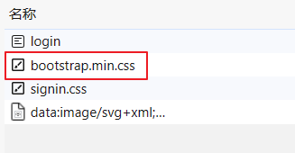

# 第一章 Spring Security 快速入门

**官方文档：**

<https://docs.spring.io/spring-security/reference/index.html>

**功能：**

- 身份认证（authentication）
- 授权（authorization）
- 防御常见攻击（protection against common attacks）

**身份认证：**

- 身份认证是验证`谁正在访问系统资源`，判断用户是否为合法用户。认证用户的常见方式是要求用户输入用户名和密码。

**授权：**

- 用户进行身份认证后，系统会控制`谁能访问哪些资源`，这个过程叫做授权。用户无法访问没有权限的资源。

**防御常见攻击：**

- CSRF
- HTTP Headers
- HTTP Requests

## 1、身份认证（authentication）

**官方代码示例：**[GitHub - spring-projects/spring-security-samples](https://github.com/spring-projects/spring-security-samples/tree/main)

### 1.1、创建Spring Boot项目

项目名：security-demo

JDK：17

SpringBoot：3.2.0（依赖了Spring Security 6.2.0）

Dependencies：Spring Web、Spring Security、Thymeleaf

### 1.2、创建IndexController

```java
package com.atguigu.securitydemo.controller;

@Controller
public class IndexController {

    @GetMapping("/")
    public String index() {
        return "index";
    }
}
```

### 1.3、创建index.html

在路径resources/templates中创建index.html

```html
<html xmlns:th="https://www.thymeleaf.org">
<head>
  <title>Hello Security!</title>
</head>
<body>
<h1>Hello Security</h1>
<!--通过使用@{/logout}，Thymeleaf将自动处理生成正确的URL，以适应当前的上下文路径。
这样，无论应用程序部署在哪个上下文路径下，生成的URL都能正确地指向注销功能。-->
<a th:href="@{/logout}">Log Out</a>
</body>
</html>
```

### 1.4、启动项目测试Controller

浏览器中访问：<http://localhost:8080/>

**浏览器自动跳转到登录页面：**<http://localhost:8080/login>


输入用户名：user

输入密码：在控制台的启动日志中查找初始的默认密码

点击"Sign in"进行登录，浏览器就跳转到了index页面

### 1.5、注意事项

#### 1.5.1、@{/logout}的作用

通过使用@{/logout}，Thymeleaf将自动处理生成正确的URL，以适应当前的上下文路径。这样，无论应用程序部署在哪个上下文路径下，生成的URL都能正确地指向注销功能。

例如：如果我们在配置文件中添加如下内容

```yaml
server.servlet.context-path=/demo
```

那么@{/logout}可以自动处理url为正确的相对路径

但是如果是普通的/logout，路径就会不正确

#### 1.5.2、页面样式无法加载的问题

页面样式bootstrap.min.css是一个CDN地址，需要通过科学上网的方式访问



否则你的登录页会加载很久，并且看到的页面是这样的（登录按钮没有样式文件渲染，但是不影响登录功能的执行）


### 1.6、Spring Security默认做了什么

- 保护应用程序URL，要求对应用程序的任何交互进行身份验证。
- 程序启动时生成一个默认用户“user”。
- 生成一个默认的随机密码，并将此密码记录在控制台上。
- 生成默认的登录表单和注销页面。
- 提供基于表单的登录和注销流程。
- 对于Web请求，重定向到登录页面；
- 对于服务请求，返回401未经授权。
- 处理跨站请求伪造（CSRF）攻击。
- 处理会话劫持攻击。
- 写入Strict-Transport-Security以确保HTTPS。
- 写入X-Content-Type-Options以处理嗅探攻击。
- 写入Cache Control头来保护经过身份验证的资源。
- 写入X-Frame-Options以处理点击劫持攻击。

## 2、Spring Security 的底层原理

**官方文档：**[Spring Security的底层原理](https://docs.spring.io/spring-security/reference/servlet/architecture.html)

Spring Security之所以默认帮助我们做了那么多事情，它的底层原理是传统的`Servlet过滤器`

### 2.1、Filter

下图展示了处理一个Http请求时，过滤器和Servlet的工作流程：


因此我们可以在过滤器中对请求进行修改或增强。

### 2.2、DelegatingFilterProxy

DelegatingFilterProxy 是 Spring Security 提供的一个 Filter 实现，可以在 Servlet 容器和 Spring 容器之间建立桥梁。通过使用 DelegatingFilterProxy，这样就可以将Servlet容器中的 Filter 实例放在 Spring 容器中管理。


### 2.3、FilterChainProxy

复杂的业务中不可能只有一个过滤器。因此FilterChainProxy是Spring Security提供的一个特殊的Filter，它允许通过SecurityFilterChain将过滤器的工作委托给多个Bean Filter实例。


### 2.4、SecurityFilterChain

SecurityFilterChain 被 FilterChainProxy 使用，负责查找当前的请求需要执行的Security Filter列表。


### 2.5、Multiple SecurityFilterChain

可以有多个SecurityFilterChain的配置，FilterChainProxy决定使用哪个SecurityFilterChain。如果请求的URL是/api/messages/，它首先匹配SecurityFilterChain0的模式/api/\*\*，因此只调用SecurityFilterChain 0。假设没有其他SecurityFilterChain实例匹配，那么将调用SecurityFilterChain n。


## 3、程序的启动和运行

### 3.1、DefaultSecurityFilterChain

SecurityFilterChain接口的实现，加载了默认的16个Filter


### 3.2、SecurityProperties

默认情况下Spring Security将初始的用户名和密码存在了SecurityProperties类中。这个类中有一个静态内部类User，配置了默认的用户名（name = "user"）和密码（password = uuid）


我们也可以将用户名、密码配置在SpringBoot的配置文件中：在application.properties中配置自定义用户名和密码

```properties
spring.security.user.name=user
spring.security.user.password=123
```
