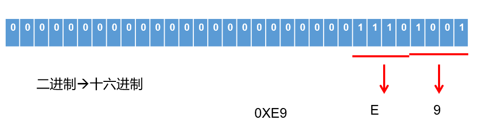
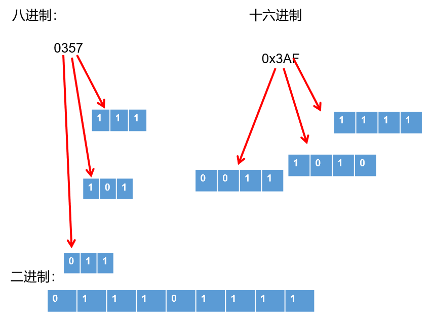

# 操作系统

## 计算机底层的存储数据

计算机世界中只有二进制，所以计算机中存储和运算的`所有数据`都要转为`二进制`。包括数字、字符、图片、声音、视频等。

**世界上有10种人 ，认识和不认识二进制的。**

### 进制的分类

- **十进制（decimal）**
  - 数字组成：0-9
  - 进位规则：满十进一

- **二进制（binary）**
  - 数字组成：0-1
  - 进位规则：满二进一，以 `0b` 或 `0B` 开头

- **八进制（octal）：很少使用**
  - 数字组成：0-7
  - 进位规则：满八进一，以数字 `0` 开头表示

- **十六进制**
  - 数字组成：0-9，a-f
  - 进位规则：满十六进一，以 `0x` 或 `0X` 开头表示。此处的 a-f 不区分大小写

```java
class BinaryTest {
 public static void main(String[] args) {
  
  int num1 = 123;  //十进制
  int num2 = 0b101; //二进制
  int num3 = 0127; //八进制
  int num4 = 0x12aF; //十六进制

  System.out.println(num1);
  System.out.println(num2);
  System.out.println(num3);
  System.out.println(num4);
 }
}
```

### 进制的换算举例

| 十进制 | 二进制 | 八进制 | 十六进制 |
| ------ | ------ | ------ | -------- |
| 0      | 0      | 0      | 0        |
| 1      | 1      | 1      | 1        |
| 2      | 10     | 2      | 2        |
| 3      | 11     | 3      | 3        |
| 4      | 100    | 4      | 4        |
| 5      | 101    | 5      | 5        |
| 6      | 110    | 6      | 6        |
| 7      | 111    | 7      | 7        |
| 8      | 1000   | 10     | 8        |
| 9      | 1001   | 11     | 9        |
| 10     | 1010   | 12     | a或A     |
| 11     | 1011   | 13     | b或B     |
| 12     | 1100   | 14     | c或C     |
| 13     | 1101   | 15     | d或D     |
| 14     | 1110   | 16     | e或E     |
| 15     | 1111   | 17     | f或F     |
| 16     | 10000  | 20     | 10       |

### 二进制的由来

二进制，是计算技术中广泛采用的一种数制，由德国数理哲学大师 `莱布尼茨` 于1679年发明。

二进制数据是用0和1两个数码来表示的数。它的基数为 2，进位规则是 `逢二进一`。

二进制广泛应用于我们生活的方方面面。比如，广泛使用的摩尔斯电码（Morse Code），它由两种基本信号组成：短促的点信号 “`·`”，读“`滴`”；保持一定时间的长信号 “`—`”，读 “`嗒`”。然后，组成了26个字母，从而拼写出相应的单词。


记忆技巧：


我们偶尔会看到的：SOS，即为：


### 二进制转十进制

**二进制如何表示整数？**

- 计算机数据的存储使用二进制 `补码` 形式存储，并且 `最高位是符号位`。
  - 正数：`最高位是0`
  - 负数：`最高位是1`

- 规定
  - 正数的补码与反码、原码一样，称为 `三码合一`
  - 负数的补码与反码、原码不一样：
    - 负数的 `原码`：把十进制转为二进制，然后最高位设置为1
    - 负数的 `反码`：在原码的基础上，最高位不变，其余位取反（0变1,1变0）
    - 负数的 `补码`：反码+1

**二进制转十进制：权相加法**

针对于 byte 数据举例来说：


- 例如：byte 类型（1个字节，8位）

  25 ==> 原码  0001 1001 ==> 反码  0001 1001 -->补码  0001 1001

  -25 ==>原码  1001 1001 ==> 反码1110 0110 ==>补码 1110 0111

```java
整数：
正数：25   00000000 00000000 000000000 00011001（原码）
正数：25   00000000 00000000 000000000 00011001（反码）
正数：25   00000000 00000000 000000000 00011001（补码）

负数：-25  10000000 00000000 000000000 00011001（原码）
负数：-25  11111111 11111111 111111111 11100110（反码）
负数：-25  11111111 11111111 111111111 11100111（补码）
```

**一个字节可以存储的整数范围是多少？**

```java
// 1个字节：8位

0000 0001  ~  0111 111 ==> 1~127

1000 0001 ~ 1111 1111 ==> -127 ~ -1

0000 0000 ==>0

1000 0000 ==> -128（特殊规定）=-127-1
```

### 十进制转二进制

十进制转二进制：`除2取余的逆`


### 二进制与八进制、十六进制间的转换

**二进制转八进制**


**二进制转十六进制**



**八进制、十六进制转二进制**



## 字符集

### 字符集

- **编码与解码**

​ 计算机中储存的信息都是用`二进制数`表示的，而我们在屏幕上看到的数字、英文、标点符号、汉字等字符是二进制数转换之后的结果。按照某种规则，将字符存储到计算机中，称为`编码` 。反之，将存储在计算机中的二进制数按照某种规则解析显示出来，称为`解码` 。

- **字符编码（Character Encoding）** : 就是一套自然语言的字符与二进制数之间的对应规则。

- **字符集**：也叫编码表。是一个系统支持的所有字符的集合，包括各国家文字、标点符号、图形符号、数字等。

### ASCII 码

- ASCII 码（American Standard Code for Information Interchange，美国信息交换标准代码）：上个世纪60年代，美国制定了一套字符编码，对`英语字符`与二进制位之间的关系，做了统一规定。这被称为 ASCII 码。
- ASCII 码用于显示现代英语，主要包括控制字符（回车键、退格、换行键等）和可显示字符（英文大小写字符、阿拉伯数字和西文符号）。
- 基本的 ASCII 字符集，使用7位（bits）表示一个字符（最前面的1位统一规定为0），共`128个`字符。比如：空格“SPACE”是32（二进制00100000），大写的字母A是65（二进制01000001）。
- 缺点：不能表示所有字符。


### ISO-8859-1 字符集

- 拉丁码表，别名 Latin-1，用于显示欧洲使用的语言，包括荷兰语、德语、意大利语、葡萄牙语等
- ISO-8859-1 使用单字节编码，兼容 ASCII 编码。

### GBxxx 字符集

- GB 就是国标的意思，是为了`显示中文`而设计的一套字符集。
- **GB2312**：简体中文码表。一个小于127的字符的意义与原来相同，即向下兼容ASCII码。但两个大于127的字符连在一起时，就表示一个汉字，这样大约可以组合了包含`7000多个简体汉字`，此外数学符号、罗马希腊的字母、日文的假名们都编进去了，这就是常说的"全角"字符，而原来在127号以下的那些符号就叫"半角"字符了。
- **GBK**：最常用的中文码表。是在GB2312标准基础上的扩展规范，使用了`双字节`编码方案，共收录了`21003个`汉字，完全兼容GB2312标准，同时支持`繁体汉字`以及日韩汉字等。
- **GB18030**：最新的中文码表。收录汉字`70244个`，采用`多字节`编码，每个字可以由1个、2个或4个字节组成。支持中国国内少数民族的文字，同时支持繁体汉字以及日韩汉字等。

### Unicode 码

- Unicode 编码为表达`任意语言的任意字符`而设计，也称为统一码、标准万国码。Unicode 将世界上所有的文字用`2个字节`统一进行编码，为每个字符设定唯一的二进制编码，以满足跨语言、跨平台进行文本处理的要求。

- Unicode 的缺点：这里有三个问题：
  - 第一，英文字母只用一个字节表示就够了，如果用更多的字节存储是`极大的浪费`。
  - 第二，如何才能`区别Unicode和ASCII`？计算机怎么知道两个字节表示一个符号，而不是分别表示两个符号呢？
  - 第三，如果和GBK等双字节编码方式一样，用最高位是1或0表示两个字节和一个字节，就少了很多值无法用于表示字符，`不够表示所有字符`。
- Unicode 在很长一段时间内无法推广，直到互联网的出现，为解决Unicode如何在网络上传输的问题，于是面向传输的众多 UTF（UCS Transfer Format）标准出现。具体来说，有三种编码方案，UTF-8、UTF-16和UTF-32。

### UTF-8

- Unicode 是字符集，UTF-8、UTF-16、UTF-32是三种`将数字转换到程序数据`的编码方案。顾名思义，UTF-8 就是每次8个位传输数据，而UTF-16就是每次16个位。其中，UTF-8 是在互联网上`使用最广`的一种 Unicode 的实现方式。
- 互联网工程工作小组（IETF）要求所有互联网协议都必须支持UTF-8编码。所以，我们开发Web应用，也要使用UTF-8编码。UTF-8 是一种`变长的编码方式`。它可以使用 1-4 个字节表示一个符号它使用一至四个字节为每个字符编码，编码规则：
  1. 128个US-ASCII字符，只需一个字节编码。
  2. 拉丁文等字符，需要二个字节编码。
  3. 大部分常用字（含中文），使用三个字节编码。
  4. 其他极少使用的Unicode辅助字符，使用四字节编码。

- 举例

​ Unicode符号范围  | UTF-8编码方式

> (十六进制)           | （二进制）
>
> ————————————————————|—–—–—–—–—–—–—–—–—–—–—–—–—–—–
>
> 0000 0000-0000 007F | 0xxxxxxx（兼容原来的ASCII）
>
> 0000 0080-0000 07FF | 110xxxxx 10xxxxxx
>
> 0000 0800-0000 FFFF | 1110xxxx 10xxxxxx 10xxxxxx
>
> 0001 0000-0010 FFFF | 11110xxx 10xxxxxx 10xxxxxx 10xxxxxx


### 小结


> 注意：在中文操作系统上，ANSI（美国国家标准学会、AMERICAN NATIONAL STANDARDS INSTITUTE: ANSI）编码即为GBK；在英文操作系统上，ANSI编码即为ISO-8859-1。
